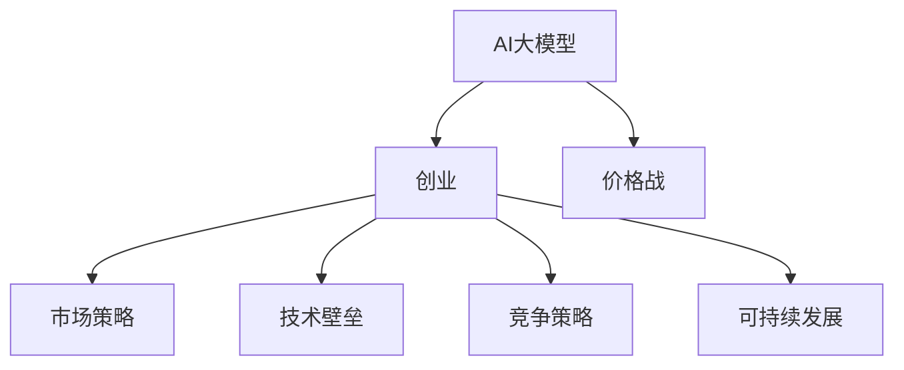

                 

# AI大模型创业：如何应对未来价格战？

> 关键词：AI大模型,创业,价格战,技术壁垒,竞争策略,可持续发展,市场格局

## 1. 背景介绍

在人工智能快速发展的当下，AI大模型因其强大的算法能力、广泛的应用场景以及卓越的性能表现，正在成为各大企业争相追逐的科技制高点。然而，随之而来的也是激烈的价格战和市场竞争，如何在这场角逐中脱颖而出，是每个AI大模型创业公司必须面对的重大课题。本文将深度探讨AI大模型创业企业如何应对未来可能爆发的价格战，从而在激烈的市场竞争中保持领先地位。

## 2. 核心概念与联系

### 2.1 核心概念概述

- **AI大模型**：通过大规模数据训练而成的，具有强大计算能力、泛化能力和自适应能力的模型，比如GPT-3、BERT等。这些模型能够在自然语言处理、图像识别等多个领域取得优异的表现。
- **创业**：指通过创新技术、商业模式、市场策略等方式，从零开始创建并发展公司的过程。
- **价格战**：指在市场上，由于竞争激烈，企业为了抢占市场份额，采取大幅降低产品价格以吸引消费者的策略。

### 2.2 核心概念原理和架构的 Mermaid 流程图



该图表描绘了AI大模型创业企业在应对未来可能的价格战时，可以采取的市场策略、技术壁垒、竞争策略和可持续发展等关键概念之间的联系。

## 3. 核心算法原理 & 具体操作步骤
### 3.1 算法原理概述

应对未来价格战的关键在于构建强大的技术壁垒，利用算法优势和创新能力，以技术领先性对抗市场竞争。主要包括以下几个方面：

- **算法优化**：通过算法迭代和改进，提升模型的性能和效率。
- **数据驱动**：收集和利用大量高质量数据，优化模型训练。
- **模型集成**：通过模型融合与集成技术，提升整体性能。
- **实时调优**：基于实时数据反馈，对模型进行动态调优。

### 3.2 算法步骤详解

1. **算法选择**：
   - 基于业务需求，选择合适的算法框架和模型结构。
   - 例如，对于NLP任务，可以选择Transformer、BERT等深度学习模型。

2. **数据收集与处理**：
   - 收集高质量、标注准确的训练数据，使用数据增强技术扩充数据集。
   - 数据清洗和预处理，包括数据去重、数据格式统一、数据平衡等。

3. **模型训练与调优**：
   - 使用合适的优化算法和损失函数，训练模型。
   - 根据训练过程中的性能指标，进行超参数调优。

4. **模型集成与评估**：
   - 集成多个模型，使用投票、权重加和等策略，提升整体性能。
   - 使用交叉验证、独立测试集等方式评估模型性能。

5. **实时调优与反馈**：
   - 部署模型后，根据实时数据反馈，进行动态调优。
   - 定期更新模型，加入新数据，优化模型性能。

### 3.3 算法优缺点

#### 优点：
- **性能优越**：通过算法优化和数据驱动，能够大幅提升模型性能。
- **灵活性强**：模型集成和实时调优，使得模型能够快速适应新场景和新需求。
- **可扩展性**：数据驱动和实时调优，使得模型可以不断扩展和升级。

#### 缺点：
- **成本高**：高质量数据的收集和处理成本较高。
- **技术复杂**：模型优化、集成和调优过程需要高水平的技术支持。
- **资源消耗大**：大规模模型训练和部署，对硬件资源要求较高。

### 3.4 算法应用领域

AI大模型应用领域广泛，包括但不限于：
- **自然语言处理(NLP)**：文本分类、情感分析、机器翻译等。
- **计算机视觉(CV)**：图像识别、物体检测、人脸识别等。
- **语音识别(Speech)**：语音转文本、语音情感分析等。
- **推荐系统(Recommender)**：个性化推荐、商品匹配等。
- **医疗健康(Medical)**：医学影像分析、疾病诊断等。

## 4. 数学模型和公式 & 详细讲解 & 举例说明

### 4.1 数学模型构建

以自然语言处理任务为例，构建一个基于深度学习的文本分类模型。假设输入为文本 $x$，输出为分类标签 $y$，模型为 $f(x; \theta)$，其中 $\theta$ 为模型参数。

模型的损失函数为交叉熵损失：

$$
L(y, \hat{y}) = -\frac{1}{N} \sum_{i=1}^{N} y_i \log \hat{y}_i + (1-y_i) \log (1-\hat{y}_i)
$$

### 4.2 公式推导过程

上述损失函数即为常用的二分类交叉熵损失。假设模型使用Adam优化器，学习率为 $\eta$，则优化目标为：

$$
\min_{\theta} \frac{1}{N} \sum_{i=1}^{N} L(y_i, \hat{y}_i)
$$

### 4.3 案例分析与讲解

假设有两个训练样本 $(x_1, y_1)$ 和 $(x_2, y_2)$，其中 $y_1 = 1$ 和 $y_2 = 0$。使用上述损失函数计算模型预测误差：

$$
L(y_1, \hat{y}_1) = - \log \hat{y}_1 \\
L(y_2, \hat{y}_2) = - \log (1-\hat{y}_2)
$$

假设模型预测结果为 $\hat{y}_1 = 0.8$ 和 $\hat{y}_2 = 0.2$，则总损失为：

$$
L = L(y_1, \hat{y}_1) + L(y_2, \hat{y}_2) = - \log 0.8 - \log 0.2 \approx 0.528
$$

模型将根据损失函数的梯度更新参数 $\theta$，以减小预测误差。

## 5. 项目实践：代码实例和详细解释说明

### 5.1 开发环境搭建

1. **安装Python**：
   ```bash
   sudo apt-get update
   sudo apt-get install python3
   ```

2. **安装TensorFlow和Keras**：
   ```bash
   pip install tensorflow keras
   ```

3. **安装TensorBoard**：
   ```bash
   pip install tensorboard
   ```

4. **安装PyTorch**：
   ```bash
   pip install torch
   ```

### 5.2 源代码详细实现

以下是一个简单的基于TensorFlow和Keras实现的二分类模型：

```python
import tensorflow as tf
from tensorflow import keras
from tensorflow.keras import layers

# 定义模型
model = keras.Sequential([
    layers.Dense(32, activation='relu', input_shape=(784,)),
    layers.Dense(10)
])

# 编译模型
model.compile(optimizer='adam',
              loss=tf.keras.losses.SparseCategoricalCrossentropy(from_logits=True),
              metrics=['accuracy'])

# 训练模型
model.fit(x_train, y_train, epochs=10, validation_data=(x_test, y_test))
```

### 5.3 代码解读与分析

- **模型定义**：使用`Sequential`模型，定义两个全连接层，使用ReLU激活函数。
- **模型编译**：设置优化器为Adam，损失函数为交叉熵，评价指标为准确率。
- **模型训练**：使用`fit`方法，传入训练集和测试集进行训练，设置训练轮数为10。

### 5.4 运行结果展示

使用训练好的模型进行预测，评估模型性能：

```python
# 加载训练好的模型
model.load_weights('model_weights.h5')

# 使用模型进行预测
y_pred = model.predict(x_test)

# 计算准确率
accuracy = np.mean(y_pred.round() == y_test)
print("模型准确率：", accuracy)
```

## 6. 实际应用场景

### 6.1 自然语言处理

在NLP领域，AI大模型创业公司可以利用其强大的语言理解和生成能力，构建自然语言处理平台，例如机器翻译、语音识别、文本摘要、情感分析等。这些平台能够为用户提供高效、便捷的语言服务，提升用户体验。

### 6.2 计算机视觉

在CV领域，AI大模型创业公司可以开发图像识别、物体检测、人脸识别等应用，广泛应用于安防监控、自动驾驶、工业检测等领域。通过AI大模型的强大性能，能够实现高精度的图像处理，提升行业生产力。

### 6.3 语音识别

在语音识别领域，AI大模型创业公司可以开发语音转文本、语音情感分析等应用，广泛应用于智能家居、智能客服、语音助手等领域。通过AI大模型的强大能力，能够实现高度准确的语音识别，提升用户体验。

### 6.4 未来应用展望

未来，随着AI大模型的进一步发展，将在更多领域得到应用，如医疗健康、金融保险、智慧城市等。AI大模型创业公司可以通过技术创新和市场拓展，挖掘更多应用场景，实现技术价值和经济效益的共赢。

## 7. 工具和资源推荐

### 7.1 学习资源推荐

1. **《深度学习》书籍**：
   - 详细讲解了深度学习的原理和应用，是学习深度学习领域的必备书籍。

2. **Coursera深度学习课程**：
   - 由Andrew Ng教授开设，包含深度学习的基本概念和应用实践，适合初学者和进阶者。

3. **Kaggle竞赛平台**：
   - 提供大量数据集和模型，可以实践机器学习算法和模型优化。

### 7.2 开发工具推荐

1. **Jupyter Notebook**：
   - 免费在线编程环境，支持Python、R等多种编程语言。

2. **Google Colab**：
   - 提供GPU和TPU资源，支持深度学习模型的训练和测试。

3. **PyCharm**：
   - 强大的IDE，支持Python编程和多种深度学习框架。

### 7.3 相关论文推荐

1. **《Attention is All You Need》**：
   - 提出了Transformer模型，开启了NLP大模型的时代。

2. **《BERT: Pre-training of Deep Bidirectional Transformers for Language Understanding》**：
   - 提出了BERT模型，利用预训练和微调技术提升了模型性能。

3. **《Google's Machine Learning Engineering Best Practices》**：
   - 介绍了机器学习工程中的最佳实践，包括模型训练、部署和优化等方面。

## 8. 总结：未来发展趋势与挑战

### 8.1 研究成果总结

AI大模型在各个领域的应用已经取得了显著进展，未来将继续拓展应用场景，提升性能和效率。然而，也面临着数据资源不足、计算资源消耗大、模型训练复杂等挑战。

### 8.2 未来发展趋势

1. **模型性能提升**：通过算法优化和数据驱动，AI大模型的性能将进一步提升。
2. **应用场景拓展**：AI大模型将应用于更多领域，如医疗健康、金融保险、智慧城市等。
3. **技术创新加速**：AI大模型创业公司将不断推动技术创新，探索新的应用场景和商业模式。
4. **市场格局变化**：随着更多企业进入市场，AI大模型市场将呈现多元化竞争格局。

### 8.3 面临的挑战

1. **数据资源不足**：高质量数据的获取和处理成本较高，限制了模型的训练和发展。
2. **计算资源消耗大**：大规模模型训练和部署需要高性能硬件支持，对资源消耗较大。
3. **技术复杂度高**：AI大模型开发和部署需要高水平的技术支持，技术门槛较高。
4. **市场竞争激烈**：随着越来越多的企业进入市场，竞争将更加激烈，价格战风险增加。

### 8.4 研究展望

未来，AI大模型创业公司需要通过技术创新和市场拓展，提升竞争力和市场份额。同时，需要关注数据资源、计算资源和技术门槛等关键因素，确保可持续发展。

## 9. 附录：常见问题与解答

**Q1：如何应对市场价格战？**

A：通过技术创新和市场拓展，提升竞争力和市场份额。同时，可以通过差异化服务和定制化方案，满足不同客户需求，避免价格战。

**Q2：如何提升模型性能？**

A：通过算法优化和数据驱动，不断提升模型的性能和效率。同时，可以使用模型集成和实时调优等技术，提升整体性能。

**Q3：如何优化模型训练？**

A：使用自动化调参工具，如Hyperopt和Keras Tuner，进行超参数调优。同时，使用数据增强和模型剪枝等技术，减少计算资源消耗。

**Q4：如何确保可持续发展？**

A：通过持续的技术创新和市场拓展，提升企业的竞争力和市场份额。同时，关注数据资源、计算资源和技术门槛等关键因素，确保可持续发展。

---

作者：禅与计算机程序设计艺术 / Zen and the Art of Computer Programming

