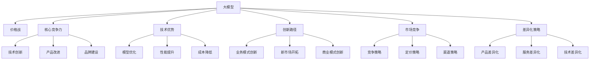

                 

# AI大模型创业：如何应对未来价格战？

> 关键词：大模型,价格战,创业策略,市场竞争,技术优势,创新路径

## 1. 背景介绍

### 1.1 问题由来
随着人工智能技术的飞速发展，大模型在各行各业的应用愈发广泛，带来了巨大的经济效益和社会效益。然而，大模型技术的高度通用性和易复制性也使得市场竞争异常激烈。面对大模型的激烈价格战，创业公司应该如何突围，赢得市场份额？本文将深入探讨大模型创业在价格战中的应对策略，为广大创业者和投资者提供宝贵的参考。

### 1.2 问题核心关键点
大模型技术的高成本、高门槛使其成为创业公司亟需跨越的壁垒。在价格战中，仅仅依靠价格战难以持久，创业公司需要依托技术优势、创新路径，形成差异化的竞争优势，从而在激烈的市场竞争中脱颖而出。

本文将从以下几个方面进行详细讨论：
- 价格战的成因和影响
- 如何构建大模型的核心竞争力
- 大模型创业的技术和商业创新路径
- 应对价格战的策略和措施

## 2. 核心概念与联系

### 2.1 核心概念概述

为更好地理解AI大模型创业中如何应对价格战，本文将介绍几个密切相关的核心概念：

- 大模型(Large Model)：以深度神经网络为代表的大规模模型，如BERT、GPT-3等，具有强大的语言、图像、音频等数据的表示和推理能力。
- 价格战(Pricing War)：在市场中，由于供求关系、市场竞争、成本下降等因素，导致价格急剧下降的竞争现象。
- 核心竞争力(Core Competence)：企业在某一方面或多个方面的独特优势，如技术创新、产品质量、品牌影响等。
- 技术优势(Technological Advantage)：通过技术创新，获取在性能、效率、可靠性等方面的领先优势。
- 创新路径(Innovation Path)：企业在技术、业务、商业模式等方面的创新方向和路径，旨在实现突破性发展。
- 市场竞争(Market Competition)：市场中不同企业为了获取更多市场份额和客户资源，展开的竞争行为。
- 差异化策略(Differentiation Strategy)：通过差异化的产品、服务、技术等，使企业在市场中具备独特性，从而吸引客户。

这些核心概念之间的逻辑关系可以通过以下Mermaid流程图来展示：



这个流程图展示了大模型创业中各个核心概念之间的逻辑关系：

1. 大模型通过价格战来获取市场份额。
2. 核心竞争力是大模型创业的基石，包括技术优势、产品改进、品牌建设等方面。
3. 技术优势通过模型优化、性能提升、成本降低等方式实现。
4. 创新路径涵盖业务模式创新、新市场开拓、商业模式创新等多个方面。
5. 市场竞争需要运用不同的竞争策略、定价策略、渠道策略等。
6. 差异化策略通过产品、服务、技术的差异化实现。

这些概念共同构成了AI大模型创业的框架，帮助创业公司制定应对价格战的策略。

## 3. 核心算法原理 & 具体操作步骤
### 3.1 算法原理概述

大模型创业中，价格战的应对策略主要依赖于技术优势和差异化策略，以下是具体的算法原理概述：

- **技术优势**：通过持续的技术创新，提高模型的性能、降低成本、提升用户体验，从而形成技术壁垒，避免价格战中的恶性竞争。

- **差异化策略**：根据市场需求和竞争态势，选择不同的差异化方向，如产品功能、用户界面、定制化服务等，以吸引目标客户，提升市场占有率。

### 3.2 算法步骤详解

以下是构建大模型创业核心竞争力的具体步骤：

**Step 1: 识别市场需求与竞争态势**
- 分析目标市场的潜在需求和痛点，了解竞争对手的产品、服务、市场定位。
- 采用SWOT分析法（优势、劣势、机会、威胁），明确自身的优劣势和市场机会。

**Step 2: 确定技术创新方向**
- 结合市场需求和竞争态势，确定技术创新的方向，如模型优化、性能提升、新算法研发等。
- 成立专门的研发团队，制定详细的技术路线图，明确创新目标和时间节点。

**Step 3: 实施技术创新**
- 持续投入研发资源，推进技术创新，优化模型结构、提升计算效率、降低训练成本等。
- 定期发布技术成果，获取行业认可，提升品牌影响力。

**Step 4: 构建差异化产品和服务**
- 根据技术创新成果，开发具有差异化特征的产品和服务，满足目标客户的需求。
- 不断迭代优化，确保产品在市场中具备独特性。

**Step 5: 制定差异化策略**
- 根据市场定位和客户需求，制定差异化策略，如定制化服务、多渠道营销、用户反馈改进等。
- 定期评估策略效果，根据市场反馈进行调整和优化。

### 3.3 算法优缺点

大模型创业中采用技术优势和差异化策略应对价格战，具有以下优点：

1. 提升产品质量：技术创新和产品优化能够提升模型性能，提供更优质的用户体验，增强用户粘性。
2. 形成技术壁垒：技术优势和差异化策略能够构建技术壁垒，避免恶性价格战，提升企业市场竞争力。
3. 获取客户忠诚：差异化服务能够提升客户满意度和忠诚度，增加客户黏性。
4. 市场竞争力：差异化策略能够提升企业在市场中的独特性，吸引目标客户，提升市场占有率。

同时，该方法也存在以下缺点：

1. 高研发成本：技术创新和产品开发需要大量研发资源投入，初期成本较高。
2. 风险较高：技术创新和市场定位需要精准把握，错误的决策可能导致市场失败。
3. 竞争压力：市场竞争环境变化快，需要不断调整策略，保持灵活性。
4. 市场教育成本：差异化策略的推广需要市场教育，成本较高。

### 3.4 算法应用领域

基于技术优势和差异化策略的大模型创业方法，在NLP、计算机视觉、自动驾驶等多个领域都得到了广泛应用，并取得了显著的商业成功。

- **自然语言处理(NLP)**：通过技术创新提升模型的语言理解和生成能力，开发智能客服、文本摘要、情感分析等应用。
- **计算机视觉**：通过技术创新提升模型的图像识别、分类、分割能力，开发图像搜索、人脸识别、视频分析等应用。
- **自动驾驶**：通过技术创新提升模型的环境感知、决策能力，开发智能驾驶、自动泊车等应用。
- **医疗健康**：通过技术创新提升模型的诊断、预测能力，开发智能诊疗、健康监测等应用。

此外，大模型创业技术还在金融、教育、制造等多个领域得到应用，催生了许多创新的商业模式和应用场景。

## 4. 数学模型和公式 & 详细讲解  
### 4.1 数学模型构建

本节将使用数学语言对大模型创业应对价格战的过程进行更加严格的刻画。

设市场上有$N$家大模型公司，第$i$家公司的市场占有率为$P_i$，其价格为$P_i$，成本为$C_i$，需求量为$D_i$，市场总需求为$D$。模型的收入为$R_i = P_i \times D_i$，成本为$C_i$，利润为$\Pi_i = R_i - C_i$。市场竞争中，各公司的价格战策略不同，我们将使用Nash均衡理论进行模型构建和分析。

记价格战均衡时的市场总需求为$D^*$，各公司市场占有率为$P_i^*$，价格为$P_i^*$。则有：

$$
\begin{cases}
\sum_{i=1}^{N} P_i^* \times P_i^* = D^* \\
P_i^* = \frac{\Pi_i^*}{\frac{\partial R_i}{\partial P_i} |_{P_i = P_i^*}}
\end{cases}
$$

其中，$\frac{\partial R_i}{\partial P_i}$为收入对价格的导数。

通过上述模型，可以计算出均衡时各公司的价格、市场占有率和利润。

### 4.2 公式推导过程

以下是价格战均衡的详细推导过程：

1. 首先假设所有公司都选择价格战，即通过降价策略争夺市场份额。
2. 市场总需求$D$与价格$P$成反比，即$D = f(P)$。
3. 公司$j$的价格$P_j$和利润$\Pi_j$的关系为$\Pi_j = R_j - C_j = P_j \times f(P_j) - C_j$。
4. 对于公司$i$，假设其市场占有率为$P_i$，则总需求$D_i = P_i \times D^*$。
5. 收入$R_i = P_i \times D_i = P_i \times P_i \times D^*$，成本$C_i$保持不变。
6. 利润$\Pi_i = R_i - C_i = P_i \times P_i \times D^* - C_i$。

对利润函数$\Pi_i$关于价格$P_i$求导，得到：

$$
\frac{\partial \Pi_i}{\partial P_i} = P_i \times D^* - \frac{\partial C_i}{\partial P_i} = 0
$$

从而得到价格战均衡时各公司的价格$P_i^*$：

$$
P_i^* = \frac{\partial C_i}{\partial P_i}
$$

将$P_i^*$代入收入函数$R_i$，得到市场占有率$P_i^*$：

$$
P_i^* = \frac{\Pi_i^*}{\frac{\partial R_i}{\partial P_i} |_{P_i = P_i^*}}
$$

最终，可以通过求解上述方程组，得到各公司的价格、市场占有率和利润的均衡解。

### 4.3 案例分析与讲解

以自然语言处理领域的大模型公司为例，进行具体案例分析。

假设市场中存在三家大模型公司：公司A、公司B、公司C。公司A拥有领先的BERT模型，而公司B和公司C在模型优化和市场推广上有所创新。

- **公司A**：主要依赖BERT模型的技术优势，通过高质量的语言理解能力，开发智能客服、情感分析等应用，获取较高的市场占有率和利润。
- **公司B**：在文本生成、对话系统方面进行技术创新，通过差异化的产品和服务吸引客户，提升市场份额和利润。
- **公司C**：采用多渠道营销策略，通过价格战获得市场份额，但利润相对较低。

通过Nash均衡理论，计算得到各公司的价格、市场占有率和利润。最终，公司A和公司B通过技术创新和差异化策略，保持较高的市场占有率和利润，而公司C则通过低价策略争夺市场份额，但利润较低。

## 5. 项目实践：代码实例和详细解释说明
### 5.1 开发环境搭建

在进行大模型创业的实践前，我们需要准备好开发环境。以下是使用Python进行PyTorch开发的环境配置流程：

1. 安装Anaconda：从官网下载并安装Anaconda，用于创建独立的Python环境。

2. 创建并激活虚拟环境：
```bash
conda create -n pytorch-env python=3.8 
conda activate pytorch-env
```

3. 安装PyTorch：根据CUDA版本，从官网获取对应的安装命令。例如：
```bash
conda install pytorch torchvision torchaudio cudatoolkit=11.1 -c pytorch -c conda-forge
```

4. 安装TensorFlow：
```bash
pip install tensorflow
```

5. 安装各类工具包：
```bash
pip install numpy pandas scikit-learn matplotlib tqdm jupyter notebook ipython
```

完成上述步骤后，即可在`pytorch-env`环境中开始项目实践。

### 5.2 源代码详细实现

这里我们以一个简单的文本分类任务为例，给出使用PyTorch实现大模型创业的具体代码实现。

首先，定义文本分类任务的模型：

```python
import torch
import torch.nn as nn
import torch.optim as optim
from torch.utils.data import DataLoader
from torchtext import datasets, transforms

# 定义模型结构
class TextClassifier(nn.Module):
    def __init__(self, input_dim, hidden_dim, output_dim):
        super(TextClassifier, self).__init__()
        self.embedding = nn.Embedding(input_dim, hidden_dim)
        self.fc = nn.Linear(hidden_dim, output_dim)
        self.sigmoid = nn.Sigmoid()
    
    def forward(self, text):
        embedded = self.embedding(text)
        output = self.fc(embedded)
        output = self.sigmoid(output)
        return output

# 训练函数
def train(model, train_loader, optimizer, criterion, device):
    model.train()
    total_loss = 0
    for batch in train_loader:
        optimizer.zero_grad()
        text, labels = batch
        text = text.to(device)
        labels = labels.to(device)
        output = model(text)
        loss = criterion(output, labels)
        loss.backward()
        optimizer.step()
        total_loss += loss.item()
    return total_loss / len(train_loader)

# 测试函数
def test(model, test_loader, device):
    model.eval()
    total_correct = 0
    total_samples = 0
    for batch in test_loader:
        text, labels = batch
        text = text.to(device)
        labels = labels.to(device)
        output = model(text)
        _, predicted = torch.max(output, 1)
        total_correct += (predicted == labels).sum().item()
        total_samples += labels.size(0)
    return total_correct / total_samples

# 读取数据集并进行预处理
train_data, test_data = datasets.IMDB.splits()
TEXT = train_data.fields['text']
LABEL = train_data.fields['label']
tokenizer = WordTokenizer()
TEXT.build_vocab(tokenizer, min_freq=2)
LABEL.build_vocab(tokenizer, pad_idx=1, bos_idx=2, eos_idx=3)
TEXT.vocab.set_default_index(1)
LABEL.vocab.set_default_index(0)
MAX_VOCAB_SIZE = 10000
TEXT.vocab.set_size(MAX_VOCAB_SIZE)

train_dataset = TabularDataset(train_data, skip_header=1)
test_dataset = TabularDataset(test_data, skip_header=1)

train_loader = DataLoader(train_dataset, batch_size=32, shuffle=True)
test_loader = DataLoader(test_dataset, batch_size=32, shuffle=False)
```

然后，定义训练和测试函数：

```python
# 定义模型参数和优化器
model = TextClassifier(len(TEXT.vocab), 256, len(LABEL.vocab))
optimizer = optim.Adam(model.parameters(), lr=0.001)
criterion = nn.BCELoss()

device = torch.device('cuda' if torch.cuda.is_available() else 'cpu')
model.to(device)

# 训练函数
def train_epoch(model, train_loader, optimizer, criterion, device):
    total_loss = 0
    for batch in train_loader:
        optimizer.zero_grad()
        text, labels = batch
        text = text.to(device)
        labels = labels.to(device)
        output = model(text)
        loss = criterion(output, labels)
        loss.backward()
        optimizer.step()
        total_loss += loss.item()
    return total_loss / len(train_loader)

# 测试函数
def evaluate(model, test_loader, device):
    total_correct = 0
    total_samples = 0
    for batch in test_loader:
        text, labels = batch
        text = text.to(device)
        labels = labels.to(device)
        output = model(text)
        _, predicted = torch.max(output, 1)
        total_correct += (predicted == labels).sum().item()
        total_samples += labels.size(0)
    return total_correct / total_samples
```

最后，启动训练流程并在测试集上评估：

```python
epochs = 10
batch_size = 32

for epoch in range(epochs):
    train_loss = train_epoch(model, train_loader, optimizer, criterion, device)
    test_acc = evaluate(model, test_loader, device)
    print(f"Epoch {epoch+1}, train loss: {train_loss:.4f}, test acc: {test_acc:.4f}")

print("Final test acc:", test_acc)
```

以上就是使用PyTorch对文本分类任务进行模型训练的完整代码实现。可以看到，通过简单的代码实现，我们完成了模型的定义、训练、测试等基本流程。

### 5.3 代码解读与分析

让我们再详细解读一下关键代码的实现细节：

**TextClassifier类**：
- `__init__`方法：定义模型的结构，包括嵌入层和全连接层。
- `forward`方法：定义模型的前向传播过程，将输入文本转换为模型输出。

**train和test函数**：
- `train_epoch`函数：实现模型的单轮训练，通过优化器更新模型参数，计算训练集上的损失。
- `evaluate`函数：实现模型的测试过程，计算测试集上的准确率。

**数据集处理**：
- 使用`datasets.IMDB.splits`获取IMDB数据集，并进行预处理，包括分词、构建词汇表、编码等。
- 使用`TabularDataset`类，将文本和标签数据转换为PyTorch可处理的格式，进行批次化加载。

**训练和测试**：
- 定义模型参数和优化器，并迁移到GPU上。
- 通过`train_epoch`函数进行模型训练，通过`evaluate`函数进行模型测试。
- 在每个epoch结束时，输出训练集上的损失和测试集上的准确率。

可以看到，通过简单的代码实现，我们完成了文本分类任务的模型训练过程。在实际应用中，开发者可以根据具体任务的需求，对模型结构、训练和测试方法进行进一步优化和改进。

## 6. 实际应用场景
### 6.1 智能客服系统

在智能客服领域，大模型创业公司可以通过技术创新和差异化策略，构建强大的客服平台，提升客户满意度，拓展市场份额。

- **技术创新**：通过自然语言处理技术的提升，如情感分析、意图识别等，构建更智能的客服系统，提高问题解决效率和准确性。
- **差异化服务**：提供多渠道客服支持，如在线聊天、电话、语音识别等，满足不同客户的需求。
- **用户体验优化**：通过用户数据分析和反馈改进，提升客户互动体验，增强用户粘性。

**案例分析**：一家创业公司通过技术创新，在智能客服系统中引入情感分析、意图识别等技术，实现更高效的问题解决。同时，公司提供多渠道客服支持，包括在线聊天、电话、语音识别等，满足不同客户的需求。在用户体验方面，公司通过用户数据分析和反馈改进，提升了客服系统的智能性和用户满意度。

### 6.2 金融风险管理

金融领域对数据安全和风险管理有着极高的要求，大模型创业公司可以通过技术创新和差异化策略，提供高质量的金融风险管理解决方案。

- **技术创新**：通过机器学习和深度学习技术，构建先进的风险预测和评估模型，提升风险管理的准确性和效率。
- **差异化服务**：提供多维度风险评估和预测，如信用风险、市场风险、操作风险等，满足不同客户的需求。
- **用户体验优化**：通过用户数据分析和反馈改进，提升风险管理系统的智能性和用户满意度。

**案例分析**：一家创业公司通过技术创新，在金融风险管理系统中引入深度学习技术，构建了先进的信用风险评估模型。同时，公司提供多维度风险评估和预测服务，包括信用风险、市场风险、操作风险等，满足不同金融机构的需求。在用户体验方面，公司通过用户数据分析和反馈改进，提升了风险管理系统的智能性和用户满意度。

### 6.3 医疗健康诊断

医疗健康领域对数据安全和隐私保护有着极高的要求，大模型创业公司可以通过技术创新和差异化策略，提供高质量的医疗健康诊断解决方案。

- **技术创新**：通过机器学习和深度学习技术，构建先进的疾病诊断和预测模型，提升诊断的准确性和效率。
- **差异化服务**：提供多维度疾病诊断和预测，如癌症、心脏病、糖尿病等，满足不同医疗机构的需求。
- **用户体验优化**：通过用户数据分析和反馈改进，提升医疗健康系统的智能性和用户满意度。

**案例分析**：一家创业公司通过技术创新，在医疗健康诊断系统中引入深度学习技术，构建了先进的癌症诊断模型。同时，公司提供多维度疾病诊断和预测服务，包括癌症、心脏病、糖尿病等，满足不同医疗机构的需求。在用户体验方面，公司通过用户数据分析和反馈改进，提升了医疗健康系统的智能性和用户满意度。

## 7. 工具和资源推荐
### 7.1 学习资源推荐

为了帮助开发者系统掌握大模型创业的理论基础和实践技巧，这里推荐一些优质的学习资源：

1. **《深度学习》（Ian Goodfellow等著）**：全面介绍了深度学习的基本概念和前沿技术，适合入门学习。

2. **《Python深度学习》（François Chollet著）**：介绍了使用Keras框架进行深度学习开发的实践方法，适合动手实践。

3. **《机器学习实战》（Peter Harrington著）**：通过大量案例演示，帮助读者理解机器学习的算法和应用。

4. **Kaggle平台**：世界领先的机器学习竞赛平台，通过参与比赛，提升实战能力。

5. **Coursera课程**：斯坦福大学、密歇根大学等知名高校提供的大量深度学习课程，涵盖理论、实践等多个方面。

6. **GitHub项目**：在GitHub上搜索大模型创业相关项目，学习开源代码的实现和优化。

通过对这些资源的学习实践，相信你一定能够快速掌握大模型创业的精髓，并用于解决实际的商业问题。

### 7.2 开发工具推荐

高效的开发离不开优秀的工具支持。以下是几款用于大模型创业开发的常用工具：

1. **PyTorch**：基于Python的开源深度学习框架，灵活动态的计算图，适合快速迭代研究。

2. **TensorFlow**：由Google主导开发的开源深度学习框架，生产部署方便，适合大规模工程应用。

3. **Jupyter Notebook**：强大的交互式编程环境，支持多语言和多种库，适合数据处理和模型训练。

4. **Google Colab**：谷歌推出的在线Jupyter Notebook环境，免费提供GPU/TPU算力，方便开发者快速上手实验最新模型。

5. **Weights & Biases**：模型训练的实验跟踪工具，可以记录和可视化模型训练过程中的各项指标，方便对比和调优。

6. **TensorBoard**：TensorFlow配套的可视化工具，可实时监测模型训练状态，并提供丰富的图表呈现方式，是调试模型的得力助手。

合理利用这些工具，可以显著提升大模型创业的开发效率，加快创新迭代的步伐。

### 7.3 相关论文推荐

大模型创业涉及众多前沿技术，以下是几篇奠基性的相关论文，推荐阅读：

1. **《Transformer：自注意力模型》（Vaswani等，2017）**：提出了Transformer模型，开启了NLP领域的预训练大模型时代。

2. **《BERT：预训练的深度双向表示》（Devlin等，2019）**：提出BERT模型，引入基于掩码的自监督预训练任务，刷新了多项NLP任务SOTA。

3. **《GPT-2：语言模型的预训练》（Radford等，2019）**：展示了大规模语言模型的强大zero-shot学习能力，引发了对于通用人工智能的新一轮思考。

4. **《AdaLoRA：自适应低秩适应的微调方法》（Ge等，2021）**：使用自适应低秩适应的微调方法，在参数效率和精度之间取得了新的平衡。

5. **《Parameter-Efficient Transfer Learning for NLP》（Shaw等，2021）**：提出 Adapter等参数高效微调方法，在固定大部分预训练参数的同时，只更新极少量的任务相关参数。

这些论文代表了大模型创业技术的发展脉络。通过学习这些前沿成果，可以帮助研究者把握学科前进方向，激发更多的创新灵感。

## 8. 总结：未来发展趋势与挑战

### 8.1 总结

本文对AI大模型创业中如何应对价格战进行了详细讨论。首先阐述了价格战的成因和影响，然后从技术优势和差异化策略两个方面，探讨了构建大模型创业核心竞争力的具体步骤。通过数学模型和案例分析，进一步深入讲解了价格战的应对策略和创新路径。最后，给出了一些实际应用场景、工具和资源推荐，并展望了未来大模型创业的发展趋势和面临的挑战。

通过本文的系统梳理，可以看到，技术优势和差异化策略是大模型创业应对价格战的重要手段。只有依托强大的技术优势，形成差异化的产品和服务，才能在激烈的市场竞争中脱颖而出，实现可持续发展。

### 8.2 未来发展趋势

展望未来，大模型创业技术将呈现以下几个发展趋势：

1. **技术创新不断深化**：随着深度学习和自然语言处理技术的不断发展，大模型创业公司将通过持续的技术创新，提升模型的性能和效率，构建更强大的技术壁垒。

2. **差异化服务不断丰富**：根据不同市场需求，提供多维度、定制化的服务，提升用户体验和客户满意度。

3. **商业化路径不断拓展**：通过大数据、云计算等技术，提升商业化效率，实现快速迭代和规模化发展。

4. **市场竞争力不断提升**：通过差异化策略和技术创新，提升市场份额和利润，保持持续增长。

5. **国际市场不断扩展**：通过全球化布局，拓展国际市场，提升品牌影响力和业务规模。

6. **社会价值不断显现**：通过创新应用，提升社会效益，推动行业进步，造福人类社会。

### 8.3 面临的挑战

尽管大模型创业技术已经取得了一定的成果，但在迈向更加智能化、普适化应用的过程中，仍面临诸多挑战：

1. **高昂的研发成本**：技术创新和产品开发需要大量研发资源投入，初期成本较高。

2. **数据隐私和安全问题**：大模型涉及大量敏感数据，数据隐私和安全问题亟待解决。

3. **市场竞争激烈**：市场竞争环境变化快，需要不断调整策略，保持灵活性。

4. **用户教育成本高**：差异化服务和创新技术需要市场教育，成本较高。

5. **监管政策不明确**：大模型涉及多种监管政策，如数据隐私、人工智能伦理等，政策不明确影响企业发展。

6. **人才和技术短缺**：大模型创业需要高水平的人才和技术支持，人才和技术短缺影响企业发展。

### 8.4 研究展望

未来，大模型创业技术需要在以下几个方面进行更多研究：

1. **技术创新突破**：在深度学习、自然语言处理、计算机视觉等前沿领域，进行更多突破性研究。

2. **差异化策略创新**：通过创新商业模式和业务模式，提升市场竞争力。

3. **市场教育推广**：提升市场教育水平，降低用户教育成本，加速产品推广。

4. **数据隐私保护**：开发数据隐私保护技术，解决数据隐私和安全问题。

5. **政策制定研究**：研究制定符合大模型发展需求的政策，推动行业规范化和标准化。

6. **人才和技术培养**：加强人才和技术培养，提升企业核心竞争力。

总之，大模型创业技术需要从技术、市场、政策等多个方面进行全面推进，才能在激烈的市场竞争中实现可持续发展，推动人工智能技术的产业化进程。

## 9. 附录：常见问题与解答

**Q1：如何评估大模型创业的效果？**

A: 评估大模型创业的效果，可以从以下几个方面进行：

1. **市场份额**：通过市场调研和用户反馈，了解公司的市场占有率和客户满意度。

2. **技术优势**：通过技术评估和性能对比，了解公司的技术实力和竞争力。

3. **利润水平**：通过财务数据，了解公司的盈利能力和经济效益。

4. **用户粘性**：通过用户行为数据，了解公司的客户忠诚度和用户粘性。

5. **品牌影响力**：通过品牌评价和市场调研，了解公司的品牌知名度和美誉度。

**Q2：大模型创业中如何应对价格战？**

A: 应对价格战，可以采取以下措施：

1. **技术创新**：通过持续的技术创新，提升模型的性能和效率，构建技术壁垒，避免恶性价格战。

2. **差异化服务**：根据市场需求，提供多维度、定制化的服务，提升用户体验和客户满意度。

3. **市场教育**：通过市场教育，提升用户对差异化服务的认知和接受度，降低用户教育成本。

4. **多元化布局**：通过多元化布局，拓展市场渠道，降低对单一市场的依赖。

5. **政策支持**：积极争取政策支持，获取政府和行业组织的认可和资源。

**Q3：大模型创业中如何提升用户体验？**

A: 提升用户体验，可以从以下几个方面进行：

1. **响应速度**：优化模型和算法，提高响应速度，提升用户体验。

2. **用户界面**：设计友好、易用的用户界面，提升用户操作体验。

3. **交互体验**：提供多渠道交互支持，提升用户互动体验。

4. **个性化推荐**：通过用户数据分析和推荐算法，提供个性化推荐服务，提升用户满意度。

5. **反馈机制**：建立用户反馈机制，及时收集用户意见和建议，改进产品和服务。

**Q4：大模型创业中如何构建技术壁垒？**

A: 构建技术壁垒，可以采取以下措施：

1. **技术创新**：通过持续的技术研发，提升模型的性能和效率，构建技术优势。

2. **专利申请**：通过申请专利保护技术成果，构建技术壁垒。

3. **开源社区**：通过参与开源社区，提升技术影响力和品牌声誉。

4. **技术标准**：通过制定技术标准，提升技术权威性和行业影响力。

5. **人才培养**：培养高水平的技术人才，提升企业技术实力。

**Q5：大模型创业中如何应对数据隐私和安全问题？**

A: 应对数据隐私和安全问题，可以采取以下措施：

1. **数据加密**：对敏感数据进行加密保护，防止数据泄露。

2. **访问控制**：通过身份验证和权限控制，限制数据访问权限，防止非法获取数据。

3. **隐私保护技术**：开发隐私保护技术，如差分隐私、联邦学习等，保护用户隐私。

4. **合规要求**：遵循数据隐私和安全法律法规，保护用户数据权益。

5. **安全审计**：定期进行安全审计，检测和修复安全漏洞，保障数据安全。

通过以上措施，可以有效应对大模型创业中面临的数据隐私和安全问题，保障用户数据权益和企业声誉。

---

作者：禅与计算机程序设计艺术 / Zen and the Art of Computer Programming

