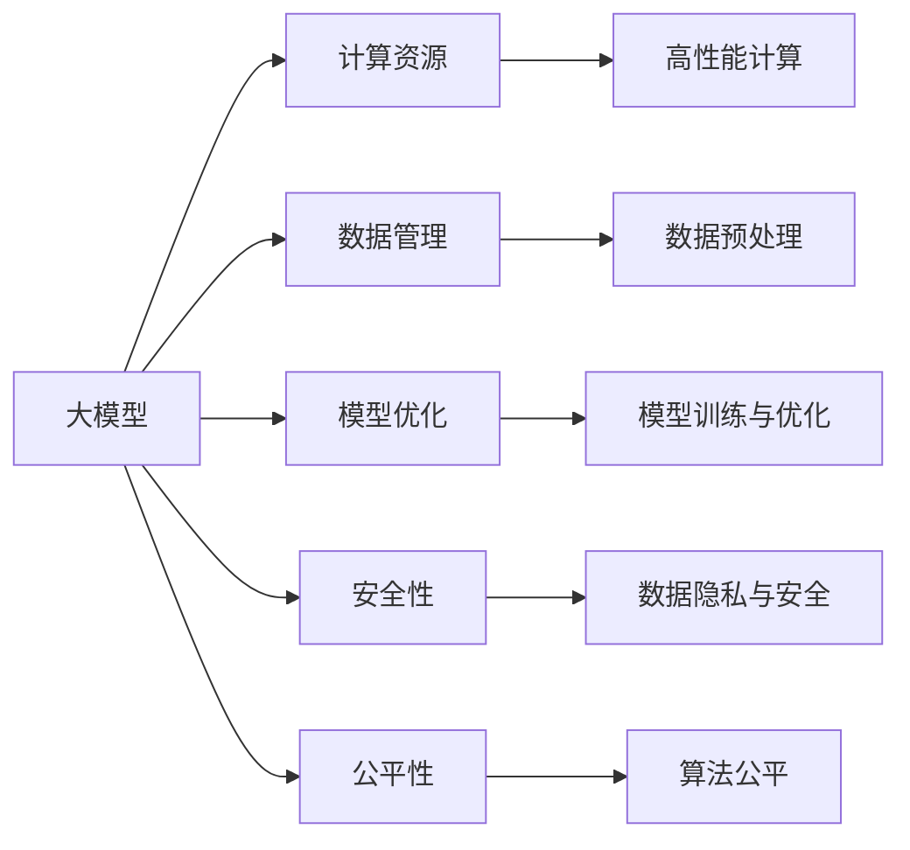

                 

# AI大模型创业：如何应对未来技术挑战？

> 关键词：AI创业, 大模型, 技术挑战, 数据管理, 模型优化, 安全性, 公平性

## 1. 背景介绍

### 1.1 问题由来
近年来，人工智能技术迅速发展，大模型成为引领AI应用的核心技术之一。随着深度学习框架和算力的提升，大模型的规模不断扩大，应用领域也逐步扩展到自然语言处理(NLP)、计算机视觉(CV)、语音识别(SR)等多个领域。企业通过大模型创业，在技术研发和应用落地方面取得了显著成果，吸引了大量资本的关注。

然而，大模型的开发和应用也面临着诸多挑战。一方面，大模型所需的高性能硬件和海量数据资源成为企业运营的重要成本；另一方面，模型复杂性提升使得开发和维护成本也随之增加。此外，大模型的安全性和公平性问题，以及模型在不同场景下的性能泛化能力，也亟需关注和解决。

本文将从大模型创业的视角，探讨如何应对未来技术挑战，提升模型性能，增强应用的安全性和公平性。

## 2. 核心概念与联系

### 2.1 核心概念概述

为了更好地理解大模型创业的技术挑战，我们首先需要介绍几个关键概念：

- **大模型（Big Models）**：指具有超大规模参数量的模型，如BERT、GPT-3等，这些模型在大规模数据上进行预训练，具备强大的泛化能力和应用潜力。
- **技术挑战（Technical Challenges）**：包括计算资源、数据管理、模型优化、安全性和公平性等问题，这些挑战是大模型创业中必须克服的重要障碍。
- **创业（Startup）**：指企业通过创新技术实现商业化应用的过程，大模型创业即为基于大模型的技术创新和市场推广。

### 2.2 核心概念原理和架构的 Mermaid 流程图



这个流程图展示了大模型创业过程中各个环节的联系。大模型开发需要高性能计算资源，同时依赖于海量数据进行预训练和优化；数据管理和大模型训练需要投入大量时间和精力，安全性与公平性问题也需系统化解决。

## 3. 核心算法原理 & 具体操作步骤
### 3.1 算法原理概述

大模型创业的核心算法原理主要包括以下几个方面：

- **模型架构与优化**：选择合适的模型架构（如Transformer、RNN等），进行参数优化和超参数调优，提升模型性能。
- **数据预处理与增强**：通过数据清洗、标注和增强等技术，提高数据质量，增加数据多样性，从而提升模型泛化能力。
- **计算资源优化**：使用高效的计算框架和硬件配置，优化模型训练和推理过程，降低计算成本。
- **安全性与公平性保障**：采用数据加密、模型脱敏、对抗训练等技术，确保模型训练和应用过程中的数据安全与模型公平。

### 3.2 算法步骤详解

以下是基于大模型创业的核心算法步骤：

**Step 1: 数据准备与预处理**
- 收集与清洗数据：根据应用需求，收集相关领域的标注数据和无标注数据。对数据进行清洗，去除噪声和异常值。
- 数据增强：通过数据扩充、标签增强、回译等方式，增加数据样本的多样性和数量，提升模型泛化能力。

**Step 2: 模型选择与训练**
- 选择模型架构：根据任务特点，选择适合的模型架构，如BERT、GPT等。
- 参数优化：使用SGD、Adam等优化算法进行模型训练，选择合适的学习率和批大小。
- 超参数调优：使用网格搜索或贝叶斯优化等方法，调整模型超参数，优化模型性能。

**Step 3: 计算资源优化**
- 硬件选择：根据任务需求，选择合适的计算硬件（如GPU、TPU等）。
- 计算框架：使用深度学习框架（如PyTorch、TensorFlow等）进行模型训练和推理，优化计算效率。
- 分布式训练：采用分布式训练技术，利用多台计算资源并行计算，加速模型训练。

**Step 4: 模型评估与安全测试**
- 评估模型性能：使用交叉验证等方法，评估模型在训练集和测试集上的表现。
- 安全与公平性测试：进行数据隐私与模型公平性测试，确保模型输出符合法律法规和伦理道德。

**Step 5: 部署与应用**
- 模型部署：将训练好的模型部署到服务器或云平台，提供API接口供用户调用。
- 应用开发：开发与大模型接口集成的应用软件，提升用户体验。
- 用户反馈：收集用户反馈，持续优化模型和应用。

### 3.3 算法优缺点

大模型创业的算法具有以下优点：

- **泛化能力强**：大模型通过大规模数据预训练，具备较强的泛化能力，适应性广，适用于多个领域。
- **开发效率高**：利用现有的深度学习框架和计算资源，可以快速开发和部署大模型应用。
- **性能优越**：经过预训练和微调的大模型，通常具有较高的准确率和鲁棒性。

同时，这些算法也存在一些缺点：

- **资源需求高**：大模型需要高性能计算资源和大规模数据，企业运营成本较高。
- **模型复杂性高**：大模型结构复杂，开发和维护难度较大。
- **应用场景受限**：尽管大模型性能优越，但在某些特定场景下，小模型或专门定制的模型可能更适用。

### 3.4 算法应用领域

大模型创业的算法在多个领域均有广泛应用，例如：

- **自然语言处理（NLP）**：如文本分类、命名实体识别、情感分析、机器翻译等。
- **计算机视觉（CV）**：如图像分类、目标检测、图像生成等。
- **语音识别（SR）**：如语音识别、语音合成、情感分析等。
- **推荐系统**：如商品推荐、音乐推荐、新闻推荐等。
- **智能客服**：如自动回复、对话生成、客户意图理解等。
- **智能安防**：如人脸识别、行为分析、异常检测等。

## 4. 数学模型和公式 & 详细讲解 & 举例说明

### 4.1 数学模型构建

大模型创业的数学模型通常包含以下几个部分：

- **输入表示**：将输入数据转换为模型可以处理的向量表示。
- **模型架构**：如卷积神经网络（CNN）、递归神经网络（RNN）、Transformer等。
- **损失函数**：用于衡量模型输出与真实标签之间的差异，如交叉熵损失、均方误差损失等。
- **优化算法**：如梯度下降、Adam、Adagrad等。

### 4.2 公式推导过程

以深度学习中常用的交叉熵损失函数为例，推导其公式：

$$
L = -\frac{1}{N} \sum_{i=1}^{N} \sum_{j=1}^{C} y_j \log(p_j)
$$

其中，$N$为样本数量，$C$为类别数量，$y_j$为真实标签，$p_j$为模型输出的概率。

通过反向传播算法，计算损失函数对模型参数的梯度，更新模型参数，从而优化模型性能。

### 4.3 案例分析与讲解

以下是一个简单的图像分类任务中的数学模型构建和推导过程：

**输入表示**：将图像像素值转换为向量表示。

**模型架构**：使用卷积神经网络（CNN）进行特征提取。

**损失函数**：使用交叉熵损失函数进行优化。

**优化算法**：使用Adam算法进行参数更新。

```python
import torch
import torch.nn as nn
import torch.optim as optim

# 定义模型架构
class CNN(nn.Module):
    def __init__(self):
        super(CNN, self).__init__()
        self.conv1 = nn.Conv2d(3, 32, kernel_size=3, stride=1, padding=1)
        self.conv2 = nn.Conv2d(32, 64, kernel_size=3, stride=1, padding=1)
        self.fc1 = nn.Linear(64 * 28 * 28, 128)
        self.fc2 = nn.Linear(128, 10)
        
    def forward(self, x):
        x = nn.functional.relu(self.conv1(x))
        x = nn.functional.max_pool2d(x, 2)
        x = nn.functional.relu(self.conv2(x))
        x = nn.functional.max_pool2d(x, 2)
        x = x.view(-1, 64 * 28 * 28)
        x = nn.functional.relu(self.fc1(x))
        x = self.fc2(x)
        return nn.functional.log_softmax(x, dim=1)

# 加载数据集
train_data = ...
test_data = ...

# 定义模型、优化器和损失函数
model = CNN()
optimizer = optim.Adam(model.parameters(), lr=0.001)
criterion = nn.CrossEntropyLoss()

# 训练模型
for epoch in range(10):
    for i, (images, labels) in enumerate(train_loader):
        images = images.to(device)
        labels = labels.to(device)
        optimizer.zero_grad()
        outputs = model(images)
        loss = criterion(outputs, labels)
        loss.backward()
        optimizer.step()
```

## 5. 项目实践：代码实例和详细解释说明

### 5.1 开发环境搭建

为了进行大模型创业的项目实践，我们需要准备以下开发环境：

- **Python环境**：安装Python 3.7及以上版本。
- **深度学习框架**：安装TensorFlow、PyTorch等深度学习框架。
- **计算资源**：选择合适的计算硬件（如GPU、TPU等）。
- **数据集**：准备并清洗相关领域的数据集。
- **软件工具**：安装必要的开发工具（如Jupyter Notebook、Git等）。

### 5.2 源代码详细实现

以下是一个基于PyTorch的图像分类任务的源代码实现：

```python
import torch
import torch.nn as nn
import torch.optim as optim
from torchvision import datasets, transforms

# 定义模型架构
class CNN(nn.Module):
    def __init__(self):
        super(CNN, self).__init__()
        self.conv1 = nn.Conv2d(3, 32, kernel_size=3, stride=1, padding=1)
        self.conv2 = nn.Conv2d(32, 64, kernel_size=3, stride=1, padding=1)
        self.fc1 = nn.Linear(64 * 28 * 28, 128)
        self.fc2 = nn.Linear(128, 10)
        
    def forward(self, x):
        x = nn.functional.relu(self.conv1(x))
        x = nn.functional.max_pool2d(x, 2)
        x = nn.functional.relu(self.conv2(x))
        x = nn.functional.max_pool2d(x, 2)
        x = x.view(-1, 64 * 28 * 28)
        x = nn.functional.relu(self.fc1(x))
        x = self.fc2(x)
        return nn.functional.log_softmax(x, dim=1)

# 加载数据集
train_data = datasets.CIFAR10(root='data', train=True, download=True, transform=transforms.ToTensor())
test_data = datasets.CIFAR10(root='data', train=False, download=True, transform=transforms.ToTensor())

# 定义模型、优化器和损失函数
model = CNN().to(device)
optimizer = optim.Adam(model.parameters(), lr=0.001)
criterion = nn.CrossEntropyLoss().to(device)

# 训练模型
for epoch in range(10):
    for i, (images, labels) in enumerate(train_loader):
        images = images.to(device)
        labels = labels.to(device)
        optimizer.zero_grad()
        outputs = model(images)
        loss = criterion(outputs, labels)
        loss.backward()
        optimizer.step()

# 测试模型
test_loader = ...
with torch.no_grad():
    correct = 0
    total = 0
    for images, labels in test_loader:
        images = images.to(device)
        labels = labels.to(device)
        outputs = model(images)
        _, predicted = torch.max(outputs.data, 1)
        total += labels.size(0)
        correct += (predicted == labels).sum().item()
    print('Accuracy: {:.2f}%'.format(100 * correct / total))
```

### 5.3 代码解读与分析

- **模型定义**：使用`nn.Module`继承类定义模型架构，包括卷积层、池化层、全连接层等。
- **数据加载**：使用`torchvision`库加载CIFAR-10数据集，并将其转换为Tensor格式。
- **训练过程**：在每个epoch内，对数据进行迭代，计算损失函数并更新模型参数。
- **测试过程**：在测试集上评估模型性能，计算准确率。

## 6. 实际应用场景

### 6.1 智能安防

在智能安防领域，大模型创业可应用于人脸识别、行为分析、异常检测等任务。通过大模型进行预训练和微调，可以提升模型的准确率和鲁棒性。例如，利用人脸识别模型对监控视频中的行人进行身份识别，可以有效识别和跟踪犯罪嫌疑人。

### 6.2 智能客服

在智能客服领域，大模型创业可应用于自动回复、对话生成、客户意图理解等任务。通过预训练和微调模型，可以大幅提升客服系统的响应速度和质量，提高用户体验。例如，利用自然语言处理技术，对客户提问进行意图分类，自动匹配相应的人工客服。

### 6.3 推荐系统

在推荐系统领域，大模型创业可应用于商品推荐、音乐推荐、新闻推荐等任务。通过预训练和微调模型，可以提升推荐系统的个性化和多样性，增强用户满意度。例如，利用深度学习模型对用户行为进行建模，推荐相似的物品。

### 6.4 未来应用展望

未来，随着大模型的进一步发展，其应用场景将更加广泛，涉及医疗、金融、教育等多个领域。例如，在医疗领域，利用大模型进行医学影像分析、诊断辅助等任务，可以提升医疗服务的智能化水平。在金融领域，利用大模型进行风险评估、交易策略优化等任务，可以提升金融决策的准确性和效率。

## 7. 工具和资源推荐

### 7.1 学习资源推荐

- **深度学习框架**：PyTorch、TensorFlow、MXNet等。
- **在线课程**：Coursera、edX、Udacity等平台上的深度学习课程。
- **书籍**：《深度学习》（Ian Goodfellow等著）、《动手学深度学习》（李沐等著）。

### 7.2 开发工具推荐

- **深度学习框架**：PyTorch、TensorFlow、MXNet等。
- **开发工具**：Jupyter Notebook、Git、Docker等。
- **云服务**：AWS、Google Cloud、阿里云等。

### 7.3 相关论文推荐

- **《大模型的革命性应用》**：探讨大模型在NLP、CV等领域的应用。
- **《深度学习在推荐系统中的应用》**：详细介绍深度学习在推荐系统中的技术实现。
- **《深度学习在医疗领域的应用》**：探讨深度学习在医疗影像分析、诊断辅助等任务中的应用。

## 8. 总结：未来发展趋势与挑战

### 8.1 研究成果总结

大模型创业在技术研究和应用推广方面取得了显著成果，主要表现在以下几个方面：

- **技术创新**：大模型在深度学习、自然语言处理、计算机视觉等领域取得了重大突破。
- **应用落地**：大模型在智能安防、智能客服、推荐系统等领域成功落地，提升了用户体验和业务价值。
- **产业生态**：大模型创业推动了相关产业链的发展，吸引了大量资本和人才投入。

### 8.2 未来发展趋势

未来，大模型创业将呈现以下几个发展趋势：

- **技术演进**：大模型架构将更加复杂，训练和优化方法将更加高效。
- **应用拓展**：大模型将应用于更多领域，提升各个行业的智能化水平。
- **产业生态**：大模型创业将形成完整的产业链，涵盖数据采集、模型训练、应用开发等环节。
- **商业化应用**：大模型创业将逐步走向商业化，为更多企业提供智能化解决方案。

### 8.3 面临的挑战

尽管大模型创业取得了显著进展，但仍面临诸多挑战：

- **计算资源瓶颈**：大模型需要高性能计算资源，企业运营成本较高。
- **数据获取难度**：大模型训练需要大量标注数据，数据获取和标注成本较高。
- **模型可解释性**：大模型通常缺乏可解释性，难以解释其内部工作机制。
- **公平性与安全性**：大模型可能存在偏见，存在隐私泄露和安全性风险。

### 8.4 研究展望

未来，大模型创业需要从以下几个方面进行深入研究：

- **模型压缩与优化**：优化大模型结构，压缩模型大小，提升计算效率。
- **数据隐私与安全**：采用数据加密、模型脱敏等技术，确保数据安全和隐私保护。
- **模型公平性**：设计公平性评估指标，确保模型输出符合法律法规和伦理道德。
- **多模态融合**：将视觉、语音、文本等多模态数据进行融合，提升模型性能。

总之，大模型创业是大数据、人工智能技术的结合，未来发展前景广阔，但也面临诸多挑战。只有在技术创新、应用落地和商业化应用等方面不断突破，才能实现大模型创业的可持续发展。

## 9. 附录：常见问题与解答

**Q1: 大模型创业需要哪些关键技术？**

A: 大模型创业需要以下关键技术：

- **深度学习框架**：如PyTorch、TensorFlow等。
- **数据预处理与增强**：数据清洗、标注和增强等技术。
- **模型架构与优化**：选择合适的模型架构和优化算法。
- **计算资源优化**：高效计算框架和硬件配置。

**Q2: 大模型创业如何应对计算资源瓶颈？**

A: 应对计算资源瓶颈，可以采用以下方法：

- **模型压缩**：采用剪枝、量化等技术，减少模型参数和计算量。
- **分布式训练**：利用多台计算资源进行分布式训练，加速模型训练。
- **硬件优化**：选择高性能计算硬件，优化计算资源配置。

**Q3: 大模型创业如何保障数据安全与隐私？**

A: 保障数据安全与隐私，可以采用以下方法：

- **数据加密**：对数据进行加密存储和传输，防止数据泄露。
- **模型脱敏**：对模型输出进行脱敏处理，保护用户隐私。
- **访问控制**：对数据和模型进行访问控制，防止未经授权的访问。

**Q4: 大模型创业如何提升模型的公平性？**

A: 提升模型的公平性，可以采用以下方法：

- **公平性评估**：设计公平性评估指标，评估模型的公平性表现。
- **偏见消除**：采用偏见消除技术，如对抗训练、公平性约束等。
- **数据平衡**：确保训练数据集的均衡性，防止数据偏见。

**Q5: 大模型创业如何提升模型的可解释性？**

A: 提升模型的可解释性，可以采用以下方法：

- **解释模型**：使用模型解释工具，如LIME、SHAP等，解释模型的决策过程。
- **可视化技术**：采用可视化技术，如图形化表示、特征重要性图等，帮助理解模型行为。
- **模型结构优化**：优化模型结构，提高模型透明度。

总之，大模型创业在大数据、人工智能技术的结合下，具有广阔的发展前景和应用潜力。然而，在技术创新、应用落地和商业化应用等方面，仍面临诸多挑战。未来，只有在技术、应用和产业生态等多个方面不断突破，才能实现大模型创业的可持续发展。

作者：禅与计算机程序设计艺术 / Zen and the Art of Computer Programming

