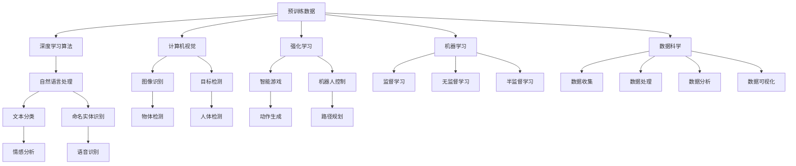

                 

# AI大模型创业：如何应对未来技术挑战？

> 关键词：AI大模型, 创业, 技术挑战, 深度学习, 自然语言处理(NLP), 计算机视觉(CV), 强化学习(RL), 机器学习(ML), 数据科学, 人工智能(AI)应用, 资源优化, 业务落地

## 1. 背景介绍

### 1.1 问题由来

随着人工智能(AI)技术的迅猛发展，AI大模型（Large AI Models, LAMs）已经成为推动各行各业数字化转型和创新的重要引擎。AI大模型以其强大的泛化能力和在自然语言处理(NLP)、计算机视觉(CV)、强化学习(RL)等领域的显著成果，正在重塑各个行业的生产与商业模式。在商业化进程中，AI大模型的创业公司应如何应对未来技术挑战？本文将探讨AI大模型在创业领域的应用与未来发展，帮助创业者和投资者洞察行业趋势，洞察AI大模型的技术优势与挑战。

### 1.2 问题核心关键点

AI大模型创业的核心关键点在于如何高效利用大模型的潜能，克服其在实际应用中的瓶颈，并应对未来技术发展带来的挑战。主要问题包括：

- 如何在大模型上实现高效的微调与定制化开发？
- 如何构建具有可解释性的AI模型？
- 如何提高AI大模型在资源受限环境下的效率与性能？
- 如何设计适应各种应用场景的模型架构？
- 如何规避AI模型可能带来的风险与偏见？
- 如何构建可扩展、可维护、可持续的AI创业生态系统？

通过回答这些问题，本文将全面剖析AI大模型在创业领域的应用现状与未来展望，为创业者和投资者提供宝贵的指导。

### 1.3 问题研究意义

研究AI大模型在创业领域的应用与未来挑战，对推动AI技术商业化、促进AI创业生态系统的发展具有重要意义：

- **促进产业升级**：AI大模型通过提供高效、智能的解决方案，可以大幅提升传统行业的生产效率和运营管理水平，推动产业升级和转型。
- **开拓新应用场景**：AI大模型在医疗、金融、教育、娱乐等多个领域的应用，为创业者提供了广阔的市场机遇。
- **推动技术创新**：面对技术挑战，AI大模型创业公司将不断探索新的技术路径和方法，推动AI技术的进步。
- **加速落地应用**：AI大模型的应用可以大幅缩短技术从研发到应用的时间，加速AI技术的产业化进程。
- **培育新经济增长点**：AI大模型正在催生新的商业模式和经济增长点，为经济社会发展注入新的动力。

本文旨在为AI大模型在创业领域的广泛应用提供深入分析，帮助创业者及投资者在技术研发、产品开发和市场拓展等方面做出科学决策。

## 2. 核心概念与联系

### 2.1 核心概念概述

为更好地理解AI大模型在创业领域的应用与挑战，本节将介绍几个密切相关的核心概念：

- **AI大模型(Large AI Models, LAMs)**：指由深度学习神经网络构建的、具备大规模参数和丰富知识的大模型。这些模型通过在大量无标注数据上进行预训练，学习到通用的语言、图像、语音等知识表示，可以应用于自然语言处理、计算机视觉、推荐系统等多个领域。
- **深度学习(Deep Learning)**：基于多层神经网络进行训练的机器学习技术，通过大量的数据和计算资源，学习复杂的非线性映射关系。深度学习是构建AI大模型的主要技术手段。
- **自然语言处理(Natural Language Processing, NLP)**：利用AI技术处理、理解、生成自然语言的技术，包括文本分类、命名实体识别、机器翻译等任务。
- **计算机视觉(Computer Vision, CV)**：通过AI技术实现图像识别、目标检测、图像生成等任务的技术。
- **强化学习(Reinforcement Learning, RL)**：通过试错过程，使智能体学习如何在特定环境中采取最优行动的技术，广泛应用于游戏、机器人等领域。
- **机器学习(Machine Learning, ML)**：使计算机系统具备自主学习能力的科学，包括监督学习、无监督学习、半监督学习等。
- **数据科学(Data Science)**：通过数据驱动的方法，进行数据收集、处理、分析和可视化，以发现数据中的有价值信息。

这些核心概念通过深度学习算法与数据科学技术的结合，为大模型的开发与优化提供了支持。

### 2.2 核心概念原理和架构的 Mermaid 流程图



这个流程图展示了AI大模型与各个相关领域的联系和应用场景。预训练数据通过深度学习算法，实现语言、图像、语音等领域的知识表示，然后应用到不同的任务中。

## 3. 核心算法原理 & 具体操作步骤

### 3.1 算法原理概述

AI大模型在创业领域的应用，主要依赖于深度学习与大模型的预训练和微调过程。其核心算法原理如下：

- **预训练(Pre-training)**：使用大规模无标注数据，对模型进行预训练，使其学习通用的语言、图像、语音等知识表示。
- **微调(Fine-tuning)**：在特定任务的数据集上，对预训练模型进行微调，使其学习具体的任务特征。
- **迁移学习(Transfer Learning)**：利用预训练模型的通用知识，在小规模任务数据集上进行微调，加速模型训练，提升模型性能。
- **少样本学习(Few-shot Learning)**：在极少量的标注数据上，通过微调或改变模型架构，实现对新任务的快速学习。
- **零样本学习(Zero-shot Learning)**：在完全没有标注数据的情况下，通过模型预训练的知识，对新任务进行推理和生成。

### 3.2 算法步骤详解

AI大模型在创业领域的应用流程通常包括以下步骤：

**Step 1: 数据准备与预训练**

1. 收集领域内的大量无标注数据，用于模型的预训练。
2. 使用深度学习算法（如Transformer、CNN、RNN等）对数据进行预训练，学习通用的知识表示。

**Step 2: 任务定制化微调**

1. 选择目标任务，收集相关的标注数据。
2. 设计合适的任务适配层，选择合适的优化器和超参数。
3. 在标注数据集上对预训练模型进行微调，更新模型的特定任务参数。

**Step 3: 模型部署与优化**

1. 将微调后的模型部署到生产环境，进行业务应用。
2. 收集新数据，定期重新微调模型，更新模型参数。
3. 使用模型压缩、剪枝、量化等技术，优化模型大小和计算效率。

**Step 4: 监控与维护**

1. 监控模型性能，确保其稳定运行。
2. 定期对模型进行维护，更新模型参数。
3. 建立模型更新机制，保持模型的最新状态。

### 3.3 算法优缺点

**优点**：
- 高效性：通过预训练和微调，模型可以在较少的标注数据下，快速学习新任务。
- 泛化能力：大模型具有较强的泛化能力，可以应用于多种任务。
- 可解释性：通过对模型结构的可视化，可以解释模型的决策过程。
- 资源优化：可以通过参数压缩、剪枝等技术，优化模型的计算资源和存储需求。

**缺点**：
- 数据依赖：模型性能很大程度上取决于训练数据的质量和数量，获取高质量标注数据成本较高。
- 过拟合风险：在大规模数据上进行微调时，容易过拟合，需采用正则化等技术避免。
- 模型复杂性：大模型参数量巨大，模型训练和推理速度较慢。
- 高成本：构建和维护大模型需要大量的计算资源和人力资源。

### 3.4 算法应用领域

AI大模型在创业领域的应用已经广泛应用于以下多个领域：

- **自然语言处理(NLP)**：包括文本分类、命名实体识别、情感分析、机器翻译等任务。
- **计算机视觉(CV)**：图像识别、目标检测、图像分割、图像生成等。
- **强化学习(RL)**：智能游戏、机器人控制、自动驾驶等。
- **推荐系统**：电商推荐、内容推荐、广告推荐等。
- **医疗健康**：疾病诊断、基因组学、个性化治疗等。
- **金融科技**：风险评估、欺诈检测、投资策略等。
- **教育**：智能辅导、自适应学习、内容推荐等。
- **城市治理**：智能监控、应急管理、智能交通等。

## 4. 数学模型和公式 & 详细讲解 & 举例说明

### 4.1 数学模型构建

AI大模型的数学模型构建通常基于深度学习框架，如TensorFlow、PyTorch等。以BERT为例，其数学模型构建如下：

**输入层**：输入文本数据 $x$，通过分词器转换为token序列，每个token有一个唯一的id。

**嵌入层**：将token序列转换为向量表示 $z$，每个向量维度为768，由12个 Transformer层组成。

**Transformer层**：Transformer层由多头自注意力机制、前馈神经网络、残差连接和归一化层组成，用于学习上下文表示。

**输出层**：通过全连接层将上下文表示转换为任务特定的输出，如分类或回归结果。

### 4.2 公式推导过程

**输入层公式**：

$$
z_i = embedding(x_i) \quad \forall i=1,\dots,n
$$

**Transformer层公式**：

$$
z_{i+1} = attention(z_i, z_j) + z_i \quad \forall i=1,\dots,n, j=1,\dots,n
$$

其中 $attention$ 为多头自注意力机制，计算输入序列中每个位置与其他位置的注意力权重。

**输出层公式**：

$$
y = MLP(z) + linear(z) \quad \forall z\in Z
$$

其中 $MLP$ 为前馈神经网络，$linear$ 为线性变换层，$Z$ 为上下文表示集合。

### 4.3 案例分析与讲解

以BERT模型在NLP任务中的微调为例，展示其数学模型构建和公式推导过程。

**输入层**：假设输入文本为“I like dogs.”，通过BERT分词器将其转换为token序列 [CLS] I [SEP] like [SEP] dogs [SEP]，其中 [CLS] 和 [SEP] 为特殊的token，表示句子头和尾。

**Transformer层**：BERT通过12个Transformer层学习上下文表示，每层包含多个子层，包括多头自注意力、前馈神经网络等。

**输出层**：最终输出的向量表示包含两个特殊token，即[CLS]和[SEP]的向量表示。通过全连接层和线性变换层，将向量表示映射到任务特定的输出结果。

## 5. 项目实践：代码实例和详细解释说明

### 5.1 开发环境搭建

**Step 1: 安装PyTorch**

```bash
pip install torch torchvision torchaudio
```

**Step 2: 安装TensorFlow**

```bash
pip install tensorflow tensorflow_datasets tensorflow_text
```

**Step 3: 安装TensorBoard**

```bash
pip install tensorboard
```

### 5.2 源代码详细实现

以BERT模型在NLP任务（文本分类）中的微调为例，展示其代码实现。

```python
import torch
import torch.nn as nn
import torch.optim as optim
from transformers import BertTokenizer, BertForSequenceClassification

# 定义模型
model = BertForSequenceClassification.from_pretrained('bert-base-uncased', num_labels=2)

# 定义优化器
optimizer = optim.Adam(model.parameters(), lr=2e-5)

# 定义训练函数
def train_epoch(model, data_loader, optimizer):
    model.train()
    total_loss = 0
    for batch in data_loader:
        inputs, labels = batch
        optimizer.zero_grad()
        outputs = model(inputs, labels=labels)
        loss = outputs.loss
        total_loss += loss.item()
        loss.backward()
        optimizer.step()
    return total_loss / len(data_loader)

# 定义评估函数
def evaluate(model, data_loader):
    model.eval()
    total_correct = 0
    for batch in data_loader:
        inputs, labels = batch
        outputs = model(inputs)
        predictions = outputs.logits.argmax(dim=1)
        total_correct += (predictions == labels).sum().item()
    return total_correct / len(data_loader)
```

### 5.3 代码解读与分析

**模型定义**：使用BERTForSequenceClassification模型，指定分类任务标签数为2，即二分类。

**优化器定义**：使用Adam优化器，学习率为2e-5。

**训练函数实现**：在训练集上对模型进行前向传播和反向传播，计算损失函数并更新模型参数。

**评估函数实现**：在验证集上对模型进行前向传播，计算预测准确率。

### 5.4 运行结果展示

```python
# 数据准备
tokenizer = BertTokenizer.from_pretrained('bert-base-uncased')
train_dataset = ...
val_dataset = ...
test_dataset = ...

# 模型训练
train_loader = ...
val_loader = ...
test_loader = ...

# 训练过程
for epoch in range(5):
    train_loss = train_epoch(model, train_loader, optimizer)
    print(f'Epoch {epoch+1}, train loss: {train_loss:.3f}')
    val_accuracy = evaluate(model, val_loader)
    print(f'Epoch {epoch+1}, val accuracy: {val_accuracy:.3f}')

# 模型评估
test_accuracy = evaluate(model, test_loader)
print(f'Test accuracy: {test_accuracy:.3f}')
```

## 6. 实际应用场景

### 6.1 自然语言处理(NLP)

AI大模型在NLP领域的应用广泛，包括文本分类、情感分析、命名实体识别、机器翻译等任务。以BERT模型为例，通过预训练和微调，可以在较少的标注数据下实现高效的文本分类。

### 6.2 计算机视觉(CV)

AI大模型在CV领域的应用包括图像识别、目标检测、图像分割等任务。例如，使用ResNet、Inception等网络结构对图像数据进行预训练，然后在特定任务上微调，可以实现高效的图像识别。

### 6.3 强化学习(RL)

AI大模型在RL领域的应用包括智能游戏、机器人控制等任务。例如，通过在Atari游戏、机器人臂抓握等环境中进行训练，可以使模型学习到高效的控制策略。

### 6.4 未来应用展望

未来，AI大模型将在更多领域实现突破性应用。例如：

- **医疗健康**：用于疾病诊断、基因组学、个性化治疗等。
- **金融科技**：用于风险评估、欺诈检测、投资策略等。
- **教育**：用于智能辅导、自适应学习、内容推荐等。
- **城市治理**：用于智能监控、应急管理、智能交通等。

## 7. 工具和资源推荐

### 7.1 学习资源推荐

- **Coursera《深度学习专项课程》**：由Andrew Ng教授主讲的深度学习课程，涵盖深度学习的基本概念和前沿技术。
- **《Deep Learning》书籍**：Ian Goodfellow等著，全面介绍深度学习的基本原理和应用。
- **Kaggle**：提供丰富的数据集和竞赛，有助于提升深度学习实践能力。

### 7.2 开发工具推荐

- **TensorFlow**：由Google开发的深度学习框架，适用于大规模工程应用。
- **PyTorch**：由Facebook开发的深度学习框架，灵活性高，易于迭代开发。
- **HuggingFace Transformers**：提供丰富的预训练模型和工具，便于微调和大模型开发。

### 7.3 相关论文推荐

- **Attention is All You Need**：Transformer论文，提出自注意力机制，开创深度学习新篇章。
- **BERT: Pre-training of Deep Bidirectional Transformers for Language Understanding**：BERT模型论文，提出掩码语言模型，实现文本预训练。
- **Playing Atari with Deep Reinforcement Learning**：DQN论文，提出强化学习应用于智能游戏。

## 8. 总结：未来发展趋势与挑战

### 8.1 研究成果总结

AI大模型在创业领域的应用已经取得了显著进展，但仍然面临许多挑战。主要研究包括：

- **高效微调技术**：开发参数高效、计算高效的微调方法，提升模型性能。
- **可解释性**：提升模型的可解释性，增加对模型的信任。
- **资源优化**：优化模型架构和训练流程，提高模型的计算效率和资源利用率。
- **跨领域迁移**：提升模型的跨领域迁移能力，适应不同应用场景。
- **风险管理**：识别和规避模型可能带来的风险，确保模型安全可靠。

### 8.2 未来发展趋势

未来，AI大模型在创业领域将呈现以下发展趋势：

- **模型规模扩大**：随着计算资源的增加，AI大模型的规模将进一步扩大，知识表示能力更强。
- **微调技术多样化**：开发更多参数高效、计算高效的微调方法，提升模型的应用效率。
- **跨领域迁移增强**：提升模型的跨领域迁移能力，适应不同应用场景。
- **资源优化提升**：通过模型压缩、剪枝等技术，优化模型的计算效率和资源利用率。
- **可解释性增强**：提升模型的可解释性，增加对模型的信任。

### 8.3 面临的挑战

尽管AI大模型在创业领域取得了显著进展，但仍面临以下挑战：

- **数据依赖**：模型性能很大程度上取决于训练数据的质量和数量，获取高质量标注数据成本较高。
- **过拟合风险**：在大规模数据上进行微调时，容易过拟合，需采用正则化等技术避免。
- **模型复杂性**：大模型参数量巨大，模型训练和推理速度较慢。
- **高成本**：构建和维护大模型需要大量的计算资源和人力资源。
- **伦理与安全**：AI大模型可能带来伦理与安全问题，如偏见、隐私等。

### 8.4 研究展望

未来，AI大模型在创业领域的研究方向包括：

- **少样本学习**：开发更多少样本学习算法，提高模型在少量标注数据上的性能。
- **自监督学习**：利用无标注数据进行自监督学习，降低对标注数据的依赖。
- **知识图谱**：将知识图谱与神经网络模型结合，提升模型的知识整合能力。
- **因果推理**：引入因果推理方法，提升模型的因果关系建模能力。
- **强化学习**：结合强化学习，提升模型的自主学习与决策能力。
- **伦理与安全**：研究AI伦理与安全问题，建立AI模型监管机制。

## 9. 附录：常见问题与解答

**Q1：AI大模型创业面临哪些主要技术挑战？**

A: AI大模型创业面临的主要技术挑战包括数据依赖、过拟合风险、模型复杂性、高成本、伦理与安全问题等。开发高效微调、跨领域迁移、资源优化等技术是解决这些问题的关键。

**Q2：AI大模型在各个应用领域的应用前景如何？**

A: AI大模型在自然语言处理、计算机视觉、强化学习等领域具有广泛的应用前景。未来，AI大模型将在医疗健康、金融科技、教育、城市治理等领域实现更多的落地应用。

**Q3：如何提高AI大模型的可解释性？**

A: 通过模型压缩、剪枝、可视化等技术，提高模型的可解释性。同时，引入因果推理、符号逻辑等方法，增强模型的解释能力。

**Q4：如何优化AI大模型的计算资源与效率？**

A: 通过模型压缩、剪枝、量化等技术，优化模型的计算资源与效率。同时，采用分布式训练、混合精度训练等技术，提高训练速度。

**Q5：AI大模型在落地应用时需要注意哪些问题？**

A: 在落地应用时，需要注意模型的可扩展性、可维护性、可解释性、安全性等问题。同时，建立模型更新机制，定期对模型进行维护和优化。

---

作者：禅与计算机程序设计艺术 / Zen and the Art of Computer Programming

