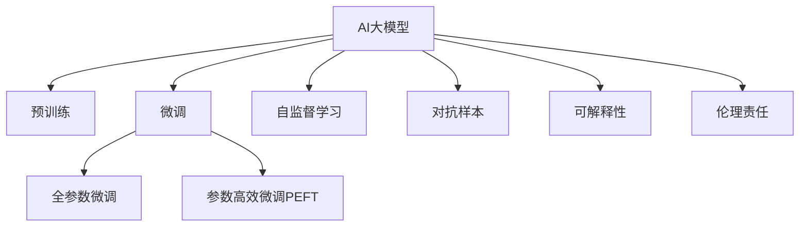

                 

# AI大模型创业：如何应对未来技术挑战？

> 关键词：AI大模型,创业,技术挑战,未来发展,成功要素,创新路径,持续学习,伦理责任,数据安全

## 1. 背景介绍

### 1.1 问题由来
近年来，人工智能(AI)大模型的兴起引发了一场技术革命，不仅在学术界引起了巨大反响，也在工业界引起了广泛关注。从语言模型、计算机视觉模型到推荐系统，大模型已经在诸多领域展示了巨大的潜力。然而，在AI大模型的创业浪潮中，我们同样面临着前所未有的技术挑战。

### 1.2 问题核心关键点
1. **技术成熟度**：大模型虽然性能强劲，但在实际应用中还存在诸多未解之谜。如何确保模型在多样化的真实场景下具有稳定性、鲁棒性和可解释性，是创业公司面临的首要挑战。
2. **数据质量与获取**：高质量、大规模的数据是训练高性能模型的基础。如何获取并有效利用数据，同时保护用户隐私，是创业者需要解决的重要问题。
3. **计算资源需求**：大模型训练和推理对计算资源有很高的要求，如何高效利用计算资源，同时降低成本，是技术实现的关键。
4. **模型部署与运维**：模型部署在实际生产环境中的性能和稳定性如何保障，模型更新与迭代如何实现，这些都是创业公司在技术实现中需要深入考虑的问题。
5. **商业化与市场竞争**：如何通过技术创新，结合商业策略，找到市场切入点，与竞争对手区隔开来，是创业公司最终能否成功的决定性因素。

## 2. 核心概念与联系

### 2.1 核心概念概述

为更好地理解AI大模型创业，本节将介绍几个密切相关的核心概念：

- **AI大模型**：指通过大规模数据训练，具有强大学习能力的人工智能模型。如语言模型GPT、计算机视觉模型ResNet等。
- **迁移学习**：指将一个领域学习到的知识，迁移到另一个领域的学习方法。大模型的预训练-微调过程即是一种典型的迁移学习方式。
- **微调(Fine-tuning)**：指在预训练模型的基础上，使用下游任务的少量标注数据，通过有监督学习优化模型在特定任务上的性能。
- **自监督学习**：指在没有标注数据的情况下，通过模型自身生成的伪标签进行训练。如BERT使用掩码语言模型和下一句预测任务进行预训练。
- **对抗样本(Adversarial Example)**：指对模型进行的有意扰动，使其输出错误结果。对抗样本生成技术对模型鲁棒性提出挑战。
- **可解释性(Explainability)**：指模型决策的透明性和可解释性，便于理解模型工作机制，有助于模型部署和维护。
- **伦理责任(Ethics)**：指模型在实际应用中，对数据隐私、公平性、安全性等方面的责任和考量。

这些核心概念之间的逻辑关系可以通过以下Mermaid流程图来展示：



这个流程图展示了大模型的核心概念及其之间的关系：

1. 大模型通过预训练获得基础能力。
2. 微调是对预训练模型进行任务特定的优化，可以分为全参数微调和参数高效微调（PEFT）。
3. 自监督学习使得模型无需标注数据即可进行训练。
4. 对抗样本训练提高模型鲁棒性。
5. 可解释性技术有助于理解模型决策。
6. 伦理责任确保模型行为符合社会规范。

这些概念共同构成了AI大模型的学习和应用框架，使其能够在各种场景下发挥强大的智能能力。通过理解这些核心概念，我们可以更好地把握AI大模型的工作原理和优化方向。

## 3. 核心算法原理 & 具体操作步骤
### 3.1 算法原理概述

AI大模型的创业，本质上是一个从研发到市场应用的完整过程，涉及到技术开发、模型训练、商业部署等多个环节。核心算法原理可以分为以下几个部分：

1. **模型设计**：选择合适的模型架构，如Transformer、ResNet等，设计合适的输入输出接口，确保模型适应特定的业务场景。
2. **数据预处理**：对数据进行清洗、标注、增强等预处理，确保数据质量，同时提高数据多样性。
3. **模型训练**：在预训练模型基础上，通过有监督学习或自监督学习，对模型进行微调或重新训练，提升模型在特定任务上的性能。
4. **模型部署**：将训练好的模型部署到生产环境，进行实际业务处理。
5. **模型运维**：持续监控模型性能，根据业务需求进行模型更新和迭代。

### 3.2 算法步骤详解

以下是AI大模型创业中的关键步骤：

**Step 1: 确定业务需求**
- 明确目标业务场景和具体需求，如客户识别、智能推荐、语音识别等。
- 评估业务需求的优先级和可行度，确定技术实现的优先级。

**Step 2: 收集与标注数据**
- 根据业务需求，收集和清洗相关数据，确保数据质量。
- 对数据进行标注，标注任务应与业务需求紧密相关。

**Step 3: 选择和预训练模型**
- 根据业务需求，选择合适的预训练模型，如BERT、GPT、ResNet等。
- 对预训练模型进行必要的预处理和微调，确保其适应目标业务场景。

**Step 4: 微调与优化**
- 根据业务需求，选择适当的微调方法，如全参数微调或参数高效微调。
- 设计合适的损失函数和评估指标，如交叉熵、F1-score等。
- 进行模型优化，如正则化、Dropout、早停等，确保模型性能稳定。

**Step 5: 模型部署与优化**
- 将训练好的模型部署到生产环境，确保其能够稳定运行。
- 持续监控模型性能，根据业务需求进行模型更新和迭代。

**Step 6: 商业化与市场推广**
- 结合市场策略，推广模型应用，寻找目标客户群。
- 通过用户反馈和市场数据，不断优化产品，提升用户体验。

### 3.3 算法优缺点

AI大模型创业中的算法优缺点如下：

**优点**：
1. **高性能**：大模型在特定任务上表现优异，能够显著提升业务处理效率。
2. **灵活性**：可以根据业务需求进行模型微调，快速适应新场景。
3. **自动化**：自动化模型训练和部署，降低人力成本。
4. **可扩展性**：可以处理大规模数据，支持复杂的业务需求。

**缺点**：
1. **高成本**：训练和部署大模型需要高昂的计算资源和人力成本。
2. **高风险**：模型性能不稳定，存在对抗样本等安全风险。
3. **复杂度**：模型训练和优化过程复杂，需要深厚的技术积累。
4. **可解释性差**：大模型通常是"黑盒"模型，难以解释其决策过程。

### 3.4 算法应用领域

AI大模型在多个领域已展现出了显著的潜力，以下是几个典型应用场景：

1. **医疗健康**：如智能诊断、药物研发、患者分诊等。大模型能够处理海量医疗数据，提供精准的医疗建议。
2. **金融科技**：如风险评估、智能投顾、欺诈检测等。大模型能够处理金融数据，预测市场趋势，降低风险。
3. **零售电商**：如客户画像、推荐系统、价格优化等。大模型能够个性化推荐商品，优化价格策略，提升用户体验。
4. **智能制造**：如预测维护、智能调度、质量检测等。大模型能够处理生产数据，提升生产效率，降低成本。
5. **智能交通**：如自动驾驶、路况预测、智能调度等。大模型能够分析交通数据，提升交通管理效率。

## 4. 数学模型和公式 & 详细讲解 & 举例说明（备注：数学公式请使用latex格式，latex嵌入文中独立段落使用 $$，段落内使用 $)
### 4.1 数学模型构建

以语音识别为例，假设输入为语音信号 $x$，输出为识别结果 $y$。模型的输入为MFCC特征表示，输出为softmax分类器。

定义模型的输入特征表示为 $\mathbf{x} \in \mathbb{R}^D$，输出为概率向量 $\mathbf{y} \in \{0,1\}^C$，其中 $C$ 为类别数。模型的预测概率为 $P(y|\mathbf{x})$。

假设模型为神经网络，参数为 $\theta$，则预测概率可以表示为：

$$
P(y|\mathbf{x}) = \frac{\exp(\mathbf{y}^T \mathbf{f}(\mathbf{x};\theta))}{\sum_{j=1}^C \exp(\mathbf{y}^T \mathbf{f}_j(\mathbf{x};\theta))}
$$

其中 $\mathbf{f}(\mathbf{x};\theta)$ 为模型输出层的权重向量。

### 4.2 公式推导过程

对于二分类任务，使用交叉熵损失函数：

$$
\mathcal{L}(\theta) = -\frac{1}{N} \sum_{i=1}^N [y_i \log P(y_i|\mathbf{x}_i) + (1-y_i) \log (1-P(y_i|\mathbf{x}_i))]
$$

其中 $y_i$ 为真实标签，$\mathbf{x}_i$ 为输入特征。

根据链式法则，损失函数对参数 $\theta$ 的梯度为：

$$
\nabla_{\theta}\mathcal{L}(\theta) = \frac{1}{N} \sum_{i=1}^N \left[ -y_i \nabla_{\theta} \log P(y_i|\mathbf{x}_i) - (1-y_i) \nabla_{\theta} \log (1-P(y_i|\mathbf{x}_i)) \right]
$$

在反向传播过程中，计算 $\mathbf{f}(\mathbf{x}_i;\theta)$ 的梯度：

$$
\nabla_{\theta} \mathbf{f}(\mathbf{x}_i;\theta) = \frac{1}{N} \sum_{i=1}^N \left[ -y_i \nabla_{\theta} \log P(y_i|\mathbf{x}_i) + (1-y_i) \nabla_{\theta} \log (1-P(y_i|\mathbf{x}_i)) \right]
$$

### 4.3 案例分析与讲解

以情感分析为例，使用BERT模型进行微调。假设标注数据集为 $(\mathbf{x}_i, y_i)$，其中 $y_i$ 为情感标签，可以是"正面"、"负面"、"中性"。

**数据预处理**：
- 对输入文本进行分词，生成词汇表。
- 将文本转换为BERT的输入格式。

**模型微调**：
- 使用预训练的BERT模型作为初始参数。
- 添加全连接层和softmax分类器。
- 使用交叉熵损失函数进行微调。

**代码实现**：
```python
import torch
from transformers import BertTokenizer, BertForSequenceClassification

# 定义模型
tokenizer = BertTokenizer.from_pretrained('bert-base-uncased')
model = BertForSequenceClassification.from_pretrained('bert-base-uncased', num_labels=3)

# 定义损失函数和优化器
criterion = torch.nn.CrossEntropyLoss()
optimizer = torch.optim.Adam(model.parameters(), lr=2e-5)

# 训练模型
for epoch in range(10):
    for batch in train_dataloader:
        inputs, labels = batch
        outputs = model(inputs)
        loss = criterion(outputs, labels)
        optimizer.zero_grad()
        loss.backward()
        optimizer.step()
```

## 5. 项目实践：代码实例和详细解释说明
### 5.1 开发环境搭建

在进行AI大模型创业的过程中，开发环境搭建至关重要。以下是Python开发环境的配置步骤：

1. 安装Anaconda：从官网下载并安装Anaconda，用于创建独立的Python环境。
2. 创建并激活虚拟环境：
```bash
conda create -n pytorch-env python=3.8 
conda activate pytorch-env
```

3. 安装PyTorch：根据CUDA版本，从官网获取对应的安装命令。例如：
```bash
conda install pytorch torchvision torchaudio cudatoolkit=11.1 -c pytorch -c conda-forge
```

4. 安装Transformers库：
```bash
pip install transformers
```

5. 安装各类工具包：
```bash
pip install numpy pandas scikit-learn matplotlib tqdm jupyter notebook ipython
```

完成上述步骤后，即可在`pytorch-env`环境中开始创业实践。

### 5.2 源代码详细实现

以图像识别为例，使用TensorFlow框架进行模型训练。首先，定义模型和数据集：

```python
import tensorflow as tf
from tensorflow.keras import layers

# 定义模型
model = tf.keras.Sequential([
    layers.Conv2D(32, (3, 3), activation='relu', input_shape=(28, 28, 1)),
    layers.MaxPooling2D((2, 2)),
    layers.Flatten(),
    layers.Dense(10, activation='softmax')
])

# 加载数据集
(x_train, y_train), (x_test, y_test) = tf.keras.datasets.mnist.load_data()
x_train = x_train.reshape(-1, 28, 28, 1) / 255.0
x_test = x_test.reshape(-1, 28, 28, 1) / 255.0
```

接着，定义损失函数和优化器，并训练模型：

```python
# 定义损失函数和优化器
criterion = tf.keras.losses.SparseCategoricalCrossentropy(from_logits=True)
optimizer = tf.keras.optimizers.Adam()

# 训练模型
model.compile(optimizer=optimizer, loss=criterion, metrics=['accuracy'])
model.fit(x_train, y_train, epochs=10, validation_data=(x_test, y_test))
```

最后，评估模型性能：

```python
# 评估模型
model.evaluate(x_test, y_test)
```

## 6. 实际应用场景

### 6.1 医疗健康

AI大模型在医疗健康领域的应用前景广阔，可以显著提升医疗服务的智能化水平。以智能诊断为例，通过使用大模型对大量医疗数据进行训练和微调，可以实现对疾病的精准诊断。

具体而言，可以收集大量的电子病历、影像数据和实验室结果，通过预训练大模型学习到疾病诊断的知识。在实际应用中，将新的患者数据输入模型，通过微调得到精准的诊断结果，并给出相应的治疗建议。

### 6.2 金融科技

在金融科技领域，AI大模型可以应用于风险评估、智能投顾、欺诈检测等多个方面。例如，通过分析大量的交易数据，模型可以预测市场趋势，降低投资风险。

具体来说，可以收集历史交易数据、新闻资讯、市场情绪等，使用大模型进行预训练和微调。在实时交易时，将新的市场数据输入模型，通过微调得到最新的市场预测，帮助投资者做出更好的决策。

### 6.3 零售电商

AI大模型在零售电商中的应用主要包括客户画像、推荐系统、价格优化等方面。通过分析消费者的浏览记录、购买历史、评价信息等数据，模型可以构建精准的客户画像，实现个性化推荐。

具体来说，可以使用大模型对历史数据进行预训练，并在实际应用中，根据新的用户行为数据进行微调，生成个性化的推荐结果。同时，模型还可以根据实时数据进行动态价格调整，提升销售额和用户体验。

### 6.4 智能制造

在智能制造领域，AI大模型可以应用于预测维护、智能调度、质量检测等多个方面。例如，通过分析设备的运行数据，模型可以预测设备的维护需求，提高设备的利用率。

具体来说，可以收集设备的运行数据、维护记录、环境信息等，使用大模型进行预训练和微调。在实际应用中，将新的设备数据输入模型，通过微调得到设备的状态预测和维护建议，从而降低维护成本，提升生产效率。

## 7. 工具和资源推荐

### 7.1 学习资源推荐

为了帮助开发者系统掌握AI大模型的理论基础和实践技巧，这里推荐一些优质的学习资源：

1. **《深度学习》课程**：斯坦福大学开设的深度学习课程，系统介绍了深度学习的基本概念和算法，是学习大模型的基础。
2. **《自然语言处理综述》**：深度学习在NLP领域的应用综述，介绍了BERT、GPT等大模型的训练和微调方法。
3. **Transformers官方文档**：HuggingFace发布的Transformers库文档，详细介绍了各种大模型的使用方法和API接口。
4. **Kaggle竞赛**：Kaggle平台上的AI竞赛，提供了大量的数据集和模型，是学习和实践大模型的绝佳资源。

通过学习这些资源，相信你一定能够快速掌握AI大模型的精髓，并用于解决实际的商业问题。

### 7.2 开发工具推荐

高效的开发离不开优秀的工具支持。以下是几款用于AI大模型创业开发的常用工具：

1. **PyTorch**：基于Python的开源深度学习框架，灵活动态的计算图，适合快速迭代研究。大部分预训练语言模型都有PyTorch版本的实现。
2. **TensorFlow**：由Google主导开发的开源深度学习框架，生产部署方便，适合大规模工程应用。同样有丰富的预训练语言模型资源。
3. **Weights & Biases**：模型训练的实验跟踪工具，可以记录和可视化模型训练过程中的各项指标，方便对比和调优。与主流深度学习框架无缝集成。
4. **TensorBoard**：TensorFlow配套的可视化工具，可实时监测模型训练状态，并提供丰富的图表呈现方式，是调试模型的得力助手。
5. **AWS SageMaker**：亚马逊提供的AI服务平台，支持模型的训练、部署和运维，能够快速搭建生产环境。
6. **Google Cloud AI**：谷歌提供的AI平台，支持GPU/TPU算力，适合大规模深度学习任务。

合理利用这些工具，可以显著提升AI大模型的开发效率，加快创新迭代的步伐。

### 7.3 相关论文推荐

AI大模型和创业技术的发展源于学界的持续研究。以下是几篇奠基性的相关论文，推荐阅读：

1. **Attention is All You Need**：提出Transformer结构，开启了NLP领域的预训练大模型时代。
2. **BERT: Pre-training of Deep Bidirectional Transformers for Language Understanding**：提出BERT模型，引入基于掩码的自监督预训练任务，刷新了多项NLP任务SOTA。
3. **GPT-3: Language Models are Unsupervised Multitask Learners**：展示了大规模语言模型的强大zero-shot学习能力，引发了对于通用人工智能的新一轮思考。
4. **AlphaGo Zero**：利用自监督学习和强化学习，通过自我对弈训练出高水平AI棋手，展示了AI在博弈游戏中的潜力。

这些论文代表了大模型创业技术的发展脉络。通过学习这些前沿成果，可以帮助研究者把握学科前进方向，激发更多的创新灵感。

## 8. 总结：未来发展趋势与挑战

### 8.1 总结

本文对AI大模型创业的技术挑战进行了全面系统的介绍。首先阐述了AI大模型在各个领域的潜在应用，明确了创业公司面临的技术难题和实现路径。其次，从原理到实践，详细讲解了AI大模型的训练、微调和部署方法，提供了完整的代码实例。最后，探讨了AI大模型在商业化过程中需要考虑的伦理、安全、可解释性等多个问题，指出了未来发展的趋势和方向。

通过本文的系统梳理，可以看到，AI大模型创业在技术实现和市场应用中面临诸多挑战，但同时也具备广阔的发展前景。唯有深入理解技术原理，不断优化模型，结合商业策略，才能在激烈的市场竞争中脱颖而出。

### 8.2 未来发展趋势

展望未来，AI大模型创业将呈现以下几个发展趋势：

1. **技术成熟度提升**：随着模型的不断优化和训练数据的积累，AI大模型的性能将进一步提升，稳定性和可解释性也将得到改善。
2. **数据获取和处理能力增强**：大数据技术的发展，使得数据的获取和处理变得更加高效和低成本，为AI大模型提供了更丰富的数据支持。
3. **模型多样化和泛用性增强**：未来的AI大模型将更加多样化，能够适应更多领域和场景，如自动驾驶、智能家居等。
4. **计算资源利用率提升**：计算资源的利用率将进一步提升，通过模型压缩、分布式训练等技术，降低大模型创业的计算成本。
5. **跨领域和跨模态融合**：AI大模型将突破单一模态的限制，融合视觉、语音、文本等多种模态，实现更全面的智能感知。

### 8.3 面临的挑战

尽管AI大模型创业前景广阔，但在技术实现和市场推广过程中，仍面临诸多挑战：

1. **技术成熟度不足**：AI大模型仍存在一些未解之谜，模型的稳定性和可解释性有待提升。
2. **数据质量和隐私问题**：高质量数据的获取和用户隐私保护是创业公司需要重点解决的问题。
3. **计算资源需求高**：大模型的训练和部署需要高性能计算资源，资源获取和维护成本较高。
4. **模型部署和运维复杂**：模型在实际生产环境中的稳定性和性能保障，需要详细的部署和运维策略。
5. **市场竞争激烈**：AI大模型创业领域竞争激烈，如何找到独特的市场切入点，是成功与否的关键。

### 8.4 研究展望

面对AI大模型创业所面临的挑战，未来的研究需要在以下几个方面寻求新的突破：

1. **提升模型稳定性和可解释性**：通过改进模型架构和训练方法，提升模型的稳定性和可解释性，使其更加可靠和透明。
2. **优化数据获取和处理**：采用更高效的数据收集和预处理技术，降低数据获取和处理的成本，同时保护用户隐私。
3. **降低计算资源需求**：通过模型压缩、分布式训练等技术，降低大模型训练和部署的资源消耗。
4. **融合多模态数据**：融合视觉、语音、文本等多种模态数据，实现更全面的智能感知。
5. **引入伦理和责任考量**：在模型设计和应用过程中，引入伦理和责任考量的因素，确保模型的行为符合社会规范。

这些研究方向将为AI大模型的创业提供新的思路和方法，帮助企业在激烈的市场竞争中取得成功。

## 9. 附录：常见问题与解答

**Q1：AI大模型的训练和微调需要哪些资源？**

A: AI大模型的训练和微调需要高昂的计算资源，通常需要高性能的GPU或TPU。训练过程中，还需要大量的标注数据，以及时间较长的迭代过程。此外，模型的部署和运维也需要考虑性能和成本因素。

**Q2：如何优化AI大模型的计算资源消耗？**

A: 优化AI大模型的计算资源消耗可以从以下几个方面入手：
1. 采用模型压缩技术，如剪枝、量化等，减小模型大小。
2. 使用分布式训练技术，加速训练过程。
3. 采用混合精度训练，提高计算效率。
4. 采用GPU/TPU混合训练，平衡性能和成本。
5. 使用云计算平台，按需使用算力资源。

**Q3：AI大模型如何保证部署和运维的稳定性和安全性？**

A: 保证AI大模型的部署和运维稳定性和安全性需要从以下几个方面进行考虑：
1. 模型监控和日志记录，实时监测模型性能，记录关键指标。
2. 异常检测和告警机制，及时发现和处理异常情况。
3. 模型备份和版本管理，防止模型数据丢失。
4. 安全防护措施，如访问控制、数据加密等，保护用户数据和模型隐私。

**Q4：AI大模型如何实现跨领域和跨模态融合？**

A: 实现AI大模型跨领域和跨模态融合可以从以下几个方面进行考虑：
1. 融合多模态数据，将视觉、语音、文本等数据结合使用，提升模型的智能感知能力。
2. 引入多任务学习技术，同时训练多个任务，提高模型的泛化能力。
3. 采用迁移学习，将一个领域学到的知识迁移到另一个领域，提升模型的适应性。

**Q5：AI大模型如何保证模型的可解释性和透明度？**

A: 保证AI大模型的可解释性和透明度需要从以下几个方面进行考虑：
1. 使用可解释性模型架构，如LIME、SHAP等，解释模型的决策过程。
2. 提供模型可视化工具，展示模型内部的特征重要性和推理路径。
3. 引入人工智能伦理原则，确保模型行为符合社会规范。
4. 定期进行模型审查和测试，发现和修复潜在的偏见和错误。

---

作者：禅与计算机程序设计艺术 / Zen and the Art of Computer Programming

