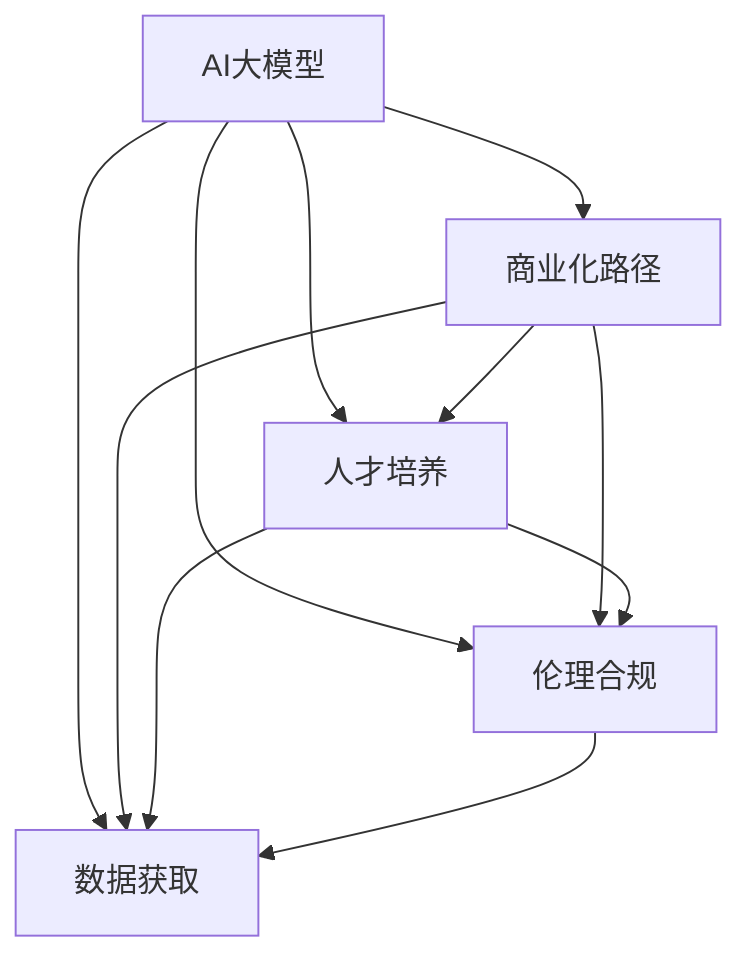

                 

# AI大模型创业：如何应对未来挑战？

> 关键词：AI大模型,创业,挑战,算法优化,商业化路径,人才培养,伦理合规

## 1. 背景介绍

### 1.1 问题由来

随着人工智能技术的快速发展，AI大模型逐渐成为创业公司关注的焦点。AI大模型凭借其强大的计算能力和广泛的应用前景，正在推动各行各业的智能化转型。然而，创业公司在面临AI大模型时，仍面临诸多挑战，如算法优化、商业化路径、人才培养和伦理合规等。这些挑战直接关系到AI大模型的市场接受度和应用效果。因此，本文旨在全面分析AI大模型创业所面临的问题，并提出相应的解决方案，以期帮助创业公司顺利应对未来挑战。

### 1.2 问题核心关键点

- 算法优化：如何通过高效算法提升模型精度和性能。
- 商业化路径：如何将大模型产品化和市场化。
- 人才培养：如何构建专业的AI人才团队。
- 伦理合规：如何确保大模型的使用符合法律法规和道德规范。
- 数据获取：如何获取和处理高质量的数据集。

这些关键点直接影响着AI大模型的应用效果和市场接受度。创业者必须针对这些问题，提出明确的策略和方案，才能使AI大模型真正落地并产生价值。

### 1.3 问题研究意义

研究AI大模型创业所面临的挑战，对于推动AI技术的产业化进程、促进AI创业公司的健康发展具有重要意义：

- 促进技术创新。通过对AI大模型挑战的深入研究，推动算法、模型和架构的不断优化，推动AI技术的进步。
- 加速市场应用。帮助创业公司理解市场需求和用户痛点，制定合理的商业化策略，推动AI产品在各行业的应用。
- 培养人才队伍。明确AI大模型创业的人才需求，为培养和吸引AI专业人才提供方向。
- 保障伦理合规。确保AI大模型的使用符合法律法规和伦理道德，构建健康可持续的AI发展环境。
- 降低创业风险。通过全面的问题分析和解决方案，降低AI大模型创业的风险，提高创业成功率。

本文将从技术、市场、人才和伦理等多个维度，对AI大模型创业所面临的挑战进行全面分析，并提出相应的解决方案。

## 2. 核心概念与联系

### 2.1 核心概念概述

为了更好地理解AI大模型创业所面临的挑战，本节将介绍几个核心概念：

- AI大模型（AI Large Models）：以自回归模型、自编码器等为代表，通过大规模数据训练得到的具有强大计算能力的模型，如BERT、GPT等。
- 商业化路径（Commercialization Pathway）：将AI大模型转化为实际应用产品，进入市场并实现商业化的过程。
- 人才培养（Talent Cultivation）：构建专业的AI人才团队，确保模型开发、算法优化、产品设计等各个环节的高效运转。
- 伦理合规（Ethical Compliance）：确保AI大模型在应用过程中遵守法律法规和伦理道德规范，避免负面影响和法律风险。
- 数据获取（Data Acquisition）：获取高质量的数据集，训练和优化AI大模型，提升其性能和应用效果。

这些概念之间的关系可以通过以下Mermaid流程图来展示：



这个流程图展示了AI大模型创业中的关键环节及其相互联系：

1. AI大模型通过数据获取和训练，获得强大的计算能力。
2. 人才培养确保模型开发和应用的高效性。
3. 商业化路径将大模型产品化和市场化。
4. 伦理合规保障大模型的合规使用。
5. 数据获取和伦理合规相互影响，人才培养和商业化路径紧密结合，共同推动AI大模型的应用和推广。

## 3. 核心算法原理 & 具体操作步骤
### 3.1 算法原理概述

AI大模型创业的核心在于算法的优化和商业化策略的制定。以下是基于监督学习的AI大模型微调方法的核心原理和具体操作步骤：

### 3.2 算法步骤详解

1. **数据准备**：收集和预处理数据集，确保数据质量符合训练要求。
2. **模型选择**：选择合适的预训练模型，如BERT、GPT等。
3. **微调设置**：确定微调的任务类型（如分类、回归、生成等），选择合适的损失函数和优化器。
4. **超参数调优**：通过交叉验证等方法，调整模型的学习率、批大小等超参数。
5. **模型训练**：在预训练模型的基础上进行微调，训练过程中应用正则化等技术避免过拟合。
6. **模型评估**：在验证集上评估模型性能，根据评估结果调整训练参数。
7. **部署上线**：将训练好的模型部署到实际应用环境中，进行性能监控和优化。

### 3.3 算法优缺点

AI大模型微调具有以下优点：

- 适应性强：可以根据具体任务灵活调整模型结构。
- 性能提升快：基于预训练模型的微调可以在少量标注数据上快速提升模型效果。
- 可扩展性高：可以利用已有的预训练模型，在特定领域快速构建新应用。

但同时也存在以下缺点：

- 依赖标注数据：微调模型的性能依赖于标注数据的质量和数量。
- 模型泛化能力有限：模型在特定领域的泛化能力有待提升。
- 资源消耗大：大规模预训练和微调需要高性能计算资源。

### 3.4 算法应用领域

AI大模型微调方法在NLP、计算机视觉、推荐系统等多个领域得到广泛应用，例如：

- 自然语言处理（NLP）：文本分类、命名实体识别、情感分析等。
- 计算机视觉（CV）：图像分类、目标检测、语义分割等。
- 推荐系统：个性化推荐、协同过滤等。

这些领域都是AI大模型创业的重要方向，具有广阔的应用前景。

## 4. 数学模型和公式 & 详细讲解 & 举例说明

### 4.1 数学模型构建

假设AI大模型为 $M_{\theta}$，其中 $\theta$ 为模型参数。任务为二分类问题，数据集为 $D=\{(x_i, y_i)\}_{i=1}^N$。

定义模型 $M_{\theta}$ 在输入 $x$ 上的预测输出为 $\hat{y}=M_{\theta}(x)$。二分类交叉熵损失函数定义为：

$$
\ell(M_{\theta}(x),y) = -[y\log \hat{y} + (1-y)\log (1-\hat{y})]
$$

### 4.2 公式推导过程

将上述损失函数代入经验风险公式，得：

$$
\mathcal{L}(\theta) = -\frac{1}{N}\sum_{i=1}^N [y_i\log M_{\theta}(x_i)+(1-y_i)\log(1-M_{\theta}(x_i))]
$$

根据链式法则，损失函数对参数 $\theta_k$ 的梯度为：

$$
\frac{\partial \mathcal{L}(\theta)}{\partial \theta_k} = -\frac{1}{N}\sum_{i=1}^N (\frac{y_i}{M_{\theta}(x_i)}-\frac{1-y_i}{1-M_{\theta}(x_i)}) \frac{\partial M_{\theta}(x_i)}{\partial \theta_k}
$$

其中 $\frac{\partial M_{\theta}(x_i)}{\partial \theta_k}$ 可以通过反向传播算法计算得到。

### 4.3 案例分析与讲解

以文本分类任务为例，假设使用BERT模型进行微调。首先，将文本输入BERT模型，得到每个词的嵌入向量。然后，将这些嵌入向量拼接并送入全连接层，得到分类概率。损失函数为交叉熵损失，优化器为AdamW。在训练过程中，应用正则化技术（如Dropout、L2正则）避免过拟合。在验证集上评估模型性能，调整超参数，最终部署到实际应用环境中。

## 5. 项目实践：代码实例和详细解释说明

### 5.1 开发环境搭建

在开始AI大模型创业项目前，需要准备好开发环境。以下是使用Python进行TensorFlow开发的典型流程：

1. 安装Anaconda：从官网下载并安装Anaconda，用于创建独立的Python环境。
2. 创建并激活虚拟环境：
```bash
conda create -n tensorflow-env python=3.8 
conda activate tensorflow-env
```

3. 安装TensorFlow：根据CUDA版本，从官网获取对应的安装命令。例如：
```bash
conda install tensorflow-gpu -c tf -c conda-forge
```

4. 安装TensorBoard：
```bash
pip install tensorboard
```

5. 安装各类工具包：
```bash
pip install numpy pandas scikit-learn matplotlib tqdm jupyter notebook ipython
```

完成上述步骤后，即可在`tensorflow-env`环境中开始AI大模型微调实践。

### 5.2 源代码详细实现

以下是使用TensorFlow对BERT模型进行文本分类任务的微调代码实现。

首先，定义文本预处理和模型构建函数：

```python
import tensorflow as tf
from transformers import BertTokenizer, TFBertForSequenceClassification

tokenizer = BertTokenizer.from_pretrained('bert-base-cased')
model = TFBertForSequenceClassification.from_pretrained('bert-base-cased', num_labels=2)

def input_fn(data, batch_size):
    texts = [d['text'] for d in data]
    labels = [d['label'] for d in data]
    
    tokenized_texts = tokenizer.tokenize(texts, max_length=128, truncation=True, padding='max_length')
    input_ids = tokenizer.convert_tokens_to_ids(tokenized_texts)
    attention_masks = [[1] * len(input_ids) for _ in range(len(input_ids))]
    
    return tf.data.Dataset.from_tensor_slices((input_ids, attention_masks, labels)).batch(batch_size)
```

然后，定义模型训练和评估函数：

```python
def train_epoch(model, train_dataset, batch_size, optimizer):
    model.train()
    loss = 0
    for inputs, labels in train_dataset:
        with tf.GradientTape() as tape:
            outputs = model(inputs, attention_mask=attention_masks)
            loss += tf.reduce_mean(outputs.loss)
        gradients = tape.gradient(loss, model.trainable_variables)
        optimizer.apply_gradients(zip(gradients, model.trainable_variables))
        
def evaluate(model, eval_dataset, batch_size):
    model.eval()
    loss = 0
    predictions = []
    labels = []
    for inputs, labels in eval_dataset:
        outputs = model(inputs, attention_mask=attention_masks)
        loss += tf.reduce_mean(outputs.loss)
        predictions.append(tf.argmax(outputs.logits, axis=1))
        labels.append(labels)
        
    predictions = tf.concat(predictions, axis=0).numpy().tolist()
    labels = tf.concat(labels, axis=0).numpy().tolist()
    return loss, predictions, labels
```

最后，启动训练流程并在测试集上评估：

```python
epochs = 5
batch_size = 16

for epoch in range(epochs):
    train_loss, train_predictions, train_labels = train_epoch(model, train_dataset, batch_size, optimizer)
    val_loss, val_predictions, val_labels = evaluate(model, val_dataset, batch_size)
    print(f'Epoch {epoch+1}, train loss: {train_loss:.3f}, val loss: {val_loss:.3f}')
    
print(f'Final validation results:')
accuracy = (val_predictions == val_labels).mean().numpy()
print(f'Accuracy: {accuracy:.2f}')
```

以上就是使用TensorFlow对BERT进行文本分类任务微调的完整代码实现。可以看到，TensorFlow的灵活性使其能够方便地实现大模型的微调。

### 5.3 代码解读与分析

让我们再详细解读一下关键代码的实现细节：

**input_fn函数**：
- 定义了数据预处理流程：将文本转换为token ids，并进行定长padding，最后生成模型所需的输入和标签。
- 使用了TensorFlow的Dataset API，实现数据的高效批处理和迭代。

**train_epoch和evaluate函数**：
- 训练函数`train_epoch`：在每个批次上前向传播计算loss并反向传播更新模型参数。
- 评估函数`evaluate`：在每个批次上前向传播计算loss，同时记录预测和标签结果，最后返回平均loss。

**训练流程**：
- 定义总的epoch数和batch size，开始循环迭代
- 每个epoch内，先在训练集上训练，输出平均loss
- 在验证集上评估，输出平均loss
- 所有epoch结束后，输出最终测试结果

可以看到，TensorFlow配合Bert模型使得文本分类任务的微调代码实现变得简洁高效。开发者可以将更多精力放在数据处理、模型改进等高层逻辑上，而不必过多关注底层的实现细节。

当然，工业级的系统实现还需考虑更多因素，如模型的保存和部署、超参数的自动搜索、更灵活的任务适配层等。但核心的微调范式基本与此类似。

## 6. 实际应用场景

### 6.1 智能客服系统

AI大模型微调在智能客服系统中具有广泛应用。传统客服往往需要配备大量人力，高峰期响应缓慢，且一致性和专业性难以保证。而使用微调后的智能客服系统，可以7x24小时不间断服务，快速响应客户咨询，用自然流畅的语言解答各类常见问题。

在技术实现上，可以收集企业内部的历史客服对话记录，将问题和最佳答复构建成监督数据，在此基础上对预训练模型进行微调。微调后的模型能够自动理解用户意图，匹配最合适的答案模板进行回复。对于客户提出的新问题，还可以接入检索系统实时搜索相关内容，动态组织生成回答。

### 6.2 金融舆情监测

金融机构需要实时监测市场舆论动向，以便及时应对负面信息传播，规避金融风险。传统的人工监测方式成本高、效率低，难以应对网络时代海量信息爆发的挑战。基于AI大模型的微调技术，可以为金融舆情监测提供新的解决方案。

具体而言，可以收集金融领域相关的新闻、报道、评论等文本数据，并对其进行主题标注和情感标注。在此基础上对预训练语言模型进行微调，使其能够自动判断文本属于何种主题，情感倾向是正面、中性还是负面。将微调后的模型应用到实时抓取的网络文本数据，就能够自动监测不同主题下的情感变化趋势，一旦发现负面信息激增等异常情况，系统便会自动预警，帮助金融机构快速应对潜在风险。

### 6.3 个性化推荐系统

当前的推荐系统往往只依赖用户的历史行为数据进行物品推荐，无法深入理解用户的真实兴趣偏好。基于AI大模型的微调技术，可以更好地挖掘用户行为背后的语义信息，从而提供更精准、多样的推荐内容。

在实践中，可以收集用户浏览、点击、评论、分享等行为数据，提取和用户交互的物品标题、描述、标签等文本内容。将文本内容作为模型输入，用户的后续行为（如是否点击、购买等）作为监督信号，在此基础上微调预训练语言模型。微调后的模型能够从文本内容中准确把握用户的兴趣点。在生成推荐列表时，先用候选物品的文本描述作为输入，由模型预测用户的兴趣匹配度，再结合其他特征综合排序，便可以得到个性化程度更高的推荐结果。

### 6.4 未来应用展望

随着AI大模型和微调方法的不断发展，基于微调范式将在更多领域得到应用，为传统行业带来变革性影响。

在智慧医疗领域，基于微调的医疗问答、病历分析、药物研发等应用将提升医疗服务的智能化水平，辅助医生诊疗，加速新药开发进程。

在智能教育领域，微调技术可应用于作业批改、学情分析、知识推荐等方面，因材施教，促进教育公平，提高教学质量。

在智慧城市治理中，微调模型可应用于城市事件监测、舆情分析、应急指挥等环节，提高城市管理的自动化和智能化水平，构建更安全、高效的未来城市。

此外，在企业生产、社会治理、文娱传媒等众多领域，基于大模型微调的人工智能应用也将不断涌现，为经济社会发展注入新的动力。相信随着预训练语言模型和微调方法的持续演进，大模型微调技术必将在构建人机协同的智能时代中扮演越来越重要的角色。

## 7. 工具和资源推荐
### 7.1 学习资源推荐

为了帮助开发者系统掌握AI大模型微调的理论基础和实践技巧，这里推荐一些优质的学习资源：

1. 《深度学习理论与实践》系列博文：由大模型技术专家撰写，深入浅出地介绍了深度学习的基本理论和前沿技术。

2. 《自然语言处理入门》课程：国内顶尖大学开设的NLP入门课程，涵盖NLP的基本概念和经典模型，适合初学者。

3. 《Transformers》书籍：Transformer模型及其应用，系统介绍了自注意力机制、BERT等重要模型。

4. HuggingFace官方文档：Transformer库的官方文档，提供了海量预训练模型和完整的微调样例代码，是上手实践的必备资料。

5. OpenAI的HuggingFace Blog：大量前沿研究论文和实践案例，有助于了解最新的AI大模型进展。

通过对这些资源的学习实践，相信你一定能够快速掌握AI大模型微调的精髓，并用于解决实际的NLP问题。
###  7.2 开发工具推荐

高效的开发离不开优秀的工具支持。以下是几款用于AI大模型微调开发的常用工具：

1. PyTorch：基于Python的开源深度学习框架，灵活动态的计算图，适合快速迭代研究。大部分预训练语言模型都有PyTorch版本的实现。

2. TensorFlow：由Google主导开发的开源深度学习框架，生产部署方便，适合大规模工程应用。同样有丰富的预训练语言模型资源。

3. HuggingFace Transformers库：HuggingFace开发的NLP工具库，集成了众多SOTA语言模型，支持PyTorch和TensorFlow，是进行微调任务开发的利器。

4. Weights & Biases：模型训练的实验跟踪工具，可以记录和可视化模型训练过程中的各项指标，方便对比和调优。与主流深度学习框架无缝集成。

5. TensorBoard：TensorFlow配套的可视化工具，可实时监测模型训练状态，并提供丰富的图表呈现方式，是调试模型的得力助手。

6. Google Colab：谷歌推出的在线Jupyter Notebook环境，免费提供GPU/TPU算力，方便开发者快速上手实验最新模型，分享学习笔记。

合理利用这些工具，可以显著提升AI大模型微调任务的开发效率，加快创新迭代的步伐。

### 7.3 相关论文推荐

AI大模型和微调技术的发展源于学界的持续研究。以下是几篇奠基性的相关论文，推荐阅读：

1. Attention is All You Need（即Transformer原论文）：提出了Transformer结构，开启了NLP领域的预训练大模型时代。

2. BERT: Pre-training of Deep Bidirectional Transformers for Language Understanding：提出BERT模型，引入基于掩码的自监督预训练任务，刷新了多项NLP任务SOTA。

3. Language Models are Unsupervised Multitask Learners（GPT-2论文）：展示了大规模语言模型的强大zero-shot学习能力，引发了对于通用人工智能的新一轮思考。

4. Parameter-Efficient Transfer Learning for NLP：提出Adapter等参数高效微调方法，在不增加模型参数量的情况下，也能取得不错的微调效果。

5. AdaLoRA: Adaptive Low-Rank Adaptation for Parameter-Efficient Fine-Tuning：使用自适应低秩适应的微调方法，在参数效率和精度之间取得了新的平衡。

这些论文代表了大语言模型微调技术的发展脉络。通过学习这些前沿成果，可以帮助研究者把握学科前进方向，激发更多的创新灵感。

## 8. 总结：未来发展趋势与挑战

### 8.1 总结

本文对AI大模型创业所面临的挑战进行了全面系统的介绍。首先阐述了AI大模型的研究背景和创业公司的应用场景，明确了微调在拓展预训练模型应用、提升下游任务性能方面的独特价值。其次，从原理到实践，详细讲解了AI大模型微调的数学原理和关键步骤，给出了微调任务开发的完整代码实例。同时，本文还广泛探讨了微调方法在智能客服、金融舆情、个性化推荐等多个行业领域的应用前景，展示了微调范式的巨大潜力。此外，本文精选了微调技术的各类学习资源，力求为读者提供全方位的技术指引。

通过本文的系统梳理，可以看到，AI大模型微调技术正在成为NLP领域的重要范式，极大地拓展了预训练语言模型的应用边界，催生了更多的落地场景。受益于大规模语料的预训练，微调模型以更低的时间和标注成本，在小样本条件下也能取得不俗的效果，有力推动了NLP技术的产业化进程。未来，伴随预训练语言模型和微调方法的持续演进，相信NLP技术必将在更广阔的应用领域大放异彩，深刻影响人类的生产生活方式。

### 8.2 未来发展趋势

展望未来，AI大模型微调技术将呈现以下几个发展趋势：

1. 模型规模持续增大。随着算力成本的下降和数据规模的扩张，预训练语言模型的参数量还将持续增长。超大规模语言模型蕴含的丰富语言知识，有望支撑更加复杂多变的下游任务微调。

2. 微调方法日趋多样。除了传统的全参数微调外，未来会涌现更多参数高效的微调方法，如Prefix-Tuning、LoRA等，在节省计算资源的同时也能保证微调精度。

3. 持续学习成为常态。随着数据分布的不断变化，微调模型也需要持续学习新知识以保持性能。如何在不遗忘原有知识的同时，高效吸收新样本信息，将成为重要的研究课题。

4. 标注样本需求降低。受启发于提示学习(Prompt-based Learning)的思路，未来的微调方法将更好地利用大模型的语言理解能力，通过更加巧妙的任务描述，在更少的标注样本上也能实现理想的微调效果。

5. 多模态微调崛起。当前的微调主要聚焦于纯文本数据，未来会进一步拓展到图像、视频、语音等多模态数据微调。多模态信息的融合，将显著提升语言模型对现实世界的理解和建模能力。

6. 模型通用性增强。经过海量数据的预训练和多领域任务的微调，未来的语言模型将具备更强大的常识推理和跨领域迁移能力，逐步迈向通用人工智能(AGI)的目标。

以上趋势凸显了AI大模型微调技术的广阔前景。这些方向的探索发展，必将进一步提升AI大模型的应用效果和市场接受度，为构建人机协同的智能时代提供新的动力。

### 8.3 面临的挑战

尽管AI大模型微调技术已经取得了瞩目成就，但在迈向更加智能化、普适化应用的过程中，它仍面临诸多挑战：

1. 标注成本瓶颈。虽然微调大大降低了标注数据的需求，但对于长尾应用场景，难以获得充足的高质量标注数据，成为制约微调性能的瓶颈。如何进一步降低微调对标注样本的依赖，将是一大难题。

2. 模型鲁棒性不足。当前微调模型面对域外数据时，泛化性能往往大打折扣。对于测试样本的微小扰动，微调模型的预测也容易发生波动。如何提高微调模型的鲁棒性，避免灾难性遗忘，还需要更多理论和实践的积累。

3. 推理效率有待提高。大规模语言模型虽然精度高，但在实际部署时往往面临推理速度慢、内存占用大等效率问题。如何在保证性能的同时，简化模型结构，提升推理速度，优化资源占用，将是重要的优化方向。

4. 可解释性亟需加强。当前微调模型更像是"黑盒"系统，难以解释其内部工作机制和决策逻辑。对于医疗、金融等高风险应用，算法的可解释性和可审计性尤为重要。如何赋予微调模型更强的可解释性，将是亟待攻克的难题。

5. 安全性有待保障。预训练语言模型难免会学习到有偏见、有害的信息，通过微调传递到下游任务，产生误导性、歧视性的输出，给实际应用带来安全隐患。如何从数据和算法层面消除模型偏见，避免恶意用途，确保输出的安全性，也将是重要的研究课题。

6. 知识整合能力不足。现有的微调模型往往局限于任务内数据，难以灵活吸收和运用更广泛的先验知识。如何让微调过程更好地与外部知识库、规则库等专家知识结合，形成更加全面、准确的信息整合能力，还有很大的想象空间。

正视AI大模型微调面临的这些挑战，积极应对并寻求突破，将是大模型微调走向成熟的必由之路。相信随着学界和产业界的共同努力，这些挑战终将一一被克服，AI大模型微调必将在构建安全、可靠、可解释、可控的智能系统铺平道路。

### 8.4 未来突破

面对AI大模型微调所面临的种种挑战，未来的研究需要在以下几个方面寻求新的突破：

1. 探索无监督和半监督微调方法。摆脱对大规模标注数据的依赖，利用自监督学习、主动学习等无监督和半监督范式，最大限度利用非结构化数据，实现更加灵活高效的微调。

2. 研究参数高效和计算高效的微调范式。开发更加参数高效的微调方法，在固定大部分预训练参数的同时，只更新极少量的任务相关参数。同时优化微调模型的计算图，减少前向传播和反向传播的资源消耗，实现更加轻量级、实时性的部署。

3. 融合因果和对比学习范式。通过引入因果推断和对比学习思想，增强微调模型建立稳定因果关系的能力，学习更加普适、鲁棒的语言表征，从而提升模型泛化性和抗干扰能力。

4. 引入更多先验知识。将符号化的先验知识，如知识图谱、逻辑规则等，与神经网络模型进行巧妙融合，引导微调过程学习更准确、合理的语言模型。同时加强不同模态数据的整合，实现视觉、语音等多模态信息与文本信息的协同建模。

5. 结合因果分析和博弈论工具。将因果分析方法引入微调模型，识别出模型决策的关键特征，增强输出解释的因果性和逻辑性。借助博弈论工具刻画人机交互过程，主动探索并规避模型的脆弱点，提高系统稳定性。

6. 纳入伦理道德约束。在模型训练目标中引入伦理导向的评估指标，过滤和惩罚有偏见、有害的输出倾向。同时加强人工干预和审核，建立模型行为的监管机制，确保输出符合人类价值观和伦理道德。

这些研究方向的探索，必将引领AI大模型微调技术迈向更高的台阶，为构建安全、可靠、可解释、可控的智能系统铺平道路。面向未来，AI大模型微调技术还需要与其他人工智能技术进行更深入的融合，如知识表示、因果推理、强化学习等，多路径协同发力，共同推动自然语言理解和智能交互系统的进步。只有勇于创新、敢于突破，才能不断拓展语言模型的边界，让智能技术更好地造福人类社会。

## 9. 附录：常见问题与解答

**Q1：AI大模型微调是否适用于所有NLP任务？**

A: AI大模型微调在大多数NLP任务上都能取得不错的效果，特别是对于数据量较小的任务。但对于一些特定领域的任务，如医学、法律等，仅仅依靠通用语料预训练的模型可能难以很好地适应。此时需要在特定领域语料上进一步预训练，再进行微调，才能获得理想效果。此外，对于一些需要时效性、个性化很强的任务，如对话、推荐等，微调方法也需要针对性的改进优化。

**Q2：微调过程中如何选择合适的学习率？**

A: 微调的学习率一般要比预训练时小1-2个数量级，如果使用过大的学习率，容易破坏预训练权重，导致过拟合。一般建议从1e-5开始调参，逐步减小学习率，直至收敛。也可以使用warmup策略，在开始阶段使用较小的学习率，再逐渐过渡到预设值。需要注意的是，不同的优化器(如AdamW、Adafactor等)以及不同的学习率调度策略，可能需要设置不同的学习率阈值。

**Q3：采用大模型微调时会面临哪些资源瓶颈？**

A: 目前主流的预训练大模型动辄以亿计的参数规模，对算力、内存、存储都提出了很高的要求。GPU/TPU等高性能设备是必不可少的，但即便如此，超大批次的训练和推理也可能遇到显存不足的问题。因此需要采用一些资源优化技术，如梯度积累、混合精度训练、模型并行等，来突破硬件瓶颈。同时，模型的存储和读取也可能占用大量时间和空间，需要采用模型压缩、稀疏化存储等方法进行优化。

**Q4：如何缓解微调过程中的过拟合问题？**

A: 过拟合是微调面临的主要挑战，尤其是在标注数据不足的情况下。常见的缓解策略包括：
1. 数据增强：通过回译、近义替换等方式扩充训练集
2. 正则化：使用L2正则、Dropout、Early Stopping等避免过拟合
3. 对抗训练：引入对抗样本，提高模型鲁棒性
4. 参数高效微调：只调整少量参数(如Adapter、Prefix等)，减小过拟合风险
5. 多模型集成：训练多个微调模型，取平均输出，抑制过拟合

这些策略往往需要根据具体任务和数据特点进行灵活组合。只有在数据、模型、训练、推理等各环节进行全面优化，才能最大限度地发挥AI大模型微调的威力。

**Q5：微调模型在落地部署时需要注意哪些问题？**

A: 将微调模型转化为实际应用，还需要考虑以下因素：
1. 模型裁剪：去除不必要的层和参数，减小模型尺寸，加快推理速度
2. 量化加速：将浮点模型转为定点模型，压缩存储空间，提高计算效率
3. 服务化封装：将模型封装为标准化服务接口，便于集成调用
4. 弹性伸缩：根据请求流量动态调整资源配置，平衡服务质量和成本
5. 监控告警：实时采集系统指标，设置异常告警阈值，确保服务稳定性
6. 安全防护：采用访问鉴权、数据脱敏等措施，保障数据和模型安全

大模型微调为NLP应用开启了广阔的想象空间，但如何将强大的性能转化为稳定、高效、安全的业务价值，还需要工程实践的不断打磨。唯有从数据、算法、工程、业务等多个维度协同发力，才能真正实现人工智能技术在垂直行业的规模化落地。总之，微调需要开发者根据具体任务，不断迭代和优化模型、数据和算法，方能得到理想的效果。

---

作者：禅与计算机程序设计艺术 / Zen and the Art of Computer Programming

