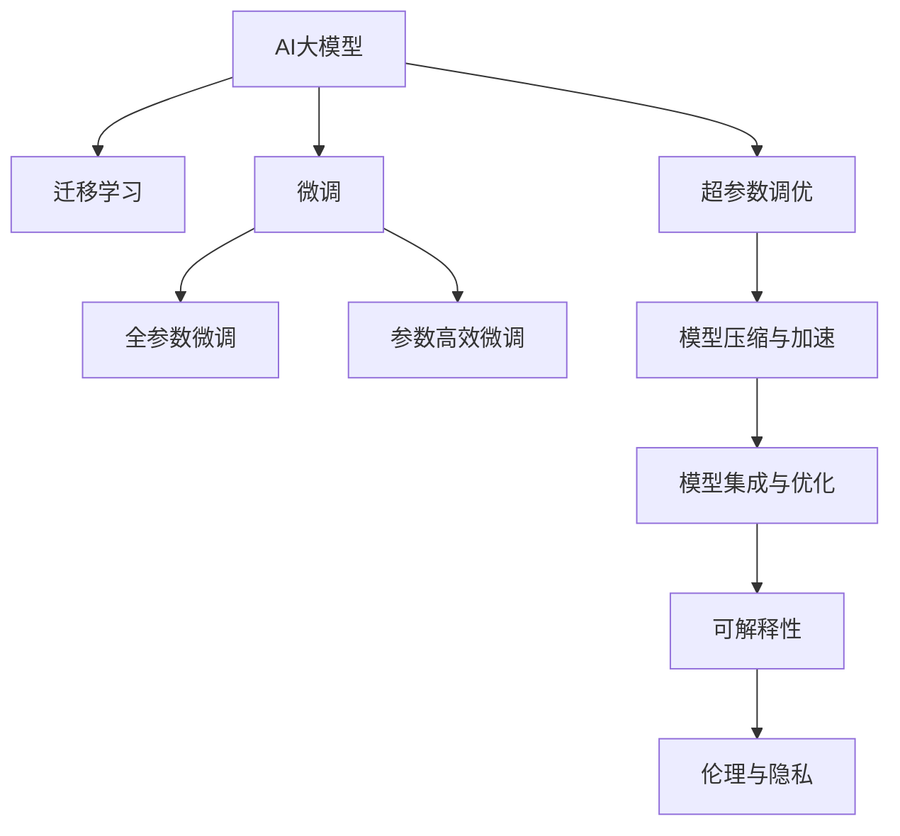

                 

# AI大模型创业：如何应对未来用户需求？

在当今飞速发展的科技时代，人工智能（AI）大模型已成为众多创业公司争相投资的热点领域。这些大模型以强大的计算能力和大数据训练为基础，不仅在各种应用场景中展示了巨大的潜力，也为AI创业公司带来了新的发展机遇。然而，如何精准应对未来用户需求，将AI大模型转化为实际商业价值，是所有AI创业公司面临的重要挑战。本文将从背景、核心概念、算法原理、应用领域、实际案例、工具推荐和未来展望等多个维度，系统探讨AI大模型创业的策略与路径。

## 1. 背景介绍

### 1.1 问题由来

随着深度学习技术的不断发展，AI大模型在自然语言处理（NLP）、计算机视觉（CV）、语音识别（ASR）等领域取得了显著的进展。这些大模型以自回归（如GPT）或自编码（如BERT）等深度神经网络为基础，通过大规模数据训练，学习了丰富的语言、视觉或音频特征，具备了强大的通用智能能力。然而，尽管AI大模型在学术界和工业界都受到了广泛关注，但其如何应用于实际业务场景，并转化为商业价值，仍是一大挑战。

### 1.2 问题核心关键点

AI大模型创业的核心在于如何利用AI模型的通用智能能力，针对特定场景和需求，开发出实际可用的产品和服务。以下是一些关键问题：

- **数据获取与标注**：高质量标注数据对于模型训练至关重要，但标注成本高且耗时。
- **模型选择与适配**：不同业务场景需要选择不同的模型，并根据需求进行适配。
- **系统集成与部署**：将大模型集成到实际系统中，并确保高效稳定的运行。
- **用户需求理解**：深入理解用户需求，构建具有实际应用价值的AI产品。

## 2. 核心概念与联系

### 2.1 核心概念概述

为更好地理解AI大模型创业的方法，本文将介绍几个关键概念：

- **AI大模型**：以深度学习技术为基础的通用智能模型，通过大规模数据训练，具备强大的特征提取和智能决策能力。
- **迁移学习**：利用已有知识，将在大规模数据上训练的模型迁移到新任务上的学习方式。
- **微调**：在大模型上，通过小规模标注数据进行微调，提升模型在特定任务上的性能。
- **超参数调优**：模型训练中需要手动调整的一系列参数，如学习率、批大小等。
- **模型压缩与加速**：通过模型裁剪、量化等方法，降低模型计算和存储成本，提高推理速度。
- **模型集成与优化**：将多个模型组合，利用其优点，提升整体性能和鲁棒性。
- **可解释性**：提供模型决策的透明度，便于用户理解和使用。
- **伦理与隐私**：确保AI模型在应用过程中遵守法律法规，保护用户隐私。

这些概念之间相互关联，共同构成了AI大模型创业的框架，帮助创业公司构建具有实际应用价值的AI产品。

### 2.2 核心概念原理和架构的 Mermaid 流程图



## 3. 核心算法原理 & 具体操作步骤

### 3.1 算法原理概述

AI大模型的创业过程，本质上是一个从模型选择、适配、训练到部署的复杂过程。其核心在于将通用AI模型应用于特定任务，并通过微调和优化，提升模型性能。

形式化地，假设我们有一组标注数据 $D=\{(x_i, y_i)\}_{i=1}^N$，其中 $x_i$ 为输入，$y_i$ 为标签。我们希望通过训练一个模型 $M_{\theta}$ 来预测新样本的标签。假设模型 $M_{\theta}$ 的初始参数为 $\theta_0$，则模型训练的目标是找到最优参数 $\theta^*$，使得模型在测试集上表现最好：

$$
\theta^* = \mathop{\arg\min}_{\theta} \mathcal{L}(M_{\theta}, D)
$$

其中 $\mathcal{L}$ 为损失函数，用于衡量模型预测与实际标签的差异。常见损失函数包括交叉熵损失、均方误差损失等。

### 3.2 算法步骤详解

AI大模型创业的一般步骤如下：

**Step 1: 准备数据集和模型**

- **数据集准备**：收集并标注目标任务的数据集，划分为训练集、验证集和测试集。
- **模型选择**：选择合适的AI大模型，如BERT、GPT等，作为初始化参数。

**Step 2: 模型适配与微调**

- **任务适配**：根据目标任务的需求，对模型进行适配，如添加分类头、修改损失函数等。
- **微调训练**：使用小规模标注数据对模型进行微调训练，优化模型在特定任务上的性能。

**Step 3: 超参数调优**

- **超参数设置**：根据任务特点，选择合适的学习率、批大小、优化器等超参数。
- **调参流程**：通过网格搜索或随机搜索，找到最优超参数组合。

**Step 4: 模型压缩与加速**

- **模型裁剪**：去除模型中冗余的参数和层，降低计算成本。
- **量化与加速**：将浮点模型转为定点模型，加速推理速度。

**Step 5: 系统集成与部署**

- **系统集成**：将模型集成到实际应用系统中，如API服务、移动应用等。
- **部署优化**：根据系统需求，优化模型推理和存储。

**Step 6: 用户需求理解与反馈**

- **用户调研**：通过问卷、访谈等方式，深入理解用户需求。
- **反馈循环**：根据用户反馈，持续优化模型和产品。

### 3.3 算法优缺点

AI大模型创业方法具有以下优点：

- **通用性**：AI大模型具有通用智能能力，可以应用于多种任务。
- **高效性**：通过迁移学习和微调，可以在小规模数据下快速训练出高性能模型。
- **可解释性**：AI大模型可以提供决策依据，便于用户理解和使用。

同时，也存在以下缺点：

- **数据依赖**：高质量标注数据对于模型训练至关重要，但标注成本较高。
- **资源消耗**：大规模模型的计算和存储成本较高，需要高性能硬件支持。
- **隐私问题**：AI模型的训练和使用过程中，可能会涉及用户隐私，需严格遵守法律法规。

### 3.4 算法应用领域

AI大模型创业方法在多个领域都有广泛应用，包括但不限于：

- **自然语言处理**：问答系统、翻译、情感分析、文本摘要等。
- **计算机视觉**：图像分类、目标检测、图像生成等。
- **语音识别**：语音识别、语音合成、语音情感分析等。
- **医疗健康**：医学影像分析、疾病预测、健康管理等。
- **金融服务**：风险评估、客户行为分析、金融预测等。
- **智能制造**：智能质检、生产优化、供应链管理等。

## 4. 数学模型和公式 & 详细讲解 & 举例说明

### 4.1 数学模型构建

假设我们有一组标注数据 $D=\{(x_i, y_i)\}_{i=1}^N$，其中 $x_i$ 为输入，$y_i$ 为标签。我们希望通过训练一个模型 $M_{\theta}$ 来预测新样本的标签。假设模型 $M_{\theta}$ 的初始参数为 $\theta_0$，则模型训练的目标是找到最优参数 $\theta^*$，使得模型在测试集上表现最好：

$$
\theta^* = \mathop{\arg\min}_{\theta} \mathcal{L}(M_{\theta}, D)
$$

其中 $\mathcal{L}$ 为损失函数，用于衡量模型预测与实际标签的差异。常见损失函数包括交叉熵损失、均方误差损失等。

### 4.2 公式推导过程

以交叉熵损失函数为例，假设模型 $M_{\theta}$ 在输入 $x$ 上的输出为 $\hat{y}=M_{\theta}(x) \in [0,1]$，表示样本属于正类的概率。真实标签 $y \in \{0,1\}$。则二分类交叉熵损失函数定义为：

$$
\ell(M_{\theta}(x),y) = -[y\log \hat{y} + (1-y)\log (1-\hat{y})]
$$

将其代入经验风险公式，得：

$$
\mathcal{L}(\theta) = -\frac{1}{N}\sum_{i=1}^N [y_i\log M_{\theta}(x_i)+(1-y_i)\log(1-M_{\theta}(x_i))]
$$

根据链式法则，损失函数对参数 $\theta_k$ 的梯度为：

$$
\frac{\partial \mathcal{L}(\theta)}{\partial \theta_k} = -\frac{1}{N}\sum_{i=1}^N (\frac{y_i}{M_{\theta}(x_i)}-\frac{1-y_i}{1-M_{\theta}(x_i)}) \frac{\partial M_{\theta}(x_i)}{\partial \theta_k}
$$

其中 $\frac{\partial M_{\theta}(x_i)}{\partial \theta_k}$ 可进一步递归展开，利用自动微分技术完成计算。

### 4.3 案例分析与讲解

以医疗影像分析为例，说明AI大模型创业方法的应用过程。假设我们要构建一个基于AI大模型的肺结节检测系统，步骤如下：

1. **数据准备**：收集大量肺CT影像数据，并标注出结节位置。
2. **模型选择**：选择如EfficientNet等高效视觉模型作为初始化参数。
3. **任务适配**：添加结节检测头，使用二分类交叉熵损失函数。
4. **微调训练**：使用小规模标注数据对模型进行微调训练。
5. **超参数调优**：选择合适的学习率、批大小、优化器等超参数。
6. **模型压缩与加速**：裁剪模型，使用量化技术加速推理。
7. **系统集成与部署**：将模型集成到影像分析系统中，提供实时结节检测服务。

## 5. 项目实践：代码实例和详细解释说明

### 5.1 开发环境搭建

在进行AI大模型创业实践前，我们需要准备好开发环境。以下是使用Python进行TensorFlow开发的环境配置流程：

1. 安装Anaconda：从官网下载并安装Anaconda，用于创建独立的Python环境。

2. 创建并激活虚拟环境：
```bash
conda create -n tf-env python=3.8 
conda activate tf-env
```

3. 安装TensorFlow：
```bash
pip install tensorflow
```

4. 安装各类工具包：
```bash
pip install numpy pandas scikit-learn matplotlib tqdm jupyter notebook ipython
```

完成上述步骤后，即可在`tf-env`环境中开始AI大模型创业实践。

### 5.2 源代码详细实现

下面以医疗影像分析项目为例，给出使用TensorFlow实现AI大模型创业的代码实现。

首先，定义数据处理函数：

```python
import tensorflow as tf
from tensorflow.keras.preprocessing.image import ImageDataGenerator

def load_data():
    train_datagen = ImageDataGenerator(rescale=1./255, validation_split=0.2)
    train_generator = train_datagen.flow_from_directory(
        'train_dir', target_size=(256, 256), batch_size=32, class_mode='binary', subset='training')
    val_datagen = ImageDataGenerator(rescale=1./255)
    val_generator = val_datagen.flow_from_directory(
        'train_dir', target_size=(256, 256), batch_size=32, class_mode='binary', subset='validation')
    return train_generator, val_generator
```

然后，定义模型和损失函数：

```python
from tensorflow.keras.applications import EfficientNetB0

def create_model():
    base_model = EfficientNetB0(include_top=False, weights='imagenet')
    base_model.trainable = False
    model = tf.keras.models.Sequential([
        base_model,
        tf.keras.layers.GlobalAveragePooling2D(),
        tf.keras.layers.Dense(1, activation='sigmoid')
    ])
    model.compile(optimizer='adam', loss='binary_crossentropy', metrics=['accuracy'])
    return model
```

接着，定义训练和评估函数：

```python
from tensorflow.keras.callbacks import EarlyStopping

def train_model(model, train_generator, val_generator, epochs=10, patience=2):
    early_stopping = EarlyStopping(patience=patience)
    history = model.fit(train_generator, validation_data=val_generator, epochs=epochs, callbacks=[early_stopping])
    return history

def evaluate_model(model, val_generator):
    val_loss, val_accuracy = model.evaluate(val_generator)
    print(f'Val Loss: {val_loss:.4f}, Val Accuracy: {val_accuracy:.4f}')
```

最后，启动训练流程并在验证集上评估：

```python
train_generator, val_generator = load_data()
model = create_model()

history = train_model(model, train_generator, val_generator)
evaluate_model(model, val_generator)
```

以上就是使用TensorFlow实现AI大模型创业的完整代码实现。可以看到，TensorFlow提供了便捷的API接口，使得构建和训练模型变得简单易行。

### 5.3 代码解读与分析

让我们再详细解读一下关键代码的实现细节：

**load_data函数**：
- 定义了训练和验证数据生成器，使用`ImageDataGenerator`从指定目录读取并预处理图片数据。

**create_model函数**：
- 定义了一个EfficientNetB0模型作为基础模型，仅保留顶层分类器，并将其冻结，避免微调过程中破坏预训练权重。
- 在顶层添加全局平均池化和单层全连接层，输出二分类结果。
- 使用Adam优化器，交叉熵损失函数，准确率作为评价指标。

**train_model函数**：
- 使用`EarlyStopping`回调，防止模型过拟合，当验证集损失不再下降时停止训练。
- 返回训练过程中的历史记录，包含每个epoch的损失和准确率。

**evaluate_model函数**：
- 在验证集上评估模型性能，输出验证集的损失和准确率。

**训练流程**：
- 加载数据集，创建模型，训练模型，评估模型。

可以看到，TensorFlow提供了一整套构建、训练和评估模型的工具链，极大地简化了AI大模型创业的实践过程。

当然，工业级的系统实现还需考虑更多因素，如模型的保存和部署、超参数自动搜索、更灵活的任务适配层等。但核心的创业范式基本与此类似。

## 6. 实际应用场景

### 6.1 智能客服系统

基于AI大模型的智能客服系统，可以广泛应用于各种客户服务场景，如金融、电商、医疗等。通过收集用户的历史对话记录，训练AI大模型进行任务适配，使得模型能够自动理解用户意图，提供个性化和高效的服务。

在技术实现上，可以采用如下步骤：

1. **数据准备**：收集并标注客户历史对话数据。
2. **模型选择**：选择合适的AI大模型，如BERT、GPT等。
3. **任务适配**：添加意图识别和回复生成模块，使用二分类交叉熵损失函数。
4. **微调训练**：使用标注数据对模型进行微调训练。
5. **超参数调优**：选择合适的学习率、批大小、优化器等超参数。
6. **模型压缩与加速**：裁剪模型，使用量化技术加速推理。
7. **系统集成与部署**：将模型集成到客服系统中，提供实时对话生成服务。

### 6.2 金融舆情监测

金融机构需要实时监测市场舆论动向，以便及时应对负面信息传播，规避金融风险。基于AI大模型的文本分类和情感分析技术，为金融舆情监测提供了新的解决方案。

具体而言，可以采用如下步骤：

1. **数据准备**：收集金融领域相关的新闻、报道、评论等文本数据，并对其进行主题标注和情感标注。
2. **模型选择**：选择合适的AI大模型，如BERT、GPT等。
3. **任务适配**：添加文本分类和情感分析模块，使用交叉熵损失函数。
4. **微调训练**：使用标注数据对模型进行微调训练。
5. **超参数调优**：选择合适的学习率、批大小、优化器等超参数。
6. **模型压缩与加速**：裁剪模型，使用量化技术加速推理。
7. **系统集成与部署**：将模型集成到舆情监测系统中，提供实时舆情分析服务。

### 6.3 个性化推荐系统

当前的推荐系统往往只依赖用户的历史行为数据进行物品推荐，无法深入理解用户的真实兴趣偏好。基于AI大模型的个性化推荐系统，可以更好地挖掘用户行为背后的语义信息，从而提供更精准、多样的推荐内容。

在技术实现上，可以采用如下步骤：

1. **数据准备**：收集用户浏览、点击、评论、分享等行为数据，提取和用户交互的物品标题、描述、标签等文本内容。
2. **模型选择**：选择合适的AI大模型，如BERT、GPT等。
3. **任务适配**：添加文本分类和文本生成模块，使用交叉熵损失函数。
4. **微调训练**：使用标注数据对模型进行微调训练。
5. **超参数调优**：选择合适的学习率、批大小、优化器等超参数。
6. **模型压缩与加速**：裁剪模型，使用量化技术加速推理。
7. **系统集成与部署**：将模型集成到推荐系统中，提供实时推荐服务。

### 6.4 未来应用展望

随着AI大模型和创业方法的发展，其在更多领域的应用前景将更加广阔。

- **医疗健康**：基于AI大模型的医学影像分析、疾病预测、健康管理等。
- **智能制造**：基于AI大模型的智能质检、生产优化、供应链管理等。
- **智慧城市**：基于AI大模型的城市事件监测、舆情分析、应急指挥等。
- **智能教育**：基于AI大模型的作业批改、学情分析、知识推荐等。
- **智能物流**：基于AI大模型的物流优化、路线规划、异常检测等。

## 7. 工具和资源推荐

### 7.1 学习资源推荐

为了帮助开发者系统掌握AI大模型创业的理论基础和实践技巧，这里推荐一些优质的学习资源：

1. **《深度学习》**：Ian Goodfellow等著，全面介绍了深度学习的基本原理和算法。
2. **《TensorFlow官方文档》**：TensorFlow的官方文档，提供了丰富的API接口和示例。
3. **《PyTorch官方文档》**：PyTorch的官方文档，提供了高效的张量计算和动态图。
4. **《机器学习实战》**：Peter Harrington著，通过大量实践案例，介绍了机器学习的应用流程。
5. **《Python深度学习》**：Francois Chollet著，介绍了TensorFlow和Keras的深度学习实践。

通过对这些资源的学习实践，相信你一定能够快速掌握AI大模型创业的精髓，并用于解决实际的NLP问题。

### 7.2 开发工具推荐

高效的开发离不开优秀的工具支持。以下是几款用于AI大模型创业开发的常用工具：

1. **TensorFlow**：由Google主导开发的开源深度学习框架，生产部署方便，适合大规模工程应用。
2. **PyTorch**：基于Python的开源深度学习框架，灵活动态的计算图，适合快速迭代研究。
3. **Weights & Biases**：模型训练的实验跟踪工具，可以记录和可视化模型训练过程中的各项指标，方便对比和调优。
4. **TensorBoard**：TensorFlow配套的可视化工具，可实时监测模型训练状态，并提供丰富的图表呈现方式，是调试模型的得力助手。

合理利用这些工具，可以显著提升AI大模型创业的开发效率，加快创新迭代的步伐。

### 7.3 相关论文推荐

AI大模型和创业方法的发展源于学界的持续研究。以下是几篇奠基性的相关论文，推荐阅读：

1. **《Attention is All You Need》**：提出Transformer结构，开启了NLP领域的预训练大模型时代。
2. **《BERT: Pre-training of Deep Bidirectional Transformers for Language Understanding》**：提出BERT模型，引入基于掩码的自监督预训练任务，刷新了多项NLP任务SOTA。
3. **《Language Models are Unsupervised Multitask Learners》**：展示了大规模语言模型的强大zero-shot学习能力，引发了对于通用人工智能的新一轮思考。
4. **《Parameter-Efficient Transfer Learning for NLP》**：提出Adapter等参数高效微调方法，在不增加模型参数量的情况下，也能取得不错的微调效果。
5. **《Few-shot Learning》**：介绍Few-shot Learning技术，通过在输入中提供少量示例，实现少样本学习。
6. **《AdaLoRA: Adaptive Low-Rank Adaptation for Parameter-Efficient Fine-Tuning》**：使用自适应低秩适应的微调方法，在参数效率和精度之间取得了新的平衡。

这些论文代表了大模型创业技术的发展脉络。通过学习这些前沿成果，可以帮助研究者把握学科前进方向，激发更多的创新灵感。

## 8. 总结：未来发展趋势与挑战

### 8.1 研究成果总结

本文对AI大模型创业方法进行了全面系统的介绍。首先阐述了AI大模型和创业方法的研究背景和意义，明确了模型选择、适配、训练、部署等关键环节。其次，从原理到实践，详细讲解了AI大模型的数学模型和优化算法，提供了完整的项目实现代码。同时，本文还探讨了AI大模型在多个实际场景中的应用，展示了其巨大的潜力。最后，推荐了相关的学习资源和开发工具，为AI大模型创业提供了全面的指导。

通过本文的系统梳理，可以看到，AI大模型创业方法正成为NLP领域的重要范式，极大地拓展了预训练语言模型的应用边界，催生了更多的落地场景。

### 8.2 未来发展趋势

展望未来，AI大模型创业方法将呈现以下几个发展趋势：

1. **数据驱动**：随着数据量的不断增加，AI大模型将更加依赖高质量数据进行训练和微调。数据驱动的AI模型将在未来发挥更大的作用。
2. **模型通用性增强**：AI大模型的通用智能能力将进一步提升，能够适应更广泛的业务场景和任务需求。
3. **计算高效**：计算资源的优化将使得大规模模型的部署和推理更加高效，提高实际应用的可扩展性和实时性。
4. **可解释性提升**：AI大模型的可解释性将不断提升，便于用户理解和使用，促进算法的普及和接受度。
5. **伦理与安全**：AI大模型的伦理和安全性将受到越来越多的关注，未来将有更多的机制和工具用于保障算法的公平性和安全性。

以上趋势凸显了AI大模型创业方法的广阔前景，这些方向的探索发展，必将进一步提升AI模型的性能和应用范围，为人类认知智能的进化带来深远影响。

### 8.3 面临的挑战

尽管AI大模型创业方法已经取得了瞩目成就，但在迈向更加智能化、普适化应用的过程中，仍面临诸多挑战：

1. **数据获取与标注成本高**：高质量标注数据对于模型训练至关重要，但标注成本较高，难以在所有场景下实现。
2. **模型泛化性不足**：不同业务场景下，AI大模型的泛化性能可能有限，需要不断优化模型和数据。
3. **计算资源消耗大**：大规模模型的计算和存储成本较高，需要高性能硬件支持，可能存在部署难题。
4. **用户隐私保护**：AI大模型的训练和使用过程中，可能会涉及用户隐私，需严格遵守法律法规。
5. **系统稳定性**：AI大模型在实际应用中的稳定性问题，需要从数据、模型、算法等多个维度进行优化。

### 8.4 研究展望

面对AI大模型创业所面临的挑战，未来的研究需要在以下几个方面寻求新的突破：

1. **数据高效获取与标注**：开发无监督学习和半监督学习技术，减少对大规模标注数据的依赖，提高数据获取效率。
2. **模型结构优化**：设计更高效的模型架构和压缩算法，降低计算成本，提高推理速度。
3. **可解释性与透明性**：开发更可解释的AI模型，提供决策依据，增强用户信任。
4. **伦理与隐私保护**：引入伦理导向的评价指标，确保算法的公平性和安全性。
5. **跨领域知识整合**：将符号化的先验知识与神经网络模型进行融合，提升模型的综合能力。

## 9. 附录：常见问题与解答

**Q1：AI大模型创业是否需要大量标注数据？**

A: AI大模型创业需要高质量标注数据，但也可以通过无监督学习和半监督学习技术，减少对大规模标注数据的依赖。

**Q2：如何降低AI大模型的计算成本？**

A: 通过模型裁剪、量化、模型并行等方法，优化模型结构和计算资源，降低计算成本。

**Q3：AI大模型创业是否需要高性能硬件支持？**

A: 大规模模型的计算和存储成本较高，需要高性能硬件支持，如GPU/TPU等。

**Q4：如何确保AI大模型的伦理与安全性？**

A: 引入伦理导向的评价指标，确保算法的公平性和安全性。同时，加强人工干预和审核，建立模型行为的监管机制。

**Q5：AI大模型创业的商业化路径是什么？**

A: AI大模型创业的商业化路径包括：构建核心产品、市场推广、用户运营、业务拓展等。需要综合考虑产品特点、市场需求、竞争态势等多方面因素。

综上所述，AI大模型创业方法正处于快速发展阶段，具有广阔的应用前景。通过深入理解AI大模型的核心原理和实践技巧，结合具体业务需求，我们可以构建具有实际应用价值的AI产品，推动AI技术的产业化进程。同时，面对数据、模型、计算、伦理等多方面的挑战，我们需要不断优化和创新，才能实现AI大模型的商业化落地，为各行各业带来深刻的变革。

