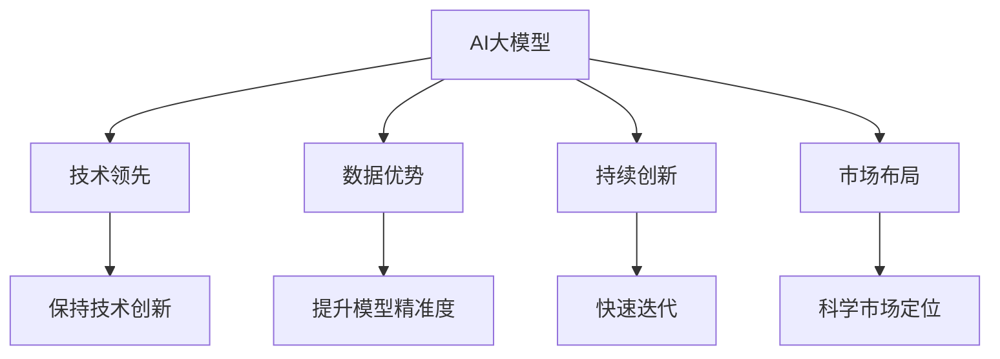

                 

# AI大模型创业：如何应对未来竞争对手？

> 关键词：AI大模型,创业,竞争策略,技术领先,数据优势,持续创新,市场布局

## 1. 背景介绍

### 1.1 问题由来
随着人工智能(AI)技术的迅猛发展，特别是在大模型领域，各大公司纷纷推出自家的AI大模型，如谷歌的BERT、OpenAI的GPT-3、百度的ERNIE等。这些大模型拥有巨大的参数量和丰富的语言理解能力，已经在自然语言处理(NLP)、计算机视觉(CV)、语音识别(SR)等多个领域展现出强大的应用潜力。AI大模型不仅可以帮助企业快速实现产品迭代，提高决策效率，还能帮助普通开发者便捷地实现复杂算法，推动整个社会的信息化进程。

然而，在AI大模型创业领域，竞争日趋激烈，如何在技术上领先对手，在市场上获得优势，是每个创业者必须面对的重要问题。本文将从技术、市场、策略等多个角度，探讨如何在大模型创业中保持竞争优势，获取未来发展的主动权。

### 1.2 问题核心关键点
在未来AI大模型创业中，保持技术领先、积累数据优势、进行持续创新、科学的市场布局是取得成功的重要因素。具体来说：
1. **技术领先**：开发高性能、可扩展的AI大模型，保持算法和架构的先进性。
2. **数据优势**：利用自有数据或合作伙伴数据，提升模型的精准度和泛化能力。
3. **持续创新**：紧跟最新的AI研究成果，快速迭代模型和应用。
4. **市场布局**：深入理解市场需求，科学规划产品定位和推广策略。

以下我们将对这些关键点进行逐一阐述。

## 2. 核心概念与联系

### 2.1 核心概念概述

为更好地理解AI大模型创业策略，我们需要明确几个核心概念：

- **AI大模型**：以Transformer、BERT等架构为基础的大规模预训练模型。其核心在于通过大规模无标签数据进行预训练，学习通用的语言知识，具备强大的通用性和泛化能力。

- **创业**：指创建新公司或业务，从无到有地进行市场化运作。在AI大模型领域，创业意味着构建一个AI大模型服务或应用，将其商业化。

- **竞争策略**：指企业为了在激烈的市场竞争中获取优势，所采取的各种策略和行动。包括技术领先、市场定位、营销推广等。

- **技术领先**：指在技术研发和模型构建上具有领先优势，保持核心技术的创新和领先。

- **数据优势**：指通过收集和利用优质数据，提升模型的精准度和泛化能力，构建数据驱动的竞争优势。

- **持续创新**：指不断探索和应用最新的AI研究成果，保持模型的先进性和竞争力。

- **市场布局**：指通过科学的市场调研和分析，制定合适的市场进入和推广策略，获取最大的市场份额和收益。

这些概念之间的逻辑关系可以通过以下Mermaid流程图来展示：



这个流程图展示了AI大模型创业的核心概念及其之间的联系：

1. 大模型通过技术领先、数据优势、持续创新等方式提升自身能力。
2. 市场布局与技术领先、数据优势、持续创新相辅相成，科学的市场定位和推广策略能够帮助大模型获得更广泛的应用和收益。

## 3. 核心算法原理 & 具体操作步骤

### 3.1 算法原理概述

AI大模型的核心在于通过大规模无标签数据进行预训练，学习通用的语言知识。在创业过程中，需要对大模型进行微调或迁移学习，以适配具体的业务需求。以下我们将重点介绍两种主要算法：

- **微调(MFine-tuning)**：指在预训练模型的基础上，使用下游任务的少量标注数据进行有监督学习，优化模型在该任务上的性能。通过微调，可以在固定预训练权重的前提下，提升模型的特定任务能力。

- **迁移学习**：指在预训练模型的基础上，通过微调或微调整合，将预训练模型的知识和技能迁移到新的任务上，提升新任务的表现。

### 3.2 算法步骤详解

#### 3.2.1 微调步骤

1. **准备数据**：收集和标注下游任务的数据集，划分为训练集、验证集和测试集。
2. **选择模型**：选择适合的预训练模型作为初始化参数，如BERT、GPT等。
3. **添加任务适配层**：根据任务类型，添加任务特定的输出层和损失函数，如分类任务添加线性分类器，生成任务添加解码器。
4. **设置微调超参数**：选择合适的优化算法和超参数，如Adam、SGD等，设置学习率、批大小、迭代轮数等。
5. **执行微调**：使用梯度下降等优化算法，对模型进行有监督学习，最小化损失函数。
6. **测试和部署**：在测试集上评估微调后的模型，集成到实际应用系统中。

#### 3.2.2 迁移学习步骤

1. **选择预训练模型**：选择适合的预训练模型作为初始化参数。
2. **选择新任务**：确定需要迁移学习的新任务。
3. **微调模型**：在预训练模型的基础上，使用新任务的少量标注数据进行微调，优化模型在新任务上的性能。
4. **评估和部署**：在新任务上评估模型性能，部署到实际应用系统中。

### 3.3 算法优缺点

#### 3.3.1 微调优缺点

**优点**：
- 在少量标注数据上即可快速提升模型性能，适合小规模应用场景。
- 预训练模型已具备丰富的语言知识，微调后性能提升显著。
- 适用性广，适用于分类、匹配、生成等多种NLP任务。

**缺点**：
- 对标注数据依赖大，数据集大小和质量直接影响模型表现。
- 泛化能力受限，当目标任务与预训练数据的分布差异较大时，微调效果不佳。
- 预训练模型可能存在偏见和有害信息，微调后可能继承这些特性。

#### 3.3.2 迁移学习优缺点

**优点**：
- 利用预训练模型的通用知识，避免从头训练，加快模型开发速度。
- 泛化能力更强，新任务上性能表现更稳定。
- 风险可控，可以通过逐步微调逐步提升模型效果。

**缺点**：
- 数据需求大，新任务的数据集可能难以获取。
- 微调过程复杂，需要更多技术支持和资源投入。
- 难以保证预训练和微调之间的知识衔接。

### 3.4 算法应用领域

AI大模型微调和迁移学习在多个领域中得到广泛应用，包括：

- **自然语言处理(NLP)**：文本分类、命名实体识别、情感分析、机器翻译等。
- **计算机视觉(CV)**：图像分类、目标检测、图像生成、图像分割等。
- **语音识别(SR)**：语音识别、语音合成、声纹识别等。
- **推荐系统**：个性化推荐、内容推荐等。
- **金融科技**：信用评分、风险评估、市场分析等。

这些应用领域为大模型创业提供了广阔的市场空间和创新机会。

## 4. 数学模型和公式 & 详细讲解 & 举例说明

### 4.1 数学模型构建

在AI大模型创业中，微调和迁移学习算法通常基于以下数学模型：

1. **预训练模型**：以自回归或自编码模型为代表的大规模预训练模型，如BERT、GPT等。
2. **下游任务**：如文本分类、目标检测等，用$(x,y)$表示输入和标签。
3. **损失函数**：常用的损失函数包括交叉熵、均方误差等。
4. **优化算法**：如Adam、SGD等，设置学习率$\eta$、批大小$N$、迭代轮数$T$等。

### 4.2 公式推导过程

以文本分类任务为例，微调模型的优化目标为最小化经验风险：

$$
\min_{\theta} \frac{1}{N} \sum_{i=1}^N \ell(M_{\theta}(x_i),y_i)
$$

其中$M_{\theta}$为微调后的模型，$\ell$为损失函数。

微调的优化目标可以通过梯度下降等优化算法实现，每次迭代更新参数$\theta$：

$$
\theta \leftarrow \theta - \eta \nabla_{\theta}\mathcal{L}(\theta)
$$

其中$\nabla_{\theta}\mathcal{L}(\theta)$为损失函数对参数$\theta$的梯度，可以通过反向传播算法计算。

### 4.3 案例分析与讲解

假设我们有一项文本分类任务，已知标注数据集$D=\{(x_i,y_i)\}_{i=1}^N$，其中$x_i$为输入文本，$y_i$为分类标签。我们选择BERT作为预训练模型，在微调过程中，使用交叉熵损失函数$\ell$和Adam优化算法。

1. **数据预处理**：将文本$x_i$转换为BERT模型的输入格式，使用BertTokenizer进行分词和编码。
2. **添加任务适配层**：在BERT的顶层添加一个线性分类器和softmax层，用于分类。
3. **微调模型**：使用Adam优化器，设置学习率$\eta=2e-5$，批大小$N=16$，迭代轮数$T=5$。
4. **评估模型**：在测试集上评估模型分类准确率。

通过以上步骤，可以构建一个基本的文本分类模型，并在微调过程中不断优化模型参数，提升分类效果。

## 5. 项目实践：代码实例和详细解释说明

### 5.1 开发环境搭建

为了进行AI大模型创业，我们需要搭建一个高效的开发环境，主要包括以下步骤：

1. **安装Python环境**：使用Anaconda或Miniconda创建虚拟环境，安装Python及其依赖库。
2. **安装深度学习框架**：选择PyTorch或TensorFlow作为深度学习框架。
3. **安装预训练模型**：下载和使用预训练模型，如BERT、GPT等。
4. **安装库和工具**：安装TensorBoard、Weights & Biases等工具，用于模型调试和可视化。
5. **搭建服务器**：搭建GPU/TPU服务器，部署模型和应用。

### 5.2 源代码详细实现

以使用PyTorch进行BERT文本分类微调为例，以下是关键代码实现：

```python
import torch
import torch.nn as nn
from transformers import BertTokenizer, BertForSequenceClassification, AdamW
from torch.utils.data import DataLoader
from tqdm import tqdm

# 准备数据集
train_dataset = ...
dev_dataset = ...
test_dataset = ...

# 初始化模型和优化器
model = BertForSequenceClassification.from_pretrained('bert-base-uncased', num_labels=2)
optimizer = AdamW(model.parameters(), lr=2e-5)

# 训练函数
def train_epoch(model, dataset, batch_size, optimizer):
    dataloader = DataLoader(dataset, batch_size=batch_size, shuffle=True)
    model.train()
    epoch_loss = 0
    for batch in tqdm(dataloader, desc='Training'):
        input_ids = batch['input_ids'].to(device)
        attention_mask = batch['attention_mask'].to(device)
        labels = batch['labels'].to(device)
        model.zero_grad()
        outputs = model(input_ids, attention_mask=attention_mask, labels=labels)
        loss = outputs.loss
        epoch_loss += loss.item()
        loss.backward()
        optimizer.step()
    return epoch_loss / len(dataloader)

# 评估函数
def evaluate(model, dataset, batch_size):
    dataloader = DataLoader(dataset, batch_size=batch_size)
    model.eval()
    preds, labels = [], []
    with torch.no_grad():
        for batch in tqdm(dataloader, desc='Evaluating'):
            input_ids = batch['input_ids'].to(device)
            attention_mask = batch['attention_mask'].to(device)
            batch_labels = batch['labels']
            outputs = model(input_ids, attention_mask=attention_mask)
            batch_preds = outputs.logits.argmax(dim=2).to('cpu').tolist()
            batch_labels = batch_labels.to('cpu').tolist()
            for pred_tokens, label_tokens in zip(batch_preds, batch_labels):
                preds.append(pred_tokens)
                labels.append(label_tokens)
    
    return classification_report(labels, preds)

# 训练和评估模型
epochs = 5
batch_size = 16

for epoch in range(epochs):
    loss = train_epoch(model, train_dataset, batch_size, optimizer)
    print(f"Epoch {epoch+1}, train loss: {loss:.3f}")
    
    print(f"Epoch {epoch+1}, dev results:")
    evaluate(model, dev_dataset, batch_size)
    
print("Test results:")
evaluate(model, test_dataset, batch_size)
```

以上代码实现了使用BERT进行文本分类任务的微调，并输出了训练和评估结果。

### 5.3 代码解读与分析

**数据预处理**：使用BertTokenizer将文本转换为BERT模型的输入格式，包括分词、编码等步骤。

**模型初始化**：使用BertForSequenceClassification类初始化模型，设置分类数为2。

**训练函数**：定义训练函数，使用AdamW优化器，设置学习率、批大小、迭代轮数，并在训练集上进行微调。

**评估函数**：定义评估函数，在测试集上评估模型分类准确率。

**训练和评估模型**：在训练集上不断迭代训练，并在验证集和测试集上进行评估，输出训练和评估结果。

## 6. 实际应用场景

### 6.1 智慧医疗

AI大模型在智慧医疗领域的应用广泛，如智能诊断、电子病历分析、药物推荐等。通过微调和迁移学习，可以在少量标注数据上快速开发智能医疗系统，提升诊疗效率和准确性。

**应用案例**：某医疗公司利用BERT模型进行电子病历分析，通过微调和迁移学习，提升了诊断准确率和病历处理速度。

### 6.2 智能客服

智能客服系统通过微调和迁移学习，可以提升客户咨询体验和问题解决效率。智能客服机器人可以实时回答用户问题，提供个性化服务。

**应用案例**：某电商公司使用GPT模型进行智能客服开发，通过微调和迁移学习，提升了客户满意度。

### 6.3 金融风控

AI大模型在金融风控领域的应用，如信用评分、风险评估等，通过微调和迁移学习，可以提升风险控制能力和决策效率。

**应用案例**：某金融公司使用BERT模型进行信用评分，通过微调和迁移学习，提升了贷款审批速度和准确率。

### 6.4 未来应用展望

未来，AI大模型创业将涵盖更多领域，包括智慧城市、智能制造、教育等。在实际应用中，大模型将与更多技术和产业进行深度融合，实现更广泛的应用。

## 7. 工具和资源推荐

### 7.1 学习资源推荐

1. **《深度学习》书籍**：Ian Goodfellow等人编写，全面介绍了深度学习的基本概念和应用。
2. **《自然语言处理》书籍**：Yoshua Bengio等人编写，涵盖了自然语言处理的各个方面。
3. **Coursera深度学习课程**：由Andrew Ng等知名学者开设，提供系统的深度学习知识体系。
4. **ArXiv论文预印库**：获取最新的AI研究成果，跟踪前沿动态。

### 7.2 开发工具推荐

1. **PyTorch**：灵活的深度学习框架，适合快速迭代开发。
2. **TensorFlow**：生产部署方便，适合大规模工程应用。
3. **Weights & Biases**：模型训练实验跟踪工具，用于记录和可视化模型训练过程。
4. **TensorBoard**：TensorFlow配套的可视化工具，实时监测模型训练状态。

### 7.3 相关论文推荐

1. **《Attention is All You Need》**：提出Transformer结构，开启了大模型时代。
2. **《BERT: Pre-training of Deep Bidirectional Transformers for Language Understanding》**：提出BERT模型，引入掩码语言模型预训练任务。
3. **《AdaLoRA: Adaptive Low-Rank Adaptation for Parameter-Efficient Fine-Tuning》**：提出参数高效微调方法，减少模型参数量。
4. **《Prompt-Tuning: Optimizing Continuous Prompts for Generation》**：引入连续型Prompt，提升模型生成能力。

## 8. 总结：未来发展趋势与挑战

### 8.1 研究成果总结

未来AI大模型创业将面临更多的竞争和技术挑战，需要不断创新和优化。关键在于技术领先、数据优势、持续创新和科学的市场布局。

### 8.2 未来发展趋势

1. **技术领先**：AI大模型将继续以技术创新为核心，保持算法的先进性和模型的精准度。
2. **数据优势**：通过积累和利用更多优质数据，提升模型的泛化能力和鲁棒性。
3. **持续创新**：紧跟最新的AI研究成果，快速迭代模型和应用。
4. **市场布局**：科学的市场调研和分析，制定合适的市场进入和推广策略。

### 8.3 面临的挑战

1. **技术瓶颈**：算力和硬件资源的限制，需要开发更高效、更轻量级的模型。
2. **数据隐私**：数据隐私和安全问题，需要确保数据合规和安全。
3. **市场竞争**：激烈的市场竞争，需要不断创新和优化。
4. **用户需求**：用户需求的多样性，需要灵活应对和调整。

### 8.4 研究展望

未来的AI大模型创业需要突破当前的技术瓶颈，开发更高效、更安全、更普适的模型。同时，需要更加注重用户需求，科学制定市场策略，不断提升模型的应用价值和用户体验。

## 9. 附录：常见问题与解答

**Q1：AI大模型微调和迁移学习有什么区别？**

A: AI大模型微调指的是在预训练模型的基础上，使用下游任务的少量标注数据进行有监督学习，优化模型在该任务上的性能。迁移学习则是指在预训练模型的基础上，通过微调或微调整合，将预训练模型的知识和技能迁移到新的任务上，提升新任务的表现。

**Q2：AI大模型创业需要多少标注数据？**

A: AI大模型创业所需标注数据量因任务而异。通常情况下，小规模NLP任务如情感分析、文本分类等，几百到几千条标注数据即可。但对于大规模任务如机器翻译、知识图谱构建等，可能需要几万到几十万的标注数据。

**Q3：如何选择适合的预训练模型？**

A: 选择适合的预训练模型需要考虑任务的特性和数据的分布。BERT适用于各种NLP任务，GPT适用于生成任务，如对话生成、文本生成等。

**Q4：AI大模型创业需要哪些关键技术？**

A: AI大模型创业需要具备以下关键技术：
1. 深度学习框架（如PyTorch、TensorFlow）。
2. 预训练模型（如BERT、GPT）。
3. 微调和迁移学习算法。
4. 数据处理和增强技术。
5. 模型优化和加速技术（如量化、剪枝、混合精度训练等）。

通过系统学习和掌握这些技术，可以有效提升AI大模型创业的成功率。

