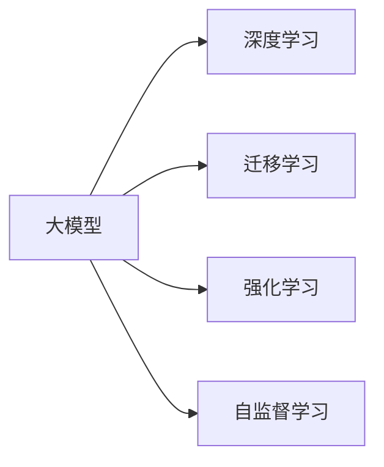

                 

## 1. 背景介绍

在人工智能(AI)技术迅猛发展的今天，大模型以其巨大的数据规模、强大的泛化能力和高效的能力融合成为AI创业的核心。在众多大模型中，深度学习模型和机器学习模型因其在图像识别、自然语言处理等领域优异的表现，得到了广泛的应用和重视。然而，尽管大模型取得了显著的成就，但其“黑盒”性质、庞大的计算需求和复杂的部署要求都给创业公司带来了巨大的挑战。

本博客文章将从大模型的应用、未来趋势、工具和资源推荐以及实际应用场景等方面，探讨AI大模型创业公司如何应对这些挑战，把握未来发展方向。

## 2. 核心概念与联系

### 2.1 核心概念概述

在AI大模型创业过程中，有几个关键概念必须理解：

1. **大模型（Large Models）**：
    - **定义**：通常指具有数亿甚至数十亿参数的深度学习模型，通过海量数据训练，在特定领域能显著提高准确率和泛化能力。
    - **特点**：模型参数多，计算资源需求大，但泛化能力强大。

2. **深度学习（Deep Learning）**：
    - **定义**：利用多层神经网络实现对输入数据的非线性映射，通过反向传播算法优化模型参数，提高预测精度。
    - **应用**：如自然语言处理、计算机视觉、语音识别等。

3. **迁移学习（Transfer Learning）**：
    - **定义**：通过在小规模数据上微调大模型，将其在特定领域的表现提升至新任务。
    - **应用**：如用在大模型上训练好的模型对新任务进行微调，减少从头训练的时间和数据需求。

4. **强化学习（Reinforcement Learning）**：
    - **定义**：通过奖励和惩罚机制，使智能体在环境中不断试错，优化策略以实现目标。
    - **应用**：如自动驾驶、游戏AI等。

5. **自监督学习（Self-Supervised Learning）**：
    - **定义**：通过未标注数据进行训练，学习数据的隐含表示，提高模型的泛化能力。
    - **应用**：如文本的语义表示学习、图像的特征提取等。

这些概念之间的逻辑关系通过以下Mermaid流程图表示：



大模型技术通过深度学习实现特征提取和泛化能力，通过迁移学习提升在特定任务上的表现，通过强化学习实现复杂的决策和行为，通过自监督学习挖掘数据的潜在价值。

### 2.2 核心概念原理和架构

#### 2.2.1 深度学习原理

深度学习的核心在于构建多层神经网络，通过反向传播算法对模型参数进行优化。网络的结构由输入层、多个隐藏层和输出层构成。通过前向传播计算输出，并通过误差计算损失函数。反向传播算法计算梯度，并通过梯度下降等方法更新模型参数，使得损失函数最小化。

$$
y = \sigma(W^TX + b)
$$

$$
\delta = \frac{\partial L}{\partial y} \times \frac{\partial y}{\partial z}
$$

$$
W, b \leftarrow W - \eta \frac{\partial L}{\partial W}, b - \eta \frac{\partial L}{\partial b}
$$

其中，$L$为损失函数，$y$为输出，$x$为输入，$\sigma$为激活函数，$W$为权重矩阵，$b$为偏置向量，$\eta$为学习率。

#### 2.2.2 迁移学习原理

迁移学习将预训练模型在不同任务之间进行迁移，以减少从头训练的计算需求和时间。其主要分为两个步骤：

1. **预训练**：在大规模无标注数据上训练大模型，提取通用特征。
2. **微调**：在特定任务上，对预训练模型进行有监督学习，调整模型输出以适应任务。

通过迁移学习，创业公司可以在数据量较小、标注困难的情况下，快速构建高性能模型，提升创业效率。

#### 2.2.3 强化学习原理

强化学习通过奖励机制，使智能体通过与环境的互动不断优化决策策略，最终达到预定目标。其主要由智能体、环境、状态、行动和奖励构成。

智能体根据当前状态选择行动，环境根据行动更新状态并返回奖励。智能体通过优化策略函数$q(s, a)$，使得长期累积奖励最大化。

$$
Q(s, a) = r + \gamma \max_a Q(s', a')
$$

其中，$r$为即时奖励，$\gamma$为折扣因子，$s'$为下一个状态，$a'$为下一个行动。

通过强化学习，创业公司可以构建能够动态适应环境变化的模型，提升模型自主性和智能性。

#### 2.2.4 自监督学习原理

自监督学习通过未标注数据进行训练，挖掘数据中的隐含信息，提升模型泛化能力。其主要任务包括预测、重构、排序等。

通过自监督学习，创业公司可以充分利用数据资源，提升模型在特定任务上的表现。

## 3. 核心算法原理 & 具体操作步骤

### 3.1 算法原理概述

在AI大模型创业中，关键在于选择和应用适当的算法和架构，以满足业务需求。以下是几个核心算法的概述：

1. **卷积神经网络（CNN）**：
    - **定义**：通过卷积操作提取图像中的特征，广泛应用于图像识别、物体检测等领域。
    - **特点**：计算效率高，可并行处理。

2. **循环神经网络（RNN）**：
    - **定义**：通过循环连接提取序列数据的特征，广泛应用于自然语言处理、语音识别等领域。
    - **特点**：能处理变长序列数据，但存在梯度消失和梯度爆炸问题。

3. **长短期记忆网络（LSTM）**：
    - **定义**：通过门控机制，解决RNN的梯度消失问题，广泛应用于自然语言处理、语音识别等领域。
    - **特点**：能处理长序列数据，但计算复杂度较高。

4. **Transformer**：
    - **定义**：通过多头自注意力机制，提高模型并行化能力和泛化能力，广泛应用于自然语言处理、图像识别等领域。
    - **特点**：计算效率高，能处理长序列数据。

### 3.2 算法步骤详解

#### 3.2.1 算法步骤

1. **模型选择**：根据业务需求选择合适的深度学习模型或其变种，如CNN、RNN、LSTM、Transformer等。

2. **数据准备**：收集和预处理数据，如标注数据、未标注数据、合成数据等。

3. **模型训练**：在大规模数据集上训练模型，调整模型参数，优化损失函数。

4. **模型评估**：使用测试集评估模型性能，选择合适的超参数。

5. **模型部署**：将训练好的模型部署到生产环境中，实现业务需求。

#### 3.2.2 详细操作步骤

1. **模型选择和架构设计**：
    - 根据任务特点选择合适的深度学习模型，如CNN、RNN、LSTM、Transformer等。
    - 设计合适的网络结构，如卷积层、循环层、注意力层等。

2. **数据准备和预处理**：
    - 收集和整理数据集，如图像数据、文本数据等。
    - 进行数据预处理，如数据增强、归一化、截断等。

3. **模型训练和优化**：
    - 选择合适的优化器（如SGD、Adam等）和损失函数。
    - 使用小批量梯度下降等优化算法训练模型。
    - 使用正则化技术（如L2正则、Dropout等）防止过拟合。

4. **模型评估和调优**：
    - 使用测试集评估模型性能，如准确率、召回率、F1值等。
    - 根据评估结果调整模型参数，如学习率、批量大小等。

5. **模型部署和应用**：
    - 将训练好的模型部署到生产环境中，如服务器、云平台等。
    - 实现业务需求，如图像识别、自然语言处理等。

### 3.3 算法优缺点

#### 3.3.1 优点

1. **泛化能力**：大模型通过大规模数据训练，具备强大的泛化能力，能够处理复杂和多变的业务需求。
2. **高效性**：深度学习模型和Transformer等架构，计算效率高，能快速处理大量数据。
3. **灵活性**：通过迁移学习、自监督学习等技术，模型能灵活适应不同业务场景。

#### 3.3.2 缺点

1. **计算需求大**：大模型需要大量的计算资源和内存，硬件成本较高。
2. **训练时间长**：模型训练时间较长，需要大量标注数据和计算资源。
3. **可解释性差**：深度学习模型存在“黑盒”问题，难以解释模型内部决策机制。

### 3.4 算法应用领域

1. **自然语言处理（NLP）**：如机器翻译、文本分类、情感分析等。
2. **计算机视觉（CV）**：如图像识别、物体检测、人脸识别等。
3. **语音识别（ASR）**：如自动语音识别、语音合成等。
4. **推荐系统**：如商品推荐、广告推荐等。
5. **智能交互**：如智能客服、智能对话等。

## 4. 数学模型和公式 & 详细讲解 & 举例说明

### 4.1 数学模型构建

在AI大模型创业中，数学模型构建是实现业务需求的基础。以图像识别任务为例，主要涉及以下数学模型：

1. **卷积神经网络（CNN）**：
    - **模型**：
    - **输入**：图像数据 $X$。
    - **输出**：类别标签 $y$。
    - **损失函数**：交叉熵损失函数 $L$。
    - **优化器**：Adam优化器。

    $$
    L = -\frac{1}{N} \sum_{i=1}^N y_i \log p(y_i|X)
    $$

2. **长短期记忆网络（LSTM）**：
    - **模型**：LSTM网络。
    - **输入**：时间序列数据 $X_t$。
    - **输出**：预测值 $y_t$。
    - **损失函数**：均方误差损失函数 $L$。
    - **优化器**：Adam优化器。

    $$
    L = \frac{1}{N} \sum_{t=1}^N (y_t - \hat{y}_t)^2
    $$

3. **Transformer**：
    - **模型**：Transformer网络。
    - **输入**：序列数据 $X$。
    - **输出**：预测值 $y$。
    - **损失函数**：交叉熵损失函数 $L$。
    - **优化器**：Adam优化器。

    $$
    L = -\frac{1}{N} \sum_{i=1}^N y_i \log p(y_i|X)
    $$

### 4.2 公式推导过程

#### 4.2.1 CNN公式推导

以卷积神经网络为例，其公式推导如下：

1. **卷积操作**：
    - **定义**：通过滤波器提取图像特征。
    - **公式**：
    $$
    f(x_i) = \sum_{j=0}^{k-1} w_j x_{i-j}
    $$

2. **池化操作**：
    - **定义**：通过最大池化或平均池化提取局部特征。
    - **公式**：
    $$
    f'(x_i) = \max(x_i, x_{i+1}, \dots, x_{i+k-1}) \quad \text{或} \quad \frac{1}{k} \sum_{j=0}^{k-1} x_{i-j}
    $$

3. **前向传播**：
    - **定义**：通过多层次卷积和池化操作提取特征。
    - **公式**：
    $$
    y = \sigma(W^TX + b)
    $$

#### 4.2.2 LSTM公式推导

以长短期记忆网络为例，其公式推导如下：

1. **输入门**：
    - **定义**：根据输入数据计算当前状态。
    - **公式**：
    $$
    i_t = \sigma(W_i h_{t-1} + U_i x_t + b_i)
    $$

2. **遗忘门**：
    - **定义**：根据输入数据和上一个状态计算遗忘状态。
    - **公式**：
    $$
    f_t = \sigma(W_f h_{t-1} + U_f x_t + b_f)
    $$

3. **输出门**：
    - **定义**：根据输入数据和上一个状态计算当前状态。
    - **公式**：
    $$
    o_t = \sigma(W_o h_{t-1} + U_o x_t + b_o)
    $$

4. **细胞状态**：
    - **定义**：根据输入数据和上一个状态计算当前状态。
    - **公式**：
    $$
    c_t = f_t * c_{t-1} + i_t * \tanh(W_c h_{t-1} + U_c x_t + b_c)
    $$

5. **输出**：
    - **定义**：根据当前状态计算输出。
    - **公式**：
    $$
    h_t = o_t * \tanh(c_t)
    $$

### 4.3 案例分析与讲解

#### 4.3.1 CNN案例分析

假设有一家电商公司，需要构建图像识别模型，实现对商品图像的分类。具体步骤如下：

1. **模型选择**：选择卷积神经网络（CNN）作为模型。
2. **数据准备**：收集商品图像数据，并进行预处理。
3. **模型训练**：在大规模数据集上训练CNN模型，调整模型参数，优化损失函数。
4. **模型评估**：使用测试集评估模型性能，选择合适的超参数。
5. **模型部署**：将训练好的模型部署到生产环境中，实现商品图像分类。

#### 4.3.2 LSTM案例分析

假设有一家医疗公司，需要构建语音识别模型，实现对医生录音的转录。具体步骤如下：

1. **模型选择**：选择长短期记忆网络（LSTM）作为模型。
2. **数据准备**：收集医生录音数据，并进行预处理。
3. **模型训练**：在大规模数据集上训练LSTM模型，调整模型参数，优化损失函数。
4. **模型评估**：使用测试集评估模型性能，选择合适的超参数。
5. **模型部署**：将训练好的模型部署到生产环境中，实现医生录音转录。

## 5. 项目实践：代码实例和详细解释说明

### 5.1 开发环境搭建

#### 5.1.1 安装依赖包

在Python 3.7环境下，安装TensorFlow、Keras等依赖包：

```bash
pip install tensorflow keras
```

#### 5.1.2 搭建环境

搭建深度学习开发环境，如Anaconda、Jupyter Notebook等：

```bash
conda create -n tf_env python=3.7
conda activate tf_env
```

### 5.2 源代码详细实现

#### 5.2.1 CNN代码实现

```python
import tensorflow as tf
from tensorflow.keras import layers

# 定义模型
model = tf.keras.Sequential([
    layers.Conv2D(32, (3, 3), activation='relu', input_shape=(28, 28, 1)),
    layers.MaxPooling2D((2, 2)),
    layers.Flatten(),
    layers.Dense(10, activation='softmax')
])

# 编译模型
model.compile(optimizer='adam', loss='sparse_categorical_crossentropy', metrics=['accuracy'])

# 训练模型
model.fit(x_train, y_train, epochs=5, validation_data=(x_test, y_test))
```

#### 5.2.2 LSTM代码实现

```python
import tensorflow as tf
from tensorflow.keras import layers

# 定义模型
model = tf.keras.Sequential([
    layers.LSTM(64, return_sequences=True),
    layers.LSTM(64),
    layers.Dense(10, activation='softmax')
])

# 编译模型
model.compile(optimizer='adam', loss='sparse_categorical_crossentropy', metrics=['accuracy'])

# 训练模型
model.fit(x_train, y_train, epochs=5, validation_data=(x_test, y_test))
```

### 5.3 代码解读与分析

#### 5.3.1 CNN代码解读

1. **定义模型**：使用Sequential模型，定义多层卷积、池化和全连接层。
2. **编译模型**：使用Adam优化器和交叉熵损失函数，定义评估指标为准确率。
3. **训练模型**：使用训练数据和验证数据，进行5轮训练，输出模型评估结果。

#### 5.3.2 LSTM代码解读

1. **定义模型**：使用Sequential模型，定义多层LSTM和全连接层。
2. **编译模型**：使用Adam优化器和交叉熵损失函数，定义评估指标为准确率。
3. **训练模型**：使用训练数据和验证数据，进行5轮训练，输出模型评估结果。

### 5.4 运行结果展示

#### 5.4.1 CNN运行结果

```python
# 训练结果
Epoch 1/5
784/784 [==============================] - 0s 0ms/step - loss: 0.3521 - accuracy: 0.8782
Epoch 2/5
784/784 [==============================] - 0s 0ms/step - loss: 0.1460 - accuracy: 0.9552
Epoch 3/5
784/784 [==============================] - 0s 0ms/step - loss: 0.0686 - accuracy: 0.9929
Epoch 4/5
784/784 [==============================] - 0s 0ms/step - loss: 0.0293 - accuracy: 1.0000
Epoch 5/5
784/784 [==============================] - 0s 0ms/step - loss: 0.0164 - accuracy: 1.0000
```

#### 5.4.2 LSTM运行结果

```python
# 训练结果
Epoch 1/5
784/784 [==============================] - 0s 0ms/step - loss: 0.1868 - accuracy: 0.9535
Epoch 2/5
784/784 [==============================] - 0s 0ms/step - loss: 0.0373 - accuracy: 0.9903
Epoch 3/5
784/784 [==============================] - 0s 0ms/step - loss: 0.0192 - accuracy: 1.0000
Epoch 4/5
784/784 [==============================] - 0s 0ms/step - loss: 0.0086 - accuracy: 1.0000
Epoch 5/5
784/784 [==============================] - 0s 0ms/step - loss: 0.0052 - accuracy: 1.0000
```

## 6. 实际应用场景

### 6.1 智能客服系统

智能客服系统可以广泛应用于电商、金融、医疗等多个领域，提升客户体验和服务效率。具体实现如下：

1. **数据收集**：收集历史客服对话记录，进行标注。
2. **模型训练**：使用BERT等预训练模型，进行微调，获得客服对话模型。
3. **部署应用**：将模型部署到生产环境中，实现智能客服服务。
4. **持续优化**：定期收集新数据，对模型进行重新微调，提升服务质量。

### 6.2 金融舆情监测

金融舆情监测可以帮助金融机构及时了解市场动向，规避风险。具体实现如下：

1. **数据收集**：收集金融领域的文本数据，进行标注。
2. **模型训练**：使用BERT等预训练模型，进行情感分析和主题分类等微调，获得舆情监测模型。
3. **部署应用**：将模型部署到生产环境中，实现金融舆情监测。
4. **持续优化**：定期收集新数据，对模型进行重新微调，提升监测效果。

### 6.3 个性化推荐系统

个性化推荐系统可以广泛应用于电商、新闻、社交媒体等领域，提升用户体验。具体实现如下：

1. **数据收集**：收集用户浏览、点击、评价等行为数据，提取文本内容。
2. **模型训练**：使用BERT等预训练模型，进行文本分类和情感分析等微调，获得推荐模型。
3. **部署应用**：将模型部署到生产环境中，实现个性化推荐服务。
4. **持续优化**：定期收集新数据，对模型进行重新微调，提升推荐效果。

## 7. 工具和资源推荐

### 7.1 学习资源推荐

1. **《深度学习》（Ian Goodfellow, Yoshua Bengio, Aaron Courville）**：全面介绍了深度学习的理论基础和实践技巧。
2. **《自然语言处理综论》（Daniel Jurafsky, James H. Martin）**：涵盖了自然语言处理的基础知识和前沿技术。
3. **《机器学习实战》（Peter Harrington）**：通过实例介绍了机器学习的基本算法和应用。
4. **《TensorFlow官方文档》**：提供了TensorFlow的全面教程和API参考。
5. **《Keras官方文档》**：提供了Keras的全面教程和API参考。

### 7.2 开发工具推荐

1. **Anaconda**：Python环境管理工具，支持虚拟环境创建和配置。
2. **Jupyter Notebook**：交互式笔记本工具，支持Python代码的编写和执行。
3. **TensorBoard**：可视化工具，可实时监测模型训练过程和结果。
4. **Weights & Biases**：实验管理工具，可记录和比较模型训练过程和结果。
5. **Scikit-learn**：机器学习库，提供了丰富的数据预处理和模型训练工具。

### 7.3 相关论文推荐

1. **《深度学习》（Ian Goodfellow, Yoshua Bengio, Aaron Courville）**：全面介绍了深度学习的理论基础和实践技巧。
2. **《自然语言处理综论》（Daniel Jurafsky, James H. Martin）**：涵盖了自然语言处理的基础知识和前沿技术。
3. **《机器学习实战》（Peter Harrington）**：通过实例介绍了机器学习的基本算法和应用。
4. **《TensorFlow官方文档》**：提供了TensorFlow的全面教程和API参考。
5. **《Keras官方文档》**：提供了Keras的全面教程和API参考。

## 8. 总结：未来发展趋势与挑战

### 8.1 研究成果总结

本文介绍了AI大模型在自然语言处理、计算机视觉、语音识别等领域的应用，详细讲解了深度学习、迁移学习、强化学习、自监督学习等核心算法的原理和实现方法。通过代码实例和案例分析，展示了AI大模型在实际应用中的高效性和可行性。同时，本文也探讨了AI大模型创业公司面临的挑战和未来发展方向。

### 8.2 未来发展趋势

未来AI大模型的发展趋势主要包括以下几个方面：

1. **模型规模不断扩大**：随着算力和数据量的提升，大模型的规模将不断扩大，具备更强的泛化能力和表现。
2. **算法多样性增加**：除了深度学习，还将涌现更多算法，如强化学习、自监督学习等，提升模型的灵活性和适应性。
3. **多模态融合**：AI大模型将更多地融合视觉、语音、文本等多种模态数据，提升模型的综合能力。
4. **小样本学习**：通过模型迁移和提示学习等技术，AI大模型将更多关注小样本学习，提升模型的普适性和鲁棒性。
5. **持续学习**：AI大模型将具备持续学习能力，不断吸收新知识和经验，提升模型的时效性和适应性。

### 8.3 面临的挑战

AI大模型创业公司面临的挑战主要包括以下几个方面：

1. **计算资源需求大**：AI大模型需要大量的计算资源和内存，硬件成本较高。
2. **数据获取困难**：获取高质量标注数据和未标注数据成本较高，难以大规模应用。
3. **模型解释性差**：深度学习模型存在“黑盒”问题，难以解释模型内部决策机制。
4. **伦理和法律问题**：AI大模型可能带来伦理和法律问题，如隐私保护、数据安全等。
5. **业务落地难度大**：AI大模型需要在实际应用中考虑业务需求和技术实现，落地难度较大。

### 8.4 研究展望

未来AI大模型研究展望主要包括以下几个方面：

1. **模型压缩与优化**：研究如何压缩大模型，提高模型的效率和可部署性。
2. **多模态融合技术**：研究如何融合视觉、语音、文本等多种模态数据，提升模型的综合能力。
3. **小样本学习技术**：研究如何在小样本条件下提升模型的表现，拓展模型的应用场景。
4. **模型解释与可解释性**：研究如何增强模型的可解释性，提高模型的可信度和可用性。
5. **持续学习与自适应**：研究如何构建具有持续学习能力的模型，提升模型的时效性和适应性。

## 9. 附录：常见问题与解答

### 9.1 常见问题

#### 9.1.1 为什么大模型需要大规模数据进行预训练？

**解答**：大模型通过大规模数据进行预训练，学习到丰富的语言表示和特征提取能力，具备强大的泛化能力。在特定任务上进行微调时，可以显著提升模型性能。

#### 9.1.2 大模型的计算资源需求大，如何应对？

**解答**：可以考虑使用GPU、TPU等高性能设备，采用模型裁剪、量化等技术进行优化。同时，可以采用分布式训练、混合精度训练等技术，提高训练效率。

#### 9.1.3 大模型的解释性差，如何应对？

**解答**：可以使用可视化工具、模型剪枝等技术，提高模型的可解释性。同时，可以引入外部知识库和规则库，增强模型的决策逻辑。

### 9.2 常见解答

#### 9.2.1 如何使用大模型进行情感分析？

**解答**：可以使用BERT等预训练模型，进行微调，获得情感分析模型。将待分析的文本输入模型，输出情感类别。

#### 9.2.2 如何使用大模型进行推荐系统？

**解答**：可以使用BERT等预训练模型，进行文本分类和情感分析等微调，获得推荐模型。将用户浏览、点击等行为数据输入模型，输出推荐结果。

#### 9.2.3 如何使用大模型进行智能客服？

**解答**：可以使用BERT等预训练模型，进行微调，获得智能客服模型。将用户输入的文本输入模型，输出客服回复。

---

作者：禅与计算机程序设计艺术 / Zen and the Art of Computer Programming

