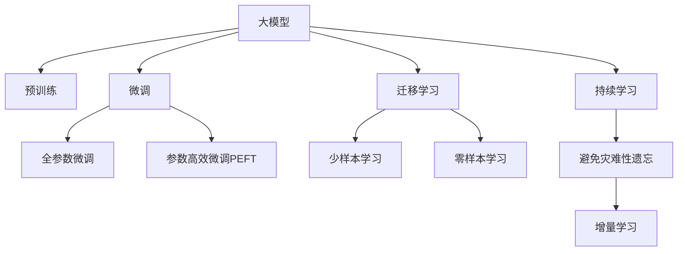

                 

# AI大模型创业：如何抓住未来机遇？

> 关键词：AI创业，大模型，深度学习，自然语言处理，计算机视觉，人工智能应用，创业指南

## 1. 背景介绍

### 1.1 问题由来

随着人工智能技术的迅猛发展，越来越多的创业者开始关注大模型，尤其是那些能在多个领域广泛应用的模型。从自然语言处理(NLP)的BERT、GPT-3，到计算机视觉领域的ResNet、DALL·E，大模型正在成为AI领域的新宠。但随之而来的问题也越来越多：如何选择合适的模型，如何构建应用，如何获得成功？本文将从多个角度，为有意创业的朋友们提供一份全面的指南。

### 1.2 问题核心关键点

大模型在AI创业中的重要性不言而喻，但同时它也带来了不少挑战。核心问题包括：
- 选择合适的模型：如何在不同任务中选择最适合的模型？
- 构建应用：如何将模型应用到实际业务中？
- 获得成功：如何在激烈的市场竞争中脱颖而出？

## 2. 核心概念与联系

### 2.1 核心概念概述

为更好地理解大模型在AI创业中的作用，本节将介绍几个关键概念：

- **大模型**：以自回归(如GPT)或自编码(如BERT)模型为代表的大规模预训练语言模型或视觉模型。通过在大规模无标签数据上进行预训练，学习到通用或特定领域的知识。

- **迁移学习**：指将一个领域学习到的知识，迁移应用到另一个不同但相关的领域的学习范式。大模型通过预训练-微调过程即是一种典型的迁移学习方式。

- **微调**：指在预训练模型的基础上，使用下游任务的少量标注数据，通过有监督地训练来优化模型在该任务上的性能。通常只需调整顶层分类器或解码器，并以较小的学习率更新全部或部分的模型参数。

- **超参数**：指在模型训练过程中需要手动设置的参数，如学习率、批大小、迭代轮数等。选择不当的超参数，可能显著影响模型性能。

- **模型评估指标**：指用于衡量模型性能的指标，如准确率、召回率、F1分数等。

这些核心概念之间的逻辑关系可以通过以下Mermaid流程图来展示：



这个流程图展示了大模型的核心概念及其之间的关系：

1. 大模型通过预训练获得基础能力。
2. 微调是对预训练模型进行任务特定的优化，可以分为全参数微调和参数高效微调（PEFT）。
3. 迁移学习是连接预训练模型与下游任务的桥梁，可以通过微调或提示学习来实现。
4. 持续学习旨在使模型能够不断学习新知识，同时避免遗忘旧知识。

## 3. 核心算法原理 & 具体操作步骤
### 3.1 算法原理概述

基于大模型的创业，本质上是一个模型适配、优化和部署的过程。其核心思想是：将大模型视作一个"通用学习器"，通过微调和迁移学习，使模型适应特定任务的特征和要求。

形式化地，假设大模型为 $M_{\theta}$，其中 $\theta$ 为预训练得到的模型参数。给定下游任务 $T$ 的标注数据集 $D=\{(x_i, y_i)\}_{i=1}^N$，微调的目标是找到新的模型参数 $\hat{\theta}$，使得：

$$
\hat{\theta}=\mathop{\arg\min}_{\theta} \mathcal{L}(M_{\theta},D)
$$

其中 $\mathcal{L}$ 为针对任务 $T$ 设计的损失函数，用于衡量模型预测输出与真实标签之间的差异。常见的损失函数包括交叉熵损失、均方误差损失等。

通过梯度下降等优化算法，微调过程不断更新模型参数 $\theta$，最小化损失函数 $\mathcal{L}$，使得模型输出逼近真实标签。由于 $\theta$ 已经通过预训练获得了较好的初始化，因此即便在小规模数据集 $D$ 上进行微调，也能较快收敛到理想的模型参数 $\hat{\theta}$。

### 3.2 算法步骤详解

基于大模型的创业一般包括以下几个关键步骤：

**Step 1: 准备数据集和环境**

- 选择合适的预训练语言模型或视觉模型 $M_{\theta}$ 作为初始化参数，如BERT、GPT、ResNet等。
- 准备下游任务 $T$ 的标注数据集 $D$，划分为训练集、验证集和测试集。一般要求标注数据与预训练数据的分布不要差异过大。
- 确定运行环境，确保GPU/TPU等高性能设备可用，并设置好相应的超参数。

**Step 2: 添加任务适配层**

- 根据任务类型，在预训练模型顶层设计合适的输出层和损失函数。
- 对于分类任务，通常在顶层添加线性分类器和交叉熵损失函数。
- 对于生成任务，通常使用语言模型的解码器输出概率分布，并以负对数似然为损失函数。

**Step 3: 设置微调超参数**

- 选择合适的优化算法及其参数，如 AdamW、SGD 等，设置学习率、批大小、迭代轮数等。
- 设置正则化技术及强度，包括权重衰减、Dropout、Early Stopping 等。
- 确定冻结预训练参数的策略，如仅微调顶层，或全部参数都参与微调。

**Step 4: 执行梯度训练**

- 将训练集数据分批次输入模型，前向传播计算损失函数。
- 反向传播计算参数梯度，根据设定的优化算法和学习率更新模型参数。
- 周期性在验证集上评估模型性能，根据性能指标决定是否触发 Early Stopping。
- 重复上述步骤直到满足预设的迭代轮数或 Early Stopping 条件。

**Step 5: 测试和部署**

- 在测试集上评估微调后模型 $M_{\hat{\theta}}$ 的性能，对比微调前后的精度提升。
- 使用微调后的模型对新样本进行推理预测，集成到实际的应用系统中。
- 持续收集新的数据，定期重新微调模型，以适应数据分布的变化。

以上是基于大模型的创业一般流程。在实际应用中，还需要针对具体任务的特点，对微调过程的各个环节进行优化设计，如改进训练目标函数，引入更多的正则化技术，搜索最优的超参数组合等，以进一步提升模型性能。

### 3.3 算法优缺点

基于大模型的创业方法具有以下优点：
1. 简单高效。只需准备少量标注数据，即可对预训练模型进行快速适配，获得较大的性能提升。
2. 通用适用。适用于各种AI下游任务，包括图像识别、语音识别、自然语言处理等，设计简单的任务适配层即可实现微调。
3. 效果显著。在学术界和工业界的诸多任务上，基于微调的方法已经刷新了最先进的性能指标。

同时，该方法也存在一定的局限性：
1. 依赖标注数据。微调的效果很大程度上取决于标注数据的质量和数量，获取高质量标注数据的成本较高。
2. 迁移能力有限。当目标任务与预训练数据的分布差异较大时，微调的性能提升有限。
3. 负面效果传递。预训练模型的固有偏见、有害信息等，可能通过微调传递到下游任务，造成负面影响。
4. 可解释性不足。微调模型的决策过程通常缺乏可解释性，难以对其推理逻辑进行分析和调试。

尽管存在这些局限性，但就目前而言，基于大模型的创业方法仍是大模型应用的最主流范式。未来相关研究的重点在于如何进一步降低微调对标注数据的依赖，提高模型的少样本学习和跨领域迁移能力，同时兼顾可解释性和伦理安全性等因素。

### 3.4 算法应用领域

基于大模型的创业方法在AI领域已经得到了广泛的应用，覆盖了几乎所有常见任务，例如：

- 图像识别：如目标检测、图像分类等。通过微调使模型学习图像-类别映射。
- 语音识别：如语音转文本、语音命令等。通过微调使模型学习语音-文本映射。
- 自然语言处理：如情感分析、命名实体识别、问答系统等。通过微调使模型学习文本-标签映射。
- 推荐系统：如商品推荐、新闻推荐等。通过微调使模型学习物品-用户映射。
- 自动驾驶：如目标检测、路径规划等。通过微调使模型学习驾驶行为。
- 医学影像分析：如病灶检测、病理分析等。通过微调使模型学习影像-疾病映射。

除了上述这些经典任务外，大模型创业还被创新性地应用到更多场景中，如可控图像生成、多模态信息融合、智能客服等，为AI技术带来了全新的突破。随着预训练模型和创业方法的不断进步，相信AI技术将在更广阔的应用领域大放异彩。

## 4. 数学模型和公式 & 详细讲解  
### 4.1 数学模型构建

本节将使用数学语言对基于大模型的创业过程进行更加严格的刻画。

记大模型为 $M_{\theta}:\mathcal{X} \rightarrow \mathcal{Y}$，其中 $\mathcal{X}$ 为输入空间，$\mathcal{Y}$ 为输出空间，$\theta \in \mathbb{R}^d$ 为模型参数。假设创业任务 $T$ 的训练集为 $D=\{(x_i,y_i)\}_{i=1}^N, x_i \in \mathcal{X}, y_i \in \mathcal{Y}$。

定义模型 $M_{\theta}$ 在数据样本 $(x,y)$ 上的损失函数为 $\ell(M_{\theta}(x),y)$，则在数据集 $D$ 上的经验风险为：

$$
\mathcal{L}(\theta) = \frac{1}{N} \sum_{i=1}^N \ell(M_{\theta}(x_i),y_i)
$$

微调的优化目标是最小化经验风险，即找到最优参数：

$$
\theta^* = \mathop{\arg\min}_{\theta} \mathcal{L}(\theta)
$$

在实践中，我们通常使用基于梯度的优化算法（如SGD、Adam等）来近似求解上述最优化问题。设 $\eta$ 为学习率，$\lambda$ 为正则化系数，则参数的更新公式为：

$$
\theta \leftarrow \theta - \eta \nabla_{\theta}\mathcal{L}(\theta) - \eta\lambda\theta
$$

其中 $\nabla_{\theta}\mathcal{L}(\theta)$ 为损失函数对参数 $\theta$ 的梯度，可通过反向传播算法高效计算。

### 4.2 公式推导过程

以下我们以图像分类任务为例，推导交叉熵损失函数及其梯度的计算公式。

假设模型 $M_{\theta}$ 在输入 $x$ 上的输出为 $\hat{y}=M_{\theta}(x) \in [0,1]^C$，表示样本属于各个类别的概率。真实标签 $y \in \{1,0\}^C$。则交叉熵损失函数定义为：

$$
\ell(M_{\theta}(x),y) = -\sum_{i=1}^C y_i \log \hat{y}_i
$$

将其代入经验风险公式，得：

$$
\mathcal{L}(\theta) = -\frac{1}{N}\sum_{i=1}^N \sum_{j=1}^C y_{i,j}\log \hat{y}_{i,j}
$$

根据链式法则，损失函数对参数 $\theta_k$ 的梯度为：

$$
\frac{\partial \mathcal{L}(\theta)}{\partial \theta_k} = -\frac{1}{N}\sum_{i=1}^N \sum_{j=1}^C (y_{i,j}-\hat{y}_{i,j}) \frac{\partial \hat{y}_{i,j}}{\partial \theta_k}
$$

其中 $\frac{\partial \hat{y}_{i,j}}{\partial \theta_k}$ 可进一步递归展开，利用自动微分技术完成计算。

在得到损失函数的梯度后，即可带入参数更新公式，完成模型的迭代优化。重复上述过程直至收敛，最终得到适应创业任务的最优模型参数 $\theta^*$。

## 5. 项目实践：代码实例和详细解释说明
### 5.1 开发环境搭建

在进行大模型创业实践前，我们需要准备好开发环境。以下是使用Python进行PyTorch开发的环境配置流程：

1. 安装Anaconda：从官网下载并安装Anaconda，用于创建独立的Python环境。

2. 创建并激活虚拟环境：
```bash
conda create -n pytorch-env python=3.8 
conda activate pytorch-env
```

3. 安装PyTorch：根据CUDA版本，从官网获取对应的安装命令。例如：
```bash
conda install pytorch torchvision torchaudio cudatoolkit=11.1 -c pytorch -c conda-forge
```

4. 安装Transformers库：
```bash
pip install transformers
```

5. 安装各类工具包：
```bash
pip install numpy pandas scikit-learn matplotlib tqdm jupyter notebook ipython
```

完成上述步骤后，即可在`pytorch-env`环境中开始创业实践。

### 5.2 源代码详细实现

这里我们以图像分类任务为例，给出使用Transformers库对ResNet模型进行微调的PyTorch代码实现。

首先，定义数据处理函数：

```python
from transformers import AutoImageProcessor, AutoModelForImageClassification
from torch.utils.data import Dataset, DataLoader
from PIL import Image
import torch

class ImageDataset(Dataset):
    def __init__(self, data_dir, image_size=224, num_classes=1000, mode='train'):
        self.data_dir = data_dir
        self.image_size = image_size
        self.num_classes = num_classes
        self.mode = mode
        
        self.image_paths = [os.path.join(data_dir, img) for img in os.listdir(data_dir)]
        self.image_labels = [int(label) for label in self.image_paths]
        
        self.processor = AutoImageProcessor.from_pretrained('resnet50')
        self.model = AutoModelForImageClassification.from_pretrained('resnet50', num_classes=num_classes)
        
    def __len__(self):
        return len(self.image_paths)
    
    def __getitem__(self, idx):
        image_path = self.image_paths[idx]
        image = Image.open(image_path).resize((self.image_size, self.image_size))
        input_tensor = self.processor(images=image, return_tensors='pt')
        
        label = self.image_labels[idx]
        return {'input_ids': input_tensor['pixel_values'], 
                'labels': torch.tensor(label, dtype=torch.long)}
```

然后，定义模型和优化器：

```python
from transformers import AdamW

device = torch.device('cuda') if torch.cuda.is_available() else torch.device('cpu')
model.to(device)

optimizer = AdamW(model.parameters(), lr=2e-5)
```

接着，定义训练和评估函数：

```python
from tqdm import tqdm

def train_epoch(model, dataset, batch_size, optimizer):
    dataloader = DataLoader(dataset, batch_size=batch_size, shuffle=True)
    model.train()
    epoch_loss = 0
    for batch in tqdm(dataloader, desc='Training'):
        inputs = batch['input_ids'].to(device)
        labels = batch['labels'].to(device)
        model.zero_grad()
        outputs = model(inputs)
        loss = outputs.loss
        epoch_loss += loss.item()
        loss.backward()
        optimizer.step()
    return epoch_loss / len(dataloader)

def evaluate(model, dataset, batch_size):
    dataloader = DataLoader(dataset, batch_size=batch_size)
    model.eval()
    preds, labels = [], []
    with torch.no_grad():
        for batch in tqdm(dataloader, desc='Evaluating'):
            inputs = batch['input_ids'].to(device)
            labels = batch['labels'].to(device)
            outputs = model(inputs)
            batch_preds = outputs.logits.argmax(dim=1).to('cpu').tolist()
            batch_labels = batch_labels.to('cpu').tolist()
            for pred, label in zip(batch_preds, batch_labels):
                preds.append(pred)
                labels.append(label)
                
    print(classification_report(labels, preds))
```

最后，启动训练流程并在测试集上评估：

```python
epochs = 5
batch_size = 16

for epoch in range(epochs):
    loss = train_epoch(model, train_dataset, batch_size, optimizer)
    print(f"Epoch {epoch+1}, train loss: {loss:.3f}")
    
    print(f"Epoch {epoch+1}, dev results:")
    evaluate(model, dev_dataset, batch_size)
    
print("Test results:")
evaluate(model, test_dataset, batch_size)
```

以上就是使用PyTorch对ResNet进行图像分类任务微调的完整代码实现。可以看到，得益于Transformers库的强大封装，我们可以用相对简洁的代码完成模型的加载和微调。

### 5.3 代码解读与分析

让我们再详细解读一下关键代码的实现细节：

**ImageDataset类**：
- `__init__`方法：初始化数据路径、图像大小、类别数等关键参数，并准备训练集和测试集。
- `__len__`方法：返回数据集的样本数量。
- `__getitem__`方法：对单个样本进行处理，将图像输入转换为模型所需的格式，并返回输入和标签。

**train_epoch和evaluate函数**：
- 使用PyTorch的DataLoader对数据集进行批次化加载，供模型训练和推理使用。
- 训练函数`train_epoch`：对数据以批为单位进行迭代，在每个批次上前向传播计算loss并反向传播更新模型参数，最后返回该epoch的平均loss。
- 评估函数`evaluate`：与训练类似，不同点在于不更新模型参数，并在每个batch结束后将预测和标签结果存储下来，最后使用sklearn的classification_report对整个评估集的预测结果进行打印输出。

**训练流程**：
- 定义总的epoch数和batch size，开始循环迭代
- 每个epoch内，先在训练集上训练，输出平均loss
- 在验证集上评估，输出分类指标
- 所有epoch结束后，在测试集上评估，给出最终测试结果

可以看到，PyTorch配合Transformers库使得模型微调的代码实现变得简洁高效。开发者可以将更多精力放在数据处理、模型改进等高层逻辑上，而不必过多关注底层的实现细节。

当然，工业级的系统实现还需考虑更多因素，如模型的保存和部署、超参数的自动搜索、更灵活的任务适配层等。但核心的创业范式基本与此类似。

## 6. 实际应用场景
### 6.1 智能推荐系统

基于大模型的创业方法在智能推荐系统中有着广泛的应用。传统的推荐系统依赖用户历史行为数据进行推荐，难以全面考虑用户的实时动态。而使用微调后的推荐模型，可以实时捕捉用户的新兴趣变化，提供更加个性化和精准的推荐结果。

在技术实现上，可以收集用户浏览、点击、评价等行为数据，将其与商品或内容的描述、标签等文本信息结合起来，构建监督数据集，在此基础上对预训练模型进行微调。微调后的模型能够学习商品-用户、内容-用户之间的映射关系，从而在新的用户行为数据上快速生成推荐结果。

### 6.2 医疗影像分析

医疗影像分析是AI创业中的一个重要应用领域。传统医疗影像分析依赖专业医生，成本高、效率低。使用微调后的模型，可以自动识别并标注影像中的病灶区域，辅助医生诊断疾病，提高诊断效率和准确性。

在实践中，可以收集大量带标签的医学影像数据，将其与影像中的病灶区域坐标结合起来，构建监督数据集，在此基础上对预训练模型进行微调。微调后的模型能够学习影像-疾病之间的映射关系，对新的影像数据进行病灶检测和疾病诊断。

### 6.3 智能客服系统

智能客服系统是另一个大模型创业的重要场景。传统客服系统依赖大量人工，成本高、效率低。使用微调后的对话模型，可以7x24小时不间断服务，快速响应客户咨询，提升客户满意度。

在技术实现上，可以收集企业内部的历史客服对话记录，将其与客户的意图和回复结合起来，构建监督数据集，在此基础上对预训练模型进行微调。微调后的模型能够理解客户意图，自动匹配最合适的回答，从而实现自动客服。

### 6.4 未来应用展望

随着大模型和微调技术的不断发展，基于大模型的创业方法将在更多领域得到应用，为各行各业带来变革性影响。

在智慧医疗领域，基于微调的医疗影像分析、疾病预测、个性化诊疗等应用将提升医疗服务的智能化水平，降低医疗成本，提高诊断和治疗的精准性。

在智能教育领域，微调技术可应用于作业批改、学情分析、知识推荐等方面，因材施教，提高教育公平，提升教学质量。

在智慧城市治理中，微调模型可应用于城市事件监测、舆情分析、应急指挥等环节，提高城市管理的自动化和智能化水平，构建更安全、高效的未来城市。

此外，在企业生产、社会治理、文娱传媒等众多领域，基于大模型的创业方法也将不断涌现，为传统行业数字化转型升级提供新的技术路径。相信随着技术的日益成熟，基于大模型的创业方法必将成为AI落地应用的重要范式，推动人工智能技术向更广阔的领域加速渗透。

## 7. 工具和资源推荐
### 7.1 学习资源推荐

为了帮助创业者系统掌握大模型的创业方法和实践技巧，这里推荐一些优质的学习资源：

1. 《深度学习》系列书籍：深入浅出地介绍了深度学习的基本概念和经典算法，适合初学者和进阶者。

2. 《Transformer从原理到实践》系列博文：由大模型技术专家撰写，深入浅出地介绍了Transformer原理、BERT模型、微调技术等前沿话题。

3. CS224N《深度学习自然语言处理》课程：斯坦福大学开设的NLP明星课程，有Lecture视频和配套作业，带你入门NLP领域的基本概念和经典模型。

4. 《Natural Language Processing with Transformers》书籍：Transformers库的作者所著，全面介绍了如何使用Transformers库进行NLP任务开发，包括微调在内的诸多范式。

5. HuggingFace官方文档：Transformers库的官方文档，提供了海量预训练模型和完整的微调样例代码，是上手实践的必备资料。

通过对这些资源的学习实践，相信你一定能够快速掌握大模型的创业方法和技术细节，并用于解决实际的AI问题。

### 7.2 开发工具推荐

高效的开发离不开优秀的工具支持。以下是几款用于大模型创业开发的常用工具：

1. PyTorch：基于Python的开源深度学习框架，灵活动态的计算图，适合快速迭代研究。大部分预训练语言模型都有PyTorch版本的实现。

2. TensorFlow：由Google主导开发的开源深度学习框架，生产部署方便，适合大规模工程应用。同样有丰富的预训练语言模型资源。

3. Transformers库：HuggingFace开发的NLP工具库，集成了众多SOTA语言模型，支持PyTorch和TensorFlow，是进行创业任务开发的利器。

4. Weights & Biases：模型训练的实验跟踪工具，可以记录和可视化模型训练过程中的各项指标，方便对比和调优。与主流深度学习框架无缝集成。

5. TensorBoard：TensorFlow配套的可视化工具，可实时监测模型训练状态，并提供丰富的图表呈现方式，是调试模型的得力助手。

6. Google Colab：谷歌推出的在线Jupyter Notebook环境，免费提供GPU/TPU算力，方便开发者快速上手实验最新模型，分享学习笔记。

合理利用这些工具，可以显著提升大模型创业的开发效率，加快创新迭代的步伐。

### 7.3 相关论文推荐

大模型创业方法的快速发展得益于学界的持续研究。以下是几篇奠基性的相关论文，推荐阅读：

1. Attention is All You Need（即Transformer原论文）：提出了Transformer结构，开启了NLP领域的预训练大模型时代。

2. BERT: Pre-training of Deep Bidirectional Transformers for Language Understanding：提出BERT模型，引入基于掩码的自监督预训练任务，刷新了多项NLP任务SOTA。

3. Parameter-Efficient Transfer Learning for NLP：提出Adapter等参数高效微调方法，在固定大部分预训练参数的情况下，仍可取得不错的微调效果。

4. Self-Attention Models Learn Robust Features for Image Recognition：提出ResNet模型，通过卷积神经网络的多层次特征提取，显著提高了图像分类的准确率。

5. Super resolution via real-time and fully convolutional sparse coding：提出使用稀疏编码进行图像超分辨率的深度学习算法，取得了比传统方法更好的效果。

这些论文代表了大模型创业方法的发展脉络。通过学习这些前沿成果，可以帮助创业者把握学科前进方向，激发更多的创新灵感。

## 8. 总结：未来发展趋势与挑战

### 8.1 总结

本文对基于大模型的创业方法进行了全面系统的介绍。首先阐述了创业过程的基本流程，明确了如何选择合适的模型、构建应用、获得成功。其次，从原理到实践，详细讲解了创业的数学原理和关键步骤，给出了创业任务开发的完整代码实例。同时，本文还广泛探讨了创业方法在智能推荐、医疗影像、智能客服等多个行业领域的应用前景，展示了创业方法的巨大潜力。此外，本文精选了创业技术的各类学习资源，力求为创业者提供全方位的技术指引。

通过本文的系统梳理，可以看到，基于大模型的创业方法正在成为AI领域的重要范式，极大地拓展了预训练语言模型和视觉模型的应用边界，催生了更多的落地场景。受益于大规模语料的预训练和微调技术的不断进步，基于大模型的创业方法必将在AI行业产生深远影响。

### 8.2 未来发展趋势

展望未来，基于大模型的创业方法将呈现以下几个发展趋势：

1. 模型规模持续增大。随着算力成本的下降和数据规模的扩张，预训练语言模型和视觉模型的参数量还将持续增长。超大规模语言和视觉模型蕴含的丰富知识，有望支撑更加复杂多变的创业任务。

2. 微调方法日趋多样。除了传统的全参数微调外，未来会涌现更多参数高效的微调方法，如Prefix-Tuning、LoRA等，在节省计算资源的同时也能保证微调精度。

3. 持续学习成为常态。随着数据分布的不断变化，创业模型也需要持续学习新知识以保持性能。如何在不遗忘原有知识的同时，高效吸收新样本信息，将成为重要的研究课题。

4. 标注样本需求降低。受启发于提示学习(Prompt-based Learning)的思路，未来的微调方法将更好地利用大模型的语言理解能力，通过更加巧妙的任务描述，在更少的标注样本上也能实现理想的创业效果。

5. 少样本学习和零样本学习成为可能。未来的微调方法将能在更少的数据上取得良好的创业效果，提升数据利用率。

6. 多模态创业崛起。当前的创业方法主要聚焦于纯文本或纯图像数据，未来会进一步拓展到图像、视频、语音等多模态数据创业。多模态信息的融合，将显著提升创业模型的综合能力和实用性。

以上趋势凸显了大模型创业方法的广阔前景。这些方向的探索发展，必将进一步提升创业模型的性能和应用范围，为AI行业带来更多的商业机会。

### 8.3 面临的挑战

尽管基于大模型的创业方法已经取得了瞩目成就，但在迈向更加智能化、普适化应用的过程中，它仍面临着诸多挑战：

1. 标注成本瓶颈。虽然微调大大降低了标注数据的需求，但对于长尾应用场景，难以获得充足的高质量标注数据，成为制约微调性能的瓶颈。如何进一步降低微调对标注样本的依赖，将是一大难题。

2. 模型鲁棒性不足。当前微调模型面对域外数据时，泛化性能往往大打折扣。对于测试样本的微小扰动，微调模型的预测也容易发生波动。如何提高微调模型的鲁棒性，避免灾难性遗忘，还需要更多理论和实践的积累。

3. 推理效率有待提高。大规模语言模型和视觉模型虽然精度高，但在实际部署时往往面临推理速度慢、内存占用大等效率问题。如何在保证性能的同时，简化模型结构，提升推理速度，优化资源占用，将是重要的优化方向。

4. 可解释性亟需加强。当前微调模型更像是"黑盒"系统，难以解释其内部工作机制和决策逻辑。对于医疗、金融等高风险应用，算法的可解释性和可审计性尤为重要。如何赋予微调模型更强的可解释性，将是亟待攻克的难题。

5. 安全性有待保障。预训练语言模型和视觉模型难免会学习到有偏见、有害的信息，通过微调传递到创业任务，产生误导性、歧视性的输出，给实际应用带来安全隐患。如何从数据和算法层面消除模型偏见，避免恶意用途，确保输出的安全性，也将是重要的研究课题。

6. 知识整合能力不足。现有的微调模型往往局限于任务内数据，难以灵活吸收和运用更广泛的先验知识。如何让微调过程更好地与外部知识库、规则库等专家知识结合，形成更加全面、准确的信息整合能力，还有很大的想象空间。

正视基于大模型的创业方法所面临的这些挑战，积极应对并寻求突破，将是大模型创业走向成熟的必由之路。相信随着学界和产业界的共同努力，这些挑战终将一一被克服，基于大模型的创业方法必将在构建智能人机交互系统中发挥更大的作用。

### 8.4 研究展望

面向未来，基于大模型的创业方法还需要与其他人工智能技术进行更深入的融合，如知识表示、因果推理、强化学习等，多路径协同发力，共同推动人工智能技术向更广阔的领域加速渗透。只有勇于创新、敢于突破，才能不断拓展语言模型的边界，让智能技术更好地造福人类社会。

## 9. 附录：常见问题与解答

**Q1：大模型创业是否适用于所有AI任务？**

A: 大模型创业在大多数AI任务上都能取得不错的效果，特别是对于数据量较小的任务。但对于一些特定领域的任务，如医学、法律等，仅仅依靠通用语料预训练的模型可能难以很好地适应。此时需要在特定领域语料上进一步预训练，再进行微调，才能获得理想效果。此外，对于一些需要时效性、个性化很强的任务，如对话、推荐等，微调方法也需要针对性的改进优化。

**Q2：如何选择适合的大模型？**

A: 选择适合的大模型需要考虑以下几个因素：
1. 任务的复杂度：如果任务简单，可以选择较小的模型；如果任务复杂，需要选择更大、更先进的模型。
2. 数据的规模：如果数据量较大，可以选择大规模预训练模型；如果数据量较小，可以选择参数量较小的模型。
3. 资源的限制：如果计算资源有限，可以选择参数量较小的模型；如果资源充足，可以选择大规模预训练模型。
4. 任务的特性：如果任务是视觉识别，可以选择ResNet等卷积模型；如果任务是自然语言处理，可以选择BERT、GPT等语言模型。

**Q3：大模型创业时需要注意哪些问题？**

A: 大模型创业时需要注意以下几个问题：
1. 标注数据的质量：标注数据的质量直接影响模型的性能，尽量选择高质量、多样化的标注数据。
2. 超参数的选择：超参数的选择对模型性能有重要影响，需要根据具体任务进行调试。
3. 模型的评估：在创业过程中，需要持续评估模型性能，及时调整模型参数和超参数。
4. 模型的部署：将微调后的模型部署到实际应用中，需要考虑模型的推理速度、资源占用等问题。
5. 模型的安全性：大模型可能包含有害信息，需要注意模型的伦理安全性和可解释性。

**Q4：如何优化大模型的推理效率？**

A: 优化大模型的推理效率需要考虑以下几个方面：
1. 模型的压缩：使用模型压缩技术，如剪枝、量化等，减小模型大小，提升推理速度。
2. 硬件的选择：选择高效的硬件设备，如GPU、TPU等，提升计算速度。
3. 推理框架的优化：使用优化的推理框架，如TensorRT、ONNX Runtime等，提升推理速度。
4. 批处理的优化：使用批量处理技术，如混合精度训练、梯度累积等，提升推理效率。
5. 模型结构的优化：设计轻量级模型结构，如使用Transformer的小模型等，提升推理速度。

通过合理优化，可以在保证模型性能的同时，提升推理速度，提高模型的实用性。

**Q5：如何提高大模型的鲁棒性？**

A: 提高大模型的鲁棒性需要考虑以下几个方面：
1. 数据的多样性：使用多样化的数据进行训练，提高模型的泛化能力。
2. 正则化的使用：使用L2正则、Dropout等技术，减少模型的过拟合，提升模型的鲁棒性。
3. 对抗训练：使用对抗样本训练模型，提升模型的鲁棒性。
4. 多任务学习：使用多任务学习技术，提高模型的泛化能力。
5. 知识蒸馏：使用知识蒸馏技术，将大模型的知识蒸馏到小模型中，提升模型的鲁棒性。

通过合理优化，可以在保证模型性能的同时，提升模型的鲁棒性，提高模型的实用性。

---

作者：禅与计算机程序设计艺术 / Zen and the Art of Computer Programming

