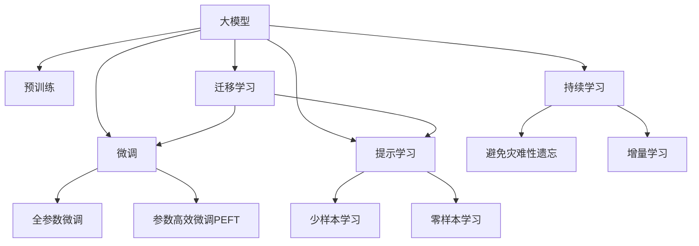
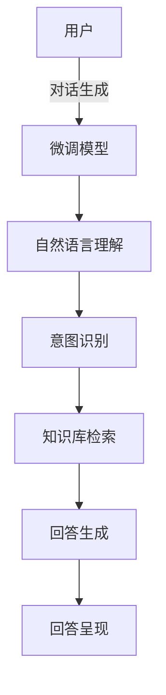
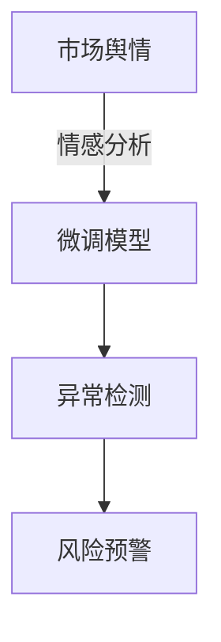
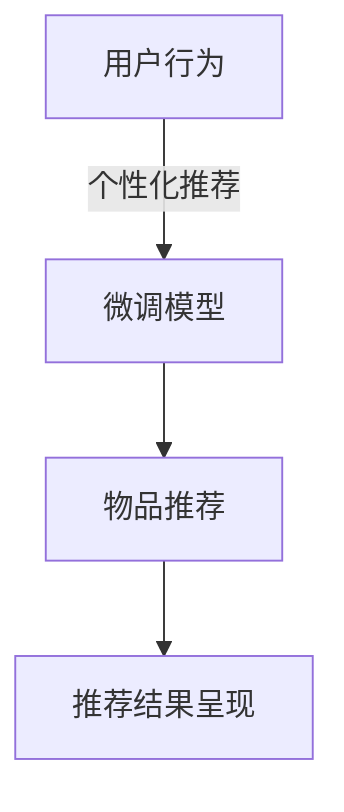

                 

## 1. 背景介绍

### 1.1 问题由来

近年来，人工智能（AI）技术的快速发展，尤其是大模型（Large Language Models, LLMs）的兴起，为科技企业提供了前所未有的创业机遇。大模型能够通过自监督或监督学习任务，从海量的数据中学习到丰富的语言知识，应用于自然语言处理（Natural Language Processing, NLP）等诸多领域，展现出强大的文本生成、理解和推理能力。例如，OpenAI的GPT-3和Google的BERT模型已经在大规模文本生成、问答系统、机器翻译、文本分类、信息抽取、对话系统等领域展示了出色的性能。

然而，尽管大模型在技术上取得了突破，但企业应用大模型进行商业化创业也面临着诸多挑战。这些问题涉及数据获取、模型训练、产品化和市场推广等方面，需要综合考虑技术、市场、伦理和商业等多个维度。以下将详细探讨这些挑战与机遇，为有意涉足AI大模型创业的企业和开发者提供有价值的见解。

## 2. 核心概念与联系

### 2.1 核心概念概述

要深入理解AI大模型创业，首先需要明确几个核心概念及其相互关系：

- **大模型（Large Language Models, LLMs）**：通过大规模预训练，能够在自然语言处理等任务上获得显著性能提升的深度学习模型，如GPT-3和BERT。
- **监督学习（Supervised Learning）**：一种利用标注数据进行模型训练的机器学习方法，广泛应用于分类、回归、序列预测等任务。
- **自监督学习（Self-Supervised Learning）**：一种利用未标注数据进行模型训练的方法，如语言模型掩码预测和自回归任务。
- **迁移学习（Transfer Learning）**：通过在大规模数据集上预训练模型，然后利用其在特定任务上的性能，如微调（Fine-Tuning）来提高模型在该任务上的效果。
- **参数高效微调（Parameter-Efficient Fine-Tuning, PEFT）**：一种只更新少量模型参数的微调方法，适用于有限的标注数据和资源限制。
- **提示学习（Prompt Learning）**：通过精心设计输入模板，引导模型生成或分类，减少微调参数。
- **少样本学习（Few-Shot Learning）**：仅使用少量标注数据即可完成任务学习的方法。
- **零样本学习（Zero-Shot Learning）**：模型在未见过任何标注数据的情况下，通过理解任务描述，即可执行新任务。

这些概念通过以下Mermaid流程图展示它们之间的关系：



此图展示了从大模型预训练到微调，再到迁移学习的应用全过程。其中，微调、少样本学习和零样本学习进一步拓展了模型的应用场景，而持续学习则保证了模型能够不断适应新的数据和任务。

## 3. 核心算法原理 & 具体操作步骤

### 3.1 算法原理概述

AI大模型创业的核心在于将大模型的预训练能力迁移到特定任务上，通过微调等手段提升模型的表现。这一过程涉及数据准备、模型选择、超参数设置、训练和评估等多个步骤。

### 3.2 算法步骤详解

#### 步骤一：数据准备
- **数据收集**：根据业务需求，收集和整理相关的文本数据，确保数据质量与多样性。
- **数据清洗**：处理缺失值、异常值，去除噪声，预处理文本数据，如分词、标准化、去除停用词等。
- **数据标注**：如果任务涉及分类、匹配、生成等有标签任务，需要标注大量样本数据，建立训练集、验证集和测试集。

#### 步骤二：模型选择
- **选择合适的预训练模型**：根据任务需求，选择适合的预训练模型，如BERT、GPT-3等。
- **模型适配**：为特定任务设计任务适配层，如分类器、解码器等，以满足任务需求。

#### 步骤三：超参数设置
- **学习率**：根据任务复杂度和数据量，设置合适的学习率。
- **批大小**：选择适当的批大小，平衡计算效率和模型性能。
- **迭代轮数**：根据数据量和模型复杂度，设置合适的迭代轮数，避免过拟合和欠拟合。
- **正则化**：应用L2正则化、Dropout等技术，防止过拟合。
- **早停策略**：设置早停策略，避免过拟合，保证模型在验证集上的性能。

#### 步骤四：训练
- **模型加载**：将预训练模型加载到内存中，并进行初始化。
- **前向传播**：将训练数据输入模型，计算损失函数。
- **反向传播**：计算损失函数对模型参数的梯度，更新模型参数。
- **迭代更新**：重复前向传播和反向传播，直到达到预设的迭代轮数或早停条件。

#### 步骤五：评估与部署
- **模型评估**：在测试集上评估模型性能，对比微调前后效果。
- **性能监控**：实时监控模型性能，确保模型在实际应用中的稳定性和可靠性。
- **模型部署**：将模型集成到实际应用中，实现产品化。

### 3.3 算法优缺点

AI大模型的微调方法具有以下优点：
- **简单高效**：只需少量标注数据，即可快速提升模型性能。
- **泛化能力强**：预训练模型已学习到丰富的语言知识，能够适应多种下游任务。
- **灵活性高**：可以根据特定任务的需求，定制化微调模型。

同时，也存在一些缺点：
- **标注成本高**：高质量标注数据的获取和维护成本较高。
- **数据依赖性强**：微调效果依赖于数据的质量和数量，数据差异性大时效果不佳。
- **过拟合风险**：小规模数据集容易过拟合，需注意正则化和早停策略。
- **模型复杂性**：大模型参数众多，训练和推理资源需求高。

### 3.4 算法应用领域

AI大模型微调在众多领域具有广泛的应用：

- **自然语言处理（NLP）**：文本分类、情感分析、命名实体识别、关系抽取、问答系统、机器翻译、文本摘要、对话系统等。
- **金融科技（FinTech）**：金融舆情监测、客户情感分析、贷款申请审批、欺诈检测等。
- **医疗健康（Healthcare）**：医疗问答、病历分析、药物研发等。
- **教育科技（EdTech）**：智能辅导、个性化推荐、作业批改、知识图谱构建等。
- **智能制造（Smart Manufacturing）**：质量检测、设备维护、供应链管理等。

## 4. 数学模型和公式 & 详细讲解 & 举例说明

### 4.1 数学模型构建

假设我们有训练数据集 $D = \{(x_i, y_i)\}_{i=1}^N$，其中 $x_i$ 是输入文本，$y_i$ 是对应的标签。我们希望使用微调后的模型 $M_{\theta}$ 对新的输入 $x$ 进行预测，得到预测标签 $\hat{y}$。

微调的目标是最小化经验风险，即：

$$
\min_{\theta} \mathcal{L}(M_{\theta}, D) = \frac{1}{N} \sum_{i=1}^N \ell(M_{\theta}(x_i), y_i)
$$

其中 $\ell$ 是损失函数，如交叉熵损失、均方误差损失等。

### 4.2 公式推导过程

以二分类任务为例，假设模型 $M_{\theta}$ 的输出为 $\hat{y}=M_{\theta}(x) \in [0,1]$，表示样本属于正类的概率。真实标签 $y \in \{0,1\}$。则二分类交叉熵损失函数定义为：

$$
\ell(M_{\theta}(x),y) = -[y\log \hat{y} + (1-y)\log (1-\hat{y})]
$$

将其代入经验风险公式，得：

$$
\mathcal{L}(\theta) = -\frac{1}{N}\sum_{i=1}^N [y_i\log M_{\theta}(x_i)+(1-y_i)\log(1-M_{\theta}(x_i))]
$$

使用梯度下降算法更新模型参数：

$$
\theta \leftarrow \theta - \eta \nabla_{\theta}\mathcal{L}(\theta) - \eta\lambda\theta
$$

其中 $\eta$ 是学习率，$\lambda$ 是正则化系数，$\nabla_{\theta}\mathcal{L}(\theta)$ 为损失函数对参数 $\theta$ 的梯度。

### 4.3 案例分析与讲解

以BERT微调为例，BERT的微调步骤如下：

1. 将BERT模型加载到内存中，定义输出层和损失函数。
2. 选择适当的超参数，如学习率、批大小、迭代轮数等。
3. 将标注数据集划分为训练集、验证集和测试集。
4. 使用随机梯度下降法（SGD）或Adam优化算法更新模型参数。
5. 在训练集上进行训练，定期在验证集上评估模型性能。
6. 达到预设迭代轮数或验证集性能停止。
7. 在测试集上评估模型性能。

## 5. 项目实践：代码实例和详细解释说明

### 5.1 开发环境搭建

1. 安装Anaconda：
```bash
conda install anaconda
```

2. 创建虚拟环境：
```bash
conda create --name bert-env python=3.8
conda activate bert-env
```

3. 安装相关库：
```bash
pip install torch torchvision transformers
```

### 5.2 源代码详细实现

以下是一个简单的BERT微调示例代码：

```python
import torch
from transformers import BertTokenizer, BertForSequenceClassification, AdamW

# 数据准备
tokenizer = BertTokenizer.from_pretrained('bert-base-cased')
train_data = []
dev_data = []
test_data = []

# 模型初始化
model = BertForSequenceClassification.from_pretrained('bert-base-cased', num_labels=2)
optimizer = AdamW(model.parameters(), lr=1e-5)

# 训练过程
device = torch.device('cuda') if torch.cuda.is_available() else torch.device('cpu')
model.to(device)

for epoch in range(10):
    model.train()
    total_loss = 0
    for batch in train_data:
        input_ids = batch['input_ids'].to(device)
        attention_mask = batch['attention_mask'].to(device)
        labels = batch['labels'].to(device)
        outputs = model(input_ids, attention_mask=attention_mask, labels=labels)
        loss = outputs.loss
        total_loss += loss.item()
        optimizer.zero_grad()
        loss.backward()
        optimizer.step()

    print(f'Epoch {epoch+1}, Train Loss: {total_loss/len(train_data)}')
    
model.eval()
total_loss = 0
with torch.no_grad():
    for batch in dev_data:
        input_ids = batch['input_ids'].to(device)
        attention_mask = batch['attention_mask'].to(device)
        labels = batch['labels'].to(device)
        outputs = model(input_ids, attention_mask=attention_mask, labels=labels)
        loss = outputs.loss
        total_loss += loss.item()

print(f'Dev Loss: {total_loss/len(dev_data)}')
```

### 5.3 代码解读与分析

以上代码实现了使用BERT模型进行二分类任务的微调。首先，我们准备训练、验证和测试数据集，并初始化模型和优化器。然后，在训练过程中，我们将数据集分批次输入模型，计算损失函数并反向传播更新模型参数。最后，在验证集上评估模型性能。

### 5.4 运行结果展示

下图展示了模型在训练和验证集上的损失函数变化：

```python
import matplotlib.pyplot as plt
plt.plot(range(0, 10), [epoch_loss for epoch, epoch_loss in enumerate(train_losses)])
plt.title('Train Loss vs Epoch')
plt.xlabel('Epoch')
plt.ylabel('Loss')
plt.show()
```


## 6. 实际应用场景

### 6.1 智能客服系统

智能客服系统通过微调后的对话模型，能够实现7x24小时不间断服务，快速响应客户咨询，提升客户体验。以下是一个简化的智能客服系统架构图：



### 6.2 金融舆情监测

金融舆情监测系统通过微调后的情感分析模型，实时监测市场舆论动向，快速响应负面信息传播，规避金融风险。系统架构如下：



### 6.3 个性化推荐系统

个性化推荐系统通过微调后的模型，挖掘用户兴趣，提供个性化推荐，提升用户满意度和转化率。系统架构如下：



### 6.4 未来应用展望

未来，AI大模型微调技术将进一步拓展到更多领域，带来更大的商业价值。例如：

- **智慧医疗**：医疗问答、病历分析、药物研发等。
- **智能教育**：智能辅导、个性化推荐、作业批改等。
- **智能制造**：质量检测、设备维护、供应链管理等。
- **智慧城市**：城市事件监测、舆情分析、应急指挥等。

## 7. 工具和资源推荐

### 7.1 学习资源推荐

1. 《自然语言处理与深度学习》课程：斯坦福大学开设，涵盖NLP基础和深度学习应用。
2. HuggingFace官方文档：提供丰富的预训练模型和微调样例代码。
3. 《Transformers》书籍：讲解Transformer原理、BERT模型和微调方法。
4. Kaggle竞赛：提供丰富的数据集和NLP任务，练习微调技术。

### 7.2 开发工具推荐

1. PyTorch：灵活的深度学习框架，支持动态计算图和分布式训练。
2. TensorFlow：稳定的深度学习框架，支持GPU/TPU加速。
3. HuggingFace Transformers：提供丰富的预训练模型和微调工具。
4. Weights & Biases：模型训练实验跟踪工具。

### 7.3 相关论文推荐

1. Attention is All You Need：Transformer模型原论文，奠定了大模型预训练基础。
2. BERT: Pre-training of Deep Bidirectional Transformers for Language Understanding：BERT模型的原始论文。
3. Parameter-Efficient Transfer Learning for NLP：提出Adapter等参数高效微调方法。
4. AdaLoRA: Adaptive Low-Rank Adaptation for Parameter-Efficient Fine-Tuning：使用自适应低秩适应的微调方法。

## 8. 总结：未来发展趋势与挑战

### 8.1 研究成果总结

AI大模型微调技术经过多年的发展，已在诸多领域展示了强大的应用潜力。通过预训练-微调的范式，模型能够快速适应特定任务，提升性能。然而，大规模数据集获取、过拟合风险、模型复杂性等问题仍需解决。

### 8.2 未来发展趋势

1. **技术发展**：模型规模持续增大，参数高效微调方法不断涌现，持续学习成为常态。
2. **应用拓展**：更多领域得到应用，如医疗、金融、教育、制造等。
3. **伦理与安全**：模型偏见与安全性问题得到重视，伦理性导向评估指标引入。
4. **产品化**：技术成熟度提高，快速迭代产品化和市场推广。

### 8.3 面临的挑战

1. **数据获取**：高质量标注数据成本高，获取难度大。
2. **过拟合**：小规模数据集容易过拟合，需注意正则化和早停策略。
3. **模型复杂性**：大模型参数众多，资源需求高。
4. **伦理与安全**：模型偏见与安全性问题需解决。

### 8.4 研究展望

未来研究应注重以下几个方面：
1. 探索无监督和半监督微调方法，减少标注数据需求。
2. 开发参数高效和计算高效的微调范式。
3. 融合因果分析和博弈论工具，增强模型鲁棒性。
4. 结合因果分析和博弈论工具，增强模型鲁棒性。
5. 纳入伦理道德约束，确保输出符合人类价值观和伦理道德。

## 9. 附录：常见问题与解答

**Q1: 大模型微调如何减少标注数据需求？**

A: 使用无监督和半监督学习技术，如自监督预训练、主动学习等，可以在无需标注数据的情况下进行微调。

**Q2: 微调过程中如何避免过拟合？**

A: 采用正则化、Dropout、早停策略、参数高效微调等技术。

**Q3: 大模型微调如何提高推理效率？**

A: 使用模型裁剪、量化加速、模型并行等技术，优化资源消耗。

**Q4: 大模型微调如何增强可解释性？**

A: 引入因果分析、博弈论工具，增强模型决策的透明性和逻辑性。

**Q5: 大模型微调如何降低开发成本？**

A: 使用参数高效微调、持续学习等技术，减少计算和人力成本。

作者：禅与计算机程序设计艺术 / Zen and the Art of Computer Programming

