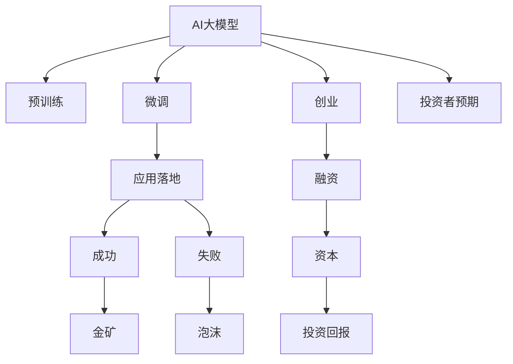

                 

# AI大模型创业：泡沫还是金矿？现状、趋势与未来

> 关键词：AI大模型、创业、泡沫、金矿、现状、趋势、未来

## 1. 背景介绍

### 1.1 问题由来

近年来，人工智能(AI)技术迅猛发展，大模型（如BERT、GPT、XLNet等）在自然语言处理(NLP)、计算机视觉(CV)、语音识别(SR)等领域取得了显著的突破，成为AI技术的重要支柱。大模型通常以亿级参数规模著称，在预训练过程中可以自动学习到丰富的领域知识，在微调或微调后可以在特定任务上表现优异。这些特性吸引了大量的创业公司关注，试图通过AI大模型开辟新的商业赛道，吸引资本的关注。

然而，市场上也涌现了大量的泡沫，如打着AI大模型旗号的高估值初创公司，往往并未产出实际的落地应用。这使得AI大模型创业领域的成败难辨，投资者和从业者都充满疑虑。面对这一现状，本文将详细探讨AI大模型创业的现状、趋势及未来发展方向，以期提供更全面的视角和更具建设性的建议。

### 1.2 问题核心关键点

本节将从几个关键点出发，深入探讨AI大模型创业领域的现状、趋势与未来：

- 大模型创业的现状与类型
- 创业公司的成功与失败案例
- 投资者对AI大模型的预期与评估
- AI大模型创业的行业趋势与挑战
- AI大模型创业的未来展望

## 2. 核心概念与联系

### 2.1 核心概念概述

在探讨AI大模型创业时，我们需要理解以下几个核心概念及其相互联系：

- **AI大模型**：通过大规模无监督预训练获得广泛领域知识的模型，如BERT、GPT-3等。
- **预训练**：在大规模无标注数据上训练模型，使其能够学习到通用的语言或视觉表征。
- **微调**：在大规模预训练模型基础上，针对特定任务进行有监督的训练，以提高模型在该任务上的性能。
- **创业**：将AI技术转化为商业应用的过程，包括技术研发、市场推广、融资等环节。
- **泡沫**：指过度投机而产生的市场过热现象，即投资回报远超实际价值的情况。
- **金矿**：指具有潜在价值、能够带来长期稳定回报的投资机会。

这些概念之间的联系可以通过以下Mermaid流程图来展示：



这个流程图展示了AI大模型从预训练到应用落地的过程，以及创业成功与失败、泡沫与金矿之间的关联。

## 3. 核心算法原理 & 具体操作步骤

### 3.1 算法原理概述

AI大模型的创业核心在于将预训练和微调技术转化为商业应用。一般流程如下：

1. **预训练**：在无标注数据上大规模训练模型，如在GPT-3上使用大规模无监督数据进行预训练。
2. **微调**：在特定任务上使用少量标注数据进行有监督训练，如在GPT-3上对特定领域的问答系统进行微调。
3. **创业**：将微调后的模型或技术转化为产品，进入市场进行推广和销售。
4. **应用落地**：将产品应用于实际场景，如智能客服、金融咨询等。

### 3.2 算法步骤详解

AI大模型创业的核心算法步骤包括以下几个方面：

**Step 1: 数据准备**
- 收集或购买大规模无标注数据进行预训练。
- 收集特定任务的标注数据进行微调。

**Step 2: 模型选择与微调**
- 选择适合的预训练模型，如BERT、GPT-3等。
- 针对特定任务进行微调，如问答、文本生成等。

**Step 3: 系统开发与部署**
- 将微调后的模型封装为API服务或产品。
- 部署到云平台或本地服务器，提供稳定的服务。

**Step 4: 市场推广与销售**
- 进行市场调研，确定目标客户群体。
- 制定推广策略，通过营销渠道进行产品推广。
- 进行销售，如B2B、SaaS等模式。

**Step 5: 持续优化与迭代**
- 收集用户反馈，进行产品迭代优化。
- 持续收集数据，进行模型持续优化。

### 3.3 算法优缺点

AI大模型创业的优点包括：

- **技术领先**：借助大规模预训练和微调技术，产品具备先进的技术优势。
- **市场潜力大**：AI技术在各行各业的渗透和应用前景广阔，市场需求旺盛。
- **投资回报高**：成功的AI大模型创业公司往往能够获得高额投资回报，如OpenAI、DeepMind等。

但同时也存在以下缺点：

- **技术复杂**：需要高水平的AI技术团队和丰富的行业知识。
- **数据依赖**：需要收集大规模数据进行预训练和微调，成本较高。
- **市场不确定性**：市场竞争激烈，产品难以快速占领市场。
- **法律合规**：需要遵循相关法律法规，避免数据隐私和伦理问题。

### 3.4 算法应用领域

AI大模型创业的应用领域非常广泛，涵盖了以下几个方面：

- **NLP领域**：如智能客服、文本分类、情感分析、机器翻译等。
- **CV领域**：如图像识别、视频分析、人脸识别等。
- **SR领域**：如语音识别、语音合成、自动转录等。
- **金融领域**：如量化交易、风险控制、信用评估等。
- **医疗领域**：如疾病诊断、医学影像分析、个性化推荐等。
- **智能制造**：如预测性维护、质量控制、供应链优化等。

## 4. 数学模型和公式 & 详细讲解 & 举例说明

### 4.1 数学模型构建

本节将使用数学语言对AI大模型创业的数学模型进行详细讲解。

假设有一个预训练好的模型 $M$，在特定任务上使用微调后的模型为 $M_{\text{fine-tuned}}$。设原始数据集为 $D=\{(x_i, y_i)\}_{i=1}^N$，其中 $x_i$ 为输入，$y_i$ 为输出标签。微调的目标函数为：

$$
\min_{\theta} \frac{1}{N}\sum_{i=1}^N \ell(M_{\text{fine-tuned}}(x_i), y_i)
$$

其中 $\ell$ 为损失函数，通常使用交叉熵损失。

### 4.2 公式推导过程

以下是基于预训练和微调的数学公式推导过程：

设原始预训练模型 $M$ 的参数为 $\theta_0$，预训练过程中对 $D_0$ 进行训练。微调过程中，使用标注数据集 $D_1$ 对模型 $M_{\text{fine-tuned}}$ 进行训练，目标是最小化损失函数：

$$
\theta_{\text{fine-tuned}} = \mathop{\arg\min}_{\theta} \frac{1}{N}\sum_{i=1}^N \ell(M_{\theta}(x_i), y_i)
$$

其中 $M_{\theta} = M_{\theta_0} + \delta_{\text{fine-tuned}}$，$\delta_{\text{fine-tuned}}$ 为微调过程中添加的可训练参数。

### 4.3 案例分析与讲解

以问答系统为例，分析AI大模型创业的具体实现：

1. **数据准备**：收集大量问答题对数据，如COCO问答数据集。
2. **模型选择**：选择预训练的BERT模型。
3. **微调**：在标注数据上使用微调技术训练模型，生成回答。
4. **系统开发**：将模型封装为API服务，支持问答交互。
5. **市场推广**：通过SEO、内容营销等方式推广产品。

## 5. 项目实践：代码实例和详细解释说明

### 5.1 开发环境搭建

要实现AI大模型的创业项目，需要搭建合适的开发环境。以下是Python和PyTorch开发环境搭建的步骤：

1. 安装Anaconda：
```bash
wget https://repo.anaconda.com/miniconda/Miniconda3-latest-Linux-x86_64.sh
bash Miniconda3-latest-Linux-x86_64.sh
```

2. 创建虚拟环境：
```bash
conda create -n pytorch_env python=3.7
conda activate pytorch_env
```

3. 安装PyTorch和相关依赖：
```bash
conda install torch torchvision torchaudio cudatoolkit=10.2 -c pytorch
```

4. 安装Transformers库：
```bash
pip install transformers
```

5. 安装其他必要库：
```bash
pip install pandas numpy scikit-learn
```

### 5.2 源代码详细实现

以下是一个基于BERT的问答系统的实现示例：

```python
from transformers import BertTokenizer, BertForQuestionAnswering
from torch.utils.data import Dataset, DataLoader
from tqdm import tqdm

class QADataset(Dataset):
    def __init__(self, texts, answers):
        self.tokenizer = BertTokenizer.from_pretrained('bert-base-uncased')
        self.texts = texts
        self.answers = answers
    
    def __len__(self):
        return len(self.texts)
    
    def __getitem__(self, idx):
        text = self.texts[idx]
        answer = self.answers[idx]
        
        encoding = self.tokenizer(text, return_tensors='pt')
        input_ids = encoding['input_ids']
        attention_mask = encoding['attention_mask']
        return {'input_ids': input_ids, 'attention_mask': attention_mask, 'answer': answer}

# 加载预训练模型和数据集
model = BertForQuestionAnswering.from_pretrained('bert-base-uncased')
dataset = QADataset(texts, answers)
dataloader = DataLoader(dataset, batch_size=8, shuffle=True)

# 定义损失函数和优化器
from transformers import AdamW
loss_fn = nn.CrossEntropyLoss()
optimizer = AdamW(model.parameters(), lr=2e-5)

# 训练模型
device = torch.device('cuda' if torch.cuda.is_available() else 'cpu')
model.to(device)
model.train()

for epoch in range(10):
    for batch in tqdm(dataloader):
        input_ids = batch['input_ids'].to(device)
        attention_mask = batch['attention_mask'].to(device)
        answer = batch['answer'].to(device)
        
        outputs = model(input_ids, attention_mask=attention_mask, labels=answer)
        loss = outputs.loss
        optimizer.zero_grad()
        loss.backward()
        optimizer.step()
```

### 5.3 代码解读与分析

上述代码实现了基于BERT的问答系统，其主要步骤如下：

1. **数据预处理**：定义数据集类，将文本和答案转化为模型可接受的格式。
2. **模型加载**：使用预训练的BERT模型进行微调。
3. **损失函数和优化器**：选择交叉熵损失函数和AdamW优化器。
4. **模型训练**：在GPU上对模型进行训练，迭代优化损失函数。

## 6. 实际应用场景

### 6.1 智能客服系统

AI大模型在智能客服系统中的应用非常广泛，可以显著提升客户服务效率和体验。

具体实现如下：

1. **数据收集**：收集历史客户咨询记录，标注常见问题和答案。
2. **模型训练**：使用预训练的BERT模型进行微调，生成回答。
3. **系统集成**：将模型集成到客服系统中，实时响应客户咨询。

### 6.2 金融投资平台

AI大模型在金融投资领域的应用也非常重要，可以用于量化交易、风险评估等。

具体实现如下：

1. **数据收集**：收集历史交易数据和市场数据。
2. **模型训练**：使用预训练的BERT模型进行微调，生成交易策略和风险评估。
3. **系统集成**：将模型集成到交易平台上，实时分析市场趋势和交易信号。

### 6.3 智能医疗系统

AI大模型在智能医疗系统的应用同样具有巨大的潜力，可以用于疾病诊断、医学影像分析等。

具体实现如下：

1. **数据收集**：收集大量的医学影像和病例数据。
2. **模型训练**：使用预训练的BERT模型进行微调，生成疾病诊断结果。
3. **系统集成**：将模型集成到医疗系统中，辅助医生进行诊断和治疗。

## 7. 工具和资源推荐

### 7.1 学习资源推荐

1. **《深度学习》课程**：斯坦福大学Andrew Ng教授的《深度学习》课程，是深度学习领域的入门级课程，涵盖了基础理论和经典算法。
2. **《Transformer》论文**：OpenAI团队发布的Transformer论文，介绍了Transformer模型的原理和应用。
3. **《自然语言处理》书籍**：Siddhartha Devabhaktuni的《自然语言处理》书籍，全面介绍了NLP领域的基础知识和前沿技术。

### 7.2 开发工具推荐

1. **Jupyter Notebook**：轻量级的数据科学环境，支持Python代码的交互式执行和数据可视化。
2. **GitHub**：代码托管平台，提供版本控制和协作功能，适合团队开发。
3. **AWS SageMaker**：亚马逊提供的云平台服务，支持AI模型的训练和部署。

### 7.3 相关论文推荐

1. **《Attention is All You Need》**：Transformer模型的原始论文，介绍了注意力机制和自回归模型的基本原理。
2. **《BERT: Pre-training of Deep Bidirectional Transformers for Language Understanding》**：BERT模型的原始论文，介绍了预训练和微调技术。
3. **《TensorFlow》**：Google开源的深度学习框架，支持大规模模型训练和部署。

## 8. 总结：未来发展趋势与挑战

### 8.1 研究成果总结

AI大模型创业领域经过近年来的快速发展，已经取得了显著的成果。主要体现在以下几个方面：

1. **技术突破**：预训练和微调技术的不断优化，使得AI大模型的性能和应用场景不断拓展。
2. **市场应用**：越来越多的AI大模型产品被应用于实际场景，如智能客服、金融投资、医疗健康等。
3. **融资活跃**：AI大模型创业公司吸引了大量投资者的关注，融资渠道日益多样化。

### 8.2 未来发展趋势

未来的AI大模型创业将呈现以下几个发展趋势：

1. **技术融合**：AI大模型将与物联网、区块链等技术进行深度融合，形成更为智能化的解决方案。
2. **多模态融合**：AI大模型将融合视觉、语音、文本等多模态数据，实现跨领域智能交互。
3. **跨领域应用**：AI大模型将应用于更多行业，如农业、制造、物流等，推动各领域的数字化转型。
4. **伦理规范**：AI大模型创业将注重数据隐私、公平性等伦理问题，制定相应的规范和标准。
5. **可持续发展**：AI大模型创业将更加注重环境可持续性，减少对资源的消耗和环境的影响。

### 8.3 面临的挑战

尽管AI大模型创业领域前景广阔，但也面临诸多挑战：

1. **数据获取**：大规模数据获取难度较大，需要花费大量时间和成本。
2. **技术门槛**：需要高水平的AI技术团队和丰富的行业经验。
3. **市场竞争**：市场竞争激烈，新进入者难以快速获得市场份额。
4. **伦理问题**：AI大模型应用中的数据隐私、公平性等问题需要引起高度关注。
5. **法规风险**：AI大模型应用涉及的法律法规复杂，需要合规运营。

### 8.4 研究展望

未来的AI大模型创业需要在以下几个方面进行深入研究：

1. **数据增强**：通过数据增强技术，提高模型泛化能力，减少对标注数据的依赖。
2. **参数高效**：开发参数高效微调技术，减少计算资源消耗，提高模型训练效率。
3. **知识图谱**：引入知识图谱等外部知识，提高AI大模型的推理能力和应用范围。
4. **模型解释**：开发可解释性强的AI模型，帮助用户理解和信任模型输出。
5. **跨领域应用**：探索AI大模型在不同领域的融合应用，提升智能化水平。

## 9. 附录：常见问题与解答

### 9.1 问题1：AI大模型创业的成功与失败案例有哪些？

**回答**：

1. **成功案例**：OpenAI的GPT系列、DeepMind的AlphaGo等，通过技术突破和市场应用，成功实现了商业化。
2. **失败案例**：一些打着AI大模型旗号的公司，如Splendio等，缺乏实际落地应用，最终失败。

### 9.2 问题2：如何评估AI大模型的创业价值？

**回答**：

1. **技术领先性**：评估模型的技术水平和创新性。
2. **市场潜力**：评估目标市场的规模和增长潜力。
3. **商业模式**：评估产品的商业可行性和盈利模式。
4. **团队能力**：评估团队的技术实力和行业经验。
5. **融资能力**：评估公司的融资能力和资本运作能力。

### 9.3 问题3：AI大模型创业的潜在风险有哪些？

**回答**：

1. **数据隐私**：AI大模型应用中的数据隐私问题需要引起高度重视。
2. **模型鲁棒性**：AI大模型的鲁棒性和泛化能力不足，可能导致误判或错误输出。
3. **市场竞争**：AI大模型领域竞争激烈，新进入者难以快速获得市场份额。
4. **法规合规**：AI大模型应用涉及的法律法规复杂，需要合规运营。

---

作者：禅与计算机程序设计艺术 / Zen and the Art of Computer Programming

