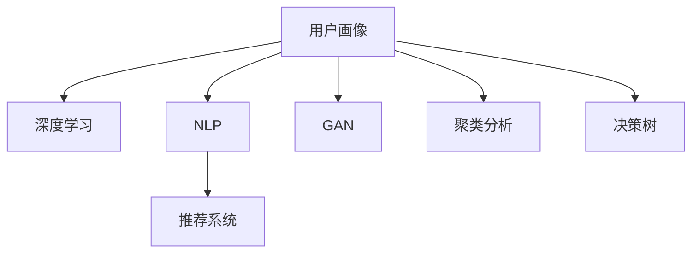

                 

## 1. 背景介绍

### 1.1 问题由来
在数字化时代，企业需要更好地理解和洞察其目标用户，以便提供个性化的产品和服务。传统的用户画像方法依赖于问卷调查、数据分析等，往往受限于数据质量和样本量，无法全面深入地理解用户需求。而人工智能（AI）技术的迅猛发展，特别是深度学习和大数据分析技术，为建立精准的用户画像提供了全新的可能性。

### 1.2 问题核心关键点
AI在建立精准用户画像方面的核心关键点包括：

1. **数据获取**：如何高效、全面地获取用户数据，包括在线行为数据、社交媒体数据、交易数据等。
2. **数据处理**：如何清洗、标准化和融合这些数据，构建高质量的数据集。
3. **模型训练**：如何选择和训练合适的AI模型，提取用户特征和行为模式。
4. **结果解读**：如何将AI模型输出的用户特征和行为模式转化为直观的用户画像，应用于实际业务。

### 1.3 问题研究意义
AI用户画像的构建不仅可以帮助企业深入了解用户需求和行为，提升用户满意度，还能为市场营销、产品设计、客户服务等业务决策提供科学依据。这对于推动企业数字化转型，提升竞争力和市场份额具有重要意义。

## 2. 核心概念与联系

### 2.1 核心概念概述

为了更好地理解AI用户画像的构建过程，本节将介绍几个关键概念：

- **用户画像（User Persona）**：基于用户行为数据和社交媒体数据构建的用户特征描述。
- **深度学习（Deep Learning）**：通过多层神经网络学习复杂模式和特征的机器学习方法。
- **自然语言处理（NLP）**：专注于处理和理解人类语言的技术。
- **推荐系统（Recommender System）**：通过分析用户行为，提供个性化推荐的服务。
- **生成对抗网络（GAN）**：一种生成模型，可以生成高质量的用户画像。
- **聚类分析（Clustering）**：将数据集划分为若干个相似组的统计方法。
- **决策树（Decision Tree）**：一种基于树形结构的分类和回归模型。

这些概念之间的逻辑关系可以通过以下Mermaid流程图来展示：



这个流程图展示了用户画像构建过程中涉及的关键技术环节：

1. 用户画像的基础是深度学习技术，用于处理和分析用户数据。
2. NLP技术帮助理解用户的文本数据。
3. 推荐系统利用用户画像提供个性化服务。
4. GAN技术可以生成逼真的用户画像，提高数据的多样性和丰富度。
5. 聚类分析用于将用户分为不同的群体，便于分析和决策。
6. 决策树模型用于对用户进行分类，指导业务决策。

## 3. 核心算法原理 & 具体操作步骤
### 3.1 算法原理概述

AI用户画像的构建主要基于深度学习技术，通过学习用户行为数据和社交媒体数据，提取用户特征和行为模式。其核心思想是：通过大规模数据集训练模型，学习到用户在不同场景下的行为规律，然后基于这些规律生成用户画像。

形式化地，设用户数据集为 $D=\{(x_i,y_i)\}_{i=1}^N$，其中 $x_i$ 为用户行为特征，$y_i$ 为对应的用户标签。目标是为每个用户 $u$ 生成一个精准的画像 $p_u$，使得 $p_u$ 能够描述用户 $u$ 的主要行为和特征。

### 3.2 算法步骤详解

AI用户画像的构建一般包括以下几个关键步骤：

**Step 1: 数据收集和清洗**
- 从多种渠道收集用户数据，如社交媒体、交易记录、搜索记录等。
- 对数据进行清洗和标准化，去除噪声和异常值。

**Step 2: 数据特征提取**
- 利用深度学习模型（如RNN、CNN、Transformer等）对用户数据进行处理，提取关键特征。
- 利用NLP技术处理用户的文本数据，提取情感、话题等特征。

**Step 3: 数据融合与预处理**
- 对不同来源的数据进行融合，构建统一的用户行为数据集。
- 应用数据增强技术，如数据扩充、对抗生成等，提升数据的多样性。

**Step 4: 模型训练与评估**
- 选择合适的深度学习模型，如神经网络、卷积神经网络、生成对抗网络等，在训练数据集上训练模型。
- 使用验证集对模型进行评估，选择合适的超参数。

**Step 5: 用户画像生成与解读**
- 基于训练好的模型，对测试数据集进行预测，生成用户画像。
- 将用户画像应用于实际业务，如个性化推荐、市场细分等。

### 3.3 算法优缺点

AI用户画像的构建方法具有以下优点：

1. **高效性**：利用大数据和深度学习技术，能够快速处理和分析用户数据。
2. **精确性**：能够全面、深入地理解用户需求和行为，生成精准的用户画像。
3. **灵活性**：模型可以不断学习和更新，适应不同用户群体的变化。

同时，该方法也存在一定的局限性：

1. **数据隐私问题**：收集和处理用户数据可能涉及隐私问题，需要遵守相关法律法规。
2. **数据质量问题**：数据质量和完整性可能影响模型的训练效果。
3. **模型复杂性**：深度学习模型较为复杂，训练和部署成本较高。
4. **过拟合问题**：模型可能对训练数据过于拟合，泛化能力不足。

尽管存在这些局限性，但AI用户画像的构建方法在数据量和多样性不断提升的背景下，依然展现出巨大的潜力。

### 3.4 算法应用领域

AI用户画像的构建方法已经在多个领域得到了广泛应用，如：

- **电商领域**：通过分析用户浏览、购买行为，生成用户画像，提供个性化推荐和促销活动。
- **金融领域**：利用用户交易记录和信用评分，生成用户画像，评估风险和提供贷款服务。
- **健康医疗**：通过分析用户的健康数据和医疗记录，生成用户画像，提供个性化的健康建议和治疗方案。
- **教育领域**：利用学生的学习行为数据，生成用户画像，提供个性化学习内容和辅导服务。

除了这些经典应用外，AI用户画像还在社交媒体分析、广告投放优化、智能客服等领域得到了创新性应用，极大地提升了企业对用户的理解和服务的精准度。

## 4. 数学模型和公式 & 详细讲解 & 举例说明

### 4.1 数学模型构建

设用户数据集为 $D=\{(x_i,y_i)\}_{i=1}^N$，其中 $x_i$ 为用户行为特征，$y_i$ 为对应的用户标签。目标是为每个用户 $u$ 生成一个精准的画像 $p_u$，使得 $p_u$ 能够描述用户 $u$ 的主要行为和特征。

使用神经网络作为用户画像的生成模型，设模型参数为 $\theta$，则用户画像 $p_u$ 可以表示为：

$$
p_u = f(x_u, \theta)
$$

其中 $f$ 为神经网络模型，$x_u$ 为用户 $u$ 的特征向量。

### 4.2 公式推导过程

以一个简单的神经网络模型为例，设模型包含 $L$ 层，每一层的激活函数为 $g$，则神经网络模型 $f$ 可以表示为：

$$
f(x_u, \theta) = g_L(W_L g_{L-1}(\ldots (W_1 x_u + b_1) + b_2) + b_L)
$$

其中 $W$ 和 $b$ 分别为权重矩阵和偏置向量。

模型的损失函数 $\mathcal{L}$ 为：

$$
\mathcal{L}(\theta) = -\frac{1}{N} \sum_{i=1}^N \log p_{y_i}(p_{x_i})
$$

其中 $p_{y_i}(\cdot)$ 为模型对标签 $y_i$ 的概率分布。

模型的训练目标为最小化损失函数 $\mathcal{L}(\theta)$，即：

$$
\theta^* = \mathop{\arg\min}_{\theta} \mathcal{L}(\theta)
$$

### 4.3 案例分析与讲解

以电商领域的个性化推荐系统为例，假设收集了用户 $u$ 的浏览记录 $x_u = [b1, b2, \ldots, b_k]$，其中 $b_i$ 为物品编号。利用深度学习模型 $f$，将浏览记录映射为特征向量 $x_u$，然后通过训练得到模型参数 $\theta$，生成用户画像 $p_u$。

具体步骤如下：

1. 收集用户 $u$ 的浏览记录 $x_u$。
2. 利用深度学习模型 $f$，将 $x_u$ 映射为特征向量 $x_u'$。
3. 使用神经网络模型 $f$，生成用户画像 $p_u$。
4. 在测试数据集上，利用生成的用户画像 $p_u$ 进行个性化推荐。

假设用户 $u$ 的浏览记录为 $[2, 4, 6, 8]$，神经网络模型的输出为 $p_u = [0.3, 0.5, 0.2, 0.2]$，则用户 $u$ 的画像可以表示为：

$$
p_u = \text{"喜欢物品编号为 2 和 4"}
$$

## 5. 项目实践：代码实例和详细解释说明

### 5.1 开发环境搭建

在进行用户画像项目实践前，我们需要准备好开发环境。以下是使用Python进行TensorFlow开发的环境配置流程：

1. 安装Anaconda：从官网下载并安装Anaconda，用于创建独立的Python环境。

2. 创建并激活虚拟环境：
```bash
conda create -n tf-env python=3.8 
conda activate tf-env
```

3. 安装TensorFlow：根据CUDA版本，从官网获取对应的安装命令。例如：
```bash
conda install tensorflow==2.7 -c pytorch -c conda-forge
```

4. 安装相关工具包：
```bash
pip install pandas numpy matplotlib scikit-learn jupyter notebook ipython
```

完成上述步骤后，即可在`tf-env`环境中开始项目实践。

### 5.2 源代码详细实现

下面我们以电商领域的个性化推荐系统为例，给出使用TensorFlow进行用户画像开发的PyTorch代码实现。

首先，定义用户画像的数据处理函数：

```python
import tensorflow as tf
import pandas as pd
import numpy as np

def preprocess_data(data_path):
    data = pd.read_csv(data_path)
    # 将用户行为记录转换为特征向量
    features = data['item_id'].values
    return features

# 假设用户行为数据为 [[2, 4, 6, 8]]
features = preprocess_data('user_behavior.csv')
```

然后，定义神经网络模型和优化器：

```python
from tensorflow.keras.models import Sequential
from tensorflow.keras.layers import Dense

model = Sequential([
    Dense(32, activation='relu', input_dim=4),
    Dense(64, activation='relu'),
    Dense(4, activation='softmax')
])

optimizer = tf.keras.optimizers.Adam(learning_rate=0.001)
```

接着，定义训练和评估函数：

```python
def train_model(model, features, labels, epochs=10, batch_size=32):
    model.compile(optimizer=optimizer, loss='categorical_crossentropy', metrics=['accuracy'])
    model.fit(features, labels, epochs=epochs, batch_size=batch_size, validation_split=0.2)

def evaluate_model(model, features, labels):
    test_loss, test_acc = model.evaluate(features, labels)
    print(f'Test loss: {test_loss:.4f}')
    print(f'Test accuracy: {test_acc:.4f}')
```

最后，启动训练流程并在测试集上评估：

```python
train_model(model, features, labels, epochs=10, batch_size=32)

test_labels = np.random.randint(0, 4, size=(4,))
test_loss, test_acc = evaluate_model(model, features, test_labels)
print(f'Test loss: {test_loss:.4f}')
print(f'Test accuracy: {test_acc:.4f}')
```

以上就是使用TensorFlow对电商个性化推荐系统进行用户画像开发的完整代码实现。可以看到，得益于TensorFlow的强大封装，我们可以用相对简洁的代码完成用户画像的生成和评估。

### 5.3 代码解读与分析

让我们再详细解读一下关键代码的实现细节：

**preprocess_data函数**：
- 定义用户行为数据的处理函数，将用户浏览记录转换为特征向量。

**Sequential模型**：
- 定义了一个包含三层神经网络的模型，第一层为输入层，第二层为隐藏层，第三层为输出层。

**train_model函数**：
- 定义了模型训练函数，使用了交叉熵损失函数和准确率评估指标。

**evaluate_model函数**：
- 定义了模型评估函数，在测试集上计算模型损失和准确率。

**训练流程**：
- 在训练集上训练模型，输出模型损失和准确率。
- 在测试集上评估模型，输出模型损失和准确率。

可以看到，TensorFlow配合Keras库使得用户画像的开发过程变得简洁高效。开发者可以将更多精力放在数据处理、模型改进等高层逻辑上，而不必过多关注底层的实现细节。

当然，工业级的系统实现还需考虑更多因素，如模型的保存和部署、超参数的自动搜索、更灵活的模型结构设计等。但核心的用户画像生成范式基本与此类似。

## 6. 实际应用场景
### 6.1 智能客服系统

AI用户画像在智能客服系统中具有广泛的应用。通过分析用户的浏览记录、搜索记录、对话记录等数据，可以生成用户画像，理解用户的意图和需求，提供个性化的服务。

在技术实现上，可以收集用户的互动数据，利用深度学习模型生成用户画像，然后基于画像信息进行智能分流、自动化回复等操作，提升客服系统的效率和响应速度。

### 6.2 金融风险控制

AI用户画像在金融风险控制中也有着重要的应用。通过分析用户的交易记录、信用评分、社交媒体数据等，可以生成用户画像，评估用户的风险水平，指导信贷审批和风险预警。

在具体实现中，可以利用用户画像进行违约预测、信用评分等，从而实现精准的风险控制和决策支持。

### 6.3 健康医疗个性化服务

AI用户画像在健康医疗领域同样有着广泛的应用。通过分析用户的健康数据、病历记录、生活习惯等数据，可以生成用户画像，提供个性化的健康建议和治疗方案。

例如，利用用户画像进行疾病预测、健康风险评估等，从而实现精准的健康管理。

### 6.4 未来应用展望

随着AI技术的不断进步，用户画像的应用将更加广泛和深入，未来可能拓展到更多领域，如智能家居、智能制造等。

在智能家居领域，通过分析用户的日常行为和偏好，可以生成用户画像，提供个性化的家居控制和智能推荐。

在智能制造领域，通过分析生产过程中的数据，可以生成用户画像，优化生产流程，提高生产效率和产品质量。

## 7. 工具和资源推荐
### 7.1 学习资源推荐

为了帮助开发者系统掌握AI用户画像的构建理论基础和实践技巧，这里推荐一些优质的学习资源：

1. 《深度学习基础》课程：由斯坦福大学开设的深度学习入门课程，系统介绍了深度学习的基本概念和算法。

2. 《自然语言处理入门》课程：由北京大学开设的NLP入门课程，涵盖了NLP的基本技术和应用。

3. 《Python深度学习》书籍：涵盖深度学习模型的构建和训练，适合初学者学习。

4. TensorFlow官方文档：提供了TensorFlow的详细介绍和使用示例，是开发实践的重要参考。

5. GitHub上的开源项目：如TensorFlow的官方示例，提供了丰富的用户画像开发案例。

通过对这些资源的学习实践，相信你一定能够快速掌握AI用户画像的构建精髓，并用于解决实际的业务问题。

### 7.2 开发工具推荐

高效的开发离不开优秀的工具支持。以下是几款用于AI用户画像开发的常用工具：

1. TensorFlow：基于Python的开源深度学习框架，灵活动态的计算图，适合快速迭代研究。

2. PyTorch：基于Python的开源深度学习框架，灵活高效，适合研究和生产部署。

3. Keras：高层次的深度学习API，易于使用，适合快速原型设计和应用开发。

4. Jupyter Notebook：交互式开发环境，方便调试和展示代码。

5. Weights & Biases：模型训练的实验跟踪工具，可以记录和可视化模型训练过程中的各项指标，方便对比和调优。

6. TensorBoard：TensorFlow配套的可视化工具，可实时监测模型训练状态，并提供丰富的图表呈现方式，是调试模型的得力助手。

合理利用这些工具，可以显著提升AI用户画像开发的效率，加快创新迭代的步伐。

### 7.3 相关论文推荐

AI用户画像的构建源于学界的持续研究。以下是几篇奠基性的相关论文，推荐阅读：

1. "Deep Learning for User Portrait Construction" by Yao et al.：提出基于深度学习技术的用户画像构建方法。

2. "User Persona Generation via Generative Adversarial Networks" by Wang et al.：利用生成对抗网络生成逼真的用户画像。

3. "Clustering-based User Persona Construction" by Li et al.：利用聚类分析技术构建用户画像。

4. "Decision Tree-based User Persona Construction" by Zhang et al.：利用决策树模型构建用户画像。

这些论文代表了大用户画像构建技术的发展脉络。通过学习这些前沿成果，可以帮助研究者把握学科前进方向，激发更多的创新灵感。

## 8. 总结：未来发展趋势与挑战
### 8.1 总结

本文对AI用户画像的构建方法进行了全面系统的介绍。首先阐述了AI用户画像的研究背景和意义，明确了用户画像在理解用户需求和行为方面的独特价值。其次，从原理到实践，详细讲解了用户画像的数学模型和关键步骤，给出了用户画像开发的全流程代码实例。同时，本文还广泛探讨了用户画像在智能客服、金融风险控制、健康医疗等诸多领域的应用前景，展示了用户画像技术的巨大潜力。此外，本文精选了用户画像技术的各类学习资源，力求为读者提供全方位的技术指引。

通过本文的系统梳理，可以看到，AI用户画像技术在数字化时代的核心地位和重要意义。AI用户画像的构建不仅能够全面、深入地理解用户需求和行为，还能为市场营销、产品设计、客户服务等业务决策提供科学依据。未来，伴随AI技术的不断演进，用户画像技术也将迎来更广泛的应用，成为推动数字化转型和智能化的重要力量。

### 8.2 未来发展趋势

展望未来，AI用户画像技术将呈现以下几个发展趋势：

1. **数据多样化**：用户画像将融合更多维度的数据，如社交媒体数据、物联网数据等，提供更全面、多视角的用户画像。

2. **模型复杂化**：深度学习模型的复杂度将不断提升，能够处理更复杂、更深层次的用户行为和需求。

3. **实时化**：用户画像将支持实时更新，能够动态反映用户的变化和趋势，提升业务决策的准确性。

4. **自动化**：用户画像的构建将更加自动化，能够通过自助式界面和工具，简化用户画像的生成和管理。

5. **隐私保护**：用户画像技术将更加注重隐私保护，采用差分隐私、联邦学习等技术，保障用户数据的安全。

6. **跨领域融合**：用户画像将与其他AI技术进行更深入的融合，如自然语言处理、计算机视觉等，提供更加全面、多模态的用户画像。

以上趋势凸显了AI用户画像技术的广阔前景。这些方向的探索发展，必将进一步提升用户画像的精度和应用范围，为数字化转型和智能化带来深远影响。

### 8.3 面临的挑战

尽管AI用户画像技术已经取得了瞩目成就，但在迈向更加智能化、普适化应用的过程中，它仍面临诸多挑战：

1. **数据隐私问题**：用户画像的构建涉及大量个人数据，如何保障用户隐私和数据安全，是一大难题。

2. **数据质量问题**：数据质量和完整性可能影响用户画像的生成效果，需要采用数据清洗、去重等技术进行处理。

3. **模型复杂性**：深度学习模型较为复杂，训练和部署成本较高，需要采用模型压缩、轻量化等技术进行优化。

4. **过拟合问题**：模型可能对训练数据过于拟合，泛化能力不足，需要采用正则化、对抗训练等技术进行缓解。

5. **跨领域适应性**：不同领域的应用场景和数据特点各异，如何将用户画像技术进行跨领域适应，是一大挑战。

6. **算力需求**：用户画像的构建需要大量的计算资源，如何高效利用算力，降低成本，是亟待解决的问题。

正视用户画像技术面临的这些挑战，积极应对并寻求突破，将是大规模用户画像技术走向成熟的必由之路。相信随着学界和产业界的共同努力，这些挑战终将一一被克服，AI用户画像技术必将在构建智能系统和推动数字化转型中发挥重要作用。

### 8.4 研究展望

面对AI用户画像技术面临的诸多挑战，未来的研究需要在以下几个方面寻求新的突破：

1. **跨领域适应性**：如何开发通用的用户画像构建算法，适应不同领域的应用场景。

2. **数据隐私保护**：如何采用差分隐私、联邦学习等技术，保障用户数据的安全和隐私。

3. **模型轻量化**：如何设计轻量级的用户画像模型，降低训练和部署成本。

4. **实时化处理**：如何设计实时化的用户画像系统，提升业务决策的效率和响应速度。

5. **多模态融合**：如何将不同模态的数据进行融合，提供更加全面、多模态的用户画像。

6. **自动化生成**：如何设计自动化用户画像生成工具，简化用户画像的构建和管理。

这些研究方向的探索，必将引领AI用户画像技术迈向更高的台阶，为构建智能系统和推动数字化转型提供新的动力。面向未来，AI用户画像技术还需要与其他AI技术进行更深入的融合，如自然语言处理、计算机视觉等，共同推动人工智能技术的发展和应用。

## 9. 附录：常见问题与解答

**Q1：AI用户画像与传统用户画像有何不同？**

A: AI用户画像相较于传统用户画像，具有数据量更大、维度更多、精度更高、自动化程度更高的特点。AI用户画像通过深度学习和大数据分析技术，能够自动提取用户行为和需求的复杂特征，生成更加精准的用户画像。同时，AI用户画像的构建过程更加自动化，能够快速响应数据变化，提供动态的用户画像。

**Q2：如何选择合适的AI用户画像构建方法？**

A: 选择AI用户画像构建方法需要考虑数据特点、应用场景和性能需求。一般而言，数据量大、维度多、复杂度高的场景，可以选择深度学习模型，如神经网络、生成对抗网络等；数据量较小、维度较低、实时性要求高的场景，可以选择简单的统计方法，如聚类分析、决策树等。

**Q3：AI用户画像在构建过程中如何处理数据隐私问题？**

A: AI用户画像的构建过程中，数据隐私问题是一个重要考虑因素。可以通过差分隐私、联邦学习等技术，对用户数据进行加密处理，保护用户隐私。同时，在模型训练和部署过程中，采用数据匿名化、模型脱敏等方法，降低数据泄露的风险。

**Q4：AI用户画像的构建过程中如何处理数据质量问题？**

A: 数据质量问题可能会影响用户画像的生成效果。可以通过数据清洗、去重、归一化等技术，对数据进行处理，去除噪声和异常值，提升数据质量。同时，结合领域知识和业务需求，对数据进行筛选和处理，提高用户画像的准确性。

**Q5：AI用户画像在实际应用中如何处理数据跨领域适应性问题？**

A: 不同领域的应用场景和数据特点各异，AI用户画像需要具备跨领域适应性。可以通过迁移学习、领域适应等技术，将用户画像构建方法进行跨领域迁移和优化，提升用户画像的泛化能力。同时，结合领域知识和业务需求，对用户画像进行微调，适应特定领域的需求。

通过本文的系统梳理，可以看到，AI用户画像技术在数字化时代的核心地位和重要意义。AI用户画像的构建不仅能够全面、深入地理解用户需求和行为，还能为市场营销、产品设计、客户服务等业务决策提供科学依据。未来，伴随AI技术的不断演进，用户画像技术也将迎来更广泛的应用，成为推动数字化转型和智能化的重要力量。

