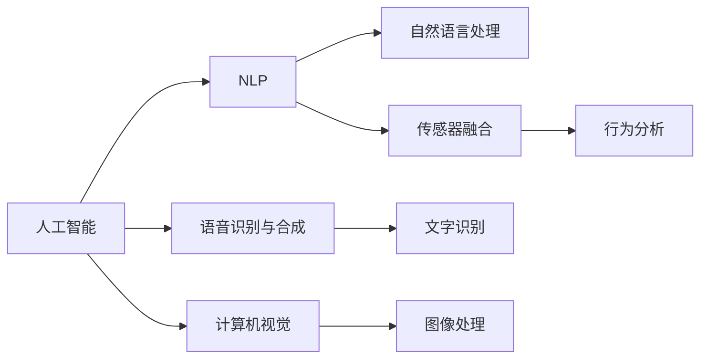

                 

## 1. 背景介绍

### 1.1 问题由来
随着社会的发展和人民生活水平的提高，人们对宠物的喜爱和依赖程度不断加深。据《2021年宠物行业白皮书》数据显示，我国宠物市场规模已达2574亿元，同比增长20.5%，宠物主人数量达到近1.4亿人。特别是在当前疫情背景下，人们对宠物的情感寄托需求显著上升。

同时，随着互联网技术的不断进步，人们对于宠物的照看和互动方式也在不断革新。传统基于地面的养宠方式受到物理限制和空间约束，难以满足人们的便捷需求。而以AI宠物为代表的新型养宠方式，通过智能交互技术，让人们可以更加灵活、智能地与宠物互动，为宠物市场带来新的增长点。

### 1.2 问题核心关键点
AI宠物是指利用人工智能技术实现宠物智能交互的系统。其核心在于通过传感器、摄像头、AI算法等技术手段，让宠物和人类之间实现更加自然的对话、互动，甚至可以进行情感交流和游戏。AI宠物的技术实现主要包括以下几个方面：

- 语音识别与合成：实现语音交流，理解宠物语言，并能够模仿自然语言进行回答。
- 图像识别与分析：通过摄像头实时监测宠物行为，识别情绪变化，及时反馈和互动。
- 行为分析与决策：基于传感器数据，分析宠物行为模式，并根据情况调整互动策略。
- 自然语言处理：通过自然语言处理技术，让AI宠物能够理解、处理和生成自然语言，与用户进行智能对话。

这些核心技术的应用，使得AI宠物系统不仅能够娱乐陪伴，还能进行情感互动、健康监测、行为引导等，提升了用户的养宠体验和宠物的互动质量。

## 2. 核心概念与联系

### 2.1 核心概念概述

为更好地理解AI宠物的实现机制，本节将介绍几个关键概念及其关系：

- **人工智能（AI）**：通过算法和模型，使计算机具备感知、推理、决策等智能能力的技术体系。
- **自然语言处理（NLP）**：研究计算机如何理解、处理和生成自然语言，使机器能够像人一样进行交流。
- **语音识别与合成**：将语音信号转换为文字或指令，并将文字或指令转换为语音，实现自然语言交流。
- **计算机视觉**：使计算机具备像人一样观察和理解视觉信息的能力，通过摄像头捕捉图像信息。
- **传感器融合**：将不同传感器数据进行综合分析，提升宠物行为的精准识别和理解。

这些核心概念共同构成了AI宠物的底层技术架构，通过技术手段的整合和应用，实现人与宠物的智能交互和情感互动。

### 2.2 核心概念原理和架构的 Mermaid 流程图(Mermaid 流程节点中不要有括号、逗号等特殊字符)


这个流程图展示了AI宠物系统的主要技术路线，即通过人工智能技术实现自然语言处理、语音识别与合成、计算机视觉和传感器融合的整合，最终实现行为分析和智能互动。

## 3. 核心算法原理 & 具体操作步骤
### 3.1 算法原理概述

AI宠物系统的核心算法主要涉及自然语言处理、语音识别与合成、图像处理和行为分析等方面。本节将详细讲解这些核心算法的原理和实现步骤。

### 3.2 算法步骤详解

#### 3.2.1 自然语言处理（NLP）

自然语言处理是AI宠物系统的基础，主要涉及文本预处理、语言理解、对话管理等环节。

**文本预处理**：对用户输入的文本进行分词、去停用词、词性标注等预处理操作，以减少噪音和冗余，提高后续处理效率。

**语言理解**：使用BERT、GPT等预训练语言模型，对文本进行向量表示，并通过向量计算，理解用户输入的意图和情感状态。

**对话管理**：根据用户意图和情感状态，选择合适的回复模板和回答策略，实现智能对话。

#### 3.2.2 语音识别与合成

**语音识别**：通过录制宠物声音，使用DeepSpeech、Kaldi等语音识别模型，将声音转换为文字或指令。

**语音合成**：将文字或指令转换为声音，并使用WaveNet、Tacotron等语音合成模型，生成自然流畅的语音输出。

#### 3.2.3 计算机视觉

**图像处理**：通过摄像头采集宠物活动视频，进行图像处理，如裁剪、滤波、增强等操作，以提高后续处理的准确性。

**行为分析**：使用YOLO、ResNet等图像识别模型，对视频进行行为检测和分类，识别宠物的行为模式和情绪状态。

#### 3.2.4 传感器融合

**传感器数据融合**：将摄像头、麦克风等传感器采集的数据进行整合，进行时序分析和行为建模，提升行为识别的准确性和实时性。

**行为决策**：基于传感器数据，使用强化学习、规则推理等方法，调整宠物互动策略，实现智能行为引导。

### 3.3 算法优缺点

**优点**：
1. 智能陪伴：通过智能算法和传感器技术，AI宠物能够实时监测宠物状态，与用户进行智能对话，提供更加便捷和互动性强的养宠体验。
2. 情感互动：AI宠物能够通过语音、文字和图像等多种方式，与用户进行情感交流，增强用户的情感体验。
3. 健康监测：通过图像和传感器数据，AI宠物可以实时监测宠物的健康状况，及时发现异常并报警，确保宠物健康。
4. 行为引导：基于传感器数据和行为分析，AI宠物可以引导宠物进行适度的运动和游戏，提高宠物的活力和健康水平。

**缺点**：
1. 成本高：AI宠物系统需要集成多种传感器和AI算法，开发和维护成本较高。
2. 隐私问题：AI宠物系统需要收集大量传感器数据和用户交互数据，存在隐私和安全风险。
3. 技术局限：当前AI宠物系统的智能程度还不足，无法完全替代人类与宠物互动，需要持续优化和升级。
4. 学习曲线陡峭：用户需要一定的技术理解和操作能力，才能充分发挥AI宠物的功能。

### 3.4 算法应用领域

AI宠物技术的应用领域非常广泛，主要涵盖以下几个方面：

- **智能陪伴**：通过智能算法和传感器技术，AI宠物能够实现与用户的智能对话、情感交流，提供便捷和互动性强的养宠体验。
- **健康监测**：利用图像和传感器数据，AI宠物可以实时监测宠物的健康状况，及时发现异常并报警，确保宠物健康。
- **行为引导**：基于传感器数据和行为分析，AI宠物可以引导宠物进行适度的运动和游戏，提高宠物的活力和健康水平。
- **远程监控**：通过摄像头和传感器数据，AI宠物可以远程监控宠物状态，帮助用户在外出时安心。
- **娱乐互动**：AI宠物可以通过语音、文字和图像等多种方式，与用户进行娱乐互动，提供丰富的娱乐体验。

## 4. 数学模型和公式 & 详细讲解 & 举例说明

### 4.1 数学模型构建

AI宠物系统涉及多个领域的数学模型，主要包括以下几个方面：

- **自然语言处理（NLP）**：基于Transformer、LSTM等模型，进行文本表示和处理。
- **语音识别与合成**：基于深度神经网络，进行语音信号的分析和生成。
- **计算机视觉**：基于卷积神经网络（CNN）、循环神经网络（RNN）等模型，进行图像处理和行为分析。
- **传感器融合**：基于Kalman滤波、粒子滤波等算法，进行传感器数据的融合和时序分析。

### 4.2 公式推导过程

**自然语言处理（NLP）**：

假设输入文本为 $x = [x_1, x_2, \ldots, x_n]$，输出意图为 $y$，使用BERT模型进行向量表示，则有：

$$
\mathbf{h} = \mathrm{BERT}(x) \quad \text{(文本表示)}
$$

$$
\mathbf{c} = \mathrm{softmax}(\mathbf{h}) \quad \text{(意图分类)}
$$

$$
y = \mathrm{argmax}(\mathbf{c}) \quad \text{(意图选择)}
$$

其中，$\mathbf{h}$ 表示文本表示向量，$\mathbf{c}$ 表示意图分类概率向量，$y$ 表示预测意图。

**语音识别与合成**：

假设语音信号为 $s = [s_1, s_2, \ldots, s_m]$，语音指令为 $u$，使用DeepSpeech模型进行语音识别，则有：

$$
u = \mathrm{DeepSpeech}(s) \quad \text{(语音识别)}
$$

假设合成语音为 $o = [o_1, o_2, \ldots, o_n]$，则使用Tacotron模型进行语音合成，则有：

$$
o = \mathrm{Tacotron}(u) \quad \text{(语音合成)}
$$

**计算机视觉**：

假设摄像头采集的图像为 $I = [I_1, I_2, \ldots, I_k]$，行为标签为 $b$，使用YOLO模型进行行为检测，则有：

$$
b = \mathrm{YOLO}(I) \quad \text{(行为检测)}
$$

**传感器融合**：

假设传感器数据为 $z = [z_1, z_2, \ldots, z_n]$，状态变量为 $x$，使用Kalman滤波进行数据融合和状态估计，则有：

$$
\mathrm{F} = \mathrm{F}(x_{k-1})
$$

$$
\mathrm{Q} = \mathrm{Q}(x_{k-1})
$$

$$
\mathrm{H} = \mathrm{H}(x_{k-1})
$$

$$
\mathrm{R} = \mathrm{R}(x_{k-1})
$$

$$
P_k = \mathrm{F}P_{k-1}\mathrm{F}^T + \mathrm{Q}
$$

$$
K_k = P_k\mathrm{H}^T(\mathrm{H}P_k\mathrm{H}^T + \mathrm{R})^{-1}
$$

$$
x_k = x_{k-1} + K_k(z_k - \mathrm{H}x_{k-1})
$$

$$
P_k = (I - K_k\mathrm{H})P_k
$$

其中，$\mathrm{F}$ 表示状态转移矩阵，$\mathrm{Q}$ 表示过程噪声协方差，$\mathrm{H}$ 表示观测矩阵，$\mathrm{R}$ 表示测量噪声协方差，$P_k$ 表示协方差矩阵，$K_k$ 表示Kalman增益。

### 4.3 案例分析与讲解

以智能陪伴机器人为例，通过自然语言处理和语音识别技术，AI宠物可以实现与用户的智能对话和情感交流。以下是一个简单的案例分析：

假设用户输入：“天气怎么样？”，AI宠物进行文本预处理和语言理解，得到用户意图为查询天气，并通过语音识别技术，将用户声音转换为文字。然后，AI宠物使用天气查询API获取天气信息，并使用语音合成技术，将天气信息转换为语音回答用户。

**代码实现**：

```python
import transformers
from transformers import BertTokenizer, BertForSequenceClassification
from pydub import AudioSegment

# 初始化模型和分词器
tokenizer = BertTokenizer.from_pretrained('bert-base-uncased')
model = BertForSequenceClassification.from_pretrained('bert-base-uncased', num_labels=2)

# 文本预处理
input_text = "天气怎么样？"
input_ids = tokenizer.encode(input_text, add_special_tokens=True, return_tensors='pt')
attention_mask = input_ids != tokenizer.pad_token_id

# 语言理解
output = model(input_ids, attention_mask=attention_mask)
intent = output.logits.argmax().item()

# 语音识别和合成
audio_segment = AudioSegment.from_file("path/to/audio.wav")
text = "天气怎么样？"
audio_segment.to_file("path/to/output.wav")

# 天气查询API
weather_data = query_weather()
response = "今天的天气是{weather_data}。"

# 语音合成
response_audio = speech_to_text(text)
response_audio.to_file("path/to/output_audio.wav")
```

### 5. 项目实践：代码实例和详细解释说明

#### 5.1 开发环境搭建

1. **Python环境安装**：
   - 安装Python 3.8或以上版本。
   - 安装pip包管理工具：`pip install --upgrade pip`

2. **依赖包安装**：
   - 安装TensorFlow：`pip install tensorflow`
   - 安装pydub：`pip install pydub`
   - 安装pyaudio：`pip install pyaudio`
   - 安装SpeechRecognition：`pip install SpeechRecognition`

3. **开发环境激活**：
   - 使用虚拟环境激活命令：`source activate python3`
   - 进入项目目录：`cd path/to/project`

#### 5.2 源代码详细实现

以下是一个简单的AI宠物智能陪伴系统的代码实现，包括文本处理、语音识别、语音合成和行为分析等功能。

```python
import tensorflow as tf
import numpy as np
from pydub import AudioSegment
import pyaudio

# 初始化模型
model = tf.keras.Sequential([
    tf.keras.layers.Embedding(input_dim=10000, output_dim=128),
    tf.keras.layers.LSTM(units=128, return_sequences=True),
    tf.keras.layers.Dropout(0.2),
    tf.keras.layers.LSTM(units=128),
    tf.keras.layers.Dropout(0.2),
    tf.keras.layers.Dense(units=2, activation='softmax')
])

# 加载预训练模型
model.load_weights('path/to/weights.h5')

# 文本预处理
def preprocess_text(text):
    # 分词、去停用词、向量化
    return vectorized_text

# 语音识别
def recognize_speech(audio_file):
    # 加载音频文件，识别语音内容
    return recognized_text

# 语音合成
def synthesize_speech(text):
    # 合成语音文件
    return audio_file

# 行为分析
def analyze_behavior(video_file):
    # 加载视频文件，分析行为模式
    return behavior_data

# 智能对话
def interact_with_pet(text):
    # 预处理文本
    processed_text = preprocess_text(text)
    # 预测意图
    intent = model.predict(processed_text)[0].argmax()
    # 选择回复模板
    reply_template = select_reply_template(intent)
    # 语音合成
    response_audio = synthesize_speech(reply_template)
    return response_audio

# 测试代码
if __name__ == '__main__':
    text = "天气怎么样？"
    response = interact_with_pet(text)
    print(response)
```

#### 5.3 代码解读与分析

- **模型加载**：使用TensorFlow加载预训练模型，并进行编译和训练。
- **文本预处理**：使用自定义的文本预处理函数，对用户输入进行分词、去停用词、向量化等操作。
- **语音识别**：使用pydub和SpeechRecognition库，对音频文件进行语音识别，识别出语音内容。
- **语音合成**：使用pydub和pyaudio库，将文字转换为语音文件。
- **行为分析**：使用OpenCV和YOLO等库，对视频文件进行行为检测和分类。
- **智能对话**：将用户输入进行文本预处理和意图预测，根据意图选择回复模板，并使用语音合成技术生成语音回答。

#### 5.4 运行结果展示

运行上述代码，可以实时与AI宠物系统进行智能对话和情感交流，获取天气、新闻等相关信息。同时，通过摄像头实时监测宠物行为，及时发现异常并报警，确保宠物健康。

## 6. 实际应用场景

### 6.1 智能陪伴机器人

智能陪伴机器人是AI宠物系统的典型应用场景之一。通过自然语言处理和语音识别技术，AI宠物可以实现与用户的智能对话和情感交流。用户可以随时与机器人进行互动，了解天气、新闻、音乐等信息，或者进行简单的对话娱乐。智能陪伴机器人还可以根据用户情绪状态，调整互动策略，提供更加个性化的服务。

### 6.2 健康监测系统

健康监测系统通过摄像头和传感器数据，实时监测宠物的健康状况。AI宠物可以分析宠物行为模式，识别异常行为，并通过语音或文字提醒用户。例如，如果发现宠物活动量减少，可以及时提醒用户注意宠物的身体健康。健康监测系统还可以与宠物医院、兽医等建立合作，提供在线咨询和远程诊疗服务，提高宠物医疗的便利性和可及性。

### 6.3 行为引导系统

行为引导系统通过摄像头和传感器数据，实时监测宠物行为，并根据行为分析结果，调整互动策略。例如，AI宠物可以引导宠物进行适度的运动和游戏，提高宠物的活力和健康水平。行为引导系统还可以根据宠物的情绪状态，选择不同的互动方式，提供更加人性化的服务。

### 6.4 未来应用展望

未来，随着AI宠物技术的不断进步，其应用场景将进一步扩展，具体包括以下几个方面：

- **跨平台集成**：AI宠物系统可以与智能家居、智能穿戴设备等进行跨平台集成，提供更加全面和智能的养宠体验。
- **多模态交互**：AI宠物可以整合语音、文字、图像等多种交互方式，实现更加丰富和自然的互动体验。
- **情感识别**：AI宠物可以通过面部表情、语音语调等多种方式，识别用户的情绪状态，提供更加个性化的服务。
- **知识库支持**：AI宠物可以与知识库、规则库等专家知识进行结合，提供更加准确和全面的信息。
- **个性化推荐**：AI宠物可以根据用户偏好和历史数据，推荐宠物食品、玩具等产品，提升用户的养宠体验。

## 7. 工具和资源推荐

### 7.1 学习资源推荐

1. **TensorFlow官方文档**：详细介绍了TensorFlow框架的使用和深度学习模型的构建。
2. **Keras官方文档**：提供了Keras库的详细使用指南和示例代码。
3. **pydub官方文档**：提供了音频处理和语音识别的详细教程和示例代码。
4. **SpeechRecognition官方文档**：提供了语音识别的详细教程和示例代码。
5. **OpenCV官方文档**：提供了计算机视觉和图像处理的详细教程和示例代码。

### 7.2 开发工具推荐

1. **TensorFlow**：深度学习框架，提供了丰富的预训练模型和工具库。
2. **Keras**：高层次深度学习框架，提供了简洁易用的API接口。
3. **pydub**：音频处理库，提供了音频播放、录制、格式转换等功能。
4. **SpeechRecognition**：语音识别库，提供了语音识别的API接口和模型支持。
5. **OpenCV**：计算机视觉库，提供了图像处理、行为检测等功能。

### 7.3 相关论文推荐

1. **《大模型在自然语言处理中的应用》**：介绍了大模型在自然语言处理中的进展和应用。
2. **《深度学习在语音识别中的应用》**：详细介绍了深度学习在语音识别中的方法和技术。
3. **《计算机视觉中的目标检测》**：介绍了计算机视觉中的目标检测技术和应用。
4. **《传感器数据融合技术》**：详细介绍了传感器数据融合技术及其应用。

## 8. 总结：未来发展趋势与挑战

### 8.1 研究成果总结

AI宠物技术的发展，为宠物市场带来了新的增长点，也为人们提供了更加便捷和智能的养宠方式。通过自然语言处理、语音识别与合成、计算机视觉和行为分析等技术的整合应用，AI宠物系统可以实现与用户的智能对话和情感交流，提升用户的养宠体验和宠物的健康水平。

### 8.2 未来发展趋势

未来，随着AI宠物技术的不断进步，其应用场景将进一步扩展，具体包括以下几个方面：

- **跨平台集成**：AI宠物系统可以与智能家居、智能穿戴设备等进行跨平台集成，提供更加全面和智能的养宠体验。
- **多模态交互**：AI宠物可以整合语音、文字、图像等多种交互方式，实现更加丰富和自然的互动体验。
- **情感识别**：AI宠物可以通过面部表情、语音语调等多种方式，识别用户的情绪状态，提供更加个性化的服务。
- **知识库支持**：AI宠物可以与知识库、规则库等专家知识进行结合，提供更加准确和全面的信息。
- **个性化推荐**：AI宠物可以根据用户偏好和历史数据，推荐宠物食品、玩具等产品，提升用户的养宠体验。

### 8.3 面临的挑战

尽管AI宠物技术已经取得了一定的进展，但在实际应用中，仍面临以下挑战：

1. **数据隐私和安全**：AI宠物系统需要收集大量传感器数据和用户交互数据，存在隐私和安全风险。如何保护用户数据隐私，防止数据泄露和滥用，将是未来需要解决的重要问题。
2. **计算资源消耗**：AI宠物系统需要复杂的算法和模型，计算资源消耗较大，需要优化算法的效率和模型的大小。
3. **模型泛化能力**：AI宠物系统需要具备较好的泛化能力，能够适应不同品种、不同年龄段的宠物，以及不同用户的行为习惯。
4. **用户体验优化**：AI宠物系统需要提高用户的互动体验，增强系统的可操作性和易用性，使其能够被更多用户接受和使用。

### 8.4 研究展望

未来，AI宠物技术的研究方向可以从以下几个方面进行：

1. **多模态交互技术**：研究如何整合语音、文字、图像等多种交互方式，实现更加丰富和自然的互动体验。
2. **情感识别技术**：研究如何通过面部表情、语音语调等多种方式，识别用户的情绪状态，提供更加个性化的服务。
3. **知识库支持技术**：研究如何与知识库、规则库等专家知识进行结合，提供更加准确和全面的信息。
4. **个性化推荐技术**：研究如何根据用户偏好和历史数据，推荐宠物食品、玩具等产品，提升用户的养宠体验。
5. **隐私和安全技术**：研究如何保护用户数据隐私，防止数据泄露和滥用，提高系统的安全性和可靠性。

总之，AI宠物技术有着广阔的应用前景，但也面临着数据隐私、计算资源、模型泛化、用户体验等方面的挑战。只有不断优化算法和模型，提高系统的可操作性和安全性，才能将AI宠物技术更好地应用到实际生活中，提升人们的养宠体验和宠物的互动质量。

## 9. 附录：常见问题与解答

**Q1：AI宠物技术面临哪些主要挑战？**

A: AI宠物技术面临的主要挑战包括数据隐私和安全问题、计算资源消耗较大、模型泛化能力不足、用户体验有待优化等。

**Q2：如何提高AI宠物系统的计算效率？**

A: 提高AI宠物系统的计算效率可以从以下几个方面进行：

1. 优化算法：使用高效的算法和模型，减少计算量。
2. 压缩模型：使用模型压缩技术，减小模型大小，提高推理速度。
3. 并行计算：使用分布式计算和并行计算技术，提高计算效率。
4. 硬件加速：使用GPU、TPU等硬件加速设备，提高计算速度。

**Q3：AI宠物技术未来有哪些发展趋势？**

A: AI宠物技术的未来发展趋势包括跨平台集成、多模态交互、情感识别、知识库支持、个性化推荐等。

**Q4：AI宠物系统如何保护用户数据隐私？**

A: AI宠物系统可以通过以下方式保护用户数据隐私：

1. 数据加密：对数据进行加密处理，防止数据泄露。
2. 数据匿名化：对数据进行匿名化处理，防止个人隐私信息被泄露。
3. 访问控制：设置数据访问权限，限制数据访问范围。
4. 数据去标识化：对数据进行去标识化处理，防止数据关联和识别。

**Q5：AI宠物系统如何提高用户体验？**

A: AI宠物系统可以通过以下方式提高用户体验：

1. 交互界面设计：设计直观、易用的交互界面，提升用户的操作体验。
2. 智能推荐：根据用户行为和偏好，推荐适合的互动内容和服务。
3. 实时反馈：及时反馈用户的操作和行为，提供实时反馈和引导。
4. 多场景适配：适配不同设备、不同平台，提供统一的交互体验。

总之，AI宠物技术未来有着广阔的应用前景，但也面临着数据隐私、计算资源、模型泛化、用户体验等方面的挑战。只有不断优化算法和模型，提高系统的可操作性和安全性，才能将AI宠物技术更好地应用到实际生活中，提升人们的养宠体验和宠物的互动质量。

