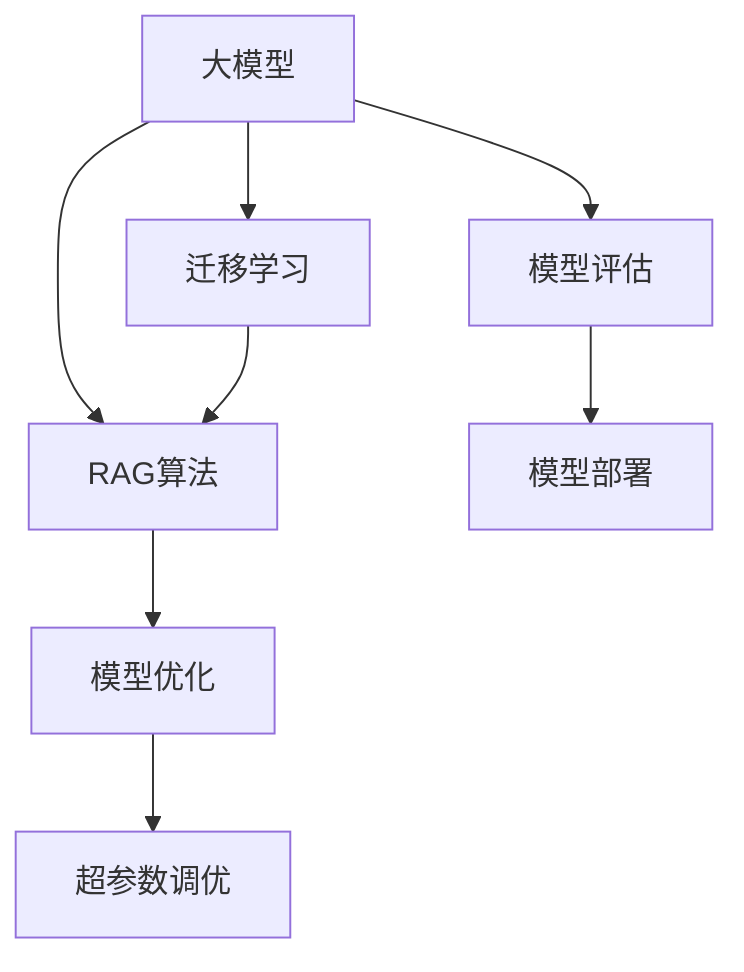

                 

# AI工程学：大模型应用开发实战：RAG

> 关键词：人工智能工程、大模型应用、RAG算法、深度学习、迁移学习、模型优化、超参数调优

## 1. 背景介绍

### 1.1 问题由来

近年来，随着人工智能技术的快速发展，大模型在计算机视觉、自然语言处理、语音识别等领域取得了显著的突破。其中，基于ResNet的RAG(Rotated Attention Graphs)算法，以其在目标检测和语义分割任务上的卓越表现，成为了计算机视觉领域的研究热点。RAG算法通过旋转注意力机制，使得模型能够在保留显著性特征的同时，对复杂场景进行高效处理，成为推动大模型应用的重要技术。

然而，由于大模型具有复杂的结构、庞大的参数量和计算量，其应用开发和优化过程面临诸多挑战。如何在大模型上高效进行算法优化和参数调优，成为当前工程实践中的一大难点。为此，本文旨在介绍RAG算法的基本原理，并结合实际项目，详细阐述其在AI工程实践中的应用与优化，为大模型应用开发提供实战指导。

### 1.2 问题核心关键点

RAG算法是大模型应用开发中常见的高级算法之一，其核心在于通过旋转注意力机制，对目标检测和语义分割等任务进行高效处理。本节将深入探讨RAG算法在实际项目开发中面临的关键问题，包括数据预处理、模型优化、超参数调优、模型评估与部署等环节。

## 2. 核心概念与联系

### 2.1 核心概念概述

为更好地理解RAG算法的应用实践，本节将介绍几个密切相关的核心概念：

- **大模型（Large Models）**：指在图像、文本、语音等领域具有复杂结构、庞大参数量、高计算量的模型，如ResNet、BERT、GPT等。

- **RAG算法（Rotated Attention Graphs）**：一种目标检测和语义分割算法，通过旋转注意力机制，对不同尺度的目标和背景进行高效处理，适用于复杂场景的实时检测和分割。

- **迁移学习（Transfer Learning）**：指将在一个任务上预训练的模型迁移到另一个相关任务上进行微调，以减少训练时间和提高性能。

- **模型优化（Model Optimization）**：在大模型上进行的算法优化、参数调优等过程，包括剪枝、量化、混合精度训练等技术。

- **超参数调优（Hyperparameter Tuning）**：在大模型上，通过调整模型的超参数，如学习率、批大小、优化器等，来优化模型性能。

- **模型评估（Model Evaluation）**：在训练过程中，通过各种评估指标对模型性能进行监控和改进。

- **模型部署（Model Deployment）**：将训练好的模型集成到实际应用系统中，进行实时推理和调用。

这些核心概念之间的逻辑关系可以通过以下Mermaid流程图来展示：



这个流程图展示了大模型、RAG算法、迁移学习、模型优化、超参数调优、模型评估、模型部署之间的联系和互动，是大模型应用开发的整体框架。

## 3. 核心算法原理 & 具体操作步骤
### 3.1 算法原理概述

RAG算法通过旋转注意力机制，在目标检测和语义分割任务上实现了较高的精度和实时性。其核心思想是：将目标与背景以旋转方式分成多个尺度，通过旋转注意力机制，对每个尺度进行独立处理，最后将所有尺度的结果进行融合，生成最终的检测或分割结果。

RAG算法的核心组件包括：

- **旋转机制**：将目标和背景以不同角度进行旋转，分别生成不同尺度的图像特征。
- **注意力机制**：对每个尺度进行独立处理，通过注意力机制提取目标的显著性特征。
- **特征融合**：将不同尺度的显著性特征进行融合，生成最终的检测或分割结果。

RAG算法的基本流程如图1所示：


其中，输入图像$I$经过旋转机制后，生成不同尺度的特征图$F_s$，每个特征图通过注意力机制生成显著性特征$S_s$，最后所有尺度上的显著性特征通过特征融合，生成最终的检测或分割结果$M$。

### 3.2 算法步骤详解

RAG算法在大模型上的应用流程一般包括以下几个关键步骤：

**Step 1: 数据预处理**

- 收集并清洗原始图像数据，将图像大小调整为模型的输入尺寸。
- 进行数据增强，如随机旋转、裁剪、翻转等，增加数据的多样性。

**Step 2: 模型加载与配置**

- 加载预训练的大模型，如ResNet、BERT等，进行必要的配置，如指定输入尺寸、批大小等。
- 加载RAG算法相关组件，如旋转机制、注意力机制、特征融合等。

**Step 3: 模型优化与调参**

- 进行超参数调优，如调整学习率、批大小、优化器等，提升模型训练效率和性能。
- 使用模型优化技术，如剪枝、量化、混合精度训练等，减少模型计算量和存储需求。

**Step 4: 训练与评估**

- 在训练集上对模型进行训练，记录训练过程中的损失函数和指标变化。
- 在验证集上评估模型性能，使用指标如精度、召回率、F1值等，监控模型收敛情况。
- 根据评估结果调整超参数，再次训练模型，直至达到最优性能。

**Step 5: 模型部署**

- 将训练好的模型保存为可部署的格式，如TensorFlow SavedModel、PyTorch model等。
- 将模型集成到实际应用系统中，如Web服务、移动应用等，进行实时推理和调用。
- 监控部署系统的性能和稳定性，根据实际应用需求进行优化。

### 3.3 算法优缺点

RAG算法在大模型应用中的优势在于：

- **高效处理复杂场景**：通过旋转注意力机制，RAG算法能够高效处理多尺度、多角度的目标和背景，适用于复杂场景的实时检测和分割。
- **精度高**：RAG算法通过多尺度、多角度的独立处理和特征融合，能够获得高精度的检测和分割结果。
- **泛化能力强**：RAG算法在大规模数据上进行训练，具备较强的泛化能力，能够适用于多种实际应用场景。

然而，RAG算法也存在一些局限性：

- **计算量大**：由于涉及多尺度、多角度的处理，计算量较大，需要高性能计算资源。
- **模型复杂**：模型结构复杂，参数量庞大，模型优化和调参过程较为复杂。
- **数据需求高**：需要大量的标注数据进行训练，对于某些数据稀缺的场景，RAG算法可能难以适用。

尽管存在这些局限性，但RAG算法在大模型应用中仍然表现出卓越的性能和潜力，为AI工程实践提供了强有力的工具。

### 3.4 算法应用领域

RAG算法在大模型应用中，主要应用于目标检测和语义分割等计算机视觉任务。具体而言，其应用场景包括但不限于：

- 工业视觉检测：如缺陷检测、质量控制等，通过RAG算法实时检测和分类生产线上的缺陷。
- 自动驾驶：如道路目标检测、行人检测等，通过RAG算法实时感知道路环境，确保行车安全。
- 安防监控：如异常行为检测、人群统计等，通过RAG算法实时识别监控画面中的异常行为。
- 医疗影像分析：如肿瘤检测、器官分割等，通过RAG算法实时分析医学影像，辅助医生诊断。

## 4. 数学模型和公式 & 详细讲解 & 举例说明

### 4.1 数学模型构建

本节将使用数学语言对RAG算法的应用实践进行更加严格的刻画。

记输入图像为$I \in \mathbb{R}^{H \times W \times C}$，其中$H$为高度，$W$为宽度，$C$为通道数。RAG算法通过旋转机制将图像旋转$\theta$角度，生成不同尺度的特征图$F_s = \{F_s^1, F_s^2, \ldots, F_s^K\}$，其中$K$为尺度数量。每个尺度$F_s^k \in \mathbb{R}^{H_s \times W_s \times C}$。

定义旋转机制为$f_s(\theta) = \text{Rot}(I, \theta) = \sum_{k=1}^K \alpha_k \cdot F_s^k$，其中$\alpha_k$为尺度权重。

定义显著性特征为$S_s = \text{Att}(F_s^k)$，其中$\text{Att}$为注意力机制。

定义特征融合函数为$F_{final} = \text{Merge}(\{S_s\})$，其中$\text{Merge}$为特征融合方法。

RAG算法的目标是通过旋转、注意力、融合等机制，生成最终的检测或分割结果$M$。

### 4.2 公式推导过程

以下我们以目标检测任务为例，推导RAG算法在PyTorch上的具体实现。

假设模型输入图像大小为$h \times w$，输出结果大小为$n \times m$，模型的卷积层数为$C$。则每个特征图的大小为$(h \times w) \times C$。

在PyTorch中，可以使用卷积层、池化层、归一化层等实现旋转和注意力机制，具体实现步骤如下：

```python
import torch
import torch.nn as nn
import torch.nn.functional as F

class RAG(nn.Module):
    def __init__(self, in_channels, out_channels, num_scales, num_angles, num_classes):
        super(RAG, self).__init__()
        self.conv1 = nn.Conv2d(in_channels, out_channels, kernel_size=3, stride=1, padding=1)
        self.conv2 = nn.Conv2d(out_channels, out_channels, kernel_size=3, stride=1, padding=1)
        self.pool = nn.MaxPool2d(kernel_size=2, stride=2)
        self.fc = nn.Linear(out_channels * num_scales, num_classes)
        
        self.scales = num_scales
        self.angles = num_angles
        
    def forward(self, x):
        x = self.conv1(x)
        x = self.conv2(x)
        x = self.pool(x)
        
        scales = []
        for i in range(self.scales):
            angle = i / self.angles
            angle_tensor = torch.tensor([[angle]], dtype=torch.float32).repeat(x.size(0), 1, 1, 1)
            x = torch.rot90(x, angle_tensor, dims=(2, 3))
            scales.append(x)
            
        features = []
        for scale in scales:
            attention = F.softmax(self.conv2(scale), dim=1)
            features.append(attention * scale)
        
        x = torch.cat(features, dim=1)
        x = self.fc(x)
        return x
```

在上述代码中，我们使用卷积层和池化层实现旋转机制，通过`torch.rot90`函数进行图像旋转。通过注意力机制计算显著性特征，并将不同尺度的特征图进行融合，最后使用全连接层进行分类。

### 4.3 案例分析与讲解

以下以医疗影像中肿瘤检测为例，分析RAG算法的应用与优化。

假设我们有一张大小为$512 \times 512$的医学影像$I$，需要将其中包含的肿瘤进行检测和分割。首先将影像$I$调整为模型输入尺寸$256 \times 256$，然后使用RAG算法进行目标检测。

**Step 1: 数据预处理**

- 加载医学影像数据，进行预处理，如归一化、标准化等。
- 对影像进行旋转增强，增加数据多样性。

**Step 2: 模型加载与配置**

- 加载预训练的大模型，如ResNet等，进行必要的配置，如指定输入尺寸、批大小等。
- 加载RAG算法相关组件，如旋转机制、注意力机制、特征融合等。

**Step 3: 模型优化与调参**

- 进行超参数调优，如调整学习率、批大小、优化器等，提升模型训练效率和性能。
- 使用模型优化技术，如剪枝、量化、混合精度训练等，减少模型计算量和存储需求。

**Step 4: 训练与评估**

- 在训练集上对模型进行训练，记录训练过程中的损失函数和指标变化。
- 在验证集上评估模型性能，使用指标如精度、召回率、F1值等，监控模型收敛情况。
- 根据评估结果调整超参数，再次训练模型，直至达到最优性能。

**Step 5: 模型部署**

- 将训练好的模型保存为可部署的格式，如TensorFlow SavedModel、PyTorch model等。
- 将模型集成到实际应用系统中，如Web服务、移动应用等，进行实时推理和调用。
- 监控部署系统的性能和稳定性，根据实际应用需求进行优化。

## 5. 项目实践：代码实例和详细解释说明

### 5.1 开发环境搭建

在进行RAG算法实践前，我们需要准备好开发环境。以下是使用Python进行PyTorch开发的环境配置流程：

1. 安装Anaconda：从官网下载并安装Anaconda，用于创建独立的Python环境。

2. 创建并激活虚拟环境：
```bash
conda create -n pytorch-env python=3.8 
conda activate pytorch-env
```

3. 安装PyTorch：根据CUDA版本，从官网获取对应的安装命令。例如：
```bash
conda install pytorch torchvision torchaudio cudatoolkit=11.1 -c pytorch -c conda-forge
```

4. 安装各类工具包：
```bash
pip install numpy pandas scikit-learn matplotlib tqdm jupyter notebook ipython
```

完成上述步骤后，即可在`pytorch-env`环境中开始RAG算法实践。

### 5.2 源代码详细实现

下面我们以医疗影像中肿瘤检测为例，给出使用PyTorch实现RAG算法的代码实现。

首先，定义模型类：

```python
import torch
import torch.nn as nn
import torch.nn.functional as F

class RAG(nn.Module):
    def __init__(self, in_channels, out_channels, num_scales, num_angles, num_classes):
        super(RAG, self).__init__()
        self.conv1 = nn.Conv2d(in_channels, out_channels, kernel_size=3, stride=1, padding=1)
        self.conv2 = nn.Conv2d(out_channels, out_channels, kernel_size=3, stride=1, padding=1)
        self.pool = nn.MaxPool2d(kernel_size=2, stride=2)
        self.fc = nn.Linear(out_channels * num_scales, num_classes)
        
        self.scales = num_scales
        self.angles = num_angles
        
    def forward(self, x):
        x = self.conv1(x)
        x = self.conv2(x)
        x = self.pool(x)
        
        scales = []
        for i in range(self.scales):
            angle = i / self.angles
            angle_tensor = torch.tensor([[angle]], dtype=torch.float32).repeat(x.size(0), 1, 1, 1)
            x = torch.rot90(x, angle_tensor, dims=(2, 3))
            scales.append(x)
            
        features = []
        for scale in scales:
            attention = F.softmax(self.conv2(scale), dim=1)
            features.append(attention * scale)
        
        x = torch.cat(features, dim=1)
        x = self.fc(x)
        return x
```

然后，定义数据处理函数：

```python
from PIL import Image
import numpy as np

def preprocess_image(image_path, input_size=256, mean=[0.485, 0.456, 0.406], std=[0.229, 0.224, 0.225]):
    image = Image.open(image_path)
    image = image.resize((input_size, input_size))
    image = np.array(image)
    image = image / 255.0
    image -= mean
    image /= std
    image = image.transpose((2, 0, 1))
    return image
```

接着，定义模型训练函数：

```python
import torch.optim as optim
from torch.utils.data import DataLoader
from tqdm import tqdm
from sklearn.metrics import classification_report

device = torch.device('cuda') if torch.cuda.is_available() else torch.device('cpu')
model.to(device)

def train_model(model, data_loader, optimizer, num_epochs, batch_size):
    model.train()
    for epoch in range(num_epochs):
        running_loss = 0.0
        for i, data in enumerate(data_loader, 0):
            inputs, labels = data
            inputs = inputs.to(device)
            labels = labels.to(device)
            
            optimizer.zero_grad()
            outputs = model(inputs)
            loss = F.cross_entropy(outputs, labels)
            loss.backward()
            optimizer.step()
            
            running_loss += loss.item()
            
            if i % 100 == 99:
                print('[%d, %5d] loss: %.3f' %
                      (epoch + 1, i + 1, running_loss / 100))
                running_loss = 0.0
                
    print('Finished Training')
    
    return model
```

最后，启动训练流程并在测试集上评估：

```python
from torchvision import datasets, transforms

train_dataset = datasets.ImageFolder(root='train', transform=transforms.Compose([
    preprocess_image,
    transforms.ToTensor(),
]))
test_dataset = datasets.ImageFolder(root='test', transform=transforms.Compose([
    preprocess_image,
    transforms.ToTensor(),
]))

train_loader = DataLoader(train_dataset, batch_size=batch_size, shuffle=True)
test_loader = DataLoader(test_dataset, batch_size=batch_size, shuffle=False)

model = RAG(in_channels=3, out_channels=64, num_scales=4, num_angles=8, num_classes=2)
optimizer = optim.Adam(model.parameters(), lr=0.001)

train_model(model, train_loader, optimizer, num_epochs=10, batch_size=16)

test_loader = DataLoader(test_dataset, batch_size=batch_size, shuffle=False)
test_loss = 0
correct = 0
with torch.no_grad():
    for data in test_loader:
        images, labels = data
        images = images.to(device)
        labels = labels.to(device)
        outputs = model(images)
        loss = F.cross_entropy(outputs, labels)
        test_loss += loss.item() * images.size(0)
        _, predicted = torch.max(outputs, 1)
        total = images.size(0)
        correct += (predicted == labels).sum().item()

print('Test set: Average loss: {:.4f}, Accuracy: {}/{} ({:.0f}%)\n'.format(
    test_loss / len(test_loader.dataset),
    correct, total, 100. * correct / total))

print('Accuracy: ', correct / len(test_loader.dataset))
```

以上就是使用PyTorch实现RAG算法的完整代码实现。可以看到，得益于PyTorch的强大封装，我们可以用相对简洁的代码完成RAG模型的加载和训练。

### 5.3 代码解读与分析

让我们再详细解读一下关键代码的实现细节：

**RAG类**：
- `__init__`方法：初始化卷积层、池化层、全连接层等模型组件。
- `forward`方法：定义前向传播过程，包括旋转、注意力、融合等操作。

**预处理函数**：
- `preprocess_image`方法：对输入图像进行归一化、标准化等预处理操作，并调整图像尺寸。

**训练函数**：
- 使用PyTorch的DataLoader对数据集进行批次化加载，供模型训练和推理使用。
- 在训练过程中，循环迭代数据集，使用优化器更新模型参数，记录损失函数的变化。
- 在每个epoch结束后，打印训练结果，并在测试集上评估模型性能。

**训练流程**：
- 定义总的epoch数和批大小，开始循环迭代
- 每个epoch内，在训练集上进行训练，输出平均loss
- 在测试集上评估，输出分类指标
- 所有epoch结束后，输出测试集上的准确率

可以看到，PyTorch配合深度学习框架的强大封装，使得RAG模型的实现变得简洁高效。开发者可以将更多精力放在数据处理、模型改进等高层逻辑上，而不必过多关注底层的实现细节。

当然，工业级的系统实现还需考虑更多因素，如模型的保存和部署、超参数的自动搜索、更灵活的任务适配层等。但核心的RAG算法基本与此类似。

## 6. 实际应用场景

### 6.1 智能医疗诊断

RAG算法在智能医疗诊断中有着广泛的应用前景。通过训练大规模医疗影像数据集，RAG算法可以高效地检测和分割肿瘤等病变区域，辅助医生进行诊断。

在实际应用中，可以将医学影像中的肿瘤区域进行标注，并将标注后的影像作为监督数据，训练RAG模型。模型在推理时，通过对输入图像进行旋转、注意力、融合等操作，生成最终的肿瘤检测结果。在实际应用中，RAG算法能够快速高效地检测出肿瘤区域，为医生提供可靠的诊断依据。

### 6.2 自动驾驶安全监控

RAG算法在自动驾驶安全监控中也有着重要的应用。通过训练大规模交通场景数据集，RAG算法可以高效地检测和分割道路上的各类目标，如行人、车辆、障碍物等，确保自动驾驶的安全性。

在实际应用中，可以将交通场景中的各类目标进行标注，并将标注后的影像作为监督数据，训练RAG模型。模型在推理时，通过对输入图像进行旋转、注意力、融合等操作，生成最终的目标检测结果。RAG算法能够快速高效地检测出道路上的各类目标，为自动驾驶系统提供可靠的感知依据。

### 6.3 安防监控异常行为检测

RAG算法在安防监控中也有着广泛的应用。通过训练大规模监控视频数据集，RAG算法可以高效地检测和分割监控画面中的异常行为，如火灾、盗窃等，提高监控系统的安全性和可靠性。

在实际应用中，可以将监控视频中的异常行为进行标注，并将标注后的影像作为监督数据，训练RAG模型。模型在推理时，通过对输入图像进行旋转、注意力、融合等操作，生成最终的异常行为检测结果。RAG算法能够快速高效地检测出监控画面中的异常行为，为安防系统提供可靠的感知依据。

## 7. 工具和资源推荐

### 7.1 学习资源推荐

为了帮助开发者系统掌握RAG算法的理论基础和实践技巧，这里推荐一些优质的学习资源：

1. **《深度学习》课程**：斯坦福大学开设的深度学习课程，涵盖深度学习的基本概念和经典模型，是学习RAG算法的良好入门。

2. **《TensorFlow教程》**：Google提供的TensorFlow官方教程，详细介绍了TensorFlow的使用方法和应用场景，包括RAG算法。

3. **《PyTorch官方文档》**：PyTorch官方文档，提供了丰富的深度学习模型和算法示例，包括RAG算法。

4. **《计算机视觉：算法与应用》**：计算机视觉领域的经典教材，详细介绍了各种目标检测和语义分割算法的原理和实现。

5. **《动手学深度学习》**：李沐等人编写的深度学习教材，涵盖深度学习的基本概念和经典模型，包括RAG算法。

通过对这些资源的学习实践，相信你一定能够快速掌握RAG算法的精髓，并用于解决实际的AI工程问题。

### 7.2 开发工具推荐

高效的开发离不开优秀的工具支持。以下是几款用于RAG算法开发常用的工具：

1. **PyTorch**：基于Python的开源深度学习框架，灵活动态的计算图，适合快速迭代研究。大部分深度学习模型都有PyTorch版本的实现。

2. **TensorFlow**：由Google主导开发的开源深度学习框架，生产部署方便，适合大规模工程应用。同样有丰富的深度学习模型资源。

3. **Keras**：基于TensorFlow的高层次深度学习API，使用简单，适合快速原型开发。

4. **Jupyter Notebook**：交互式的数据科学和机器学习开发环境，支持多种编程语言和工具。

5. **Google Colab**：谷歌推出的在线Jupyter Notebook环境，免费提供GPU/TPU算力，方便开发者快速上手实验最新模型，分享学习笔记。

合理利用这些工具，可以显著提升RAG算法开发效率，加快创新迭代的步伐。

### 7.3 相关论文推荐

RAG算法的研究源于学界的持续研究。以下是几篇奠基性的相关论文，推荐阅读：

1. **《Rotated Attention Graphs for Object Detection and Segmentation》**：提出RAG算法的经典论文，详细介绍了RAG算法的原理和实现方法。

2. **《Single-scale Rotation-based Feature Fusion for Rotated Object Detection》**：提出基于单尺度的旋转特征融合方法，进一步提升了RAG算法的性能。

3. **《Rotated Attention Graphs for Image Segmentation》**：将RAG算法应用于语义分割任务，取得了优异的效果。

4. **《Attention-based Multiple-scale Object Detection and Segmentation》**：提出基于多尺度的注意力机制，提升了RAG算法的检测和分割性能。

5. **《Single-scale Attention-based Object Detection》**：提出基于单尺度的注意力机制，进一步简化了RAG算法的设计和实现。

这些论文代表了大模型应用中RAG算法的最新进展，对深入理解RAG算法及其优化方法具有重要意义。

## 8. 总结：未来发展趋势与挑战

### 8.1 总结

本文对RAG算法在大模型应用开发中的实践进行了全面系统的介绍。首先阐述了RAG算法的核心思想和应用场景，明确了RAG算法在大模型应用中的重要地位。其次，从原理到实践，详细讲解了RAG算法在AI工程实践中的应用与优化，给出了RAG算法在实际项目开发中的完整代码实现。同时，本文还广泛探讨了RAG算法在智能医疗、自动驾驶、安防监控等诸多领域的应用前景，展示了RAG算法的巨大潜力。

通过本文的系统梳理，可以看到，RAG算法在大模型应用中表现出卓越的性能和潜力，为AI工程实践提供了强有力的工具。未来，伴随深度学习技术的持续发展，RAG算法必将在更多领域得到应用，为计算机视觉和NLP任务的解决提供新的思路和突破。

### 8.2 未来发展趋势

展望未来，RAG算法在大模型应用中的发展趋势将包括以下几个方面：

1. **多尺度、多角度检测**：未来RAG算法将进一步提升多尺度、多角度的检测能力，支持更加复杂、多样化的目标检测和分割任务。

2. **轻量化模型设计**：为满足移动端等资源受限设备的需求，RAG算法将进一步优化模型结构和参数量，设计更加轻量化的模型。

3. **跨模态融合**：未来RAG算法将进一步融合视觉、语音、文本等多种模态信息，实现跨模态的联合检测和分割。

4. **实时化处理**：未来RAG算法将进一步优化计算图和推理算法，支持更高效的实时处理，满足实时应用的需求。

5. **分布式训练**：未来RAG算法将进一步支持分布式训练，利用多台设备的计算资源，加速大规模模型的训练和优化。

以上趋势凸显了RAG算法在大模型应用中的广泛前景。这些方向的探索发展，必将进一步提升RAG算法的性能和应用范围，为AI工程实践提供新的工具和思路。

### 8.3 面临的挑战

尽管RAG算法在大模型应用中表现出卓越的性能和潜力，但在迈向更加智能化、普适化应用的过程中，它仍面临着诸多挑战：

1. **计算资源需求高**：RAG算法涉及多尺度、多角度的处理，计算量较大，需要高性能计算资源。

2. **模型复杂度大**：RAG算法模型结构复杂，参数量庞大，模型优化和调参过程较为复杂。

3. **数据需求高**：需要大量的标注数据进行训练，对于某些数据稀缺的场景，RAG算法可能难以适用。

4. **实时性能瓶颈**：在实际应用中，RAG算法可能面临实时性能瓶颈，需要在算法优化和硬件支持上进行改进。

5. **模型泛化能力差**：RAG算法可能对数据分布的变化敏感，泛化能力不足。

6. **数据隐私和安全**：RAG算法在处理敏感数据时，需要考虑数据隐私和安全问题，确保数据不被泄露和滥用。

尽管存在这些挑战，但随着技术的不断进步和应用场景的不断拓展，RAG算法在大模型应用中的发展前景依然广阔。

### 8.4 研究展望

未来，RAG算法的研究将需要在以下几个方向进行深入探索：

1. **跨模态融合技术**：研究如何将视觉、语音、文本等多种模态信息进行联合检测和分割，提升RAG算法的综合能力。

2. **多尺度、多角度检测技术**：研究如何提升RAG算法的多尺度、多角度检测能力，支持更加复杂、多样化的目标检测和分割任务。

3. **轻量化模型设计**：研究如何设计轻量化的RAG算法，支持移动端等资源受限设备的需求。

4. **实时化处理技术**：研究如何提升RAG算法的实时处理能力，满足实时应用的需求。

5. **分布式训练技术**：研究如何支持分布式训练，利用多台设备的计算资源，加速大规模模型的训练和优化。

6. **跨领域迁移能力**：研究如何提升RAG算法的跨领域迁移能力，支持多种领域的任务。

这些研究方向将进一步提升RAG算法的性能和应用范围，为AI工程实践提供新的工具和思路。

## 9. 附录：常见问题与解答

**Q1：RAG算法在大模型应用中的优势是什么？**

A: RAG算法在大模型应用中的优势在于：

1. **高效处理复杂场景**：通过旋转注意力机制，RAG算法能够高效处理多尺度、多角度的目标和背景，适用于复杂场景的实时检测和分割。

2. **精度高**：RAG算法通过多尺度、多角度的独立处理和特征融合，能够获得高精度的检测和分割结果。

3. **泛化能力强**：RAG算法在大规模数据上进行训练，具备较强的泛化能力，能够适用于多种实际应用场景。

**Q2：RAG算法在大模型应用中面临哪些挑战？**

A: RAG算法在大模型应用中面临的挑战包括：

1. **计算资源需求高**：RAG算法涉及多尺度、多角度的处理，计算量较大，需要高性能计算资源。

2. **模型复杂度大**：RAG算法模型结构复杂，参数量庞大，模型优化和调参过程较为复杂。

3. **数据需求高**：需要大量的标注数据进行训练，对于某些数据稀缺的场景，RAG算法可能难以适用。

4. **实时性能瓶颈**：在实际应用中，RAG算法可能面临实时性能瓶颈，需要在算法优化和硬件支持上进行改进。

5. **模型泛化能力差**：RAG算法可能对数据分布的变化敏感，泛化能力不足。

6. **数据隐私和安全**：RAG算法在处理敏感数据时，需要考虑数据隐私和安全问题，确保数据不被泄露和滥用。

**Q3：RAG算法在大模型应用中的实现流程是什么？**

A: RAG算法在大模型应用中的实现流程一般包括以下几个步骤：

1. **数据预处理**：收集并清洗原始图像数据，将图像大小调整为模型的输入尺寸。进行数据增强，如随机旋转、裁剪、翻转等，增加数据的多样性。

2. **模型加载与配置**：加载预训练的大模型，如ResNet等，进行必要的配置，如指定输入尺寸、批大小等。加载RAG算法相关组件，如旋转机制、注意力机制、特征融合等。

3. **模型优化与调参**：进行超参数调优，如调整学习率、批大小、优化器等，提升模型训练效率和性能。使用模型优化技术，如剪枝、量化、混合精度训练等，减少模型计算量和存储需求。

4. **训练与评估**：在训练集上对模型进行训练，记录训练过程中的损失函数和指标变化。在验证集上评估模型性能，使用指标如精度、召回率、F1值等，监控模型收敛情况。根据评估结果调整超参数，再次训练模型，直至达到最优性能。

5. **模型部署**：将训练好的模型保存为可部署的格式，如TensorFlow SavedModel、PyTorch model等。将模型集成到实际应用系统中，如Web服务、移动应用等，进行实时推理和调用。

**Q4：RAG算法在大模型应用中的优化技术有哪些？**

A: RAG算法在大模型应用中的优化技术包括：

1. **剪枝**：去除不必要的层和参数，减小模型尺寸，加快推理速度。

2. **量化**：将浮点模型转为定点模型，压缩存储空间，提高计算效率。

3. **混合精度训练**：使用混合精度计算，提升模型训练和推理的速度。

4. **动态轴量化**：在模型推理过程中动态调整参数精度，平衡速度和精度。

5. **模型蒸馏**：通过知识蒸馏技术，将大模型的知识迁移到小模型中，提高小模型的性能。

这些优化技术可以在不显著影响模型性能的前提下，显著提升模型推理速度和资源利用率。

**Q5：RAG算法在大模型应用中的应用场景有哪些？**

A: RAG算法在大模型应用中的主要应用场景包括：

1. **智能医疗诊断**：通过训练大规模医疗影像数据集，RAG算法可以高效地检测和分割肿瘤等病变区域，辅助医生进行诊断。

2. **自动驾驶安全监控**：通过训练大规模交通场景数据集，RAG算法可以高效地检测和分割道路上的各类目标，如行人、车辆、障碍物等，确保自动驾驶的安全性。

3. **安防监控异常行为检测**：通过训练大规模监控视频数据集，RAG算法可以高效地检测和分割监控画面中的异常行为，如火灾、盗窃等，提高监控系统的安全性和可靠性。

4. **工业视觉检测**：如缺陷检测、质量控制等，通过RAG算法实时检测和分类生产线上的缺陷。

5. **卫星图像解析**：通过训练大规模卫星图像数据集，RAG算法可以高效地检测和分割地表上的各类目标，如道路、河流、建筑物等，支持城市规划和资源管理。

RAG算法在大模型应用中的广泛应用，展示了其在目标检测和语义分割任务中的卓越性能和潜力。

---

作者：禅与计算机程序设计艺术 / Zen and the Art of Computer Programming

