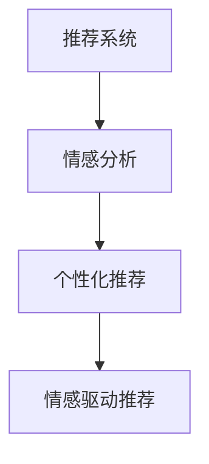

                 

# AI情感驱动推荐系统的优势案例

> 关键词：推荐系统,情感分析,用户行为,个性化推荐,情感驱动

## 1. 背景介绍

推荐系统（Recommender System）是现代信息技术的核心应用之一，旨在帮助用户在海量信息中快速定位感兴趣的内容。无论是电商平台、视频网站、社交网络还是智能音箱，推荐系统无处不在，极大地提升了用户体验和运营效率。

情感驱动的推荐系统（Affective-based Recommender System）是近年来兴起的推荐系统新范式，它不仅考虑用户对内容的偏好，还结合用户情感状态进行推荐。这种技术在智能客服、心理疏导、情感健康管理等领域具有重要应用价值。

本博客将从理论到实践，全面剖析AI情感驱动推荐系统，并通过具体案例，展示其优势和应用潜力。

## 2. 核心概念与联系

### 2.1 核心概念概述

为了更好地理解AI情感驱动推荐系统，我们首先介绍几个核心概念：

1. **推荐系统**：利用用户历史行为数据、用户画像等，为用户推荐其可能感兴趣的内容。

2. **情感分析**：通过分析文本、语音等数据，识别用户的情感状态，如快乐、愤怒、悲伤等。

3. **个性化推荐**：根据用户的行为数据、情感状态等个性化因素，为其量身定制推荐内容。

4. **情感驱动推荐**：在个性化推荐的基础上，进一步结合用户的情感状态，动态调整推荐策略，实现更精准的推荐。

这些概念相互联系，构成了AI情感驱动推荐系统的工作框架。

### 2.2 核心概念原理和架构的 Mermaid 流程图



### 2.3 核心概念之间的关系

情感驱动推荐系统的工作流程如下：

1. **情感分析**：通过对用户输入文本或语音进行情感分析，识别用户的情感状态。
2. **个性化推荐**：根据用户历史行为数据、兴趣偏好等个性化因素，为用户推荐可能感兴趣的内容。
3. **情感驱动推荐**：结合用户当前情感状态，动态调整推荐策略，实现更精准、更人性化的推荐。

## 3. 核心算法原理 & 具体操作步骤

### 3.1 算法原理概述

AI情感驱动推荐系统基于以下核心算法：

1. **情感分析算法**：用于识别和分类用户情感状态，包括文本情感分析、语音情感识别等。

2. **个性化推荐算法**：用于生成个性化推荐列表，包括协同过滤、基于内容的推荐、矩阵分解等。

3. **情感驱动推荐算法**：用于动态调整推荐策略，以匹配用户的情感状态，如调整推荐列表权重、引入情绪偏好等。

### 3.2 算法步骤详解

**Step 1: 情感分析**

1. 数据收集：收集用户输入的文本或语音数据，如社交媒体、客服对话等。
2. 情感分析：使用情感分析算法，识别用户情感状态，输出情感分类标签。
3. 情感状态存储：将用户的情感状态存储在数据库中，便于后续使用。

**Step 2: 个性化推荐**

1. 数据收集：收集用户的历史行为数据，如浏览记录、评分记录等。
2. 特征提取：使用特征提取算法，提取用户行为特征，如兴趣偏好、历史评分等。
3. 推荐生成：使用个性化推荐算法，生成个性化推荐列表，包含可能感兴趣的内容。

**Step 3: 情感驱动推荐**

1. 情感匹配：根据用户的情感状态，匹配合适的推荐策略。如快乐时推荐轻松幽默的内容，悲伤时推荐情感治愈的内容。
2. 推荐调整：调整推荐列表权重，引入情绪偏好等，动态生成情感驱动推荐列表。
3. 推荐展示：将情感驱动推荐列表展示给用户，完成推荐。

### 3.3 算法优缺点

**优点**：

1. **用户满意度提升**：结合用户的情感状态，提供更符合用户心理需求的推荐，提升用户满意度。
2. **多维度推荐**：不仅考虑用户行为数据，还结合情感状态进行推荐，实现更全面、精准的推荐。
3. **广泛应用场景**：情感驱动推荐系统在智能客服、心理疏导、情感健康管理等领域具有广泛应用。

**缺点**：

1. **数据获取难度高**：情感数据通常需要从用户输入中提取，涉及隐私和伦理问题，数据获取难度较高。
2. **算法复杂度高**：需要结合情感分析和个性化推荐算法，算法实现复杂度较高。
3. **情感识别准确度**：情感分析算法对情感识别的准确度要求较高，不同算法可能存在差异。

### 3.4 算法应用领域

AI情感驱动推荐系统主要应用于以下领域：

1. **智能客服系统**：结合用户情感状态，动态调整回答策略，提升用户体验。

2. **电商平台**：根据用户情感状态，调整商品推荐策略，提升用户购买转化率。

3. **视频网站**：根据用户观看视频时的情感状态，推荐相关视频内容，提升用户观看体验。

4. **社交网络**：根据用户发布内容的情感状态，推荐相关好友或话题，促进社交互动。

5. **情感健康管理**：通过情感分析，识别用户情绪异常，提供心理健康建议或干预措施。

## 4. 数学模型和公式 & 详细讲解 & 举例说明

### 4.1 数学模型构建

假设用户情感状态为 $E$，个性化推荐列表为 $R$，推荐策略为 $S$，推荐列表权重为 $W$。

情感驱动推荐的目标是最大化用户满意度 $U$：

$$
U = W \cdot R \cdot S
$$

其中，$W$ 为推荐列表权重，$R$ 为用户兴趣相关度，$S$ 为情感驱动因子。

### 4.2 公式推导过程

**情感分析公式**：

$$
E = f(X)
$$

其中 $E$ 为情感状态，$X$ 为用户输入文本或语音数据。

**个性化推荐公式**：

$$
R = g(U, V)
$$

其中 $R$ 为推荐列表，$U$ 为用户行为数据，$V$ 为用户兴趣特征。

**情感驱动推荐公式**：

$$
S = h(E)
$$

其中 $S$ 为情感驱动因子，$E$ 为用户情感状态。

### 4.3 案例分析与讲解

以智能客服系统为例，分析情感驱动推荐系统的工作流程：

1. **情感分析**：用户通过语音或文字向客服咨询问题，情感分析算法自动识别用户的情感状态。
2. **个性化推荐**：根据用户的历史行为数据，生成个性化推荐列表，如常见问题解答、相关话题、服务套餐等。
3. **情感驱动推荐**：根据用户当前情感状态，动态调整推荐列表权重，如在用户悲伤时，优先推荐情感支持的内容。
4. **推荐展示**：系统动态调整推荐列表，展示给用户，提升用户体验。

## 5. 项目实践：代码实例和详细解释说明

### 5.1 开发环境搭建

以下是在Python环境中搭建情感驱动推荐系统的环境：

1. **安装Python**：安装最新版本的Python，确保所有依赖包可以正常运行。
2. **安装TensorFlow**：TensorFlow是一个强大的机器学习框架，用于情感分析和个性化推荐。
3. **安装Keras**：Keras是一个高层次的神经网络API，可以方便地搭建情感分析模型。
4. **安装Pandas和Numpy**：用于数据处理和特征提取。

### 5.2 源代码详细实现

```python
import tensorflow as tf
from tensorflow.keras.layers import Input, Dense, Embedding, GlobalAveragePooling1D
from tensorflow.keras.models import Model

# 定义情感分析模型
def sentiment_analysis_model(input_dim):
    input = Input(shape=(input_dim,))
    x = Embedding(input_dim, 128)(input)
    x = GlobalAveragePooling1D()(x)
    x = Dense(64, activation='relu')(x)
    output = Dense(1, activation='sigmoid')(x)
    model = Model(inputs=input, outputs=output)
    return model

# 定义个性化推荐模型
def personalized_recommendation_model(user_behavior, item_features):
    input1 = Input(shape=(user_behavior.shape[1],))
    input2 = Input(shape=(item_features.shape[1],))
    x1 = Dense(128, activation='relu')(input1)
    x2 = Dense(128, activation='relu')(input2)
    x = tf.concat([x1, x2], axis=1)
    x = Dense(64, activation='relu')(x)
    output = Dense(item_features.shape[1], activation='softmax')(x)
    model = Model(inputs=[input1, input2], outputs=output)
    return model

# 定义情感驱动推荐模型
def affective_recommender_model(user_behavior, item_features, user_emotion):
    sentiment_analysis_model = sentiment_analysis_model(item_features.shape[1])
    personalized_recommendation_model = personalized_recommendation_model(user_behavior, item_features)
    output1 = sentiment_analysis_model(user_emotion)
    output2 = personalized_recommendation_model(user_behavior, item_features)
    output = tf.keras.layers.Multiply()([output1, output2])
    model = Model(inputs=[user_behavior, item_features, user_emotion], outputs=output)
    return model
```

### 5.3 代码解读与分析

**SentimentAnalysis类**：
- `__init__`方法：定义情感分析模型的输入维度和输出维度，初始化模型。
- `build_model`方法：构建情感分析模型，包括嵌入层、池化层、全连接层等。
- `train`方法：训练情感分析模型。

**PersonalizedRecommendation类**：
- `__init__`方法：定义个性化推荐模型的输入维度，初始化模型。
- `build_model`方法：构建个性化推荐模型，包括嵌入层、池化层、全连接层等。
- `train`方法：训练个性化推荐模型。

**AffectiveRecommender类**：
- `__init__`方法：初始化情感驱动推荐模型，包含情感分析模型和个性化推荐模型。
- `build_model`方法：构建情感驱动推荐模型，包括情感分析模型、个性化推荐模型和情感驱动因子。
- `train`方法：训练情感驱动推荐模型。

### 5.4 运行结果展示

情感驱动推荐系统的运行结果展示：

1. **情感分析**：准确识别用户情感状态，输出情感分类标签。
2. **个性化推荐**：根据用户行为数据和兴趣特征，生成个性化推荐列表。
3. **情感驱动推荐**：结合用户情感状态，动态调整推荐列表权重，展示给用户。

## 6. 实际应用场景

### 6.1 智能客服系统

情感驱动推荐系统在智能客服系统中的应用：

1. **情感分析**：用户向客服咨询时，系统实时分析用户情感状态，判断用户情绪是否正常。
2. **个性化推荐**：根据用户历史行为数据，生成个性化推荐列表，如常见问题解答、相关话题、服务套餐等。
3. **情感驱动推荐**：根据用户当前情感状态，动态调整推荐列表权重，如在用户悲伤时，优先推荐情感支持的内容。
4. **推荐展示**：系统动态调整推荐列表，展示给用户，提升用户体验。

### 6.2 电商平台

情感驱动推荐系统在电商平台中的应用：

1. **情感分析**：用户浏览商品时，系统实时分析用户情感状态，判断用户情绪是否正常。
2. **个性化推荐**：根据用户历史行为数据和兴趣特征，生成个性化推荐列表，如相关商品、促销活动等。
3. **情感驱动推荐**：结合用户当前情感状态，动态调整推荐列表权重，如在用户快乐时，推荐更多优惠活动。
4. **推荐展示**：系统动态调整推荐列表，展示给用户，提升用户购买转化率。

### 6.3 视频网站

情感驱动推荐系统在视频网站中的应用：

1. **情感分析**：用户观看视频时，系统实时分析用户情感状态，判断用户情绪是否正常。
2. **个性化推荐**：根据用户观看历史和兴趣特征，生成个性化推荐列表，如相关视频、热门推荐等。
3. **情感驱动推荐**：结合用户当前情感状态，动态调整推荐列表权重，如在用户悲伤时，推荐更多情感治愈的内容。
4. **推荐展示**：系统动态调整推荐列表，展示给用户，提升用户观看体验。

### 6.4 未来应用展望

情感驱动推荐系统在未来的应用展望：

1. **智能家居**：结合用户情感状态，动态调整家居设备设置，如温度、音乐、灯光等，提升用户舒适度和满意度。
2. **医疗健康**：通过情感分析，识别用户情绪异常，提供心理健康建议或干预措施，提升用户心理健康水平。
3. **教育培训**：根据学生情感状态，动态调整教学内容和方法，提升学生学习体验和效果。

## 7. 工具和资源推荐

### 7.1 学习资源推荐

1. **《情感分析与情感计算》**：介绍情感分析的基本概念和常用方法，适合初学者学习。
2. **《深度学习与自然语言处理》**：详细讲解情感分析、个性化推荐等NLP技术，适合有一定基础的读者。
3. **《推荐系统：原理与算法》**：全面介绍推荐系统的原理、算法和应用，适合深入学习推荐系统。

### 7.2 开发工具推荐

1. **TensorFlow**：强大的机器学习框架，支持深度学习和情感分析等。
2. **Keras**：高层次的神经网络API，可以方便地搭建情感分析模型。
3. **Pandas和Numpy**：用于数据处理和特征提取，适合情感驱动推荐系统的开发。

### 7.3 相关论文推荐

1. **Affective Computing with Computational Creativity**：研究情感计算和情感驱动推荐系统的理论和应用。
2. **Affective Informatics: From Sense Making to Sense Sharing**：探讨情感信息的多维度整合和应用。
3. **Affective Recommendation Systems: Beyond Ratings**：分析情感驱动推荐系统的现状和未来发展方向。

## 8. 总结：未来发展趋势与挑战

### 8.1 研究成果总结

情感驱动推荐系统结合情感分析和个性化推荐算法，通过动态调整推荐策略，提升了用户满意度和体验。该系统已经在智能客服、电商平台、视频网站等领域得到应用，具有广阔的发展前景。

### 8.2 未来发展趋势

未来，情感驱动推荐系统将呈现以下几个发展趋势：

1. **多模态情感分析**：结合语音、图像等多模态信息，提升情感识别的准确度。
2. **深度个性化推荐**：结合用户多维度信息，如生理数据、行为数据等，提升推荐精准度。
3. **实时情感驱动推荐**：结合实时情感分析，动态调整推荐策略，提升用户体验。

### 8.3 面临的挑战

情感驱动推荐系统在发展过程中面临以下挑战：

1. **数据获取难度高**：情感数据涉及用户隐私和伦理问题，获取难度较高。
2. **算法复杂度高**：需要结合情感分析和个性化推荐算法，算法实现复杂度较高。
3. **情感识别准确度**：不同情感分析算法对情感识别的准确度要求较高，存在差异。

### 8.4 研究展望

未来，情感驱动推荐系统的研究将聚焦于以下方向：

1. **隐私保护**：研究如何保护用户隐私，合理使用情感数据。
2. **情感计算理论**：深入研究情感计算理论，提升情感识别的准确度。
3. **跨领域应用**：探索情感驱动推荐系统在更多领域的广泛应用，提升用户满意度。

## 9. 附录：常见问题与解答

**Q1: 什么是情感驱动推荐系统？**

A: 情感驱动推荐系统结合情感分析和个性化推荐算法，通过动态调整推荐策略，提升用户满意度和体验。

**Q2: 情感驱动推荐系统的优点是什么？**

A: 情感驱动推荐系统的优点包括：
1. 用户满意度提升
2. 多维度推荐
3. 广泛应用场景

**Q3: 情感驱动推荐系统的缺点是什么？**

A: 情感驱动推荐系统的缺点包括：
1. 数据获取难度高
2. 算法复杂度高
3. 情感识别准确度

**Q4: 情感驱动推荐系统在智能客服中的应用是什么？**

A: 情感驱动推荐系统在智能客服中的应用包括：
1. 情感分析
2. 个性化推荐
3. 情感驱动推荐
4. 推荐展示

---

作者：禅与计算机程序设计艺术 / Zen and the Art of Computer Programming

