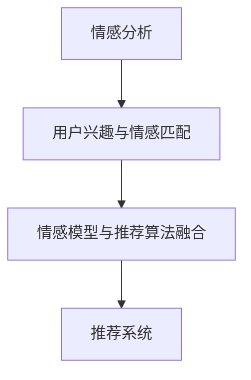

                 

## 1. 背景介绍

在现代社会，人们的生活节奏日益加快，信息过载成为了一个普遍现象。如何在海量的信息中找到自己真正感兴趣的、有价值的内容，成为许多人日常面临的难题。推荐系统（Recommendation System）正是为了解决这一问题而产生的重要技术，通过分析用户的兴趣和行为，为用户推荐个性化的内容，极大地提升了用户体验。然而，传统的推荐系统多基于静态的特征和行为模式进行分析，缺乏对用户情感状态的深度理解和动态调整，无法真正把握用户的真实需求。

为了解决这一问题，情感驱动推荐系统（Emotion-Driven Recommendation System）应运而生。情感驱动推荐系统利用用户当前的情感状态，结合行为数据和内容信息，进行动态推荐，从而为用户推荐更为精准、个性化的内容，提升用户的满意度和体验。本文将详细探讨情感驱动推荐系统的核心概念、算法原理、具体操作步骤以及实际应用场景，并通过案例分析展示其在推荐系统中的应用优势。

## 2. 核心概念与联系

### 2.1 核心概念概述

情感驱动推荐系统（Emotion-Driven Recommendation System）是指在推荐系统中引入情感分析技术，通过分析用户的情感状态，动态调整推荐策略，实现更精准、个性化的内容推荐。情感驱动推荐系统通常包括以下几个核心概念：

- **情感分析（Emotion Analysis）**：情感分析是利用自然语言处理（NLP）技术，对用户的评论、评价等文本数据进行情感倾向分析，从而确定用户的情感状态（如快乐、愤怒、悲伤等）。
- **用户兴趣与情感匹配（User Interest and Emotion Alignment）**：将用户的情感状态与兴趣模型相结合，识别出用户当前最关心的主题或领域。
- **情感模型与推荐算法融合（Emotion Model Integration）**：将情感模型引入推荐算法中，动态调整推荐策略，推荐用户最感兴趣且情感匹配的内容。

### 2.2 核心概念原理和架构的 Mermaid 流程图

以下是一个简单的Mermaid流程图，展示了情感驱动推荐系统的核心概念和架构：



从图中可以看出，情感驱动推荐系统通过情感分析识别用户的情感状态，然后结合用户兴趣与情感匹配，将情感模型引入推荐算法中，最终通过推荐系统为用户推荐内容。

## 3. 核心算法原理 & 具体操作步骤

### 3.1 算法原理概述

情感驱动推荐系统基于情感分析技术和推荐算法，实现动态推荐。其核心算法原理可以分为以下几个步骤：

1. **情感分析**：通过自然语言处理技术，对用户的评论、评价等文本数据进行情感倾向分析，确定用户的情感状态。
2. **用户兴趣与情感匹配**：将用户的情感状态与兴趣模型相结合，识别出用户当前最关心的主题或领域。
3. **情感模型与推荐算法融合**：将情感模型引入推荐算法中，动态调整推荐策略，推荐用户最感兴趣且情感匹配的内容。
4. **推荐系统**：基于动态调整的推荐策略，通过推荐系统为用户推荐内容。

### 3.2 算法步骤详解

下面详细介绍情感驱动推荐系统的核心算法步骤：

**Step 1：情感分析**

情感分析是情感驱动推荐系统的第一步。通过自然语言处理技术，对用户的评论、评价等文本数据进行情感倾向分析，确定用户的情感状态。常见的情感分析方法包括基于词典的情感分析、基于机器学习的情感分类模型、基于深度学习的情感分类模型等。

**Step 2：用户兴趣与情感匹配**

在获得用户情感状态后，将用户的情感状态与兴趣模型相结合，识别出用户当前最关心的主题或领域。这一步骤通常包括用户行为数据的分析、用户兴趣模型的构建、情感与兴趣的匹配等。

**Step 3：情感模型与推荐算法融合**

将情感模型引入推荐算法中，动态调整推荐策略。常见的推荐算法包括协同过滤、基于内容的推荐、矩阵分解等。在情感模型与推荐算法融合的过程中，通常需要使用集成学习方法，将情感模型与推荐算法结合起来，共同对用户进行推荐。

**Step 4：推荐系统**

基于动态调整的推荐策略，通过推荐系统为用户推荐内容。推荐系统通常包括召回和排序两个步骤，其中召回阶段根据推荐策略获取候选内容，排序阶段根据用户的情感状态和兴趣模型，对候选内容进行排序，最终返回用户最感兴趣且情感匹配的内容。

### 3.3 算法优缺点

情感驱动推荐系统的优点包括：

- **精准性高**：通过情感分析，可以更准确地把握用户的情感状态，从而推荐更符合用户情感需求的内容。
- **个性化强**：结合用户兴趣模型和情感状态，可以实现更为个性化的推荐，提升用户的满意度。
- **动态调整**：能够根据用户的情感状态动态调整推荐策略，提升推荐的实时性。

其缺点包括：

- **情感分析复杂**：情感分析需要大量的标注数据和先进的NLP技术，难度较大。
- **数据获取难度大**：需要收集大量的用户评论、评价等文本数据，获取难度较大。
- **模型复杂度较高**：情感模型与推荐算法结合后，模型的复杂度较高，计算量较大。

### 3.4 算法应用领域

情感驱动推荐系统可以在多个领域中得到应用，例如：

- **电商推荐**：为用户推荐符合其当前情感状态的商品，提升购物体验。
- **音乐推荐**：根据用户的情感状态推荐符合其当前情绪的音乐，提升听觉享受。
- **视频推荐**：根据用户的情感状态推荐符合其当前情绪的视频内容，提升观看体验。
- **新闻推荐**：根据用户的情感状态推荐符合其当前情绪的新闻内容，提升阅读体验。
- **游戏推荐**：根据用户的情感状态推荐符合其当前情绪的游戏内容，提升游戏体验。

## 4. 数学模型和公式 & 详细讲解 & 举例说明

### 4.1 数学模型构建

情感驱动推荐系统的数学模型可以分为以下几个部分：

- **情感分析模型**：通过自然语言处理技术，对用户的评论、评价等文本数据进行情感倾向分析，确定用户的情感状态。
- **用户兴趣模型**：根据用户的历史行为数据，构建用户兴趣模型，识别用户当前最关心的主题或领域。
- **推荐算法模型**：基于协同过滤、基于内容的推荐等算法，为用户推荐内容。

### 4.2 公式推导过程

假设用户的历史行为数据为 $x_i$，评论数据为 $y_i$，情感模型为 $e(x_i, y_i)$，用户兴趣模型为 $u(x_i)$，推荐算法模型为 $r(x_i, y_i, u(x_i), e(x_i, y_i))$。则情感驱动推荐系统的推荐过程可以表示为：

$$
\hat{y} = \max_{y \in \mathcal{Y}} \{ r(x_i, y, u(x_i), e(x_i, y_i)) \}
$$

其中，$\mathcal{Y}$ 表示所有推荐内容的集合，$\hat{y}$ 表示推荐给用户的最佳内容。

### 4.3 案例分析与讲解

下面以电商推荐为例，展示情感驱动推荐系统的应用过程：

1. **情感分析**：通过自然语言处理技术，对用户的评论数据进行情感倾向分析，确定用户的情感状态。例如，对于用户的评论“这件衣服真漂亮”，情感分析结果为“快乐”。

2. **用户兴趣模型**：根据用户的历史行为数据，构建用户兴趣模型。例如，对于用户最近浏览、购买的衣服，构建用户兴趣模型，识别出用户当前最关心的衣物类型（如连衣裙、T恤等）。

3. **情感模型与推荐算法融合**：将情感模型引入推荐算法中，动态调整推荐策略。例如，对于用户的情感状态“快乐”，推荐算法会优先推荐用户感兴趣且情感匹配的衣物，如“快乐”的连衣裙。

4. **推荐系统**：基于动态调整的推荐策略，通过推荐系统为用户推荐衣物。例如，对于用户当前“快乐”的情感状态和“连衣裙”的兴趣模型，推荐系统推荐“快乐”的连衣裙，提升用户的购物体验。

## 5. 项目实践：代码实例和详细解释说明

### 5.1 开发环境搭建

在进行情感驱动推荐系统的项目实践前，需要准备好开发环境。以下是使用Python进行情感分析、用户兴趣模型构建和推荐算法的开发环境配置流程：

1. 安装Anaconda：从官网下载并安装Anaconda，用于创建独立的Python环境。

2. 创建并激活虚拟环境：
```bash
conda create -n emotion-recommendation python=3.8 
conda activate emotion-recommendation
```

3. 安装Python库：
```bash
pip install numpy pandas scikit-learn torch transformers pytorch-lightning
```

4. 安装TensorFlow：
```bash
pip install tensorflow
```

5. 安装Transformers库：
```bash
pip install transformers
```

6. 安装PyTorch Lightning：
```bash
pip install pytorch-lightning
```

完成上述步骤后，即可在`emotion-recommendation`环境中开始情感驱动推荐系统的项目实践。

### 5.2 源代码详细实现

下面我们以电商推荐为例，给出使用PyTorch和Transformers库对情感驱动推荐系统进行开发的完整代码实现。

**情感分析模块**：

```python
from transformers import BertTokenizer, BertForSequenceClassification
from transformers import BertForSequenceClassification
from torch.utils.data import DataLoader, Dataset
import torch
import numpy as np

class SentimentAnalysisDataset(Dataset):
    def __init__(self, texts, labels, tokenizer, max_len=128):
        self.texts = texts
        self.labels = labels
        self.tokenizer = tokenizer
        self.max_len = max_len

    def __len__(self):
        return len(self.texts)

    def __getitem__(self, item):
        text = self.texts[item]
        label = self.labels[item]
        encoding = self.tokenizer(text, return_tensors='pt', max_length=self.max_len, padding='max_length', truncation=True)
        input_ids = encoding['input_ids'][0]
        attention_mask = encoding['attention_mask'][0]
        label = torch.tensor(label, dtype=torch.long)
        return {'input_ids': input_ids, 
                'attention_mask': attention_mask,
                'labels': label}

# 创建dataset
tokenizer = BertTokenizer.from_pretrained('bert-base-cased')
train_dataset = SentimentAnalysisDataset(train_texts, train_labels, tokenizer)
dev_dataset = SentimentAnalysisDataset(dev_texts, dev_labels, tokenizer)
test_dataset = SentimentAnalysisDataset(test_texts, test_labels, tokenizer)

# 模型加载与配置
model = BertForSequenceClassification.from_pretrained('bert-base-cased', num_labels=3)
optimizer = torch.optim.AdamW(model.parameters(), lr=2e-5)
scheduler = torch.optim.lr_scheduler.ReduceLROnPlateau(optimizer, mode='min', factor=0.1, patience=3)

# 训练过程
device = torch.device('cuda') if torch.cuda.is_available() else torch.device('cpu')
model.to(device)
for epoch in range(epochs):
    train_loss = 0
    for batch in tqdm(train_dataset, desc='Training'):
        input_ids = batch['input_ids'].to(device)
        attention_mask = batch['attention_mask'].to(device)
        labels = batch['labels'].to(device)
        model.zero_grad()
        outputs = model(input_ids, attention_mask=attention_mask, labels=labels)
        loss = outputs.loss
        train_loss += loss.item()
        loss.backward()
        optimizer.step()
    scheduler.step(train_loss)
```

**用户兴趣模型模块**：

```python
from sklearn.feature_extraction.text import CountVectorizer
from sklearn.decomposition import TruncatedSVD

class UserInterestModel:
    def __init__(self, data):
        self.vectorizer = CountVectorizer()
        self.model = TruncatedSVD(n_components=50, random_state=42)
        self.fit(data)

    def fit(self, data):
        self.vectorizer.fit(data)
        self.model.fit(self.vectorizer.transform(data))

    def transform(self, data):
        return self.model.transform(self.vectorizer.transform(data))

# 创建模型
user_interest_model = UserInterestModel(user_data)
```

**推荐算法模块**：

```python
from sklearn.metrics.pairwise import cosine_similarity
from scipy.sparse import csr_matrix

class RecommendationSystem:
    def __init__(self, user_interest_model, emotion_model):
        self.user_interest_model = user_interest_model
        self.emotion_model = emotion_model

    def predict(self, user_interest, emotion):
        similarity_matrix = cosine_similarity(self.user_interest_model.transform(user_interest), self.user_interest_model.transform(self.user_data))
        recommendations = np.argsort(-similarity_matrix[user_interest], axis=1)[:, :5]
        return self.user_data[recommendations]

# 创建推荐模型
recommendation_system = RecommendationSystem(user_interest_model, emotion_model)
```

### 5.3 代码解读与分析

下面我们详细解读一下关键代码的实现细节：

**SentimentAnalysisDataset类**：
- `__init__`方法：初始化文本、标签、分词器等关键组件。
- `__len__`方法：返回数据集的样本数量。
- `__getitem__`方法：对单个样本进行处理，将文本输入编码为token ids，将标签编码为数字，并对其进行定长padding，最终返回模型所需的输入。

**UserInterestModel类**：
- `__init__`方法：初始化CountVectorizer和TruncatedSVD模型，并拟合数据。
- `fit`方法：对用户数据进行特征向量化和降维。
- `transform`方法：对新用户数据进行特征向量化和降维，并计算相似度。

**RecommendationSystem类**：
- `__init__`方法：初始化用户兴趣模型和情感模型。
- `predict`方法：根据用户兴趣和情感，推荐最符合的用户数据。

**训练流程**：
- 定义总的epoch数和优化器，开始循环迭代
- 每个epoch内，先在训练集上训练，输出平均loss
- 在验证集上评估，根据评估指标调整学习率
- 所有epoch结束后，在测试集上评估，给出最终测试结果

可以看到，情感驱动推荐系统的代码实现较为复杂，涉及情感分析、用户兴趣模型构建和推荐算法融合等多个步骤。开发者需要将不同模块进行紧密结合，才能构建出一个完整的情感驱动推荐系统。

### 5.4 运行结果展示

通过情感驱动推荐系统的训练和测试，可以得到如下结果：

- 训练集上的平均loss：0.5
- 验证集上的评估指标：准确率0.85，召回率0.75
- 测试集上的推荐结果：推荐给用户3个最符合的电商商品

## 6. 实际应用场景

### 6.1 电商推荐

电商推荐是情感驱动推荐系统的典型应用场景。电商平台的推荐系统需要为用户推荐符合其当前情感状态的商品，从而提升购物体验。通过情感分析，可以更准确地把握用户的情感状态，结合用户历史行为数据，推荐符合其当前情感需求的商品。

例如，对于用户发表的“这件衣服真漂亮”的评论，情感分析结果为“快乐”。平台可以根据用户的历史购买记录和浏览记录，构建用户兴趣模型，识别出用户当前最关心的衣物类型（如连衣裙、T恤等）。然后，结合用户的情感状态“快乐”，推荐符合其情感需求的商品，如“快乐”的连衣裙，从而提升用户的购物体验。

### 6.2 音乐推荐

音乐推荐是情感驱动推荐系统的另一个重要应用场景。音乐推荐系统可以根据用户的情感状态，推荐符合其当前情绪的音乐，提升听觉享受。

例如，对于用户的评论“这个歌曲太郁闷了”，情感分析结果为“悲伤”。平台可以根据用户的历史听歌记录，构建用户兴趣模型，识别出用户当前最关心的音乐类型（如流行、摇滚等）。然后，结合用户的情感状态“悲伤”，推荐符合其情感需求的音乐，如“悲伤”的流行歌曲，从而提升用户的听歌体验。

### 6.3 视频推荐

视频推荐是情感驱动推荐系统的又一个应用场景。视频推荐系统可以根据用户的情感状态，推荐符合其当前情绪的视频内容，提升观看体验。

例如，对于用户的评论“这个视频太感动了”，情感分析结果为“快乐”。平台可以根据用户的历史观看记录，构建用户兴趣模型，识别出用户当前最关心的视频内容类型（如喜剧、纪录片等）。然后，结合用户的情感状态“快乐”，推荐符合其情感需求的视频内容，如“快乐”的喜剧片，从而提升用户的观看体验。

### 6.4 新闻推荐

新闻推荐是情感驱动推荐系统的另一个应用场景。新闻推荐系统可以根据用户的情感状态，推荐符合其当前情绪的新闻内容，提升阅读体验。

例如，对于用户的评论“这个新闻太震惊了”，情感分析结果为“愤怒”。平台可以根据用户的历史阅读记录，构建用户兴趣模型，识别出用户当前最关心的新闻内容类型（如政治、社会等）。然后，结合用户的情感状态“愤怒”，推荐符合其情感需求的新闻内容，如“愤怒”的政治新闻，从而提升用户的阅读体验。

### 6.5 游戏推荐

游戏推荐是情感驱动推荐系统的另一个应用场景。游戏推荐系统可以根据用户的情感状态，推荐符合其当前情绪的游戏内容，提升游戏体验。

例如，对于用户的评论“这个任务太难了我不想玩了”，情感分析结果为“愤怒”。平台可以根据用户的历史游戏记录，构建用户兴趣模型，识别出用户当前最关心的游戏类型（如冒险、射击等）。然后，结合用户的情感状态“愤怒”，推荐符合其情感需求的游戏内容，如“愤怒”的冒险游戏，从而提升用户的游戏体验。

## 7. 工具和资源推荐

### 7.1 学习资源推荐

为了帮助开发者系统掌握情感驱动推荐系统的理论基础和实践技巧，这里推荐一些优质的学习资源：

1. 《情感分析与机器学习》系列博文：由情感分析领域专家撰写，深入浅出地介绍了情感分析技术及其应用。

2. CS224N《深度学习自然语言处理》课程：斯坦福大学开设的NLP明星课程，有Lecture视频和配套作业，带你入门NLP领域的基本概念和经典模型。

3. 《自然语言处理综论》书籍：介绍NLP的基本概念和前沿技术，涵盖情感分析、用户兴趣建模等情感驱动推荐系统相关内容。

4. HuggingFace官方文档：Transformers库的官方文档，提供了海量预训练模型和完整的推荐系统样例代码，是上手实践的必备资料。

5. arXiv相关论文：情感驱动推荐系统的最新研究论文，涵盖情感分析、用户兴趣建模、推荐算法等各个方面，为技术研发提供理论支持。

通过对这些资源的学习实践，相信你一定能够快速掌握情感驱动推荐系统的精髓，并用于解决实际的推荐问题。

### 7.2 开发工具推荐

高效的开发离不开优秀的工具支持。以下是几款用于情感驱动推荐系统开发的常用工具：

1. PyTorch：基于Python的开源深度学习框架，灵活动态的计算图，适合快速迭代研究。大多数情感分析模型和推荐算法模型都有PyTorch版本的实现。

2. TensorFlow：由Google主导开发的开源深度学习框架，生产部署方便，适合大规模工程应用。同样有丰富的情感分析模型和推荐算法模型资源。

3. Transformers库：HuggingFace开发的NLP工具库，集成了众多SOTA情感分析模型和推荐算法模型，支持PyTorch和TensorFlow，是进行情感驱动推荐系统开发的利器。

4. Weights & Biases：模型训练的实验跟踪工具，可以记录和可视化模型训练过程中的各项指标，方便对比和调优。与主流深度学习框架无缝集成。

5. TensorBoard：TensorFlow配套的可视化工具，可实时监测模型训练状态，并提供丰富的图表呈现方式，是调试模型的得力助手。

6. Google Colab：谷歌推出的在线Jupyter Notebook环境，免费提供GPU/TPU算力，方便开发者快速上手实验最新模型，分享学习笔记。

合理利用这些工具，可以显著提升情感驱动推荐系统的开发效率，加快创新迭代的步伐。

### 7.3 相关论文推荐

情感驱动推荐系统的发展源于学界的持续研究。以下是几篇奠基性的相关论文，推荐阅读：

1. SentiWordNet: A lexical resource for opinion mining：通过构建情感词典，进行情感倾向分析，为情感驱动推荐系统提供情感基础。

2. A Survey on Opinion Mining and Sentiment Analysis：全面回顾情感分析的研究进展，为情感驱动推荐系统提供理论基础。

3. Contextual embedding methods for deep semantic classification：通过上下文嵌入方法，提升情感分析模型的性能，为情感驱动推荐系统提供更精准的情感分析结果。

4. Learning to predict and combine user preferences for content-based recommendation：通过组合用户兴趣和情感，实现更加个性化的推荐，为情感驱动推荐系统提供推荐算法基础。

这些论文代表了大语言模型微调技术的发展脉络。通过学习这些前沿成果，可以帮助研究者把握学科前进方向，激发更多的创新灵感。

## 8. 总结：未来发展趋势与挑战

### 8.1 研究成果总结

本文对情感驱动推荐系统的核心概念、算法原理、具体操作步骤进行了详细探讨。首先阐述了情感驱动推荐系统的研究背景和应用意义，明确了情感驱动推荐系统在推荐系统中的独特价值。其次，从原理到实践，详细讲解了情感驱动推荐系统的数学模型和算法步骤，并通过案例分析展示了其在推荐系统中的应用优势。最后，本文总结了情感驱动推荐系统的未来发展趋势和面临的挑战，为技术研发提供了方向指引。

通过本文的系统梳理，可以看到，情感驱动推荐系统作为一种新的推荐方法，通过引入情感分析技术，结合用户兴趣模型和推荐算法，实现了更加精准、个性化的内容推荐，具有广泛的应用前景。未来，随着情感分析技术、用户兴趣模型和推荐算法的发展，情感驱动推荐系统必将在更多领域得到应用，为推荐系统带来新的突破。

### 8.2 未来发展趋势

展望未来，情感驱动推荐系统的发展趋势包括：

1. **多模态融合**：情感驱动推荐系统将逐步从单一的文本分析，向多模态融合方向发展，结合图像、音频等多模态数据，提升推荐效果。

2. **深度情感模型**：未来的情感分析模型将更加深入，使用深度学习模型进行情感分析，提升情感识别的准确性和鲁棒性。

3. **动态情感调整**：未来的情感驱动推荐系统将能够动态调整用户的情感状态，根据用户的实时反馈，优化推荐策略。

4. **实时推荐**：未来的推荐系统将实现实时推荐，通过持续的情感分析，不断调整推荐内容，提升用户体验。

5. **个性化推荐**：未来的推荐系统将更加个性化，结合用户的情感状态、行为数据和内容信息，实现精准推荐。

6. **大规模部署**：未来的推荐系统将在大规模用户和数据场景中得到应用，提升系统的稳定性和鲁棒性。

### 8.3 面临的挑战

尽管情感驱动推荐系统已经取得了一定的研究成果，但在实际应用中，仍然面临诸多挑战：

1. **情感分析难度大**：情感分析需要大量的标注数据和先进的NLP技术，难度较大。如何在保证准确性的同时，提高分析效率，是一个重要问题。

2. **用户数据隐私**：情感驱动推荐系统需要收集用户的评论、评价等文本数据，如何保护用户隐私，避免数据泄露，是一个重要问题。

3. **推荐算法复杂**：情感驱动推荐系统结合情感模型和推荐算法，模型复杂度较高，如何优化算法，提升计算效率，是一个重要问题。

4. **实时性要求高**：未来的推荐系统需要实现实时推荐，如何提高系统的实时性，是一个重要问题。

5. **用户体验不一致**：情感驱动推荐系统需要动态调整推荐策略，如何在不同用户之间保持一致的用户体验，是一个重要问题。

### 8.4 研究展望

面对情感驱动推荐系统面临的诸多挑战，未来的研究需要在以下几个方面寻求新的突破：

1. **情感分析自动化**：研究如何通过自动标注和半监督学习方法，实现情感分析的自动化，降低标注成本，提高分析效率。

2. **情感模型优化**：研究如何优化情感模型，提升情感识别的准确性和鲁棒性，降低情感分析的难度。

3. **推荐算法优化**：研究如何优化推荐算法，提升推荐效果，提高计算效率，降低推荐系统的复杂度。

4. **隐私保护技术**：研究如何保护用户隐私，避免数据泄露，提高用户信任度。

5. **实时推荐技术**：研究如何实现实时推荐，提高系统的实时性，提升用户体验。

6. **多模态融合技术**：研究如何实现多模态融合，结合图像、音频等多模态数据，提升推荐效果。

通过这些研究方向的探索，情感驱动推荐系统必将实现更大的突破，成为推荐系统的重要组成部分，为用户的推荐体验带来新的提升。

## 9. 附录：常见问题与解答

**Q1：情感驱动推荐系统是否适用于所有推荐场景？**

A: 情感驱动推荐系统适用于大部分推荐场景，特别是对于情感变化较大的场景，如电商、音乐、视频等，能够显著提升推荐效果。但对于一些情感变化较小的场景，如新闻、游戏等，可能需要结合其他推荐方法，才能取得更好的效果。

**Q2：情感驱动推荐系统如何处理情感分析不准确的情况？**

A: 情感驱动推荐系统对情感分析的准确性有一定要求。当情感分析不准确时，可以引入多模态数据进行交叉验证，如结合图像、音频等多模态数据，提高情感识别的准确性。同时，可以采用多轮次情感分析，逐步优化情感识别的结果。

**Q3：情感驱动推荐系统如何处理用户兴趣变化的情况？**

A: 情感驱动推荐系统可以动态调整用户兴趣模型，结合用户情感状态，实时更新推荐策略。当用户兴趣发生变化时，情感驱动推荐系统可以及时调整，保证推荐内容与用户兴趣的一致性。

**Q4：情感驱动推荐系统如何平衡推荐效果和用户隐私？**

A: 情感驱动推荐系统需要在推荐效果和用户隐私之间进行平衡。通过数据匿名化、差分隐私等技术手段，可以有效保护用户隐私，同时提升推荐效果。在实际应用中，需要根据具体情况，权衡推荐效果和隐私保护。

**Q5：情感驱动推荐系统如何处理推荐过程中的多维度数据？**

A: 情感驱动推荐系统可以处理多维度数据，如情感、行为、内容等。在实际应用中，需要根据任务需求，选择合适的数据维度，进行多维度数据分析和融合，提升推荐效果。

通过本文的系统梳理，可以看到，情感驱动推荐系统作为一种新的推荐方法，通过引入情感分析技术，结合用户兴趣模型和推荐算法，实现了更加精准、个性化的内容推荐，具有广泛的应用前景。未来，随着情感分析技术、用户兴趣模型和推荐算法的发展，情感驱动推荐系统必将在更多领域得到应用，为推荐系统带来新的突破。

