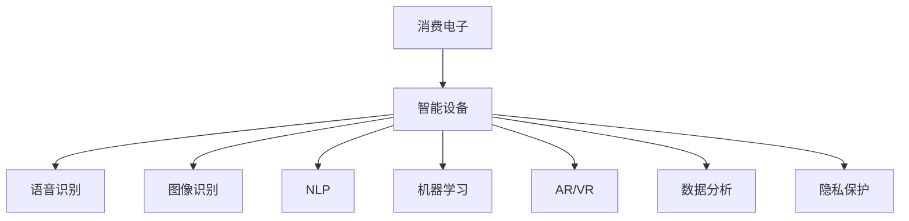

                 

# AI技术在消费电子中的应用现状

> 关键词：AI技术,消费电子,智能设备,语音识别,图像识别,自然语言处理,机器学习,数据分析,用户体验

## 1. 背景介绍

### 1.1 问题由来
随着人工智能(AI)技术的迅猛发展，AI在消费电子行业的应用范围越来越广泛。从智能手机到智能家居，从可穿戴设备到车载系统，AI技术的深度融合已经极大地丰富了消费者的体验，并推动了产品的智能化转型。这一趋势不仅体现在高端市场上，也逐渐渗透到了大众消费品中，成为驱动行业创新与发展的核心动力。

### 1.2 问题核心关键点
AI技术在消费电子中的应用主要集中在以下几个方面：

- **语音识别与自然语言处理**：使设备能够理解并响应用户的语音命令，提高用户与设备的互动效率。
- **图像识别与增强现实**：帮助设备识别环境中的物体，增强用户对周围环境的感知。
- **机器学习与推荐系统**：基于用户行为数据，提供个性化的内容推荐，提升用户满意度。
- **数据分析与隐私保护**：利用大数据分析优化设备使用体验，同时确保用户隐私安全。
- **增强现实与虚拟现实**：为用户提供沉浸式体验，推动产品与服务的创新。

## 2. 核心概念与联系

### 2.1 核心概念概述

为更好地理解AI在消费电子中的应用现状，本节将介绍几个关键概念：

- **消费电子**：包括但不限于手机、智能音箱、智能电视、可穿戴设备、车载系统等。这些产品以电子硬件为基础，集成了软件和AI技术，提供丰富的功能和服务。

- **智能设备**：具备智能感知、交互、自学习能力的消费电子设备。通过AI技术实现更高的自动化水平和用户体验。

- **语音识别**：通过AI模型将语音信号转换为文本，实现设备与用户的自然语言交互。

- **图像识别**：利用深度学习模型对图片中的物体、场景进行识别，提供信息抽取和情境感知能力。

- **自然语言处理(NLP)**：使机器能够理解、处理和生成自然语言，实现人机交互。

- **机器学习**：通过数据训练模型，使设备能够学习用户行为模式，提供个性化的服务和内容。

- **增强现实(AR)与虚拟现实(VR)**：通过AI技术重塑用户对物理世界的感知，提供沉浸式体验。

- **数据分析**：对用户数据进行分析，了解用户行为和偏好，优化产品和服务。

- **隐私保护**：在AI应用中，保护用户隐私数据，防止信息泄露和滥用。

这些核心概念之间的联系可以通过以下Mermaid流程图来展示：



这个流程图展示了一台智能设备在AI技术应用中的关键组成部分，它们共同构建了用户与设备互动的完整生态。

## 3. 核心算法原理 & 具体操作步骤
### 3.1 算法原理概述

AI技术在消费电子中的应用，主要基于以下几个核心算法原理：

- **深度学习**：通过多层神经网络对大量数据进行训练，学习复杂的特征表示。深度学习模型在大规模数据和计算资源的支撑下，能够在图像识别、语音识别等任务上取得卓越的性能。
- **自然语言处理(NLP)**：利用语言模型、序列到序列模型等NLP技术，实现自然语言的理解与生成。NLP技术使设备能够听懂用户的语音指令，识别文本内容，提供智能客服等功能。
- **机器学习**：通过监督学习、无监督学习、强化学习等方法，从用户数据中提取规律，实现个性化推荐、行为预测等应用。
- **增强现实与虚拟现实(AR/VR)**：结合计算机图形学、视觉识别、地理信息系统等技术，构建虚拟环境，提供沉浸式交互体验。

### 3.2 算法步骤详解

AI技术在消费电子中的应用一般包括以下关键步骤：

**Step 1: 数据收集与预处理**
- 收集设备使用过程中产生的数据，如用户操作记录、环境传感器数据等。
- 对数据进行清洗、去重、归一化等预处理操作，确保数据质量。

**Step 2: 模型训练与调优**
- 选择合适的算法模型，并使用标注数据进行训练。
- 根据模型表现调整超参数，如学习率、批大小、正则化强度等，优化模型性能。
- 使用交叉验证等技术，评估模型泛化能力。

**Step 3: 模型集成与部署**
- 将训练好的模型集成到消费电子设备中，确保系统稳定运行。
- 实现模型的实时推理，支持用户交互和决策。

**Step 4: 用户体验优化**
- 根据用户反馈和行为数据，不断调整和优化模型。
- 实现自适应算法，提升设备的用户体验和性能。

**Step 5: 隐私保护与安全**
- 实施隐私保护措施，如数据匿名化、差分隐私等。
- 确保设备的安全性，防止数据泄露和恶意攻击。

### 3.3 算法优缺点

AI技术在消费电子中的应用具有以下优点：
1. **提升用户体验**：通过智能化应用，如语音识别、个性化推荐等，极大提升用户使用设备的便捷性和满意度。
2. **创新产品功能**：引入AI技术，使消费电子产品具备更多元化的功能，拓展了市场应用场景。
3. **优化资源利用**：AI技术能提高设备对数据的处理能力，优化能源和资源的利用效率。
4. **推动行业升级**：AI技术的应用加速了消费电子行业的技术升级和产业转型。

同时，AI技术在消费电子中的应用也存在一些局限性：
1. **数据隐私风险**：用户数据的收集和使用可能带来隐私风险，需要严格的数据保护措施。
2. **计算资源需求高**：AI算法通常需要大量计算资源进行训练和推理，硬件成本较高。
3. **模型泛化能力有限**：模型往往对特定场景和数据集表现良好，但在其他场景下泛化效果不佳。
4. **技术复杂度较高**：AI技术的实施需要专业人才和技术支持，普通消费者难以自行操作。
5. **用户体验波动**：AI系统的性能和准确度受到数据质量和模型调优的影响，存在不确定性。

## 4. 数学模型和公式 & 详细讲解 & 举例说明
### 4.1 数学模型构建

AI技术在消费电子中的应用涉及到多个数学模型，以下以语音识别为例，展示其数学模型的构建过程：

**语音识别模型**：基于深度神经网络，通常包括卷积神经网络(CNN)和循环神经网络(RNN)。

输入为语音信号，经过预处理（如分帧、MFCC提取等）转化为特征向量。模型由多个层级构成，每层提取不同层次的特征，最终输出语音文本。

公式推导：
$$
f_{x} = \sum_{i=1}^{n} \alpha_i f_{i-1}
$$
其中，$f_x$为当前帧语音特征向量，$f_i$为上一层输出的特征向量，$\alpha_i$为权重系数。

**隐马尔可夫模型(HMM)**：用于对语音信号进行建模，预测下一个语音帧的可能性。

公式推导：
$$
P(X_{t+1} | X_t) = \sum_{i=1}^{n} P(X_{t+1} | H_i) P(H_i | X_t)
$$
其中，$X_t$表示当前语音帧，$H_i$表示隐藏状态，$P(X_{t+1} | H_i)$表示在状态$H_i$下，下一个语音帧为$X_{t+1}$的概率，$P(H_i | X_t)$表示当前状态为$H_i$的概率。

### 4.2 公式推导过程

以下我们以图像识别为例，展示其数学模型的推导过程：

**卷积神经网络(CNN)**：
$$
f_{x} = \sum_{i=1}^{n} \alpha_i f_{i-1}
$$
其中，$f_x$为当前帧语音特征向量，$f_i$为上一层输出的特征向量，$\alpha_i$为权重系数。

**循环神经网络(RNN)**：
$$
P(X_{t+1} | X_t) = \sum_{i=1}^{n} P(X_{t+1} | H_i) P(H_i | X_t)
$$
其中，$X_t$表示当前语音帧，$H_i$表示隐藏状态，$P(X_{t+1} | H_i)$表示在状态$H_i$下，下一个语音帧为$X_{t+1}$的概率，$P(H_i | X_t)$表示当前状态为$H_i$的概率。

### 4.3 案例分析与讲解

**案例分析**：以智能音箱为例，展示AI技术在消费电子中的应用。

1. **语音识别**：使用深度学习模型（如卷积神经网络、循环神经网络）对用户语音进行特征提取和模式识别。
2. **意图识别**：基于NLP技术，对用户语音指令进行理解，提取关键信息，确定用户意图。
3. **对话系统**：通过对话管理器，根据用户意图，生成自然语言回复，实现人机交互。
4. **推荐系统**：结合用户历史行为数据和实时环境信息，为用户推荐音乐、新闻等个性化内容。
5. **智能家居控制**：通过语音控制家中的智能设备，如灯光、空调、电视等，提升生活便利性。

## 5. 项目实践：代码实例和详细解释说明
### 5.1 开发环境搭建

在进行AI应用开发前，需要搭建好开发环境。以下是使用Python进行TensorFlow开发的典型步骤：

1. 安装Anaconda：从官网下载并安装Anaconda，用于创建独立的Python环境。
2. 创建并激活虚拟环境：
```bash
conda create -n tf-env python=3.8 
conda activate tf-env
```
3. 安装TensorFlow：
```bash
conda install tensorflow==2.x 
```
4. 安装其他必要的工具包：
```bash
pip install numpy pandas scikit-learn tensorflow-hub
```

完成上述步骤后，即可在`tf-env`环境中开始AI应用的开发实践。

### 5.2 源代码详细实现

以下展示一个简单的AI语音识别应用：

**1. 数据预处理**：使用Librosa库对语音信号进行分帧和MFCC提取。

```python
import librosa
import numpy as np

def preprocess_audio(audio_file):
    audio, sr = librosa.load(audio_file, sr=16000)
    hop_length = int(sr / 10)
    frames = librosa.frame(audio, hop_length=hop_length, frame_length=400, overlap=20)
    mfccs = librosa.feature.mfcc(frames, sr=sr)
    return mfccs
```

**2. 构建模型**：使用Keras构建卷积神经网络模型，进行语音特征的提取和分类。

```python
from keras.models import Sequential
from keras.layers import Conv2D, MaxPooling2D, Dense, Dropout

model = Sequential()
model.add(Conv2D(32, kernel_size=(3, 3), activation='relu', input_shape=(400, 40, 1)))
model.add(MaxPooling2D(pool_size=(2, 2)))
model.add(Conv2D(64, kernel_size=(3, 3), activation='relu'))
model.add(MaxPooling2D(pool_size=(2, 2)))
model.add(Dropout(0.25))
model.add(Flatten())
model.add(Dense(128, activation='relu'))
model.add(Dropout(0.5))
model.add(Dense(10, activation='softmax'))

model.compile(optimizer='adam', loss='categorical_crossentropy', metrics=['accuracy'])
```

**3. 训练模型**：使用音频数据集进行模型训练。

```python
from keras.utils import to_categorical
from os.path import join

train_data_dir = join('data', 'train')
val_data_dir = join('data', 'val')
class_names = os.listdir(train_data_dir)

train_audio_paths = glob(join(train_data_dir, '*.wav'))
val_audio_paths = glob(join(val_data_dir, '*.wav'))

def preprocess_train_data(audio_paths):
    X_train = []
    y_train = []
    for audio_path in audio_paths:
        audio_mfccs = preprocess_audio(audio_path)
        X_train.append(audio_mfccs)
        y_train.append(class_names.index(os.path.basename(audio_path)))
    X_train = np.array(X_train)
    y_train = np.array(y_train)
    y_train = to_categorical(y_train)
    return X_train, y_train

def preprocess_val_data(audio_paths):
    X_val = []
    y_val = []
    for audio_path in audio_paths:
        audio_mfccs = preprocess_audio(audio_path)
        X_val.append(audio_mfccs)
        y_val.append(class_names.index(os.path.basename(audio_path)))
    X_val = np.array(X_val)
    y_val = np.array(y_val)
    y_val = to_categorical(y_val)
    return X_val, y_val

X_train, y_train = preprocess_train_data(train_audio_paths)
X_val, y_val = preprocess_val_data(val_audio_paths)

model.fit(X_train, y_train, epochs=10, batch_size=32, validation_data=(X_val, y_val))
```

**4. 推理预测**：使用训练好的模型对新的语音数据进行分类预测。

```python
def classify_audio(audio_file):
    audio_mfccs = preprocess_audio(audio_file)
    prediction = model.predict(audio_mfccs)
    class_index = np.argmax(prediction)
    return class_names[class_index]
```

### 5.3 代码解读与分析

**代码解读**：
- **数据预处理**：使用Librosa库对音频信号进行分帧和MFCC提取，构建用于模型训练的数据集。
- **模型构建**：使用Keras构建卷积神经网络模型，包含多个卷积层、池化层和全连接层，用于提取和分类音频特征。
- **模型训练**：使用音频数据集进行模型训练，采用交叉验证等技术评估模型性能。
- **推理预测**：使用训练好的模型对新的音频数据进行分类预测，输出语音指令对应的类别。

## 6. 实际应用场景
### 6.1 智能音箱

智能音箱作为AI在消费电子中应用的典型代表，不仅具备语音识别、意图识别和对话系统，还能通过NLP技术实现个性化推荐和智能家居控制。例如，用户可以问音箱播放特定的歌曲，音箱会根据用户的听歌历史和情感状态推荐相似曲目，同时控制家中的灯光、空调等设备。

### 6.2 智能眼镜

智能眼镜通过摄像头和传感器，结合图像识别和机器学习技术，实现场景感知和交互。例如，智能眼镜可以在用户视线上显示通知、信息，根据环境光线自动调节屏幕亮度，还可以通过AR技术提供导航、购物等功能。

### 6.3 车载系统

车载系统结合图像识别、语音识别和机器学习技术，提升驾驶体验和安全。例如，车载系统可以通过面部识别和行为分析，判断驾驶员是否疲劳驾驶，并发出警报。此外，车载系统还可以实现语音导航、自动泊车等功能。

### 6.4 未来应用展望

随着AI技术的不断进步，未来消费电子产品将更加智能化、个性化。以下是一些未来应用展望：

1. **全场景智能交互**：未来的设备将能够理解不同场景下的用户需求，提供无缝的跨设备交互体验。例如，用户可以通过语音指令在智能音箱、智能眼镜、智能家居等设备间进行快速切换和操作。
2. **智能决策支持**：AI技术将融入更多行业应用，如医疗、金融、教育等，为决策提供支持。例如，智能医疗设备可以实时监测用户健康状况，提供个性化的健康建议。
3. **增强现实与虚拟现实**：AR/VR技术将与AI深度融合，为用户提供沉浸式的体验，如虚拟试衣、虚拟旅游等。
4. **边缘计算与低功耗**：未来的AI应用将更加依赖边缘计算，减少对中心服务器的依赖，提升设备响应速度和可靠性。同时，优化算法将使得设备在低功耗条件下也能高效运行。
5. **个性化与隐私保护**：未来的AI应用将更加注重个性化服务和隐私保护，确保用户数据的安全和隐私。例如，采用差分隐私、联邦学习等技术，防止数据泄露和滥用。

## 7. 工具和资源推荐
### 7.1 学习资源推荐

为了帮助开发者掌握AI在消费电子中的应用，以下是一些优质的学习资源：

1. **TensorFlow官方文档**：提供从入门到高级的详细教程和示例代码，覆盖语音识别、图像识别、自然语言处理等多个领域。
2. **PyTorch官方文档**：展示PyTorch在AI应用中的实践，包括模型构建、训练、推理等环节。
3. **Keras官方文档**：提供简单易用的深度学习框架，支持多种模型构建和优化方法。
4. **NLP综述书籍**：如《深度学习与自然语言处理》，深入介绍NLP技术的原理和应用。
5. **AI在消费电子中的应用书籍**：如《AI技术在智能设备中的应用》，涵盖智能音箱、智能眼镜、智能家居等多个领域的AI应用案例。

### 7.2 开发工具推荐

高效的开发离不开优秀的工具支持。以下是几款用于AI在消费电子应用开发的常用工具：

1. **TensorFlow**：谷歌推出的深度学习框架，支持多种硬件和平台，适用于大规模应用开发。
2. **Keras**：高层神经网络API，易于上手，适合快速原型开发。
3. **Jupyter Notebook**：交互式编程环境，便于实验和共享代码。
4. **TensorBoard**：可视化工具，监控模型训练状态，帮助调试和优化。
5. **Google Colab**：免费提供的GPU环境，便于实验和测试新模型。

### 7.3 相关论文推荐

AI在消费电子中的应用涉及多领域知识的融合，以下是一些经典的研究论文，推荐阅读：

1. **语音识别**：《Convolutional Recurrent Neural Networks for Large Vocabulary Speech Recognition》，介绍使用卷积神经网络和循环神经网络构建语音识别模型。
2. **图像识别**：《Deep Residual Learning for Image Recognition》，介绍使用残差网络进行图像识别。
3. **自然语言处理**：《Attention is All You Need》，介绍使用Transformer进行自然语言处理。
4. **增强现实与虚拟现实**：《Learning in Adversarial Environments》，介绍使用对抗生成网络进行AR/VR应用。
5. **隐私保护**：《Differential Privacy by Augmenting epsilon-Differential Privacy》，介绍使用差分隐私保护用户数据。

## 8. 总结：未来发展趋势与挑战
### 8.1 研究成果总结

本文对AI在消费电子中的应用现状进行了系统梳理，涵盖语音识别、图像识别、自然语言处理等多个领域。通过分析其核心概念和算法原理，展示了AI技术在消费电子中的应用范式和实际案例。同时，本文也提出了AI在消费电子中面临的挑战，并展望了未来发展趋势。

### 8.2 未来发展趋势

未来，AI在消费电子中的应用将呈现以下趋势：

1. **多模态融合**：AI将结合多种传感器和模态信息，提供更全面的用户体验。例如，智能眼镜可以结合视觉、触觉、听觉等多种模态信息，提升互动体验。
2. **边缘计算**：随着5G和物联网技术的发展，AI应用将更多地依赖于边缘计算，减少对中心服务器的依赖。边缘计算将提升设备响应速度和可靠性。
3. **隐私保护**：随着数据隐私意识的提高，AI应用将更加注重用户隐私保护，采用差分隐私、联邦学习等技术，防止数据泄露和滥用。
4. **自动化和智能化**：未来的消费电子产品将具备更高的自动化和智能化水平，实现自我学习和决策。例如，智能家居设备将能够自我调整家居环境，提升用户生活质量。
5. **跨设备协同**：AI应用将更加注重跨设备协同，提供无缝的用户体验。例如，智能音箱、智能眼镜、智能家居等设备间的互联互通，提升用户便利性。

### 8.3 面临的挑战

尽管AI在消费电子中的应用取得了显著进展，但仍面临以下挑战：

1. **数据隐私与安全**：AI应用需要大量数据支持，但数据隐私和安全问题不容忽视。如何确保用户数据的安全和隐私，防止数据泄露和滥用，仍需进一步研究和探索。
2. **算法透明度**：AI模型的决策过程往往难以解释，缺乏透明度。如何在不降低模型性能的前提下，提升算法的可解释性，增强用户信任感，是一个重要课题。
3. **计算资源与功耗**：AI模型通常需要大量计算资源，硬件成本较高。同时，高精度模型对功耗要求较高，需要优化模型结构和算法，提升设备运行效率。
4. **跨领域应用**：AI技术在不同领域的应用场景差异较大，如何在不同应用场景中保持一致性和鲁棒性，仍是重要挑战。
5. **用户体验**：AI应用需结合用户需求进行优化，提升用户体验。如何设计更友好、易用的界面，增强用户交互体验，还需要更多实践和积累。

### 8.4 研究展望

未来，AI在消费电子中的应用将不断深化和扩展，需要进一步的研究和探索：

1. **跨模态融合与协同**：研究如何结合不同模态信息，提升用户体验和设备性能。例如，结合视觉、触觉、听觉等多种信息，提供更全面的感知和互动。
2. **隐私保护与伦理**：研究如何在AI应用中保护用户隐私，同时确保算法决策的公正性和透明度。例如，采用差分隐私、联邦学习等技术，防止数据泄露和滥用。
3. **自适应与个性化**：研究如何根据用户行为和环境变化，自适应调整AI应用，提升用户体验和系统鲁棒性。例如，根据用户行为数据，实时调整设备功能和推荐内容。
4. **跨领域应用**：研究如何将AI技术应用于不同领域，提升应用效果和普适性。例如，在医疗、金融、教育等领域，实现AI应用的广泛落地。
5. **人工智能伦理**：研究如何在AI应用中考虑伦理问题，确保算法决策符合社会价值观和道德标准。例如，防止AI应用对社会产生负面影响，避免歧视和偏见。

未来，AI在消费电子中的应用将更加广泛和深入，成为推动行业创新和用户生活变革的重要力量。只有在技术、伦理、隐私保护等方面取得突破，才能实现AI技术的可持续发展，为用户和社会创造更大的价值。

---

作者：禅与计算机程序设计艺术 / Zen and the Art of Computer Programming

