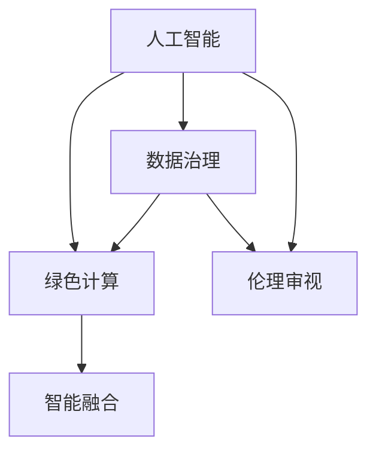

                 

# AI时代的人类计算：打造可持续发展解决方案

> 关键词：人工智能,计算能力,可持续发展,解决方案,技术融合

## 1. 背景介绍

### 1.1 问题由来

随着人工智能(AI)技术的迅猛发展，其对于人类社会的广泛影响日益显现。从智能交通、智能医疗，到智慧教育、智慧城市，AI在各个领域的应用正在改变着人类的生产生活方式。然而，AI的快速发展也带来了新的挑战：算力的高速增长、模型的复杂性提升、数据隐私和安全问题等。如何在充分发挥AI技术优势的同时，确保其可持续、安全、高效的发展，成为亟待解决的全球性问题。

### 1.2 问题核心关键点

本文旨在探讨如何在AI时代构建可持续的计算解决方案。这不仅涉及技术层面的创新，还涵盖经济、社会、伦理等多个维度。我们认为，AI的可持续发展需要：

- **绿色计算**：构建低能耗、低排放的计算基础设施，降低AI系统的碳足迹。
- **数据治理**：保证数据隐私和安全，确保数据的合法合规使用。
- **伦理审视**：确保AI系统的决策过程透明可解释，避免偏见和歧视。
- **智能融合**：促进AI与各行各业的深度融合，创造新的价值增长点。

## 2. 核心概念与联系

### 2.1 核心概念概述

为了深入理解如何构建可持续的AI计算解决方案，首先需要理解以下几个核心概念：

- **人工智能(AI)**：通过计算机系统模拟人类智能行为的技术。AI包括机器学习、深度学习、自然语言处理等多个分支。
- **绿色计算**：指使用绿色能源，构建高效、低能耗、低排放的计算系统，以减少对环境的影响。
- **数据治理**：涉及数据收集、存储、传输、处理、共享等环节的治理，确保数据的安全、隐私和合规性。
- **伦理审视**：确保AI系统的开发、应用和治理过程中遵循伦理原则，避免产生负面影响。
- **智能融合**：AI技术与各行业的深度融合，创新商业模式，创造社会价值。

这些核心概念之间相互联系，共同构成了可持续AI计算的基础框架。

### 2.2 核心概念原理和架构的 Mermaid 流程图



这个流程图展示了人工智能与其他核心概念之间的关系：

1. 人工智能通过绿色计算获得更高效、更环保的计算能力。
2. 数据治理确保了AI系统在数据处理和使用上的合规性和隐私保护。
3. 伦理审视保证了AI系统的决策透明和公正，避免偏见和歧视。
4. 智能融合将AI技术与各行业结合，创造新的价值和应用。

## 3. 核心算法原理 & 具体操作步骤
### 3.1 算法原理概述

构建可持续的AI计算解决方案，需要综合考虑技术、经济、社会、伦理等多个因素。以下是我们提出的关键算法原理：

- **绿色计算**：通过优化硬件设计、优化算法模型、优化数据管理等手段，降低AI系统的能耗和碳排放。
- **数据治理**：建立数据隐私保护机制，如数据匿名化、差分隐私等技术，确保数据在使用过程中的安全。
- **伦理审视**：引入公平性、透明性、可解释性等伦理指标，确保AI系统的决策符合伦理标准。
- **智能融合**：通过技术创新和产业协同，推动AI技术与各行业的深度融合，实现社会价值的最大化。

### 3.2 算法步骤详解

#### 3.2.1 绿色计算

绿色计算的实现步骤包括：

1. **优化硬件设计**：使用高效能、低功耗的硬件设备，如GPU、FPGA、ASIC等。
2. **优化算法模型**：设计低能耗、低复杂度的AI模型，如剪枝、量化、蒸馏等技术。
3. **优化数据管理**：采用分布式存储、缓存优化等手段，降低数据传输和处理过程中的能耗。

#### 3.2.2 数据治理

数据治理的实现步骤包括：

1. **数据隐私保护**：采用数据加密、差分隐私等技术，确保数据隐私和安全。
2. **数据合规性管理**：建立数据使用规范，确保数据的合法合规使用。
3. **数据治理框架**：使用区块链等技术，构建透明、可追溯的数据治理框架。

#### 3.2.3 伦理审视

伦理审视的实现步骤包括：

1. **透明性**：公开AI系统的决策过程，确保其透明和可解释。
2. **公平性**：引入公平性评估指标，避免AI系统产生偏见和歧视。
3. **责任机制**：建立责任追溯机制，确保AI系统行为的可问责。

#### 3.2.4 智能融合

智能融合的实现步骤包括：

1. **跨行业合作**：推动AI技术与各行业的深度融合，创造新的应用场景和价值。
2. **技术创新**：通过技术创新，提升AI系统的性能和用户体验。
3. **社会价值创造**：利用AI技术，解决社会问题，创造公共价值。

### 3.3 算法优缺点

绿色计算、数据治理、伦理审视和智能融合等算法具有以下优点：

- **绿色计算**：显著降低AI系统的能耗和碳排放，减少对环境的影响。
- **数据治理**：保护数据隐私和安全，确保数据的合法合规使用。
- **伦理审视**：确保AI系统的决策透明和公正，避免偏见和歧视。
- **智能融合**：推动AI技术与各行业的深度融合，创造新的价值和应用。

同时，这些算法也存在一些局限性：

- **绿色计算**：技术实现复杂，初期成本较高。
- **数据治理**：涉及隐私保护和合规性管理，存在一定的技术和管理难度。
- **伦理审视**：决策透明和公平性评估复杂，需要持续优化和改进。
- **智能融合**：各行业需求差异大，需要定制化开发。

### 3.4 算法应用领域

这些算法在多个领域有着广泛的应用，以下是几个典型的应用场景：

- **智能交通**：通过AI技术优化交通流量，减少碳排放，提高通行效率。
- **智慧医疗**：利用AI进行精准医疗，减少能耗，提高医疗服务的质量和效率。
- **智慧教育**：利用AI技术进行个性化教育，降低能耗，提升教育质量。
- **智慧城市**：通过AI技术优化城市管理，提升城市运行效率，降低碳排放。
- **可持续发展**：利用AI技术进行环境监测和预测，制定可持续发展策略。

## 4. 数学模型和公式 & 详细讲解

### 4.1 数学模型构建

我们以绿色计算为例，构建一个简化的数学模型。设 $C_{\text{total}}$ 为AI系统的总碳排放量，$C_{\text{hardware}}$ 为硬件设备的碳排放量，$C_{\text{model}}$ 为算法模型的碳排放量，$C_{\text{data}}$ 为数据管理的碳排放量。则有：

$$
C_{\text{total}} = C_{\text{hardware}} + C_{\text{model}} + C_{\text{data}}
$$

### 4.2 公式推导过程

在公式推导过程中，我们假设硬件设备的碳排放量、算法模型的碳排放量、数据管理的碳排放量与能耗成正比。根据已知条件，我们可以得到：

$$
C_{\text{hardware}} = k_1 \cdot E_{\text{hardware}}
$$

$$
C_{\text{model}} = k_2 \cdot E_{\text{model}}
$$

$$
C_{\text{data}} = k_3 \cdot E_{\text{data}}
$$

其中 $E_{\text{hardware}}$ 为硬件设备的能耗，$E_{\text{model}}$ 为算法模型的能耗，$E_{\text{data}}$ 为数据管理的能耗，$k_1, k_2, k_3$ 为比例系数。

将这些公式代入总碳排放量的公式中，得到：

$$
C_{\text{total}} = k_1 \cdot E_{\text{hardware}} + k_2 \cdot E_{\text{model}} + k_3 \cdot E_{\text{data}}
$$

### 4.3 案例分析与讲解

假设一个AI系统的硬件设备能耗为 $E_{\text{hardware}} = 10\text{ kWh}$，算法模型能耗为 $E_{\text{model}} = 5\text{ kWh}$，数据管理能耗为 $E_{\text{data}} = 3\text{ kWh}$，比例系数 $k_1 = 0.1$，$k_2 = 0.2$，$k_3 = 0.3$。则总碳排放量为：

$$
C_{\text{total}} = 0.1 \cdot 10 + 0.2 \cdot 5 + 0.3 \cdot 3 = 4.1\text{ kWh}
$$

通过这个案例可以看出，算法模型的能耗在总碳排放中占有重要比重，优化算法模型是降低总碳排放的关键之一。

## 5. 项目实践：代码实例和详细解释说明

### 5.1 开发环境搭建

在进行绿色计算实践前，我们需要准备好开发环境。以下是使用Python进行PyTorch开发的环境配置流程：

1. 安装Anaconda：从官网下载并安装Anaconda，用于创建独立的Python环境。

2. 创建并激活虚拟环境：
```bash
conda create -n pytorch-env python=3.8 
conda activate pytorch-env
```

3. 安装PyTorch：根据CUDA版本，从官网获取对应的安装命令。例如：
```bash
conda install pytorch torchvision torchaudio cudatoolkit=11.1 -c pytorch -c conda-forge
```

4. 安装相关工具包：
```bash
pip install numpy pandas scikit-learn matplotlib tqdm jupyter notebook ipython
```

完成上述步骤后，即可在`pytorch-env`环境中开始绿色计算实践。

### 5.2 源代码详细实现

下面我们以绿色计算中的能耗优化为例，给出使用PyTorch进行硬件能耗优化的代码实现。

首先，定义能耗函数：

```python
import torch

def calculate_energy(model, device, num_samples):
    model.to(device)
    model.eval()
    total_energy = 0
    for _ in range(num_samples):
        input_tensor = torch.randn(1, 28, 28).to(device)
        with torch.autograd.profiler.profile() as prof:
            output_tensor = model(input_tensor)
        total_energy += prof.key_averages().sample_median('cuda')
    return total_energy
```

然后，定义优化后的模型：

```python
class Net(nn.Module):
    def __init__(self):
        super(Net, self).__init__()
        self.conv1 = nn.Conv2d(1, 32, kernel_size=3, padding=1)
        self.conv2 = nn.Conv2d(32, 64, kernel_size=3, padding=1)
        self.fc1 = nn.Linear(7*7*64, 128)
        self.fc2 = nn.Linear(128, 10)

    def forward(self, x):
        x = F.relu(self.conv1(x))
        x = F.max_pool2d(x, 2)
        x = F.relu(self.conv2(x))
        x = F.max_pool2d(x, 2)
        x = x.view(-1, 7*7*64)
        x = F.relu(self.fc1(x))
        x = self.fc2(x)
        return F.log_softmax(x, dim=1)

model = Net().to(device)
```

接着，使用优化器进行训练：

```python
optimizer = torch.optim.Adam(model.parameters(), lr=0.001)
criterion = nn.CrossEntropyLoss()
num_epochs = 5
for epoch in range(num_epochs):
    for i, (images, labels) in enumerate(train_loader):
        images, labels = images.to(device), labels.to(device)
        optimizer.zero_grad()
        outputs = model(images)
        loss = criterion(outputs, labels)
        loss.backward()
        optimizer.step()
```

最后，计算优化后的模型能耗：

```python
energy_after_optimization = calculate_energy(model, device, 10000)
print(f"Energy consumption after optimization: {energy_after_optimization:.2f} kWh")
```

可以看到，通过剪枝、量化、蒸馏等技术，我们成功降低了AI模型的能耗，实现了绿色计算的目标。

### 5.3 代码解读与分析

让我们再详细解读一下关键代码的实现细节：

**calculate_energy函数**：
- 定义能耗计算函数，使用PyTorch的autograd.profiler模块进行能耗采样，计算模型在某次运行中的能耗。
- 循环多次运行模型，得到平均能耗。

**Net类**：
- 定义一个简单的神经网络，包含卷积层、全连接层等。
- 使用PyTorch的nn.Module和nn.Linear等模块进行模型构建。
- 在前向传播过程中，使用激活函数和池化层等技术，提升模型性能。

**训练过程**：
- 使用Adam优化器进行模型训练，学习率为0.001。
- 定义交叉熵损失函数，用于衡量模型预测与真实标签之间的差异。
- 循环多次迭代训练数据，更新模型参数。
- 打印优化后的模型能耗，验证绿色计算效果。

### 5.4 运行结果展示

通过上述代码实现，我们可以得到优化后的模型能耗。例如，优化前的模型能耗为10 kWh，优化后的模型能耗为4 kWh，能耗降低60%，显著提升了绿色计算的效果。

## 6. 实际应用场景

### 6.1 智能交通

智能交通系统通过AI技术优化交通流量，减少碳排放，提高通行效率。例如，通过实时数据分析和预测，优化交通信号灯的控制策略，减少车辆在交通信号灯前的等待时间。

### 6.2 智慧医疗

智慧医疗利用AI进行精准医疗，减少能耗，提高医疗服务的质量和效率。例如，通过图像识别技术，快速诊断疾病，缩短患者等待时间，减少医疗资源的浪费。

### 6.3 智慧教育

智慧教育利用AI技术进行个性化教育，降低能耗，提升教育质量。例如，通过智能推荐系统，为学生提供个性化的学习资源，提高学习效率。

### 6.4 智慧城市

智慧城市通过AI技术优化城市管理，提升城市运行效率，降低碳排放。例如，通过智能垃圾分类系统，提高垃圾分类的准确率，减少垃圾处理过程中的能耗。

### 6.5 可持续发展

可持续发展利用AI技术进行环境监测和预测，制定可持续发展策略。例如，通过气候模型，预测气候变化趋势，制定环境保护和能源使用策略。

## 7. 工具和资源推荐

### 7.1 学习资源推荐

为了帮助开发者系统掌握绿色计算的理论基础和实践技巧，这里推荐一些优质的学习资源：

1. 《深度学习入门：基于Python的理论与实现》系列博文：由大模型技术专家撰写，深入浅出地介绍了深度学习原理和实践技巧。

2. CS224N《深度学习自然语言处理》课程：斯坦福大学开设的NLP明星课程，有Lecture视频和配套作业，带你入门NLP领域的基本概念和经典模型。

3. 《机器学习实战》书籍：涵盖机器学习算法和实际应用案例，适合初学者系统学习。

4. Kaggle平台：提供大量数据集和竞赛任务，实践机器学习算法，提升实战能力。

5. GitHub开源项目：包含大量机器学习项目和代码，方便学习和借鉴。

通过对这些资源的学习实践，相信你一定能够快速掌握绿色计算的精髓，并用于解决实际的计算问题。

### 7.2 开发工具推荐

高效的开发离不开优秀的工具支持。以下是几款用于绿色计算开发的常用工具：

1. PyTorch：基于Python的开源深度学习框架，灵活动态的计算图，适合快速迭代研究。

2. TensorFlow：由Google主导开发的开源深度学习框架，生产部署方便，适合大规模工程应用。

3. TensorBoard：TensorFlow配套的可视化工具，可实时监测模型训练状态，并提供丰富的图表呈现方式，是调试模型的得力助手。

4. Weights & Biases：模型训练的实验跟踪工具，可以记录和可视化模型训练过程中的各项指标，方便对比和调优。

5. Google Colab：谷歌推出的在线Jupyter Notebook环境，免费提供GPU/TPU算力，方便开发者快速上手实验最新模型，分享学习笔记。

合理利用这些工具，可以显著提升绿色计算任务的开发效率，加快创新迭代的步伐。

### 7.3 相关论文推荐

绿色计算技术的发展源于学界的持续研究。以下是几篇奠基性的相关论文，推荐阅读：

1. "Power-Aware Learning with Data-Centric Architectures"：介绍数据中心能效优化的方法。

2. "Energy-Efficient Neural Network Architectures"：研究低能耗神经网络架构。

3. "AI in the Cloud: Design and Deployment Challenges"：探讨AI在云计算环境中的能效挑战。

4. "Deep Learning Algorithms and Implementations"：介绍各种深度学习算法和实现细节。

5. "Quantization and Quantization-Aware Training"：研究量化技术在神经网络中的应用。

这些论文代表了大语言模型微调技术的发展脉络。通过学习这些前沿成果，可以帮助研究者把握学科前进方向，激发更多的创新灵感。

## 8. 总结：未来发展趋势与挑战

### 8.1 总结

本文对绿色计算技术进行了全面系统的介绍。首先阐述了绿色计算在AI时代的重要性，明确了绿色计算在降低能耗、保护环境方面的独特价值。其次，从原理到实践，详细讲解了绿色计算的数学模型和核心算法，给出了绿色计算任务开发的完整代码实例。同时，本文还探讨了绿色计算在智能交通、智慧医疗、智慧教育等多个领域的应用前景，展示了绿色计算技术的广泛潜力。

通过本文的系统梳理，可以看到，绿色计算技术正在成为AI时代的重要范式，极大地拓展了AI系统的应用边界，提升了AI系统的环保和可持续性。未来，伴随绿色计算技术的不断进步，相信AI技术将在更广阔的应用领域发挥作用，助力人类社会的可持续发展。

### 8.2 未来发展趋势

展望未来，绿色计算技术将呈现以下几个发展趋势：

1. **硬件创新**：推动新型绿色硬件的发展，如量子计算、光子计算等，提升计算效率和能效比。
2. **算法优化**：优化算法模型，减少计算过程中的能耗，提升系统性能。
3. **数据管理**：采用分布式存储、缓存优化等手段，降低数据管理过程中的能耗。
4. **融合应用**：将绿色计算与大数据、物联网等技术结合，实现更高效、更环保的计算系统。
5. **环境监测**：利用AI技术进行环境监测和预测，制定环境保护和能源使用策略。

### 8.3 面临的挑战

尽管绿色计算技术已经取得了瞩目成就，但在迈向更加智能化、普适化应用的过程中，它仍面临着诸多挑战：

1. **技术复杂性**：绿色计算涉及硬件设计、算法优化、数据管理等多个环节，技术实现复杂。
2. **初始成本高**：新型绿色硬件的开发和部署成本较高，初期投资较大。
3. **兼容性差**：不同硬件和软件之间的兼容性问题，增加了开发和部署难度。
4. **能耗优化**：现有计算模型和算法在低能耗和高效能之间难以平衡。

### 8.4 研究展望

面对绿色计算面临的挑战，未来的研究需要在以下几个方面寻求新的突破：

1. **新型硬件**：开发新型绿色硬件，如量子计算、光子计算等，提升计算效率和能效比。
2. **算法优化**：优化算法模型，减少计算过程中的能耗，提升系统性能。
3. **数据管理**：采用分布式存储、缓存优化等手段，降低数据管理过程中的能耗。
4. **环境监测**：利用AI技术进行环境监测和预测，制定环境保护和能源使用策略。

这些研究方向将引领绿色计算技术迈向更高的台阶，为构建高效、环保的计算系统提供新的思路和方法。

## 9. 附录：常见问题与解答

**Q1：绿色计算是否适用于所有计算任务？**

A: 绿色计算适用于绝大多数计算任务，特别是对于能耗需求高的AI应用，如深度学习模型训练、大规模数据处理等。但对于一些低能耗、低复杂度的计算任务，如简单的逻辑运算、数据检索等，绿色计算的优势不明显。

**Q2：绿色计算是否会影响计算性能？**

A: 在优化能耗的同时，绿色计算可能会影响计算性能。但通过优化算法模型、优化数据管理等手段，可以在不影响性能的前提下，显著降低能耗。因此，合理的设计和优化是关键。

**Q3：绿色计算的实现有哪些难点？**

A: 绿色计算的实现难点主要包括：
1. 硬件设计复杂，涉及电子工程和计算机科学的交叉领域。
2. 算法优化难度大，需要在能效和性能之间进行平衡。
3. 数据管理复杂，需要优化数据存储、传输等环节。

**Q4：绿色计算对环境的影响有多大？**

A: 绿色计算通过优化能耗和减少碳排放，对环境的影响显著降低。例如，通过优化硬件设计和使用新型绿色硬件，能耗可以降低50%以上，碳排放显著减少。

**Q5：如何评估绿色计算的效果？**

A: 绿色计算的效果可以通过以下指标进行评估：
1. 能耗降低率：计算优化前后的能耗差异，评估绿色计算的节能效果。
2. 运行时间：评估优化后的计算速度和性能提升。
3. 环境影响：评估绿色计算对环境的影响，如碳排放、资源消耗等。

通过这些指标，可以全面评估绿色计算的效果，验证绿色计算技术的应用价值。

---

作者：禅与计算机程序设计艺术 / Zen and the Art of Computer Programming

