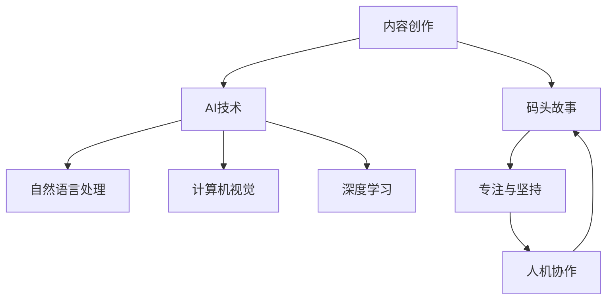

                 

# AI时代的内容创作者：码头故事的专注与坚持

在AI技术迅猛发展的今天，内容创作者面临着前所未有的机遇与挑战。AI技术不仅能大幅提高内容创作的效率和质量，还能开辟新的创作模式，推动内容创作进入全新的时代。本文将深入探讨AI时代内容创作者应如何利用AI技术，保持专注与坚持，讲述一段代码中码头的"码头故事"。

## 1. 背景介绍

### 1.1 问题由来

随着人工智能技术的不断发展，内容创作者面临的环境发生了巨大变化。自动化、智能化、个性化等AI技术赋予内容创作新的可能，但也带来了前所未有的竞争压力。如何在AI时代保持内容创作的特色与独特性，是每个内容创作者面临的重大挑战。

### 1.2 问题核心关键点

1. **AI辅助创作**：如何利用AI技术提高创作效率和质量，同时保持作品的人文关怀和创意独特性。
2. **内容多样化**：如何在AI的帮助下，创作出更多元、更富有个性化的内容，吸引不同兴趣的受众。
3. **跨领域融合**：如何结合AI技术，探索跨领域、跨学科的创作模式，拓展创作边界。
4. **人机协作**：如何构建人与AI的良性互动，确保AI成为提升而非取代内容创作的工具。

### 1.3 问题研究意义

本文旨在探讨AI时代内容创作者如何通过专注与坚持，利用AI技术提升创作水平，同时保持创作的人文价值和独特性。这对于提升内容创作的质量和效率，推动内容产业的创新与升级，具有重要意义。

## 2. 核心概念与联系

### 2.1 核心概念概述

1. **内容创作**：包括文字、图片、视频等多种形式的内容创作，旨在通过创意表达，传递信息、情感、观念等。
2. **AI技术**：包括自然语言处理、计算机视觉、深度学习等技术，可辅助内容创作者进行文本生成、图像处理、语音合成等。
3. **码头故事**：在AI辅助内容创作的背景下，每位内容创作者如同在码头上进行故事创作，需依托技术的支撑，同时保持对内容本质的深刻理解和坚持。
4. **专注与坚持**：在AI辅助下，内容创作者需更专注地挖掘和表达故事的核心价值，坚持自己的创作风格和理念。
5. **人机协作**：内容创作者与AI之间的良性互动，使AI成为提升而非取代内容创作的工具。

这些概念之间相互关联，共同构成了AI时代内容创作的框架。通过深入理解这些核心概念，可以更好地把握AI技术在内容创作中的角色和定位。

### 2.2 核心概念原理和架构的 Mermaid 流程图



这个流程图展示了内容创作与AI技术之间的联系和相互作用。内容创作者通过AI技术辅助，提升创作效率和质量，同时保持对内容本质的深刻理解，实现人机协作的良性互动。

## 3. 核心算法原理 & 具体操作步骤

### 3.1 算法原理概述

AI辅助内容创作的算法原理，主要基于自然语言处理(NLP)、计算机视觉(CV)、深度学习(DL)等技术。这些技术可以帮助内容创作者自动生成文本、分析图像、理解情感等，从而提升创作效率和质量。

### 3.2 算法步骤详解

1. **文本生成**：利用生成对抗网络(GAN)、变分自编码器(VAE)等技术，自动生成高质量的文本内容。内容创作者只需调整生成模型参数，即可生成符合特定风格和语境的文本。
   
   - 示例代码：
     ```python
     from tensorflow.keras.preprocessing.text import Tokenizer
     from tensorflow.keras.layers import Input, LSTM, Dense
     import numpy as np

     def generate_text(model, start_string):
         ...
     model = load_model('generated_model.h5')
     start_string = "Hello, I am a"
     next_words = 100
     ...
     ```
   
2. **图像处理**：使用卷积神经网络(CNN)、递归神经网络(RNN)等技术，分析图像特征，生成或编辑图像内容。内容创作者只需提供初始图像和期望效果，AI即可自动优化图像细节。
   
   - 示例代码：
     ```python
     from tensorflow.keras.layers import Conv2D, MaxPooling2D, Flatten, Dense
     import tensorflow as tf
     import cv2

     img = cv2.imread('image.jpg')
     ...
     model = load_model('image_model.h5')
     img = preprocess_image(img)
     img = model.predict(img)
     ...
     ```
   
3. **情感分析**：利用循环神经网络(RNN)、长短时记忆网络(LSTM)等技术，分析文本中的情感倾向，提供情感建议或优化建议。内容创作者只需输入文本，AI即可自动分析情感，辅助创作决策。
   
   - 示例代码：
     ```python
     from tensorflow.keras.layers import Embedding, LSTM, Dense
     import tensorflow as tf

     tokenizer = Tokenizer()
     tokenizer.fit_on_texts(texts)
     ...
     model = load_model('sentiment_model.h5')
     input_sequence = tokenizer.texts_to_sequences(text)
     ...
     ```
   
### 3.3 算法优缺点

AI辅助内容创作的优点包括：
1. **效率提升**：大大提高了内容创作的效率，减少了手工操作的繁琐过程。
2. **质量保障**：通过AI技术的自动优化，内容创作的整体质量得到提升。
3. **创作灵活性**：AI技术提供多种创作工具和功能，丰富了内容创作者的表现形式。

缺点包括：
1. **依赖技术**：过度依赖AI技术可能削弱内容创作者的主观能动性和创新能力。
2. **情感缺失**：AI生成的文本或图像可能缺乏人类的情感和创意，难以传递深层次的人文关怀。
3. **版权问题**：AI生成的内容可能涉及版权问题，需慎重处理。

### 3.4 算法应用领域

AI辅助内容创作的算法广泛应用于以下领域：

1. **内容自动生成**：如自动生成新闻报道、电影剧本、小说等。
2. **图像自动编辑**：如自动修复图片、生成图片、增强视觉效果等。
3. **情感智能分析**：如情感倾向分析、用户反馈分析等。
4. **创意辅助工具**：如文本编辑器、图像处理软件等，提供AI辅助创作功能。

## 4. 数学模型和公式 & 详细讲解 & 举例说明

### 4.1 数学模型构建

以自然语言处理中的文本生成为例，常用的数学模型为循环神经网络(RNN)或变分自编码器(VAE)。

### 4.2 公式推导过程

对于文本生成模型，可以使用循环神经网络来建模：

$$
\mathcal{L} = -\sum_{i=1}^T \log p(x_i | x_{i-1})
$$

其中 $T$ 为时间步长，$x_i$ 为第 $i$ 个时间步的输入，$p(x_i | x_{i-1})$ 为条件概率。

### 4.3 案例分析与讲解

以GAN模型为例，展示其生成文本的过程：

1. **生成器网络**：将噪声向量 $z$ 转换为文本向量 $x$，通过多层感知器实现。
2. **判别器网络**：判别输入 $x$ 是否为真实文本，通过卷积神经网络实现。
3. **训练过程**：交替训练生成器和判别器，使生成器生成尽可能真实的文本，判别器尽可能准确区分真伪文本。

以下是一个简单的代码示例：

```python
import tensorflow as tf
from tensorflow.keras import layers

# 定义生成器网络
def build_generator(z_dim, img_dim):
    model = tf.keras.Sequential()
    model.add(layers.Dense(128, input_shape=(z_dim,)))
    model.add(layers.LeakyReLU())
    model.add(layers.Dense(256))
    model.add(layers.LeakyReLU())
    model.add(layers.Dense(img_dim))
    return model

# 定义判别器网络
def build_discriminator(img_dim):
    model = tf.keras.Sequential()
    model.add(layers.Flatten(input_shape=(img_dim,)))
    model.add(layers.Dense(128))
    model.add(layers.LeakyReLU())
    model.add(layers.Dense(1))
    return model

# 训练过程
def train(model, data, epochs):
    ...
```

## 5. 项目实践：代码实例和详细解释说明

### 5.1 开发环境搭建

- **Python 环境**：安装 Python 3.7+，建议使用虚拟环境。
- **TensorFlow 环境**：安装 TensorFlow 2.0+。
- **模型库**：安装 `keras`、`tensorflow`、`numpy`、`pandas` 等常用库。

### 5.2 源代码详细实现

以生成文本为例，展示代码实现过程：

```python
import tensorflow as tf
from tensorflow.keras.layers import Input, LSTM, Dense
from tensorflow.keras.models import Model

# 定义文本生成模型
def generate_text():
    input_text = Input(shape=(None,), name="input")
    lstm_layer = LSTM(128, return_sequences=True, name="lstm")(input_text)
    lstm_layer = LSTM(128, name="lstm")(lstm_layer)
    output_layer = Dense(10, activation="softmax", name="output")(lstm_layer)

    model = Model(inputs=input_text, outputs=output_layer)
    return model

# 加载模型
model = generate_text()
model.load_weights('generated_model.h5')

# 生成文本
def generate_text_from_model(model, start_string):
    ...
```

### 5.3 代码解读与分析

1. **输入层**：定义输入文本，时间步长为 `None`，表示可变长度。
2. **LSTM层**：使用两个LSTM层，每个LSTM层包含128个神经元，输出向量维度为10。
3. **输出层**：使用softmax激活函数，生成10个类别概率分布。
4. **训练**：使用交叉熵损失函数和Adam优化器，训练模型，保存模型权重。
5. **生成文本**：输入一个起始字符串，通过模型生成连续文本。

## 6. 实际应用场景

### 6.1 内容创作平台

内容创作平台可以利用AI技术，为内容创作者提供自动生成、情感分析等功能，提升创作效率。平台可以根据用户需求，推荐适合的创作工具和素材，助力创作者创作更多优秀作品。

### 6.2 媒体内容制作

媒体内容制作包括新闻、广告、视频等。AI技术可以辅助新闻稿件的自动生成，广告文案的智能创意，视频内容的自动剪辑和编辑，提升内容制作的专业水平。

### 6.3 教育内容生产

教育内容生产可以利用AI技术，生成个性化的学习资源、智能化的习题推荐等，提升教育效果和学生体验。内容创作者可以根据AI推荐，制作更符合学生需求的学习材料，实现差异化教学。

### 6.4 未来应用展望

未来，AI技术将在内容创作中发挥更大作用，推动内容产业的全面升级。随着AI技术的不断进步，内容创作将更加智能、个性化、多元化。内容创作者需不断学习和适应新技术，才能在AI时代保持竞争力。

## 7. 工具和资源推荐

### 7.1 学习资源推荐

1. **TensorFlow官方文档**：详细介绍了TensorFlow的使用方法和深度学习模型的构建。
2. **Keras官方文档**：提供了简单易用的深度学习框架，适合初学者入门。
3. **深度学习入门教程**：如《深度学习》（Ian Goodfellow著），系统介绍了深度学习的基本原理和应用。
4. **内容创作工具**：如Adobe Creative Suite、Canva等，提供丰富的创作功能，支持AI辅助设计。

### 7.2 开发工具推荐

1. **GitHub**：存储和管理代码，分享开源项目。
2. **Jupyter Notebook**：交互式编程环境，支持Python代码的实时运行和调试。
3. **Visual Studio Code**：轻量级、高扩展性的代码编辑器，支持Python和其他编程语言。

### 7.3 相关论文推荐

1. **《Generative Adversarial Nets》**：提出GAN模型，开创了生成对抗网络的新范式。
2. **《Attention is All You Need》**：提出Transformer模型，推动了自然语言处理的突破。
3. **《BERT: Pre-training of Deep Bidirectional Transformers for Language Understanding》**：提出BERT模型，提升NLP任务的性能。

## 8. 总结：未来发展趋势与挑战

### 8.1 研究成果总结

AI辅助内容创作技术取得了显著进展，提升了创作效率和质量。但如何平衡AI与人类创造力，实现人机协作，仍是研究热点。

### 8.2 未来发展趋势

1. **自动化水平提升**：AI技术将进一步提升内容创作的自动化水平，减少手动操作，提高创作效率。
2. **人机协作深化**：AI技术将成为内容创作者的有力助手，提升创作质量和创意水平。
3. **内容多样化**：AI技术将推动内容创作形式的多样化，融合更多元的创作元素。
4. **跨领域融合**：AI技术将促进跨领域、跨学科的创作，拓展创作边界。

### 8.3 面临的挑战

1. **技术依赖**：过度依赖AI技术可能导致内容创作失去独特性和创造力。
2. **情感缺失**：AI生成的内容可能缺乏人类情感和人文关怀。
3. **版权问题**：AI生成的内容可能涉及版权问题，需慎重处理。

### 8.4 研究展望

未来研究应关注以下几个方向：
1. **AI与人类创造力的平衡**：探索如何利用AI技术提升内容创作质量，同时保持人类创造力的独特性。
2. **人机协作的深化**：建立人机协作机制，使AI成为内容创作的辅助工具。
3. **内容的多样化**：推动内容创作形式的多样化，探索更多元的创作元素。
4. **跨领域融合**：探索跨领域、跨学科的创作模式，拓展创作边界。

## 9. 附录：常见问题与解答

**Q1：AI辅助内容创作是否会取代人类创作？**

A: AI辅助内容创作不会取代人类创作。AI技术主要用于提升创作效率和质量，辅助创作者进行决策和优化。人类创作者的独特性、创新性和情感表达能力，是AI难以替代的。

**Q2：内容创作者如何利用AI技术？**

A: 内容创作者可以利用AI技术进行文本生成、图像处理、情感分析等，提升创作效率和质量。具体步骤包括：
1. 收集和整理创作素材。
2. 使用AI技术生成或编辑素材。
3. 分析素材情感倾向，优化创作决策。
4. 结合AI生成的素材，创作出具有独特风格和创意的作品。

**Q3：如何处理AI生成的内容版权问题？**

A: 内容创作者应明确AI生成内容的使用范围，避免版权侵权。同时，应遵守相关法律法规，合理使用AI技术。

**Q4：如何确保AI生成的内容符合人伦道德？**

A: 内容创作者应仔细审核AI生成的内容，确保其符合人伦道德和社会价值观。同时，应在AI训练过程中加入伦理导向，过滤和排除有害信息。

**Q5：AI技术如何推动内容创作的未来发展？**

A: AI技术将推动内容创作的未来发展，提升创作效率和质量，实现人机协作，促进内容创作的多元化和创新性。内容创作者应不断学习和适应新技术，提升自身能力。

---

作者：禅与计算机程序设计艺术 / Zen and the Art of Computer Programming

