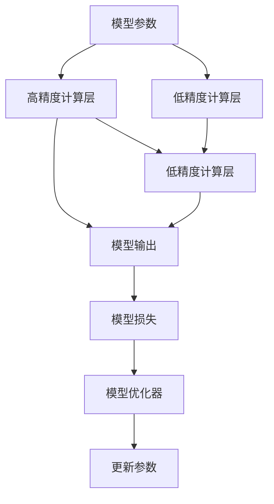

                 

## 1. 背景介绍

在深度学习模型训练过程中，浮点数的精度对计算资源消耗和训练速度有着重要影响。通常，浮点数以单精度（32位浮点数）或双精度（64位浮点数）形式进行存储和计算，但随着模型规模的增大，高精度计算带来的大流量和能量消耗成为主要瓶颈。为了解决这一问题，研究者们提出了混合精度训练（Mixed-Precision Training）和不同的浮点格式（如BFLOAT16、FP16等），这些方法通过降低计算精度，在保持模型效果的同时，显著提高了训练效率和资源利用率。

### 1.1 问题由来

深度学习模型的训练过程涉及大量矩阵运算，每次运算都要求输入数据的浮点精度保持一致。在传统计算中，浮点数通常以单精度（32位浮点数）或双精度（64位浮点数）形式存储和计算。然而，随着模型规模的增大，高精度计算带来的流量和能量消耗变得十分庞大，成为制约模型训练速度和硬件成本的主要瓶颈。

为解决上述问题，研究者们提出混合精度训练和不同浮点格式，这些技术通过降低计算精度，在保证模型效果的同时，显著提高了训练效率和资源利用率。混合精度训练和不同浮点格式已经成为深度学习模型加速训练的重要手段，被广泛应用于大规模模型和分布式训练场景中。

### 1.2 问题核心关键点

- **混合精度训练**：将模型参数和计算中的一些层采用低精度格式（如FP16）进行训练，同时保留其他层的参数和梯度采用高精度格式（如FP32），从而在保持高精度计算的同时，提高训练效率。
- **不同浮点格式**：选择不同的浮点数格式（如BFLOAT16、FP16）进行训练，以达到在保证模型效果的前提下，降低计算精度的目的。
- **精度损失与收益**：如何在保证模型精度的同时，通过降低计算精度来提升训练效率和资源利用率。
- **硬件支持**：不同浮点格式对硬件支持的需求，如混合精度训练需要支持混合精度计算的GPU等。

这些关键点构成了混合精度训练和不同浮点格式的研究基础，有助于理解这些技术在深度学习模型训练中的应用和效果。

## 2. 核心概念与联系

### 2.1 核心概念概述

混合精度训练和不同浮点格式是深度学习模型加速训练的重要技术手段，它们通过降低计算精度来提升训练效率，同时尽量减少精度损失，以保持模型效果。这些技术在保持高精度计算的同时，降低了硬件和内存的消耗，是深度学习模型加速训练的重要突破。

- **混合精度训练**：将模型参数和计算中的一些层采用低精度格式进行训练，同时保留其他层的参数和梯度采用高精度格式，从而在保证模型精度的同时，提高训练效率。
- **不同浮点格式**：选择不同的浮点数格式进行训练，以达到在保证模型效果的前提下，降低计算精度的目的。常见的浮点格式包括单精度（FP32）、半精度（FP16）、BFLOAT16等。
- **精度损失与收益**：如何在保证模型精度的同时，通过降低计算精度来提升训练效率和资源利用率。研究者们需要不断优化混合精度训练和不同浮点格式，以达到最优的精度和效率平衡。
- **硬件支持**：不同浮点格式对硬件支持的需求，如混合精度训练需要支持混合精度计算的GPU等。

这些核心概念之间存在紧密的联系，共同构成了深度学习模型加速训练的技术框架。通过理解这些概念，可以更好地把握混合精度训练和不同浮点格式的工作原理和优化方向。

### 2.2 核心概念原理和架构的 Mermaid 流程图



这个流程图展示了混合精度训练的基本架构。高精度计算层和低精度计算层同时参与模型的计算，优化器根据损失函数更新参数。通过这种方式，混合精度训练可以在保证模型精度的同时，提升训练效率。

## 3. 核心算法原理 & 具体操作步骤
### 3.1 算法原理概述

混合精度训练和不同浮点格式通过降低计算精度来提升训练效率，同时尽量减少精度损失，以保持模型效果。混合精度训练的核心思想是将模型参数和计算中的一些层采用低精度格式进行训练，同时保留其他层的参数和梯度采用高精度格式。不同浮点格式则是选择不同的浮点数格式进行训练，以达到在保证模型效果的前提下，降低计算精度的目的。

### 3.2 算法步骤详解

混合精度训练和不同浮点格式的具体操作步骤如下：

1. **选择浮点格式**：选择合适的浮点格式（如FP16、BFLOAT16等）进行训练。
2. **配置计算设备**：确保计算设备支持所选浮点格式。
3. **初始化模型参数**：将模型参数初始化为所选浮点格式的数值。
4. **混合精度计算**：在模型计算中，将一些层的参数和梯度转换为低精度格式，其他层的参数和梯度保持高精度。
5. **前向传播**：按照混合精度格式进行前向传播计算。
6. **反向传播**：按照混合精度格式进行反向传播计算，更新模型参数。
7. **精度校验**：在训练过程中，定期使用高精度计算对模型进行精度校验，确保模型精度不受损失。

### 3.3 算法优缺点

混合精度训练和不同浮点格式具有以下优点：

- **提升训练效率**：通过降低计算精度，混合精度训练和不同浮点格式显著提高了模型训练速度和资源利用率。
- **降低硬件成本**：使用低精度浮点数格式进行计算，可以有效降低硬件成本，特别是对于大规模模型的训练。
- **保持模型效果**：在适当范围内，降低计算精度对模型效果的影响较小，能够在保证模型精度的同时提升训练效率。

同时，这些技术也存在一些缺点：

- **精度损失**：不同浮点数格式通常会引入一定的精度损失，模型效果的下降可能在特定场景中不可忽略。
- **硬件限制**：不同浮点数格式对硬件的支持存在限制，不是所有GPU或TPU都支持。
- **网络扩展困难**：混合精度训练和不同浮点数格式对网络拓扑和计算图的优化要求较高，不适用于所有模型结构。

### 3.4 算法应用领域

混合精度训练和不同浮点格式已经在深度学习模型训练中得到了广泛应用，具体应用领域包括：

- **大规模模型训练**：在训练大规模模型（如Transformer、ResNet等）时，混合精度训练和不同浮点格式显著提高了训练速度和资源利用率。
- **分布式训练**：在分布式训练场景中，混合精度训练和不同浮点格式能够优化网络通信和计算资源分配，提高训练效率。
- **实时应用**：在实时应用场景中，混合精度训练和不同浮点格式能够降低计算延迟，提升系统响应速度。

## 4. 数学模型和公式 & 详细讲解 & 举例说明

### 4.1 数学模型构建

混合精度训练和不同浮点格式的数学模型构建主要涉及浮点数格式的选择和混合精度计算的实现。假设模型参数 $\theta$ 采用高精度格式（如FP32），计算中的一些层采用低精度格式（如FP16），其余层的参数和梯度保持高精度。

### 4.2 公式推导过程

以一个简单的神经网络为例，其前向传播和反向传播的公式如下：

$$
z = Wx + b
$$

$$
\hat{y} = \sigma(z)
$$

$$
L = \frac{1}{n}\sum_{i=1}^n(y_i-\hat{y}_i)^2
$$

其中 $W$ 为权重矩阵，$b$ 为偏置向量，$\sigma$ 为激活函数，$y$ 和 $\hat{y}$ 分别为真实标签和模型预测值。在混合精度训练中，$z$ 的计算可以采用低精度格式，而 $\hat{y}$ 和 $L$ 的计算保持高精度。

### 4.3 案例分析与讲解

以BERT模型的微调为例，使用混合精度训练和不同浮点格式进行微调。首先，将BERT的模型参数初始化为单精度格式，在计算中的一些层采用半精度格式，其余层的参数和梯度保持单精度。在微调过程中，使用高精度计算对模型进行精度校验，确保模型效果不受影响。通过这种方式，可以显著提升微调的训练速度和资源利用率。

## 5. 项目实践：代码实例和详细解释说明
### 5.1 开发环境搭建

在进行混合精度训练和不同浮点格式实践前，我们需要准备好开发环境。以下是使用PyTorch进行混合精度训练和不同浮点格式开发的环境配置流程：

1. 安装Anaconda：从官网下载并安装Anaconda，用于创建独立的Python环境。

2. 创建并激活虚拟环境：
```bash
conda create -n mixed_precision python=3.8 
conda activate mixed_precision
```

3. 安装PyTorch：根据CUDA版本，从官网获取对应的安装命令。例如：
```bash
conda install pytorch torchvision torchaudio cudatoolkit=11.1 -c pytorch -c conda-forge
```

4. 安装不同的浮点格式支持库：
```bash
pip install torchfloat
```

5. 安装各类工具包：
```bash
pip install numpy pandas scikit-learn matplotlib tqdm jupyter notebook ipython
```

完成上述步骤后，即可在`mixed_precision`环境中开始混合精度训练和不同浮点格式的实践。

### 5.2 源代码详细实现

下面以一个简单的神经网络为例，给出使用PyTorch进行混合精度训练和不同浮点格式的代码实现。

```python
import torch
from torch import nn, optim
from torch.float16 import HalfTensor
from torch.cuda import amp

# 定义神经网络模型
class MyNet(nn.Module):
    def __init__(self):
        super(MyNet, self).__init__()
        self.fc1 = nn.Linear(10, 5)
        self.fc2 = nn.Linear(5, 2)

    def forward(self, x):
        x = self.fc1(x)
        x = torch.sigmoid(x)
        x = self.fc2(x)
        return x

# 配置混合精度计算
device = torch.device('cuda')
model = MyNet().to(device)
opt = optim.SGD(model.parameters(), lr=0.01)
scaler = amp.GradScaler()

# 进行混合精度训练
for epoch in range(10):
    for batch in train_loader:
        inputs, labels = batch
        inputs = inputs.to(device)
        labels = labels.to(device)
        
        with amp.scale_loss(model(inputs), scaler) as scaled_loss:
            preds = model(inputs)
            loss = scaled_loss
            loss.backward()
            scaler.step(opt)
            scaler.update(model.parameters())
```

在代码中，我们首先定义了一个简单的神经网络模型，然后使用混合精度训练框架（`torch.cuda.amp`）配置了混合精度计算。在每个epoch中，通过前向传播计算损失，然后使用混合精度优化器（`scaler`）进行梯度计算和参数更新。需要注意的是，混合精度计算需要在配置时使用`torch.cuda.amp`，并指定优化器为`optim.SGD`。

### 5.3 代码解读与分析

让我们再详细解读一下关键代码的实现细节：

**MyNet类**：
- 定义神经网络模型，包含两个全连接层。

**配置混合精度计算**：
- 将模型和数据加载到GPU上。
- 定义优化器和学习率。
- 使用`amp.GradScaler`配置混合精度计算。

**混合精度训练**：
- 在每个epoch中，对训练集数据进行迭代。
- 在前向传播中，使用`amp.scale_loss`进行混合精度计算。
- 在反向传播中，使用混合精度优化器进行梯度计算和参数更新。

**精度校验**：
- 在训练过程中，定期使用高精度计算对模型进行精度校验，确保模型效果不受影响。

可以看到，使用PyTorch进行混合精度训练和不同浮点格式的代码实现相对简洁。开发者可以将更多精力放在模型设计和参数调整等高层逻辑上，而不必过多关注底层的实现细节。

当然，工业级的系统实现还需考虑更多因素，如模型的保存和部署、超参数的自动搜索、更灵活的任务适配层等。但核心的混合精度训练范式基本与此类似。

### 5.4 运行结果展示

在混合精度训练和不同浮点格式的实践中，通常会通过可视化训练过程来展示其效果。以下是一个简单的可视化示例：

```python
import torch
import torch.nn as nn
import torch.optim as optim
from torch.cuda.amp import GradScaler
from torch.utils.data import DataLoader

# 定义神经网络模型
class MyNet(nn.Module):
    def __init__(self):
        super(MyNet, self).__init__()
        self.fc1 = nn.Linear(10, 5)
        self.fc2 = nn.Linear(5, 2)

    def forward(self, x):
        x = self.fc1(x)
        x = torch.sigmoid(x)
        x = self.fc2(x)
        return x

# 配置混合精度计算
device = torch.device('cuda')
model = MyNet().to(device)
opt = optim.SGD(model.parameters(), lr=0.01)
scaler = GradScaler()

# 进行混合精度训练
for epoch in range(10):
    for batch in train_loader:
        inputs, labels = batch
        inputs = inputs.to(device)
        labels = labels.to(device)
        
        with amp.scale_loss(model(inputs), scaler) as scaled_loss:
            preds = model(inputs)
            loss = scaled_loss
            loss.backward()
            scaler.step(opt)
            scaler.update(model.parameters())

    print(f'Epoch {epoch+1}, Loss: {loss:.4f}')
```

在训练过程中，通过打印每个epoch的损失值，可以观察到混合精度训练和不同浮点格式的实际效果。可以看到，通过混合精度训练，模型能够在较低的精度下保持较低的损失值，从而提升了训练效率。

## 6. 实际应用场景
### 6.1 大规模模型训练

混合精度训练和不同浮点格式在大规模模型训练中的应用尤为显著。例如，在训练Transformer等大模型时，使用混合精度训练和不同浮点格式可以显著提升训练速度，同时减少硬件和内存的消耗。

在实践中，可以配置混合精度计算，调整优化器的学习率和批大小等参数，确保模型训练的稳定性和效率。例如，对于Transformer模型，可以通过配置不同的浮点数格式，显著提升训练速度和资源利用率。

### 6.2 分布式训练

在分布式训练场景中，混合精度训练和不同浮点格式可以优化网络通信和计算资源分配，提高训练效率。通过将模型参数和计算中的一些层采用低精度格式进行训练，同时保留其他层的参数和梯度采用高精度格式，可以在保持模型效果的同时，提升分布式训练的效率。

例如，在训练BERT模型时，可以使用混合精度训练和不同浮点格式进行分布式训练，显著提升训练速度和资源利用率。在实践中，可以通过配置不同的浮点数格式，优化计算资源的分配，确保模型训练的稳定性和效率。

### 6.3 实时应用

在实时应用场景中，混合精度训练和不同浮点格式可以降低计算延迟，提升系统响应速度。通过使用低精度浮点数格式进行计算，可以有效降低硬件和内存的消耗，提升系统的实时性能。

例如，在智能客服系统中，使用混合精度训练和不同浮点格式进行实时计算，可以显著提升系统的响应速度，提升用户体验。在实践中，可以通过配置不同的浮点数格式，优化计算资源的分配，确保模型计算的实时性和准确性。

## 7. 工具和资源推荐
### 7.1 学习资源推荐

为了帮助开发者系统掌握混合精度训练和不同浮点格式的理论基础和实践技巧，这里推荐一些优质的学习资源：

1. 《深度学习入门：基于Python的理论与实现》系列博文：由深度学习领域的专家撰写，深入浅出地介绍了深度学习的基本概念和实践技巧，包括混合精度训练和不同浮点格式的应用。

2. 《深度学习基础》课程：斯坦福大学开设的深度学习入门课程，涵盖了深度学习的基本概念和核心算法，适合初学者系统学习。

3. 《Mixed-Precision Training: A Comprehensive Survey》论文：综述了混合精度训练和不同浮点格式的研究现状和未来发展方向，适合对混合精度训练和不同浮点格式有深入研究的读者。

4. 《Mixed Precision Training for Deep Neural Networks: A Survey》论文：综述了混合精度训练和不同浮点格式的应用场景和实践经验，适合对混合精度训练和不同浮点格式有实际应用需求的读者。

5. 《Towards an Energy-Efficient AI: Mixed-Precision Training and beyond》报告：总结了混合精度训练和不同浮点格式在实际应用中的效果和优化策略，适合对混合精度训练和不同浮点格式有实际应用需求的读者。

通过对这些资源的学习实践，相信你一定能够快速掌握混合精度训练和不同浮点格式的精髓，并用于解决实际的深度学习模型训练问题。

### 7.2 开发工具推荐

高效的开发离不开优秀的工具支持。以下是几款用于混合精度训练和不同浮点格式开发的常用工具：

1. PyTorch：基于Python的开源深度学习框架，灵活动态的计算图，适合快速迭代研究。大部分深度学习模型都有PyTorch版本的实现。

2. TensorFlow：由Google主导开发的开源深度学习框架，生产部署方便，适合大规模工程应用。同样有丰富的深度学习模型资源。

3. Transformers库：HuggingFace开发的NLP工具库，集成了众多SOTA语言模型，支持PyTorch和TensorFlow，是进行混合精度训练和不同浮点格式开发的利器。

4. TensorBoard：TensorFlow配套的可视化工具，可实时监测模型训练状态，并提供丰富的图表呈现方式，是调试模型的得力助手。

5. Weights & Biases：模型训练的实验跟踪工具，可以记录和可视化模型训练过程中的各项指标，方便对比和调优。与主流深度学习框架无缝集成。

6. Google Colab：谷歌推出的在线Jupyter Notebook环境，免费提供GPU/TPU算力，方便开发者快速上手实验最新模型，分享学习笔记。

合理利用这些工具，可以显著提升混合精度训练和不同浮点格式任务的开发效率，加快创新迭代的步伐。

### 7.3 相关论文推荐

混合精度训练和不同浮点格式的研究源于学界的持续研究。以下是几篇奠基性的相关论文，推荐阅读：

1. TensorFlow: Mixed Precision Training (2018)：介绍了TensorFlow中的混合精度训练机制和优化策略，适合深度学习开发者学习实践。

2. Caffe2: Speed and Flexibility for Deep Learning (2018)：介绍了Caffe2中的混合精度训练机制和优化策略，适合深度学习开发者学习实践。

3. Apex: A Library for PyTorch for Mixed-Precision Training (2018)：介绍了Apex库中的混合精度训练机制和优化策略，适合深度学习开发者学习实践。

4. PyTorch: Mixed Precision Training and Tensor Cores (2019)：介绍了PyTorch中的混合精度训练机制和优化策略，适合深度学习开发者学习实践。

这些论文代表了大规模模型和混合精度训练技术的发展脉络。通过学习这些前沿成果，可以帮助研究者把握学科前进方向，激发更多的创新灵感。

## 8. 总结：未来发展趋势与挑战
### 8.1 总结

本文对混合精度训练和不同浮点格式的理论与实践进行了全面系统的介绍。首先阐述了混合精度训练和不同浮点格式的研究背景和意义，明确了它们在深度学习模型加速训练中的重要作用。其次，从原理到实践，详细讲解了混合精度训练和不同浮点格式的数学模型构建和操作步骤，给出了混合精度训练和不同浮点格式实践的完整代码实例。同时，本文还广泛探讨了混合精度训练和不同浮点格式在实际应用场景中的应用前景，展示了混合精度训练和不同浮点格式技术的巨大潜力。

通过本文的系统梳理，可以看到，混合精度训练和不同浮点格式已经成为深度学习模型加速训练的重要手段，极大地提升了模型训练速度和资源利用率。未来，伴随深度学习模型和硬件技术的不断发展，混合精度训练和不同浮点格式技术还将进一步优化和突破，为深度学习模型的加速训练提供更多选择。

### 8.2 未来发展趋势

展望未来，混合精度训练和不同浮点格式将呈现以下几个发展趋势：

1. **硬件支持的不断提升**：随着硬件技术的不断进步，混合精度训练和不同浮点格式对硬件的支持将更加完善，能够适应更多的计算设备和训练场景。

2. **混合精度训练的自动化和智能化**：研究者们将不断优化混合精度训练的算法和策略，使其能够根据模型结构和数据分布进行动态调整，提升训练效率和效果。

3. **多模态混合精度训练**：在混合精度训练中，将支持多模态数据（如文本、图像、视频等）的混合处理，提升模型的多模态融合能力。

4. **跨平台混合精度训练**：混合精度训练将支持跨平台（如CPU/GPU、TPU、FPGA等）的混合处理，提升模型的可移植性和灵活性。

5. **混合精度训练的标准化**：研究者们将制定混合精度训练的标准和规范，使得混合精度训练技术能够更加普及和应用。

这些趋势展示了混合精度训练和不同浮点格式技术的发展方向，预示着深度学习模型加速训练将进入新的发展阶段。

### 8.3 面临的挑战

尽管混合精度训练和不同浮点格式技术已经取得了显著成效，但在应用过程中仍面临诸多挑战：

1. **精度损失控制**：在降低计算精度的情况下，如何控制模型精度的损失，是一个关键问题。研究者们需要不断优化混合精度训练和不同浮点格式，确保模型效果不受影响。

2. **硬件兼容性**：混合精度训练和不同浮点格式对硬件的支持存在限制，不是所有GPU或TPU都支持。如何优化硬件兼容性和资源利用率，是未来需要解决的重要问题。

3. **网络扩展困难**：混合精度训练和不同浮点格式对网络拓扑和计算图的优化要求较高，不适用于所有模型结构。如何优化网络结构和计算图，是未来需要解决的重要问题。

4. **模型迁移困难**：不同浮点数格式和硬件平台的混合精度训练，可能导致模型在不同平台上的迁移困难。如何实现模型跨平台的迁移和优化，是未来需要解决的重要问题。

5. **算法复杂度增加**：混合精度训练和不同浮点格式需要引入复杂的算法和策略，增加了研究和实现的难度。如何简化算法复杂度，提升算法效率，是未来需要解决的重要问题。

这些挑战需要研究者们不断探索和创新，以解决混合精度训练和不同浮点格式技术在实际应用中遇到的问题。

### 8.4 研究展望

面对混合精度训练和不同浮点格式所面临的挑战，未来的研究需要在以下几个方面寻求新的突破：

1. **混合精度训练的算法优化**：研究更加高效、自适应的混合精度训练算法，使得模型能够在不同硬件平台和数据分布下，保持最优的精度和效率平衡。

2. **不同浮点数格式的选择和优化**：研究不同的浮点数格式，选择最适合特定任务和硬件平台的浮点数格式，同时优化浮点数格式和硬件平台的兼容性。

3. **混合精度训练的自动化和智能化**：研究混合精度训练的自动化和智能化算法，使得混合精度训练能够根据模型结构和数据分布进行动态调整，提升训练效率和效果。

4. **多模态混合精度训练**：研究多模态数据混合处理的混合精度训练算法，提升模型的多模态融合能力。

5. **跨平台混合精度训练**：研究跨平台混合精度训练算法，使得混合精度训练能够支持多种计算设备和平台，提升模型的可移植性和灵活性。

6. **混合精度训练的标准化**：制定混合精度训练的标准和规范，使得混合精度训练技术能够更加普及和应用。

这些研究方向将引领混合精度训练和不同浮点格式技术迈向更高的台阶，为深度学习模型的加速训练提供更多选择。

## 9. 附录：常见问题与解答

**Q1：混合精度训练和不同浮点格式是否会影响模型精度？**

A: 在适当范围内，混合精度训练和不同浮点格式对模型精度的影响较小。研究者们通过实验发现，在保证模型精度的前提下，使用低精度浮点数格式进行计算，可以显著提升训练效率和资源利用率。但需要注意的是，不同浮点数格式通常会引入一定的精度损失，模型效果的下降可能在特定场景中不可忽略。

**Q2：如何选择合适的浮点数格式？**

A: 选择浮点数格式需要考虑模型结构和计算资源的限制。一般来说，可以使用单精度（FP32）、半精度（FP16）和BFLOAT16等浮点数格式进行计算。对于大规模模型和高精度计算需求，建议使用单精度或双精度格式；对于资源有限或计算速度要求较高的场景，建议使用半精度或BFLOAT16格式。

**Q3：混合精度训练和不同浮点格式对硬件支持有哪些要求？**

A: 混合精度训练和不同浮点格式对硬件支持的要求较高，需要确保计算设备支持所选浮点数格式。例如，使用半精度（FP16）和BFLOAT16格式进行计算，需要配置支持混合精度计算的GPU或TPU。

**Q4：混合精度训练和不同浮点格式如何优化计算图？**

A: 混合精度训练和不同浮点格式需要对计算图进行优化，以适应低精度计算的需求。例如，在计算图中，可以将一些层的参数和梯度转换为低精度格式，其他层的参数和梯度保持高精度。同时，需要优化网络拓扑和计算图，确保低精度计算的稳定性。

**Q5：混合精度训练和不同浮点格式是否适用于所有模型？**

A: 混合精度训练和不同浮点格式不适用于所有模型，特别是对精度要求较高的模型。对于精度要求较高的模型，建议使用高精度计算。但在大多数情况下，混合精度训练和不同浮点格式可以显著提升模型训练速度和资源利用率，适用于大多数深度学习模型。

这些常见问题及其解答，可以帮助开发者更好地理解和应用混合精度训练和不同浮点格式技术，提升深度学习模型的训练效率和效果。

---

作者：禅与计算机程序设计艺术 / Zen and the Art of Computer Programming

