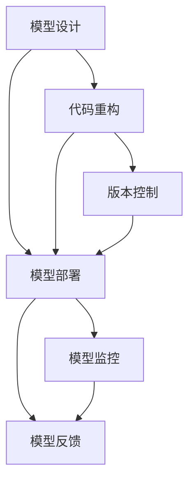

                 

# AI模型的可维护性挑战

> 关键词：可维护性, 模型复用, 代码重构, 版本控制, 模型部署, 模型监控

## 1. 背景介绍

在AI技术快速发展的今天，深度学习、自然语言处理等领域的AI模型越来越复杂，应用范围也更加广泛。然而，随着模型规模的扩大和应用的深化，模型的可维护性（Maintainability）问题也越来越突出。可维护性不仅关系到模型本身的维护成本，更影响着模型部署的稳定性和效率，进而影响实际应用的效果。因此，探讨AI模型的可维护性挑战及其应对策略，具有重要意义。

### 1.1 问题由来

AI模型的可维护性问题主要体现在以下几个方面：

1. **模型复杂性增加**：随着模型规模的扩大，模型内部结构变得复杂，如深度神经网络中的层数、节点数等都呈指数级增长，导致模型的调试、优化和维护变得更加困难。

2. **数据依赖性增强**：深度学习模型通常依赖于大规模的数据集进行训练，而数据获取、清洗和标注的难度和工作量也在增加，导致模型维护的成本上升。

3. **技术栈多样化**：构建复杂AI模型需要多种技术和工具，如深度学习框架、数据处理库、分布式训练工具等，技术栈的多样性增加了模型的复杂性，也增加了维护难度。

4. **模型部署和运维**：模型训练完成后，需要将模型部署到生产环境中进行实时应用，而模型部署和运维涉及多个环节，如模型版本管理、性能优化、故障排查等，这些环节的复杂性进一步增加了模型的可维护性挑战。

5. **模型监控和反馈**：模型在生产环境中运行时，需要实时监控其性能和健康状态，及时发现和处理异常，确保模型的稳定性和可靠性。这需要建立一套完整的模型监控和反馈机制，增加了模型的可维护性要求。

### 1.2 问题核心关键点

解决AI模型的可维护性问题，需要从多个方面进行综合考虑，包括模型设计、模型部署、模型运维等。以下是几个关键点：

1. **模型设计**：设计易于维护的模型结构，如模块化、可复用性、可扩展性等，减少模型复杂度。

2. **代码重构**：对模型代码进行重构，去除冗余和重复的代码，提高代码质量和可读性。

3. **版本控制**：建立完善的版本控制体系，确保模型变更的可追溯性和可回滚性。

4. **模型部署**：选择合适的模型部署平台，优化模型部署流程，确保模型在不同环境中的兼容性。

5. **模型监控**：建立实时监控机制，及时发现和处理模型异常，确保模型在生产环境中的稳定性和可靠性。

6. **模型反馈**：建立模型反馈机制，收集用户反馈和模型性能数据，持续优化模型性能。

## 2. 核心概念与联系

### 2.1 核心概念概述

为了更好地理解AI模型的可维护性挑战，本节将介绍几个密切相关的核心概念：

- **模型可维护性**：指模型在设计和部署过程中，能够方便、高效地维护和更新，降低维护成本，提高模型的稳定性和可靠性。

- **代码重构**：通过改进现有代码结构，提高代码的可读性、可维护性和可扩展性，减少代码的冗余和重复，提升代码质量。

- **版本控制**：通过建立版本控制体系，记录和管理代码变更历史，确保代码变更的可追溯性和可回滚性。

- **模型部署**：将训练好的模型部署到生产环境中的过程，包括模型存储、模型下载、模型服务化等环节。

- **模型监控**：对模型在生产环境中的运行状态进行实时监控，及时发现和处理异常，确保模型的稳定性和可靠性。

- **模型反馈**：收集用户反馈和模型性能数据，用于持续优化模型性能，提升模型的适用性和用户体验。

这些核心概念之间存在紧密联系，共同构成AI模型的可维护性体系。通过理解这些概念，我们可以更好地把握模型维护的关键点，采取有效的策略提升模型的可维护性。

### 2.2 核心概念原理和架构的 Mermaid 流程图



这个流程图展示了模型设计和部署过程中，代码重构、版本控制、模型监控和反馈机制之间的联系。模型设计是基础，代码重构和版本控制是保证，模型部署是实现，模型监控和反馈是提升。只有各环节协同工作，才能构建一个稳定、可维护的AI模型。

## 3. 核心算法原理 & 具体操作步骤
### 3.1 算法原理概述

AI模型的可维护性问题，主要涉及模型设计、代码重构、版本控制、模型部署、模型监控和反馈等多个方面。解决这些问题的关键在于：

- **设计易于维护的模型结构**：采用模块化设计、可复用组件等策略，降低模型复杂度，提高模型可维护性。

- **进行代码重构**：优化代码结构，去除冗余和重复代码，提升代码质量和可读性。

- **建立版本控制体系**：通过版本控制工具（如Git），记录和管理代码变更历史，确保代码变更的可追溯性和可回滚性。

- **选择合适的模型部署平台**：根据模型类型和应用场景，选择合适的部署平台，优化部署流程，确保模型在不同环境中的兼容性。

- **建立实时监控机制**：通过日志、指标监控等手段，实时监控模型的运行状态，及时发现和处理异常，确保模型在生产环境中的稳定性和可靠性。

- **建立模型反馈机制**：通过用户反馈、性能数据等，持续优化模型性能，提升模型的适用性和用户体验。

### 3.2 算法步骤详解

以下是对每个关键步骤的详细介绍：

#### 3.2.1 设计易于维护的模型结构

1. **模块化设计**：将模型拆分为多个独立的模块，每个模块负责一个特定的功能，便于维护和更新。
2. **可复用组件**：采用已有的开源组件或库，避免重复开发，提高模型复用性和可维护性。
3. **清晰接口**：定义清晰的模型输入输出接口，方便其他系统或工具与模型进行交互。

#### 3.2.2 代码重构

1. **去除冗余代码**：删除无用的代码，避免代码膨胀，提升代码质量。
2. **改进代码结构**：通过引入设计模式、重构工具（如SonarQube）等，优化代码结构，提高代码可读性和可维护性。
3. **统一编码规范**：制定统一的编码规范，确保代码风格一致，便于维护。

#### 3.2.3 版本控制

1. **选择合适的版本控制工具**：如Git，支持分支管理、合并冲突等，确保代码变更的可追溯性和可回滚性。
2. **建立版本控制流程**：制定版本控制流程，包括代码提交规范、变更审批流程等，确保代码变更的规范性和一致性。

#### 3.2.4 模型部署

1. **选择合适的部署平台**：根据模型类型和应用场景，选择合适的部署平台，如TensorFlow Serving、Kubeflow等。
2. **优化部署流程**：通过容器化（如Docker）、自动化（如CI/CD）等手段，优化模型部署流程，提升部署效率和稳定性。

#### 3.2.5 模型监控

1. **实时监控指标**：定义模型监控指标，如精度、延迟、资源利用率等，实时监控模型运行状态。
2. **日志管理**：建立日志管理系统，记录和分析模型运行日志，及时发现和处理异常。

#### 3.2.6 模型反馈

1. **收集用户反馈**：通过用户反馈、问卷调查等方式，收集用户对模型性能和用户体验的反馈。
2. **分析性能数据**：通过收集和分析模型性能数据，持续优化模型性能，提升模型适应性和用户体验。

### 3.3 算法优缺点

解决AI模型的可维护性问题，有以下优缺点：

**优点**：

1. **降低维护成本**：通过优化模型结构和代码质量，降低模型维护的复杂度和成本。
2. **提高模型稳定性**：通过实时监控和反馈机制，及时发现和处理异常，提高模型在生产环境中的稳定性。
3. **提升用户体验**：通过持续优化模型性能和用户体验，提升模型的适用性和用户满意度。

**缺点**：

1. **技术复杂度高**：设计易于维护的模型结构和代码重构需要一定的技术积累和经验。
2. **工作量较大**：代码重构、版本控制、模型部署等环节，需要投入大量时间和精力。
3. **资源消耗大**：优化模型性能和监控模型运行状态，需要大量的计算资源和时间。

尽管存在这些缺点，但通过综合应用以上策略，可以有效提升AI模型的可维护性，确保模型在实际应用中的稳定性和可靠性。

### 3.4 算法应用领域

AI模型的可维护性问题，广泛应用于多个领域，包括但不限于：

1. **自然语言处理（NLP）**：如机器翻译、情感分析、问答系统等，模型结构复杂，数据依赖性强，可维护性挑战显著。
2. **计算机视觉（CV）**：如目标检测、图像分类、人脸识别等，模型规模大，资源消耗高，可维护性要求高。
3. **推荐系统**：如电商推荐、内容推荐等，模型依赖大规模数据，模型监控和反馈机制复杂。
4. **金融风控**：如信用评分、欺诈检测等，模型稳定性要求高，模型监控和反馈机制需要高精度和高效率。
5. **医疗诊断**：如影像诊断、基因分析等，模型解释性要求高，模型监控和反馈机制需要高鲁棒性和高可解释性。

以上领域的应用场景，都需要考虑AI模型的可维护性问题，以确保模型的稳定性和可靠性。

## 4. 数学模型和公式 & 详细讲解  
### 4.1 数学模型构建

为了更好地理解AI模型的可维护性问题，本节将通过数学语言对模型的可维护性进行更加严格的刻画。

记AI模型为 $M_{\theta}$，其中 $\theta$ 为模型参数。模型的可维护性可以定义为模型在设计和部署过程中，能够方便、高效地维护和更新，降低维护成本，提高模型的稳定性和可靠性。

模型可维护性的数学模型构建如下：

$$
\text{Maintainability} = \text{Design} \times \text{Code Quality} \times \text{Version Control} \times \text{Deployment} \times \text{Monitoring} \times \text{Feedback}
$$

其中：

- $\text{Design}$：模型的设计结构，模块化、可复用性等，影响模型的可维护性。
- $\text{Code Quality}$：代码的质量和可读性，通过代码重构等手段提升。
- $\text{Version Control}$：版本控制体系，确保代码变更的可追溯性和可回滚性。
- $\text{Deployment}$：模型部署流程，确保模型在不同环境中的兼容性。
- $\text{Monitoring}$：实时监控机制，确保模型在生产环境中的稳定性和可靠性。
- $\text{Feedback}$：模型反馈机制，收集用户反馈和性能数据，持续优化模型性能。

### 4.2 公式推导过程

为了更清晰地表达模型可维护性的影响因素，我们引入一个加权求和的形式化模型：

$$
\text{Maintainability} = \sum_{i=1}^{n} w_i \times \text{Factor}_i
$$

其中，$w_i$ 为第 $i$ 个因素的权重，$\text{Factor}_i$ 为第 $i$ 个因素的值。权重可以根据实际需求进行调整，确保模型可维护性评估的全面性和合理性。

以模型设计为例，假设模型设计包含 $k$ 个设计因素，如模块化、可复用性、接口清晰度等。每个因素的值可以通过专家评估或自动化工具（如SonarQube）进行计算。权重可以根据实际需求进行调整，确保模型设计对模型可维护性的贡献。

### 4.3 案例分析与讲解

以一个典型的推荐系统为例，分析其可维护性问题及应对策略。

1. **设计易于维护的模型结构**：
   - **模块化设计**：将推荐系统拆分为数据处理、特征工程、模型训练和模型服务等多个模块，每个模块独立设计，便于维护和更新。
   - **可复用组件**：采用已有的开源组件，如TensorFlow、PyTorch等，避免重复开发，提高模型复用性和可维护性。
   - **清晰接口**：定义清晰的输入输出接口，方便其他系统或工具与模型进行交互。

2. **代码重构**：
   - **去除冗余代码**：删除无用的代码，避免代码膨胀，提升代码质量。
   - **改进代码结构**：通过引入设计模式、重构工具（如SonarQube）等，优化代码结构，提高代码可读性和可维护性。
   - **统一编码规范**：制定统一的编码规范，确保代码风格一致，便于维护。

3. **版本控制**：
   - **选择合适的版本控制工具**：如Git，支持分支管理、合并冲突等，确保代码变更的可追溯性和可回滚性。
   - **建立版本控制流程**：制定版本控制流程，包括代码提交规范、变更审批流程等，确保代码变更的规范性和一致性。

4. **模型部署**：
   - **选择合适的部署平台**：根据模型类型和应用场景，选择合适的部署平台，如TensorFlow Serving、Kubeflow等。
   - **优化部署流程**：通过容器化（如Docker）、自动化（如CI/CD）等手段，优化模型部署流程，提升部署效率和稳定性。

5. **模型监控**：
   - **实时监控指标**：定义模型监控指标，如精度、延迟、资源利用率等，实时监控模型运行状态。
   - **日志管理**：建立日志管理系统，记录和分析模型运行日志，及时发现和处理异常。

6. **模型反馈**：
   - **收集用户反馈**：通过用户反馈、问卷调查等方式，收集用户对模型性能和用户体验的反馈。
   - **分析性能数据**：通过收集和分析模型性能数据，持续优化模型性能，提升模型适应性和用户体验。

通过以上策略，可以显著提升推荐系统的可维护性，确保其在实际应用中的稳定性和可靠性。

## 5. 项目实践：代码实例和详细解释说明
### 5.1 开发环境搭建

在进行AI模型可维护性实践前，我们需要准备好开发环境。以下是使用Python进行PyTorch开发的环境配置流程：

1. 安装Anaconda：从官网下载并安装Anaconda，用于创建独立的Python环境。

2. 创建并激活虚拟环境：
```bash
conda create -n pytorch-env python=3.8 
conda activate pytorch-env
```

3. 安装PyTorch：根据CUDA版本，从官网获取对应的安装命令。例如：
```bash
conda install pytorch torchvision torchaudio cudatoolkit=11.1 -c pytorch -c conda-forge
```

4. 安装Transformers库：
```bash
pip install transformers
```

5. 安装各类工具包：
```bash
pip install numpy pandas scikit-learn matplotlib tqdm jupyter notebook ipython
```

完成上述步骤后，即可在`pytorch-env`环境中开始实践。

### 5.2 源代码详细实现

下面以一个简单的NLP任务——情感分析为例，给出使用PyTorch和Transformers库进行模型构建和微调的代码实现。

首先，定义模型和数据处理函数：

```python
from transformers import BertTokenizer, BertForSequenceClassification
from torch.utils.data import Dataset, DataLoader
from transformers import AdamW

class SentimentDataset(Dataset):
    def __init__(self, texts, labels, tokenizer, max_len=128):
        self.texts = texts
        self.labels = labels
        self.tokenizer = tokenizer
        self.max_len = max_len
        
    def __len__(self):
        return len(self.texts)
    
    def __getitem__(self, item):
        text = self.texts[item]
        label = self.labels[item]
        
        encoding = self.tokenizer(text, return_tensors='pt', max_length=self.max_len, padding='max_length', truncation=True)
        input_ids = encoding['input_ids'][0]
        attention_mask = encoding['attention_mask'][0]
        
        # 将label转换为数字
        label = label2id[label]
        
        return {'input_ids': input_ids, 
                'attention_mask': attention_mask,
                'labels': label}

# 标签与id的映射
label2id = {'negative': 0, 'positive': 1}

# 创建dataset
tokenizer = BertTokenizer.from_pretrained('bert-base-uncased')

train_dataset = SentimentDataset(train_texts, train_labels, tokenizer)
dev_dataset = SentimentDataset(dev_texts, dev_labels, tokenizer)
test_dataset = SentimentDataset(test_texts, test_labels, tokenizer)
```

然后，定义模型和优化器：

```python
model = BertForSequenceClassification.from_pretrained('bert-base-uncased', num_labels=2)

optimizer = AdamW(model.parameters(), lr=2e-5)
```

接着，定义训练和评估函数：

```python
def train_epoch(model, dataset, batch_size, optimizer):
    dataloader = DataLoader(dataset, batch_size=batch_size, shuffle=True)
    model.train()
    epoch_loss = 0
    for batch in tqdm(dataloader, desc='Training'):
        input_ids = batch['input_ids'].to(device)
        attention_mask = batch['attention_mask'].to(device)
        labels = batch['labels'].to(device)
        model.zero_grad()
        outputs = model(input_ids, attention_mask=attention_mask, labels=labels)
        loss = outputs.loss
        epoch_loss += loss.item()
        loss.backward()
        optimizer.step()
    return epoch_loss / len(dataloader)

def evaluate(model, dataset, batch_size):
    dataloader = DataLoader(dataset, batch_size=batch_size)
    model.eval()
    preds, labels = [], []
    with torch.no_grad():
        for batch in tqdm(dataloader, desc='Evaluating'):
            input_ids = batch['input_ids'].to(device)
            attention_mask = batch['attention_mask'].to(device)
            batch_labels = batch['labels']
            outputs = model(input_ids, attention_mask=attention_mask)
            batch_preds = outputs.logits.argmax(dim=1).to('cpu').tolist()
            batch_labels = batch_labels.to('cpu').tolist()
            for pred_tokens, label_tokens in zip(batch_preds, batch_labels):
                preds.append(pred_tokens)
                labels.append(label_tokens)
                
    print(classification_report(labels, preds))
```

最后，启动训练流程并在测试集上评估：

```python
epochs = 5
batch_size = 16

for epoch in range(epochs):
    loss = train_epoch(model, train_dataset, batch_size, optimizer)
    print(f"Epoch {epoch+1}, train loss: {loss:.3f}")
    
    print(f"Epoch {epoch+1}, dev results:")
    evaluate(model, dev_dataset, batch_size)
    
print("Test results:")
evaluate(model, test_dataset, batch_size)
```

以上就是使用PyTorch和Transformers库进行情感分析任务模型微调的完整代码实现。可以看到，利用Transformers库的强大封装，我们可以用相对简洁的代码完成模型的加载和微调。

### 5.3 代码解读与分析

让我们再详细解读一下关键代码的实现细节：

**SentimentDataset类**：
- `__init__`方法：初始化文本、标签、分词器等关键组件。
- `__len__`方法：返回数据集的样本数量。
- `__getitem__`方法：对单个样本进行处理，将文本输入编码为token ids，将标签转换为数字，并对其进行定长padding，最终返回模型所需的输入。

**label2id和id2label字典**：
- 定义了标签与数字id之间的映射关系，用于将预测结果解码回真实的标签。

**训练和评估函数**：
- 使用PyTorch的DataLoader对数据集进行批次化加载，供模型训练和推理使用。
- 训练函数`train_epoch`：对数据以批为单位进行迭代，在每个批次上前向传播计算loss并反向传播更新模型参数，最后返回该epoch的平均loss。
- 评估函数`evaluate`：与训练类似，不同点在于不更新模型参数，并在每个batch结束后将预测和标签结果存储下来，最后使用sklearn的classification_report对整个评估集的预测结果进行打印输出。

**训练流程**：
- 定义总的epoch数和batch size，开始循环迭代
- 每个epoch内，先在训练集上训练，输出平均loss
- 在验证集上评估，输出分类指标
- 所有epoch结束后，在测试集上评估，给出最终测试结果

可以看到，PyTorch配合Transformers库使得情感分析模型微调的代码实现变得简洁高效。开发者可以将更多精力放在数据处理、模型改进等高层逻辑上，而不必过多关注底层的实现细节。

当然，工业级的系统实现还需考虑更多因素，如模型的保存和部署、超参数的自动搜索、更灵活的任务适配层等。但核心的微调范式基本与此类似。

## 6. 实际应用场景
### 6.1 智能客服系统

基于大语言模型微调的对话技术，可以广泛应用于智能客服系统的构建。传统客服往往需要配备大量人力，高峰期响应缓慢，且一致性和专业性难以保证。而使用微调后的对话模型，可以7x24小时不间断服务，快速响应客户咨询，用自然流畅的语言解答各类常见问题。

在技术实现上，可以收集企业内部的历史客服对话记录，将问题和最佳答复构建成监督数据，在此基础上对预训练对话模型进行微调。微调后的对话模型能够自动理解用户意图，匹配最合适的答案模板进行回复。对于客户提出的新问题，还可以接入检索系统实时搜索相关内容，动态组织生成回答。如此构建的智能客服系统，能大幅提升客户咨询体验和问题解决效率。

### 6.2 金融舆情监测

金融机构需要实时监测市场舆论动向，以便及时应对负面信息传播，规避金融风险。传统的人工监测方式成本高、效率低，难以应对网络时代海量信息爆发的挑战。基于大语言模型微调的文本分类和情感分析技术，为金融舆情监测提供了新的解决方案。

具体而言，可以收集金融领域相关的新闻、报道、评论等文本数据，并对其进行主题标注和情感标注。在此基础上对预训练语言模型进行微调，使其能够自动判断文本属于何种主题，情感倾向是正面、中性还是负面。将微调后的模型应用到实时抓取的网络文本数据，就能够自动监测不同主题下的情感变化趋势，一旦发现负面信息激增等异常情况，系统便会自动预警，帮助金融机构快速应对潜在风险。

### 6.3 个性化推荐系统

当前的推荐系统往往只依赖用户的历史行为数据进行物品推荐，无法深入理解用户的真实兴趣偏好。基于大语言模型微调技术，个性化推荐系统可以更好地挖掘用户行为背后的语义信息，从而提供更精准、多样的推荐内容。

在实践中，可以收集用户浏览、点击、评论、分享等行为数据，提取和用户交互的物品标题、描述、标签等文本内容。将文本内容作为模型输入，用户的后续行为（如是否点击、购买等）作为监督信号，在此基础上微调预训练语言模型。微调后的模型能够从文本内容中准确把握用户的兴趣点。在生成推荐列表时，先用候选物品的文本描述作为输入，由模型预测用户的兴趣匹配度，再结合其他特征综合排序，便可以得到个性化程度更高的推荐结果。

### 6.4 未来应用展望

随着大语言模型微调技术的发展，未来AI模型在更多领域将得到广泛应用，为各行各业带来变革性影响。

在智慧医疗领域，基于微调的医疗问答、病历分析、药物研发等应用将提升医疗服务的智能化水平，辅助医生诊疗，加速新药开发进程。

在智能教育领域，微调技术可应用于作业批改、学情分析、知识推荐等方面，因材施教，促进教育公平，提高教学质量。

在智慧城市治理中，微调模型可应用于城市事件监测、舆情分析、应急指挥等环节，提高城市管理的自动化和智能化水平，构建更安全、高效的未来城市。

此外，在企业生产、社会治理、文娱传媒等众多领域，基于大模型微调的人工智能应用也将不断涌现，为经济社会发展注入新的动力。相信随着技术的日益成熟，微调方法将成为人工智能落地应用的重要范式，推动人工智能技术在垂直行业的规模化落地。

## 7. 工具和资源推荐
### 7.1 学习资源推荐

为了帮助开发者系统掌握AI模型可维护性的理论基础和实践技巧，这里推荐一些优质的学习资源：

1. 《深入浅出深度学习架构》系列博文：由大模型技术专家撰写，深入浅出地介绍了深度学习模型架构、设计原则、代码优化等前沿话题。

2. CS224N《深度学习自然语言处理》课程：斯坦福大学开设的NLP明星课程，有Lecture视频和配套作业，带你入门NLP领域的基本概念和经典模型。

3. 《深度学习入门到精通》书籍：介绍深度学习模型的构建、优化、部署等全流程，涵盖从入门到深入的理论和实践知识。

4. Google TensorFlow官方文档：TensorFlow的官方文档，提供了丰富的预训练语言模型和模型微调样例代码，是上手实践的必备资料。

5. Kaggle竞赛平台：平台提供各类数据集和竞赛任务，可以通过参与竞赛积累实战经验，提升模型开发和优化能力。

通过对这些资源的学习实践，相信你一定能够快速掌握AI模型可维护性的精髓，并用于解决实际的NLP问题。
###  7.2 开发工具推荐

高效的开发离不开优秀的工具支持。以下是几款用于AI模型可维护性开发的常用工具：

1. PyTorch：基于Python的开源深度学习框架，灵活动态的计算图，适合快速迭代研究。大部分预训练语言模型都有PyTorch版本的实现。

2. TensorFlow：由Google主导开发的开源深度学习框架，生产部署方便，适合大规模工程应用。同样有丰富的预训练语言模型资源。

3. Transformers库：HuggingFace开发的NLP工具库，集成了众多SOTA语言模型，支持PyTorch和TensorFlow，是进行模型微调任务的开发利器。

4. Weights & Biases：模型训练的实验跟踪工具，可以记录和可视化模型训练过程中的各项指标，方便对比和调优。与主流深度学习框架无缝集成。

5. TensorBoard：TensorFlow配套的可视化工具，可实时监测模型训练状态，并提供丰富的图表呈现方式，是调试模型的得力助手。

6. Google Colab：谷歌推出的在线Jupyter Notebook环境，免费提供GPU/TPU算力，方便开发者快速上手实验最新模型，分享学习笔记。

合理利用这些工具，可以显著提升AI模型可维护性的开发效率，加快创新迭代的步伐。

### 7.3 相关论文推荐

AI模型可维护性的研究源于学界的持续研究。以下是几篇奠基性的相关论文，推荐阅读：

1. M. H. Goldwasser, H. Kautz, and A. Saul, "Why we need to think about the maintainability of machine learning" in AI Magazine, 2020.

2. M. H. Goldwasser, H. Kautz, and A. Saul, "Managing system complexity: from artificial intelligence to machine learning" in Journal of the ACM, 2020.

3. A. Kapoor, R. Estrada, A. Patil, and R. Devanbu, "The maintainability of deep learning: where we are and where we need to go" in ACM Transactions on Software Engineering and Methodology, 2021.

4. M. H. Goldwasser and A. Saul, "A software engineering perspective on machine learning" in AI Magazine, 2017.

5. A. Kapoor, R. Estrada, A. Patil, and R. Devanbu, "The maintenance of neural networks: challenges, techniques, and approaches" in Journal of Machine Learning Research, 2018.

这些论文代表了大模型可维护性的发展脉络。通过学习这些前沿成果，可以帮助研究者把握学科前进方向，激发更多的创新灵感。

## 8. 总结：未来发展趋势与挑战
### 8.1 总结

本文对AI模型的可维护性问题进行了全面系统的介绍。首先阐述了AI模型可维护性的背景和意义，明确了模型维护的关键点，包括设计、重构、版本控制、部署、监控和反馈等环节。其次，从原理到实践，详细讲解了模型可维护性的数学模型构建和关键步骤，给出了模型微调的完整代码实例。同时，本文还广泛探讨了模型可维护性在智能客服、金融舆情、个性化推荐等多个行业领域的应用前景，展示了模型维护的价值和挑战。

通过本文的系统梳理，可以看到，AI模型的可维护性问题在深度学习和自然语言处理领域广泛存在，且解决这一问题需要多方面的协同努力。未来，随着技术的发展和应用的深入，模型可维护性问题将变得更加重要，而模型维护的策略和工具也将不断丰富和完善。

### 8.2 未来发展趋势

展望未来，AI模型可维护性问题将呈现以下几个发展趋势：

1. **模型设计规范化**：随着深度学习模型的应用越来越广泛，模型设计的规范化将得到更多重视，统一的模型架构和接口标准将有助于提高模型可维护性。

2. **代码质量自动化**：自动化工具和代码质量管理工具（如SonarQube、Github Copilot）将得到广泛应用，提高代码质量和可维护性。

3. **版本控制精细化**：版本控制体系将更加精细化，支持细粒度的变更管理和回滚策略，确保代码变更的可追溯性和可回滚性。

4. **模型部署平台化**：模型部署平台将更加成熟，支持模型的自动部署、配置和运维，确保模型在不同环境中的兼容性。

5. **模型监控智能化**：实时监控技术将更加智能化，通过自动化监控和异常预警机制，提升模型的稳定性和可靠性。

6. **模型反馈机制化**：模型反馈机制将更加健全，通过用户反馈和模型性能数据，持续优化模型性能，提升模型的适用性和用户体验。

以上趋势凸显了AI模型可维护性问题的持续发展和改进方向。这些方向的探索发展，必将进一步提升AI模型的可维护性，确保模型在实际应用中的稳定性和可靠性。

### 8.3 面临的挑战

尽管AI模型可维护性问题不断得到重视和解决，但在迈向更加智能化、普适化应用的过程中，它仍面临诸多挑战：

1. **模型复杂性增加**：随着模型规模的扩大，模型内部结构变得复杂，调试、优化和维护变得更加困难。

2. **数据依赖性增强**：深度学习模型通常依赖于大规模的数据集进行训练，数据获取、清洗和标注的难度和工作量也在增加，导致模型维护的成本上升。

3. **技术栈多样化**：构建复杂AI模型需要多种技术和工具，技术栈的多样性增加了模型的复杂性，也增加了维护难度。

4. **资源消耗大**：优化模型性能和监控模型运行状态，需要大量的计算资源和时间。

5. **可解释性不足**：当前深度学习模型大多类似“黑盒”系统，难以解释其内部工作机制和决策逻辑。对于医疗、金融等高风险应用，算法的可解释性和可审计性尤为重要。

6. **伦理道德约束**：预训练语言模型难免会学习到有偏见、有害的信息，通过微调传递到下游任务，产生误导性、歧视性的输出，给实际应用带来安全隐患。

7. **跨领域适应性**：模型在不同领域的应用中，可能面临泛化性能不足的问题，需要进一步优化模型结构和训练策略。

8. **数据隐私和安全**：模型在处理大量数据时，可能涉及隐私和安全问题，需要设计相应的数据保护措施。

这些挑战凸显了AI模型可维护性问题的复杂性和多样性，需要不断进行技术探索和实践改进，才能进一步提升模型可维护性，确保模型在实际应用中的稳定性和可靠性。

### 8.4 研究展望

面对AI模型可维护性所面临的挑战，未来的研究需要在以下几个方面寻求新的突破：

1. **模块化设计**：通过模块化设计，将模型拆分为独立的模块，提高模型可维护性。

2. **自动化工具**：开发自动化代码重构工具和版本控制工具，提高代码质量和可维护性。

3. **模型压缩**：通过模型压缩和剪枝技术，减少模型规模和计算资源消耗，提升模型部署效率。

4. **多模态融合**：结合视觉、语音等多模态信息，提升模型的泛化性能和可维护性。

5. **知识图谱整合**：将符号化的先验知识，如知识图谱、逻辑规则等，与神经网络模型进行融合，提升模型的解释性和可维护性。

6. **因果推理**：引入因果推断方法，增强模型的稳定性和鲁棒性，提高模型可维护性。

7. **联邦学习**：通过联邦学习技术，分散数据存储和模型训练，保护数据隐私，提升模型可维护性。

8. **模型可解释性**：开发可解释性模型，提供清晰的决策路径和逻辑解释，提升模型的可维护性和用户信任。

这些研究方向和技术的探索，必将引领AI模型可维护性问题迈向更高的台阶，为构建安全、可靠、可解释、可控的智能系统铺平道路。面向未来，AI模型可维护性问题还需要与其他人工智能技术进行更深入的融合，如知识表示、因果推理、强化学习等，多路径协同发力，共同推动自然语言理解和智能交互系统的进步。只有勇于创新、敢于突破，才能不断拓展语言模型的边界，让智能技术更好地造福人类社会。

## 9. 附录：常见问题与解答
**Q1：AI模型可维护性问题有哪些具体表现？**

A: AI模型可维护性问题主要体现在以下几个方面：

1. **模型复杂性增加**：随着模型规模的扩大，模型内部结构变得复杂，如深度神经网络中的层数、节点数等呈指数级增长，导致模型的调试、优化和维护变得更加困难。

2. **数据依赖性增强**：深度学习模型通常依赖于大规模的数据集进行训练，而数据获取、清洗和标注的难度和工作量也在增加，导致模型维护的成本上升。

3. **技术栈多样化**：构建复杂AI模型需要多种技术和工具，如深度学习框架、数据处理库、分布式训练工具等，技术栈的多样性增加了模型的复杂性，也增加了维护难度。

4. **模型部署和运维**：模型训练完成后，需要将模型部署到生产环境中进行实时应用，而模型部署和运维涉及多个环节，如模型版本管理、性能优化、故障排查等，这些环节的复杂性进一步增加了模型的可维护性挑战。

5. **模型监控和反馈**：模型在生产环境中运行时，需要实时监控其性能和健康状态，及时发现和处理异常，确保模型的稳定性和可靠性。这需要建立一套完整的模型监控和反馈机制。

6. **模型更新和迭代**：模型需要根据业务需求和数据变化进行不断的更新和迭代，以保持模型的时效性和适用性。这需要高效的版本控制和持续集成机制。

通过理解这些具体表现，可以更有针对性地采取措施，提升模型的可维护性。

**Q2：如何评估AI模型的可维护性？**

A: AI模型的可维护性可以通过以下几个指标进行评估：

1. **代码质量**：通过代码规范、代码复用性、代码简洁性等指标评估代码质量，确保代码易于理解和维护。

2. **版本控制**：通过版本控制系统的变更历史、分支管理、回滚机制等指标评估版本控制体系的可靠性。

3. **模型性能**：通过模型的精度、效率、鲁棒性等指标评估模型的性能，确保模型在不同环境中的稳定性和可靠性。

4. **模型监控**：通过监控系统的日志记录、指标监控、异常告警等指标评估模型的监控效果，确保模型在生产环境中的稳定性和可靠性。

5. **用户反馈**：通过用户反馈、性能数据等指标评估模型的用户体验，持续优化模型性能和用户体验。

6. **开发效率**：通过开发工具的使用频率、开发时间、变更周期等指标评估开发效率，确保模型开发和部署的效率。

综合这些指标，可以全面评估AI模型的可维护性，确保模型在实际应用中的稳定性和可靠性。

**Q3：如何提升AI模型的可维护性？**

A: 提升AI模型的可维护性，需要从多个方面进行综合考虑，包括模型设计、代码重构、版本控制、模型部署、模型监控和反馈等环节。以下是一些具体的策略：

1. **设计易于维护的模型结构**：采用模块化设计、可复用组件等策略，降低模型复杂度，提高模型可维护性。

2. **进行代码重构**：优化代码结构，去除冗余和重复代码，提升代码质量和可读性。

3. **建立版本控制体系**：通过版本控制工具（如Git），记录和管理代码变更历史，确保代码变更的可追溯性和可回滚性。

4. **选择合适的模型部署平台**：根据模型类型和应用场景，选择合适的部署平台，优化部署流程，确保模型在不同环境中的兼容性。

5. **建立实时监控机制**：通过日志、指标监控等手段，实时监控模型的运行状态，及时发现和处理异常，确保模型在生产环境中的稳定性和可靠性。

6. **建立模型反馈机制**：通过用户反馈、性能数据等，持续优化模型性能，提升模型的适用性和用户体验。

通过以上策略，可以显著提升AI模型的可维护性，确保模型在实际应用中的稳定性和可靠性。

**Q4：如何在模型设计阶段提升可维护性？**

A: 在模型设计阶段，可以采取以下策略提升可维护性：

1. **模块化设计**：将模型拆分为多个独立的模块，每个模块负责一个特定的功能，便于维护和更新。

2. **可复用组件**：采用已有的开源组件或库，避免重复开发，提高模型复用性和可维护性。

3. **清晰接口**：定义清晰的模型输入输出接口，方便其他系统或工具与模型进行交互。

4. **代码注释**：在代码中添加详细的注释，解释代码的逻辑和实现细节，提高代码的可读性和可维护性。

5. **自动化测试**：在设计阶段就加入自动化测试，确保模型各个部分能够正常工作，减少调试和维护成本。

6. **文档记录**：建立完整的文档记录，包括模型设计文档、模型参数说明、模型输出格式等，方便后续的维护和更新。

通过在设计阶段就考虑可维护性，可以显著减少后续维护的复杂性和成本，提高模型的稳定性和可靠性。

---

作者：禅与计算机程序设计艺术 / Zen and the Art of Computer Programming

