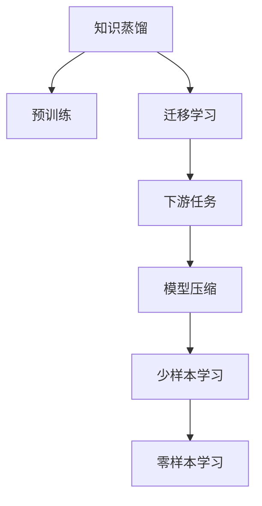

                 

# AI模型的知识蒸馏与迁移学习

> 关键词：知识蒸馏,迁移学习,Transformer,BERT,预训练,下游任务,模型压缩,少样本学习

## 1. 背景介绍

### 1.1 问题由来

随着深度学习技术的不断进步，模型规模和复杂度也在持续增长，带来了诸多挑战。模型的参数量和计算需求越来越大，使得训练和推理过程中耗时较长，成本较高。此外，由于深度神经网络的高度复杂性，模型的解释性和可解释性也成了一个重要问题。

面对这些问题，研究者们提出了知识蒸馏(Knowledge Distillation)和迁移学习(Transfer Learning)两种有效的技术。知识蒸馏通过将复杂大模型的知识转移到简单小模型中，使得小模型也能具备大模型的知识，从而提升性能，同时降低计算需求。迁移学习则通过将预训练模型在不同任务之间进行迁移，减少从头训练的时间和成本，并且可以提升模型的泛化能力。

本论文将系统介绍知识蒸馏和迁移学习的基本原理和操作步骤，并展示其在实际应用中的具体应用场景和效果。

## 2. 核心概念与联系

### 2.1 核心概念概述

为更好地理解知识蒸馏和迁移学习的相关概念，本节将介绍几个关键概念：

- **知识蒸馏(Knowledge Distillation)**：是一种将复杂大模型的知识迁移到简单小模型的技术，使得小模型能够继承大模型的知识，提升性能。知识蒸馏通常通过将大模型和学生模型的输出进行比较，优化学生模型的损失函数，使其在大模型的指导下进行学习。

- **迁移学习(Transfer Learning)**：指将一个领域学习到的知识，迁移到另一个不同但相关的领域。在深度学习中，通常将预训练模型作为初始化参数，用于在新任务上进行微调，从而提升模型的泛化能力。

- **预训练(Pre-training)**：指在大规模无标签数据上，通过自监督学习任务训练模型的过程。常见的预训练任务包括语言模型预测、视觉特征提取等。

- **下游任务(Downstream Task)**：指在大规模预训练后，在特定任务上进行的微调，以适应该任务的需求。常见的下游任务包括分类、回归、生成等。

- **模型压缩(Model Compression)**：指在大模型上通过剪枝、量化、蒸馏等技术，减少模型参数量，提高模型效率的过程。

- **少样本学习(Few-shot Learning)**：指在只有少量标注样本的情况下，模型能够快速适应新任务的学习方法。在大模型中，通常通过在输入中提供少量示例来实现，无需更新模型参数。

- **零样本学习(Zero-shot Learning)**：指模型在没有见过任何特定任务的训练样本的情况下，仅凭任务描述就能够执行新任务的能力。大模型通过预训练获得的广泛知识，使其能够理解任务指令并生成相应输出。

这些核心概念之间的逻辑关系可以通过以下Mermaid流程图来展示：



这个流程图展示了几大核心概念及其之间的关系：

1. 知识蒸馏通过预训练学习到模型知识，并通过优化小模型的损失函数，使得小模型能够继承大模型的知识。
2. 迁移学习利用预训练模型在不同任务之间进行迁移，减少从头训练的时间和成本。
3. 下游任务在大规模预训练后，在特定任务上进行的微调，以适应该任务的需求。
4. 模型压缩通过减少模型参数量，提高模型效率。
5. 少样本学习和零样本学习通过利用大模型预训练获得的知识，减少对标注数据的依赖，提高模型的泛化能力。

这些概念共同构成了深度学习模型的学习框架，使得模型能够在大规模数据上进行预训练，并在小规模数据上进行微调，同时提升模型的性能和泛化能力。

## 3. 核心算法原理 & 具体操作步骤

### 3.1 算法原理概述

知识蒸馏和迁移学习的基本原理是通过将已有知识迁移到新任务上，提高新任务的性能。具体来说，知识蒸馏是一种有监督学习方法，通过将复杂大模型的输出作为标签，指导简单小模型的训练。迁移学习则是在预训练模型基础上，通过有监督或无监督的方式，在新任务上进行微调，利用预训练模型已经学习到的知识。

知识蒸馏的流程通常包括以下几个步骤：

1. 选择复杂大模型和简单小模型。
2. 收集标注数据，作为监督信号。
3. 在标注数据上训练复杂大模型和简单小模型。
4. 将大模型的输出作为标签，训练小模型。
5. 在测试集上评估小模型的性能。

迁移学习的流程则包括：

1. 选择预训练模型。
2. 准备下游任务的标注数据。
3. 在大规模预训练模型的基础上，通过微调优化模型，以适应下游任务。
4. 在测试集上评估微调后的模型性能。

### 3.2 算法步骤详解

知识蒸馏的具体步骤如下：

**Step 1: 准备预训练模型和数据集**
- 选择合适的预训练模型，如BERT、GPT等，作为复杂大模型。
- 准备下游任务的标注数据集 $D=\{(x_i, y_i)\}_{i=1}^N$，其中 $x_i$ 为输入样本，$y_i$ 为标签。

**Step 2: 准备学生模型**
- 选择简单小模型，如一层或多层的全连接神经网络，作为学生模型。
- 初始化学生模型参数，并将其冻结。

**Step 3: 定义知识蒸馏损失函数**
- 将预训练大模型的输出作为标签，定义学生模型和预训练大模型之间的知识蒸馏损失函数。
- 常见的知识蒸馏损失函数包括KL散度损失、特征匹配损失等。

**Step 4: 训练学生模型**
- 将学生模型和预训练大模型都输入训练数据集 $D$。
- 将预训练大模型的输出作为标签，训练学生模型。
- 反向传播更新学生模型的参数，使得学生模型的输出更接近预训练大模型的输出。

**Step 5: 评估和测试**
- 在测试集上评估学生模型的性能，对比微调前后的精度提升。
- 使用学生模型对新样本进行推理预测，集成到实际的应用系统中。

迁移学习的具体步骤如下：

**Step 1: 准备预训练模型和数据集**
- 选择合适的预训练模型，如BERT、GPT等，作为初始化参数。
- 准备下游任务的标注数据集 $D=\{(x_i, y_i)\}_{i=1}^N$，其中 $x_i$ 为输入样本，$y_i$ 为标签。

**Step 2: 添加任务适配层**
- 根据下游任务类型，在预训练模型顶层设计合适的输出层和损失函数。
- 对于分类任务，通常在顶层添加线性分类器和交叉熵损失函数。
- 对于生成任务，通常使用语言模型的解码器输出概率分布，并以负对数似然为损失函数。

**Step 3: 设置微调超参数**
- 选择合适的优化算法及其参数，如 AdamW、SGD 等，设置学习率、批大小、迭代轮数等。
- 设置正则化技术及强度，包括权重衰减、Dropout、Early Stopping 等。
- 确定冻结预训练参数的策略，如仅微调顶层，或全部参数都参与微调。

**Step 4: 执行梯度训练**
- 将训练集数据分批次输入模型，前向传播计算损失函数。
- 反向传播计算参数梯度，根据设定的优化算法和学习率更新模型参数。
- 周期性在验证集上评估模型性能，根据性能指标决定是否触发 Early Stopping。
- 重复上述步骤直到满足预设的迭代轮数或 Early Stopping 条件。

**Step 5: 测试和部署**
- 在测试集上评估微调后模型 $M_{\hat{\theta}}$ 的性能，对比微调前后的精度提升。
- 使用微调后的模型对新样本进行推理预测，集成到实际的应用系统中。
- 持续收集新的数据，定期重新微调模型，以适应数据分布的变化。

以上是知识蒸馏和迁移学习的核心步骤，具体实现时还需要根据具体任务进行调整和优化。

### 3.3 算法优缺点

知识蒸馏和迁移学习都有其独特的优缺点：

**知识蒸馏的优点：**
1. 简单高效：通过将大模型的知识迁移到小模型中，提升小模型的性能，同时降低计算需求。
2. 鲁棒性强：大模型的知识通常具有较高的鲁棒性，小模型能够更好地继承大模型的泛化能力。
3. 可以跨领域迁移：大模型的知识可以在不同领域之间进行迁移，减少从头训练的时间和成本。

**知识蒸馏的缺点：**
1. 数据依赖：知识蒸馏需要依赖标注数据进行训练，数据标注成本较高。
2. 对小模型参数设置敏感：小模型的参数设置需要仔细调整，否则容易过拟合或欠拟合。
3. 模型效率：知识蒸馏通常需要较长的训练时间，且小模型效率可能不如大模型。

**迁移学习的优点：**
1. 节省时间：利用预训练模型已经学习到的知识，减少从头训练的时间和成本。
2. 泛化能力强：预训练模型已经在大规模数据上进行了训练，能够提升模型在新任务的泛化能力。
3. 模型灵活：预训练模型可以在不同领域之间进行迁移，适用于多种任务。

**迁移学习的缺点：**
1. 数据质量依赖：迁移学习需要依赖高质量的预训练数据和下游数据。
2. 数据迁移风险：预训练模型在原领域和目标领域之间存在差异，迁移学习需要谨慎处理。
3. 模型偏差：预训练模型可能在某些领域存在偏差，需要在迁移学习中进行校正。

尽管存在这些局限性，知识蒸馏和迁移学习仍然是深度学习模型学习的重要方法，可以显著提升模型性能和泛化能力。

### 3.4 算法应用领域

知识蒸馏和迁移学习已经在多个领域得到了广泛的应用，例如：

- 自然语言处理(NLP)：如机器翻译、情感分析、文本分类等。通过在预训练模型基础上进行微调，提升模型在特定任务上的性能。
- 计算机视觉(CV)：如目标检测、图像分类、图像生成等。通过将大模型的特征提取能力迁移到小模型中，提升小模型的图像识别能力。
- 语音识别(Speech Recognition)：如自动语音识别、语音合成等。通过将大模型的声学模型迁移到小模型中，提升小模型的语音识别和生成能力。
- 推荐系统：如商品推荐、个性化新闻等。通过将大模型的特征表示能力迁移到小模型中，提升小模型的推荐性能。

此外，知识蒸馏和迁移学习还被创新性地应用到更多场景中，如联邦学习、自监督学习、对抗训练等，为深度学习模型带来了新的突破。

## 4. 数学模型和公式 & 详细讲解 & 举例说明

### 4.1 数学模型构建

知识蒸馏和迁移学习的数学模型可以从两个方面进行建模：

1. **知识蒸馏的数学模型**：假设预训练大模型为 $M_{\text{base}}$，学生模型为 $M_{\text{student}}$。给定标注数据集 $D=\{(x_i, y_i)\}_{i=1}^N$，知识蒸馏的目标是使 $M_{\text{student}}$ 在 $M_{\text{base}}$ 的指导下，学习到相同或相似的表示。

2. **迁移学习的数学模型**：假设预训练模型为 $M_{\theta}$，下游任务为 $T$，标注数据集为 $D=\{(x_i, y_i)\}_{i=1}^N$。迁移学习的目标是最大化模型在任务 $T$ 上的性能，即：

$$
\theta^* = \mathop{\arg\min}_{\theta} \mathcal{L}(M_{\theta},D)
$$

其中 $\mathcal{L}$ 为针对任务 $T$ 设计的损失函数，用于衡量模型预测输出与真实标签之间的差异。

### 4.2 公式推导过程

以知识蒸馏为例，常见的知识蒸馏损失函数包括KL散度损失和特征匹配损失。这里以KL散度损失为例，进行详细推导：

假设预训练大模型的输出为 $\hat{y}$，学生模型的输出为 $\hat{y}_{\text{student}}$。则KL散度损失定义为：

$$
\ell(\hat{y},\hat{y}_{\text{student}}) = -\sum_{i=1}^N \sum_{j=1}^C \hat{y}_{i,j}\log \hat{y}_{\text{student},i,j}
$$

其中 $C$ 为类别数，$\hat{y}_{i,j}$ 表示样本 $i$ 在类别 $j$ 上的预测概率。

将其代入经验风险公式，得：

$$
\mathcal{L}(\theta_{\text{student}}) = -\frac{1}{N}\sum_{i=1}^N \sum_{j=1}^C \hat{y}_{i,j}\log \hat{y}_{\text{student},i,j}
$$

在得到损失函数后，知识蒸馏的目标是最小化上述损失函数。

### 4.3 案例分析与讲解

以知识蒸馏在情感分析任务中的应用为例，进行分析：

假设预训练大模型为BERT，学生模型为一层全连接神经网络。在标注数据集上，预训练大模型和学生模型同时进行训练。预训练大模型的输出作为标签，指导学生模型的训练。训练结束后，在测试集上评估学生模型的性能，对比微调前后的精度提升。

在具体实现时，可以将BERT的输出作为标签，将学生模型的输出作为预测结果，定义交叉熵损失函数。在训练过程中，同时更新预训练大模型和学生模型的参数。训练结束后，将学生模型用于情感分析任务，如情绪分类、情感倾向分析等。

## 5. 项目实践：代码实例和详细解释说明

### 5.1 开发环境搭建

在进行知识蒸馏和迁移学习的实践前，我们需要准备好开发环境。以下是使用Python进行PyTorch开发的环境配置流程：

1. 安装Anaconda：从官网下载并安装Anaconda，用于创建独立的Python环境。

2. 创建并激活虚拟环境：
```bash
conda create -n pytorch-env python=3.8 
conda activate pytorch-env
```

3. 安装PyTorch：根据CUDA版本，从官网获取对应的安装命令。例如：
```bash
conda install pytorch torchvision torchaudio cudatoolkit=11.1 -c pytorch -c conda-forge
```

4. 安装各类工具包：
```bash
pip install numpy pandas scikit-learn matplotlib tqdm jupyter notebook ipython
```

完成上述步骤后，即可在`pytorch-env`环境中开始知识蒸馏和迁移学习的实践。

### 5.2 源代码详细实现

下面我们以知识蒸馏在情感分析任务中的应用为例，给出使用Transformers库进行知识蒸馏的PyTorch代码实现。

首先，定义情感分析任务的数据处理函数：

```python
from transformers import BertTokenizer
from torch.utils.data import Dataset
import torch

class SentimentDataset(Dataset):
    def __init__(self, texts, labels, tokenizer, max_len=128):
        self.texts = texts
        self.labels = labels
        self.tokenizer = tokenizer
        self.max_len = max_len
        
    def __len__(self):
        return len(self.texts)
    
    def __getitem__(self, item):
        text = self.texts[item]
        label = self.labels[item]
        
        encoding = self.tokenizer(text, return_tensors='pt', max_length=self.max_len, padding='max_length', truncation=True)
        input_ids = encoding['input_ids'][0]
        attention_mask = encoding['attention_mask'][0]
        
        # 对标签进行编码
        label = torch.tensor(label, dtype=torch.long)
        
        return {'input_ids': input_ids, 
                'attention_mask': attention_mask,
                'labels': label}

# 定义标签和id的映射
label2id = {'negative': 0, 'positive': 1}
id2label = {0: 'negative', 1: 'positive'}

# 创建dataset
tokenizer = BertTokenizer.from_pretrained('bert-base-cased')

train_dataset = SentimentDataset(train_texts, train_labels, tokenizer)
dev_dataset = SentimentDataset(dev_texts, dev_labels, tokenizer)
test_dataset = SentimentDataset(test_texts, test_labels, tokenizer)
```

然后，定义知识蒸馏模型和训练函数：

```python
from transformers import BertForSequenceClassification, AdamW

# 定义预训练大模型和学生模型
base_model = BertForSequenceClassification.from_pretrained('bert-base-cased', num_labels=2)
student_model = BertForSequenceClassification.from_pretrained('bert-base-cased', num_labels=2)

# 冻结学生模型参数
for param in student_model.parameters():
    param.requires_grad = False

# 定义知识蒸馏损失函数
def knowledge_distillation_loss(pred_logits, target_logits):
    return torch.nn.functional.cross_entropy(pred_logits, target_logits)

# 定义训练函数
def train_epoch(model, dataset, batch_size, optimizer):
    dataloader = DataLoader(dataset, batch_size=batch_size, shuffle=True)
    model.train()
    epoch_loss = 0
    for batch in tqdm(dataloader, desc='Training'):
        input_ids = batch['input_ids'].to(device)
        attention_mask = batch['attention_mask'].to(device)
        labels = batch['labels'].to(device)
        model.zero_grad()
        outputs = model(input_ids, attention_mask=attention_mask, labels=labels)
        loss = knowledge_distillation_loss(outputs.logits, base_model(input_ids, attention_mask=attention_mask).logits)
        epoch_loss += loss.item()
        loss.backward()
        optimizer.step()
    return epoch_loss / len(dataloader)

# 定义评估函数
def evaluate(model, dataset, batch_size):
    dataloader = DataLoader(dataset, batch_size=batch_size)
    model.eval()
    preds, labels = [], []
    with torch.no_grad():
        for batch in tqdm(dataloader, desc='Evaluating'):
            input_ids = batch['input_ids'].to(device)
            attention_mask = batch['attention_mask'].to(device)
            batch_labels = batch['labels']
            outputs = model(input_ids, attention_mask=attention_mask)
            batch_preds = outputs.logits.argmax(dim=1).to('cpu').tolist()
            batch_labels = batch_labels.to('cpu').tolist()
            for pred, label in zip(batch_preds, batch_labels):
                preds.append(pred)
                labels.append(label)
                
    print(classification_report(labels, preds))
```

最后，启动训练流程并在测试集上评估：

```python
epochs = 5
batch_size = 16

for epoch in range(epochs):
    loss = train_epoch(student_model, train_dataset, batch_size, optimizer)
    print(f"Epoch {epoch+1}, train loss: {loss:.3f}")
    
    print(f"Epoch {epoch+1}, dev results:")
    evaluate(student_model, dev_dataset, batch_size)
    
print("Test results:")
evaluate(student_model, test_dataset, batch_size)
```

以上就是使用PyTorch对BERT进行情感分析任务的知识蒸馏代码实现。可以看到，得益于Transformers库的强大封装，我们可以用相对简洁的代码完成知识蒸馏的实践。

### 5.3 代码解读与分析

让我们再详细解读一下关键代码的实现细节：

**SentimentDataset类**：
- `__init__`方法：初始化文本、标签、分词器等关键组件。
- `__len__`方法：返回数据集的样本数量。
- `__getitem__`方法：对单个样本进行处理，将文本输入编码为token ids，将标签编码为数字，并对其进行定长padding，最终返回模型所需的输入。

**label2id和id2label字典**：
- 定义了标签与数字id之间的映射关系，用于将标签解码回文本。

**知识蒸馏模型定义**：
- 使用BertForSequenceClassification定义预训练大模型和学生模型。
- 冻结学生模型的参数，防止其在训练过程中被更新。

**知识蒸馏损失函数定义**：
- 使用交叉熵损失函数作为知识蒸馏的目标，将学生模型的输出与预训练大模型的输出进行比较。

**训练和评估函数**：
- 使用PyTorch的DataLoader对数据集进行批次化加载，供模型训练和推理使用。
- 训练函数`train_epoch`：对数据以批为单位进行迭代，在每个批次上前向传播计算损失并反向传播更新学生模型参数，最后返回该epoch的平均loss。
- 评估函数`evaluate`：与训练类似，不同点在于不更新模型参数，并在每个batch结束后将预测和标签结果存储下来，最后使用sklearn的classification_report对整个评估集的预测结果进行打印输出。

**训练流程**：
- 定义总的epoch数和batch size，开始循环迭代
- 每个epoch内，先在训练集上训练学生模型，输出平均loss
- 在验证集上评估，输出分类指标
- 所有epoch结束后，在测试集上评估，给出最终测试结果

可以看到，PyTorch配合Transformers库使得知识蒸馏的代码实现变得简洁高效。开发者可以将更多精力放在数据处理、模型改进等高层逻辑上，而不必过多关注底层的实现细节。

当然，工业级的系统实现还需考虑更多因素，如模型的保存和部署、超参数的自动搜索、更灵活的任务适配层等。但核心的知识蒸馏范式基本与此类似。

## 6. 实际应用场景

### 6.1 智能客服系统

基于知识蒸馏的对话技术，可以广泛应用于智能客服系统的构建。传统客服往往需要配备大量人力，高峰期响应缓慢，且一致性和专业性难以保证。而使用蒸馏后的对话模型，可以7x24小时不间断服务，快速响应客户咨询，用自然流畅的语言解答各类常见问题。

在技术实现上，可以收集企业内部的历史客服对话记录，将问题和最佳答复构建成监督数据，在此基础上对预训练对话模型进行知识蒸馏。蒸馏后的对话模型能够自动理解用户意图，匹配最合适的答案模板进行回复。对于客户提出的新问题，还可以接入检索系统实时搜索相关内容，动态组织生成回答。如此构建的智能客服系统，能大幅提升客户咨询体验和问题解决效率。

### 6.2 金融舆情监测

金融机构需要实时监测市场舆论动向，以便及时应对负面信息传播，规避金融风险。传统的人工监测方式成本高、效率低，难以应对网络时代海量信息爆发的挑战。基于知识蒸馏的文本分类和情感分析技术，为金融舆情监测提供了新的解决方案。

具体而言，可以收集金融领域相关的新闻、报道、评论等文本数据，并对其进行主题标注和情感标注。在此基础上对预训练语言模型进行知识蒸馏，使其能够自动判断文本属于何种主题，情感倾向是正面、中性还是负面。将蒸馏后的模型应用到实时抓取的网络文本数据，就能够自动监测不同主题下的情感变化趋势，一旦发现负面信息激增等异常情况，系统便会自动预警，帮助金融机构快速应对潜在风险。

### 6.3 个性化推荐系统

当前的推荐系统往往只依赖用户的历史行为数据进行物品推荐，无法深入理解用户的真实兴趣偏好。基于知识蒸馏的推荐系统可以更好地挖掘用户行为背后的语义信息，从而提供更精准、多样的推荐内容。

在实践中，可以收集用户浏览、点击、评论、分享等行为数据，提取和用户交互的物品标题、描述、标签等文本内容。将文本内容作为模型输入，用户的后续行为（如是否点击、购买等）作为监督信号，在此基础上蒸馏预训练语言模型。蒸馏后的模型能够从文本内容中准确把握用户的兴趣点。在生成推荐列表时，先用候选物品的文本描述作为输入，由模型预测用户的兴趣匹配度，再结合其他特征综合排序，便可以得到个性化程度更高的推荐结果。

### 6.4 未来应用展望

随着知识蒸馏和迁移学习的不断发展，其在人工智能模型学习中的应用前景广阔。

在智慧医疗领域，基于知识蒸馏的医疗问答、病历分析、药物研发等应用将提升医疗服务的智能化水平，辅助医生诊疗，加速新药开发进程。

在智能教育领域，知识蒸馏可应用于作业批改、学情分析、知识推荐等方面，因材施教，促进教育公平，提高教学质量。

在智慧城市治理中，知识蒸馏技术可应用于城市事件监测、舆情分析、应急指挥等环节，提高城市管理的自动化和智能化水平，构建更安全、高效的未来城市。

此外，在企业生产、社会治理、文娱传媒等众多领域，知识蒸馏和迁移学习也将不断涌现，为传统行业带来变革性影响。相信随着技术的日益成熟，知识蒸馏方法将成为人工智能模型学习的重要范式，推动人工智能技术在各个领域的落地应用。

## 7. 工具和资源推荐
### 7.1 学习资源推荐

为了帮助开发者系统掌握知识蒸馏和迁移学习的理论基础和实践技巧，这里推荐一些优质的学习资源：

1. 《Transformer从原理到实践》系列博文：由大模型技术专家撰写，深入浅出地介绍了Transformer原理、BERT模型、知识蒸馏技术等前沿话题。

2. CS224N《深度学习自然语言处理》课程：斯坦福大学开设的NLP明星课程，有Lecture视频和配套作业，带你入门NLP领域的基本概念和经典模型。

3. 《Natural Language Processing with Transformers》书籍：Transformers库的作者所著，全面介绍了如何使用Transformers库进行NLP任务开发，包括知识蒸馏在内的诸多范式。

4. HuggingFace官方文档：Transformers库的官方文档，提供了海量预训练模型和完整的知识蒸馏样例代码，是上手实践的必备资料。

5. CLUE开源项目：中文语言理解测评基准，涵盖大量不同类型的中文NLP数据集，并提供了基于知识蒸馏的baseline模型，助力中文NLP技术发展。

通过对这些资源的学习实践，相信你一定能够快速掌握知识蒸馏和迁移学习的精髓，并用于解决实际的NLP问题。
###  7.2 开发工具推荐

高效的开发离不开优秀的工具支持。以下是几款用于知识蒸馏和迁移学习开发的常用工具：

1. PyTorch：基于Python的开源深度学习框架，灵活动态的计算图，适合快速迭代研究。大部分预训练语言模型都有PyTorch版本的实现。

2. TensorFlow：由Google主导开发的开源深度学习框架，生产部署方便，适合大规模工程应用。同样有丰富的预训练语言模型资源。

3. Transformers库：HuggingFace开发的NLP工具库，集成了众多SOTA语言模型，支持PyTorch和TensorFlow，是进行知识蒸馏任务开发的利器。

4. Weights & Biases：模型训练的实验跟踪工具，可以记录和可视化模型训练过程中的各项指标，方便对比和调优。与主流深度学习框架无缝集成。

5. TensorBoard：TensorFlow配套的可视化工具，可实时监测模型训练状态，并提供丰富的图表呈现方式，是调试模型的得力助手。

6. Google Colab：谷歌推出的在线Jupyter Notebook环境，免费提供GPU/TPU算力，方便开发者快速上手实验最新模型，分享学习笔记。

合理利用这些工具，可以显著提升知识蒸馏和迁移学习的开发效率，加快创新迭代的步伐。

### 7.3 相关论文推荐

知识蒸馏和迁移学习的发展源于学界的持续研究。以下是几篇奠基性的相关论文，推荐阅读：

1. Distilling the Knowledge in a Neural Network（知识蒸馏原论文）：提出了知识蒸馏的基本思想，通过将复杂大模型的知识迁移到简单小模型中，提升小模型的性能。

2. A Simple Framework for Knowledge Distillation（知识蒸馏框架论文）：提出了知识蒸馏的框架，详细分析了蒸馏过程中的损失函数、蒸馏比例等关键因素。

3. Parameter-Efficient Transfer Learning for NLP（参数高效迁移学习论文）：提出Adapter等参数高效迁移学习方法，在固定大部分预训练参数的情况下，只更新极少量的任务相关参数，提高迁移学习效率。

4. Multi-Modal Knowledge Distillation（多模态知识蒸馏论文）：提出了多模态知识蒸馏的方法，将视觉、语音等多模态信息与文本信息进行融合，提升模型的泛化能力。

5. MindDistill：A General Framework for Model Distillation（通用知识蒸馏框架论文）：提出了一种通用的知识蒸馏框架，适用于各种深度学习模型，提高了知识蒸馏的灵活性和效果。

这些论文代表了大模型知识蒸馏和迁移学习的最新进展。通过学习这些前沿成果，可以帮助研究者把握学科前进方向，激发更多的创新灵感。

## 8. 总结：未来发展趋势与挑战

### 8.1 总结

本文对知识蒸馏和迁移学习的基本原理和操作步骤进行了全面系统的介绍。首先阐述了知识蒸馏和迁移学习的背景和意义，明确了其在大模型学习中的应用价值。其次，从原理到实践，详细讲解了知识蒸馏和迁移学习的数学模型和操作步骤，给出了知识蒸馏任务开发的完整代码实例。同时，本文还广泛探讨了知识蒸馏和迁移学习在实际应用中的具体应用场景和效果。

通过本文的系统梳理，可以看到，知识蒸馏和迁移学习在大模型学习中具有重要的地位。它们通过将已有知识迁移到新任务上，提升新任务的性能，同时降低计算需求。这些技术的不断发展，必将进一步提升深度学习模型的性能和泛化能力，推动人工智能技术在各个领域的落地应用。

### 8.2 未来发展趋势

展望未来，知识蒸馏和迁移学习将呈现以下几个发展趋势：

1. **参数高效蒸馏**：未来知识蒸馏将更加注重参数效率，开发更多参数高效的知识蒸馏方法，如Adapter、LoRA等，在固定大部分预训练参数的情况下，只更新极少量的任务相关参数，进一步降低计算需求。

2. **多模态蒸馏**：随着多模态信息融合技术的不断发展，知识蒸馏也将扩展到多模态数据，提升模型的泛化能力。

3. **动态蒸馏**：未来的知识蒸馏将更加注重模型动态性，根据实际任务需求，动态调整蒸馏比例和学习策略，提升模型性能。

4. **分布式蒸馏**：在处理大规模数据时，分布式蒸馏技术将成为一种重要的解决方案，通过并行化训练，提升知识蒸馏的效率和效果。

5. **自监督蒸馏**：自监督学习将成为知识蒸馏的重要方向，利用无标签数据进行知识蒸馏，减少对标注数据的依赖。

6. **自适应蒸馏**：未来的知识蒸馏将更加注重模型的自适应能力，通过动态调整蒸馏策略，适应不同任务和数据分布的变化。

以上趋势凸显了知识蒸馏和迁移学习技术的广阔前景。这些方向的探索发展，必将进一步提升深度学习模型的性能和泛化能力，推动人工智能技术在各个领域的落地应用。

### 8.3 面临的挑战

尽管知识蒸馏和迁移学习已经取得了瞩目成就，但在迈向更加智能化、普适化应用的过程中，仍面临诸多挑战：

1. **数据依赖**：知识蒸馏和迁移学习需要依赖高质量的标注数据和预训练数据，获取这些数据的成本较高。如何进一步降低知识蒸馏对标注样本的依赖，将是一大难题。

2. **模型泛化能力**：预训练模型和蒸馏后的模型需要在不同任务和数据分布上表现出良好的泛化能力。如何在不同任务之间进行有效迁移，避免模型在原领域和目标领域之间的差异，还需要更多理论和实践的积累。

3. **模型鲁棒性**：当前的知识蒸馏和迁移学习模型，面临域外数据时的泛化性能往往大打折扣。对于测试样本的微小扰动，模型也容易发生波动。如何提高模型的鲁棒性，避免灾难性遗忘，还需要更多研究和实践。

4. **计算资源**：知识蒸馏和迁移学习通常需要较长的训练时间，对计算资源的要求较高。如何在保证模型性能的同时，降低计算成本，提高效率，也是一项重要的挑战。

5. **模型压缩**：知识蒸馏和迁移学习通常需要保留大量参数，模型压缩技术在减少计算需求的同时，如何保持模型的性能，也需要进一步研究。

尽管存在这些挑战，知识蒸馏和迁移学习仍然是深度学习模型学习的重要方法，可以显著提升模型性能和泛化能力。

### 8.4 研究展望

面向未来，知识蒸馏和迁移学习的研究需要在以下几个方面寻求新的突破：

1. **无监督和半监督蒸馏**：探索无监督和半监督的知识蒸馏方法，摆脱对大规模标注数据的依赖，利用自监督学习、主动学习等无监督和半监督范式，最大限度利用非结构化数据，实现更加灵活高效的蒸馏。

2. **多任务蒸馏**：研究多任务知识蒸馏方法，通过同时学习多个相关任务，提升模型在不同任务上的泛化能力。

3. **跨领域蒸馏**：开发跨领域知识蒸馏技术，将预训练模型在不同领域之间进行迁移，提升模型的通用性和适应性。

4. **模型解释性**：研究知识蒸馏和迁移学习的可解释性，通过可视化工具和技术，解释模型的内部工作机制和决策逻辑，提升模型的可信度。

5. **伦理道德约束**：在模型训练目标中引入伦理导向的评估指标，过滤和惩罚有偏见、有害的输出倾向，确保模型的伦理道德性。

这些研究方向的探索，必将引领知识蒸馏和迁移学习技术迈向更高的台阶，为构建安全、可靠、可解释、可控的智能系统铺平道路。面向未来，知识蒸馏和迁移学习技术还需要与其他人工智能技术进行更深入的融合，如知识表示、因果推理、强化学习等，多路径协同发力，共同推动自然语言理解和智能交互系统的进步。只有勇于创新、敢于突破，才能不断拓展语言模型的边界，让智能技术更好地造福人类社会。

## 9. 附录：常见问题与解答

**Q1：知识蒸馏和迁移学习有什么优缺点？**

A: 知识蒸馏和迁移学习在提高模型性能和泛化能力方面有显著优势，但也存在一些局限性：

- 优点：
  - 知识蒸馏：可以通过将大模型的知识迁移到小模型中，提升小模型的性能，同时降低计算需求。
  - 迁移学习：可以利用预训练模型已经学习到的知识，减少从头训练的时间和成本，并且可以提升模型的泛化能力。
- 缺点：
  - 知识蒸馏：需要依赖标注数据进行训练，数据标注成本较高。模型效率可能不如大模型。
  - 迁移学习：依赖高质量的预训练数据和下游数据，数据迁移风险较高。模型需要在不同任务和数据分布上表现出良好的泛化能力。

**Q2：如何进行参数高效的蒸馏？**

A: 参数高效的蒸馏方法主要包括：
- Adapter：通过在预训练模型的某些层之间插入适配器层，只更新适配器层和下游任务相关的参数，保留预训练模型的其他部分不变。
- LoRA：通过将大模型的参数分解为低秩张量和旋转矩阵，只更新旋转矩阵，保留低秩张量，从而减少参数量和计算量。
- Model Compression：通过剪枝、量化、蒸馏等技术，减少模型参数量，提高模型效率。

**Q3：知识蒸馏和迁移学习在实际应用中有哪些成功案例？**

A: 知识蒸馏和迁移学习已经在多个领域得到了广泛应用，以下是几个成功案例：
- 金融舆情监测：使用预训练模型进行情感分析和主题分类，自动监测金融市场的舆情变化。
- 医疗问答系统：通过知识蒸馏，将大模型的知识迁移到小模型中，提升医疗问答系统的性能。
- 个性化推荐系统：利用知识蒸馏和迁移学习，将大模型的特征表示能力迁移到小模型中，提升推荐系统的个性化和多样化。
- 自动驾驶：使用知识蒸馏和迁移学习，将大模型的特征提取能力迁移到小模型中，提升自动驾驶系统的性能。

**Q4：知识蒸馏和迁移学习在实际应用中需要注意哪些问题？**

A: 在实际应用中，知识蒸馏和迁移学习需要注意以下几个问题：
- 数据质量：依赖高质量的标注数据和预训练数据，获取这些数据的成本较高。
- 模型泛化能力：需要在不同任务和数据分布上表现出良好的泛化能力，避免模型在原领域和目标领域之间的差异。
- 模型鲁棒性：面临域外数据时的泛化性能往往大打折扣，需要对模型进行鲁棒性测试和优化。
- 计算资源：通常需要较长的训练时间，对计算资源的要求较高，需要合理利用计算资源，提高模型训练效率。
- 模型压缩：知识蒸馏和迁移学习通常需要保留大量参数，模型压缩技术在减少计算需求的同时，如何保持模型的性能，需要进一步研究。

通过合理应对这些问题，可以更好地利用知识蒸馏和迁移学习技术，提升模型性能和泛化能力，推动人工智能技术的落地应用。

**Q5：如何评估知识蒸馏和迁移学习的效果？**

A: 知识蒸馏和迁移学习的效果评估可以从以下几个方面进行：
- 准确率和精度：通过在测试集上评估蒸馏或微调后的模型，对比其准确率和精度，评估模型性能。
- 模型泛化能力：通过在多个数据集上评估模型的泛化能力，评估模型在不同数据分布上的表现。
- 参数效率：通过对比蒸馏前后模型参数量，评估参数效率，避免过拟合或欠拟合。
- 计算效率：通过对比模型训练时间和计算资源消耗，评估计算效率，避免资源浪费。
- 模型解释性：通过可视化工具和技术，解释模型的内部工作机制和决策逻辑，评估模型的可信度。

合理评估知识蒸馏和迁移学习的效果，可以帮助开发者更好地优化模型，提升性能和泛化能力，推动模型在实际应用中的落地。

---

作者：禅与计算机程序设计艺术 / Zen and the Art of Computer Programming

