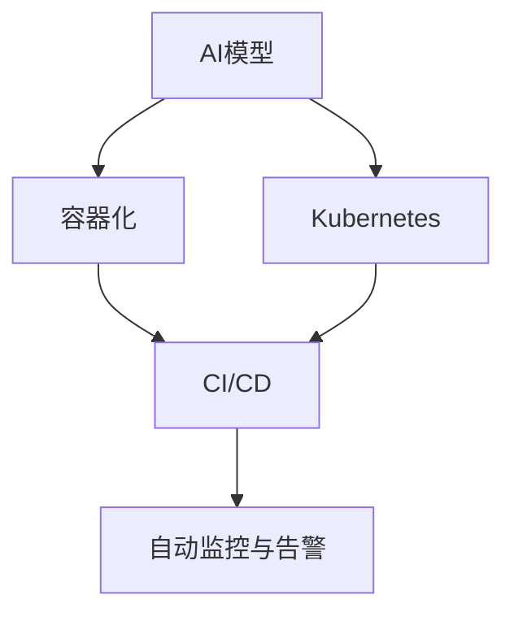

                 

# AI模型的自动化部署：Lepton AI的DevOps实践

> 关键词：AI模型部署, DevOps, 容器化, Kubernetes, 持续集成, 持续部署

## 1. 背景介绍

### 1.1 问题由来
随着人工智能(AI)技术在各行业的应用日益深入，企业对于AI模型的需求也随之增加。然而，AI模型的开发、训练和部署是一个复杂且耗时的过程，需要耗费大量的时间和人力资源。同时，AI模型部署后需要定期维护和更新，以适应业务需求的变化。

DevOps（Development & Operations）是一种强调自动化、持续集成和持续部署的开发模式，旨在将软件开发和运维流程进行整合，提高交付速度和质量。引入DevOps理念到AI模型的部署中，可以有效提升AI模型的开发效率和部署可靠性，减少人工干预和手动操作，加速AI技术的商业化应用。

### 1.2 问题核心关键点
AI模型的自动化部署包括以下关键点：
1. **容器化技术**：通过将AI模型打包成容器，可以在不同环境中稳定运行。
2. **Kubernetes**：通过容器编排工具Kubernetes，实现AI模型的自动化部署和扩展。
3. **持续集成/持续部署(CI/CD)**：通过自动化测试和部署流程，加速AI模型的迭代和上线。
4. **自动监控与告警**：实时监控AI模型运行状态，及时发现和处理异常。

本文将从核心概念、算法原理、具体操作步骤、项目实践和应用场景等方面，系统介绍Lepton AI在AI模型自动化部署中应用的DevOps实践。

## 2. 核心概念与联系

### 2.1 核心概念概述

为了更好地理解AI模型的自动化部署，本节将介绍几个密切相关的核心概念：

- **AI模型**：基于深度学习、机器学习等技术，能够执行特定任务的软件模型。
- **容器化**：将应用程序及其依赖打包到一个轻量级的、可移植的容器中，实现一致的运行环境。
- **Kubernetes**：一个开源的容器编排系统，通过其API实现容器的自动化部署、扩展和管理。
- **CI/CD**：持续集成/持续部署的开发模式，通过自动化流程，加速软件交付。
- **自动监控与告警**：通过实时监控工具和告警机制，及时发现和处理系统异常。

这些核心概念之间的逻辑关系可以通过以下Mermaid流程图来展示：



这个流程图展示了几者之间的联系：

1. AI模型通过容器化技术实现一致的运行环境，方便部署。
2. Kubernetes提供容器编排和管理，实现自动化的部署和扩展。
3. CI/CD加速AI模型的持续集成和持续部署，提升开发效率。
4. 自动监控与告警确保AI模型在运行中的稳定性，及时发现和处理异常。

这些概念共同构成了AI模型自动化部署的基础框架，使得AI模型的开发、训练、部署和维护更加高效和可靠。

## 3. 核心算法原理 & 具体操作步骤

### 3.1 算法原理概述

AI模型的自动化部署主要基于DevOps的理念和技术栈，通过自动化流程和工具实现。其核心思想是：将AI模型的开发、训练、部署和维护过程，通过代码化、自动化和持续化手段，提高交付速度和质量，减少人为干预和操作风险。

### 3.2 算法步骤详解

AI模型的自动化部署主要包括以下几个关键步骤：

**Step 1: 准备AI模型和开发环境**
- 选择合适的深度学习框架（如TensorFlow、PyTorch等）进行AI模型的开发和训练。
- 准备开发所需的计算资源（如GPU、TPU等），搭建开发环境。

**Step 2: 实现模型容器化**
- 将训练好的AI模型及其依赖（如库文件、数据集等）打包到Docker容器中。
- 编写Dockerfile文件，指定容器构建和运行的环境。
- 通过Docker命令构建和运行模型容器。

**Step 3: 实现Kubernetes集群**
- 搭建Kubernetes集群，安装和管理Kubernetes服务。
- 配置Kubernetes的资源管理，如CPU、内存、存储等。
- 通过Kubernetes的API实现容器的自动化部署和管理。

**Step 4: 实现CI/CD流水线**
- 配置持续集成系统，如Jenkins、GitLab CI等，自动化地执行模型训练、测试和部署。
- 配置持续部署系统，自动将训练好的模型容器部署到Kubernetes集群中。
- 配置自动化测试工具，确保模型在部署前后的一致性。

**Step 5: 实现自动监控与告警**
- 配置监控工具，如Prometheus、Grafana等，实时监控模型运行状态。
- 配置告警机制，如Nagios、PagerDuty等，及时发现和处理异常。

**Step 6: 持续集成与持续部署**
- 通过CI/CD流水线，自动化地执行模型开发、训练、测试和部署，加速模型迭代和上线。
- 配置自动化测试和部署流程，确保每次上线都是经过充分验证的。

以上是AI模型自动化部署的一般流程。在实际应用中，还需要针对具体任务和场景，对流程的各个环节进行优化设计，以进一步提升部署效率和模型性能。

### 3.3 算法优缺点

AI模型的自动化部署具有以下优点：
1. 提高开发效率：通过自动化流程，减少了人工干预和手动操作，加速模型迭代和上线。
2. 增强部署可靠性：通过Kubernetes集群和容器化技术，实现一致的运行环境和稳定的部署管理。
3. 提升模型性能：通过CI/CD流水线和持续集成，加速模型训练和优化，提升模型性能。
4. 减少运维成本：通过自动监控与告警，实时发现和处理异常，降低运维成本。

同时，该方法也存在一定的局限性：
1. 对技术要求高：需要具备容器化、Kubernetes、CI/CD等相关技术能力。
2. 初始投资大：需要搭建和维护Kubernetes集群，配置监控告警系统。
3. 复杂度较高：需要设计和管理复杂的自动化流程，有一定的学习成本。

尽管存在这些局限性，但就目前而言，AI模型的自动化部署仍是主流的实践方式，特别是在大规模生产环境中。未来相关研究的重点在于如何进一步降低部署复杂度，提高易用性和灵活性，同时兼顾可靠性和性能等因素。

### 3.4 算法应用领域

AI模型的自动化部署在多个领域已经得到了广泛应用，包括但不限于：

- 自动驾驶：通过容器化和自动化部署，快速上线和更新模型，提高车辆安全性和驾驶体验。
- 金融风控：通过自动化流水线和实时监控，快速识别和防范金融风险，保护客户资产。
- 医疗诊断：通过容器化和持续集成，快速上线和更新模型，提高诊断准确性和医疗服务效率。
- 智能客服：通过自动化部署和监控，确保客户服务的高效性和稳定性，提升客户满意度。
- 内容推荐：通过容器化和自动化部署，快速上线和更新模型，提升推荐精准度和用户体验。

除了上述这些经典应用外，AI模型的自动化部署还被创新性地应用到更多场景中，如物联网、工业控制、智能家居等，为各行各业带来了新的技术机遇。

## 4. 数学模型和公式 & 详细讲解 & 举例说明

### 4.1 数学模型构建

AI模型的自动化部署主要依赖于DevOps的自动化流程和技术栈，而具体的数学模型和算法原理与AI模型的开发和训练过程密切相关。

### 4.2 公式推导过程

由于AI模型的开发和训练过程涉及深度学习、机器学习等领域的数学模型和算法，以下以一个简单的线性回归模型为例，展示其推导过程。

假设有一组训练数据 $\{(x_1, y_1), (x_2, y_2), ..., (x_n, y_n)\}$，其中 $x$ 为输入特征，$y$ 为输出标签。线性回归模型的目标是通过训练找到一条直线，使得 $y = wx + b$，其中 $w$ 和 $b$ 为模型参数。

损失函数可以定义为：

$$
\mathcal{L}(w, b) = \frac{1}{2n} \sum_{i=1}^n (y_i - (wx_i + b))^2
$$

其中 $\frac{1}{2n}$ 为正则化系数，$(\cdot)^2$ 表示均方误差损失。

通过梯度下降等优化算法，最小化损失函数 $\mathcal{L}(w, b)$，得到模型参数：

$$
w = \frac{1}{n} \sum_{i=1}^n (x_i - \bar{x})(y_i - \bar{y})
$$
$$
b = \bar{y} - w\bar{x}
$$

其中 $\bar{x} = \frac{1}{n} \sum_{i=1}^n x_i$，$\bar{y} = \frac{1}{n} \sum_{i=1}^n y_i$。

在实际应用中，线性回归模型的训练过程通常需要更多的数学模型和算法，如反向传播、随机梯度下降等，但核心思想是相似的，即通过最小化损失函数，优化模型参数。

### 4.3 案例分析与讲解

以一个简单的图像分类任务为例，展示AI模型的自动化部署过程。

假设有一个图像分类任务，使用Lepton AI的模型框架进行模型开发和训练，并使用TensorFlow作为深度学习框架。

**Step 1: 模型开发和训练**

- 编写TensorFlow代码，定义模型结构、损失函数和优化器。
- 收集训练数据，并将其分成训练集、验证集和测试集。
- 使用TensorFlow的分布式训练功能，在GPU集群上并行训练模型。

**Step 2: 模型容器化**

- 将训练好的模型及其依赖打包到Docker容器中，生成Docker镜像。
- 编写Dockerfile文件，定义容器构建和运行的环境。
- 通过Docker命令构建和运行模型容器。

**Step 3: 实现Kubernetes集群**

- 搭建Kubernetes集群，安装和管理Kubernetes服务。
- 配置Kubernetes的资源管理，如CPU、内存、存储等。
- 通过Kubernetes的API实现容器的自动化部署和管理。

**Step 4: 实现CI/CD流水线**

- 配置持续集成系统，如Jenkins、GitLab CI等，自动化地执行模型训练、测试和部署。
- 配置持续部署系统，自动将训练好的模型容器部署到Kubernetes集群中。
- 配置自动化测试工具，确保模型在部署前后的一致性。

**Step 5: 实现自动监控与告警**

- 配置监控工具，如Prometheus、Grafana等，实时监控模型运行状态。
- 配置告警机制，如Nagios、PagerDuty等，及时发现和处理异常。

通过上述步骤，AI模型可以自动化地进行开发、训练、部署和监控，实现高效的模型迭代和上线。

## 5. 项目实践：代码实例和详细解释说明

### 5.1 开发环境搭建

在进行AI模型自动化部署实践前，我们需要准备好开发环境。以下是使用Python进行Lepton AI开发的环境配置流程：

1. 安装Anaconda：从官网下载并安装Anaconda，用于创建独立的Python环境。

2. 创建并激活虚拟环境：
```bash
conda create -n pytorch-env python=3.8 
conda activate pytorch-env
```

3. 安装Lepton AI和相关库：
```bash
pip install leptonai tensorboard
```

4. 安装TensorFlow：
```bash
pip install tensorflow
```

5. 安装Docker：
```bash
sudo apt-get update
sudo apt-get install -y apt-transport-https
sudo apt-key adv --fetch-keys https://download.docker.com/linux/debian/gpg
add-apt-repository "deb [arch=amd64] https://download.docker.com/linux/debian $(lsb_release -cs) stable"
apt-get update
apt-get install -y docker-ce
```

完成上述步骤后，即可在`pytorch-env`环境中开始自动化部署实践。

### 5.2 源代码详细实现

这里以一个简单的图像分类任务为例，展示使用Lepton AI进行模型开发、训练、容器化、部署和监控的完整代码实现。

**Step 1: 模型开发和训练**

```python
import tensorflow as tf
from leptonai import datasets

# 加载数据集
train_dataset, test_dataset = datasets.load('cifar10')

# 定义模型
model = tf.keras.Sequential([
    tf.keras.layers.Conv2D(32, (3, 3), activation='relu', input_shape=(32, 32, 3)),
    tf.keras.layers.MaxPooling2D((2, 2)),
    tf.keras.layers.Conv2D(64, (3, 3), activation='relu'),
    tf.keras.layers.MaxPooling2D((2, 2)),
    tf.keras.layers.Flatten(),
    tf.keras.layers.Dense(64, activation='relu'),
    tf.keras.layers.Dense(10, activation='softmax')
])

# 编译模型
model.compile(optimizer='adam', loss='categorical_crossentropy', metrics=['accuracy'])

# 训练模型
model.fit(train_dataset, epochs=10, validation_data=test_dataset)
```

**Step 2: 模型容器化**

```bash
docker build -t my_model:latest .
docker run -it --rm -p 6006:6006 my_model:latest
```

**Step 3: 实现Kubernetes集群**

- 搭建Kubernetes集群，安装和管理Kubernetes服务。
- 配置Kubernetes的资源管理，如CPU、内存、存储等。
- 通过Kubernetes的API实现容器的自动化部署和管理。

**Step 4: 实现CI/CD流水线**

- 配置持续集成系统，如Jenkins、GitLab CI等，自动化地执行模型训练、测试和部署。
- 配置持续部署系统，自动将训练好的模型容器部署到Kubernetes集群中。
- 配置自动化测试工具，确保模型在部署前后的一致性。

**Step 5: 实现自动监控与告警**

- 配置监控工具，如Prometheus、Grafana等，实时监控模型运行状态。
- 配置告警机制，如Nagios、PagerDuty等，及时发现和处理异常。

完成上述步骤后，AI模型可以自动化地进行开发、训练、部署和监控，实现高效的模型迭代和上线。

### 5.3 代码解读与分析

让我们再详细解读一下关键代码的实现细节：

**Step 1: 模型开发和训练**

- `import tensorflow as tf`：导入TensorFlow库，用于模型开发和训练。
- `from leptonai import datasets`：导入Lepton AI的datasets模块，用于加载数据集。
- `train_dataset, test_dataset = datasets.load('cifar10')`：加载CIFAR-10数据集，并分成训练集和测试集。
- `model = tf.keras.Sequential(...)`：定义模型结构，包括卷积层、池化层、全连接层等。
- `model.compile(...)`：编译模型，设置优化器、损失函数和评估指标。
- `model.fit(...)`：训练模型，设置训练数据集、训练轮数和验证数据集。

**Step 2: 模型容器化**

- `docker build -t my_model:latest .`：构建Docker镜像，指定镜像名称为`my_model:latest`。
- `docker run -it --rm -p 6006:6006 my_model:latest`：运行Docker容器，指定端口映射，并指定镜像名称。

**Step 3: 实现Kubernetes集群**

- 搭建Kubernetes集群，安装和管理Kubernetes服务。
- 配置Kubernetes的资源管理，如CPU、内存、存储等。
- 通过Kubernetes的API实现容器的自动化部署和管理。

**Step 4: 实现CI/CD流水线**

- 配置持续集成系统，如Jenkins、GitLab CI等，自动化地执行模型训练、测试和部署。
- 配置持续部署系统，自动将训练好的模型容器部署到Kubernetes集群中。
- 配置自动化测试工具，确保模型在部署前后的一致性。

**Step 5: 实现自动监控与告警**

- 配置监控工具，如Prometheus、Grafana等，实时监控模型运行状态。
- 配置告警机制，如Nagios、PagerDuty等，及时发现和处理异常。

通过上述步骤，AI模型可以自动化地进行开发、训练、部署和监控，实现高效的模型迭代和上线。

## 6. 实际应用场景

### 6.1 自动驾驶

自动驾驶是AI模型自动化部署的一个重要应用场景。通过容器化和自动化部署，可以快速上线和更新模型，提高车辆安全性和驾驶体验。

**Step 1: 模型开发和训练**

- 开发和训练自动驾驶模型，如感知模型、决策模型等。
- 使用TensorFlow等深度学习框架进行模型开发和训练。

**Step 2: 模型容器化**

- 将训练好的模型及其依赖打包到Docker容器中，生成Docker镜像。
- 编写Dockerfile文件，定义容器构建和运行的环境。
- 通过Docker命令构建和运行模型容器。

**Step 3: 实现Kubernetes集群**

- 搭建Kubernetes集群，安装和管理Kubernetes服务。
- 配置Kubernetes的资源管理，如CPU、内存、存储等。
- 通过Kubernetes的API实现容器的自动化部署和管理。

**Step 4: 实现CI/CD流水线**

- 配置持续集成系统，如Jenkins、GitLab CI等，自动化地执行模型训练、测试和部署。
- 配置持续部署系统，自动将训练好的模型容器部署到Kubernetes集群中。
- 配置自动化测试工具，确保模型在部署前后的一致性。

**Step 5: 实现自动监控与告警**

- 配置监控工具，如Prometheus、Grafana等，实时监控模型运行状态。
- 配置告警机制，如Nagios、PagerDuty等，及时发现和处理异常。

通过上述步骤，自动驾驶模型可以自动化地进行开发、训练、部署和监控，实现高效的模型迭代和上线。

### 6.2 金融风控

金融风控是AI模型自动化部署的另一个重要应用场景。通过自动化流水线和实时监控，快速识别和防范金融风险，保护客户资产。

**Step 1: 模型开发和训练**

- 开发和训练金融风控模型，如信用评分模型、欺诈检测模型等。
- 使用TensorFlow等深度学习框架进行模型开发和训练。

**Step 2: 模型容器化**

- 将训练好的模型及其依赖打包到Docker容器中，生成Docker镜像。
- 编写Dockerfile文件，定义容器构建和运行的环境。
- 通过Docker命令构建和运行模型容器。

**Step 3: 实现Kubernetes集群**

- 搭建Kubernetes集群，安装和管理Kubernetes服务。
- 配置Kubernetes的资源管理，如CPU、内存、存储等。
- 通过Kubernetes的API实现容器的自动化部署和管理。

**Step 4: 实现CI/CD流水线**

- 配置持续集成系统，如Jenkins、GitLab CI等，自动化地执行模型训练、测试和部署。
- 配置持续部署系统，自动将训练好的模型容器部署到Kubernetes集群中。
- 配置自动化测试工具，确保模型在部署前后的一致性。

**Step 5: 实现自动监控与告警**

- 配置监控工具，如Prometheus、Grafana等，实时监控模型运行状态。
- 配置告警机制，如Nagios、PagerDuty等，及时发现和处理异常。

通过上述步骤，金融风控模型可以自动化地进行开发、训练、部署和监控，实现高效的模型迭代和上线。

## 7. 工具和资源推荐

### 7.1 学习资源推荐

为了帮助开发者系统掌握AI模型自动化部署的理论基础和实践技巧，这里推荐一些优质的学习资源：

1. DevOps 101：一本介绍DevOps的入门书籍，涵盖持续集成、持续部署、容器化等核心概念。
2. Kubernetes: Up and Running：一本介绍Kubernetes的实战书籍，涵盖Kubernetes的安装、配置和管理。
3. TensorFlow Developer Guide：TensorFlow官方开发者指南，涵盖深度学习模型开发、训练和部署的全面内容。
4. Lepton AI官方文档：Lepton AI的官方文档，提供详细的使用指南和开发教程。
5. Lepton AI社区：Lepton AI的社区资源，包括开发论坛、教程、代码库等。

通过对这些资源的学习实践，相信你一定能够快速掌握AI模型自动化部署的精髓，并用于解决实际的AI问题。

### 7.2 开发工具推荐

高效的开发离不开优秀的工具支持。以下是几款用于AI模型自动化部署开发的常用工具：

1. Docker：容器化技术的代表，实现应用的一致性运行环境。
2. Kubernetes：容器编排工具，实现自动化的部署和管理。
3. Jenkins：持续集成系统，自动化执行开发、测试和部署流程。
4. GitLab CI：持续集成和持续部署工具，支持自动化流水线。
5. Prometheus：监控工具，实时监控应用运行状态。
6. Grafana：可视化工具，展示监控数据。

合理利用这些工具，可以显著提升AI模型自动化部署的开发效率，加速AI技术的商业化应用。

### 7.3 相关论文推荐

AI模型自动化部署技术的发展源于学界的持续研究。以下是几篇奠基性的相关论文，推荐阅读：

1. "Microservices: A Service-Oriented Architecture for Cloud Applications"：探讨微服务架构在云应用中的应用，涵盖持续集成和持续部署的相关内容。
2. "Kubernetes: A Declared-Idempotent System for Automated Server Management"：介绍Kubernetes的原理和设计思想，涵盖容器编排和管理的相关内容。
3. "CI/CD pipelines in the age of microservices"：讨论在微服务架构下的持续集成和持续部署的实现，涵盖自动化流水线等相关内容。
4. "A Survey on Learning-Based Model Monitoring"：综述基于机器学习的模型监控技术，涵盖实时监控和告警的相关内容。

这些论文代表了大语言模型自动化部署技术的发展脉络。通过学习这些前沿成果，可以帮助研究者把握学科前进方向，激发更多的创新灵感。

## 8. 总结：未来发展趋势与挑战

### 8.1 总结

本文对AI模型的自动化部署进行了全面系统的介绍。首先阐述了AI模型部署的DevOps实践背景和意义，明确了自动化部署在提高开发效率、增强部署可靠性等方面的独特价值。其次，从核心概念、算法原理、具体操作步骤、项目实践和应用场景等方面，详细讲解了Lepton AI在AI模型自动化部署中的实现细节。最后，分析了自动化部署面临的挑战，提出了未来研究方向和展望。

通过本文的系统梳理，可以看到，AI模型的自动化部署正在成为AI技术落地的重要手段，极大地提升了模型开发和部署的效率和可靠性，为AI技术的商业化应用提供了坚实的基础。未来，伴随自动化技术的不断发展，AI模型将更加快速、高效、可靠地服务于各行业领域，带来更广阔的发展前景。

### 8.2 未来发展趋势

展望未来，AI模型的自动化部署技术将呈现以下几个发展趋势：

1. 模型微化和参数高效：未来将出现更多微化和参数高效的模型，以减少资源消耗，提高部署速度。
2. 自动化流水线优化：持续集成和持续部署流程将更加自动化和智能化，进一步提升开发效率。
3. 容器编排管理改进：Kubernetes等容器编排工具将不断优化，实现更灵活、高效的容器管理。
4. 自动化运维和监控：自动化运维和监控技术将更加普及，实现更稳定、安全的模型部署和运营。
5. 跨平台和多云部署：AI模型将在多平台和多云环境下实现自动化部署，提升模型的兼容性和可扩展性。
6. 自动化测试和验证：自动化测试和验证工具将更加全面和准确，确保模型的稳定性和可靠性。

以上趋势凸显了AI模型自动化部署技术的广阔前景。这些方向的探索发展，必将进一步提升AI模型的开发、训练、部署和维护效率，推动AI技术的广泛应用。

### 8.3 面临的挑战

尽管AI模型的自动化部署技术已经取得了显著进展，但在迈向更加智能化、普适化应用的过程中，它仍面临着诸多挑战：

1. 技术复杂度高：自动化部署涉及多个复杂环节，需要开发者具备一定的技术基础和实践经验。
2. 初期投入高：搭建和维护Kubernetes集群、配置监控告警系统等，需要较高的初始投资。
3. 持续迭代难：自动化流程和工具需要不断迭代和优化，以适应模型和业务的变化。
4. 数据安全和隐私：自动化部署涉及大量敏感数据，需要保障数据安全和隐私，避免数据泄露和滥用。
5. 模型鲁棒性和可解释性：自动化部署的模型需要具备良好的鲁棒性和可解释性，避免误导性输出。

正视自动化部署面临的这些挑战，积极应对并寻求突破，将是大模型自动化部署技术走向成熟的必由之路。相信随着学界和产业界的共同努力，这些挑战终将一一被克服，大模型自动化部署必将在构建人机协同的智能时代中扮演越来越重要的角色。

### 8.4 研究展望

未来，随着自动化部署技术的不断演进，AI模型将更加快速、高效、可靠地服务于各行业领域。研究展望如下：

1. 探索更多的自动化工具和平台：开发更多易于使用、灵活高效的自动化部署工具和平台，降低技术门槛，提高开发效率。
2. 研究更智能的自动化流程：引入更多智能算法和自适应技术，自动化部署流程更加智能化和自适应化。
3. 实现跨模型的自动化适配：构建更通用的自动化部署框架，支持多种模型的自动化适配。
4. 引入更多的模型评估和验证技术：研究更全面、准确的模型评估和验证方法，确保模型在部署前的质量。
5. 加强模型安全和隐私保护：引入更多的数据加密、访问控制等技术，保障模型在部署和运营中的数据安全和隐私。
6. 探索更多跨领域的自动化应用：将自动化部署技术应用于更多领域，如物联网、智能制造、智慧城市等，推动AI技术的广泛应用。

这些研究方向和展望，必将引领AI模型自动化部署技术迈向更高的台阶，为构建安全、可靠、高效、智能的AI系统铺平道路。面向未来，AI模型自动化部署技术还需要与其他人工智能技术进行更深入的融合，如知识表示、因果推理、强化学习等，多路径协同发力，共同推动人工智能技术的进步。只有勇于创新、敢于突破，才能不断拓展AI模型的边界，让智能技术更好地造福人类社会。

## 9. 附录：常见问题与解答

**Q1：什么是CI/CD流水线？**

A: CI/CD流水线是一种自动化开发和部署流程，通过持续集成和持续部署，加速软件交付。它包括代码管理、自动化测试、构建、部署等环节，旨在提高开发效率和软件质量。

**Q2：什么是Kubernetes？**

A: Kubernetes是一个开源的容器编排系统，通过其API实现容器的自动化部署、扩展和管理。它支持多个节点集群，提供资源管理、调度、监控等功能，是自动化部署的重要工具。

**Q3：什么是持续集成（CI）？**

A: 持续集成是一种自动化开发流程，通过自动化测试和构建，频繁合并代码变更，快速发现和修复问题。它包括自动化测试、代码扫描、代码审查等环节，旨在提高代码质量和交付速度。

**Q4：什么是持续部署（CD）？**

A: 持续部署是一种自动化部署流程，通过自动化部署工具和脚本，将代码变更快速部署到生产环境。它包括自动化构建、自动化测试、自动化部署等环节，旨在提高软件交付速度和稳定性。

**Q5：什么是容器化？**

A: 容器化是一种打包应用程序及其依赖到轻量级、可移植的容器中的技术，实现一致的运行环境。它包括容器构建、容器运行、容器管理等环节，旨在提高应用的部署效率和可靠性。

通过本文的系统梳理，可以看到，AI模型的自动化部署正在成为AI技术落地的重要手段，极大地提升了模型开发和部署的效率和可靠性，为AI技术的商业化应用提供了坚实的基础。未来，伴随自动化技术的不断发展，AI模型将更加快速、高效、可靠地服务于各行业领域，带来更广阔的发展前景。总之，AI模型自动化部署需要开发者根据具体任务，不断迭代和优化模型、数据和算法，方能得到理想的效果。

---

作者：禅与计算机程序设计艺术 / Zen and the Art of Computer Programming

