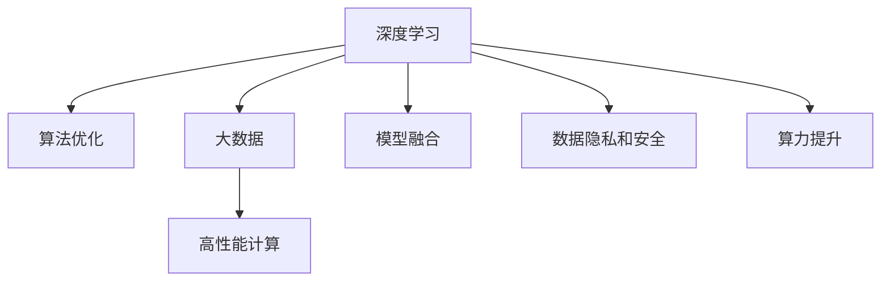

                 

# AI算法、算力与大数据的结合

> 关键词：人工智能,算法优化,算力提升,大数据应用,深度学习,机器学习,高性能计算

## 1. 背景介绍

### 1.1 问题由来

在过去的几十年中，人工智能(AI)技术取得了飞速的发展，尤其是在深度学习和机器学习领域。然而，为了实现高效的AI应用，还需要解决两个关键问题：算力和数据。算力提供了计算能力，使得复杂的模型和算法得以运行；大数据则为AI提供了充足的学习样本和信息。两者缺一不可，共同推动了AI技术的进步。

人工智能的发展离不开算力和数据的支持。早期的人工智能主要依赖于小型机器和少量数据，但随着算法的进步，需要更强大的算力和更多样化的数据来提升模型的性能。特别是深度学习模型，需要处理大量数据进行训练，且对计算资源的需求也日益增加。

### 1.2 问题核心关键点

当前，AI算法、算力和数据的结合已经成为人工智能领域的热点话题。以下是AI算法、算力与大数据结合的关键点：

1. **算法优化**：提升现有算法的效率，使其能够在有限的计算资源下实现最佳性能。
2. **算力提升**：增加计算资源，如GPU、TPU等，以支持更复杂的模型和更大规模的数据集。
3. **大数据应用**：利用大数据技术，如数据挖掘、数据清洗、数据标注等，提高数据质量，增强模型的泛化能力。
4. **高性能计算**：采用分布式计算、异构计算等技术，提高计算效率，降低能耗。
5. **模型融合**：结合多种算法和模型，形成优势互补，提高整体的AI性能。
6. **数据隐私和安全**：在处理大量数据时，保护数据隐私和安全，防止数据泄露和滥用。

## 2. 核心概念与联系

### 2.1 核心概念概述

为了更好地理解AI算法、算力与大数据的结合，本节将介绍几个密切相关的核心概念：

1. **深度学习(Deep Learning)**：基于神经网络的机器学习方法，通过多层次的非线性变换，从大量数据中学习复杂特征和模式。
2. **机器学习(Machine Learning)**：利用数据和算法，使计算机能够从经验中学习，并自动改进性能。
3. **大数据(Big Data)**：指的是超大规模、多样化、高速度的数据集，利用大数据技术可以从中挖掘有价值的信息。
4. **高性能计算(High Performance Computing)**：使用先进的计算技术和架构，实现高效的并行计算和分布式计算。
5. **算法优化(Algorithm Optimization)**：通过对算法进行改进和优化，使其能够在有限资源下达到最佳效果。
6. **模型融合(Model Fusion)**：将多个模型或算法结合使用，形成更强大的AI模型。
7. **数据隐私和安全(Data Privacy and Security)**：保护数据在处理、存储和传输过程中的隐私和安全。

这些核心概念之间的逻辑关系可以通过以下Mermaid流程图来展示：



这个流程图展示了深度学习、算法优化、大数据、高性能计算、模型融合、数据隐私与安全之间的逻辑关系。深度学习、大数据和模型融合构成了AI的基础，而算法优化和算力提升则为其提供了实现的可能。同时，数据隐私与安全是数据处理的重要保障。

## 3. 核心算法原理 & 具体操作步骤

### 3.1 算法原理概述

AI算法、算力与大数据的结合，本质上是利用算力和数据来优化算法性能的过程。通过高效的数据处理和计算资源，可以提升算法的训练速度和泛化能力。

具体来说，AI算法、算力与大数据的结合主要通过以下步骤实现：

1. **数据预处理**：从原始数据中提取、清洗和标注有用的信息。
2. **模型训练**：在强大的计算资源下，对模型进行训练，学习数据中的模式和规律。
3. **模型优化**：通过算法优化，提升模型性能，避免过拟合和欠拟合。
4. **模型部署**：将训练好的模型部署到实际应用中，进行推理和预测。
5. **数据监控**：实时监控模型的性能和数据质量，根据反馈进行调整和优化。

### 3.2 算法步骤详解

基于AI算法、算力与大数据的结合，以下是一个完整的流程：

**Step 1: 数据准备**
- 收集并清洗数据，去除噪声和异常值。
- 对数据进行标注，构建训练集、验证集和测试集。
- 对数据进行预处理，如归一化、标准化、数据增强等。

**Step 2: 算法选择**
- 根据任务需求选择合适的算法，如卷积神经网络(CNN)、循环神经网络(RNN)、长短期记忆网络(LSTM)等。
- 对算法进行调参和优化，提升模型性能。

**Step 3: 模型训练**
- 使用高性能计算资源，如GPU、TPU等，对模型进行训练。
- 设置合适的学习率、批大小、迭代次数等训练参数。
- 应用正则化技术，如L2正则、Dropout等，防止过拟合。

**Step 4: 模型评估**
- 在验证集上评估模型的性能，如准确率、召回率、F1-score等。
- 根据评估结果调整模型参数，提升模型性能。

**Step 5: 模型优化**
- 使用模型压缩、量化加速等技术，提升模型推理速度。
- 应用参数优化算法，如Adam、SGD等，进一步提升模型性能。

**Step 6: 模型部署**
- 将训练好的模型部署到实际应用中，进行推理和预测。
- 使用高性能计算资源，如DNN、GPU等，保证推理速度和性能。

**Step 7: 数据监控**
- 实时监控模型的性能和数据质量，根据反馈进行调整和优化。
- 使用日志和告警系统，确保模型稳定运行。

### 3.3 算法优缺点

AI算法、算力与大数据的结合具有以下优点：

1. **提升模型性能**：通过大量的数据和强大的算力，可以训练出更复杂的模型，提升模型的性能。
2. **加快训练速度**：使用高性能计算资源，可以显著加快模型的训练速度。
3. **提高泛化能力**：通过大数据技术，可以从更多的数据中学习规律，提高模型的泛化能力。
4. **降低计算成本**：通过优化算法和模型，可以降低计算资源的消耗，提高资源利用效率。

同时，这种结合也存在以下局限性：

1. **数据质量问题**：数据收集和标注的复杂性和成本较高，数据质量难以保证。
2. **计算资源限制**：高性能计算资源成本较高，大规模数据处理需要强大的硬件支持。
3. **模型复杂性**：复杂的模型需要大量的计算资源，容易过拟合。
4. **数据隐私安全**：处理大量数据时，需要保护数据隐私和安全，防止数据泄露和滥用。

尽管存在这些局限性，但AI算法、算力与大数据的结合无疑是当前AI技术发展的重要方向，有助于实现更高效、更强大的AI应用。

### 3.4 算法应用领域

AI算法、算力与大数据的结合在多个领域得到了广泛应用，如：

1. **计算机视觉**：在图像识别、物体检测、图像分割等任务中，使用大规模数据和复杂模型进行训练，提升识别准确率和鲁棒性。
2. **自然语言处理(NLP)**：在机器翻译、文本分类、情感分析等任务中，利用大数据和深度学习模型提升模型的理解能力和生成能力。
3. **语音识别**：在语音识别、语音合成、语音翻译等任务中，使用大规模数据和复杂模型进行训练，提高识别的准确率和自然度。
4. **医疗健康**：在疾病诊断、影像分析、基因组学等任务中，利用大数据和深度学习模型进行分析和预测，提高诊断准确率和效率。
5. **金融风控**：在信用评估、风险管理、欺诈检测等任务中，使用大数据和复杂模型进行分析和预测，提升风险控制能力。
6. **智能制造**：在工业自动化、智能控制、质量检测等任务中，利用大数据和深度学习模型进行优化和预测，提高生产效率和产品质量。

除了这些应用领域外，AI算法、算力与大数据的结合还在更多场景中得到创新性应用，如自动驾驶、智能家居、智慧城市等，为各行各业带来新的变革和机遇。

## 4. 数学模型和公式 & 详细讲解  
### 4.1 数学模型构建

为了更好地理解AI算法、算力与大数据的结合，本节将使用数学语言对整个结合过程进行严格的描述。

假设有一个深度学习模型，其结构为：输入层 $X$、若干个隐藏层 $H$、输出层 $Y$。模型的训练过程可以表示为：

$$
Y = f(X; \theta)
$$

其中 $f$ 表示模型的前向传播过程，$\theta$ 为模型的参数。模型的损失函数为：

$$
\mathcal{L} = \frac{1}{N} \sum_{i=1}^N \ell(Y_i, \hat{Y}_i)
$$

其中 $\ell$ 表示损失函数，$Y_i$ 表示真实的标签，$\hat{Y}_i$ 表示模型的预测结果。

模型的优化目标是最小化损失函数：

$$
\hat{\theta} = \mathop{\arg\min}_{\theta} \mathcal{L}(Y, f(X; \theta))
$$

在实际应用中，为了提高模型的泛化能力，我们通常使用大量数据进行训练，并将数据集分为训练集、验证集和测试集。在训练集上训练模型，在验证集上评估模型性能，最终在测试集上测试模型的泛化能力。

### 4.2 公式推导过程

以下我们将推导模型训练过程中的关键公式：

1. **梯度下降算法**：

$$
\theta = \theta - \eta \nabla_{\theta} \mathcal{L}
$$

其中 $\eta$ 表示学习率，$\nabla_{\theta} \mathcal{L}$ 表示损失函数对参数 $\theta$ 的梯度。梯度下降算法通过反向传播计算梯度，更新模型参数，最小化损失函数。

2. **Adam优化算法**：

$$
m_t = \beta_1 m_{t-1} + (1 - \beta_1) g_t
$$

$$
v_t = \beta_2 v_{t-1} + (1 - \beta_2) g_t^2
$$

$$
\hat{m}_t = \frac{m_t}{1 - \beta_1^t}
$$

$$
\hat{v}_t = \frac{v_t}{1 - \beta_2^t}
$$

$$
\theta = \theta - \frac{\eta}{\sqrt{\hat{v}_t} + \epsilon} \hat{m}_t
$$

其中 $g_t$ 表示损失函数对参数 $\theta$ 的梯度，$m_t$ 和 $v_t$ 表示动量和二阶矩估计，$\beta_1$ 和 $\beta_2$ 表示动量和二阶矩的衰减率，$\epsilon$ 为一个小正数。Adam算法通过动量和二阶矩估计，进一步提高了梯度下降的收敛速度和稳定性。

### 4.3 案例分析与讲解

假设我们有一个图像分类任务，使用卷积神经网络(CNN)作为模型，数据集为ImageNet。我们将使用GPU进行模型训练，并采用Adam算法进行参数更新。

在训练过程中，我们首先将图像数据加载到GPU上，使用数据增强技术进行扩充。然后，使用Adam算法计算梯度并更新模型参数。最后，在验证集上评估模型性能，根据结果调整学习率和其他训练参数。

## 5. 项目实践：代码实例和详细解释说明
### 5.1 开发环境搭建

在进行项目实践前，我们需要准备好开发环境。以下是使用Python和PyTorch进行深度学习项目开发的流程：

1. 安装Anaconda：从官网下载并安装Anaconda，用于创建独立的Python环境。

2. 创建并激活虚拟环境：
```bash
conda create -n pytorch-env python=3.8 
conda activate pytorch-env
```

3. 安装PyTorch：根据CUDA版本，从官网获取对应的安装命令。例如：
```bash
conda install pytorch torchvision torchaudio cudatoolkit=11.1 -c pytorch -c conda-forge
```

4. 安装必要的库：
```bash
pip install numpy scipy matplotlib scikit-learn pandas torch torchvision torchtext
```

完成上述步骤后，即可在`pytorch-env`环境中开始项目实践。

### 5.2 源代码详细实现

这里以一个简单的图像分类任务为例，使用卷积神经网络(CNN)和ImageNet数据集进行训练和测试。

首先，定义CNN模型：

```python
import torch
import torch.nn as nn
import torch.optim as optim

class CNNModel(nn.Module):
    def __init__(self):
        super(CNNModel, self).__init__()
        self.conv1 = nn.Conv2d(3, 64, 3, 1)
        self.pool = nn.MaxPool2d(2, 2)
        self.conv2 = nn.Conv2d(64, 128, 3, 1)
        self.fc1 = nn.Linear(128 * 4 * 4, 256)
        self.fc2 = nn.Linear(256, 10)
        
    def forward(self, x):
        x = self.pool(F.relu(self.conv1(x)))
        x = self.pool(F.relu(self.conv2(x)))
        x = x.view(-1, 128 * 4 * 4)
        x = F.relu(self.fc1(x))
        x = self.fc2(x)
        return x
```

然后，定义数据处理函数：

```python
import torchvision.transforms as transforms
from torchvision.datasets import ImageNet

train_dataset = ImageNet(root='data', train=True, transform=transforms.ToTensor(), download=True)
test_dataset = ImageNet(root='data', train=False, transform=transforms.ToTensor(), download=True)

def train_epoch(model, optimizer, train_loader):
    model.train()
    for batch_idx, (data, target) in enumerate(train_loader):
        optimizer.zero_grad()
        output = model(data)
        loss = F.cross_entropy(output, target)
        loss.backward()
        optimizer.step()
        if batch_idx % 100 == 0:
            print('Train Epoch: {} [{}/{} ({:.0f}%)]\tLoss: {:.6f}'.format(
                epoch, batch_idx * len(data), len(train_loader.dataset),
                100. * batch_idx / len(train_loader), loss.item()))
```

接着，定义模型训练和评估函数：

```python
from torch.utils.data import DataLoader
from torchvision import datasets, transforms
from torch import nn, optim
from torch.autograd import Variable
import torch.nn.functional as F

train_loader = DataLoader(train_dataset, batch_size=32, shuffle=True)
test_loader = DataLoader(test_dataset, batch_size=32, shuffle=False)

model = CNNModel()
optimizer = optim.Adam(model.parameters(), lr=0.001)

def train_model(model, optimizer, train_loader, epochs=10):
    for epoch in range(epochs):
        train_epoch(model, optimizer, train_loader)
        test_loss, correct = 0, 0
        with torch.no_grad():
            for data, target in test_loader:
                output = model(data)
                test_loss += F.cross_entropy(output, target, reduction='sum').item()
                pred = output.argmax(dim=1, keepdim=True)
                correct += pred.eq(target.view_as(pred)).sum().item()
        test_loss /= len(test_loader.dataset)
        print('\nTest set: Average loss: {:.4f}, Accuracy: {}/{} ({:.0f}%)\n'.format(
            test_loss, correct, len(test_loader.dataset),
            100. * correct / len(test_loader.dataset)))
```

最后，启动模型训练和评估：

```python
train_model(model, optimizer, train_loader)
```

以上就是使用PyTorch进行卷积神经网络训练的完整代码实现。可以看到，通过PyTorch和TensorFlow等深度学习框架，我们可以很方便地实现模型的训练和评估。

### 5.3 代码解读与分析

让我们再详细解读一下关键代码的实现细节：

**CNNModel类**：
- `__init__`方法：初始化模型的各个层，包括卷积层、池化层、全连接层等。
- `forward`方法：定义模型前向传播过程。

**train_epoch函数**：
- 在每个epoch上，使用训练集数据进行训练，计算损失并更新模型参数。
- 每100个批次输出一次训练进度。

**train_model函数**：
- 定义模型训练和评估的函数。
- 使用Adam算法进行参数更新，并在验证集上评估模型性能。

在实际应用中，还需要考虑模型裁剪、量化加速等技术，以提升模型的推理速度和效率。同时，还需要考虑数据预处理、数据增强等技术，以提高模型的泛化能力。

## 6. 实际应用场景
### 6.1 智能安防系统

智能安防系统是AI算法、算力与大数据结合的重要应用之一。通过图像识别和视频分析，智能安防系统可以实时监测监控画面，及时发现异常行为，并发出警报。

在实际应用中，可以通过深度学习模型对监控画面进行实时分析，使用GPU进行高效计算，在大数据上训练模型，提升识别准确率和鲁棒性。同时，可以使用数据增强技术对训练集进行扩充，进一步提高模型的泛化能力。

### 6.2 医疗影像诊断

医疗影像诊断是AI算法、算力与大数据结合的另一个重要应用。通过深度学习模型对医疗影像进行分析，可以快速准确地诊断疾病，提高医生的工作效率。

在实际应用中，可以使用大规模医疗影像数据进行模型训练，使用GPU进行高效计算，提升模型的诊断准确率和鲁棒性。同时，可以使用数据增强技术对训练集进行扩充，进一步提高模型的泛化能力。

### 6.3 智能推荐系统

智能推荐系统是AI算法、算力与大数据结合的重要应用之一。通过深度学习模型对用户行为和物品特征进行分析，可以为用户推荐个性化的商品和服务，提升用户体验。

在实际应用中，可以使用大规模用户行为数据和物品特征数据进行模型训练，使用GPU进行高效计算，提升模型的推荐准确率和鲁棒性。同时，可以使用数据增强技术对训练集进行扩充，进一步提高模型的泛化能力。

### 6.4 未来应用展望

随着AI算法、算力与大数据结合的不断深入，未来AI技术将在更多领域得到应用，为各行各业带来新的变革和机遇。

在智慧城市治理中，AI技术可以应用于交通管理、环境监测、公共安全等方面，提高城市管理的自动化和智能化水平。

在自动驾驶领域，AI技术可以应用于无人驾驶汽车、无人机等，提升交通工具的安全性和智能化水平。

在智能制造领域，AI技术可以应用于智能生产、质量检测、供应链管理等方面，提高生产效率和产品质量。

## 7. 工具和资源推荐
### 7.1 学习资源推荐

为了帮助开发者系统掌握AI算法、算力与大数据结合的理论基础和实践技巧，这里推荐一些优质的学习资源：

1. 《深度学习》（Ian Goodfellow著）：深度学习领域的经典教材，系统介绍了深度学习的原理和应用。
2. 《TensorFlow实战》（Manning Publications）：TensorFlow的官方教程，介绍了TensorFlow的安装、使用和优化。
3. 《PyTorch实战》（O'Reilly）：PyTorch的官方教程，介绍了PyTorch的安装、使用和优化。
4. 《Python深度学习》（Francois Chollet著）：PyTorch的官方教程，介绍了PyTorch的安装、使用和优化。
5. 《深度学习入门》（斋藤康毅著）：深度学习入门的经典教材，适合初学者入门。

通过对这些资源的学习实践，相信你一定能够快速掌握AI算法、算力与大数据结合的精髓，并用于解决实际的AI问题。

### 7.2 开发工具推荐

高效的开发离不开优秀的工具支持。以下是几款用于AI算法、算力与大数据结合开发的常用工具：

1. PyTorch：基于Python的开源深度学习框架，灵活动态的计算图，适合快速迭代研究。
2. TensorFlow：由Google主导开发的开源深度学习框架，生产部署方便，适合大规模工程应用。
3. Scikit-learn：基于Python的机器学习库，提供多种算法和模型，易于使用和集成。
4. OpenCV：开源计算机视觉库，提供丰富的图像处理和计算机视觉算法。
5. Hadoop和Spark：分布式计算框架，支持大规模数据处理和分布式计算。

合理利用这些工具，可以显著提升AI算法、算力与大数据结合的开发效率，加快创新迭代的步伐。

### 7.3 相关论文推荐

AI算法、算力与大数据结合的发展源于学界的持续研究。以下是几篇奠基性的相关论文，推荐阅读：

1. AlexNet：ImageNet大规模视觉识别竞赛冠军，展示了深度学习在大规模图像识别中的应用。
2. ResNet：提出残差连接结构，显著提升了深度网络的训练和泛化能力。
3. GoogleNet：提出Inception模块，进一步提升了深度网络的计算效率和泛化能力。
4. DenseNet：提出密集连接结构，提高了深度网络的特征重用能力和计算效率。
5. YOLOv3：提出目标检测的单阶段算法，提高了目标检测的速度和精度。
6. GANs：提出生成对抗网络，实现了高质量的图像生成和数据增强。

这些论文代表了大数据、算法和算力结合的发展脉络。通过学习这些前沿成果，可以帮助研究者把握学科前进方向，激发更多的创新灵感。

## 8. 总结：未来发展趋势与挑战

### 8.1 总结

本文对AI算法、算力与大数据的结合进行了全面系统的介绍。首先阐述了AI算法、算力与大数据结合的研究背景和意义，明确了这种结合在提升AI模型性能和泛化能力方面的重要价值。其次，从原理到实践，详细讲解了AI算法、算力与大数据结合的数学模型和关键步骤，给出了具体的代码实现。同时，本文还广泛探讨了AI算法、算力与大数据结合在多个领域的应用前景，展示了其在现实世界中的强大潜力。

通过本文的系统梳理，可以看到，AI算法、算力与大数据的结合正在成为AI技术发展的重要方向，极大地拓展了AI模型的应用边界，催生了更多的落地场景。受益于算力的大幅提升和大数据技术的不断发展，未来AI模型将在更广泛的领域中发挥作用，推动社会生产力的进步。

### 8.2 未来发展趋势

展望未来，AI算法、算力与大数据结合将呈现以下几个发展趋势：

1. **算法优化**：算法优化将继续提升AI模型的性能和泛化能力，特别是在深度学习和机器学习领域。未来的算法将继续追求更高的精度、更小的计算资源消耗和更好的可解释性。

2. **算力提升**：随着超大规模计算资源的出现，如GPU、TPU等，算力将继续提升，支持更复杂的模型和大规模数据集。

3. **大数据应用**：大数据技术将继续发展，从数据收集、存储、处理到数据可视化和分析，形成一个完整的生态系统，为AI模型提供更丰富的数据支持。

4. **高性能计算**：高性能计算技术将继续发展，包括分布式计算、异构计算、量子计算等，进一步提高计算效率和数据处理能力。

5. **模型融合**：模型融合将继续成为AI技术的重要趋势，将多个模型和算法结合使用，形成优势互补，提升整体的AI性能。

6. **数据隐私和安全**：数据隐私和安全将成为AI应用的重要保障，未来的AI系统将更加注重数据隐私和安全的保护。

以上趋势凸显了AI算法、算力与大数据结合的广阔前景。这些方向的探索发展，必将进一步提升AI技术的性能和应用范围，为各行各业带来新的变革和机遇。

### 8.3 面临的挑战

尽管AI算法、算力与大数据结合取得了显著进展，但在迈向更加智能化、普适化应用的过程中，仍然面临诸多挑战：

1. **数据质量问题**：数据收集和标注的复杂性和成本较高，数据质量难以保证。

2. **计算资源限制**：高性能计算资源成本较高，大规模数据处理需要强大的硬件支持。

3. **模型复杂性**：复杂的模型需要大量的计算资源，容易过拟合。

4. **数据隐私安全**：处理大量数据时，需要保护数据隐私和安全，防止数据泄露和滥用。

5. **伦理道德约束**：AI系统的应用需要符合人类价值观和伦理道德，避免有害影响。

尽管存在这些挑战，但随着学界和产业界的共同努力，这些挑战终将一一被克服，AI算法、算力与大数据结合必将在构建人机协同的智能时代中扮演越来越重要的角色。

### 8.4 研究展望

面对AI算法、算力与大数据结合所面临的挑战，未来的研究需要在以下几个方面寻求新的突破：

1. **无监督学习**：探索无监督和半监督学习范式，降低对大规模标注数据的依赖，提高数据利用率。

2. **分布式计算**：采用分布式计算、异构计算等技术，提高计算效率，降低能耗。

3. **模型压缩**：使用模型压缩、量化加速等技术，提高模型推理速度和效率。

4. **跨领域融合**：将符号化的先验知识，如知识图谱、逻辑规则等，与神经网络模型进行巧妙融合，提升模型的知识和推理能力。

5. **因果学习**：引入因果推断方法，增强模型的因果关系理解和推理能力。

6. **伦理道德**：在模型训练和应用中，引入伦理导向的评估指标，过滤和惩罚有害的输出倾向，确保AI系统的道德合规。

这些研究方向的探索，必将引领AI算法、算力与大数据结合技术迈向更高的台阶，为构建安全、可靠、可解释、可控的智能系统铺平道路。面向未来，AI算法、算力与大数据结合技术还需要与其他人工智能技术进行更深入的融合，如知识表示、因果推理、强化学习等，多路径协同发力，共同推动自然语言理解和智能交互系统的进步。只有勇于创新、敢于突破，才能不断拓展AI模型的边界，让智能技术更好地造福人类社会。

## 9. 附录：常见问题与解答

**Q1：AI算法、算力与大数据的结合是否适用于所有AI任务？**

A: AI算法、算力与大数据的结合在大多数AI任务上都能取得不错的效果，特别是对于数据量较大的任务。但对于一些特定领域的任务，如医学、法律等，仅仅依靠通用语料预训练的模型可能难以很好地适应。此时需要在特定领域语料上进一步预训练，再进行微调，才能获得理想效果。此外，对于一些需要时效性、个性化很强的任务，如对话、推荐等，AI算法、算力与大数据的结合方法也需要针对性的改进优化。

**Q2：如何选择适合的深度学习框架？**

A: 选择深度学习框架需要考虑多个因素，包括任务类型、数据规模、计算资源等。常用的深度学习框架有TensorFlow、PyTorch、MXNet等。TensorFlow适合大规模工程应用，PyTorch适合快速迭代研究，MXNet适合分布式计算。开发者可以根据具体需求选择合适的框架。

**Q3：如何在有限资源下提升模型性能？**

A: 在有限资源下提升模型性能，可以通过以下方法实现：
1. 数据预处理：进行数据增强、归一化、标准化等预处理，提高数据质量。
2. 模型优化：使用算法优化技术，如梯度下降、Adam、SGD等，提高模型收敛速度和性能。
3. 模型压缩：使用模型压缩技术，如剪枝、量化、知识蒸馏等，减少模型参数量和计算资源消耗。
4. 分布式计算：使用分布式计算技术，如Hadoop、Spark等，提高计算效率和数据处理能力。
5. 算法选择：选择适合任务的算法，如卷积神经网络、循环神经网络、长短期记忆网络等。

这些方法可以在有限的资源下提升模型性能，帮助开发者更好地实现AI应用。

**Q4：如何保护数据隐私和安全？**

A: 保护数据隐私和安全是AI应用的重要保障，可以采取以下措施：
1. 数据匿名化：对数据进行匿名化处理，防止数据泄露。
2. 数据加密：对数据进行加密处理，防止数据被非法访问。
3. 访问控制：对数据进行访问控制，限制数据访问权限。
4. 数据审计：对数据访问和使用进行审计，记录和监控数据操作。
5. 隐私保护技术：采用隐私保护技术，如差分隐私、联邦学习等，保护数据隐私。

这些措施可以有效保护数据隐私和安全，确保AI应用的道德合规。

---

作者：禅与计算机程序设计艺术 / Zen and the Art of Computer Programming

