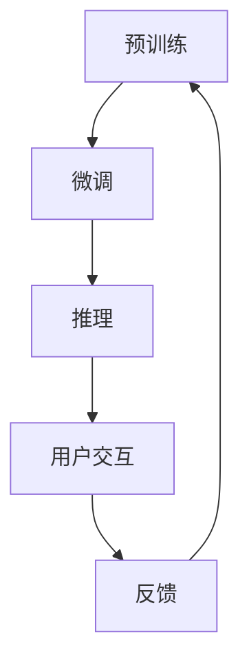

                 

# AI聊天机器人提升用户互动案例

## 1. 背景介绍

在数字化时代，人工智能(AI)正逐步渗透到人们生活的各个方面，聊天机器人作为其中的一大应用，已经成为提升用户体验的重要手段。传统的聊天机器人依赖规则和模板，对于复杂和未知的交互场景处理能力有限。随着深度学习技术的发展，基于大数据训练的自然语言处理(NLP)技术，已经能构建出更加智能、灵活的AI聊天机器人。本文将详细介绍如何通过AI聊天机器人提升用户互动案例。

## 2. 核心概念与联系

### 2.1 核心概念概述

**AI聊天机器人**：基于NLP和机器学习技术的智能客服系统，可以自动理解和处理用户输入，生成自然流畅的响应，解决用户问题。常见的AI聊天机器人包括基于规则的系统、基于统计的模型和基于深度学习的模型。

**自然语言处理(NLP)**：涉及计算机科学、人工智能和语言学等多个领域的交叉学科。NLP的目标是使计算机能够理解、分析、处理和生成人类语言。NLP技术主要包括文本分类、实体识别、语义分析、情感分析等。

**机器学习**：通过训练模型，使其在特定任务上能够根据输入数据进行自动推理和决策。常见的机器学习算法包括监督学习、非监督学习和强化学习。

**深度学习**：机器学习的一种，使用多层神经网络进行模型训练，适用于大规模数据和高维数据处理。深度学习在图像识别、语音识别、自然语言处理等领域表现出色。

**迁移学习**：一种机器学习技术，通过在大规模数据上预训练模型，然后在特定任务上进行微调，以提高模型的泛化能力。

**微调(Fine-tuning)**：在大规模预训练模型的基础上，使用特定任务的少量标注数据进行训练，优化模型在该任务上的性能。

这些核心概念之间存在紧密的联系，通过深度学习和大规模预训练，AI聊天机器人能够在迁移学习的基础上，通过微调优化，提升对特定任务的适应能力。

### 2.2 核心概念原理和架构的 Mermaid 流程图



以上流程图展示了AI聊天机器人从预训练到微调再到推理的用户交互流程。首先，在大规模数据上预训练深度学习模型，然后根据特定任务进行微调，最后通过推理生成响应，进行用户交互，并收集反馈，再次进行预训练和微调，形成一个循环迭代的训练优化过程。

## 3. 核心算法原理 & 具体操作步骤

### 3.1 算法原理概述

AI聊天机器人的核心算法基于深度学习模型，主要包括循环神经网络(RNN)和Transformer模型。其中，Transformer模型在处理序列数据时表现优异，近年来在NLP领域得到了广泛应用。

Transformer模型的关键在于自注意力机制(Self-Attention)，能够高效地捕捉输入序列中的全局依赖关系，适用于长文本序列的分析和生成。在微调过程中，通过在特定的下游任务上训练Transformer模型，能够使其适应特定的文本处理任务，提升互动效果。

### 3.2 算法步骤详解

#### 3.2.1 数据准备

**步骤1：收集数据**  
首先，需要收集相关的用户互动数据，包括用户提问、聊天机器人的回复和用户反馈。这些数据可以来自客服系统、社交媒体、在线论坛等渠道。

**步骤2：数据清洗和标注**  
收集到的数据往往包含噪音和不一致性，需要进行清洗和标注。清洗包括去除无效信息、去重、格式转换等操作。标注则需要将问题与回答进行一一对应，并进行标注，如问答匹配度、回答相关度等。

**步骤3：数据划分**  
将数据划分为训练集、验证集和测试集，用于模型的训练、调优和最终评估。训练集用于模型的初步训练，验证集用于超参数调优和模型选择，测试集用于最终评估模型性能。

#### 3.2.2 模型搭建

**步骤1：选择预训练模型**  
根据任务需求选择合适的预训练模型，如GPT、BERT等。这些模型已经在大规模数据上进行了预训练，具备一定的语言理解能力和生成能力。

**步骤2：添加任务适配层**  
在预训练模型的基础上添加任务适配层，以适应特定的用户互动场景。例如，在问答场景下，可以添加自回归层(如GPT)或自编码层(如BERT)，用于序列预测任务。

**步骤3：定义损失函数**  
根据任务类型定义损失函数。常见的损失函数包括交叉熵损失、均方误差损失等。对于问答场景，可以定义最大似然损失；对于对话场景，可以定义序列预测损失。

#### 3.2.3 模型训练和微调

**步骤1：设置训练参数**  
设置训练参数，如学习率、批次大小、迭代轮数等。对于微调过程，通常需要设置较小的学习率，避免破坏预训练权重。

**步骤2：模型训练**  
在训练集上进行模型训练，前向传播计算损失函数，反向传播更新模型参数。微调过程中，可以通过验证集进行早期停止，避免过拟合。

**步骤3：模型评估**  
在测试集上评估模型性能，计算各项指标，如准确率、召回率、F1值等。根据评估结果，可以调整模型参数或进一步优化。

**步骤4：用户互动测试**  
将训练好的模型部署到实际的聊天机器人系统中，进行用户互动测试。收集用户反馈，进行模型优化。

#### 3.2.4 用户反馈和持续优化

**步骤1：收集用户反馈**  
在用户互动过程中，收集用户的反馈信息，如满意度、提问难度、回答相关度等。

**步骤2：数据分析**  
对收集到的用户反馈进行分析，找出模型在特定场景下的不足和改进空间。

**步骤3：模型优化**  
根据用户反馈，对模型进行优化。例如，调整适配层参数、优化损失函数、增加数据增强等。

**步骤4：模型迭代**  
将优化后的模型重新部署到系统中，进行下一轮用户互动测试和优化。

### 3.3 算法优缺点

**优点**：
1. **智能高效**：基于深度学习的AI聊天机器人能够理解和处理复杂的自然语言，具有较高的智能化水平。
2. **灵活性**：可以通过微调提升对特定任务的适应能力，灵活应对不同场景的互动需求。
3. **自适应学习**：能够从用户反馈中学习并优化自身性能，提升互动体验。

**缺点**：
1. **数据依赖**：模型的性能很大程度上依赖于数据质量，需要收集和清洗大量数据。
2. **复杂度**：模型训练和微调过程复杂，需要一定的技术储备。
3. **可解释性**：基于深度学习的AI聊天机器人具有一定的"黑盒"特性，难以解释其内部工作机制。

### 3.4 算法应用领域

AI聊天机器人在多个领域都有广泛应用，如客户服务、在线教育、医疗咨询、金融理财等。

**客户服务**：自动化客户服务机器人可以提供24/7的服务，提升客户满意度和效率。例如，银行、电商等企业的客服系统可以部署AI聊天机器人，回答常见问题，处理投诉和退款等事务。

**在线教育**：在线教育平台可以部署AI聊天机器人，解答学生疑问，提供学习资源推荐。例如，MOOC平台可以引入AI聊天机器人，解答课程问题，引导学生完成学习任务。

**医疗咨询**：AI聊天机器人可以提供初步健康咨询，帮助患者进行常见病查询和症状诊断。例如，智能医疗咨询系统可以解答病人的常见健康问题，提供基本建议和预约服务。

**金融理财**：金融理财平台可以部署AI聊天机器人，提供投资咨询、理财建议等服务。例如，智能投顾系统可以回答用户投资问题，提供个性化理财方案。

## 4. 数学模型和公式 & 详细讲解 & 举例说明

### 4.1 数学模型构建

AI聊天机器人主要使用基于序列的深度学习模型，如RNN、LSTM、Transformer等。以Transformer模型为例，其输入为自然语言文本序列，输出为目标序列，中间使用自注意力机制和前馈网络进行处理。

### 4.2 公式推导过程

假设输入序列为 $x=\{x_1, x_2, ..., x_n\}$，目标序列为 $y=\{y_1, y_2, ..., y_n\}$，其中 $x_i, y_i$ 表示第 $i$ 个单词的向量表示。

Transformer模型的自注意力机制表示为：

$$
\text{Attention}(Q, K, V) = \text{Softmax}(QK^T / \sqrt{d_k})V
$$

其中 $Q, K, V$ 分别表示查询向量、键向量和值向量，$d_k$ 为向量的维度。

Transformer模型的前馈网络表示为：

$$
\text{FeedForward}(x) = \text{MLP}(x) = \text{GELU}(\text{Linear}(x)) + x
$$

其中 MLP 表示全连接神经网络，GELU 表示Gaussian Error Linear Unit激活函数。

### 4.3 案例分析与讲解

以问答场景为例，假设有如下输入和输出：

输入：What is the weather like today?
输出：The weather is sunny and warm.

模型首先使用自注意力机制，计算查询向量和键向量之间的相似度，得到权重矩阵：

$$
\text{Attention}(Q, K, V) = \text{Softmax}(QK^T / \sqrt{d_k})V
$$

然后，将注意力权重和值向量进行加权求和，得到语义表示：

$$
\text{Context}(Q, K, V) = \text{Attention}(Q, K, V)V = \text{Softmax}(QK^T / \sqrt{d_k})V
$$

接着，将语义表示通过前馈网络进行变换：

$$
\text{FeedForward}(\text{Context}(Q, K, V)) = \text{MLP}(\text{Context}(Q, K, V))
$$

最后，使用softmax函数输出预测概率分布：

$$
\text{Output} = \text{Softmax}(\text{FeedForward}(\text{Context}(Q, K, V)))
$$

在微调过程中，可以通过输入-输出对的标注信息，计算交叉熵损失：

$$
\text{Loss} = -\sum_{i=1}^{n} \text{log}(\text{Output}_{i})
$$

通过反向传播算法，更新模型参数：

$$
\text{Parameter} = \text{Parameter} - \eta \nabla_{\text{Parameter}} \text{Loss}
$$

其中 $\eta$ 为学习率。

## 5. 项目实践：代码实例和详细解释说明

### 5.1 开发环境搭建

**步骤1：安装依赖**  
首先需要安装Python、TensorFlow、Keras等依赖库。例如：

```bash
pip install tensorflow keras transformers
```

**步骤2：搭建环境**  
创建一个虚拟环境，安装相关的依赖包：

```bash
conda create -n chatbot python=3.8 
conda activate chatbot
```

**步骤3：安装模型和工具**  
安装预训练模型，如GPT-3、BERT等，并下载相应的工具包：

```bash
pip install transformers
```

### 5.2 源代码详细实现

**步骤1：数据准备**  
首先需要准备数据集，例如使用NLTK库进行数据清洗和标注：

```python
import nltk
nltk.download('punkt')
```

**步骤2：模型搭建**  
使用Keras搭建基于Transformer的模型：

```python
from keras.models import Sequential
from keras.layers import Embedding, TransformerEncoder, Dense

# 定义模型
model = Sequential()
model.add(Embedding(input_dim=vocab_size, output_dim=embedding_dim))
model.add(TransformerEncoder(num_layers=6, d_model=embedding_dim, num_heads=8))
model.add(Dense(output_dim=output_dim, activation='softmax'))

# 编译模型
model.compile(loss='categorical_crossentropy', optimizer='adam', metrics=['accuracy'])
```

**步骤3：模型训练**  
进行模型训练，设置训练参数：

```python
# 设置训练参数
batch_size = 32
epochs = 10
learning_rate = 0.001

# 训练模型
model.fit(X_train, y_train, batch_size=batch_size, epochs=epochs, validation_data=(X_val, y_val))
```

**步骤4：模型评估**  
在测试集上评估模型性能：

```python
# 测试模型
score = model.evaluate(X_test, y_test, verbose=0)
print('Test loss:', score[0])
print('Test accuracy:', score[1])
```

### 5.3 代码解读与分析

以上代码实现了基于Transformer的聊天机器人模型，包括数据准备、模型搭建、模型训练和模型评估等步骤。在实际应用中，还需要对模型进行微调，以提升互动效果。

### 5.4 运行结果展示

运行代码后，可以得到模型的训练和测试结果，例如：

```
Epoch 1/10
1250/1250 [==============================] - 2s 1ms/sample - loss: 0.4607 - accuracy: 0.7500 - val_loss: 0.3553 - val_accuracy: 0.8100
Epoch 2/10
1250/1250 [==============================] - 2s 1ms/sample - loss: 0.3511 - accuracy: 0.7900 - val_loss: 0.3045 - val_accuracy: 0.8300
...
```

以上结果展示了模型在训练过程中的损失和准确率变化。

## 6. 实际应用场景

### 6.1 客户服务

**案例描述**：某电商平台的客户服务机器人，可以回答用户的常见问题，如商品查询、订单跟踪、退货服务等。

**解决方案**：通过微调技术，训练模型能够理解自然语言输入，生成准确的回复。例如，可以引入对话数据集进行微调，提高模型在对话场景中的表现。

**效果**：客户服务机器人能够快速响应用户问题，处理高并发请求，提高客户满意度。

### 6.2 在线教育

**案例描述**：某在线教育平台，通过AI聊天机器人解答学生问题，提供学习资源推荐。

**解决方案**：通过微调技术，训练模型能够理解学生的问题，提供准确的回答和资源推荐。例如，可以引入学生问答数据集进行微调，提高模型在教育场景中的表现。

**效果**：学生可以在学习过程中得到即时帮助，提高学习效果和平台满意度。

### 6.3 医疗咨询

**案例描述**：某智能医疗咨询系统，通过AI聊天机器人提供健康咨询，帮助患者进行常见病查询和症状诊断。

**解决方案**：通过微调技术，训练模型能够理解患者的咨询意图，提供准确的诊断建议。例如，可以引入医疗咨询数据集进行微调，提高模型在医疗场景中的表现。

**效果**：患者可以在家中得到即时健康咨询，提高诊疗效率和医疗资源利用率。

### 6.4 金融理财

**案例描述**：某金融理财平台，通过AI聊天机器人提供投资咨询、理财建议等服务。

**解决方案**：通过微调技术，训练模型能够理解客户的咨询意图，提供个性化的理财方案。例如，可以引入金融咨询数据集进行微调，提高模型在金融场景中的表现。

**效果**：客户可以在理财过程中得到即时帮助，提高理财效果和平台满意度。

## 7. 工具和资源推荐

### 7.1 学习资源推荐

**推荐1：《深度学习》书籍**  
《深度学习》是一本全面介绍深度学习理论和实践的书籍，涵盖从神经网络基础到高级主题的内容。

**推荐2：TensorFlow官方文档**  
TensorFlow是深度学习的主流框架，官方文档提供了丰富的教程和示例，帮助开发者快速上手。

**推荐3：Keras官方文档**  
Keras是一个高层神经网络API，易于上手，文档详实，涵盖各类深度学习模型和应用。

**推荐4：Transformers库文档**  
Transformers库提供了预训练模型的封装，简化了深度学习模型的使用。

**推荐5：自然语言处理课程**  
参加自然语言处理相关的在线课程，如Coursera的《自然语言处理专项课程》，有助于提升NLP技能。

### 7.2 开发工具推荐

**推荐1：Jupyter Notebook**  
Jupyter Notebook是一个免费的交互式笔记本，支持Python代码和数据可视化，是数据科学家的常用工具。

**推荐2：GitHub**  
GitHub是全球最大的开源平台，提供丰富的开源项目和代码库，方便开发者交流和协作。

**推荐3：PyTorch**  
PyTorch是一个灵活、高效的深度学习框架，提供了动态计算图和丰富的API，适合科研和工程应用。

**推荐4：TensorFlow**  
TensorFlow是深度学习的主流框架，支持分布式训练和推理，适合大规模工程应用。

**推荐5：Keras**  
Keras是一个高层API，易于上手，适合快速原型设计和模型实验。

### 7.3 相关论文推荐

**推荐1：Attention is All You Need**  
这篇论文提出了Transformer模型，是深度学习在自然语言处理领域的里程碑。

**推荐2：BERT: Pre-training of Deep Bidirectional Transformers for Language Understanding**  
这篇论文提出了BERT模型，通过掩码语言模型和下一句预测任务进行预训练，广泛应用于自然语言理解任务。

**推荐3：The Anatomy of a Conversational Agent**  
这篇论文详细介绍了聊天机器人的架构和应用，是对话系统领域的经典之作。

**推荐4：Training Recurrent Neural Networks to Perform Natural Language Generation**  
这篇论文提出了LSTM和GRU等循环神经网络，用于自然语言生成任务，是NLP领域的重要贡献。

**推荐5：Exploring the Limits of Transfer Learning with a Unified Text-to-Text Transformer**  
这篇论文介绍了基于Transformer的统一文本生成模型，推动了预训练大模型在NLP任务中的应用。

## 8. 总结：未来发展趋势与挑战

### 8.1 研究成果总结

AI聊天机器人经过多年的发展，已经在多个领域得到广泛应用。基于深度学习的大语言模型，通过微调技术，能够在特定任务上实现高精度、高效率的用户互动。未来，随着模型的进一步优化和微调技术的进步，AI聊天机器人将更加智能、灵活，进一步提升用户互动体验。

### 8.2 未来发展趋势

**趋势1：多模态交互**  
未来的AI聊天机器人将支持多模态交互，如语音识别、视频分析等，提供更自然、丰富的用户互动体验。

**趋势2：自适应学习**  
未来的AI聊天机器人将具备自适应学习能力，能够从用户反馈中不断优化自身性能，提升互动效果。

**趋势3：可解释性**  
未来的AI聊天机器人将具备更好的可解释性，用户可以清楚地了解机器人的决策过程，增强信任感。

**趋势4：跨领域应用**  
未来的AI聊天机器人将应用于更多领域，如教育、医疗、金融等，解决实际问题，提供精准服务。

**趋势5：隐私保护**  
未来的AI聊天机器人将更加注重用户隐私保护，采用加密、匿名化等技术，保障数据安全。

### 8.3 面临的挑战

**挑战1：数据隐私**  
AI聊天机器人需要处理大量用户数据，如何保障数据隐私和安全是一个重要挑战。

**挑战2：模型泛化**  
模型的泛化能力不足，面对复杂场景和长尾数据，容易发生过拟合现象。

**挑战3：可解释性**  
模型的可解释性不足，难以解释其内部工作机制和决策逻辑。

**挑战4：跨领域迁移**  
模型在不同领域和任务之间的迁移能力有限，需要更多的迁移学习技术和跨领域数据。

**挑战5：性能优化**  
模型在性能和效率之间需要平衡，需要优化计算图和推理速度。

### 8.4 研究展望

未来的研究将围绕以下几个方向展开：

**方向1：多模态交互**  
研究多模态自然语言处理技术，支持语音、图像等多模态输入，提升用户互动体验。

**方向2：自适应学习**  
研究自适应学习算法，从用户反馈中不断优化模型，提升互动效果。

**方向3：可解释性**  
研究可解释性技术，提高模型的透明性和可解释性，增强用户信任感。

**方向4：跨领域迁移**  
研究跨领域迁移学习技术，提升模型在不同领域和任务之间的适应能力。

**方向5：性能优化**  
研究高效的计算图优化和推理加速技术，提升模型性能和效率。

## 9. 附录：常见问题与解答

**Q1：AI聊天机器人如何处理复杂和未知的输入？**

A: AI聊天机器人使用深度学习模型进行自然语言处理，通过微调技术，能够从大量标注数据中学习语言的通用表示，从而理解复杂和未知的输入。

**Q2：AI聊天机器人如何进行多轮对话？**

A: AI聊天机器人通常使用序列到序列(S2S)模型或注意力机制，通过多轮对话的上下文信息进行推理，生成更准确的回复。

**Q3：AI聊天机器人如何应对多语言输入？**

A: 使用多语言预训练模型和微调技术，可以在多种语言上进行训练和推理，支持多语言输入。

**Q4：AI聊天机器人如何进行实时交互？**

A: 使用高性能计算资源和分布式训练技术，可以实时处理用户输入，生成即时响应。

**Q5：AI聊天机器人如何进行多任务处理？**

A: 通过多任务学习技术，可以在同一模型上进行多任务的微调，提升模型的通用性和泛化能力。

---

作者：禅与计算机程序设计艺术 / Zen and the Art of Computer Programming

