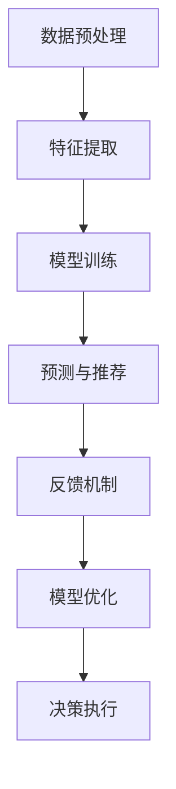

                 

# AI辅助决策系统:提高决策质量与速度

## 1. 背景介绍

### 1.1 问题由来

决策在当今社会各个领域都起着至关重要的作用。无论是企业战略规划，还是个人投资选择，甚至是日常生活中的小事决策，决策的质量和速度都直接影响着最终结果。然而，传统的人类决策模式面临着信息处理能力有限、决策速度慢、容易受情绪干扰等诸多挑战。近年来，人工智能（AI）技术的飞速发展，特别是深度学习和大数据技术的进步，为辅助决策系统提供了新的解决思路。

AI辅助决策系统能够利用先进的算法和模型，自动化地处理海量数据，快速识别关键信息，生成多种决策方案，并在必要时给出决策建议。这不仅提高了决策速度，还增强了决策的客观性和科学性，减少了人为失误。

### 1.2 问题核心关键点

AI辅助决策系统主要包括数据预处理、特征提取、模型训练、预测与推荐、反馈机制等环节。其中，数据预处理是基础，特征提取是关键，模型训练是核心，预测与推荐是应用，反馈机制是改进的保障。这些环节环环相扣，共同构成了AI辅助决策系统的全流程。

以下是对这些核心环节的进一步细化解释：

1. **数据预处理**：对原始数据进行清洗、转换、归一化等预处理，以提高数据质量，降低噪声干扰。
2. **特征提取**：从原始数据中提取有意义的特征，以供模型训练使用。特征提取方法包括统计特征、文本特征、图像特征等。
3. **模型训练**：使用机器学习或深度学习算法，对提取的特征进行建模，训练出决策模型。常用的算法包括线性回归、逻辑回归、决策树、随机森林、深度神经网络等。
4. **预测与推荐**：利用训练好的模型对新数据进行预测，给出决策建议或推荐方案。预测与推荐过程通常涉及分类、回归、聚类等任务。
5. **反馈机制**：收集决策执行结果，反馈到模型中，用于调整模型参数，优化模型性能。反馈机制的合理设计是模型持续改进的关键。

### 1.3 问题研究意义

研究AI辅助决策系统的核心意义在于：

1. **提高决策质量**：AI系统能够处理海量数据，挖掘数据中的深层次信息，提供更全面、准确的决策支持。
2. **提升决策速度**：AI系统能够自动化处理复杂问题，快速生成决策方案，节省了大量人工决策时间。
3. **减少人为失误**：AI系统基于数据和算法，客观性强，减少了主观判断和人为失误。
4. **应用广泛**：AI辅助决策系统可以应用于各种决策场景，如金融投资、医疗诊断、企业战略规划、智能制造等。
5. **促进技术创新**：AI辅助决策系统的研究推动了深度学习、大数据、自然语言处理等技术的进步，促进了相关领域的快速发展。

## 2. 核心概念与联系

### 2.1 核心概念概述

为了更好地理解AI辅助决策系统的工作原理，我们首先需要介绍几个核心概念：

- **决策树（Decision Tree）**：一种基于树形结构的分类模型，通过节点分裂，逐步缩小决策边界，最终得到分类结果。
- **随机森林（Random Forest）**：多个决策树的集成模型，通过投票或平均预测结果，提升模型的准确性和鲁棒性。
- **神经网络（Neural Network）**：一种基于多层神经元构成的非线性模型，通过反向传播算法进行训练，具有强大的特征提取能力和泛化能力。
- **深度学习（Deep Learning）**：神经网络的一种特殊形式，通常包含多个隐藏层，能够自动学习复杂特征，适用于大规模数据和高维数据处理。
- **强化学习（Reinforcement Learning）**：通过与环境交互，不断优化决策策略，最终实现目标的模型。
- **对抗生成网络（Generative Adversarial Network, GAN）**：一种生成模型，通过两个神经网络（生成器和判别器）的对抗训练，生成逼真数据。

这些概念之间通过数据处理、特征提取、模型训练、预测与推荐等环节相互联系，共同构成AI辅助决策系统的核心框架。

### 2.2 核心概念原理和架构的 Mermaid 流程图



此流程图展示了AI辅助决策系统的主要环节和数据流向。数据经过预处理和特征提取后，进入模型训练环节，生成预测与推荐模型。最终，决策执行结果通过反馈机制反馈到模型中，用于优化模型性能。

## 3. 核心算法原理 & 具体操作步骤

### 3.1 算法原理概述

AI辅助决策系统的核心算法原理主要是基于机器学习和深度学习的预测与推荐模型。其核心思想是通过对历史数据的分析和建模，挖掘数据中的规律和模式，以支持新数据的预测与推荐。

### 3.2 算法步骤详解

AI辅助决策系统的算法步骤主要包括数据预处理、特征提取、模型训练、预测与推荐和反馈优化等环节。以下将详细介绍每个步骤的具体操作步骤：

1. **数据预处理**：
   - 收集原始数据，包括结构化数据、非结构化数据、图像、音频等。
   - 对数据进行清洗、去重、缺失值处理、归一化等预处理操作。
   - 将数据转换为模型所需的格式，如CSV、JSON等。

2. **特征提取**：
   - 根据任务需求，选择合适的特征提取方法。常用的特征提取方法包括统计特征、文本特征、图像特征等。
   - 使用TF-IDF、Word2Vec、BERT等方法对文本数据进行特征提取。
   - 使用PCA、LDA、LBP等方法对图像数据进行特征提取。

3. **模型训练**：
   - 选择适当的模型，如线性回归、逻辑回归、决策树、随机森林、深度神经网络等。
   - 将处理后的数据划分为训练集、验证集和测试集。
   - 使用训练集对模型进行训练，通过正则化、dropout等技术防止过拟合。
   - 在验证集上评估模型性能，调整超参数，优化模型。

4. **预测与推荐**：
   - 使用训练好的模型对新数据进行预测或推荐。
   - 根据预测结果生成决策建议或推荐方案。
   - 对于分类任务，使用softmax函数将模型输出转化为概率分布，选择概率最大的类别作为预测结果。

5. **反馈优化**：
   - 收集决策执行结果，包括预测结果、实际结果、执行效果等。
   - 将反馈信息送入模型中，用于调整模型参数，优化模型性能。
   - 通过在线学习、迁移学习等技术，不断更新模型，提升决策质量。

### 3.3 算法优缺点

AI辅助决策系统的优点包括：

1. **处理大规模数据**：能够处理海量数据，挖掘数据中的深层次信息。
2. **预测准确性高**：基于训练好的模型，预测准确性高，减少了人为失误。
3. **自动化处理**：自动化处理决策过程，提升了决策效率。
4. **泛化能力强**：通过模型训练，能够适应新的数据和场景。

缺点包括：

1. **数据质量要求高**：需要高质量、大规模的数据进行训练，数据质量差时影响模型效果。
2. **模型复杂度高**：神经网络等复杂模型需要较长的训练时间和计算资源。
3. **可解释性差**：黑盒模型难以解释其内部决策逻辑，不利于信任度和接受度。
4. **过拟合风险**：复杂模型容易过拟合，泛化能力受限。

### 3.4 算法应用领域

AI辅助决策系统在多个领域中得到了广泛应用，例如：

1. **金融投资**：利用历史交易数据和市场信息，预测股票价格，生成投资建议。
2. **医疗诊断**：通过医学影像和病历数据，辅助医生进行疾病诊断，提供治疗方案。
3. **智能制造**：通过生产数据和设备状态，优化生产流程，提高生产效率。
4. **供应链管理**：通过物流数据和市场信息，优化库存管理，提升供应链效率。
5. **风险管理**：通过历史数据和市场信息，预测风险事件，制定风险管理策略。

## 4. 数学模型和公式 & 详细讲解 & 举例说明

### 4.1 数学模型构建

AI辅助决策系统的主要数学模型包括线性回归、逻辑回归、决策树、随机森林、深度神经网络等。这里以线性回归和深度神经网络为例，详细讲解其数学模型构建过程。

**线性回归模型**：
设$y$为预测结果，$x$为输入特征，$w$为模型参数，$b$为截距，则线性回归模型的数学模型为：
$$ y = wx + b $$

**深度神经网络模型**：
设$x$为输入特征，$y$为输出结果，$h$为隐藏层特征，则深度神经网络的数学模型为：
$$ h = \sigma(w_1x + b_1) $$
$$ y = \sigma(w_2h + b_2) $$

其中，$\sigma$为激活函数，通常使用Sigmoid函数或ReLU函数。

### 4.2 公式推导过程

**线性回归公式推导**：
根据最小二乘法，求解线性回归模型的参数$w$和$b$：
$$ w = (X^TX)^{-1}X^Ty $$
$$ b = y - wx $$

**深度神经网络公式推导**：
通过链式法则，求解深度神经网络中每个隐藏层和输出层的参数：
$$ \frac{\partial L}{\partial w_1} = \frac{\partial L}{\partial h} \frac{\partial h}{\partial w_1} = (h-y)(1-h)X^T $$
$$ \frac{\partial L}{\partial w_2} = \frac{\partial L}{\partial y} \frac{\partial y}{\partial h} \frac{\partial h}{\partial w_2} = (y-1)(h-y)(1-h) $$

### 4.3 案例分析与讲解

**案例一：金融投资决策**
设某公司历史股价数据为$x = [x_1, x_2, ..., x_n]$，其中$x_i$为第$i$天的股价数据。设预测结果为$y$，模型参数为$w$和$b$，则线性回归模型为：
$$ y = wx + b $$

通过最小二乘法求解模型参数，生成未来股价预测结果，辅助投资者决策。

**案例二：医疗诊断**
设某病人的医学影像数据为$x = [x_1, x_2, ..., x_n]$，其中$x_i$为第$i$张医学影像数据。设预测结果为$y$，模型参数为$w$和$b$，则深度神经网络模型为：
$$ h = \sigma(w_1x + b_1) $$
$$ y = \sigma(w_2h + b_2) $$

通过深度神经网络模型，对医学影像进行特征提取和分类，辅助医生进行疾病诊断。

## 5. 项目实践：代码实例和详细解释说明

### 5.1 开发环境搭建

要进行AI辅助决策系统的开发，首先需要搭建好开发环境。以下是一个基于Python的开发环境搭建流程：

1. 安装Python：从官网下载并安装Python，可以选择3.x版本，如Python 3.6、3.7等。
2. 安装Pandas：
   ```bash
   pip install pandas
   ```
3. 安装Scikit-learn：
   ```bash
   pip install scikit-learn
   ```
4. 安装TensorFlow或PyTorch：
   ```bash
   pip install tensorflow
   ```
   ```bash
   pip install torch
   ```
5. 安装Keras：
   ```bash
   pip install keras
   ```

### 5.2 源代码详细实现

下面以线性回归模型为例，给出Python代码实现。

```python
import numpy as np
import pandas as pd
from sklearn.linear_model import LinearRegression

# 准备数据
data = pd.read_csv('data.csv')
X = data.drop('y', axis=1)
y = data['y']

# 数据预处理
X = X.to_numpy()
y = y.to_numpy()

# 模型训练
model = LinearRegression()
model.fit(X, y)

# 预测与推荐
X_test = np.array([[1.0, 2.0, 3.0]])
y_pred = model.predict(X_test)

print(y_pred)
```

### 5.3 代码解读与分析

**代码解读**：
1. 导入所需的Python库，包括Numpy、Pandas、Scikit-learn和线性回归模型。
2. 准备数据，读取CSV文件，将数据分为输入特征X和输出结果y。
3. 对数据进行预处理，将Pandas DataFrame转换为NumPy数组。
4. 建立线性回归模型，训练模型。
5. 对新数据进行预测，输出预测结果。

**代码分析**：
代码实现简单易懂，适合初学者掌握。通过Scikit-learn库，可以快速搭建线性回归模型，并使用内置函数进行训练和预测。代码中的数据处理和模型训练过程都非常简洁，适合教学和实验使用。

## 6. 实际应用场景

### 6.1 智能投资顾问

AI辅助决策系统在智能投资顾问中的应用非常广泛。投资者可以利用历史股价数据和市场信息，训练线性回归或深度神经网络模型，生成股票价格预测结果，辅助投资者进行投资决策。智能投资顾问系统能够提供个性化的投资建议，提高投资回报率，降低投资风险。

### 6.2 医疗影像诊断

在医疗影像诊断中，AI辅助决策系统可以辅助医生进行疾病诊断。通过深度神经网络模型，对医学影像进行特征提取和分类，生成诊断结果，辅助医生进行疾病筛查和治疗。该系统能够提高诊断准确性，减少误诊和漏诊，提升医疗服务的质量和效率。

### 6.3 智能客服

智能客服系统通过AI辅助决策系统，自动分析和处理用户咨询信息，生成推荐答案或解决方案。系统能够实时响应用户请求，提供高质量的客户服务，减少人工客服成本，提高客户满意度。

### 6.4 供应链优化

在供应链管理中，AI辅助决策系统能够根据历史物流数据和市场信息，优化库存管理和物流调度，降低库存成本，提高供应链效率。通过预测和推荐技术，系统能够实时调整供应链策略，适应市场变化，提升企业竞争力。

## 7. 工具和资源推荐

### 7.1 学习资源推荐

为了更好地掌握AI辅助决策系统的理论和实践，以下是一些优质的学习资源推荐：

1. 《机器学习》课程：斯坦福大学的入门课程，涵盖机器学习基础和算法。
2. 《深度学习》课程：Coursera上的深度学习课程，系统讲解深度学习理论和实践。
3. 《Python机器学习》书籍：Scikit-learn的官方书籍，适合初学者掌握机器学习技能。
4. TensorFlow官方文档：TensorFlow的官方文档，提供丰富的API和教程。
5. Keras官方文档：Keras的官方文档，提供快速搭建深度学习模型的教程。

### 7.2 开发工具推荐

以下是一些用于AI辅助决策系统开发的常用工具：

1. Jupyter Notebook：一个强大的交互式编程环境，适合数据分析和模型开发。
2. TensorFlow和PyTorch：两个主流的深度学习框架，提供了丰富的API和工具库。
3. Pandas和NumPy：数据处理和分析的必备工具，支持数据清洗、转换和计算。
4. Scikit-learn：机器学习库，提供了多种常用的机器学习算法和工具。
5. Keras：深度学习库，提供简单易用的API，支持快速搭建深度学习模型。

### 7.3 相关论文推荐

以下是几篇与AI辅助决策系统相关的经典论文，推荐阅读：

1. 《A Survey on AI for Decision Making》：综述了AI辅助决策系统的最新研究成果和应用。
2. 《Deep Learning for Decision Making》：介绍了深度学习在决策支持系统中的应用。
3. 《Reinforcement Learning for Decision Making》：介绍了强化学习在决策系统中的应用。
4. 《Intelligent Decision Support Systems》：综述了智能决策支持系统的研究现状和发展趋势。

## 8. 总结：未来发展趋势与挑战

### 8.1 总结

本文对AI辅助决策系统进行了系统介绍，涵盖了数据预处理、特征提取、模型训练、预测与推荐和反馈优化等环节。通过具体案例分析，展示了AI辅助决策系统在金融投资、医疗诊断、智能客服、供应链管理等多个领域的广泛应用。本文还推荐了一些优质的学习资源、开发工具和相关论文，帮助读者深入理解AI辅助决策系统的理论和技术细节。

### 8.2 未来发展趋势

展望未来，AI辅助决策系统将在以下几个方面进一步发展：

1. **多模态融合**：融合文本、图像、音频等多种模态数据，提升决策系统的全面性和准确性。
2. **联邦学习**：利用联邦学习技术，保护数据隐私，提升决策系统的可扩展性和鲁棒性。
3. **自适应学习**：通过自适应学习技术，提升决策系统的动态适应能力和实时性。
4. **可解释性**：开发可解释性强的决策模型，提升决策系统的透明度和信任度。
5. **模型优化**：利用优化算法和自动化技术，提升决策系统的效率和性能。

### 8.3 面临的挑战

尽管AI辅助决策系统在理论和应用上取得了显著进展，但仍面临一些挑战：

1. **数据隐私保护**：决策系统的应用需要大量的数据支持，如何保护用户隐私和数据安全，是一个重要问题。
2. **模型可解释性**：复杂模型通常难以解释其决策过程，如何提高模型的可解释性，是一个挑战。
3. **计算资源消耗**：大规模数据和高维度特征的处理，需要大量的计算资源，如何降低计算成本，是一个关键问题。
4. **模型鲁棒性**：决策系统面对异常数据或噪声干扰，容易产生错误决策，如何提高模型的鲁棒性，是一个难题。
5. **用户接受度**：决策系统的应用需要用户的信任和接受，如何提高用户对AI决策的信任度，是一个重要问题。

### 8.4 研究展望

未来的研究需要关注以下几个方向：

1. **多模态融合**：开发能够融合多种模态数据的决策系统，提升系统的全面性和准确性。
2. **联邦学习**：研究联邦学习技术，保护数据隐私，提升决策系统的可扩展性和鲁棒性。
3. **自适应学习**：开发自适应学习算法，提升决策系统的动态适应能力和实时性。
4. **可解释性**：研究可解释性强的决策模型，提升模型的透明度和信任度。
5. **模型优化**：研究高效的模型优化算法，提升决策系统的效率和性能。

## 9. 附录：常见问题与解答

### Q1: AI辅助决策系统是否适用于所有决策场景？

A: AI辅助决策系统在大多数决策场景中都能取得不错的效果，特别是在数据量较大、任务复杂度高的场景中。但对于一些简单的、可自动化的决策任务，人工决策可能更为合适。

### Q2: 如何选择合适的特征提取方法？

A: 选择合适的特征提取方法需要根据任务需求和数据特点来决定。常用的特征提取方法包括统计特征、文本特征、图像特征等。例如，文本特征可以使用TF-IDF、Word2Vec等方法提取；图像特征可以使用PCA、LBP等方法提取。

### Q3: 数据预处理的具体步骤有哪些？

A: 数据预处理的具体步骤包括数据清洗、去重、缺失值处理、归一化、标准化等。常用的数据清洗方法包括去除异常值、缺失值填补、数据类型转换等。常用的数据标准化方法包括归一化、标准化、中心化等。

### Q4: 如何提高AI辅助决策系统的预测准确性？

A: 提高AI辅助决策系统的预测准确性需要从多个方面入手。首先，需要收集高质量、大规模的数据进行训练。其次，需要选择合适的模型和算法，并进行超参数调优。最后，需要进行模型评估和反馈优化，不断调整和改进模型。

### Q5: AI辅助决策系统在实际应用中需要注意哪些问题？

A: AI辅助决策系统在实际应用中需要注意以下几个问题：

1. 数据隐私保护：在处理用户数据时，需要遵守数据隐私法规，保护用户隐私。
2. 模型可解释性：需要开发可解释性强的决策模型，增强用户对决策结果的理解和信任。
3. 计算资源消耗：在处理大规模数据时，需要合理配置计算资源，降低计算成本。
4. 模型鲁棒性：需要设计鲁棒性强的决策模型，避免异常数据和噪声干扰。
5. 用户接受度：需要提高用户对AI决策的信任度，增强系统的可接受性和可靠性。

---

作者：禅与计算机程序设计艺术 / Zen and the Art of Computer Programming

