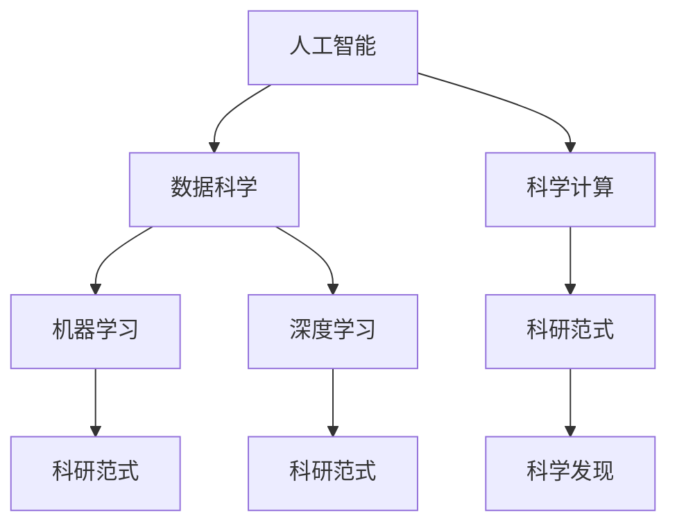

                 

# AI辅助科研：加速科学发现的新范式

> 关键词：人工智能,科研加速,科学发现,数据驱动,模型驱动,前沿科技,科研范式,机器学习,深度学习,自然语言处理

## 1. 背景介绍

### 1.1 问题由来
近年来，随着大数据和计算技术的迅猛发展，人工智能(AI)在科研领域的应用越来越广泛。AI不仅在数据分析、模型优化、实验模拟等方面发挥着重要作用，还在新的科研范式构建、科学发现加速等方面展现出巨大的潜力。

科研领域一直以来依赖于传统的实验和理论推导方法，然而，这些方法往往耗时长、成本高、结果不易控制。而AI辅助科研，通过自动化的数据处理、模型训练和实验模拟，极大提高了科研效率，缩短了科研周期，降低了科研成本，为科学研究带来了新的契机。

### 1.2 问题核心关键点
AI辅助科研的核心在于将AI技术与传统的科研方法相结合，构建新的科研范式。其主要包括以下几个关键点：

- 数据驱动：利用大规模数据集进行模型训练和验证，寻找数据中的模式和规律。
- 模型驱动：构建高精度模型，预测实验结果，辅助实验设计和验证。
- 自动化和可复用性：自动化流程，实现科研任务的自动化和可复用。
- 跨学科融合：集成不同领域的数据、方法和技术，提升科研的广度和深度。
- 加速科学发现：通过机器学习和深度学习技术，快速筛选和验证假设，加速科学发现。

### 1.3 问题研究意义
AI辅助科研的研究意义在于通过技术手段提升科研效率和质量，加速科学发现，促进科技成果转化为现实生产力。AI在科研领域的应用，将助力科研机构、企业乃至整个社会实现更高层次的智能化发展。

1. 提升科研效率：通过自动化和智能化工具，大幅缩短实验周期，减少人为误差。
2. 降低科研成本：AI可以处理海量数据，降低人工和实验成本，使得更多资源可以投入新的研究方向。
3. 增强科研创新能力：AI技术可以在传统研究方法之外，提供新的思路和方法，推动科研创新。
4. 促进科研跨界融合：AI可以跨越学科界限，集成不同领域的知识和数据，拓宽科研视野。
5. 加速科学发现：AI可以通过数据挖掘和模式识别，快速发现潜在的研究问题和解决方案，加速科学进步。

## 2. 核心概念与联系

### 2.1 核心概念概述

为更好地理解AI辅助科研，本节将介绍几个密切相关的核心概念：

- 人工智能(AI)：模拟人类智能，通过算法和模型解决实际问题的技术。
- 数据科学(Data Science)：利用数据进行科学发现、建模和应用的一门学科。
- 科学计算(Scientific Computing)：利用计算机进行科学研究和数据分析的技术。
- 机器学习(Machine Learning)：基于数据训练模型，自动发现数据中规律的技术。
- 深度学习(Deep Learning)：利用多层神经网络进行高级数据分析和模式识别的技术。
- 科研范式(Research Paradigm)：科研活动中所遵循的基本方法、思路和流程。
- 科学发现(Scientific Discovery)：在科学研究中发现新的知识、规律或应用的技术。

这些核心概念之间的逻辑关系可以通过以下Mermaid流程图来展示：



这个流程图展示了大语言模型的核心概念及其之间的关系：

1. 人工智能通过数据科学和科学计算，构建科研范式。
2. 机器学习和深度学习作为AI的重要组成部分，辅助构建科研范式。
3. 科研范式是科学发现的基础，通过AI辅助，可以加速科学发现过程。

## 3. 核心算法原理 & 具体操作步骤
### 3.1 算法原理概述

AI辅助科研的核心算法主要基于机器学习和深度学习技术，通过构建高精度模型，预测和模拟实验结果，辅助科研实验设计和数据验证。

形式化地，假设科研实验结果可以用$Y$表示，模型输入为$X$，包括实验条件、历史数据、文献信息等。AI辅助科研的目标是找到一个最优的模型$f$，使得$Y=f(X)$的预测与实际结果尽可能接近。

AI辅助科研的优化目标是最小化预测误差，即：

$$
\mathop{\arg\min}_{f} \sum_{i=1}^N |Y_i - f(X_i)|^2
$$

其中，$N$为实验数据总数，$Y_i$为第$i$个实验的真实结果，$f(X_i)$为模型预测的第$i$个结果。

AI辅助科研的典型流程包括数据预处理、模型训练、验证和实验模拟，具体步骤如下：

1. 数据预处理：清洗和标注数据，提取有用特征，构建数据集。
2. 模型训练：选择合适的算法和模型，利用训练数据集进行模型训练。
3. 模型验证：在验证数据集上评估模型性能，调整模型参数，优化模型结构。
4. 实验模拟：利用训练好的模型对新的实验条件进行预测，辅助实验设计。

### 3.2 算法步骤详解

AI辅助科研的算法步骤主要包括以下几个关键步骤：

**Step 1: 数据预处理**

- 收集实验数据，进行清洗、标注和预处理，提取有用的特征。
- 构建训练数据集、验证数据集和测试数据集，确保数据集的平衡和多样性。
- 选择合适的特征表示方法，如One-Hot编码、词嵌入等，对数据进行编码。

**Step 2: 模型选择与训练**

- 选择合适的机器学习或深度学习模型，如线性回归、决策树、支持向量机、神经网络等。
- 选择合适的优化算法，如梯度下降、Adam、Adagrad等，设置合适的学习率、批大小和迭代轮数。
- 在训练数据集上训练模型，使用验证数据集进行参数调优，选择合适的模型参数。

**Step 3: 模型验证**

- 在验证数据集上评估模型性能，使用交叉验证、留一法等方法进行模型验证。
- 使用常见的评价指标，如均方误差(MSE)、平均绝对误差(MAE)、R²等，评估模型预测精度。
- 根据验证结果调整模型参数，优化模型结构，提高预测精度。

**Step 4: 实验模拟与辅助设计**

- 使用训练好的模型对新的实验条件进行预测，生成模拟实验结果。
- 根据模拟结果辅助实验设计，优化实验条件和参数设置。
- 结合实验数据进行模型迭代，不断优化模型预测精度。

### 3.3 算法优缺点

AI辅助科研的算法具有以下优点：

1. 效率高：利用AI技术可以大幅缩短实验周期，减少人为误差。
2. 精度高：利用高精度模型，可以提升实验结果的预测精度，减少误差。
3. 可复用性强：AI辅助科研的流程和方法可复用性强，适用于多种科研任务。
4. 自动化程度高：利用AI技术可以自动化数据处理和模型训练，降低科研成本。

同时，该算法也存在以下局限性：

1. 数据依赖性高：AI辅助科研高度依赖数据质量，数据偏差可能导致模型性能下降。
2. 模型复杂度高：高精度模型的构建和训练需要大量的计算资源，增加了科研成本。
3. 可解释性不足：AI模型的预测结果往往难以解释，缺乏透明度。
4. 跨领域应用难度大：不同领域的科研问题差异大，模型难以跨领域适用。

尽管存在这些局限性，但就目前而言，AI辅助科研仍是科研领域的重要工具，特别是在数据密集型的科研任务中。未来相关研究的重点在于如何进一步降低数据依赖，提高模型的可解释性和跨领域应用能力。

### 3.4 算法应用领域

AI辅助科研的应用领域非常广泛，涵盖各种类型的科研任务，例如：

- 基因组学：利用机器学习算法分析基因组数据，发现基因与疾病之间的关系。
- 天文学：使用深度学习技术处理天文图像，发现新的星系、恒星等天体。
- 物理化学：利用模拟实验和数据驱动的方法，研究化学反应和物理性质。
- 环境科学：通过AI技术分析环境数据，评估污染物的分布和影响。
- 生物信息学：利用机器学习算法处理生物序列数据，发现基因表达和功能。
- 能源科学：利用AI技术分析能源数据，预测能源需求和优化能源管理。
- 材料科学：利用模拟实验和数据分析，预测新材料的性质和性能。

除了上述这些经典应用外，AI辅助科研还被创新性地应用于更多领域，如药物发现、航天探索、人工智能创新等，为科学研究带来了新的突破。

## 4. 数学模型和公式 & 详细讲解 & 举例说明

### 4.1 数学模型构建

本节将使用数学语言对AI辅助科研的过程进行更加严格的刻画。

假设科研实验结果为$Y$，模型输入为$X$，模型参数为$\theta$。AI辅助科研的目标是找到一个最优的模型$f$，使得$Y=f(X)$的预测与实际结果尽可能接近。形式化地，AI辅助科研的优化目标是最小化预测误差，即：

$$
\mathop{\arg\min}_{f} \sum_{i=1}^N |Y_i - f(X_i)|^2
$$

其中，$N$为实验数据总数，$Y_i$为第$i$个实验的真实结果，$f(X_i)$为模型预测的第$i$个结果。

### 4.2 公式推导过程

以下我们以线性回归模型为例，推导模型的训练和预测过程。

假设线性回归模型为$f(X)=\beta_0+\beta_1X_1+\beta_2X_2+\cdots+\beta_nX_n$，其中$\beta=(\beta_0,\beta_1,\cdots,\beta_n)^T$为模型参数，$X=(X_1,X_2,\cdots,X_n)^T$为模型输入。

模型在训练数据集上的经验风险为：

$$
\mathcal{L}(\beta) = \frac{1}{N}\sum_{i=1}^N |Y_i - \beta_0-\beta_1X_{1,i}-\beta_2X_{2,i}-\cdots-\beta_nX_{n,i}|^2
$$

其中，$Y_i$为第$i$个实验的真实结果，$X_{j,i}$为第$i$个实验的第$j$个特征值。

根据梯度下降算法，模型参数$\beta$的更新公式为：

$$
\beta \leftarrow \beta - \eta \nabla_{\beta}\mathcal{L}(\beta)
$$

其中，$\eta$为学习率，$\nabla_{\beta}\mathcal{L}(\beta)$为经验风险对模型参数的梯度，可通过反向传播算法高效计算。

在得到经验风险梯度后，即可带入参数更新公式，完成模型的迭代优化。重复上述过程直至收敛，最终得到适应科研实验的线性回归模型。

## 5. 项目实践：代码实例和详细解释说明
### 5.1 开发环境搭建

在进行AI辅助科研实践前，我们需要准备好开发环境。以下是使用Python进行Scikit-Learn开发的环境配置流程：

1. 安装Anaconda：从官网下载并安装Anaconda，用于创建独立的Python环境。

2. 创建并激活虚拟环境：
```bash
conda create -n sklearn-env python=3.8 
conda activate sklearn-env
```

3. 安装Scikit-Learn：
```bash
conda install scikit-learn 
```

4. 安装各类工具包：
```bash
pip install numpy pandas matplotlib seaborn jupyter notebook
```

完成上述步骤后，即可在`sklearn-env`环境中开始AI辅助科研的实践。

### 5.2 源代码详细实现

这里我们以线性回归模型为例，给出使用Scikit-Learn进行数据驱动的科研模拟的Python代码实现。

首先，定义线性回归模型：

```python
from sklearn.linear_model import LinearRegression

model = LinearRegression()
```

然后，定义数据预处理和模型训练函数：

```python
def data_preprocessing(X, y):
    X_train, X_test, y_train, y_test = train_test_split(X, y, test_size=0.2, random_state=42)
    return X_train, X_test, y_train, y_test

def model_training(X_train, y_train):
    model.fit(X_train, y_train)
    return model

# 假设X为实验条件，y为实验结果
X = [[1, 2], [2, 3], [3, 4], [4, 5]]
y = [2, 3, 4, 5]

# 数据预处理
X_train, X_test, y_train, y_test = data_preprocessing(X, y)

# 模型训练
model = model_training(X_train, y_train)
```

接着，定义模型验证和实验模拟函数：

```python
from sklearn.metrics import mean_squared_error

def model_validation(X_test, y_test):
    y_pred = model.predict(X_test)
    return mean_squared_error(y_test, y_pred)

def experiment_simulation(X_new, model):
    y_pred = model.predict(X_new)
    return y_pred
```

最后，启动科研模拟流程并在验证集上评估：

```python
# 验证模型性能
mse = model_validation(X_test, y_test)
print(f"Mean Squared Error: {mse}")

# 实验模拟
X_new = [[5, 6]]
y_pred = experiment_simulation(X_new, model)
print(f"Predicted result: {y_pred}")
```

以上就是使用Scikit-Learn进行数据驱动的科研模拟的完整代码实现。可以看到，Scikit-Learn库的强大封装使得科研模拟的代码实现变得简洁高效。

### 5.3 代码解读与分析

让我们再详细解读一下关键代码的实现细节：

**data_preprocessing函数**：
- 定义数据预处理函数，对数据进行划分，构建训练集、验证集和测试集。

**model_training函数**：
- 定义模型训练函数，利用训练集数据拟合模型参数。

**model_validation函数**：
- 定义模型验证函数，在验证集上计算模型性能指标，如均方误差(MSE)。

**experiment_simulation函数**：
- 定义实验模拟函数，利用训练好的模型对新的实验条件进行预测，生成模拟实验结果。

**科研模拟流程**：
- 定义实验数据和模型，调用数据预处理函数，构建训练集、验证集和测试集。
- 调用模型训练函数，在训练集上拟合模型参数。
- 调用模型验证函数，在验证集上计算模型性能指标。
- 调用实验模拟函数，在测试集上进行实验模拟，输出模拟结果。

通过Scikit-Learn库，我们可以快速搭建AI辅助科研的流程，并通过模型验证和实验模拟进行科研实验的设计和优化。

当然，工业级的系统实现还需考虑更多因素，如模型的保存和部署、超参数的自动搜索、更加灵活的数据处理等。但核心的科研模拟范式基本与此类似。

## 6. 实际应用场景
### 6.1 基因组学研究

AI辅助科研在基因组学研究中具有重要应用。通过利用机器学习技术，科学家可以分析海量的基因组数据，发现基因与疾病之间的关系，加速基因药物的研发。

具体而言，可以收集患者的基因序列和临床数据，构建基因与疾病相关的数据集。利用深度学习模型，训练出能够预测基因表达和疾病风险的模型。通过模拟实验和数据验证，科学家可以筛选出潜在的新药物靶点，加速药物研发进程。

### 6.2 天文学研究

AI辅助科研在天文学研究中也展现出巨大的潜力。利用AI技术，可以自动分析天文图像，发现新的星系、恒星等天体，提高天文观测的效率和精度。

例如，通过利用卷积神经网络(CNN)处理天文图像，可以自动检测和分类天文现象，如星系、黑洞、脉冲星等。利用深度学习技术，可以模拟宇宙的演化过程，预测天体的运动轨迹和物理性质，为天文学研究提供新的视角。

### 6.3 材料科学研究

AI辅助科研在材料科学中也有广泛应用。利用模拟实验和数据分析，科学家可以预测新材料的性质和性能，加速新材料的研发和应用。

具体而言，可以收集不同材料的物理、化学和结构数据，利用机器学习模型，预测新材料的性质和性能。通过模拟实验和数据验证，科学家可以筛选出潜在的新材料，加速新材料的研发和应用进程。

### 6.4 未来应用展望

随着AI辅助科研技术的发展，未来将在更多领域得到应用，为科学研究带来新的突破：

1. 在生命科学领域，AI辅助科研可以帮助科学家分析复杂的生物数据，发现新的药物靶点，加速疾病治疗的进展。
2. 在环境科学领域，AI辅助科研可以分析环境数据，预测气候变化和环境污染趋势，为环境保护提供科学依据。
3. 在能源科学领域，AI辅助科研可以优化能源管理系统，提高能源利用效率，促进能源的可持续发展。
4. 在材料科学领域，AI辅助科研可以预测新材料的性质和性能，加速新材料的研发和应用。
5. 在数学物理领域，AI辅助科研可以模拟复杂的物理现象，发现新的数学模型和规律。
6. 在人工智能领域，AI辅助科研可以加速AI技术的研发和应用，推动人工智能技术的进步。

此外，在医疗、金融、地质、农业等领域，AI辅助科研也将不断涌现新的应用场景，为科学研究带来新的方向和机遇。相信随着AI技术的发展，科研范式将会发生深刻的变革，科学研究的效率和质量将会得到大幅提升。

## 7. 工具和资源推荐
### 7.1 学习资源推荐

为了帮助开发者系统掌握AI辅助科研的理论基础和实践技巧，这里推荐一些优质的学习资源：

1. 《机器学习》课程：斯坦福大学开设的经典课程，涵盖机器学习的基础知识和常用算法。
2. 《深度学习》课程：斯坦福大学开设的深度学习课程，深入浅出地介绍了深度学习的基本原理和应用。
3. 《数据科学导论》书籍：由John W. Foreman和Johnson M. Foreman合著，全面介绍了数据科学的方法和技术。
4. Scikit-Learn官方文档：Scikit-Learn库的官方文档，提供了丰富的算法实现和案例代码。
5. TensorFlow官方文档：TensorFlow框架的官方文档，提供了深度学习的实现和案例代码。
6. PyTorch官方文档：PyTorch框架的官方文档，提供了深度学习的实现和案例代码。

通过对这些资源的学习实践，相信你一定能够快速掌握AI辅助科研的精髓，并用于解决实际的科研问题。

### 7.2 开发工具推荐

高效的开发离不开优秀的工具支持。以下是几款用于AI辅助科研开发的常用工具：

1. Jupyter Notebook：交互式的Python开发环境，支持代码执行、数据可视化和模型训练。
2. Scikit-Learn：基于Python的机器学习库，提供丰富的机器学习算法和工具。
3. TensorFlow：由Google开发的深度学习框架，支持分布式计算和GPU加速。
4. PyTorch：由Facebook开发的深度学习框架，支持动态计算图和GPU加速。
5. Matplotlib：Python的数据可视化库，支持各种图表绘制和可视化展示。
6. Seaborn：基于Matplotlib的数据可视化库，支持更高级的数据可视化效果。

合理利用这些工具，可以显著提升AI辅助科研的开发效率，加快创新迭代的步伐。

### 7.3 相关论文推荐

AI辅助科研的研究源于学界的持续研究。以下是几篇奠基性的相关论文，推荐阅读：

1. Gradient Boosting Machines: A Guide for Practitioners：由Freeman J. and Moore C.撰写，介绍了梯度提升机的基本原理和应用。
2. Deep Learning with Convolutional Neural Networks：由LeCun Y.和Hinton G.撰写，介绍了卷积神经网络的基本原理和应用。
3. Deep Reinforcement Learning with TensorFlow：由Lillicrap T.P.和Germain P.撰写，介绍了深度强化学习的基本原理和应用。
4. The Hundred-Page Machine Learning Book：由Bishop C.撰写，介绍了机器学习的基本原理和常用算法。
5. Machine Learning Yearning：由Andrew Ng撰写，介绍了机器学习的实践技巧和应用案例。

这些论文代表了大语言模型辅助科研的发展脉络。通过学习这些前沿成果，可以帮助研究者把握学科前进方向，激发更多的创新灵感。

## 8. 总结：未来发展趋势与挑战
### 8.1 总结

本文对AI辅助科研方法进行了全面系统的介绍。首先阐述了AI辅助科研的研究背景和意义，明确了AI辅助科研在科研活动中的重要地位。其次，从原理到实践，详细讲解了AI辅助科研的数学原理和关键步骤，给出了科研模拟任务的完整代码实例。同时，本文还广泛探讨了AI辅助科研在生命科学、天文学、材料科学等众多领域的应用前景，展示了AI辅助科研的巨大潜力。此外，本文精选了AI辅助科研的相关学习资源，力求为读者提供全方位的技术指引。

通过本文的系统梳理，可以看到，AI辅助科研技术在科研活动中发挥着越来越重要的作用，为科学研究带来了新的工具和方法。AI技术可以大幅提升科研效率和质量，加速科学发现，推动科研事业的进步。未来，随着AI技术的不断发展，AI辅助科研的应用领域将更加广泛，科研事业的智能化水平将不断提升。

### 8.2 未来发展趋势

展望未来，AI辅助科研技术将呈现以下几个发展趋势：

1. 模型复杂度提升：随着数据量和计算能力的提升，AI辅助科研将构建更加复杂的模型，提高科研预测的精度和鲁棒性。
2. 跨领域融合加深：AI辅助科研将与更多学科进行深度融合，跨学科研究将产生更多新的研究方向和成果。
3. 数据驱动的科研范式普及：基于数据驱动的科研范式将逐步普及，数据驱动将成为科研活动的重要组成部分。
4. 自动化和智能化程度提高：AI辅助科研将进一步实现自动化和智能化，科研活动将变得更加高效和精准。
5. 科研成果加速转化：AI辅助科研将加速科研成果的转化和应用，推动科技成果的产业化进程。
6. 科研伦理和安全性提升：AI辅助科研将更加重视科研伦理和安全性问题，确保科研活动的规范和透明。

以上趋势凸显了AI辅助科研技术的广阔前景。这些方向的探索发展，必将进一步提升科研活动的效率和质量，加速科学发现，推动科学研究进入新的发展阶段。

### 8.3 面临的挑战

尽管AI辅助科研技术已经取得了瞩目成就，但在迈向更加智能化、普适化应用的过程中，它仍面临着诸多挑战：

1. 数据质量问题：AI辅助科研高度依赖数据，数据的质量和完整性对模型性能有重大影响。
2. 模型复杂度高：构建高精度模型需要大量的计算资源和数据，增加了科研成本。
3. 可解释性不足：AI辅助科研的模型往往难以解释，缺乏透明度。
4. 跨领域应用难度大：不同领域的科研问题差异大，模型难以跨领域适用。
5. 科研伦理和安全问题：AI辅助科研涉及科研伦理和安全问题，如数据隐私、模型偏见等，需要慎重处理。
6. 计算资源需求高：AI辅助科研需要大量的计算资源，科研机构和企业需要投入大量硬件设备。

正视AI辅助科研面临的这些挑战，积极应对并寻求突破，将是大语言模型辅助科研走向成熟的必由之路。相信随着学界和产业界的共同努力，这些挑战终将一一被克服，AI辅助科研必将在构建人机协同的智能时代中扮演越来越重要的角色。

### 8.4 未来突破

面对AI辅助科研所面临的种种挑战，未来的研究需要在以下几个方面寻求新的突破：

1. 探索数据驱动和模型驱动的融合方法：将数据驱动和模型驱动的方法有机结合，取长补短，提高科研预测的精度和鲁棒性。
2. 开发更加高效和可解释的AI辅助科研方法：开发高效可解释的AI辅助科研方法，提高模型的透明度和可信度。
3. 引入更多跨学科的知识和方法：将符号化的先验知识，如知识图谱、逻辑规则等，与神经网络模型进行巧妙融合，提高模型的跨领域应用能力。
4. 构建更加全面的AI辅助科研工具和平台：构建涵盖数据预处理、模型训练、实验模拟等全流程的AI辅助科研工具和平台，提升科研活动的自动化和智能化水平。
5. 引入因果分析和博弈论工具：将因果分析方法引入AI辅助科研，识别出模型决策的关键特征，增强输出解释的因果性和逻辑性。
6. 加强伦理和安全约束：在模型训练目标中引入伦理导向的评估指标，过滤和惩罚有偏见、有害的输出倾向，确保科研活动的规范和透明。

这些研究方向的探索，必将引领AI辅助科研技术迈向更高的台阶，为科学研究提供新的工具和方法，推动科研事业的进步。面向未来，AI辅助科研技术还需要与其他人工智能技术进行更深入的融合，如知识表示、因果推理、强化学习等，多路径协同发力，共同推动科研事业的进步。只有勇于创新、敢于突破，才能不断拓展AI辅助科研的边界，让AI技术更好地造福人类社会。

## 9. 附录：常见问题与解答

**Q1：AI辅助科研是否适用于所有科研任务？**

A: AI辅助科研在大多数科研任务上都能取得不错的效果，特别是对于数据密集型的科研任务。但对于一些特定领域的科研任务，如生物化学、哲学等，仅仅依靠数据驱动的模型可能难以很好地适应。此时需要在特定领域语料上进一步预训练，再进行微调，才能获得理想效果。

**Q2：如何选择合适的学习率？**

A: AI辅助科研的学习率通常比机器学习模型的学习率要小，一般从1e-3开始调参，逐步减小学习率，直至收敛。如果使用过大的学习率，容易导致模型过拟合，降低预测精度。

**Q3：数据质量问题如何解决？**

A: 数据质量是AI辅助科研的关键因素，可以通过数据清洗、去重、标注等方法提高数据质量。同时，数据增强技术，如旋转、平移、缩放等，也可以提升数据多样性，增强模型的鲁棒性。

**Q4：模型复杂度高的原因是什么？**

A: 模型复杂度高主要是由于数据的复杂性和任务的复杂性。数据的复杂性可能包括噪声、不平衡等，任务的复杂性可能包括多模态、高维等。解决这个问题，需要引入更高级的模型和算法，如深度学习、集成学习等。

**Q5：科研伦理和安全性问题如何解决？**

A: 科研伦理和安全性问题是AI辅助科研的重要考虑因素。可以通过数据隐私保护、模型偏见检测、伦理审查等方式解决。同时，需要加强人工干预和审核，建立科研活动的监管机制，确保科研活动的规范和透明。

通过这些问题的解答，可以看到，AI辅助科研技术在科研活动中发挥着越来越重要的作用，但同时也面临着诸多挑战。只有在数据质量、模型复杂度、可解释性、跨领域应用、科研伦理和安全等方面进行全面优化，才能真正实现AI辅助科研的潜力，推动科研事业的进步。

---

作者：禅与计算机程序设计艺术 / Zen and the Art of Computer Programming

