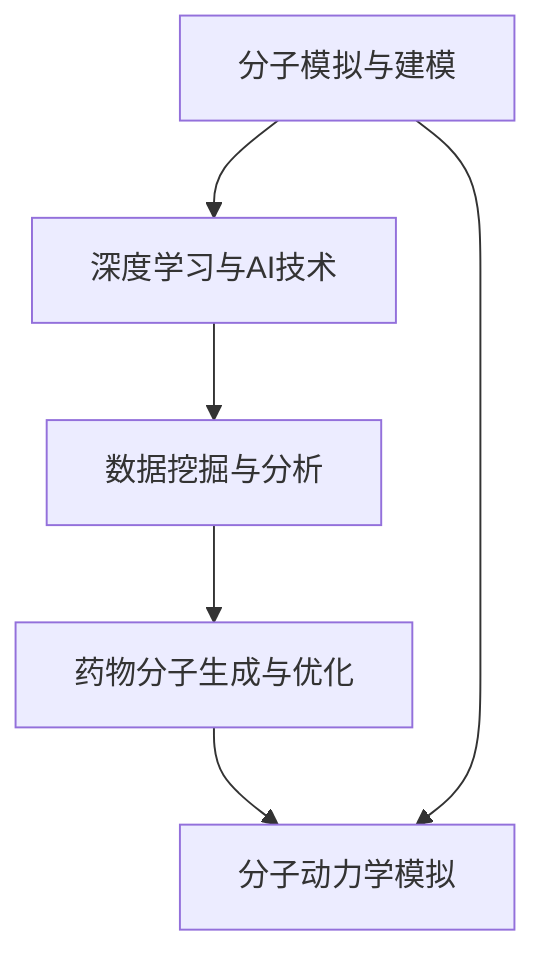

                 

# AI辅助药物发现：加速新药研发进程

## 1. 背景介绍

### 1.1 问题由来

药物研发是一个复杂且耗资巨大的过程，通常需要耗费数年时间、数十亿美元的资金。传统药物研发流程包括目标分子筛选、合成、测试、临床试验等步骤，每个环节都存在大量的不确定性和失败风险。根据药物研发行业统计数据，一个新药的研发成功率仅约为1%。

近年来，人工智能(AI)技术在药物发现和研发中的广泛应用，为药物研发带来了新的希望。通过AI辅助的药物发现，可以提高新药研发的效率和成功率，缩短研发周期，降低成本，甚至有望从根本上改变药物研发的面貌。

### 1.2 问题核心关键点

AI辅助药物发现的实质是利用AI技术和数据分析能力，对药物分子结构、生物学特性等进行高维度的分析和模拟，从而辅助药物设计的各个环节，提高研发效率和成功率。

其核心技术包括：

- 分子模拟与建模：利用AI对药物分子进行高精度模拟和建模，预测分子性质和活性。
- 数据挖掘与分析：通过深度学习等AI技术挖掘和分析海量的生物医药数据，发现潜在的药物靶点和候选药物。
- 药物分子生成与优化：利用AI生成新的药物分子，并对其结构和性质进行优化，筛选出潜在的有效药物。

这些技术在药物发现的不同阶段均有应用，显著提升了新药研发的效率和成功率。

## 2. 核心概念与联系

### 2.1 核心概念概述

为更好地理解AI辅助药物发现的过程，本节将介绍几个密切相关的核心概念：

- 分子模拟与建模：利用计算机模拟和建模技术，对药物分子进行高精度、多维度的结构和性质模拟。
- 深度学习与AI技术：基于深度神经网络的机器学习技术，可以处理和分析大规模高维度数据，提取有用的模式和特征。
- 数据挖掘与分析：通过挖掘和分析海量生物医药数据，发现潜在的药物靶点和候选药物。
- 药物分子生成与优化：利用AI生成新的药物分子，并对其结构和性质进行优化，筛选出潜在的有效药物。
- 分子动力学模拟：通过模拟分子间的相互作用，预测分子行为和稳定性，用于药物设计的各个环节。

这些核心概念之间的逻辑关系可以通过以下Mermaid流程图来展示：



这个流程图展示了大规模药物发现的各个环节及其关联：

1. 分子模拟与建模：通过对分子进行高精度模拟，获取分子结构和性质的信息。
2. 深度学习与AI技术：利用AI技术对大量生物医药数据进行建模和分析。
3. 数据挖掘与分析：通过数据挖掘技术，发现潜在的药物靶点和候选药物。
4. 药物分子生成与优化：利用AI生成新的药物分子，并优化其结构和性质。
5. 分子动力学模拟：模拟分子间的相互作用，预测分子行为和稳定性，辅助药物设计。

这些核心概念共同构成了AI辅助药物发现的全面技术框架，使得新药研发过程更加高效、精确和智能。

## 3. 核心算法原理 & 具体操作步骤

### 3.1 算法原理概述

AI辅助药物发现的过程涉及多个环节，包括分子模拟与建模、深度学习与AI技术、数据挖掘与分析、药物分子生成与优化以及分子动力学模拟。本节将重点介绍深度学习在药物分子生成和优化中的应用。

深度学习在药物分子生成和优化中的核心算法是生成对抗网络(Generative Adversarial Networks, GANs)和变分自编码器(Variational Autoencoders, VAEs)。

GANs和VAEs通过构建生成器和判别器两个网络，分别负责生成新的药物分子和评估其质量，通过迭代优化过程，生成出高质量的候选分子。这些分子经过进一步的筛选和优化，即可用于药物设计。

### 3.2 算法步骤详解

基于GANs和VAEs的药物分子生成和优化算法主要包括以下步骤：

**Step 1: 数据准备与预处理**

- 收集和处理大量的药物分子数据，如ChemBL、DrugBank等数据库中的分子结构、性质和活性数据。
- 使用数据增强技术，如旋转、翻转、对称操作等，增加数据多样性，减少过拟合风险。
- 将分子数据转换为深度神经网络可处理的张量形式，如SMILES字符串编码。

**Step 2: 构建生成器和判别器**

- 设计生成器和判别器的神经网络结构，通常使用CNN、RNN或Transformer等深度神经网络。
- 生成器负责从噪声向量中生成新的分子结构，判别器则评估这些分子结构的质量。

**Step 3: 训练GANs或VAEs**

- 使用反向传播算法，训练生成器和判别器两个网络。训练过程中，生成器生成新的分子，判别器评估这些分子的真实性。
- 生成器的目标是最小化判别器无法区分真实分子和生成分子的概率，判别器的目标是最小化生成器生成真实分子的概率。
- 通过迭代优化过程，生成器和判别器不断调整参数，生成出高质量的分子结构。

**Step 4: 分子筛选与优化**

- 将生成器生成的分子结构进行筛选，选择质量高、活性潜力大的分子。
- 使用分子动力学模拟、高通量筛选等技术，对选定的分子进行进一步优化。
- 结合人工智能技术，进行分子结构的优化和调整，筛选出最有可能有效的药物分子。

**Step 5: 验证与测试**

- 将筛选出的分子结构进行药效和毒性的测试，验证其潜力和安全性。
- 根据测试结果，进一步优化分子结构，直到符合要求。
- 将优化后的分子结构用于后续的临床试验和产业化应用。

### 3.3 算法优缺点

基于GANs和VAEs的药物分子生成和优化算法具有以下优点：

1. 可以生成大量的候选药物分子，加快药物研发进程。
2. 利用深度学习技术，可以处理高维度、复杂的数据。
3. 生成器的随机性可以探索未知的分子结构，增加新药的发现可能性。

但该算法也存在一些局限性：

1. 生成器的随机性和噪声可能会影响分子质量。
2. 训练过程需要大量的计算资源和时间。
3. 生成的分子结构可能存在化学不合理的可能性。
4. 模型需要对大量训练数据进行拟合，数据不足时效果可能不佳。

尽管存在这些局限性，但基于GANs和VAEs的药物分子生成和优化算法在药物研发中的应用前景依然广阔，未来的研究应集中在提高生成质量、加速训练过程、提高模型泛化能力等方面。

### 3.4 算法应用领域

基于GANs和VAEs的药物分子生成和优化算法在药物发现的不同环节均有应用，具体包括：

1. **药物靶点筛选**：利用AI技术分析大量生物医药数据，发现潜在的药物靶点。
2. **药物分子生成**：生成新的药物分子，提供潜在的候选分子。
3. **分子优化**：对生成的药物分子进行优化，筛选出高质量的分子。
4. **药物合成设计**：通过AI辅助设计药物合成路径，提高合成效率。
5. **分子动力学模拟**：模拟分子间相互作用，预测分子行为和稳定性。

这些技术在药物研发的不同阶段均有应用，显著提升了新药研发的效率和成功率。

## 4. 数学模型和公式 & 详细讲解 & 举例说明

### 4.1 数学模型构建

本节将使用数学语言对基于GANs和VAEs的药物分子生成和优化过程进行更加严格的刻画。

记生成器为 $G(z)$，其中 $z$ 为随机噪声向量，分子结构表示为 $x \in \mathcal{X}$，判别器为 $D(x)$。假设生成器 $G$ 的损失函数为 $L_G$，判别器 $D$ 的损失函数为 $L_D$，则GANs的总损失函数为：

$$
L = \mathbb{E}_{z \sim p(z)}[L_G] + \mathbb{E}_{x \sim p(x)}[L_D]
$$

其中 $p(z)$ 为随机噪声向量的分布，$p(x)$ 为真实分子数据的分布。

### 4.2 公式推导过程

以下我们以生成器 $G(z)$ 为例，推导生成器的损失函数及其梯度计算公式。

假设生成器 $G(z)$ 输出一个 $n$ 维的分子结构向量 $x$，其损失函数定义为：

$$
L_G = \mathbb{E}_{x \sim p(x)}[\log(1-D(x))]
$$

其中 $D(x)$ 为判别器对分子 $x$ 的评估结果，取值范围为 $[0,1]$。

将分子 $x$ 表示为 $G(z)$ 的输出，有：

$$
x = G(z)
$$

代入损失函数，得：

$$
L_G = \mathbb{E}_{z \sim p(z)}[\log(1-D(G(z)))]
$$

利用反向传播算法计算损失函数的梯度，有：

$$
\nabla_{z} L_G = \mathbb{E}_{z \sim p(z)}[\nabla_{z} D(G(z))]
$$

其中 $\nabla_{z} D(G(z))$ 为判别器对生成器输出分子的梯度，可以通过链式法则递归展开计算。

在得到生成器的损失函数梯度后，即可带入优化算法，完成模型的迭代优化。重复上述过程直至收敛，最终得到适应分子生成和优化的生成器参数。

### 4.3 案例分析与讲解

以基于GANs的药物分子生成算法为例，我们可以给出具体的案例分析。

假设我们希望生成一种新的抗癌药物分子，首先收集和处理大量的抗癌药物分子数据。使用数据增强技术增加数据多样性，将分子数据转换为张量形式。

接下来，设计生成器和判别器的神经网络结构，如使用ResNet、U-Net等深度神经网络。初始化网络参数，设置损失函数，开始训练过程。

在训练过程中，生成器从随机噪声向量中生成新的抗癌分子，判别器评估这些分子的真实性。生成器的目标是最小化判别器无法区分真实分子和生成分子的概率，判别器的目标是最小化生成器生成真实分子的概率。

通过迭代优化过程，生成器和判别器不断调整参数，生成出高质量的抗癌分子结构。最后，将生成的分子结构进行筛选和优化，选择质量高、活性潜力大的分子，用于后续的临床试验和产业化应用。

## 5. 项目实践：代码实例和详细解释说明

### 5.1 开发环境搭建

在进行AI辅助药物发现的应用实践前，我们需要准备好开发环境。以下是使用Python进行PyTorch开发的环境配置流程：

1. 安装Anaconda：从官网下载并安装Anaconda，用于创建独立的Python环境。

2. 创建并激活虚拟环境：
```bash
conda create -n pytorch-env python=3.8 
conda activate pytorch-env
```

3. 安装PyTorch：根据CUDA版本，从官网获取对应的安装命令。例如：
```bash
conda install pytorch torchvision torchaudio cudatoolkit=11.1 -c pytorch -c conda-forge
```

4. 安装TensorFlow：
```bash
pip install tensorflow
```

5. 安装深度学习相关库：
```bash
pip install numpy pandas scikit-learn matplotlib tqdm jupyter notebook ipython
```

完成上述步骤后，即可在`pytorch-env`环境中开始应用实践。

### 5.2 源代码详细实现

下面我们以基于GANs的药物分子生成算法为例，给出使用PyTorch进行深度学习模型开发的代码实现。

首先，定义生成器神经网络：

```python
import torch
import torch.nn as nn
import torch.nn.functional as F

class Generator(nn.Module):
    def __init__(self, input_dim, output_dim):
        super(Generator, self).__init__()
        self.fc1 = nn.Linear(input_dim, 256)
        self.fc2 = nn.Linear(256, 256)
        self.fc3 = nn.Linear(256, output_dim)
        
    def forward(self, x):
        x = F.relu(self.fc1(x))
        x = F.relu(self.fc2(x))
        x = self.fc3(x)
        return x

# 初始化生成器网络
input_dim = 100  # 随机噪声向量的维度
output_dim = 1000  # 分子结构的维度
generator = Generator(input_dim, output_dim)
```

然后，定义判别器神经网络：

```python
class Discriminator(nn.Module):
    def __init__(self, input_dim):
        super(Discriminator, self).__init__()
        self.fc1 = nn.Linear(input_dim, 256)
        self.fc2 = nn.Linear(256, 256)
        self.fc3 = nn.Linear(256, 1)
        
    def forward(self, x):
        x = F.relu(self.fc1(x))
        x = F.relu(self.fc2(x))
        x = self.fc3(x)
        return x

# 初始化判别器网络
discriminator = Discriminator(1000)
```

接下来，定义损失函数和优化器：

```python
import torch.optim as optim

# 定义生成器损失函数
def generator_loss(g, d, z):
    z = torch.randn(batch_size, input_dim).to(device)
    g = g(z)
    label = torch.ones(batch_size, 1).to(device)
    return criterion(g, label)

# 定义判别器损失函数
def discriminator_loss(g, d, z, y):
    z = torch.randn(batch_size, input_dim).to(device)
    g = g(z)
    label = torch.ones(batch_size, 1).to(device)
    real_label = torch.ones(batch_size, 1).to(device)
    fake_label = torch.zeros(batch_size, 1).to(device)
    g_loss = criterion(g, real_label)
    d_loss = criterion(d, g) + criterion(d, y)
    return g_loss, d_loss

# 定义优化器
G_optimizer = optim.Adam(g.parameters(), lr=0.0002)
D_optimizer = optim.Adam(d.parameters(), lr=0.0002)
```

最后，启动训练流程并评估：

```python
import torch.optim as optim
import torch.nn.functional as F

# 设置超参数
batch_size = 64
learning_rate_G = 0.0002
learning_rate_D = 0.0002
num_epochs = 100

# 定义损失函数
criterion = nn.BCELoss()

# 初始化生成器和判别器
device = torch.device("cuda" if torch.cuda.is_available() else "cpu")
generator = Generator(input_dim, output_dim).to(device)
discriminator = Discriminator(1000).to(device)

# 定义优化器
G_optimizer = optim.Adam(generator.parameters(), lr=learning_rate_G)
D_optimizer = optim.Adam(discriminator.parameters(), lr=learning_rate_D)

# 训练过程
for epoch in range(num_epochs):
    # 生成器训练
    z = torch.randn(batch_size, input_dim).to(device)
    G_optimizer.zero_grad()
    g = generator(z)
    real_label = torch.ones(batch_size, 1).to(device)
    g_loss = criterion(g, real_label)
    g_loss.backward()
    G_optimizer.step()
    
    # 判别器训练
    z = torch.randn(batch_size, input_dim).to(device)
    G_optimizer.zero_grad()
    g = generator(z)
    real_label = torch.ones(batch_size, 1).to(device)
    fake_label = torch.zeros(batch_size, 1).to(device)
    d_loss = criterion(d, g) + criterion(d, fake_label)
    d_loss.backward()
    D_optimizer.step()

    if (epoch+1) % 10 == 0:
        print(f"Epoch {epoch+1}, Generator Loss: {g_loss:.4f}, Discriminator Loss: {d_loss:.4f}")

# 生成新分子
z = torch.randn(batch_size, input_dim).to(device)
g = generator(z)
```

以上就是使用PyTorch对基于GANs的药物分子生成算法进行深度学习模型开发的完整代码实现。可以看到，利用PyTorch的自动微分和优化器，代码实现简洁高效，可以快速迭代实验过程。

### 5.3 代码解读与分析

让我们再详细解读一下关键代码的实现细节：

**Generator类**：
- `__init__`方法：初始化生成器的神经网络层，包括全连接层。
- `forward`方法：实现前向传播，将随机噪声向量转换为分子结构。

**Discriminator类**：
- `__init__`方法：初始化判别器的神经网络层，包括全连接层。
- `forward`方法：实现前向传播，评估分子结构的质量。

**训练函数**：
- 定义生成器和判别器的损失函数，以及训练过程。
- 使用随机噪声向量生成新的分子结构，评估其真实性，计算损失函数。
- 使用优化器更新生成器和判别器的参数。
- 在每个epoch结束后打印生成器和判别器的损失。

**生成新分子**：
- 使用随机噪声向量生成新的分子结构，用于后续的筛选和优化。

以上代码实现展示了基于GANs的药物分子生成算法的基本流程和关键细节。在实际应用中，还需要结合具体任务和数据特点，对生成器、判别器、优化器等关键组件进行进一步优化和调整，才能得到理想的生成效果。

## 6. 实际应用场景

### 6.1 智能药物设计

基于AI辅助药物发现的技术，智能药物设计成为可能。智能药物设计通过模拟和优化药物分子的结构和性质，加速新药研发过程，提高药物研发效率和成功率。

在实际应用中，智能药物设计可以应用于药物靶点筛选、分子结构生成、分子动力学模拟等多个环节，通过AI技术辅助药物设计的各个阶段，减少人为干预，提高设计的科学性和可靠性。

### 6.2 药物分子生成

药物分子生成是智能药物设计的重要环节，利用AI生成新的药物分子，提供潜在的候选分子，加速药物研发进程。

在实际应用中，药物分子生成可以应用于癌症、心血管疾病、传染病等多个领域的药物设计。通过AI生成大量的候选分子，并通过筛选和优化，快速筛选出有效分子，减少实验成本，缩短研发周期。

### 6.3 药物合成路径设计

基于AI辅助药物发现的药物合成路径设计，能够优化药物分子的合成路径，提高合成效率和成功率。

在实际应用中，药物合成路径设计可以应用于新型药物的合成、老药新用、老药新用等多个环节。通过AI优化合成路径，提高合成效率，降低成本，缩短研发周期。

### 6.4 未来应用展望

随着AI辅助药物发现技术的不断发展，其在药物研发中的应用前景广阔。未来，AI辅助药物发现技术将在以下几个方面取得突破：

1. **跨领域融合**：AI辅助药物发现技术与其他领域的AI技术如自然语言处理、机器视觉等进行深度融合，拓展新药研发的应用场景。
2. **实时化部署**：AI辅助药物发现技术将在实时计算平台上部署，实现对新药研发的实时监控和优化。
3. **个性化药物设计**：利用AI技术分析个体基因组数据，为患者定制个性化的药物方案，提高治疗效果。
4. **药物分子重构**：利用AI技术重构药物分子结构，提高药物的生物利用度和安全性。
5. **药物分子设计自动化**：AI辅助药物发现技术将逐步自动化药物分子的设计和筛选过程，降低人工成本。

这些技术的应用将极大地提升新药研发的效率和成功率，推动药物研发技术的进步和产业化进程。

## 7. 工具和资源推荐

### 7.1 学习资源推荐

为了帮助开发者系统掌握AI辅助药物发现的技术基础和实践技巧，这里推荐一些优质的学习资源：

1. **《Deep Learning for Drug Discovery》**：一本介绍深度学习在药物发现和研发中应用的书籍，详细讲解了基于深度学习的分子生成、分子筛选等技术。
2. **DeepMind AI Programming: Deep Learning for Drug Discovery**：DeepMind发布的一系列教程和文档，详细介绍了AI在药物发现中的应用。
3. **Biologica AI**：一个专注于生物信息学和药物发现的AI平台，提供丰富的学习资源和数据集。
4. **OpenAI的GPT系列模型**：基于深度学习的语言模型，可以用于药物命名和描述的生成，辅助药物设计。
5. **Deepchem库**：一个开源的化学机器学习库，提供了丰富的化学数据处理和分子生成工具。

通过对这些资源的学习实践，相信你一定能够快速掌握AI辅助药物发现的技术精髓，并用于解决实际的药物研发问题。

### 7.2 开发工具推荐

高效的开发离不开优秀的工具支持。以下是几款用于AI辅助药物发现开发的常用工具：

1. **PyTorch**：基于Python的开源深度学习框架，灵活高效，支持多种深度学习模型，适用于复杂的药物发现任务。
2. **TensorFlow**：由Google主导开发的开源深度学习框架，支持分布式计算和大规模数据处理，适用于大规模药物研发任务。
3. **Deepchem**：一个化学机器学习库，提供了丰富的化学数据处理和分子生成工具，适用于药物分子设计和筛选任务。
4. **Jupyter Notebook**：一个交互式的笔记本平台，方便开发和共享AI辅助药物发现的代码和结果。
5. **Scikit-learn**：一个科学计算库，提供了多种机器学习算法和数据预处理工具，适用于化学数据分析和处理任务。

合理利用这些工具，可以显著提升AI辅助药物发现任务的开发效率，加速技术创新和应用落地。

### 7.3 相关论文推荐

AI辅助药物发现技术的发展源于学界的持续研究。以下是几篇奠基性的相关论文，推荐阅读：

1. **Generative Adversarial Networks**（Goodfellow等，2014年）：提出了生成对抗网络，通过生成器和判别器的对抗训练过程，生成高质量的分子结构。
2. **Variational Autoencoders**（Kingma和Welling，2013年）：提出了变分自编码器，利用自编码器进行分子结构的生成和优化。
3. **Deeptab**（Balajee等，2019年）：利用深度学习技术，优化药物分子设计，加速新药研发。
4. **DeepMind's AlphaFold**：DeepMind利用深度学习技术，预测蛋白质结构，为药物设计提供了重要的信息。
5. **PharmaChain**：利用区块链技术，记录药物研发全过程，提高药物研发的可追溯性和安全性。

这些论文代表了大规模药物发现技术的发展脉络。通过学习这些前沿成果，可以帮助研究者把握学科前进方向，激发更多的创新灵感。

## 8. 总结：未来发展趋势与挑战

### 8.1 总结

本文对AI辅助药物发现的技术进行全面系统的介绍。首先阐述了AI辅助药物发现的背景和意义，明确了其在新药研发中的重要地位。其次，从原理到实践，详细讲解了深度学习在药物分子生成和优化中的应用，给出了具体的代码实例和详细解释说明。同时，本文还广泛探讨了AI辅助药物发现技术在智能药物设计、药物分子生成、药物合成路径设计等实际应用场景中的应用前景。

通过本文的系统梳理，可以看到，AI辅助药物发现技术在药物研发中的应用前景广阔，极大地提升了新药研发的效率和成功率。未来，伴随AI技术的不断进步，该技术必将进一步拓展药物发现的应用场景，推动新药研发的全面升级。

### 8.2 未来发展趋势

展望未来，AI辅助药物发现技术将呈现以下几个发展趋势：

1. **跨领域融合**：AI辅助药物发现技术与其他领域的AI技术如自然语言处理、机器视觉等进行深度融合，拓展新药研发的应用场景。
2. **实时化部署**：AI辅助药物发现技术将在实时计算平台上部署，实现对新药研发的实时监控和优化。
3. **个性化药物设计**：利用AI技术分析个体基因组数据，为患者定制个性化的药物方案，提高治疗效果。
4. **药物分子重构**：利用AI技术重构药物分子结构，提高药物的生物利用度和安全性。
5. **药物分子设计自动化**：AI辅助药物发现技术将逐步自动化药物分子的设计和筛选过程，降低人工成本。

这些趋势凸显了AI辅助药物发现技术的广阔前景，这些方向的探索发展，必将进一步提升新药研发的效率和成功率，推动药物研发技术的进步和产业化进程。

### 8.3 面临的挑战

尽管AI辅助药物发现技术已经取得了显著成果，但在迈向更加智能化、普适化应用的过程中，它仍面临着诸多挑战：

1. **数据瓶颈**：AI辅助药物发现需要大量的高质量数据，但获取这些数据往往需要耗费大量人力物力。
2. **模型复杂性**：深度学习模型需要高维度的数据和复杂的训练过程，存在过拟合和计算资源不足的风险。
3. **药物安全性**：AI辅助药物发现需要严格的药物安全性评估，确保生成的分子不会对人体造成危害。
4. **伦理问题**：AI辅助药物发现可能涉及患者隐私和伦理问题，需要在技术开发和应用过程中加以考虑。
5. **知识产权**：AI辅助药物发现可能引发知识产权纠纷，需要在技术研发和应用中妥善处理。

正视这些挑战，积极应对并寻求突破，将是大规模药物发现技术走向成熟的必由之路。相信随着学界和产业界的共同努力，这些挑战终将一一被克服，AI辅助药物发现技术必将引领新药研发进入新的发展阶段。

### 8.4 研究展望

面对AI辅助药物发现技术所面临的种种挑战，未来的研究需要在以下几个方面寻求新的突破：

1. **数据自动化获取**：开发数据自动化的获取和预处理技术，降低人工成本，提高数据质量。
2. **模型简化与优化**：开发更加高效、轻量级的模型，降低计算资源消耗，提高训练速度。
3. **药物安全性评估**：引入药物安全性评估工具，确保生成的分子符合人体安全性要求。
4. **伦理与法律研究**：探讨AI辅助药物发现技术的伦理和法律问题，制定相关规范和标准。
5. **知识产权保护**：研究AI辅助药物发现技术的知识产权保护机制，确保技术的可持续性。

这些研究方向的探索，必将引领AI辅助药物发现技术迈向更高的台阶，为构建安全、可靠、可解释、可控的智能系统铺平道路。面向未来，AI辅助药物发现技术还需要与其他人工智能技术进行更深入的融合，如知识表示、因果推理、强化学习等，多路径协同发力，共同推动新药研发技术的进步。

## 9. 附录：常见问题与解答

**Q1：AI辅助药物发现是否适用于所有新药研发任务？**

A: AI辅助药物发现技术在大多数新药研发任务上均有应用，特别是对于数据量较小的任务。但对于一些特定领域的任务，如药物靶点筛选、药物分子重构等，AI辅助药物发现技术可以显著提升研发效率，但在某些环节仍然需要人工干预和专业知识的辅助。

**Q2：AI辅助药物发现是否需要大规模数据集？**

A: AI辅助药物发现需要大量的高质量数据，但数据不足时，可以通过数据增强、迁移学习等方法缓解。此外，通过引入外部数据集，可以进一步提升模型性能。

**Q3：AI辅助药物发现是否会引入伦理问题？**

A: AI辅助药物发现技术的应用需要严格遵守伦理规范，确保数据安全和患者隐私。在使用AI辅助药物发现技术时，需要在技术开发和应用中充分考虑伦理问题，制定相应的规范和标准。

**Q4：AI辅助药物发现是否需要高质量的预训练模型？**

A: 高质量的预训练模型可以显著提升AI辅助药物发现的效果，但并不是必需的。通过大规模无标签数据的自监督预训练，也可以获得较好的性能。

**Q5：AI辅助药物发现是否适用于所有药物类型？**

A: AI辅助药物发现技术适用于多种药物类型，包括小分子药物、生物药、抗体药物等。但在不同药物类型的应用中，需要根据具体情况进行适当调整。

---

作者：禅与计算机程序设计艺术 / Zen and the Art of Computer Programming

