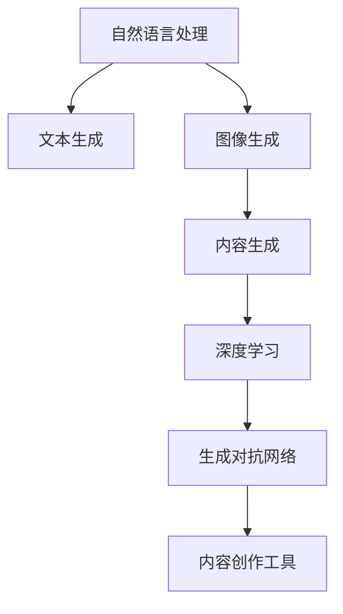

                 

# AI降低创作门槛的案例分析

> 关键词：AI创作、内容生成、创作工具、自然语言处理、深度学习、GAN

## 1. 背景介绍

在数字化的浪潮中，内容的创作与分发正逐渐从专业创作者的手中，转移到大众用户群体中。无论是博客、社交媒体、视频、音频，还是文学作品，创作的方式正在变得愈发丰富和多样化。AI技术，特别是自然语言处理（NLP）和生成对抗网络（GAN），在这场变革中扮演着重要的角色，不仅为内容创作者提供了强大的工具，同时也大大降低了创作门槛，让每个人都能成为内容创作者。

本文将深入探讨AI如何在内容创作领域降低门槛，并通过几个典型案例进行分析，揭示其背后的原理与技术实现细节。

## 2. 核心概念与联系

### 2.1 核心概念概述

为更好地理解AI在内容创作领域的作用，本节将介绍几个关键概念：

- **自然语言处理（NLP）**：涉及计算机科学、人工智能和语言学的交叉领域，旨在使计算机能够理解、处理和生成人类语言。NLP的核心技术包括分词、词性标注、句法分析、语义分析、机器翻译等。
- **生成对抗网络（GAN）**：一种生成模型，由生成器和判别器两部分组成。生成器通过学习大量真实数据的分布，生成逼真的合成数据；判别器则通过训练区分真实数据和合成数据，两者相互竞争提升，共同推动生成器生成更加逼真的数据。
- **内容生成**：指通过AI技术自动创作文本、图像、音频等内容的过程。内容生成技术应用广泛，包括自动摘要、新闻生成、文本翻译、图像生成等。
- **深度学习**：一种基于多层神经网络的机器学习方法，通过多层次特征提取和参数共享，显著提升了模型的性能。深度学习在图像识别、语音识别、自然语言处理等领域有广泛应用。
- **文本生成**：通过训练生成模型，从输入的随机向量生成自然语言文本的过程。文本生成技术可以用于自动摘要、对话生成、故事创作等。
- **图像生成**：通过训练生成模型，从输入的随机向量生成逼真图像的过程。图像生成技术可以用于艺术创作、虚拟形象设计、游戏场景构建等。

这些概念之间的逻辑关系可以通过以下Mermaid流程图来展示：



这个流程图展示了大语言模型创作内容的总体流程：

1. 通过自然语言处理技术，提取文本或图像的特征。
2. 利用生成对抗网络或深度学习模型，生成文本或图像内容。
3. 借助内容生成工具，将生成的内容应用于实际创作中。

## 3. 核心算法原理 & 具体操作步骤
### 3.1 算法原理概述

AI在内容创作领域的核心原理是通过机器学习模型，学习和理解人类语言和视觉数据的特性，从而生成逼真的内容。具体来说，有两种主要的方法：基于生成对抗网络的内容生成和基于深度学习的内容生成。

#### 3.1.1 基于生成对抗网络的内容生成

基于生成对抗网络的内容生成，通过训练生成器（Generator）和判别器（Discriminator）两个网络，使生成器能够生成更加逼真的内容。生成器接收随机噪声向量作为输入，输出文本或图像内容；判别器接收真实内容或生成内容作为输入，输出内容的真实性概率。在训练过程中，生成器试图生成更加逼真的内容以欺骗判别器，而判别器则试图更加准确地区分真实内容与生成内容。两者在训练过程中不断竞争提升，最终生成器生成的内容逼真度不断提升。

#### 3.1.2 基于深度学习的内容生成

基于深度学习的内容生成，通常使用循环神经网络（RNN）、长短时记忆网络（LSTM）或变分自编码器（VAE）等模型。这些模型通过多层次特征提取，学习到输入数据的复杂结构，并生成逼真的输出。在文本生成中，常用的模型包括Seq2Seq、Transformer等。在图像生成中，常用的模型包括CNN、GAN等。

### 3.2 算法步骤详解

以下是基于生成对抗网络和深度学习的内容生成算法的详细步骤：

#### 3.2.1 基于生成对抗网络的内容生成算法步骤

1. **数据准备**：收集并标注生成对抗网络所需的训练数据。训练数据可以是大量的真实文本或图像数据，用于训练生成器和判别器。

2. **模型设计**：设计生成器和判别器的网络结构。生成器通常是多层卷积神经网络（CNN）或递归神经网络（RNN），判别器通常是多层卷积神经网络或全连接神经网络。

3. **训练过程**：使用对抗性训练过程训练生成器和判别器。生成器接收随机噪声向量作为输入，输出文本或图像内容。判别器接收真实内容或生成内容作为输入，输出内容的真实性概率。生成器试图生成更加逼真的内容以欺骗判别器，而判别器则试图更加准确地区分真实内容与生成内容。两者在训练过程中不断竞争提升，最终生成器生成的内容逼真度不断提升。

4. **模型评估**：使用测试数据集评估生成模型的性能。通常使用Inception Score、Fréchet Inception Distance等指标评估生成内容的逼真度和多样性。

#### 3.2.2 基于深度学习的内容生成算法步骤

1. **数据准备**：收集并标注深度学习所需的训练数据。训练数据可以是大量的真实文本或图像数据，用于训练模型。

2. **模型设计**：设计深度学习模型的网络结构。常用的模型包括Seq2Seq、Transformer、CNN等。

3. **训练过程**：使用序列到序列（Seq2Seq）、Transformer等模型，通过多层次特征提取，学习输入数据的复杂结构，并生成逼真的输出。

4. **模型评估**：使用BLEU、ROUGE、CIDEr等指标评估生成文本的质量。使用Inception Score、Fréchet Inception Distance等指标评估生成图像的逼真度。

### 3.3 算法优缺点

基于生成对抗网络和深度学习的内容生成算法具有以下优点：

- **高效性**：基于深度学习的内容生成算法可以高效地处理大量数据，生成高质量的内容。
- **多样性**：生成对抗网络可以生成多种风格、主题和风格的内容，增加了创作的多样性。
- **逼真性**：生成的内容逼真度较高，适用于需要高质量内容的应用场景。

同时，这些算法也存在一些缺点：

- **依赖标注数据**：需要大量的标注数据进行训练，对于数据量小的场景可能难以应用。
- **生成内容多样性**：虽然生成的内容多样性较高，但可能存在质量不稳定的情况。
- **复杂性**：模型结构复杂，训练过程可能需要较长的计算资源。

### 3.4 算法应用领域

基于生成对抗网络和深度学习的内容生成算法在内容创作领域有广泛的应用，例如：

- **自动文本生成**：用于自动生成新闻、评论、摘要等文本内容。
- **图像生成**：用于生成逼真的图像，如艺术作品、游戏场景、虚拟形象等。
- **视频生成**：用于生成视频内容，如动画电影、虚拟主播等。
- **音乐生成**：用于生成音乐作品，如旋律、歌词等。
- **对话生成**：用于生成机器人对话，提高人机交互的自然性和智能性。

## 4. 数学模型和公式 & 详细讲解 & 举例说明

### 4.1 数学模型构建

本节将使用数学语言对基于生成对抗网络和深度学习的内容生成过程进行更加严格的刻画。

#### 4.1.1 生成对抗网络（GAN）的数学模型

假设生成器为 $G(z)$，判别器为 $D(x)$，其中 $G$ 将随机噪声向量 $z$ 映射为生成内容 $x$，$D$ 将内容 $x$ 判别为真实性概率 $y$。GAN的目标是最小化生成内容与真实内容之间的差异，即：

$$
\min_G \max_D V(D, G) = \min_G \max_D \mathbb{E}_{x \sim p_{data}(x)} [\log D(x)] + \mathbb{E}_{z \sim p(z)} [\log (1 - D(G(z)))]
$$

其中 $p_{data}(x)$ 是真实内容数据的概率分布，$p(z)$ 是随机噪声向量 $z$ 的概率分布。

#### 4.1.2 基于深度学习的内容生成数学模型

以文本生成为例，假设生成模型为 $P_{\theta}(x|y)$，其中 $x$ 是生成的文本，$y$ 是输入的文本。模型通过训练学习输入文本 $y$ 与生成文本 $x$ 的联合概率分布。模型训练的目标是最小化模型预测与实际文本之间的差异，即：

$$
\min_{\theta} \mathcal{L}(P_{\theta}(x|y), p(x|y))
$$

其中 $p(x|y)$ 是实际文本的分布。

### 4.2 公式推导过程

#### 4.2.1 生成对抗网络的推导

通过最大化判别器的损失函数，使生成器生成的内容更逼真。判别器的目标是最小化生成内容与真实内容之间的差异，即：

$$
\max_D \mathbb{E}_{x \sim p_{data}(x)} [\log D(x)] + \mathbb{E}_{z \sim p(z)} [\log (1 - D(G(z)))]
$$

生成器的目标是最小化生成内容与真实内容之间的差异，即：

$$
\min_G \mathbb{E}_{z \sim p(z)} [\log (1 - D(G(z)))]
$$

将判别器的损失函数和生成器的损失函数结合起来，得到GAN的总体损失函数：

$$
\min_G \max_D V(D, G) = \min_G \max_D \mathbb{E}_{x \sim p_{data}(x)} [\log D(x)] + \mathbb{E}_{z \sim p(z)} [\log (1 - D(G(z)))]
$$

#### 4.2.2 基于深度学习的推导

以文本生成为例，假设模型为 $P_{\theta}(x|y)$，通过最大似然估计训练模型，使得模型生成的文本与实际文本一致。模型训练的目标是最小化模型预测与实际文本之间的差异，即：

$$
\min_{\theta} \mathcal{L}(P_{\theta}(x|y), p(x|y))
$$

其中 $\mathcal{L}$ 为损失函数，$p(x|y)$ 是实际文本的分布。常用的损失函数包括交叉熵损失、均方误差损失等。

### 4.3 案例分析与讲解

#### 4.3.1 自动文本生成案例

自动文本生成技术在新闻生成、广告生成、产品描述生成等领域有广泛应用。以下是一个使用Transformer模型生成新闻的案例：

1. **数据准备**：收集新闻数据集，并进行预处理，包括分词、去除停用词等。
2. **模型设计**：设计Transformer模型，包含编码器和解码器。使用attention机制提取输入序列和输出序列之间的关系。
3. **训练过程**：使用新闻数据集训练模型，最小化预测文本与实际文本之间的差异。
4. **模型评估**：使用BLEU、ROUGE等指标评估生成新闻的质量。

#### 4.3.2 图像生成案例

图像生成技术在艺术创作、虚拟形象设计、游戏场景构建等领域有广泛应用。以下是一个使用GAN模型生成逼真图像的案例：

1. **数据准备**：收集图像数据集，并进行预处理，包括裁剪、缩放、归一化等。
2. **模型设计**：设计GAN模型，包含生成器和判别器。生成器接收随机噪声向量作为输入，输出图像内容；判别器接收真实图像或生成图像作为输入，输出图像的真实性概率。
3. **训练过程**：使用图像数据集训练模型，最大化生成图像与真实图像之间的逼真度。
4. **模型评估**：使用Inception Score、Fréchet Inception Distance等指标评估生成图像的逼真度。

## 5. 项目实践：代码实例和详细解释说明

### 5.1 开发环境搭建

在进行AI内容生成项目实践前，我们需要准备好开发环境。以下是使用Python进行PyTorch开发的环境配置流程：

1. 安装Anaconda：从官网下载并安装Anaconda，用于创建独立的Python环境。

2. 创建并激活虚拟环境：
```bash
conda create -n pytorch-env python=3.8 
conda activate pytorch-env
```

3. 安装PyTorch：根据CUDA版本，从官网获取对应的安装命令。例如：
```bash
conda install pytorch torchvision torchaudio cudatoolkit=11.1 -c pytorch -c conda-forge
```

4. 安装Transformer库：
```bash
pip install transformers
```

5. 安装各类工具包：
```bash
pip install numpy pandas scikit-learn matplotlib tqdm jupyter notebook ipython
```

完成上述步骤后，即可在`pytorch-env`环境中开始AI内容生成实践。

### 5.2 源代码详细实现

下面我们以文本生成任务为例，给出使用Transformer库对文本生成模型进行训练的PyTorch代码实现。

首先，定义模型和优化器：

```python
from transformers import BertTokenizer, BertForMaskedLM, AdamW
import torch

tokenizer = BertTokenizer.from_pretrained('bert-base-cased')
model = BertForMaskedLM.from_pretrained('bert-base-cased')
optimizer = AdamW(model.parameters(), lr=2e-5)
```

然后，定义训练和评估函数：

```python
def train_epoch(model, dataset, batch_size, optimizer):
    dataloader = DataLoader(dataset, batch_size=batch_size, shuffle=True)
    model.train()
    epoch_loss = 0
    for batch in dataloader:
        input_ids = batch['input_ids'].to(device)
        attention_mask = batch['attention_mask'].to(device)
        labels = batch['labels'].to(device)
        model.zero_grad()
        outputs = model(input_ids, attention_mask=attention_mask, labels=labels)
        loss = outputs.loss
        epoch_loss += loss.item()
        loss.backward()
        optimizer.step()
    return epoch_loss / len(dataloader)

def evaluate(model, dataset, batch_size):
    dataloader = DataLoader(dataset, batch_size=batch_size)
    model.eval()
    preds, labels = [], []
    with torch.no_grad():
        for batch in dataloader:
            input_ids = batch['input_ids'].to(device)
            attention_mask = batch['attention_mask'].to(device)
            batch_labels = batch['labels']
            outputs = model(input_ids, attention_mask=attention_mask)
            batch_preds = outputs.logits.argmax(dim=2).to('cpu').tolist()
            batch_labels = batch_labels.to('cpu').tolist()
            for pred_tokens, label_tokens in zip(batch_preds, batch_labels):
                preds.append(pred_tokens[:len(label_tokens)])
                labels.append(label_tokens)
                
    print(classification_report(labels, preds))
```

最后，启动训练流程并在测试集上评估：

```python
epochs = 5
batch_size = 16

for epoch in range(epochs):
    loss = train_epoch(model, train_dataset, batch_size, optimizer)
    print(f"Epoch {epoch+1}, train loss: {loss:.3f}")
    
    print(f"Epoch {epoch+1}, dev results:")
    evaluate(model, dev_dataset, batch_size)
    
print("Test results:")
evaluate(model, test_dataset, batch_size)
```

以上就是使用PyTorch对文本生成模型进行训练的完整代码实现。可以看到，得益于Transformer库的强大封装，我们可以用相对简洁的代码完成模型的训练。

### 5.3 代码解读与分析

让我们再详细解读一下关键代码的实现细节：

**tokenizer和model**：
- `tokenizer`：负责将输入文本转换为token ids，并进行编码。
- `model`：使用BertForMaskedLM模型，接收input_ids和attention_mask，输出logits。

**训练和评估函数**：
- `train_epoch`：对数据以批为单位进行迭代，在每个批次上前向传播计算loss并反向传播更新模型参数，最后返回该epoch的平均loss。
- `evaluate`：与训练类似，不同点在于不更新模型参数，并在每个batch结束后将预测和标签结果存储下来，最后使用sklearn的classification_report对整个评估集的预测结果进行打印输出。

**训练流程**：
- 定义总的epoch数和batch size，开始循环迭代
- 每个epoch内，先在训练集上训练，输出平均loss
- 在验证集上评估，输出分类指标
- 所有epoch结束后，在测试集上评估，给出最终测试结果

可以看到，PyTorch配合Transformer库使得文本生成模型的训练代码实现变得简洁高效。开发者可以将更多精力放在数据处理、模型改进等高层逻辑上，而不必过多关注底层的实现细节。

当然，工业级的系统实现还需考虑更多因素，如模型的保存和部署、超参数的自动搜索、更灵活的任务适配层等。但核心的生成范式基本与此类似。

## 6. 实际应用场景
### 6.1 智能写作助手

AI内容生成技术可以应用于智能写作助手，为内容创作者提供写作灵感、自动补全、文本纠错等功能。通过自然语言处理和深度学习模型，智能写作助手能够理解用户输入的内容，自动生成相关文本，并提供语法、拼写、风格等方面的建议，提高创作效率和作品质量。

在技术实现上，可以构建基于自然语言处理和深度学习模型的智能写作助手。用户输入部分文本，智能写作助手自动生成剩余部分文本，并提供修改建议。这种应用场景可以显著降低写作门槛，使内容创作变得更加高效和愉悦。

### 6.2 新闻生成

AI内容生成技术可以应用于新闻生成，通过自动撰写新闻摘要或全文，减少记者工作量，提高新闻生产效率。通过训练生成模型，模型能够理解新闻标题和内容，自动生成相关新闻报道，并进行分类、排序和推送，满足用户的新闻获取需求。

在技术实现上，可以构建基于深度学习模型的自动新闻生成系统。收集新闻数据集，使用Seq2Seq或Transformer模型训练生成模型。模型接收新闻标题或摘要作为输入，自动生成完整的新闻报道。这种应用场景可以大幅降低新闻制作成本，提高新闻发布速度，为新闻媒体带来更多曝光机会。

### 6.3 影视创作

AI内容生成技术可以应用于影视创作，通过自动生成剧本、角色对话、特效场景等，推动影视行业的数字化转型。通过训练生成模型，模型能够理解影视作品的故事情节、角色特点，自动生成高质量的影视剧本、对话和特效场景，并进行渲染和合成，满足影视制作的需求。

在技术实现上，可以构建基于深度学习模型的自动影视创作系统。收集影视作品数据集，使用生成对抗网络或Transformer模型训练生成模型。模型接收故事情节、角色特点作为输入，自动生成剧本、对话和特效场景。这种应用场景可以大幅降低影视制作成本，提高影视作品质量，加速影视行业的发展。

## 7. 工具和资源推荐
### 7.1 学习资源推荐

为了帮助开发者系统掌握AI内容生成理论基础和实践技巧，这里推荐一些优质的学习资源：

1. 《深度学习》（Ian Goodfellow）：经典的深度学习入门书籍，涵盖深度学习的基本概念、模型架构、训练技巧等内容。
2. 《自然语言处理综述》（Daniel Jurafsky, James H. Martin）：涵盖自然语言处理的基础理论、模型架构、应用场景等内容。
3. 《生成对抗网络》（Ian Goodfellow, Jonathon Shlens, Christian Szegedy）：经典的生成对抗网络理论书籍，涵盖生成对抗网络的基本概念、模型架构、训练技巧等内容。
4. 《深度学习框架TensorFlow实战》（张丽、李东）：介绍TensorFlow框架的使用方法和深度学习模型的开发技巧。
5. 《深度学习框架PyTorch实战》（彭罗斯）：介绍PyTorch框架的使用方法和深度学习模型的开发技巧。
6. 《Python深度学习》（Francois Chollet）：介绍使用Python和Keras框架开发深度学习模型的实战技巧。

通过对这些资源的学习实践，相信你一定能够快速掌握AI内容生成的精髓，并用于解决实际的AI内容生成问题。
###  7.2 开发工具推荐

高效的开发离不开优秀的工具支持。以下是几款用于AI内容生成开发的常用工具：

1. PyTorch：基于Python的开源深度学习框架，灵活动态的计算图，适合快速迭代研究。大部分深度学习模型都有PyTorch版本的实现。
2. TensorFlow：由Google主导开发的开源深度学习框架，生产部署方便，适合大规模工程应用。同样有丰富的深度学习模型资源。
3. Transformers库：HuggingFace开发的NLP工具库，集成了众多SOTA语言模型，支持PyTorch和TensorFlow，是进行内容生成任务的开发的利器。
4. Weights & Biases：模型训练的实验跟踪工具，可以记录和可视化模型训练过程中的各项指标，方便对比和调优。与主流深度学习框架无缝集成。
5. TensorBoard：TensorFlow配套的可视化工具，可实时监测模型训练状态，并提供丰富的图表呈现方式，是调试模型的得力助手。
6. Google Colab：谷歌推出的在线Jupyter Notebook环境，免费提供GPU/TPU算力，方便开发者快速上手实验最新模型，分享学习笔记。

合理利用这些工具，可以显著提升AI内容生成的开发效率，加快创新迭代的步伐。

### 7.3 相关论文推荐

AI内容生成技术的发展源于学界的持续研究。以下是几篇奠基性的相关论文，推荐阅读：

1. Attention is All You Need（即Transformer原论文）：提出了Transformer结构，开启了深度学习模型的时代。
2. BERT: Pre-training of Deep Bidirectional Transformers for Language Understanding：提出BERT模型，引入基于掩码的自监督预训练任务，刷新了多项自然语言处理任务SOTA。
3. Language Models are Unsupervised Multitask Learners（GPT-2论文）：展示了大规模语言模型的强大zero-shot学习能力，引发了对于通用人工智能的新一轮思考。
4. Generative Adversarial Nets：提出了生成对抗网络（GAN），开创了生成模型的新范式。
5. PixelRNN Networks：介绍了一种基于递归神经网络（RNN）的生成模型，用于图像生成。
6. Progressive Growing of GANs for Improved Quality, Stability, and Variation：提出了一种渐进式生成对抗网络（PGGAN），用于生成高质量、稳定的图像。

这些论文代表了大语言模型内容生成的发展脉络。通过学习这些前沿成果，可以帮助研究者把握学科前进方向，激发更多的创新灵感。

## 8. 总结：未来发展趋势与挑战

### 8.1 总结

本文对AI内容生成技术进行了全面系统的介绍。首先阐述了AI内容生成在内容创作领域的重要性和应用场景，明确了AI技术在降低创作门槛、提高创作效率方面的独特价值。其次，从原理到实践，详细讲解了AI内容生成的数学原理和关键步骤，给出了内容生成任务的代码实例。同时，本文还广泛探讨了AI内容生成在智能写作助手、新闻生成、影视创作等多个行业领域的应用前景，展示了AI技术在内容创作领域的广阔前景。

通过本文的系统梳理，可以看到，AI内容生成技术正在成为内容创作领域的重要范式，极大地拓展了创作内容的多样性和丰富性，为内容创作者带来了新的创作方式和工具。未来，伴随AI技术的不断演进，AI内容生成必将在更多领域得到应用，为各行各业带来新的变革。

### 8.2 未来发展趋势

展望未来，AI内容生成技术将呈现以下几个发展趋势：

1. **更加多样化和个性化的内容生成**：随着深度学习模型的不断进步，AI内容生成将能够生成更加多样化和个性化的内容，满足不同用户的需求。
2. **跨模态内容生成**：未来的内容生成技术将不仅仅局限于文本和图像，还会拓展到语音、视频、增强现实（AR）等多模态内容，形成更加丰富的内容生态。
3. **更加智能化和交互式的内容生成**：基于自然语言处理和生成对抗网络的内容生成技术，将能够实现更加智能化和交互式的内容生成，提升人机交互的自然性和智能性。
4. **更加高效和实时的内容生成**：未来的内容生成技术将更加注重高效的模型结构和实时生成能力，满足实时内容创作的需求。
5. **更加普适和可控的内容生成**：未来的内容生成技术将更加普适和可控，能够适应不同领域、不同用户的需求，并提供可控的内容生成策略。

以上趋势凸显了AI内容生成技术的广阔前景。这些方向的探索发展，必将进一步提升AI内容生成系统的性能和应用范围，为各行各业带来新的变革。

### 8.3 面临的挑战

尽管AI内容生成技术已经取得了瞩目成就，但在迈向更加智能化、普适化应用的过程中，它仍面临着诸多挑战：

1. **数据质量和多样性**：内容生成模型的训练需要大量高质量的数据，数据质量和多样性直接影响模型的性能。
2. **生成内容的多样性和真实性**：生成内容的多样性和真实性是内容生成的重要指标，如何在提高多样性的同时保证内容的真实性，是一个亟待解决的问题。
3. **模型复杂度和计算资源**：深度学习模型的复杂度较高，需要大量的计算资源进行训练和推理。如何在保证模型性能的同时降低计算资源消耗，是一个重要的研究方向。
4. **伦理和法律问题**：内容生成技术可能带来伦理和法律问题，如内容版权、隐私保护等，需要建立相应的法律法规和伦理准则。
5. **模型可解释性和可控性**：内容生成模型的决策过程缺乏可解释性，难以对其推理逻辑进行分析和调试。如何赋予模型更强的可解释性，将是亟待攻克的难题。

### 8.4 研究展望

面对AI内容生成技术所面临的种种挑战，未来的研究需要在以下几个方面寻求新的突破：

1. **无监督和半监督内容生成**：摆脱对大规模标注数据的依赖，利用自监督学习、主动学习等无监督和半监督范式，最大限度利用非结构化数据，实现更加灵活高效的内容生成。
2. **跨模态内容生成**：将符号化的先验知识，如知识图谱、逻辑规则等，与神经网络模型进行巧妙融合，引导内容生成过程学习更准确、合理的语言模型。同时加强不同模态数据的整合，实现视觉、语音等多模态信息与文本信息的协同建模。
3. **生成对抗网络的改进**：引入因果推断和对比学习思想，增强内容生成模型建立稳定因果关系的能力，学习更加普适、鲁棒的语言表征，从而提升模型泛化性和抗干扰能力。
4. **可解释性和可控性**：引入因果分析方法，识别出内容生成模型的决策关键特征，增强内容生成过程的解释性和可控性，提高内容生成系统的稳定性。
5. **伦理和法律约束**：在模型训练目标中引入伦理导向的评估指标，过滤和惩罚有害、有害的输出倾向，确保内容生成系统的伦理和安全。

这些研究方向的探索，必将引领AI内容生成技术迈向更高的台阶，为构建安全、可靠、可解释、可控的智能内容生成系统铺平道路。面向未来，AI内容生成技术还需要与其他人工智能技术进行更深入的融合，如知识表示、因果推理、强化学习等，多路径协同发力，共同推动自然语言理解和智能交互系统的进步。只有勇于创新、敢于突破，才能不断拓展内容生成的边界，让智能技术更好地造福人类社会。

## 9. 附录：常见问题与解答

**Q1：AI内容生成是否适用于所有内容创作场景？**

A: AI内容生成在大多数内容创作场景中都能取得不错的效果，特别是对于数据量较大的场景。但对于一些需要高度个性化、创意性强的创作场景，如文学创作、艺术设计等，AI内容生成可能难以完全替代人类的创造力。因此，AI内容生成更多适用于需要快速生成、自动化处理的任务，如新闻摘要、广告文案等。

**Q2：如何提升生成内容的多样性和真实性？**

A: 提升生成内容的多样性和真实性，可以从以下几个方面入手：
1. 增加训练数据的多样性，涵盖不同领域、不同风格的内容。
2. 使用生成对抗网络（GAN）等模型，通过对抗训练提升生成内容的逼真度。
3. 引入条件生成技术，如通过输入特定的提示词或标签，引导生成模型生成符合要求的内容。
4. 引入多样性增强技术，如通过噪声注入、随机采样等手段，增加生成内容的随机性。

**Q3：AI内容生成在落地部署时需要注意哪些问题？**

A: 将AI内容生成模型转化为实际应用，还需要考虑以下因素：
1. 模型裁剪：去除不必要的层和参数，减小模型尺寸，加快推理速度。
2. 量化加速：将浮点模型转为定点模型，压缩存储空间，提高计算效率。
3. 服务化封装：将模型封装为标准化服务接口，便于集成调用。
4. 弹性伸缩：根据请求流量动态调整资源配置，平衡服务质量和成本。
5. 监控告警：实时采集系统指标，设置异常告警阈值，确保服务稳定性。
6. 安全防护：采用访问鉴权、数据脱敏等措施，保障数据和模型安全。

AI内容生成技术为内容创作领域带来了新的变革，但如何将强大的性能转化为稳定、高效、安全的业务价值，还需要工程实践的不断打磨。唯有从数据、算法、工程、业务等多个维度协同发力，才能真正实现AI内容生成技术在垂直行业的规模化落地。总之，AI内容生成技术需要在生成多样性、内容真实性、模型效率和系统安全性等方面不断优化和完善，方能得到广泛应用。

---

作者：禅与计算机程序设计艺术 / Zen and the Art of Computer Programming

