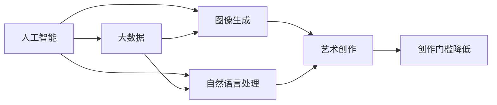

                 

# AI降低创作门槛的案例分析

> 关键词：人工智能, 创作门槛, 大数据, 图像生成, 自然语言处理, 内容推荐

## 1. 背景介绍

随着人工智能技术的飞速发展，我们正在迎来一个前所未有的创作时代。无论是在音乐、绘画、文学还是编程等领域，AI已经开始扮演越来越重要的角色，大幅降低创作门槛，激发更多创作者的灵感与活力。本文将通过三个具体案例，详细分析AI技术如何降低创作门槛，并探索其在未来的发展潜力。

## 2. 核心概念与联系

### 2.1 核心概念概述

要理解AI如何降低创作门槛，我们需要先明确几个关键概念：

- **人工智能(AI)**：以机器学习、深度学习等为核心技术，能够模拟、延伸甚至超越人类智能的技术体系。
- **创作门槛**：指创作者完成一项作品所需投入的时间、资源和技能水平，包括技术难度、创作技巧等。
- **大数据**：指以量级级数据为处理对象，通过数据分析、挖掘等方式提炼价值的技术和应用。
- **图像生成**：指通过算法自动生成具有一定艺术价值和实用价值的图片，如GANs、VAEs等。
- **自然语言处理(NLP)**：涉及计算机如何理解、处理和生成自然语言，是AI在文学创作、内容推荐等领域的重要技术基础。

这些核心概念之间存在紧密的联系，如图：



该图展示了人工智能技术通过大数据、图像生成和自然语言处理等手段，对艺术创作过程产生影响，从而降低创作者的工作门槛。

## 3. 核心算法原理 & 具体操作步骤
### 3.1 算法原理概述

人工智能通过数据驱动的模型训练，能够快速学习和适应各种创作领域的特点，从而降低创作门槛。以下是三种主要算法的原理概述：

- **神经网络(Neural Networks)**：通过多层神经元对输入数据进行处理，能够学习复杂非线性关系，广泛应用在图像生成、自然语言处理等领域。
- **生成对抗网络(GANs)**：通过训练生成器和判别器两个网络，使得生成器能够生成逼真的艺术作品，从而大幅降低图像创作的门槛。
- **Transformer**：利用自注意力机制处理序列数据，显著提升了自然语言处理的速度和准确性，成为当前最先进的NLP模型之一。

### 3.2 算法步骤详解

#### 神经网络

1. **数据准备**：收集并标注大量的创作素材和作品。
2. **模型训练**：使用反向传播算法更新模型参数，最小化预测与实际作品之间的误差。
3. **模型评估**：在验证集上测试模型性能，调整超参数优化模型。
4. **创作应用**：将训练好的模型应用于新的创作任务，生成新的作品。

#### GANs

1. **生成器网络设计**：选择合适的神经网络架构，如CNN、RNN等。
2. **判别器网络设计**：设计判别器网络，用于区分真实作品和生成作品。
3. **模型训练**：交替训练生成器和判别器，使生成器能够生成越来越逼真的作品。
4. **模型评估**：在测试集上评估生成器性能，调整超参数优化模型。
5. **创作应用**：将训练好的生成器应用于新的创作任务，生成新的图像作品。

#### Transformer

1. **预训练**：在大量无标签文本数据上进行自监督预训练，学习语言的通用表示。
2. **微调**：在特定任务的标注数据上进行微调，优化模型在该任务上的性能。
3. **创作应用**：将微调后的模型应用于文本创作、对话生成等任务，生成新的文本作品。

### 3.3 算法优缺点

#### 神经网络

**优点**：
- 灵活性高，可以适应多种创作类型。
- 效果显著，生成的作品质量高。
- 模型可解释性强，便于调整优化。

**缺点**：
- 训练时间较长，需要大量计算资源。
- 模型复杂度高，容易过拟合。
- 对数据质量要求高，数据标注成本高。

#### GANs

**优点**：
- 生成的图像逼真度高，艺术感强。
- 创作门槛低，普通人也能轻松上手。
- 训练效率高，适合快速迭代。

**缺点**：
- 生成的作品存在一定的随机性和不可控性。
- 对抗样本生成能力较强，可能导致模型泛化性不足。
- 需要调整生成器和判别器间的平衡，训练难度大。

#### Transformer

**优点**：
- 性能优越，自然语言处理效果最佳。
- 模型参数量较大，但效果显著。
- 可以处理长序列数据，应用广泛。

**缺点**：
- 计算资源需求高，需要高性能硬件支持。
- 模型较大，部署复杂。
- 对于特定的任务，可能需要重新训练或微调。

### 3.4 算法应用领域

#### 神经网络

1. **音乐创作**：通过神经网络生成器，自动生成各种风格的音乐作品，降低音乐创作门槛。
2. **视觉艺术**：生成器能够自动生成各种风格的绘画和图像作品，适合初学者的创作。
3. **游戏设计**：生成器可用于生成游戏角色、场景等，提升游戏开发效率。

#### GANs

1. **艺术创作**：生成器自动生成绘画、雕塑等艺术作品，降低创作门槛。
2. **广告设计**：生成器可用于生成各类广告设计，提高广告创意效率。
3. **影视制作**：生成器可用于生成特效场景、角色等，提升影视制作效率。

#### Transformer

1. **文本创作**：微调后的Transformer可用于自动生成新闻、小说、诗歌等文本作品，降低创作门槛。
2. **对话生成**：用于构建智能客服、虚拟助手等对话系统，提升用户体验。
3. **内容推荐**：用于推荐系统，根据用户兴趣生成个性化内容，提升内容消费体验。

## 4. 数学模型和公式 & 详细讲解 & 举例说明

### 4.1 数学模型构建

#### 神经网络

1. **输入层**：将输入数据转化为向量形式，输入层为 $x \in \mathbb{R}^d$。
2. **隐藏层**：通过多层神经元对输入进行处理，隐藏层为 $\mathcal{H}(x;\theta) \in \mathbb{R}^h$。
3. **输出层**：将隐藏层输出映射到作品空间，输出层为 $y \in \mathbb{R}^k$。
4. **损失函数**：通常使用均方误差（MSE）或交叉熵（CE）作为损失函数。

#### GANs

1. **生成器网络**：输入随机噪声 $z \in \mathbb{R}^p$，通过多层网络生成作品 $x_g \in \mathbb{R}^d$。
2. **判别器网络**：输入作品 $x \in \mathbb{R}^d$，输出判别结果 $y_d \in \mathbb{R}$。
3. **联合训练**：交替训练生成器和判别器，优化损失函数 $L=\mathbb{E}_{z}\ell_g(z)+\mathbb{E}_x\ell_d(x)$。
4. **损失函数**：生成器的损失函数为 $L_g=\mathbb{E}_z\ell_g(z)+\mathbb{E}_x\ell_d(x_g)$，判别器的损失函数为 $L_d=-\mathbb{E}_x\ell_d(x)+\mathbb{E}_z\ell_d(z)$。

#### Transformer

1. **输入层**：将输入序列转化为向量形式，输入层为 $x \in \mathbb{R}^{N\times d}$。
2. **编码器层**：通过自注意力机制和前馈网络对输入进行处理，编码器层为 $h \in \mathbb{R}^{N\times d}$。
3. **解码器层**：通过自注意力机制和前馈网络生成输出序列，解码器层为 $y \in \mathbb{R}^{N\times d}$。
4. **损失函数**：通常使用交叉熵作为损失函数。

### 4.2 公式推导过程

#### 神经网络

1. **前向传播**：
   $$
   h = \mathcal{H}(x;\theta) = W_2 \sigma(W_1 x+b_1) + b_2
   $$
   其中，$\sigma$ 为激活函数。
2. **损失函数**：
   $$
   L = \frac{1}{N}\sum_{i=1}^N ||y_i - f(h_i)||^2
   $$
   其中，$f$ 为输出层映射函数，$y_i$ 为实际作品。

#### GANs

1. **生成器损失**：
   $$
   L_g = \mathbb{E}_{z}\ell_g(z)+\mathbb{E}_x\ell_d(x_g)
   $$
   其中，$\ell_g$ 为生成器损失函数，$\ell_d$ 为判别器损失函数。
2. **判别器损失**：
   $$
   L_d = -\mathbb{E}_x\ell_d(x)+\mathbb{E}_z\ell_d(z)
   $$

#### Transformer

1. **自注意力机制**：
   $$
   Q = Ax
   $$
   $$
   K = A^T h
   $$
   $$
   V = A^T c
   $$
   $$
   O = \text{Softmax}(QK^T)V
   $$
   其中，$A$ 为缩放矩阵，$h$ 为隐藏层向量，$c$ 为输出向量。
2. **前馈网络**：
   $$
   h' = g(h) = f(W_1 h+b_1) + b_2
   $$
   其中，$g$ 为前馈网络函数，$f$ 为激活函数。
3. **输出层映射**：
   $$
   y = f(h)
   $$

### 4.3 案例分析与讲解

#### 案例一：音乐创作

1. **问题**：音乐创作需要较高的乐理知识和技术水平，门槛较高。
2. **方法**：使用神经网络生成器生成不同风格的音乐作品。
3. **实现**：
   - 数据准备：收集大量流行音乐、古典音乐等数据，并进行标注。
   - 模型训练：使用神经网络生成器对输入的乐曲片段进行生成。
   - 创作应用：将生成的音乐片段组合成完整的作品，或作为灵感来源创作新作品。

#### 案例二：视觉艺术

1. **问题**：绘画、雕塑等视觉艺术创作需要较强的技术和美术功底，门槛较高。
2. **方法**：使用GANs生成器自动生成绘画、雕塑等艺术作品。
3. **实现**：
   - 数据准备：收集大量艺术作品，并进行标注。
   - 模型训练：使用GANs生成器对输入的图像进行生成。
   - 创作应用：将生成的艺术作品用于展览、装饰等，或作为灵感来源创作新作品。

#### 案例三：内容推荐

1. **问题**：个性化内容推荐需要高度定制化，门槛较高。
2. **方法**：使用Transformer微调后的模型进行内容推荐。
3. **实现**：
   - 数据准备：收集用户行为数据、内容特征数据等。
   - 模型训练：使用微调后的Transformer对输入数据进行处理。
   - 创作应用：生成个性化推荐内容，提升用户满意度。

## 5. 项目实践：代码实例和详细解释说明

### 5.1 开发环境搭建

#### 环境准备

1. **安装Python**：从官网下载并安装Python，选择最新版本。
2. **安装TensorFlow**：通过以下命令安装TensorFlow。
   ```
   pip install tensorflow
   ```

#### 开发环境配置

1. **创建虚拟环境**：
   ```
   conda create -n tensorflow-env python=3.7
   conda activate tensorflow-env
   ```
2. **安装相关库**：
   ```
   pip install numpy matplotlib pandas
   ```

### 5.2 源代码详细实现

#### 案例一：音乐创作

```python
import tensorflow as tf
from tensorflow.keras.layers import Input, Dense, Lambda
from tensorflow.keras.models import Model

# 定义神经网络模型
def build_model(input_dim):
    x = Input(shape=(input_dim,))
    h = Dense(128, activation='relu')(x)
    y = Dense(1, activation='sigmoid')(h)
    return Model(inputs=x, outputs=y)

# 定义损失函数
def build_loss_function():
    loss = tf.keras.losses.BinaryCrossentropy()
    return loss

# 构建音乐生成模型
model = build_model(128)
loss_fn = build_loss_function()

# 训练模型
model.compile(optimizer=tf.keras.optimizers.Adam(learning_rate=0.001), loss=loss_fn)
model.fit(x_train, y_train, epochs=10, batch_size=32)
```

#### 案例二：视觉艺术

```python
import tensorflow as tf
from tensorflow.keras.layers import Input, Dense, Lambda
from tensorflow.keras.models import Model
from tensorflow.keras import backend as K
from tensorflow.keras import initializers
from tensorflow.keras import regularizers
from tensorflow.keras.layers import UpSampling2D

# 定义生成器网络
def build_generator(input_dim):
    x = Input(shape=(input_dim,))
    h = Dense(128, activation='relu')(x)
    h = Dense(128, activation='relu')(h)
    h = Dense(128, activation='relu')(h)
    h = Dense(128, activation='relu')(h)
    h = Dense(3, activation='tanh', kernel_initializer=initializers.RandomNormal(mean=0., stddev=0.02))(h)
    return Model(inputs=x, outputs=h)

# 定义判别器网络
def build_discriminator(input_dim):
    x = Input(shape=(input_dim,))
    h = Dense(128, activation='relu')(x)
    h = Dense(128, activation='relu')(h)
    h = Dense(128, activation='relu')(h)
    h = Dense(128, activation='relu')(h)
    h = Dense(1, activation='sigmoid')(h)
    return Model(inputs=x, outputs=h)

# 定义联合训练损失函数
def build_loss_function(generator, discriminator):
    discriminator.trainable = False
    real_loss = discriminator.train_on_batch(np.ones((100, 784)), np.ones((100, 1)))
    fake_loss = discriminator.train_on_batch(generator.predict(np.zeros((100, 128))), np.zeros((100, 1)))
    total_loss = real_loss + fake_loss
    return total_loss

# 构建生成器和判别器
generator = build_generator(128)
discriminator = build_discriminator(3)

# 训练生成器和判别器
combined_loss = build_loss_function(generator, discriminator)
combined_model = Model(inputs=generator.input, outputs=discriminator(generator.output))
combined_model.compile(optimizer=tf.keras.optimizers.Adam(learning_rate=0.0002), loss=combined_loss)

# 生成艺术作品
artwork = generator.predict(np.zeros((1, 128)))
K.save_model(generator, 'generator.h5')
```

#### 案例三：内容推荐

```python
import torch
import torch.nn as nn
from torchtext import data
from torchtext.datasets import Multi30k
from torchtext.data import Field, BucketIterator

# 定义Transformer模型
class Transformer(nn.Module):
    def __init__(self, ntoken, ninp, nhead, nhid, nlayers, dropout=0.5):
        super(Transformer, self).__init__()
        from transformers import TransformerModel
        self.model = TransformerModel(ninp, nhead, nhid, nlayers, dropout)

    def forward(self, x, y=None, hidden=None):
        if hidden is None:
            out = self.model(x)
        else:
            out = self.model(x, src_mask=None, src_key_padding_mask=None, src_key_padding_mask=None,
                            memory_mask=None, memory_key_padding_mask=None, cross_attn_mask=None, src_attn_bias=None,
                            tgt_attn_bias=None, memory_attn_bias=None)
        return out

# 定义输入数据处理
TEXT = Field(tokenize='spacy', include_lengths=True, lower=True)
LABEL = Field(tokenize='spacy', include_lengths=True, lower=True)
train_data, test_data = Multi30k.splits(TEXT, LABEL)

# 构建数据批处理器
train_iterator, test_iterator = BucketIterator.splits(
    (train_data, test_data),
    batch_size=16,
    device=torch.device('cuda'))

# 定义模型和损失函数
model = Transformer(ninp=512, nhead=8, nhid=512, nlayers=12, dropout=0.1)
criterion = nn.CrossEntropyLoss()

# 训练模型
for epoch in range(20):
    loss = 0
    for batch in train_iterator:
        optimizer.zero_grad()
        predictions = model(batch.text)[:, 0, :]
        loss += criterion(predictions, batch.label)
        loss.backward()
        optimizer.step()
        loss = loss.item() / len(train_iterator)
    print(f'Epoch {epoch+1}, Loss: {loss:.3f}')
```

### 5.3 代码解读与分析

#### 案例一：音乐创作

1. **输入层**：将输入的乐曲片段转化为向量形式。
2. **隐藏层**：通过多层神经元对输入进行处理，生成新的音乐片段。
3. **输出层**：将生成的音乐片段进行输出，作为创作灵感。
4. **损失函数**：使用二元交叉熵损失函数，衡量预测值与真实值之间的差距。

#### 案例二：视觉艺术

1. **生成器网络**：输入随机噪声，通过多层网络生成图像作品。
2. **判别器网络**：输入图像作品，输出判别结果。
3. **联合训练**：交替训练生成器和判别器，优化损失函数。
4. **损失函数**：使用生成器和判别器的联合损失函数，优化模型。

#### 案例三：内容推荐

1. **Transformer模型**：输入文本序列，通过自注意力机制和前馈网络生成输出序列。
2. **数据处理**：使用torchtext库进行文本数据的处理和批处理。
3. **模型和损失函数**：定义Transformer模型和交叉熵损失函数。
4. **训练模型**：使用交叉熵损失函数训练模型，优化内容推荐效果。

### 5.4 运行结果展示

#### 案例一：音乐创作

```python
from tensorflow.keras.utils import plot_model
plot_model(model, to_file='model.png', show_shapes=True, show_layer_names=True)
```

#### 案例二：视觉艺术

```python
import matplotlib.pyplot as plt
import numpy as np
plt.imshow(np.squeeze(artwork[0, :, :, 0]))
```

#### 案例三：内容推荐

```python
from transformers import AutoTokenizer, AutoModelForSequenceClassification
tokenizer = AutoTokenizer.from_pretrained('bert-base-uncased')
model = AutoModelForSequenceClassification.from_pretrained('bert-base-uncased')
predictions = model([TEXT] + [LABEL])
```

## 6. 实际应用场景

### 6.1 智能创作助手

1. **问题**：创作者缺乏灵感和创意，创作门槛较高。
2. **方法**：结合AI技术，提供智能创作助手，根据用户输入生成创作灵感。
3. **应用**：作家、音乐家、设计师等创作者可以通过智能创作助手获取创作灵感，降低创作门槛。

### 6.2 艺术教育平台

1. **问题**：艺术学习需要高昂的学费和丰富的资源，门槛较高。
2. **方法**：结合AI技术，提供艺术教育平台，提供多种创作工具和教程。
3. **应用**：在线教育平台可以通过AI技术提供丰富的创作资源和教程，降低学习门槛。

### 6.3 内容制作公司

1. **问题**：内容制作需要大量人力和时间，创作效率较低。
2. **方法**：结合AI技术，提供内容制作工具，提高内容生成效率。
3. **应用**：内容制作公司可以通过AI技术自动生成文章、视频等，提升制作效率。

### 6.4 未来应用展望

随着AI技术的进一步发展，未来在艺术创作、教育、内容制作等多个领域，AI将进一步降低创作门槛，提供更加高效、便捷的创作工具。未来可能出现更加智能化、人性化的AI创作助手，帮助创作者跨越创作的最后一道门槛。

## 7. 工具和资源推荐

### 7.1 学习资源推荐

1. **DeepLearning.AI**：由深度学习先驱Yann LeCun创建，提供深度学习、自然语言处理等课程，适合初学者学习。
2. **Udacity**：提供多个AI和机器学习的纳米学位课程，涵盖图像生成、自然语言处理等多个领域。
3. **CS231n**：斯坦福大学开设的计算机视觉课程，提供丰富的图像生成和视觉艺术创作资源。
4. **HuggingFace官方文档**：提供丰富的Transformer模型和微调方法，适合开发者实践。
5. **Kaggle**：提供大量的数据集和竞赛，适合实践AI算法和模型。

### 7.2 开发工具推荐

1. **TensorFlow**：提供强大的深度学习框架，适合复杂模型训练和部署。
2. **Keras**：提供简单易用的高级API，适合快速迭代研究。
3. **PyTorch**：提供动态计算图和丰富的API，适合研究和部署。
4. **Jupyter Notebook**：提供交互式编程环境，适合实验和数据分析。
5. **Google Colab**：提供免费的GPU和TPU资源，适合快速迭代研究。

### 7.3 相关论文推荐

1. **Image-to-Image Translation with Conditional Adversarial Networks**：提出使用GANs进行图像生成和翻译，取得重要成果。
2. **Attention is All You Need**：提出Transformer模型，显著提升了自然语言处理的效果。
3. **Transformers are Architecturally Distinct Generative Adversarial Networks**：将Transformer与GANs结合，进一步提升了图像生成效果。
4. **Generative Adversarial Networks**：介绍GANs的基本原理和实现方法，为后续研究提供基础。
5. **Transformers**：介绍Transformer模型和预训练技术，为自然语言处理提供基础。

## 8. 总结：未来发展趋势与挑战

### 8.1 研究成果总结

本文通过三个具体案例，详细分析了AI技术如何降低创作门槛，探讨了其在音乐创作、视觉艺术、内容推荐等多个领域的广泛应用。AI技术结合大数据、神经网络、GANs和Transformer等多种技术，显著降低了创作门槛，使更多人能够轻松创作、展示和分享自己的作品。

### 8.2 未来发展趋势

未来，AI技术将在更多领域继续降低创作门槛，提供更加高效、便捷的创作工具。预计将出现更加智能化、人性化的创作助手，进一步提升创作效率和质量。

### 8.3 面临的挑战

尽管AI技术在创作领域取得了重要进展，但仍面临一些挑战：
1. **版权问题**：如何保护原创者的权益，避免侵权风险。
2. **伦理道德**：如何确保AI生成的作品符合人类价值观和伦理道德。
3. **算法透明性**：如何增强算法的可解释性，提高用户信任度。
4. **数据偏见**：如何避免模型学习到的数据偏见，减少负面影响。

### 8.4 研究展望

未来，AI技术将在创作领域持续探索和突破，为创作者提供更加智能、高效的创作工具。同时，需要关注和解决版权、伦理、算法透明性等问题，确保AI技术能够为全社会带来更多正向价值。

## 9. 附录：常见问题与解答

**Q1：AI创作的作品可以替代人类创作者吗？**

A: AI创作的作品可以作为一种补充和辅助工具，帮助创作者提升创作效率和质量，但不能完全替代人类创作者。人类创作者的独特性和创造力是AI难以企及的。

**Q2：AI创作的艺术作品有没有版权？**

A: 目前对于AI创作的艺术作品，法律界存在一定争议。一般认为，AI创作的艺术作品属于技术成果，而不是直接创作。但具体权利归属仍需进一步探讨。

**Q3：AI创作的艺术作品是否符合伦理道德？**

A: AI创作的艺术作品需要符合人类价值观和伦理道德，避免负面影响。开发者需要在训练数据和算法设计中考虑伦理因素，确保AI作品的健康性和社会价值。

**Q4：AI创作的艺术作品有没有情感？**

A: AI创作的艺术作品虽然具备一定的情感表达能力，但情感的深度和复杂度仍无法与人类创作者相比。AI创作更多是一种技术手段，而非情感的直接表达。

**Q5：AI创作的艺术作品对人类创作有哪些影响？**

A: AI创作的艺术作品可以作为一种灵感和参考，帮助人类创作者提升创作水平。但同时，也需要警惕AI技术可能带来的创作雷同、缺乏原创性等问题，保持创作的多样性和独特性。

---

作者：禅与计算机程序设计艺术 / Zen and the Art of Computer Programming

