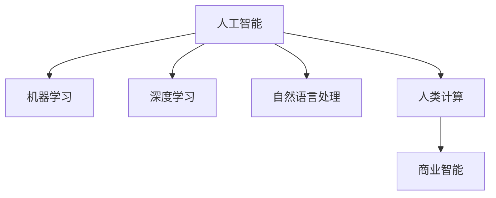

                 

# AI驱动的创新：人类计算在商业中的应用场景

> 关键词：人工智能,人类计算,商业应用,技术创新,算法优化

## 1. 背景介绍

### 1.1 问题由来
随着科技的进步和社会的变迁，人工智能(AI)技术在各个行业中发挥着越来越重要的作用。商业领域的AI应用尤为引人注目，它不仅能够提高企业的运营效率，还能创造出新的商业模式和市场机会。在AI驱动的创新时代，"人类计算"（Human Computing）成为了一个重要的概念，它不仅涉及到计算机科学的算法设计和优化，还涵盖了心理认知、社会互动等多方面。

### 1.2 问题核心关键点
人类计算（Human Computing）是指将人类的认知能力与计算机的计算能力结合，共同完成复杂任务的计算方式。其关键点包括：
- 算法设计：构建高效、精确的计算模型，以便计算机可以理解和处理人类语言及其它信息。
- 认知提升：通过训练AI模型，使其具备对人类行为的预测和优化能力，以提高决策的效率和准确性。
- 用户交互：通过自然语言处理（NLP）和计算机视觉等技术，实现人机交互的无缝对接。
- 数据处理：利用机器学习算法处理和分析大量的商业数据，提取有价值的信息。
- 持续改进：通过迭代算法和模型，不断提升AI的智能水平。

### 1.3 问题研究意义
研究人类计算在商业中的应用，有助于企业更好地理解市场动态、优化产品设计、提升用户体验、预测消费者行为，从而在竞争激烈的市场中占据先机。AI驱动的创新不仅仅是为了解决技术问题，更是为了创造新的商业价值，推动社会的进步和人类生活的改善。

## 2. 核心概念与联系

### 2.1 核心概念概述

为更好地理解人类计算在商业中的应用，本节将介绍几个密切相关的核心概念：

- **人工智能（AI）**：通过计算机模拟人类智能行为，包括学习、推理、感知、规划等，最终实现智能决策和执行的能力。
- **机器学习（ML）**：一种使计算机能够通过数据学习，无需人工编程即可做出预测或决策的技术。
- **深度学习（DL）**：一种基于神经网络结构，通过多层次的特征提取和转化，实现复杂模式识别和决策的技术。
- **自然语言处理（NLP）**：使计算机能够理解、解释和生成人类语言的学科。
- **人类计算（Human Computing）**：结合人类认知与计算机计算，通过协同工作解决复杂问题的计算模式。
- **商业智能（BI）**：通过数据分析、可视化等技术，帮助企业从数据中提取价值，提升决策质量。

这些核心概念之间的逻辑关系可以通过以下Mermaid流程图来展示：



这个流程图展示了人工智能和人类计算之间的联系及其在商业智能中的作用。通过这些技术，AI可以辅助人类做出更准确、更快速的决策，提升商业效率和竞争力。

## 3. 核心算法原理 & 具体操作步骤

### 3.1 算法原理概述

人类计算的核心算法原理主要基于以下四个方面：

1. **算法优化**：通过各种算法优化技术，如梯度下降、随机森林、粒子群等，使AI模型更高效、更准确。
2. **数据处理**：收集、清洗、处理和分析大量数据，为AI模型提供数据支持。
3. **模型训练**：构建和训练AI模型，使其具备对数据的学习和预测能力。
4. **结果解释**：将AI模型的输出结果解释为人类可理解的信息，辅助决策和行动。

这些原理的共同目的是使AI能够更好地辅助人类，实现更高效的计算和更精准的决策。

### 3.2 算法步骤详解

人类计算的算法步骤主要包括以下几个关键环节：

**Step 1: 数据收集与预处理**
- 收集商业领域相关的数据，如客户交易记录、社交媒体数据、市场分析报告等。
- 对数据进行清洗、去重和标注，去除噪音和异常值，确保数据质量。

**Step 2: 模型构建与训练**
- 选择合适的算法模型，如线性回归、决策树、神经网络等，根据任务需求构建AI模型。
- 使用训练数据集对模型进行训练，调整模型参数，使其达到最佳性能。
- 使用验证数据集评估模型性能，避免过拟合。

**Step 3: 算法优化与迭代**
- 对模型进行优化，如调整网络结构、增加正则化、引入特征选择等。
- 使用测试数据集评估模型性能，进一步调整和优化模型。
- 持续迭代，通过不断的学习和改进，使AI模型更准确、更高效。

**Step 4: 结果应用与反馈**
- 将训练好的模型应用于商业决策，如销售预测、市场分析、客户细分等。
- 收集应用结果，评估模型的实际效果。
- 根据反馈信息，调整模型参数，优化算法设计，持续改进模型性能。

### 3.3 算法优缺点

人类计算的算法具有以下优点：
1. 高效性：通过机器学习算法，AI可以在极短时间内处理大量数据，提高决策效率。
2. 准确性：基于深度学习等技术，AI能够从复杂的数据中提取有用的模式和规律，提高预测准确性。
3. 可解释性：AI模型的决策过程和结果可解释性强，便于人类理解和接受。

然而，这些算法也存在以下缺点：
1. 依赖数据：AI模型的性能高度依赖于数据质量，数据不足或偏差可能导致模型性能下降。
2. 复杂性：模型构建和训练过程较为复杂，需要专业知识和技术背景。
3. 安全风险：AI模型可能会被恶意攻击或篡改，带来安全隐患。
4. 伦理问题：AI模型在决策过程中可能存在偏见，影响公正性。

尽管存在这些局限性，但人类计算的算法仍因其高效和准确性，在商业领域具有广泛的应用前景。

### 3.4 算法应用领域

人类计算的算法在商业领域中的应用非常广泛，涵盖了以下几个主要领域：

**商业智能（Business Intelligence, BI）**
- 数据挖掘：利用算法从数据中挖掘出潜在模式和趋势，辅助商业决策。
- 可视化分析：通过图形界面展示数据，使复杂信息更易于理解。

**销售预测（Sales Forecasting）**
- 时间序列预测：利用历史数据和算法预测未来的销售趋势。
- 需求分析：通过算法识别市场需求变化，调整销售策略。

**客户细分（Customer Segmentation）**
- 聚类分析：利用算法将客户分成不同的群体，以便个性化营销。
- 客户画像：通过算法构建详细的客户画像，提高服务质量。

**营销自动化（Marketing Automation）**
- 邮件营销：通过算法优化邮件内容和发送时间，提高营销效果。
- 社交媒体分析：利用算法监测社交媒体动态，优化广告投放。

**供应链管理（Supply Chain Management）**
- 库存管理：通过算法优化库存水平，减少浪费和成本。
- 物流优化：利用算法优化运输路线和物流方案，提高效率。

以上领域仅是人类计算在商业应用中的一部分，随着技术的不断进步和应用的拓展，未来将会有更多新的商业场景出现。

## 4. 数学模型和公式 & 详细讲解 & 举例说明

### 4.1 数学模型构建

以下以销售预测为例，构建基于机器学习的预测模型。

假设某零售商的销售数据包含以下特征：日期（Date）、销售额（Sales）、促销活动（Promotion）、节假日（Holiday）、天气（Weather）等。我们可以构建一个线性回归模型来预测未来的销售额。

模型表示如下：

$$ y = \beta_0 + \beta_1x_1 + \beta_2x_2 + \cdots + \beta_nx_n + \epsilon $$

其中，$y$ 为预测的销售额，$\beta_i$ 为模型的权重系数，$x_i$ 为特征变量，$\epsilon$ 为误差项。

### 4.2 公式推导过程

1. **训练数据集**：收集历史销售数据，每个样本包含日期、销售额、促销活动、节假日、天气等特征。
2. **模型拟合**：使用最小二乘法拟合线性回归模型，求解权重系数 $\beta_i$。
3. **验证和测试**：使用验证数据集评估模型性能，调整模型参数，防止过拟合。
4. **结果评估**：使用测试数据集评估模型预测效果，计算均方误差（MSE）、平均绝对误差（MAE）等指标。

推导过程如下：

设训练数据集为 $(x_1, y_1), (x_2, y_2), \cdots, (x_m, y_m)$，其中 $x_i = [x_{i1}, x_{i2}, \cdots, x_{in}]$，$y_i$ 为实际销售额。

最小二乘法目标函数为：

$$ \min \sum_{i=1}^m(y_i - \hat{y_i})^2 $$

其中，$\hat{y_i} = \beta_0 + \beta_1x_{i1} + \beta_2x_{i2} + \cdots + \beta_nx_{in}$。

对每个系数求偏导数，可得：

$$ \beta_i = \frac{\sum_{i=1}^m(x_{i1} - \bar{x_1})(x_{i2} - \bar{x_2})\cdots(x_{in} - \bar{x_n})(y_i - \bar{y})}{\sum_{i=1}^m(x_{i1} - \bar{x_1})^2(x_{i2} - \bar{x_2})^2\cdots(x_{in} - \bar{x_n})^2} $$

其中，$\bar{x_i}$ 和 $\bar{y}$ 分别为样本的均值。

### 4.3 案例分析与讲解

以下以一个具体的案例来说明人类计算在商业智能中的应用。

某零售商希望预测下个季度的销售额，他收集了过去五年每月的销售额数据，并考虑了促销活动、节假日和天气等因素。使用线性回归算法构建预测模型，步骤如下：

1. **数据准备**：收集五年每月的销售额数据，并标注上促销活动、节假日和天气等特征。
2. **模型训练**：使用线性回归算法，将数据拟合到模型中，求解系数 $\beta$。
3. **结果验证**：使用部分数据进行验证，计算均方误差和平均绝对误差。
4. **结果预测**：将下季度的促销活动、节假日和天气等数据输入模型，得到预测的销售额。

最终，该零售商根据预测结果调整了促销策略，显著提升了下季度的销售额。

## 5. 项目实践：代码实例和详细解释说明

### 5.1 开发环境搭建

在进行人类计算的商业应用开发前，我们需要准备好开发环境。以下是使用Python进行Scikit-learn开发的环境配置流程：

1. 安装Anaconda：从官网下载并安装Anaconda，用于创建独立的Python环境。

2. 创建并激活虚拟环境：
```bash
conda create -n human-computing-env python=3.8 
conda activate human-computing-env
```

3. 安装Scikit-learn：
```bash
conda install scikit-learn
```

4. 安装Pandas、NumPy等辅助工具：
```bash
pip install pandas numpy matplotlib seaborn sklearn jupyter notebook ipython
```

完成上述步骤后，即可在`human-computing-env`环境中开始人类计算的商业应用开发。

### 5.2 源代码详细实现

下面以销售预测为例，使用Scikit-learn库对数据进行训练和预测。

首先，准备数据集：

```python
import pandas as pd

# 读取数据集
data = pd.read_csv('sales_data.csv')

# 数据清洗
data = data.dropna()

# 特征工程
X = data[['Promotion', 'Holiday', 'Weather']]
y = data['Sales']
```

然后，构建模型并进行训练：

```python
from sklearn.linear_model import LinearRegression
from sklearn.model_selection import train_test_split

# 划分数据集
X_train, X_test, y_train, y_test = train_test_split(X, y, test_size=0.2, random_state=42)

# 训练模型
model = LinearRegression()
model.fit(X_train, y_train)

# 预测
y_pred = model.predict(X_test)
```

最后，评估模型性能并进行结果展示：

```python
from sklearn.metrics import mean_squared_error, mean_absolute_error

# 计算评估指标
mse = mean_squared_error(y_test, y_pred)
mae = mean_absolute_error(y_test, y_pred)

# 打印结果
print('Mean Squared Error:', mse)
print('Mean Absolute Error:', mae)
```

以上就是使用Scikit-learn库进行销售预测的完整代码实现。可以看到，Scikit-learn库的API设计简洁高效，可以轻松实现各种机器学习模型的构建和训练。

### 5.3 代码解读与分析

让我们再详细解读一下关键代码的实现细节：

**数据准备**：
- 使用Pandas库读取数据集，并使用dropna()函数删除缺失值。
- 特征工程，将促销活动、节假日和天气等特征构建为X，将销售额作为y。

**模型训练**：
- 使用train_test_split()函数将数据集划分为训练集和测试集。
- 构建LinearRegression模型，使用fit()函数训练模型。

**预测和评估**：
- 使用predict()函数进行预测。
- 使用mean_squared_error()和mean_absolute_error()函数计算评估指标。

**结果展示**：
- 打印出均方误差和平均绝对误差，评估模型性能。

在实际应用中，需要根据具体需求选择不同的算法模型，并结合特征工程、数据清洗等技术，构建高效的预测模型。

## 6. 实际应用场景

### 6.1 智能推荐系统

智能推荐系统是商业领域中非常重要的一类应用。它通过分析用户的历史行为和偏好，预测用户对特定商品的兴趣，从而实现个性化推荐，提升用户体验和购买转化率。

智能推荐系统的主要技术包括协同过滤、基于内容的推荐、混合推荐等。其中，基于协同过滤的方法，通过分析大量用户和商品之间的关系，预测用户对未购买商品的可能偏好。基于内容的推荐，通过分析商品的属性和用户的历史行为，推荐相似商品。混合推荐则综合使用多种算法，提高推荐效果。

### 6.2 风险管理

在金融领域，风险管理是一项至关重要的任务。通过预测市场波动和风险事件，金融机构可以提前采取应对措施，降低损失。

风险管理的核心技术包括信用评分、市场预测和金融欺诈检测等。其中，信用评分通过分析客户的信用历史、财务状况等数据，预测客户的信用风险。市场预测通过分析宏观经济数据、市场新闻等，预测市场趋势和波动。金融欺诈检测通过分析交易数据，识别异常交易行为，防止欺诈行为的发生。

### 6.3 客户服务

客户服务是商业领域中一个非常重要的环节。通过AI驱动的客户服务系统，企业可以大幅提升服务效率和质量，增强客户满意度。

客户服务系统的主要技术包括语音识别、自然语言处理和机器学习等。其中，语音识别通过分析用户的语音信息，自动理解用户的意图和需求。自然语言处理通过分析用户的文本信息，自动提供问题的答案和解决方案。机器学习通过分析大量客户服务记录，提供个性化的服务方案。

### 6.4 未来应用展望

随着人类计算技术的不断进步，未来在商业领域中的应用将更加广泛和深入。以下是几个未来发展的方向：

**区块链技术**
- 利用区块链技术，构建透明的交易记录和数据共享机制，提升商业信任和效率。

**智能合约**
- 利用智能合约技术，自动执行商业合同和交易，减少人工干预，提高效率和公平性。

**元宇宙**
- 利用虚拟现实和增强现实技术，构建虚拟商业场景，提升用户体验和互动性。

**量子计算**
- 利用量子计算的高效性，解决复杂的商业优化问题，提升决策的科学性和准确性。

以上方向展示了人类计算在商业领域中的广阔前景，随着技术的不断进步和应用的拓展，未来将会有更多新的商业模式出现。

## 7. 工具和资源推荐

### 7.1 学习资源推荐

为了帮助开发者系统掌握人类计算在商业中的应用，这里推荐一些优质的学习资源：

1. **《人工智能基础》**：一本系统介绍AI技术基础和应用的书，包括机器学习、深度学习、自然语言处理等内容。
2. **《Python数据科学手册》**：一本介绍Python在数据科学中的应用的书籍，涵盖Pandas、NumPy、Scikit-learn等工具的使用。
3. **Coursera在线课程**：由斯坦福大学等名校开设的AI和机器学习课程，系统介绍AI技术理论和实践。
4. **Kaggle竞赛**：通过参与Kaggle上的数据科学竞赛，提升数据分析和模型构建能力。
5. **GitHub代码库**：大量开源的AI项目和代码库，可以参考和学习。

通过对这些资源的学习实践，相信你一定能够快速掌握人类计算在商业中的应用，并用于解决实际的商业问题。

### 7.2 开发工具推荐

高效的开发离不开优秀的工具支持。以下是几款用于人类计算的商业应用开发的常用工具：

1. **Jupyter Notebook**：一个交互式的Python代码编辑器，支持代码块、注释、输出等，方便调试和展示结果。
2. **Scikit-learn**：一个开源的机器学习库，提供了丰富的算法和工具，支持数据处理、模型构建和评估等。
3. **TensorFlow**：一个开源的深度学习框架，支持分布式计算和多种硬件平台，适用于大规模数据处理和模型训练。
4. **PyTorch**：另一个开源的深度学习框架，支持动态计算图和GPU加速，适用于研究和开发。
5. **Matplotlib**：一个Python绘图库，支持绘制多种图表和可视化数据。

合理利用这些工具，可以显著提升人类计算在商业应用的开发效率，加快创新迭代的步伐。

### 7.3 相关论文推荐

人类计算在商业领域的应用研究涉及多个学科，以下是几篇奠基性的相关论文，推荐阅读：

1. **《机器学习：案例研究》**：介绍机器学习技术在商业中的实际应用，包括销售预测、风险管理、客户服务等。
2. **《大数据时代》**：介绍大数据技术在商业中的应用，涵盖数据收集、处理、分析和应用等。
3. **《深度学习在金融中的应用》**：介绍深度学习技术在金融领域的应用，包括信用评分、市场预测、欺诈检测等。
4. **《智能推荐系统》**：介绍智能推荐技术在电商、视频、音乐等领域的实际应用，涵盖协同过滤、内容推荐等算法。
5. **《人类计算在商业中的机遇与挑战》**：探讨人类计算在商业中的机遇和挑战，提出未来的发展方向。

这些论文代表了大数据和AI在商业领域的应用进展，通过学习这些前沿成果，可以帮助研究者把握学科前进方向，激发更多的创新灵感。

## 8. 总结：未来发展趋势与挑战

### 8.1 总结

本文对人类计算在商业中的应用进行了全面系统的介绍。首先阐述了人类计算的定义和重要性，明确了其在商业领域中的应用场景和优势。其次，从算法原理到操作步骤，详细讲解了人类计算在商业中的应用方法和实践技巧。同时，本文还探讨了人类计算在推荐系统、风险管理、客户服务等多个领域的应用前景，展示了其在商业领域中的巨大潜力。最后，本文精选了人类计算的各类学习资源，力求为读者提供全方位的技术指引。

通过本文的系统梳理，可以看到，人类计算在商业领域中的应用，不仅有助于提高企业的运营效率和决策质量，还推动了新商业模式的产生和演化。在AI驱动的创新时代，人类计算将成为商业应用的重要技术手段，为企业带来更多的商业价值和创新空间。

### 8.2 未来发展趋势

展望未来，人类计算在商业中的应用将呈现以下几个发展趋势：

1. **算法多样化**：随着机器学习技术的不断发展，未来将出现更多算法优化方法，使AI模型更加高效和准确。
2. **数据驱动**：利用大数据技术，人类计算将从数据驱动的角度，深入挖掘商业数据中的价值。
3. **跨学科融合**：人类计算将与其他学科，如心理学、社会学等进行深入融合，形成更加全面、复杂的应用场景。
4. **AI与人类协同**：未来AI将与人类协同工作，共同解决复杂问题，提升商业决策的科学性和合理性。
5. **隐私保护**：随着数据隐私和安全的重视，人类计算将更加注重数据的保护和隐私，防止数据泄露和滥用。

以上趋势凸显了人类计算在商业领域中的广阔前景，随着技术的不断进步和应用的拓展，未来将会有更多新的商业场景出现。

### 8.3 面临的挑战

尽管人类计算在商业领域中具有广阔的应用前景，但在实际应用中仍面临以下挑战：

1. **数据质量**：数据的完整性、准确性和一致性直接影响模型的性能，如何获取高质量数据是关键问题。
2. **算法复杂性**：算法设计和调参过程复杂，需要丰富的专业知识和技术背景，对开发者的要求较高。
3. **模型泛化能力**：模型在不同数据集和场景中的泛化能力有限，需要持续优化和改进。
4. **用户接受度**：AI系统在商业中的应用可能引起用户的顾虑和抵触，需要设计合理的用户体验和解释机制。
5. **伦理和法律问题**：AI系统在决策过程中可能存在偏见和歧视，需要关注伦理和法律问题，确保公平性和公正性。

尽管存在这些挑战，但人类计算在商业领域的应用前景广阔，相信通过不断的技术创新和政策引导，这些挑战终将一一被克服。

### 8.4 研究展望

面对人类计算在商业领域中的挑战，未来的研究需要在以下几个方面寻求新的突破：

1. **高效算法**：开发更加高效、可解释的算法，使AI模型更加易于理解和应用。
2. **数据治理**：建立数据治理机制，确保数据的完整性、准确性和一致性，防止数据滥用。
3. **用户友好**：设计更加友好的用户体验和解释机制，增强用户对AI系统的接受度和信任度。
4. **伦理与法律**：制定AI伦理和法律标准，确保AI系统的公平性和公正性，防止伦理和法律问题。

这些研究方向将进一步推动人类计算在商业领域中的应用，为企业的商业创新和智能转型提供新的动力。总之，人类计算在商业领域的应用，不仅需要技术创新，还需要政策支持、伦理保障和用户接受度的提升，方能实现AI技术的全面落地。

## 9. 附录：常见问题与解答

**Q1: 人类计算在商业应用中需要注意哪些问题？**

A: 在商业应用中，人类计算需要注意以下几个问题：
1. 数据质量：确保数据的完整性、准确性和一致性，防止数据滥用和误差。
2. 算法复杂性：选择适当的算法，进行合理的调参和优化，提高模型的性能。
3. 用户接受度：设计友好的用户体验，解释模型的决策过程，增强用户对AI系统的信任度。
4. 伦理和法律问题：确保模型的公平性和公正性，防止歧视和偏见，遵守伦理和法律规范。

**Q2: 如何提高人类计算在商业应用中的效果？**

A: 提高人类计算在商业应用中的效果，可以从以下几个方面入手：
1. 数据治理：建立数据治理机制，确保数据的完整性、准确性和一致性，防止数据滥用和误差。
2. 算法优化：选择适当的算法，进行合理的调参和优化，提高模型的性能。
3. 特征工程：设计合适的特征，提取有用的信息，提高模型的准确性和泛化能力。
4. 模型解释：设计友好的用户体验和解释机制，增强用户对AI系统的信任度，提供可解释的模型输出。
5. 持续改进：持续优化模型，根据反馈调整算法和参数，提高模型的性能和可靠性。

**Q3: 人类计算在商业应用中面临哪些挑战？**

A: 人类计算在商业应用中面临以下几个挑战：
1. 数据质量：数据的完整性、准确性和一致性直接影响模型的性能，如何获取高质量数据是关键问题。
2. 算法复杂性：算法设计和调参过程复杂，需要丰富的专业知识和技术背景，对开发者的要求较高。
3. 模型泛化能力：模型在不同数据集和场景中的泛化能力有限，需要持续优化和改进。
4. 用户接受度：AI系统在商业中的应用可能引起用户的顾虑和抵触，需要设计合理的用户体验和解释机制。
5. 伦理和法律问题：AI系统在决策过程中可能存在偏见和歧视，需要关注伦理和法律问题，确保公平性和公正性。

**Q4: 人类计算在商业应用中的未来发展方向是什么？**

A: 人类计算在商业应用中的未来发展方向主要包括以下几个方面：
1. 算法多样化：随着机器学习技术的不断发展，未来将出现更多算法优化方法，使AI模型更加高效和准确。
2. 数据驱动：利用大数据技术，人类计算将从数据驱动的角度，深入挖掘商业数据中的价值。
3. 跨学科融合：人类计算将与其他学科，如心理学、社会学等进行深入融合，形成更加全面、复杂的应用场景。
4. AI与人类协同：未来AI将与人类协同工作，共同解决复杂问题，提升商业决策的科学性和合理性。
5. 隐私保护：随着数据隐私和安全的重视，人类计算将更加注重数据的保护和隐私，防止数据泄露和滥用。

**Q5: 人类计算在商业应用中的实际案例有哪些？**

A: 人类计算在商业应用中的实际案例包括：
1. 推荐系统：通过分析用户的历史行为和偏好，预测用户对特定商品的兴趣，实现个性化推荐，提升用户体验和购买转化率。
2. 风险管理：通过预测市场波动和风险事件，提前采取应对措施，降低损失。
3. 客户服务：通过AI驱动的客户服务系统，提升服务效率和质量，增强客户满意度。
4. 智能合约：利用智能合约技术，自动执行商业合同和交易，减少人工干预，提高效率和公平性。
5. 供应链管理：利用算法优化库存水平和物流方案，提高效率。

以上是人类计算在商业领域中的一些实际案例，展示了其在不同场景中的应用。

---
作者：禅与计算机程序设计艺术 / Zen and the Art of Computer Programming

