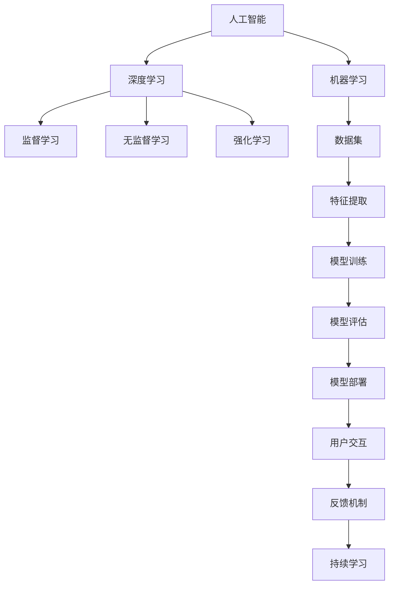

                 

## 1. 背景介绍

人工智能（AI）技术在商业中的应用正在以前所未有的速度增长。从智能客服、个性化推荐到智能投顾，AI驱动的创新正在改变各行各业的运营模式和客户体验。然而，随着AI技术的深入应用，其潜在的伦理和道德问题也开始引起广泛关注。本文将深入探讨AI在商业应用中的道德考虑因素，并分析其应用前景，以期为推动AI技术的健康发展提供有价值的见解。

## 2. 核心概念与联系

### 2.1 核心概念概述

- **人工智能（AI）**：通过计算机算法和统计模型，使机器能够模拟、扩展或替代人类智能的技术。
- **机器学习（ML）**：一种数据驱动的AI技术，通过训练模型，使机器能够自动学习并改进预测和决策能力。
- **深度学习（DL）**：机器学习的一种高级形式，利用多层神经网络对数据进行复杂模式识别和推理。
- **道德（Ethics）**：指导人类行为和决策的一套道德原则，用于规范人类与机器的互动。
- **隐私（Privacy）**：保护个人信息不被未授权的访问和使用，确保数据安全性。
- **可解释性（Explainability）**：AI系统提供对其决策过程的可理解性和透明度的能力。
- **公平性（Fairness）**：AI系统在处理数据和做出决策时，应避免歧视和不公正，保证所有群体的权益。
- **透明性（Transparency）**：AI系统操作的公开和清晰，使利益相关者能够理解其内部机制。
- **可控性（Controllability）**：用户能够对AI系统的行为进行有效控制和干预的能力。
- **责任（Accountability）**：AI系统在出错或产生不良后果时，应有明确的责任归属。

### 2.2 核心概念原理和架构的 Mermaid 流程图



这个流程图展示了人工智能、机器学习和深度学习之间的联系，以及从数据集到模型部署的完整流程。同时，也强调了用户交互、反馈机制和持续学习的重要性。

## 3. 核心算法原理 & 具体操作步骤

### 3.1 算法原理概述

AI在商业中的应用，通常遵循以下基本流程：

1. **数据收集与处理**：收集相关业务数据，并进行清洗和标注。
2. **模型选择与训练**：选择适合的机器学习模型，并使用标注数据进行训练。
3. **模型评估与调优**：使用验证集评估模型性能，进行参数调优。
4. **模型部署与监控**：将模型部署到生产环境，并实时监控其运行情况。
5. **用户交互与反馈**：用户与AI系统交互，系统根据用户反馈进行持续学习和改进。

### 3.2 算法步骤详解

1. **数据收集与处理**：
   - 确定业务目标，明确所需数据类型和来源。
   - 收集相关数据，并进行预处理，如去重、清洗、归一化等。
   - 对数据进行标注，确保其符合模型的输入要求。

2. **模型选择与训练**：
   - 根据业务需求和数据特性，选择合适的机器学习或深度学习模型。
   - 使用标注数据训练模型，调整模型参数以优化性能。
   - 采用交叉验证等技术，防止模型过拟合。

3. **模型评估与调优**：
   - 使用独立验证集评估模型性能，如准确率、召回率、F1值等。
   - 根据评估结果，调整模型结构、学习率、正则化参数等。
   - 进行超参数调优，确保模型在不同数据集上的泛化能力。

4. **模型部署与监控**：
   - 将训练好的模型部署到生产环境中，如服务器、云计算平台等。
   - 实时监控模型的运行情况，收集关键性能指标。
   - 根据监控结果，进行模型更新和优化。

5. **用户交互与反馈**：
   - 设计用户界面，确保用户可以方便地与AI系统交互。
   - 收集用户反馈，了解系统的使用体验和改进需求。
   - 根据反馈，持续改进模型和系统功能。

### 3.3 算法优缺点

AI在商业应用中的优点包括：

- **效率提升**：自动化处理大量业务数据，提升决策速度和准确性。
- **成本节约**：减少人力成本，降低运营成本。
- **数据驱动**：基于数据和算法，提升业务决策的科学性和客观性。
- **客户体验**：通过个性化和智能服务，提升客户满意度和忠诚度。

缺点则包括：

- **隐私风险**：收集和处理大量个人数据，可能引发隐私泄露和滥用。
- **偏见与歧视**：模型训练数据存在偏见，可能引发歧视性决策。
- **可解释性不足**：黑箱模型难以解释其内部决策过程。
- **技术依赖**：过度依赖技术，可能忽视人的判断和情感因素。

### 3.4 算法应用领域

AI在商业中的应用领域非常广泛，包括但不限于：

- **智能客服**：通过自然语言处理（NLP）技术，提供24/7的客户服务。
- **推荐系统**：分析用户行为数据，提供个性化的产品或内容推荐。
- **金融风控**：利用机器学习模型，进行信用评估、风险预测和欺诈检测。
- **供应链管理**：通过预测分析和优化算法，提升供应链效率和响应速度。
- **医疗健康**：利用图像识别和自然语言处理技术，辅助诊断和治疗。
- **人力资源管理**：自动化招聘、培训和绩效评估，提高管理效率。
- **智能制造**：通过数据分析和预测，优化生产流程和质量控制。

## 4. 数学模型和公式 & 详细讲解 & 举例说明

### 4.1 数学模型构建

AI在商业中的许多应用依赖于机器学习模型的构建。以推荐系统为例，模型构建通常包括以下步骤：

1. **用户行为数据收集**：收集用户浏览、购买、评分等行为数据。
2. **特征工程**：从原始数据中提取有用特征，如商品类别、价格、用户偏好等。
3. **模型训练**：使用监督学习算法（如线性回归、逻辑回归、决策树、随机森林等）训练推荐模型。
4. **模型评估**：使用验证集评估模型性能，如平均绝对误差（MAE）、均方根误差（RMSE）等。
5. **模型优化**：根据评估结果，调整模型参数和特征选择。

### 4.2 公式推导过程

以协同过滤推荐算法为例，其基本公式如下：

$$
\hat{y} = \hat{\beta}_0 + \hat{\beta}_1 x_1 + \ldots + \hat{\beta}_p x_p
$$

其中，$x_i$ 为第 $i$ 个特征，$\hat{y}$ 为预测值，$\hat{\beta}_i$ 为特征系数。

协同过滤算法通常使用余弦相似度计算用户和物品之间的相似性：

$$
similarity(u_i, i_j) = \frac{\langle x_i, x_j \rangle}{\Vert x_i \Vert \cdot \Vert x_j \Vert}
$$

其中，$\langle x_i, x_j \rangle$ 表示向量 $x_i$ 和 $x_j$ 的点积，$\Vert x_i \Vert$ 表示向量 $x_i$ 的范数。

### 4.3 案例分析与讲解

假设我们有一个电商网站，希望基于用户行为数据推荐商品。我们可以收集用户浏览历史、购买历史、评分数据等，使用协同过滤算法训练推荐模型。具体步骤如下：

1. **数据收集**：收集用户ID、商品ID、浏览时间、购买时间、评分等数据。
2. **特征工程**：提取用户ID、商品ID、浏览次数、购买次数、评分等特征。
3. **模型训练**：使用协同过滤算法训练推荐模型，计算用户和物品的相似度。
4. **模型评估**：使用验证集评估模型性能，如准确率、召回率、F1值等。
5. **模型优化**：根据评估结果，调整相似度计算方法、特征选择等。

## 5. 项目实践：代码实例和详细解释说明

### 5.1 开发环境搭建

开发环境搭建通常包括以下步骤：

1. **选择编程语言**：如Python、R、Java等。
2. **安装相关库**：如Scikit-learn、TensorFlow、PyTorch等。
3. **配置开发环境**：如安装JDK、设置PATH环境变量等。
4. **版本控制**：使用Git等版本控制系统，管理代码和项目。
5. **数据管理**：使用Hadoop、Spark等大数据处理平台，管理数据和模型。

### 5.2 源代码详细实现

以下是一个简单的协同过滤推荐系统代码实现：

```python
import pandas as pd
from sklearn.metrics.pairwise import cosine_similarity
from sklearn.decomposition import TruncatedSVD

# 读取数据
df = pd.read_csv('user_based_ratings.csv')

# 特征工程
X = df[['user_id', 'item_id', 'rating']]
Y = df['item_id']

# 训练模型
svd = TruncatedSVD(n_components=10)
X_transformed = svd.fit_transform(X)
cosine_sim = cosine_similarity(X_transformed)

# 预测
def predict(user_id):
    user_vector = cosine_sim[user_id].reshape(1, -1)
    similarity = cosine_sim.dot(user_vector)
    return similarity

# 评估
def evaluate(predictions):
    precision = precision_score(Y, predictions, average='micro')
    recall = recall_score(Y, predictions, average='micro')
    f1 = f1_score(Y, predictions, average='micro')
    return precision, recall, f1
```

### 5.3 代码解读与分析

这段代码实现了一个基于余弦相似度的协同过滤推荐系统。首先，使用Scikit-learn的TruncatedSVD对原始数据进行降维，然后使用cosine_similarity计算用户和物品之间的相似度。最后，根据相似度预测用户可能感兴趣的物品，并使用评估函数评估模型性能。

### 5.4 运行结果展示

在运行上述代码后，可以输出模型在验证集上的性能指标，如精确率、召回率和F1值。

## 6. 实际应用场景

### 6.1 智能客服系统

智能客服系统通过NLP技术，自动处理大量客户咨询，提升服务效率和客户满意度。然而，在智能客服应用中，也存在一些道德和隐私问题，如数据隐私保护、系统透明度等。

### 6.2 金融风控系统

金融风控系统利用机器学习算法，预测客户违约风险，进行信用评估和风险控制。然而，金融风控系统也可能引发偏见和不公正，如对低收入群体的歧视。

### 6.3 推荐系统

推荐系统通过分析用户行为数据，提供个性化的产品或内容推荐。然而，推荐系统可能侵犯用户隐私，引发数据滥用问题。

### 6.4 未来应用展望

随着AI技术的不断进步，其在商业应用中的道德考虑因素将更加重要。未来的趋势可能包括：

- **可解释性**：增强AI系统的可解释性，使其决策过程透明和可理解。
- **公平性**：设计公平算法，避免模型偏见和歧视。
- **隐私保护**：加强数据隐私保护，确保用户数据的安全和匿名性。
- **人机协作**：强调人机协作，提升系统的可靠性和用户信任度。
- **伦理审查**：建立AI应用的伦理审查机制，确保技术应用的合规性。

## 7. 工具和资源推荐

### 7.1 学习资源推荐

1. **《机器学习》**：Tom Mitchell著，介绍了机器学习的基本概念、算法和应用。
2. **《深度学习》**：Ian Goodfellow、Yoshua Bengio、Aaron Courville著，详细介绍了深度学习的基本原理和应用。
3. **《AI道德指南》**：Microsoft AI团队著，提供了AI应用的伦理和道德指南。
4. **《数据科学与AI伦理》**：John C. Dovidio著，探讨了数据科学和AI技术的伦理问题。
5. **Coursera和edX**：提供大量AI和数据科学课程，包括道德和隐私保护相关内容。

### 7.2 开发工具推荐

1. **Python**：一种流行的编程语言，广泛应用于AI和数据科学领域。
2. **Scikit-learn**：一个简单易用的机器学习库，提供了大量常用算法和工具。
3. **TensorFlow**：Google开源的深度学习框架，支持分布式计算和模型优化。
4. **PyTorch**：Facebook开源的深度学习框架，提供了动态图和静态图两种计算图模型。
5. **Hadoop和Spark**：大数据处理平台，支持大规模数据存储和处理。

### 7.3 相关论文推荐

1. **《道德机器学习：提升AI系统的伦理性能》**：Gökhan Yılmaz等著，探讨了机器学习算法的伦理问题。
2. **《公平机器学习：一个系统性综述》**：Emily A. Osullivan等著，总结了公平机器学习的最新进展。
3. **《AI系统的可解释性：挑战与方法》**：Dagmar Heer等著，探讨了AI系统的可解释性问题。
4. **《隐私保护技术综述》**：Nobuji Tsukada等著，介绍了隐私保护技术的最新研究进展。
5. **《AI应用中的公平与透明性》**：Marco Taddeo等著，探讨了AI应用中的公平和透明性问题。

## 8. 总结：未来发展趋势与挑战

### 8.1 研究成果总结

AI在商业中的应用已经取得了显著的成果，但也面临诸多道德和隐私问题。通过深入分析AI系统的伦理和隐私问题，可以更好地指导其应用和发展。

### 8.2 未来发展趋势

未来AI在商业中的应用将更加普及和深入，但也将面临更多的道德和隐私挑战。未来的趋势可能包括：

- **可解释性**：增强AI系统的可解释性，使其决策过程透明和可理解。
- **公平性**：设计公平算法，避免模型偏见和歧视。
- **隐私保护**：加强数据隐私保护，确保用户数据的安全和匿名性。
- **人机协作**：强调人机协作，提升系统的可靠性和用户信任度。
- **伦理审查**：建立AI应用的伦理审查机制，确保技术应用的合规性。

### 8.3 面临的挑战

AI在商业应用中面临的挑战包括：

- **数据隐私**：AI系统需要处理大量用户数据，如何保护用户隐私是一个重要问题。
- **模型偏见**：AI系统可能存在数据偏见，导致不公正的决策。
- **可解释性**：许多AI系统是“黑箱”模型，难以解释其内部决策过程。
- **技术依赖**：过度依赖技术，可能忽视人的判断和情感因素。
- **伦理审查**：缺乏系统的伦理审查机制，可能导致技术应用的伦理风险。

### 8.4 研究展望

未来的AI研究应更多关注伦理和隐私问题，推动技术健康发展。可能的研究方向包括：

- **公平算法设计**：开发更公平的机器学习算法，减少数据偏见。
- **隐私保护技术**：探索更有效的隐私保护技术，确保用户数据安全。
- **可解释性提升**：增强AI系统的可解释性，提升用户信任度。
- **伦理审查机制**：建立AI应用的伦理审查机制，确保技术应用的合规性。
- **人机协作模式**：探索人机协作的新模式，提升系统可靠性和用户满意度。

## 9. 附录：常见问题与解答

**Q1：AI在商业应用中的道德考虑因素有哪些？**

A: AI在商业应用中的道德考虑因素主要包括：数据隐私、模型偏见、可解释性、人机协作、责任归属等。

**Q2：如何设计公平的AI系统？**

A: 设计公平的AI系统，可以通过以下方法：

- **数据采集**：确保数据集的多样性和代表性，避免数据偏见。
- **算法设计**：使用公平性优化算法，减少模型偏见。
- **模型评估**：引入公平性评估指标，如误差率、差异率等，检测模型公平性。
- **用户反馈**：收集用户反馈，了解系统的公平性问题。

**Q3：如何保护AI系统中的用户隐私？**

A: 保护AI系统中的用户隐私，可以采用以下方法：

- **数据匿名化**：对敏感数据进行匿名化处理，防止识别。
- **加密存储**：使用加密技术，保护数据存储安全。
- **访问控制**：对数据访问进行严格控制，防止未经授权访问。
- **合规审查**：定期进行合规审查，确保数据使用合规。

**Q4：AI系统在商业应用中如何确保可解释性？**

A: 确保AI系统的可解释性，可以采用以下方法：

- **模型简化**：使用可解释性强的模型，如决策树、线性回归等。
- **特征解释**：对模型特征进行解释，让用户理解输入与输出的关系。
- **可视化工具**：使用可视化工具，展示模型内部结构和决策过程。
- **用户反馈**：收集用户反馈，了解系统的可解释性问题。

**Q5：AI系统在商业应用中如何确保公平性？**

A: 确保AI系统的公平性，可以采用以下方法：

- **数据清洗**：清洗数据集，避免数据偏见。
- **算法设计**：设计公平性优化算法，减少模型偏见。
- **模型评估**：引入公平性评估指标，如误差率、差异率等，检测模型公平性。
- **用户反馈**：收集用户反馈，了解系统的公平性问题。

通过这些方法，可以在商业应用中设计出公平、可解释、隐私保护的AI系统，推动AI技术的健康发展。

---

作者：禅与计算机程序设计艺术 / Zen and the Art of Computer Programming

