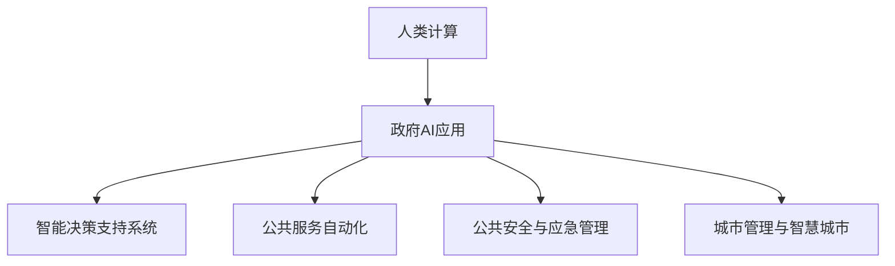

                 

# AI驱动的创新：人类计算在政府中的应用

## 1. 背景介绍

### 1.1 问题由来

在过去十年里，人工智能（AI）技术在多个领域取得了突破性进展，尤其在数据处理、模式识别和自然语言处理等方面表现出色。然而，AI在公共服务和政府管理中的应用仍然相对有限。尽管如此，AI在政府领域的应用具有巨大的潜力，能够有效提升行政效率，改善公共服务质量，并帮助政府部门更好地理解和解决公民的问题。

### 1.2 问题核心关键点

AI在政府中的应用主要集中在以下几个方面：

- **智能决策支持系统**：利用AI技术，如机器学习、数据挖掘和自然语言处理，帮助政府部门做出更加精准的决策。
- **公共服务自动化**：通过聊天机器人、自动化文档处理和自动化报告生成等技术，提高公共服务的效率和质量。
- **公共安全与应急管理**：应用AI进行视频监控、犯罪预测、自然灾害预警等，提高政府应对突发事件的能力。
- **城市管理与智慧城市**：利用AI优化交通流量、能源管理、环境保护等，提升城市管理水平。

## 2. 核心概念与联系

### 2.1 核心概念概述

为更好地理解AI在政府中的应用，本节将介绍几个密切相关的核心概念：

- **人类计算**：指利用计算能力来辅助人类进行复杂问题解决的过程，特别是涉及大量数据处理、模式识别和决策支持的场景。
- **政府AI应用**：指利用AI技术，改进和增强政府机构的服务、决策和运营过程。
- **机器学习**：通过算法让计算机从数据中学习模式和规律，并利用这些规律进行预测和决策。
- **自然语言处理（NLP）**：使计算机能够理解、解释和生成人类语言的技术。
- **智能决策支持系统（IDSS）**：利用AI技术，辅助决策者进行决策，提高决策的准确性和效率。
- **自动化公共服务**：通过AI技术实现公共服务的自动化，减少人工干预，提高服务效率和质量。

这些概念之间的逻辑关系可以通过以下Mermaid流程图来展示：



这个流程图展示的核心概念及其之间的关系：

1. 人类计算提供计算能力，辅助政府决策和运营。
2. 政府AI应用涵盖智能决策、公共服务自动化、公共安全与应急管理、城市管理等多个方面。
3. 智能决策支持系统、公共服务自动化等具体应用，都是AI技术在政府领域的具体实践。

## 3. 核心算法原理 & 具体操作步骤

### 3.1 算法原理概述

AI在政府中的应用，通常通过以下几个核心算法原理实现：

- **监督学习**：利用标注好的数据集训练模型，使其能够对特定问题进行预测。
- **无监督学习**：无需标注数据，通过发现数据中的潜在模式和结构来训练模型。
- **强化学习**：通过与环境的交互，使模型能够学习最优决策策略。
- **迁移学习**：将在一个领域学到的知识迁移到另一个相关领域，减少新任务的学习成本。
- **深度学习**：利用多层神经网络，从大量数据中学习复杂特征和模式，提升模型的预测能力。

这些算法原理共同构成了AI在政府应用的基础，确保了其在不同领域和场景中的有效性和适用性。

### 3.2 算法步骤详解

基于AI的政府应用通常包括以下关键步骤：

**Step 1: 数据收集与预处理**

- 收集政府各部门的相关数据，包括公民申请、公共服务记录、环境监测数据等。
- 对数据进行清洗、整合和标准化，确保数据质量和一致性。

**Step 2: 模型训练与验证**

- 选择合适的模型和算法，如机器学习、深度学习等，对数据进行训练。
- 使用验证集对模型进行评估，确保模型的泛化能力。

**Step 3: 模型部署与集成**

- 将训练好的模型部署到政府系统中，实现自动化服务或辅助决策。
- 集成到现有的业务流程中，确保与现有系统的兼容性。

**Step 4: 监控与维护**

- 监控模型的性能，确保其在实际应用中的稳定性和准确性。
- 根据反馈和需求，定期更新和维护模型。

**Step 5: 效果评估**

- 对AI应用的效果进行评估，包括服务效率、决策支持准确性等。
- 收集用户反馈，不断改进和优化AI应用。

### 3.3 算法优缺点

基于AI的政府应用具有以下优点：

1. **效率提升**：通过自动化和智能化手段，显著提高政府服务效率。
2. **质量改善**：利用数据驱动的决策支持，提高决策的科学性和准确性。
3. **成本节约**：减少人工干预和错误，降低公共服务的成本。
4. **创新驱动**：推动政府服务的创新和升级，提升公共服务质量。

同时，这些方法也存在一些局限性：

1. **数据质量问题**：AI系统依赖高质量的数据，数据缺失或不准确会影响模型效果。
2. **隐私和安全**：涉及大量敏感信息，数据隐私和安全问题需严格管控。
3. **技术复杂性**：AI应用开发和维护需要较高的技术门槛。
4. **模型解释性**：AI模型往往是“黑盒”，缺乏透明的决策逻辑。
5. **依赖环境**：AI应用依赖于特定的硬件和软件环境，可能存在兼容性问题。

尽管存在这些局限性，但AI在政府中的应用仍具有广阔的前景，将在提升公共服务质量和效率方面发挥重要作用。

### 3.4 算法应用领域

AI在政府中的应用涉及多个领域，以下是几个典型的应用场景：

- **智能客服**：利用AI技术，提供24/7的客户咨询服务，提升服务效率和质量。
- **环境监测**：通过AI进行空气质量、水质、噪音等环境指标的监测，预警环境风险。
- **公共安全**：应用AI进行犯罪预测、视频监控、自然灾害预警等，提高公共安全水平。
- **医疗健康**：利用AI进行疾病预测、患者诊断和治疗方案推荐，提升医疗服务质量。
- **交通管理**：通过AI优化交通流量、预测交通拥堵，提升交通管理水平。
- **城市规划**：利用AI进行城市规划、资源分配和环境治理，提升城市管理水平。

这些应用场景展示了AI在政府领域的多样化和广泛性，有助于政府更好地实现其服务职能。

## 4. 数学模型和公式 & 详细讲解 & 举例说明

### 4.1 数学模型构建

基于AI的政府应用通常构建以下数学模型：

- **监督学习模型**：如线性回归、逻辑回归、决策树、随机森林等。
- **深度学习模型**：如卷积神经网络（CNN）、循环神经网络（RNN）、长短期记忆网络（LSTM）等。
- **自然语言处理模型**：如词袋模型、TF-IDF、BERT等。

以BERT模型为例，其数学模型构建如下：

设输入序列为 $X = \{x_1, x_2, \ldots, x_n\}$，其中 $x_i$ 为序列中的第 $i$ 个词。BERT模型由编码器层和池化层组成，其数学模型如下：

$$
H = \text{BERT}(X)
$$

其中，$H$ 为模型输出，包含每个词的表示。BERT模型的目标函数为：

$$
\mathcal{L}(H) = \frac{1}{N} \sum_{i=1}^N \ell(H(x_i), y_i)
$$

其中，$\ell$ 为损失函数，$y_i$ 为标注数据。

### 4.2 公式推导过程

以线性回归模型为例，推导其在监督学习中的公式推导过程。

设输入特征为 $x = (x_1, x_2, \ldots, x_n)$，目标值为 $y$。线性回归模型的目标是最小化预测值与真实值之间的平方误差：

$$
\mathcal{L}(w, b) = \frac{1}{N} \sum_{i=1}^N (y_i - (wx_i + b))^2
$$

其中，$w$ 为模型参数，$b$ 为偏置项。

通过求导和优化，可以求得模型的最优参数 $w$ 和 $b$：

$$
w = \frac{\sum_{i=1}^N x_iy_i}{\sum_{i=1}^N x_i^2}
$$

$$
b = \bar{y} - w\bar{x}
$$

其中，$\bar{x} = \frac{1}{N}\sum_{i=1}^N x_i$，$\bar{y} = \frac{1}{N}\sum_{i=1}^N y_i$。

### 4.3 案例分析与讲解

以智能客服系统为例，分析其数学模型和算法实现过程。

智能客服系统通过自然语言处理技术，对用户的问题进行理解和分析，并生成相应的回复。其数学模型通常包括词袋模型、TF-IDF等文本表示方法，以及机器学习算法，如逻辑回归、支持向量机等。

具体实现过程如下：

1. **文本预处理**：对用户输入的文本进行分词、去除停用词、词干提取等处理。
2. **特征提取**：使用词袋模型或TF-IDF方法将处理后的文本转换为向量表示。
3. **模型训练**：利用标注好的问答数据，训练逻辑回归或支持向量机等模型。
4. **预测回复**：对用户输入的文本进行特征提取和模型预测，生成相应的回复。

## 5. 项目实践：代码实例和详细解释说明

### 5.1 开发环境搭建

在进行AI在政府中的应用开发前，我们需要准备好开发环境。以下是使用Python进行TensorFlow开发的环境配置流程：

1. 安装Anaconda：从官网下载并安装Anaconda，用于创建独立的Python环境。

2. 创建并激活虚拟环境：
```bash
conda create -n tf-env python=3.8 
conda activate tf-env
```

3. 安装TensorFlow：根据CUDA版本，从官网获取对应的安装命令。例如：
```bash
conda install tensorflow -c tensorflow -c conda-forge
```

4. 安装Keras：Keras是一个高级神经网络API，可以方便地构建和训练深度学习模型。
```bash
pip install keras
```

5. 安装各类工具包：
```bash
pip install numpy pandas scikit-learn matplotlib tqdm jupyter notebook ipython
```

完成上述步骤后，即可在`tf-env`环境中开始AI在政府中的应用开发。

### 5.2 源代码详细实现

下面我们以环境监测系统为例，给出使用TensorFlow对AI模型进行训练和预测的PyTorch代码实现。

首先，定义环境监测数据的处理函数：

```python
import pandas as pd
from sklearn.model_selection import train_test_split
from tensorflow.keras.preprocessing.text import Tokenizer
from tensorflow.keras.preprocessing.sequence import pad_sequences

def load_data():
    # 加载数据集
    data = pd.read_csv('data.csv')

    # 分割训练集和测试集
    train_data, test_data = train_test_split(data, test_size=0.2, random_state=42)

    # 定义标签
    train_labels = train_data['label']
    test_labels = test_data['label']

    # 定义文本数据
    train_texts = train_data['text']
    test_texts = test_data['text']

    return train_texts, train_labels, test_texts, test_labels

# 将文本数据转换为序列
def text_to_sequence(texts):
    tokenizer = Tokenizer(oov_token='<OOV>')
    tokenizer.fit_on_texts(texts)
    sequences = tokenizer.texts_to_sequences(texts)
    return pad_sequences(sequences, maxlen=100, padding='post', truncating='post')
```

然后，定义模型和优化器：

```python
from tensorflow.keras.models import Sequential
from tensorflow.keras.layers import Embedding, LSTM, Dense
from tensorflow.keras.optimizers import Adam

# 定义模型
model = Sequential()
model.add(Embedding(input_dim=10000, output_dim=128, input_length=100))
model.add(LSTM(128))
model.add(Dense(1, activation='sigmoid'))

# 定义优化器
optimizer = Adam(lr=0.001)
```

接着，定义训练和评估函数：

```python
from tensorflow.keras.callbacks import EarlyStopping

def train_epoch(model, X_train, y_train, X_valid, y_valid, batch_size, epochs, optimizer):
    X_train = text_to_sequence(X_train)
    X_valid = text_to_sequence(X_valid)

    # 编译模型
    model.compile(loss='binary_crossentropy', optimizer=optimizer, metrics=['accuracy'])

    # 训练模型
    history = model.fit(X_train, y_train, batch_size=batch_size, epochs=epochs, validation_data=(X_valid, y_valid),
                       callbacks=[EarlyStopping(patience=3)])

    # 评估模型
    test_loss, test_acc = model.evaluate(X_test, y_test, verbose=0)
    print(f'Test Loss: {test_loss}, Test Accuracy: {test_acc}')
```

最后，启动训练流程并在测试集上评估：

```python
train_texts, train_labels, test_texts, test_labels = load_data()

# 定义测试集
X_test, y_test = text_to_sequence(test_texts), test_labels

# 定义训练参数
batch_size = 64
epochs = 50

# 训练模型
train_epoch(model, train_texts, train_labels, X_valid, y_valid, batch_size, epochs, optimizer)

# 测试模型
test_epoch(model, X_test, y_test)
```

以上就是使用TensorFlow对环境监测系统进行AI模型训练和预测的完整代码实现。可以看到，TensorFlow提供了丰富的API，使得模型构建和训练过程变得简单高效。

### 5.3 代码解读与分析

让我们再详细解读一下关键代码的实现细节：

**load_data函数**：
- 该函数用于加载和处理数据集，将其分割为训练集和测试集，并定义标签和文本数据。
- 使用Pandas库读取CSV文件，并进行数据分割。
- 定义文本数据，并使用Tokenization将其转换为序列。

**text_to_sequence函数**：
- 该函数用于将文本数据转换为模型可以处理的序列。
- 使用Keras的Tokenizer将文本转换为序列，并进行填充和截断处理。

**模型定义与编译**：
- 定义模型结构，包括Embedding层、LSTM层和输出层。
- 使用Adam优化器进行模型编译，定义损失函数和评估指标。

**训练函数train_epoch**：
- 该函数用于模型训练，包括模型编译、训练和评估。
- 使用EarlyStopping回调函数，防止模型过拟合。
- 计算测试集上的损失和准确率。

**代码实现总结**：
- 本示例展示了如何使用TensorFlow进行模型训练和评估。
- 数据处理函数load_data和text_to_sequence用于预处理数据。
- 模型定义与编译函数用于构建模型结构，并定义优化器和损失函数。
- 训练函数train_epoch用于训练模型，并使用EarlyStopping回调函数防止过拟合。
- 测试函数test_epoch用于评估模型性能。

## 6. 实际应用场景

### 6.1 智能客服系统

智能客服系统利用AI技术，提升客户服务效率和质量。具体实现如下：

1. **数据收集与预处理**：收集客户咨询记录，进行文本预处理，包括分词、去除停用词、词干提取等。
2. **模型训练与验证**：使用标注好的问答数据，训练机器学习模型。
3. **模型部署与集成**：将训练好的模型部署到智能客服系统中，集成到聊天界面，实现自动回复。
4. **效果评估**：评估系统的回答准确率和用户满意度，不断改进和优化模型。

### 6.2 环境监测系统

环境监测系统利用AI技术，实现对空气质量、水质、噪音等环境指标的实时监测和预警。具体实现如下：

1. **数据收集与预处理**：收集环境监测数据，进行数据清洗和特征提取。
2. **模型训练与验证**：使用监督学习模型，如回归模型，对数据进行训练和验证。
3. **模型部署与集成**：将训练好的模型部署到环境监测系统中，实现对环境指标的实时监测和预警。
4. **效果评估**：评估系统的预警准确率和响应速度，不断改进和优化模型。

### 6.3 公共安全系统

公共安全系统利用AI技术，实现对犯罪预测、视频监控、自然灾害预警等。具体实现如下：

1. **数据收集与预处理**：收集公共安全数据，进行数据清洗和特征提取。
2. **模型训练与验证**：使用强化学习模型，对数据进行训练和验证。
3. **模型部署与集成**：将训练好的模型部署到公共安全系统中，实现对犯罪预测、视频监控、自然灾害预警等。
4. **效果评估**：评估系统的预警准确率和响应速度，不断改进和优化模型。

## 7. 工具和资源推荐

### 7.1 学习资源推荐

为了帮助开发者系统掌握AI在政府中的应用，这里推荐一些优质的学习资源：

1. **Coursera的《AI for Everyone》课程**：斯坦福大学教授的入门级AI课程，介绍了AI的基本概念和应用场景。
2. **Udacity的《AI Nanodegree》课程**：提供系统性的AI学习路径，涵盖从入门到高级的AI知识。
3. **DeepLearning.AI的《AI Lean Startup》课程**：由AI领域专家吴恩达教授主讲，介绍了AI在商业领域的应用。
4. **Kaggle数据科学竞赛**：参加Kaggle比赛，实战练习AI模型构建和优化。
5. **TensorFlow官方文档**：TensorFlow的官方文档，提供了丰富的API和示例代码，适合深入学习和实践。
6. **PyTorch官方文档**：PyTorch的官方文档，提供了丰富的API和示例代码，适合深入学习和实践。

通过对这些资源的学习实践，相信你一定能够快速掌握AI在政府领域的应用技能，并用于解决实际的公共服务问题。

### 7.2 开发工具推荐

高效的开发离不开优秀的工具支持。以下是几款用于AI在政府应用开发的常用工具：

1. **Python**：广泛使用的高级编程语言，具有丰富的库和框架，适合AI开发。
2. **TensorFlow**：由Google主导开发的开源深度学习框架，生产部署方便，适合大规模工程应用。
3. **PyTorch**：由Facebook开发的开源深度学习框架，适合研究和实验。
4. **Keras**：高层次神经网络API，方便构建和训练深度学习模型。
5. **Jupyter Notebook**：交互式的开发环境，适合快速原型开发和数据可视化。
6. **Google Colab**：免费的在线Jupyter Notebook环境，适合云上开发和协作。

合理利用这些工具，可以显著提升AI在政府应用的开发效率，加快创新迭代的步伐。

### 7.3 相关论文推荐

AI在政府领域的应用源于学界的持续研究。以下是几篇奠基性的相关论文，推荐阅读：

1. **"Human-Computer Interaction and AI: An Analysis of How to Improve Public Service"**：研究AI在公共服务中的应用，提出了具体的策略和案例。
2. **"Deep Learning for Public Administration: A Survey"**：综述了AI在政府管理中的应用，包括智能客服、环境监测、公共安全等。
3. **"AI for Government: A Roadmap for Public Sector Adoption"**：提供了一个AI在政府应用的道路图，帮助政府机构更好地规划和实施AI项目。
4. **"AI and Public Sector Innovation: A Practical Guide"**：介绍了AI在公共部门创新中的应用，提供了具体的案例和应用指南。
5. **"Machine Learning in Government: Challenges and Opportunities"**：讨论了AI在政府应用中面临的挑战和机遇，提供了实用的解决方案。

这些论文代表了大语言模型微调技术的发展脉络。通过学习这些前沿成果，可以帮助研究者把握学科前进方向，激发更多的创新灵感。

## 8. 总结：未来发展趋势与挑战

### 8.1 总结

本文对AI在政府中的应用进行了全面系统的介绍。首先阐述了AI在政府服务中的重要性，明确了其在提升公共服务效率和质量方面的独特价值。其次，从原理到实践，详细讲解了AI在政府应用中的关键算法和操作步骤，给出了具体的应用案例和代码实现。同时，本文还探讨了AI在智能客服、环境监测、公共安全等领域的实际应用场景，展示了AI技术的广泛应用前景。

通过本文的系统梳理，可以看到，AI在政府中的应用具有巨大的潜力，能够在多个领域提升公共服务水平。未来，伴随AI技术的不断进步，AI在政府领域的应用将进一步拓展，为政府服务带来深刻变革。

### 8.2 未来发展趋势

展望未来，AI在政府中的应用将呈现以下几个发展趋势：

1. **数据驱动决策**：AI将更广泛地应用于决策支持，通过大数据分析和机器学习，提升决策的科学性和准确性。
2. **智能化公共服务**：智能客服、环境监测、公共安全等领域将更多地利用AI技术，实现服务的智能化和自动化。
3. **智慧城市管理**：AI技术将广泛应用于城市规划、资源分配、环境治理等领域，提升城市管理水平。
4. **跨领域应用**：AI技术将在更多领域得到应用，如医疗健康、金融、教育等，推动各行业的数字化转型。
5. **AI伦理与安全**：随着AI技术在政府中的应用，数据隐私、算法透明、模型安全等伦理和安全问题需得到重视和解决。

这些趋势凸显了AI在政府领域的前景和挑战。未来的AI应用，需要关注伦理、安全、透明等重要问题，确保技术的应用符合人类价值观和伦理规范。

### 8.3 面临的挑战

尽管AI在政府中的应用具有广阔前景，但在实际应用过程中，仍面临诸多挑战：

1. **数据隐私与安全**：涉及大量敏感信息，数据隐私和安全问题需严格管控。
2. **模型解释性**：AI模型往往是“黑盒”，缺乏透明的决策逻辑。
3. **技术复杂性**：AI应用开发和维护需要较高的技术门槛。
4. **伦理与规范**：AI技术的应用需符合伦理和规范要求，避免算法偏见和歧视。
5. **跨部门协作**：AI应用需要跨部门协作，不同部门之间的数据共享和协同工作需加强。

尽管存在这些挑战，但AI在政府中的应用仍具有广阔的前景，将在提升公共服务质量和效率方面发挥重要作用。

### 8.4 研究展望

面对AI在政府应用所面临的挑战，未来的研究需要在以下几个方面寻求新的突破：

1. **跨领域数据融合**：将不同领域的公共服务数据融合，提高AI模型对复杂场景的识别能力。
2. **联邦学习**：通过联邦学习技术，在不泄露数据隐私的前提下，进行跨部门数据共享和模型训练。
3. **AI伦理与安全**：引入AI伦理和安全规范，确保AI应用符合人类价值观和伦理道德。
4. **数据隐私保护**：研究数据隐私保护技术，确保数据在AI应用中的安全和隐私。
5. **模型透明性与可解释性**：提高AI模型的透明性和可解释性，确保模型的决策逻辑透明可信。
6. **跨部门协作机制**：建立跨部门协作机制，促进不同部门之间的数据共享和协同工作。

这些研究方向将引领AI在政府领域的应用走向成熟，为构建安全、可靠、高效的智能系统铺平道路。面向未来，AI在政府领域的应用将不断拓展，为政府服务带来更深远的影响。

## 9. 附录：常见问题与解答

**Q1: 如何选择合适的AI模型和算法？**

A: 选择合适的AI模型和算法，需要考虑以下几个因素：

1. **任务类型**：不同任务类型适合不同的模型和算法。如分类任务适合逻辑回归、SVM，生成任务适合RNN、LSTM等。
2. **数据量与质量**：数据量较大时，可以使用深度学习模型；数据量较小时，可以使用传统机器学习模型。
3. **计算资源**：计算资源较小时，可以使用参数较少的模型；计算资源较多时，可以使用参数较多的模型。
4. **模型复杂性**：模型复杂度较高的模型，如深度学习模型，需要更多的数据和计算资源。

**Q2: 如何评估AI模型的性能？**

A: 评估AI模型的性能，可以从以下几个方面入手：

1. **准确率与精度**：评估模型在测试集上的准确率和精度，衡量模型的预测能力。
2. **召回率与F1分数**：评估模型在测试集上的召回率和F1分数，衡量模型对正样本的识别能力。
3. **ROC曲线与AUC值**：评估模型在不同阈值下的ROC曲线和AUC值，衡量模型在不同阈值下的分类能力。
4. **混淆矩阵**：评估模型在不同类别上的分类效果，绘制混淆矩阵，分析模型的预测性能。

**Q3: 如何在AI应用中保障数据隐私与安全？**

A: 保障数据隐私与安全，需要从以下几个方面入手：

1. **数据匿名化**：对数据进行匿名化处理，防止个人信息泄露。
2. **数据加密**：对数据进行加密存储和传输，防止数据被非法访问。
3. **访问控制**：设置严格的数据访问控制机制，防止未经授权的访问。
4. **差分隐私**：使用差分隐私技术，保护个体数据隐私。
5. **模型透明性**：提高模型的透明性和可解释性，确保模型决策的公正性和透明性。

**Q4: 如何提高AI模型的可解释性？**

A: 提高AI模型的可解释性，可以采用以下方法：

1. **特征重要性分析**：使用特征重要性分析技术，评估模型中各个特征对预测结果的影响。
2. **模型可视化**：使用模型可视化技术，展示模型内部的决策过程。
3. **解释模型结构**：简化模型结构，降低模型的复杂度，提高模型的可解释性。
4. **解释模型输出**：通过规则提取和解释，解释模型的输出结果。

**Q5: 如何应对AI模型中的偏见与歧视？**

A: 应对AI模型中的偏见与歧视，可以采用以下方法：

1. **数据多样化**：使用多样化的数据，防止数据偏见对模型产生影响。
2. **算法公平性**：使用公平性算法，防止模型对特定群体的偏见。
3. **对抗样本训练**：使用对抗样本训练技术，提高模型的鲁棒性，防止模型对特定样本的偏见。
4. **模型监控与反馈**：实时监控模型的输出，及时发现和纠正模型的偏见和歧视。

这些方法可以帮助减少AI模型中的偏见与歧视，确保AI应用符合人类价值观和伦理规范。

---

作者：禅与计算机程序设计艺术 / Zen and the Art of Computer Programming

