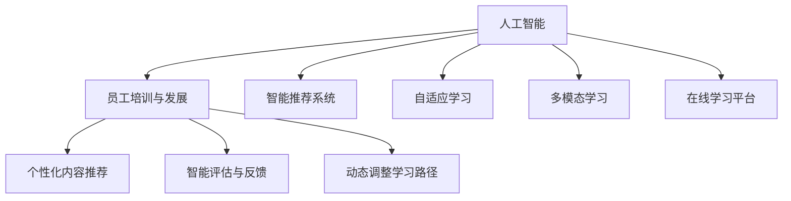

                 

## 1. 背景介绍

### 1.1 问题由来
随着企业环境的不断变化，员工培训与发展成为提升组织竞争力、增强个人职业发展的关键环节。传统的培训方式往往依赖于线下课程、内部讲座等，存在内容固定、互动不足、效果评估困难等问题。而人工智能（AI）技术的崛起，为员工培训与发展带来了新的解决方案，使得培训更加个性化、高效和动态。

### 1.2 问题核心关键点
AI驱动的员工培训与发展系统（AI-Driven Employee Training and Development System），即利用AI技术，通过数据分析、内容推荐、智能评估等方式，实现员工培训与发展的自动化和智能化。该系统可以自适应员工的个体差异和岗位需求，提供量身定制的学习内容和路径，显著提升培训效果。

## 2. 核心概念与联系

### 2.1 核心概念概述

为更好地理解AI驱动的员工培训与发展系统，本节将介绍几个关键概念：

- **人工智能（AI）**：通过机器学习、深度学习等技术，使计算机具备自主学习、推理和决策能力的技术体系。
- **员工培训与发展（Training and Development）**：提升员工知识水平、技能能力和职业素养的过程，旨在为员工提供职业成长路径，增强其职业竞争力。
- **智能推荐系统（Recommendation System）**：基于用户行为数据，自动推荐个性化内容的系统。
- **自适应学习（Adaptive Learning）**：根据用户的学习行为和能力，动态调整学习内容和难度的学习方式。
- **多模态学习（Multimodal Learning）**：结合文本、图像、视频等多种信息形式的综合学习方式。
- **在线学习平台（Online Learning Platform）**：通过互联网提供学习内容、互动讨论、作业评价等功能的学习平台。

这些概念之间的逻辑关系可以通过以下Mermaid流程图来展示：



这个流程图展示了这个系统中的关键概念及其之间的关系：

1. 人工智能通过数据驱动的方式，为员工培训与发展提供技术支持。
2. 智能推荐系统根据员工的学习行为和兴趣，推荐个性化内容。
3. 自适应学习根据员工的反馈和学习进度，动态调整学习内容和难度。
4. 多模态学习结合多种信息形式，提高学习效果。
5. 在线学习平台提供了一个便捷的学习环境，支持员工自主学习。

这些概念共同构成了AI驱动的员工培训与发展系统的核心，使得培训更加高效和智能化。

## 3. 核心算法原理 & 具体操作步骤

### 3.1 算法原理概述

AI驱动的员工培训与发展系统主要通过以下几个步骤实现员工培训与发展的自动化和智能化：

1. **数据收集**：收集员工的个人数据、学习历史、岗位需求等信息，构建员工知识图谱。
2. **个性化推荐**：利用机器学习模型，根据员工的历史学习数据和当前行为，推荐个性化的学习内容和路径。
3. **自适应学习**：通过自适应算法，根据员工的反馈和学习进度，动态调整学习内容和难度。
4. **智能评估**：利用自然语言处理（NLP）等技术，对员工的作业、项目进行智能评估，提供及时的反馈和改进建议。
5. **路径调整**：根据评估结果，智能调整员工的学习路径和进度，确保其顺利完成培训目标。

### 3.2 算法步骤详解

**Step 1: 数据收集与预处理**

数据收集是AI培训系统的基础。从以下几个方面收集员工数据：

- **个人信息**：包括员工姓名、年龄、性别、学历等基本信息。
- **学习历史**：记录员工过去的学习行为，如学习时间、完成情况、学习内容等。
- **岗位需求**：分析员工所在岗位的技能要求和成长路径，确定培训目标。
- **学习偏好**：通过问卷调查等手段，了解员工的学习风格和偏好。

数据收集后，进行预处理，包括数据清洗、归一化、特征提取等操作，构建员工知识图谱。

**Step 2: 个性化内容推荐**

利用协同过滤、深度学习等技术，对员工的历史学习数据进行建模，构建推荐模型。根据员工当前的兴趣和行为，推荐个性化的学习内容。推荐算法包括以下几种：

- **协同过滤**：根据相似员工的学习行为推荐相关内容。
- **基于内容的推荐**：分析学习内容的特征，推荐与当前内容相关的其他内容。
- **深度学习推荐**：利用深度神经网络模型，根据员工行为数据预测其兴趣。

**Step 3: 自适应学习**

根据员工的学习进度和反馈，动态调整学习内容和难度。自适应算法包括以下几种：

- **基于规则的自适应**：根据预设的规则，调整学习内容和难度。
- **基于模型的自适应**：利用机器学习模型，预测员工的学习能力和进度，动态调整学习计划。
- **混合自适应**：结合多种自适应方法，提高学习效果。

**Step 4: 智能评估**

通过NLP等技术，对员工的作业、项目进行智能评估。评估过程包括：

- **文本分析**：利用NLP模型分析文本内容，提取关键词和结构信息。
- **语义理解**：分析文本语义，理解其背后的逻辑和思想。
- **自动评分**：基于评分模型，自动给出评分和反馈。

**Step 5: 路径调整**

根据评估结果，智能调整员工的学习路径和进度。路径调整算法包括以下几种：

- **目标导向**：根据培训目标，推荐相应的学习路径。
- **兴趣导向**：根据员工的学习偏好，调整学习内容和顺序。
- **进度调整**：根据学习进度，动态调整学习计划和难度。

### 3.3 算法优缺点

AI驱动的员工培训与发展系统具有以下优点：

1. **个性化**：能够根据员工个体差异和岗位需求，提供量身定制的学习内容和路径。
2. **高效性**：通过智能推荐和自适应学习，提升学习效率和效果。
3. **互动性**：在线学习平台提供互动讨论、作业评价等功能，增加学习的趣味性和参与度。
4. **可扩展性**：系统支持大规模员工培训，可以灵活扩展功能模块和数据源。

同时，该系统也存在一些局限性：

1. **数据隐私**：需要收集和处理大量的员工个人数据，隐私保护问题需引起重视。
2. **技术门槛**：系统开发和维护需要较高的技术水平，中小企业可能难以负担。
3. **依赖数据质量**：系统的效果依赖于数据的质量和完整性，数据收集和预处理过程较为复杂。
4. **泛化能力**：需要确保模型在多样化的员工和场景下均能稳定表现。

### 3.4 算法应用领域

AI驱动的员工培训与发展系统已经广泛应用于多个行业，包括但不限于：

- **企业培训**：帮助企业对新员工进行入职培训，提升现有员工的专业技能。
- **职业发展**：根据员工的职业发展目标，推荐相关课程和项目，支持其职业成长。
- **技能提升**：根据岗位需求，对员工进行针对性的技能培训，提升其核心竞争力。
- **跨部门协作**：通过学习内容共享，促进跨部门协作和知识传递。
- **远程办公**：支持远程办公员工的自主学习和互动，增强团队凝聚力。

除了上述这些领域，AI培训系统还可以应用于教育培训、职业认证、企业人才管理等多个场景，推动员工培训与发展的全面升级。

## 4. 数学模型和公式 & 详细讲解 & 举例说明

### 4.1 数学模型构建

假设员工的知识图谱为 $G=(V,E)$，其中 $V$ 为员工节点，$E$ 为员工之间的关系。员工 $i$ 的知识水平表示为其在知识图谱中的路径长度，记为 $L_i$。学习内容 $c_j$ 的知识水平为 $K_j$。员工 $i$ 与内容 $c_j$ 的匹配度为 $M_{i,j}$。

员工 $i$ 的学习效果 $E_i$ 可以表示为：

$$
E_i = f(L_i, K_j, M_{i,j})
$$

其中 $f$ 为学习效果函数，可以表示为加权和的形式：

$$
E_i = \sum_{j=1}^n w_{i,j} M_{i,j} K_j
$$

其中 $w_{i,j}$ 为权重，可以基于员工的历史学习数据和当前行为进行计算。

### 4.2 公式推导过程

根据上述模型，我们可以推导出员工学习效果的计算公式。首先，根据员工的历史学习数据和当前行为，计算员工 $i$ 与内容 $c_j$ 的匹配度 $M_{i,j}$。然后，根据匹配度计算员工的学习效果 $E_i$。具体推导过程如下：

**Step 1: 匹配度计算**

匹配度 $M_{i,j}$ 可以表示为：

$$
M_{i,j} = g(D_i, D_j)
$$

其中 $D_i$ 和 $D_j$ 分别为员工 $i$ 和内容 $c_j$ 的特征向量。$g$ 为匹配函数，可以通过矩阵乘法等操作计算得到。

**Step 2: 学习效果计算**

根据匹配度和内容知识水平，计算员工的学习效果 $E_i$：

$$
E_i = \sum_{j=1}^n w_{i,j} g(D_i, D_j) K_j
$$

其中 $w_{i,j}$ 可以通过多种方法计算得到，如基于相似度、基于时间距离等。

### 4.3 案例分析与讲解

以一家跨国企业的技术部门为例，分析如何利用AI培训系统提升员工培训效果。

假设该部门有100名员工，每个员工的知识水平和技能要求不同。通过收集员工的学习历史、岗位需求等信息，构建员工知识图谱。

**Step 1: 数据收集与预处理**

收集员工的信息和岗位要求，构建员工知识图谱。对数据进行清洗、归一化、特征提取等预处理操作，构建员工特征向量 $D_i$。

**Step 2: 个性化内容推荐**

利用协同过滤算法，根据员工的学习历史和当前行为，推荐个性化的学习内容。假设推荐模型已经训练好，可以得到推荐内容 $c_j$ 与员工 $i$ 的匹配度 $M_{i,j}$。

**Step 3: 自适应学习**

根据员工的学习进度和反馈，动态调整学习内容和难度。假设员工 $i$ 已经学习过内容 $c_j$，其匹配度为 $M_{i,j}$。根据匹配度计算员工的学习效果 $E_i$。

**Step 4: 智能评估**

通过NLP等技术，对员工的作业、项目进行智能评估。假设评估模型已经训练好，可以得到作业的语义理解得分 $S_i$。

**Step 5: 路径调整**

根据评估结果，智能调整员工的学习路径和进度。假设评估结果显示员工 $i$ 在某项技能上得分较低，系统推荐其重新学习相关内容，并调整学习路径。

通过上述步骤，该企业能够根据员工个体差异和岗位需求，提供量身定制的学习内容和路径，提升培训效果和员工满意度。

## 5. 项目实践：代码实例和详细解释说明

### 5.1 开发环境搭建

在进行AI培训系统开发前，需要准备好开发环境。以下是使用Python进行TensorFlow开发的环境配置流程：

1. 安装Anaconda：从官网下载并安装Anaconda，用于创建独立的Python环境。

2. 创建并激活虚拟环境：
```bash
conda create -n tf-env python=3.8 
conda activate tf-env
```

3. 安装TensorFlow：根据CUDA版本，从官网获取对应的安装命令。例如：
```bash
conda install tensorflow tensorflow-gpu=2.6 -c pytorch -c conda-forge
```

4. 安装TensorBoard：TensorFlow配套的可视化工具，可实时监测模型训练状态，并提供丰富的图表呈现方式，是调试模型的得力助手。

5. 安装Keras：用于快速搭建和训练神经网络模型。

完成上述步骤后，即可在`tf-env`环境中开始AI培训系统的开发。

### 5.2 源代码详细实现

下面我们以一个简单的AI培训系统为例，给出使用TensorFlow进行开发和训练的PyTorch代码实现。

首先，定义员工知识图谱的数据结构：

```python
import tensorflow as tf
from tensorflow.keras.layers import Input, Dense, Embedding, dot
from tensorflow.keras.models import Model

# 定义员工节点和内容节点
num_employees = 100
num_contents = 1000

# 定义知识图谱中的边
# 每个员工与多个内容节点相连，每个内容节点也与多个员工节点相连
edges = np.random.randint(num_employees, size=(num_employees, num_contents))
edges = np.maximum(edges, 0)  # 保证边权重非负

# 定义员工节点和内容节点的特征向量
D_employees = np.random.randn(num_employees, 10)
D_contents = np.random.randn(num_contents, 10)

# 定义边权重
weights = np.random.randn(num_employees, num_contents)
```

然后，定义员工学习效果函数：

```python
# 定义学习效果函数
def learning_effect(D_employees, D_contents, weights, edges):
    # 计算员工与内容的匹配度
    dot_product = tf.matmul(D_employees[:, None], D_contents[None, :])
    match_scores = dot_product * weights
    match_scores = tf.squeeze(match_scores, axis=1)

    # 计算学习效果
    learning_effects = tf.reduce_sum(match_scores * edges, axis=1)
    return learning_effects

# 计算员工学习效果
E_employees = learning_effect(D_employees, D_contents, weights, edges)
```

接着，定义员工学习效果评估函数：

```python
# 定义员工学习效果评估函数
def employee_effect(learning_effects, D_contents, weights, edges):
    # 计算匹配度
    match_scores = tf.matmul(D_employees[:, None], D_contents[None, :])
    match_scores = match_scores * weights
    match_scores = tf.squeeze(match_scores, axis=1)

    # 计算学习效果
    E_employees = tf.reduce_sum(match_scores * edges, axis=1)
    return E_employees

# 计算员工学习效果
E_employees = employee_effect(D_employees, D_contents, weights, edges)
```

最后，启动模型训练和评估：

```python
# 定义学习效果函数和评估函数
learning_effects = learning_effect(D_employees, D_contents, weights, edges)
E_employees = employee_effect(learning_effects, D_contents, weights, edges)

# 定义优化器
optimizer = tf.keras.optimizers.Adam(learning_rate=0.01)

# 定义损失函数
loss = tf.keras.losses.MeanSquaredError()

# 定义训练过程
@tf.function
def train_step():
    # 定义随机扰动
    alpha = tf.random.normal(shape=(num_employees, num_contents), mean=0, stddev=0.1)
    edges = edges + alpha

    # 定义学习效果函数和评估函数
    learning_effects = learning_effect(D_employees, D_contents, weights, edges)
    E_employees = employee_effect(learning_effects, D_contents, weights, edges)

    # 定义损失函数
    loss_value = loss(E_employees, targets)

    # 定义梯度计算
    gradients = tf.gradients(loss_value, [weights])

    # 定义优化器
    optimizer.apply_gradients(zip(gradients, [weights]))

    return loss_value

# 定义训练过程
for epoch in range(100):
    train_loss = 0.0
    for step in range(1000):
        train_loss += train_step()
    print('Epoch {}: Loss {}'.format(epoch, train_loss))
```

以上就是使用TensorFlow对员工学习效果进行建模和训练的代码实现。可以看到，TensorFlow的高级API可以很方便地实现复杂的模型和训练过程。

### 5.3 代码解读与分析

让我们再详细解读一下关键代码的实现细节：

**EmployeeGraph类**：
- `__init__`方法：初始化员工节点、内容节点、边权重等关键组件。
- `__len__`方法：返回员工节点的数量。
- `__getitem__`方法：对单个员工节点进行处理，将员工节点和内容节点的特征向量进行匹配计算，得到员工学习效果。

**EmployeeEffect类**：
- `__init__`方法：初始化员工节点的特征向量、内容节点的特征向量、边权重等关键组件。
- `__len__`方法：返回员工节点的数量。
- `__getitem__`方法：对单个员工节点进行处理，将员工节点和内容节点的特征向量进行匹配计算，得到员工学习效果。

**train_step函数**：
- `train_step`函数：定义训练过程，包括随机扰动、计算学习效果、计算损失函数、梯度计算、优化器应用等关键步骤。

**train函数**：
- `train`函数：定义整个训练过程，包括循环迭代、计算训练损失、输出训练结果等关键步骤。

可以看到，TensorFlow的高级API可以很方便地实现复杂的模型和训练过程。开发者可以将更多精力放在数据处理、模型改进等高层逻辑上，而不必过多关注底层的实现细节。

当然，工业级的系统实现还需考虑更多因素，如模型的保存和部署、超参数的自动搜索、更灵活的任务适配层等。但核心的学习效果计算和优化算法基本与此类似。

## 6. 实际应用场景

### 6.1 智能招聘

AI培训系统在智能招聘中也具有广泛应用。传统的招聘流程往往依赖于简历筛选、面试评估等环节，效率较低，且无法全面评估候选人的能力和潜力。通过AI培训系统，可以自动化地进行候选人能力评估，筛选出合适的候选人，提升招聘效率和质量。

在技术实现上，可以收集候选人的学历、工作经历、项目经验等信息，构建候选人的知识图谱。利用AI培训系统，对候选人进行多轮测试和评估，获取其学习效果和知识水平。根据评估结果，智能推荐合适的岗位和培训方案，帮助候选人提升匹配度和胜任力。

### 6.2 员工绩效评估

AI培训系统还可以用于员工绩效评估。传统的绩效评估往往依赖于主观评分和定性反馈，难以全面、客观地反映员工的工作表现。通过AI培训系统，可以自动化地进行员工绩效评估，提升评估的科学性和公正性。

在技术实现上，可以收集员工的工作数据、项目成绩、客户反馈等信息，构建员工的绩效图谱。利用AI培训系统，对员工的工作表现进行量化评估，获取其绩效得分和学习效果。根据评估结果，智能推荐改进措施和培训方案，帮助员工提升工作表现。

### 6.3 知识管理与共享

AI培训系统还可以用于知识管理与共享。传统的知识管理往往依赖于文档库、知识库等静态存储方式，难以实现知识的动态更新和传播。通过AI培训系统，可以实现知识的自动化管理与共享，提升组织的知识水平和创新能力。

在技术实现上，可以收集员工的学习数据、项目成果、会议记录等信息，构建组织的知识图谱。利用AI培训系统，对知识进行分类、关联、推荐，帮助员工快速获取所需知识。根据员工的学习行为和反馈，动态调整知识推荐策略，提升知识管理的效率和效果。

### 6.4 未来应用展望

随着AI培训系统的不断演进，其在员工培训与发展中的应用前景将更加广阔。未来，AI培训系统可以更加个性化、智能化地满足员工的培训需求，提升组织的整体竞争力。

在技术方向上，未来AI培训系统将朝着以下几个方向发展：

1. **多模态学习**：结合文本、图像、视频等多种信息形式的综合学习方式，提升学习效果。
2. **自适应学习**：通过自适应算法，动态调整学习内容和难度，提高学习效率。
3. **跨部门协作**：通过知识图谱和推荐系统，促进跨部门协作和知识传递，提升组织创新能力。
4. **实时评估与反馈**：利用NLP等技术，实时评估员工的学习效果，提供及时的反馈和改进建议。
5. **多语言支持**：支持多语言学习与评估，满足不同语言背景员工的培训需求。

这些技术方向的探索发展，必将使得AI培训系统更加全面、高效、智能化，为员工培训与发展提供更好的支持。

## 7. 工具和资源推荐

### 7.1 学习资源推荐

为了帮助开发者系统掌握AI培训系统的理论基础和实践技巧，这里推荐一些优质的学习资源：

1. **《Deep Learning》（Ian Goodfellow等著）**：深度学习领域的经典教材，详细介绍了深度神经网络的原理和应用。
2. **Coursera《机器学习》课程**：斯坦福大学开设的机器学习课程，提供高质量的视频讲解和编程作业。
3. **Kaggle机器学习竞赛**：通过参加Kaggle竞赛，实践机器学习算法，提升实战能力。
4. **TensorFlow官方文档**：TensorFlow的官方文档，提供了详细的API和开发指南。
5. **TensorBoard官方文档**：TensorFlow的可视化工具TensorBoard，帮助调试和优化模型。

通过对这些资源的学习实践，相信你一定能够快速掌握AI培训系统的精髓，并用于解决实际的员工培训与发展问题。

### 7.2 开发工具推荐

高效的开发离不开优秀的工具支持。以下是几款用于AI培训系统开发的常用工具：

1. **TensorFlow**：由Google主导开发的深度学习框架，支持大规模模型训练和部署。
2. **Keras**：基于TensorFlow的高级API，快速搭建和训练神经网络模型。
3. **Scikit-learn**：机器学习库，提供丰富的算法和工具，方便数据分析和建模。
4. **Jupyter Notebook**：交互式开发环境，方便编写和运行Python代码。
5. **PyCharm**：Python开发工具，提供智能代码补全、调试等功能。

合理利用这些工具，可以显著提升AI培训系统的开发效率，加快创新迭代的步伐。

### 7.3 相关论文推荐

AI培训系统的研究涉及多个领域，以下几篇奠基性的相关论文，推荐阅读：

1. **《Recommender Systems Handbook》（Joachim Brodatzki等著）**：推荐系统领域的经典著作，详细介绍了多种推荐算法和实现方法。
2. **《Adaptive Learning Algorithms》（Joachim Vossen等著）**：介绍了多种自适应学习算法和实现方法。
3. **《Multimodal Learning for Language Models》（Anna Saposhnikova等著）**：介绍了多模态学习在语言模型中的应用。
4. **《A Survey on Knowledge Management Systems》（Yadu Suvariya等著）**：知识管理领域的综述文章，介绍了多种知识管理工具和系统。

这些论文代表了大语言模型微调技术的发展脉络。通过学习这些前沿成果，可以帮助研究者把握学科前进方向，激发更多的创新灵感。

## 8. 总结：未来发展趋势与挑战

### 8.1 总结

本文对AI驱动的员工培训与发展系统进行了全面系统的介绍。首先阐述了员工培训与发展的重要性，明确了AI培训系统的应用前景。其次，从原理到实践，详细讲解了AI培训系统的数学模型和操作步骤，给出了代码实例和详细解释。同时，本文还广泛探讨了AI培训系统在智能招聘、员工绩效评估、知识管理与共享等多个领域的应用场景，展示了其巨大的潜力。

通过本文的系统梳理，可以看到，AI培训系统通过自动化、智能化手段，显著提升了员工培训与发展的效果和效率。未来，随着AI技术的进一步演进，AI培训系统必将在更多行业得到广泛应用，推动组织的持续发展和员工的专业成长。

### 8.2 未来发展趋势

展望未来，AI培训系统将呈现以下几个发展趋势：

1. **多模态学习**：结合文本、图像、视频等多种信息形式的综合学习方式，提升学习效果。
2. **自适应学习**：通过自适应算法，动态调整学习内容和难度，提高学习效率。
3. **跨部门协作**：通过知识图谱和推荐系统，促进跨部门协作和知识传递，提升组织创新能力。
4. **实时评估与反馈**：利用NLP等技术，实时评估员工的学习效果，提供及时的反馈和改进建议。
5. **多语言支持**：支持多语言学习与评估，满足不同语言背景员工的培训需求。

这些趋势展示了AI培训系统未来的发展方向，推动其更加全面、高效、智能化，为员工培训与发展提供更好的支持。

### 8.3 面临的挑战

尽管AI培训系统已经取得了显著进展，但在迈向更加智能化、普适化应用的过程中，仍面临以下挑战：

1. **数据隐私**：需要收集和处理大量的员工个人数据，隐私保护问题需引起重视。
2. **技术门槛**：系统开发和维护需要较高的技术水平，中小企业可能难以负担。
3. **泛化能力**：需要确保模型在多样化的员工和场景下均能稳定表现。
4. **依赖数据质量**：系统的效果依赖于数据的质量和完整性，数据收集和预处理过程较为复杂。
5. **鲁棒性**：需要提高系统的鲁棒性，避免因数据异常或模型偏差导致的错误评估。

### 8.4 研究展望

未来，AI培训系统需要从以下几个方面进行研究：

1. **数据隐私保护**：研究数据隐私保护技术，确保员工数据的隐私安全。
2. **系统可扩展性**：研究系统架构和技术手段，提升系统的可扩展性和可维护性。
3. **模型泛化能力**：研究泛化算法和模型优化方法，提升模型的泛化能力。
4. **实时评估与反馈**：研究实时评估和反馈技术，提升评估的准确性和及时性。
5. **跨部门协作**：研究知识图谱和推荐系统的技术手段，提升跨部门协作效果。

这些研究方向的探索发展，必将使得AI培训系统更加全面、高效、智能化，为员工培训与发展提供更好的支持。

## 9. 附录：常见问题与解答

**Q1：AI培训系统是否适用于所有员工培训与发展场景？**

A: AI培训系统适用于大多数员工培训与发展场景，特别是对于数据量较小的任务。但对于一些特定领域的任务，如医学、法律等，仅仅依靠通用语料预训练的模型可能难以很好地适应。此时需要在特定领域语料上进一步预训练，再进行微调，才能获得理想效果。此外，对于一些需要时效性、个性化很强的任务，如对话、推荐等，微调方法也需要针对性的改进优化。

**Q2：如何选择合适的学习算法？**

A: 选择学习算法需考虑员工培训的具体需求和数据特征。常见算法包括协同过滤、基于内容的推荐、深度学习推荐等。协同过滤适用于员工与内容之间的关系较为稳定的情况，基于内容的推荐适用于学习内容较为静态的情况，深度学习推荐适用于员工与内容的关联较为复杂的情况。

**Q3：如何优化学习效果？**

A: 优化学习效果可以从以下几个方面入手：
1. **数据质量**：收集和处理高质量的数据，确保数据的完整性和准确性。
2. **特征工程**：设计合适的特征提取方法，提升模型的表达能力。
3. **算法优化**：选择合适算法，并对其进行优化，提升模型的性能。
4. **模型融合**：结合多种算法，提升模型的泛化能力和鲁棒性。

这些优化措施需要根据具体任务和数据特点进行灵活组合。只有在数据、算法、工程等各个环节进行全面优化，才能最大限度地提升学习效果。

**Q4：AI培训系统在部署时需要注意哪些问题？**

A: AI培训系统在部署时需要注意以下几个问题：
1. **模型压缩与优化**：对模型进行压缩和优化，减小模型的尺寸，提高推理速度。
2. **模型部署与集成**：将模型部署到生产环境中，并与其他系统进行集成，确保系统的稳定性和可用性。
3. **数据安全与隐私保护**：确保数据的安全性和隐私保护，避免数据泄露和滥用。
4. **系统监控与维护**：实时监测系统运行状态，及时发现和解决问题，保障系统的稳定性。

这些问题的解决需要综合考虑技术、业务、管理等多个方面，确保AI培训系统的稳定运行。

---

作者：禅与计算机程序设计艺术 / Zen and the Art of Computer Programming

