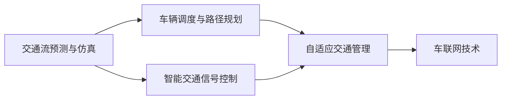

                 

## 1. 背景介绍

### 1.1 问题由来

随着城市化进程的加快和汽车保有量的激增，交通拥堵已经成为全球许多大城市的通病。交通拥堵不仅导致空气污染、噪音污染等环境问题，还造成了时间浪费、出行成本增加、交通事故频发等社会问题。据统计，全球每年因交通拥堵造成的经济损失高达数万亿美元。

### 1.2 问题核心关键点

解决交通拥堵的关键在于科学规划和高效控制。科学规划包括交通基础设施布局优化、交通流预测与仿真、智能交通信号控制等，而高效控制则需要依托人工智能技术实现交通信号动态调整、车辆调度优化、路径规划等。本文将围绕AI驱动的智能交通系统，从规划到控制，深入探讨智能交通系统的构建和优化。

## 2. 核心概念与联系

### 2.1 核心概念概述

为更好地理解AI驱动的智能交通系统，本节将介绍几个密切相关的核心概念：

- **智能交通系统（ITS）**：结合现代通信、计算机、控制技术等，对交通基础设施和交通流进行管理和控制，提高交通系统的运行效率和安全性的系统。

- **交通流预测与仿真**：通过历史交通流量数据，运用数学模型和仿真软件，预测未来的交通流量和状态，为规划和控制提供科学依据。

- **智能交通信号控制**：利用传感器、摄像头、车辆标签等，实时采集交通流数据，通过算法优化交通信号灯控制策略，实现交通流的动态调整。

- **车辆调度与路径规划**：基于车辆位置、目的地、实时交通状况等信息，规划最优路径，并实时调度车辆，减少出行时间和成本。

- **自适应交通管理**：根据交通状况的变化，动态调整交通规则和管理策略，提高交通系统的响应速度和适应性。

- **车联网技术**：通过车辆与基础设施、车辆与车辆之间的通信，实现交通信息的共享和协同管理。

这些核心概念之间的逻辑关系可以通过以下Mermaid流程图来展示：



这个流程图展示了许多智能交通系统组成部分及其相互联系：

1. 交通流预测与仿真作为系统的大脑，为信号控制和路径规划提供数据基础。
2. 智能交通信号控制实现交通流的动态调整，是系统的重要执行环节。
3. 车辆调度与路径规划优化车辆出行，减少交通压力。
4. 自适应交通管理进一步提升系统的灵活性和响应速度。
5. 车联网技术实现交通信息的实时共享，增强系统的协同管理能力。

这些核心概念共同构成了智能交通系统的运行框架，使其能够高效地管理交通流，提升系统的整体运行效率。

## 3. 核心算法原理 & 具体操作步骤

### 3.1 算法原理概述

AI驱动的智能交通系统是一个复杂的系统工程，涉及多个子系统及其交互。其核心算法原理主要包括以下几个方面：

1. **交通流预测**：使用时间序列分析、机器学习等方法，基于历史交通流量数据预测未来的交通状态。
2. **交通信号控制**：基于实时交通流量和预测结果，优化交通信号灯的控制策略。
3. **车辆调度**：根据车辆的位置、目的地和实时交通状况，优化路径规划和车辆调度。
4. **路径规划**：基于实时交通数据，计算最优路径，减少出行时间和成本。
5. **自适应交通管理**：根据实时交通状况，动态调整交通规则和管理策略。
6. **车联网技术**：利用通信技术实现车辆与基础设施、车辆与车辆之间的信息交互。

这些算法共同构成了一个闭环的智能交通系统，通过信息共享和协同管理，实现交通流的优化和高效控制。

### 3.2 算法步骤详解

智能交通系统的构建和优化主要包括以下关键步骤：

**Step 1: 数据收集与处理**

- 通过传感器、摄像头、车辆标签等设备，实时采集交通流量、车辆位置、车速、道路状况等信息。
- 数据处理包括数据清洗、去噪、归一化等预处理操作，为后续算法提供可靠的基础数据。

**Step 2: 交通流预测**

- 选择合适的预测模型，如时间序列模型（ARIMA、LSTM等）、机器学习模型（随机森林、GBDT等）或深度学习模型（RNN、CNN等）。
- 利用历史交通流量数据，训练模型并验证其预测性能。
- 结合实时交通数据，动态更新预测结果，为交通信号控制和路径规划提供实时依据。

**Step 3: 交通信号控制**

- 基于预测的交通流和实时交通数据，设计优化算法，调整交通信号灯的控制策略。
- 常用的优化算法包括动态信号控制（SCOOT、SCAT等）、自适应信号控制（eSCOOT、SCALPEL等）、优化控制（VuePoint、LEDAC等）等。
- 通过仿真软件（如SUMO、Vissim等）进行系统模拟和验证，确保算法的可行性和有效性。

**Step 4: 车辆调度与路径规划**

- 利用车辆位置、目的地、实时交通状况等信息，规划最优路径。
- 常用的路径规划算法包括Dijkstra算法、A*算法、D*算法等。
- 根据车辆调度策略和实时交通状况，优化车辆调度，减少出行时间和成本。

**Step 5: 自适应交通管理**

- 结合实时交通数据和预测结果，动态调整交通规则和管理策略。
- 常用的自适应管理策略包括事件检测与响应、异常监测与预警、拥堵缓解与疏导等。
- 通过实时监控和反馈机制，提高系统的响应速度和适应性。

**Step 6: 车联网技术**

- 实现车辆与基础设施、车辆与车辆之间的通信，共享实时交通信息。
- 常用的通信技术包括V2I（Vehicle to Infrastructure）、V2V（Vehicle to Vehicle）等。
- 通过车联网技术，提升系统的协同管理能力，优化交通流。

### 3.3 算法优缺点

AI驱动的智能交通系统具有以下优点：

1. **高效率与实时性**：实时采集和处理交通数据，动态调整信号控制和路径规划，提升交通流的运行效率。
2. **优化与适应性**：通过机器学习等算法优化交通信号控制和车辆调度，提高系统的适应性和响应速度。
3. **协同管理**：车联网技术实现交通信息的实时共享，增强系统的协同管理能力，提升整体运行效率。

同时，该系统也存在以下缺点：

1. **数据依赖**：系统的运行效果依赖于数据的准确性和全面性，数据缺失或不完整可能导致系统失效。
2. **算法复杂性**：多个子系统的协同运行需要复杂的算法支持和高效的数据处理能力。
3. **基础设施投入**：建设基础设施和部署通信设备需要较高的初始投资和维护成本。
4. **安全性问题**：车联网技术带来信息安全的风险，需要设计严格的保护措施。
5. **政策与法规**：系统的应用涉及多个管理部门和法规政策，需要协调各方利益。

尽管存在这些缺点，但就目前而言，AI驱动的智能交通系统仍是大势所趋。随着技术的发展和应用的普及，这些缺点有望逐步得到解决。

### 3.4 算法应用领域

AI驱动的智能交通系统在多个领域得到了广泛应用：

- **城市交通管理**：通过智能信号控制、路径规划等技术，优化城市交通流，减少拥堵。
- **公共交通系统**：利用车辆调度与路径规划，优化公交、地铁等公共交通系统的运行效率，提高出行体验。
- **物流配送**：结合路径规划和车辆调度，优化货物配送路线，减少运输时间和成本。
- **紧急救援**：利用车辆位置信息和实时交通数据，优化紧急救援车辆的调度，提高救援效率。
- **智慧公路**：通过车联网技术，实现车辆与基础设施的信息交互，提升公路的智能化管理水平。

这些领域的应用展示了AI驱动的智能交通系统的广泛前景和巨大潜力。

## 4. 数学模型和公式 & 详细讲解 & 举例说明

### 4.1 数学模型构建

本节将使用数学语言对AI驱动的智能交通系统进行更加严格的刻画。

记交通流量数据为 $X_t = (x_1, x_2, ..., x_n)$，其中 $x_i$ 表示第 $i$ 个时间点的交通流量数据。

定义交通流预测模型为 $F(X_{t-1}, X_{t-2}, ..., X_{t-k})$，其中 $k$ 为预测窗口大小，$X_{t-1}, X_{t-2}, ..., X_{t-k}$ 为历史交通流量数据。

交通信号控制模型为 $G(X_t, Y_t)$，其中 $X_t$ 为实时交通流量数据，$Y_t$ 为交通信号灯控制策略。

车辆调度与路径规划模型为 $H(X_t, D_t)$，其中 $X_t$ 为实时交通流量数据，$D_t$ 为车辆目的地。

路径规划算法为 $P(X_t, D_t)$，其中 $X_t$ 为实时交通流量数据，$D_t$ 为车辆目的地。

自适应交通管理模型为 $I(X_t, T_t)$，其中 $X_t$ 为实时交通流量数据，$T_t$ 为交通规则和管理策略。

车联网技术模型为 $N(X_t, C_t)$，其中 $X_t$ 为实时交通流量数据，$C_t$ 为通信信息。

这些模型的输入和输出数据通过传感器、摄像头、车辆标签等设备实时采集，通过算法计算和控制，最终优化交通流的运行效率。

### 4.2 公式推导过程

以下我们以交通信号控制模型为例，推导动态信号控制（SCOOT）算法的基本公式。

假设交通路口有 $n$ 个信号灯，每个信号灯的状态为红、黄、绿。令 $G_t = (g_1, g_2, ..., g_n)$ 表示当前信号灯的状态向量。

目标是最小化交通延误时间 $D_t = \sum_{i=1}^n d_i$，其中 $d_i$ 表示第 $i$ 个信号灯的延误时间。

SCOOT算法的优化目标为：

$$
\min_{G_t} D_t = \sum_{i=1}^n d_i
$$

约束条件为：

1. 每个信号灯的状态转换必须满足交通规则。
2. 每个信号灯的状态必须符合实时交通流量数据。

为了解决约束条件，SCOOT算法引入动态控制模型 $f_i$，根据实时交通流量数据动态调整信号灯的状态。

假设 $X_t$ 为第 $i$ 个信号灯的实时交通流量数据，则动态控制模型为：

$$
g_{i+1} = f_i(g_i, X_t)
$$

其中 $g_i$ 为第 $i$ 个信号灯的当前状态。

SCOOT算法的求解过程如下：

1. 根据实时交通流量数据 $X_t$，计算每个信号灯的延误时间 $d_i$。
2. 根据动态控制模型 $f_i$，调整信号灯的状态向量 $G_t$。
3. 重复步骤1和2，直到满足优化目标和约束条件。

### 4.3 案例分析与讲解

下面我们以一个具体案例来展示SCOOT算法在交通信号控制中的应用。

假设某十字路口有4个信号灯，初始状态为全部为绿灯。根据实时交通流量数据 $X_t = (50, 80, 60, 70)$，计算每个信号灯的延误时间 $d_i$，并调整信号灯的状态向量 $G_t$。

1. 计算延误时间 $d_i$：
   - 第1个信号灯的延误时间为 $d_1 = 50 - 40 = 10$ 秒。
   - 第2个信号灯的延误时间为 $d_2 = 80 - 60 = 20$ 秒。
   - 第3个信号灯的延误时间为 $d_3 = 60 - 40 = 20$ 秒。
   - 第4个信号灯的延误时间为 $d_4 = 70 - 50 = 20$ 秒。
   
2. 计算总延误时间 $D_t = d_1 + d_2 + d_3 + d_4 = 70$ 秒。

3. 根据动态控制模型 $f_i$，调整信号灯的状态向量 $G_t$。

   假设动态控制模型 $f_i$ 为：

   - 如果 $X_t > 100$，则 $g_{i+1} = g_i$。
   - 如果 $X_t \leq 100$，则 $g_{i+1} = g_i - 1$。
   
   根据上述模型，调整信号灯的状态向量 $G_t$：

   - 第1个信号灯的状态由绿灯变为黄灯。
   - 第2个信号灯的状态由绿灯变为红灯。
   - 第3个信号灯的状态由绿灯变为红灯。
   - 第4个信号灯的状态由绿灯变为黄灯。

4. 重复上述步骤，直到满足优化目标和约束条件。

通过SCOOT算法，交通信号灯能够根据实时交通流量数据动态调整，最小化交通延误时间，提升交通流的运行效率。

## 5. 项目实践：代码实例和详细解释说明

### 5.1 开发环境搭建

在进行智能交通系统开发前，我们需要准备好开发环境。以下是使用Python进行Python开发的环境配置流程：

1. 安装Anaconda：从官网下载并安装Anaconda，用于创建独立的Python环境。

2. 创建并激活虚拟环境：
```bash
conda create -n python-env python=3.8 
conda activate python-env
```

3. 安装必要的Python包：
```bash
pip install pandas numpy matplotlib scipy scikit-learn torch transformers
```

4. 安装必要的C++包和库：
```bash
conda install boost pybind11 
```

5. 安装必要的深度学习框架和库：
```bash
pip install tensorflow 
```

完成上述步骤后，即可在`python-env`环境中开始智能交通系统的开发。

### 5.2 源代码详细实现

这里我们以一个基于TensorFlow的智能交通信号控制为例，给出完整的代码实现。

```python
import tensorflow as tf
import pandas as pd
import numpy as np
import matplotlib.pyplot as plt

# 读取交通流量数据
data = pd.read_csv('traffic_flow.csv')

# 定义信号灯状态转换函数
def update_light(g_t, x_t):
    n = len(g_t)
    if x_t > 100:
        return g_t
    else:
        g_t = np.where(g_t == 0, 1, 0)
        return g_t

# 定义延误时间计算函数
def calculate_delay(g_t, x_t):
    d = []
    for i in range(len(g_t)):
        if g_t[i] == 1:
            d.append(x_t - 100)
        else:
            d.append(0)
    return np.sum(d)

# 定义SCOOT算法
def SCOOT():
    g_t = np.zeros(4)
    for t in range(len(data)):
        x_t = data.iloc[t]['flow']
        g_t = update_light(g_t, x_t)
        d_t = calculate_delay(g_t, x_t)
        print(f'Timestep {t+1}, state vector: {g_t}, delay time: {d_t:.2f} seconds')
    return g_t

# 运行SCOOT算法
g_t = SCOOT()

# 绘制信号灯状态变化图
plt.plot(g_t)
plt.title('Signal Light States over Time')
plt.xlabel('Timestep')
plt.ylabel('Signal Light State')
plt.show()
```

### 5.3 代码解读与分析

让我们再详细解读一下关键代码的实现细节：

**数据读取和处理**：
- 使用Pandas库读取交通流量数据，存储为DataFrame格式。

**信号灯状态转换函数**：
- 根据实时交通流量数据，动态调整信号灯的状态。

**延误时间计算函数**：
- 根据信号灯的状态，计算每个信号灯的延误时间。

**SCOOT算法**：
- 初始化信号灯状态向量 $g_t$，循环遍历每个时间步，更新状态向量并计算延误时间。
- 打印每个时间步的信号灯状态和延误时间。
- 返回最终的信号灯状态向量 $g_t$。

**运行SCOOT算法**：
- 运行SCOOT算法，输出每个时间步的信号灯状态和延误时间。

**绘制信号灯状态变化图**：
- 使用Matplotlib库绘制信号灯状态随时间变化的图形，直观展示信号灯状态变化过程。

可以看到，通过简单的代码实现，SCOOT算法能够根据实时交通流量数据，动态调整信号灯的状态，最小化交通延误时间。

## 6. 实际应用场景

### 6.1 智能交通管理系统

智能交通管理系统可以通过实时监控交通流量，动态调整信号灯和车辆调度策略，提升交通流的运行效率。

具体实现包括：

1. **交通流量监控**：通过摄像头、雷达等设备实时采集交通流量数据，实时监测交通状况。
2. **信号灯控制**：基于实时交通流量数据，动态调整信号灯的状态，最小化交通延误时间。
3. **车辆调度**：利用路径规划算法，优化车辆调度策略，减少出行时间和成本。
4. **异常监测与预警**：利用机器学习算法，实时监测交通异常情况，发出预警信息。

例如，某城市通过智能交通管理系统，在主要路口安装交通流量传感器和摄像头，实时采集交通流量数据。系统根据实时数据动态调整信号灯和车辆调度策略，显著提升了交通流的运行效率。

### 6.2 物流配送系统

物流配送系统可以通过路径规划算法和车辆调度策略，优化配送路线，减少运输时间和成本。

具体实现包括：

1. **配送路线规划**：根据客户订单和实时交通数据，规划最优路径。
2. **车辆调度**：利用路径规划算法，动态调整配送车辆的路线和速度。
3. **实时监控与调度**：利用车联网技术，实时监控配送车辆的位置和状态，动态调度车辆。

例如，某物流公司通过路径规划和车辆调度算法，优化配送路线和调度策略，显著提高了配送效率，减少了运输成本。

### 6.3 智慧公路系统

智慧公路系统可以通过车联网技术，实现车辆与基础设施的实时信息交互，提升公路的智能化管理水平。

具体实现包括：

1. **车辆监控与调度**：通过车联网技术，实时监控车辆的位置和状态，动态调度车辆。
2. **道路状况监测**：通过传感器、摄像头等设备，实时监测道路状况，及时预警和处理异常情况。
3. **事故处理与救援**：通过车联网技术，实现车辆与救援车辆的实时信息交互，快速响应事故和救援需求。

例如，某智慧公路系统通过车联网技术，实时监控车辆的位置和状态，动态调整车辆的路线和速度，显著提高了公路的运行效率和安全水平。

### 6.4 未来应用展望

随着AI技术的不断发展，智能交通系统将在未来呈现出更多的应用场景：

1. **无人驾驶技术**：结合自动驾驶技术，智能交通系统将实现更高效、更安全的交通管理。
2. **能源管理**：通过优化交通流和车辆调度，降低交通能源消耗，实现绿色交通。
3. **城市规划**：通过智能交通系统，优化城市规划和布局，提升城市的可持续发展水平。
4. **交通仿真与模拟**：通过仿真软件，模拟不同交通策略的效果，优化交通管理。
5. **大数据与云计算**：通过大数据和云计算技术，实现交通数据的实时分析和处理，提升系统的智能水平。

这些应用场景展示了AI驱动的智能交通系统的广阔前景，为未来的交通管理提供了新的思路和方法。

## 7. 工具和资源推荐

### 7.1 学习资源推荐

为了帮助开发者系统掌握智能交通系统的理论基础和实践技巧，这里推荐一些优质的学习资源：

1. **《智能交通系统导论》**：系统介绍智能交通系统的基础知识、原理和应用，适合初学者入门。
2. **《智能交通系统设计与实现》**：介绍智能交通系统的设计思路和实现方法，适合中级开发者参考。
3. **《交通流理论》**：深入讲解交通流的基本理论和方法，适合科研人员和高级开发者。
4. **《深度学习与交通流预测》**：介绍深度学习在交通流预测中的应用，适合深度学习爱好者。
5. **《交通信号控制》**：介绍交通信号控制的基本算法和技术，适合交通信号控制工程师。

通过对这些资源的学习实践，相信你一定能够快速掌握智能交通系统的精髓，并用于解决实际的交通问题。

### 7.2 开发工具推荐

高效的开发离不开优秀的工具支持。以下是几款用于智能交通系统开发的常用工具：

1. **Python**：一种高效、易读的编程语言，适合智能交通系统的开发和实现。
2. **TensorFlow**：一种基于图计算的深度学习框架，适合交通流预测和智能信号控制等任务。
3. **MATLAB**：一种强大的数学计算和仿真软件，适合交通流仿真和系统设计。
4. **SUMO**：一种交通仿真软件，适合智能交通系统的模拟和验证。
5. **Vissim**：一种交通仿真软件，适合智能交通系统的模拟和验证。

合理利用这些工具，可以显著提升智能交通系统的开发效率，加快创新迭代的步伐。

### 7.3 相关论文推荐

智能交通系统的研究涉及多个领域，以下是几篇奠基性的相关论文，推荐阅读：

1. **智能交通系统的理论基础**：介绍智能交通系统的基本原理和方法，适合初学者入门。
2. **交通流预测与仿真技术**：深入讲解交通流预测和仿真的基本算法和技术，适合科研人员和高级开发者。
3. **交通信号控制的最新进展**：介绍最新研究进展和算法优化，适合交通信号控制工程师。
4. **车辆调度与路径规划**：介绍车辆调度和路径规划的基本算法和技术，适合物流配送系统开发者。
5. **车联网技术与智能交通管理**：介绍车联网技术在智能交通管理中的应用，适合智慧公路系统开发者。

这些论文代表了大规模交通系统研究的发展脉络。通过学习这些前沿成果，可以帮助研究者把握学科前进方向，激发更多的创新灵感。

## 8. 总结：未来发展趋势与挑战

### 8.1 总结

本文对AI驱动的智能交通系统进行了全面系统的介绍。首先阐述了智能交通系统的研究背景和意义，明确了系统从规划到控制的各个关键环节。其次，从原理到实践，详细讲解了系统各个子系统的构建和优化方法，给出了具体的代码实现。同时，本文还广泛探讨了智能交通系统在实际应用中的多种场景，展示了系统的广阔前景和巨大潜力。

通过本文的系统梳理，可以看到，AI驱动的智能交通系统正成为交通管理领域的重要范式，极大地提升了交通流的运行效率和安全水平。未来，随着技术的不断进步和应用的普及，AI驱动的智能交通系统必将在智慧城市建设、物流配送、交通管理等多个领域发挥更大的作用。

### 8.2 未来发展趋势

展望未来，智能交通系统将呈现以下几个发展趋势：

1. **自动化与智能化**：结合自动驾驶技术，实现更加高效、安全的交通管理。
2. **能源管理与绿色交通**：通过优化交通流和车辆调度，降低交通能源消耗，实现绿色交通。
3. **大数据与云计算**：通过大数据和云计算技术，实现交通数据的实时分析和处理，提升系统的智能水平。
4. **车联网技术**：通过车联网技术，实现车辆与基础设施的实时信息交互，提升公路的智能化管理水平。
5. **交通仿真与模拟**：通过仿真软件，模拟不同交通策略的效果，优化交通管理。

这些趋势展示了智能交通系统的广阔前景，为未来的交通管理提供了新的思路和方法。

### 8.3 面临的挑战

尽管智能交通系统已经取得了瞩目成就，但在迈向更加智能化、普适化应用的过程中，它仍面临诸多挑战：

1. **数据依赖**：系统的运行效果依赖于数据的准确性和全面性，数据缺失或不完整可能导致系统失效。
2. **算法复杂性**：多个子系统的协同运行需要复杂的算法支持和高效的数据处理能力。
3. **基础设施投入**：建设基础设施和部署通信设备需要较高的初始投资和维护成本。
4. **安全性问题**：车联网技术带来信息安全的风险，需要设计严格的保护措施。
5. **政策与法规**：系统的应用涉及多个管理部门和法规政策，需要协调各方利益。

尽管存在这些挑战，但智能交通系统的发展前景依然广阔。随着技术的发展和应用的普及，这些挑战有望逐步得到解决。

### 8.4 研究展望

面对智能交通系统所面临的挑战，未来的研究需要在以下几个方面寻求新的突破：

1. **数据融合与预处理**：结合多源数据，提高数据的准确性和全面性，为系统运行提供可靠的数据基础。
2. **算法优化与创新**：开发更加高效、智能的算法，提升系统的运行效率和适应性。
3. **安全性与隐私保护**：设计严格的保护措施，确保数据和系统的安全性。
4. **政策与法规**：制定和完善相关政策和法规，协调各方利益，推动系统的应用和普及。

这些研究方向的探索，必将引领智能交通系统迈向更高的台阶，为构建安全、可靠、智能的交通系统铺平道路。面向未来，智能交通系统还需要与其他人工智能技术进行更深入的融合，如知识表示、因果推理、强化学习等，多路径协同发力，共同推动交通系统的进步。只有勇于创新、敢于突破，才能不断拓展智能交通系统的边界，让AI技术更好地造福人类的生产生活。

## 9. 附录：常见问题与解答

**Q1：智能交通系统如何处理大规模交通流量数据？**

A: 智能交通系统通过高性能计算和存储设备，处理大规模交通流量数据。具体来说，可以利用云计算和分布式计算技术，将数据分散存储和处理，提高系统的可扩展性和性能。

**Q2：智能交通系统如何保证数据的安全性和隐私保护？**

A: 智能交通系统采用多种安全措施，确保数据的安全性和隐私保护。具体来说，可以通过数据加密、访问控制、匿名化处理等技术，保护数据的机密性和完整性。同时，系统还可以设计严格的权限管理和审计机制，防止数据泄露和滥用。

**Q3：智能交通系统如何优化交通信号控制？**

A: 智能交通系统通过多种算法和技术，优化交通信号控制。具体来说，可以采用动态信号控制、自适应信号控制等技术，根据实时交通流量数据，动态调整信号灯的状态。同时，系统还可以结合预测模型，提前调整信号灯的状态，缓解交通压力。

**Q4：智能交通系统如何提升交通流的运行效率？**

A: 智能交通系统通过优化交通流和车辆调度，提升交通流的运行效率。具体来说，可以采用路径规划算法和车辆调度策略，优化车辆路径和速度，减少出行时间和成本。同时，系统还可以结合预测模型，提前调整车辆调度策略，缓解交通压力。

**Q5：智能交通系统如何提高交通流的安全水平？**

A: 智能交通系统通过实时监控和反馈机制，提高交通流的安全水平。具体来说，可以通过摄像头、雷达等设备，实时监测交通状况，及时预警和处理异常情况。同时，系统还可以结合预测模型，提前识别潜在的安全隐患，提前采取措施。

通过本文的系统梳理，可以看到，智能交通系统正成为交通管理领域的重要范式，极大地提升了交通流的运行效率和安全水平。未来，随着技术的不断进步和应用的普及，AI驱动的智能交通系统必将在智慧城市建设、物流配送、交通管理等多个领域发挥更大的作用。

