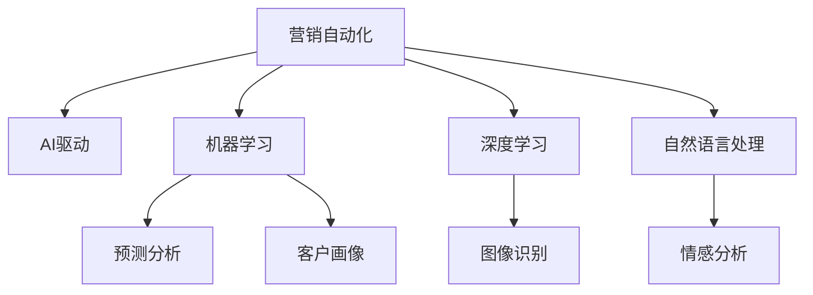

                 

## 1. 背景介绍

在当今数字化时代，市场营销领域面临空前的挑战与机遇。传统的市场营销策略已无法满足消费者不断变化的需求，而新技术的应用如大数据、人工智能等正在重塑营销的格局。随着客户数据量的激增，营销人员需要更加智能、高效地进行分析和决策。营销自动化（Marketing Automation）正成为营销行业的一大趋势，而人工智能驱动的营销自动化（AI-driven Marketing Automation）则提供了前所未有的可能性。

### 1.1 问题由来

营销自动化是一个利用软件技术自动执行营销活动的过程。它通过自动化管理营销活动的各个环节，提高营销效率，降低成本，并实现更加精准的营销策略。传统的营销自动化工具依赖于手动配置和人工决策，效率和精确度受到限制。而人工智能技术能够通过算法自动分析大量数据，识别模式，预测趋势，为营销决策提供支持。

### 1.2 问题核心关键点

人工智能驱动的营销自动化结合了机器学习、深度学习、自然语言处理等技术，利用数据挖掘、预测分析、客户画像生成等技术，优化营销策略。其核心关键点包括：

- 数据整合与分析：利用大数据技术，整合不同来源的数据，进行深度分析，发现客户行为和市场趋势。
- 客户画像生成：基于客户行为数据和交互数据，生成详细的客户画像，帮助制定个性化营销策略。
- 预测分析：使用机器学习算法预测客户行为，指导营销活动。
- 自动化营销策略：根据预测结果自动调整营销活动，实现精准投放。

本文将重点探讨人工智能在营销自动化中的应用，包括关键算法原理、具体操作步骤以及实际应用场景，为营销人员提供一种全新的视角和工具，以提升营销活动的精准度和效率。

## 2. 核心概念与联系

### 2.1 核心概念概述

为了更好地理解人工智能驱动的营销自动化，本节将介绍几个关键概念：

- **营销自动化**：利用软件技术自动执行营销活动的过程，包括电子邮件营销、社交媒体营销、内容营销等。
- **AI驱动的营销自动化**：通过人工智能技术（如机器学习、深度学习、自然语言处理等）自动分析和优化营销活动的过程。
- **机器学习**：一种通过算法让机器从数据中学习模式并进行预测和决策的技术。
- **深度学习**：一种基于多层神经网络的机器学习技术，用于处理非线性问题，如图像识别、语音识别等。
- **自然语言处理**：一种使计算机理解、处理和生成人类语言的技术。

这些核心概念之间的联系通过以下Mermaid流程图展示：



这个流程图展示了大规模自动化营销与AI技术之间的逻辑关系：

1. 营销自动化提供了一个自动执行营销活动的框架。
2. AI驱动的营销自动化在此基础上，利用机器学习、深度学习和自然语言处理技术，进行数据整合与分析、客户画像生成、预测分析等。
3. 这些技术为营销自动化提供了数据驱动的决策支持。

## 3. 核心算法原理 & 具体操作步骤

### 3.1 算法原理概述

人工智能驱动的营销自动化通过以下步骤实现：

1. **数据整合与分析**：收集和整合不同渠道的客户数据，如购买历史、浏览行为、社交媒体互动等。
2. **客户画像生成**：利用机器学习算法对整合数据进行分析，生成详细的客户画像。
3. **预测分析**：通过深度学习模型预测客户未来的行为，如购买意向、流失风险等。
4. **自动化营销策略**：根据预测结果自动调整营销活动，如邮件推荐、个性化广告、优惠券发放等。

### 3.2 算法步骤详解

以下是详细的操作步骤：

**Step 1: 数据收集与整合**

1. **数据来源**：确定数据来源，包括客户购买历史、社交媒体互动、网站浏览行为等。
2. **数据清洗**：对数据进行清洗，处理缺失值、异常值，确保数据质量。
3. **数据整合**：将来自不同渠道的数据整合到一个统一的数据库中。

**Step 2: 客户画像生成**

1. **特征提取**：从整合数据中提取关键特征，如年龄、性别、购买频率、浏览偏好等。
2. **模型训练**：使用机器学习算法（如决策树、随机森林、K-means等）训练客户画像模型。
3. **画像生成**：根据训练模型对客户数据进行分析，生成详细的客户画像。

**Step 3: 预测分析**

1. **模型选择**：选择适合的深度学习模型（如CNN、RNN、LSTM等）进行预测。
2. **特征工程**：对客户数据进行特征工程，提取有用的特征。
3. **模型训练与评估**：训练深度学习模型，并在验证集上评估模型性能。
4. **预测结果**：利用训练好的模型对客户数据进行预测，生成预测结果。

**Step 4: 自动化营销策略**

1. **策略调整**：根据预测结果自动调整营销策略。
2. **实时执行**：通过自动化工具执行调整后的营销活动。
3. **效果评估**：对执行效果进行评估，优化策略。

### 3.3 算法优缺点

AI驱动的营销自动化具有以下优点：

1. **效率高**：自动化流程减少了人工操作，提高了营销活动的执行效率。
2. **精准度高**：通过深度学习和大数据分析，营销策略更加精准，更能满足客户需求。
3. **成本低**：减少了人力投入，降低了营销成本。

同时，它也存在以下缺点：

1. **数据质量要求高**：需要高质量的数据作为支持，数据质量问题会影响模型效果。
2. **模型复杂度高**：深度学习模型训练复杂，需要较高的计算资源。
3. **预测准确性受限**：模型的预测结果受到训练数据的影响，预测准确性可能受限。

### 3.4 算法应用领域

AI驱动的营销自动化在多个领域有着广泛的应用：

- **电子商务**：通过自动化广告投放、个性化推荐、客户服务，提升用户体验和销售额。
- **金融服务**：利用预测模型进行客户流失预警、风险评估，提高客户忠诚度和运营效率。
- **房地产**：通过客户画像生成、精准营销，提升销售转化率。
- **医疗健康**：通过客户行为分析、个性化推荐，提高客户满意度和诊疗效率。
- **教育培训**：通过客户画像生成、个性化教学，提升学习效果和机构品牌。

## 4. 数学模型和公式 & 详细讲解  
### 4.1 数学模型构建

营销自动化的数学模型通常基于机器学习和深度学习的框架，以下是一个简化的数学模型：

$$
y = f(x; \theta)
$$

其中，$y$表示营销活动的结果，$x$表示客户特征，$f(\cdot)$表示预测模型，$\theta$表示模型参数。

### 4.2 公式推导过程

以客户流失预测模型为例，我们可以使用逻辑回归模型进行预测：

$$
p(y=1|x) = \frac{1}{1+\exp(-\beta_0-\beta_1x_1-\beta_2x_2-\cdots-\beta_nx_n)}
$$

其中，$y=1$表示客户将流失，$y=0$表示客户不会流失。$\beta_i$为模型的系数，$x_i$为特征变量。

### 4.3 案例分析与讲解

假设我们要预测客户流失概率，利用历史数据训练一个逻辑回归模型：

1. **数据准备**：收集客户历史数据，包括购买频率、投诉记录、客户满意度等特征。
2. **特征工程**：对数据进行特征提取和选择。
3. **模型训练**：使用逻辑回归模型对数据进行训练，得到预测模型。
4. **预测结果**：对新客户数据进行预测，生成客户流失概率。

## 5. 项目实践：代码实例和详细解释说明

### 5.1 开发环境搭建

要进行AI驱动的营销自动化项目，需要搭建合适的开发环境。以下是搭建环境的步骤：

1. **安装Python**：Python是开发AI驱动营销自动化的主要编程语言，可以从官网下载安装。
2. **安装Pip**：Pip是Python的包管理工具，用于安装和管理第三方库。
3. **安装相关库**：如Pandas、NumPy、Scikit-learn、TensorFlow等。
4. **安装数据处理工具**：如ETL工具、数据可视化工具等。

### 5.2 源代码详细实现

以下是使用TensorFlow进行客户流失预测的Python代码实现：

```python
import tensorflow as tf
from sklearn.model_selection import train_test_split
from sklearn.metrics import roc_auc_score
import pandas as pd

# 读取数据
data = pd.read_csv('customer_data.csv')

# 特征工程
X = data.drop(['churn'], axis=1)
y = data['churn']

# 数据分割
X_train, X_test, y_train, y_test = train_test_split(X, y, test_size=0.2, random_state=42)

# 定义模型
model = tf.keras.models.Sequential([
    tf.keras.layers.Dense(64, activation='relu', input_shape=[X_train.shape[1]]),
    tf.keras.layers.Dense(1, activation='sigmoid')
])

# 编译模型
model.compile(loss='binary_crossentropy', optimizer='adam', metrics=['AUC'])

# 训练模型
model.fit(X_train, y_train, epochs=10, batch_size=32, validation_data=(X_test, y_test))

# 评估模型
y_pred = model.predict(X_test)
auc = roc_auc_score(y_test, y_pred)
print(f"AUC: {auc}")
```

### 5.3 代码解读与分析

以下是关键代码的解读：

**特征工程**：通过`drop`方法去掉目标变量`churn`，得到特征集`X`和标签集`y`。

**模型定义**：使用`Sequential`定义一个线性模型，包含一个全连接层和一个输出层。

**模型编译**：使用`compile`方法指定损失函数、优化器和评价指标。

**模型训练**：使用`fit`方法训练模型，`validation_data`参数用于验证集评估模型性能。

**模型评估**：使用`predict`方法生成预测结果，计算AUC值。

### 5.4 运行结果展示

通过上述代码，我们训练了一个简单的二分类模型，并计算了AUC值。AUC值越高，模型的预测性能越好。实际应用中，需要根据具体场景调整模型结构和超参数，以提高预测准确性。

## 6. 实际应用场景

### 6.1 电子商务

在电子商务领域，AI驱动的营销自动化可以显著提升用户体验和销售额。通过分析客户浏览行为、购买记录等数据，生成客户画像，推荐个性化产品，并发送个性化营销邮件。这些措施能够显著提高客户的购买转化率和满意度。

### 6.2 金融服务

在金融服务领域，AI驱动的营销自动化可以帮助银行识别潜在的高风险客户，提前采取措施，降低客户流失率。通过客户行为分析和情感分析，银行可以制定更加个性化和精准的营销策略。

### 6.3 房地产

在房地产领域，AI驱动的营销自动化可以帮助房地产公司分析客户需求，预测市场趋势，精准投放广告，提升销售转化率。通过客户画像生成和预测分析，公司能够更好地理解客户需求，提高营销效果。

### 6.4 未来应用展望

未来，随着AI技术的不断进步，营销自动化将更加智能化、自动化。以下是几个可能的发展方向：

1. **多模态数据融合**：利用多模态数据（如视频、图像、音频等）进行客户画像生成和预测分析，提供更加全面的视角。
2. **实时动态调整**：通过实时数据分析和预测，动态调整营销策略，提高策略的灵活性和适应性。
3. **个性化推荐系统**：结合推荐算法，实现更加精准的产品推荐，提升客户满意度。
4. **情感分析与客户互动**：利用自然语言处理技术，进行情感分析和客户互动，提高客户体验。

## 7. 工具和资源推荐

### 7.1 学习资源推荐

为了掌握AI驱动的营销自动化技术，以下是一些优质的学习资源：

1. **Coursera《机器学习》课程**：由斯坦福大学Andrew Ng教授主讲，涵盖机器学习的基本概念和算法。
2. **edX《深度学习基础》课程**：由深度学习领域的权威MIT教授Ian Goodfellow主讲，介绍深度学习的原理和实践。
3. **Kaggle机器学习竞赛**：通过参与Kaggle的竞赛，实战练习AI技能。
4. **TensorFlow官方文档**：TensorFlow的官方文档提供了丰富的教程和API文档，是学习深度学习的重要资源。
5. **GitHub开源项目**：如TensorFlow营销自动化示例，提供了丰富的代码和文档，有助于理解实际应用场景。

### 7.2 开发工具推荐

以下是一些常用的开发工具：

1. **Python**：开发AI驱动营销自动化的主要编程语言，具有丰富的库和框架。
2. **TensorFlow**：由Google开发的深度学习框架，具有强大的计算图和分布式训练能力。
3. **Pandas**：数据处理和分析的库，支持数据清洗、特征工程等操作。
4. **NumPy**：科学计算的库，支持高效矩阵运算。
5. **Scikit-learn**：机器学习库，包含多种算法和工具。

### 7.3 相关论文推荐

以下是几篇具有代表性的相关论文：

1. **《A Survey of Marketing Automation: Data Analytics and AI-Driven Solutions》**：总结了营销自动化领域的研究进展，介绍了AI技术的应用。
2. **《Customer Churn Prediction in the Telecom Industry: A Comparison of Machine Learning Algorithms》**：通过比较多种机器学习算法，展示了客户流失预测的实际应用。
3. **《AI-Driven Marketing Automation: A Comprehensive Survey and Analysis》**：深入分析了AI驱动营销自动化的发展趋势和技术挑战。
4. **《Predictive Analytics in Marketing Automation》**：介绍了预测分析在营销自动化中的应用，提供了实际案例和数据模型。

## 8. 总结：未来发展趋势与挑战

### 8.1 总结

本文对AI驱动的营销自动化进行了全面系统的介绍。通过分析数据、构建模型、实施策略，展示了AI在营销自动化中的应用。AI驱动的营销自动化结合了机器学习、深度学习、自然语言处理等技术，能够高效地分析客户数据，生成客户画像，预测客户行为，自动调整营销策略。这些技术的综合应用，使得营销自动化更加智能化和高效化。

### 8.2 未来发展趋势

未来，AI驱动的营销自动化将呈现以下趋势：

1. **数据融合与处理**：利用多模态数据进行客户画像生成和预测分析，提升模型效果。
2. **实时动态调整**：通过实时数据分析和预测，动态调整营销策略，提高策略的灵活性和适应性。
3. **个性化推荐系统**：结合推荐算法，实现更加精准的产品推荐，提升客户满意度。
4. **情感分析与客户互动**：利用自然语言处理技术，进行情感分析和客户互动，提高客户体验。
5. **智能客户服务**：通过AI驱动的客户服务系统，实现自动化客户服务，提升客户满意度和忠诚度。

### 8.3 面临的挑战

尽管AI驱动的营销自动化技术前景广阔，但在实现过程中仍面临诸多挑战：

1. **数据质量问题**：数据质量问题会影响模型的预测效果，需要高质量的数据作为支持。
2. **模型复杂度**：深度学习模型训练复杂，需要较高的计算资源。
3. **解释性不足**：模型的决策过程缺乏可解释性，难以对其推理逻辑进行分析和调试。
4. **隐私与安全性**：客户数据的隐私和安全问题需要得到充分保障，避免数据泄露和滥用。
5. **技术门槛高**：需要具备较高的技术水平和数据处理能力，才能高效地实现AI驱动的营销自动化。

### 8.4 研究展望

未来的研究可以从以下几个方向进行：

1. **数据治理与质量提升**：研究如何提高数据质量，建立数据治理机制，确保数据准确性和完整性。
2. **模型简化与优化**：研究如何简化模型结构，提高模型效率，减少计算资源消耗。
3. **可解释性与透明性**：研究如何提高模型的可解释性，增强客户信任和接受度。
4. **隐私保护与安全性**：研究如何保护客户数据隐私，确保数据安全。
5. **多模态融合与跨领域应用**：研究如何利用多模态数据进行跨领域应用，拓展AI驱动营销自动化的应用范围。

## 9. 附录：常见问题与解答

### Q1: 什么是AI驱动的营销自动化？

A: AI驱动的营销自动化是一种利用人工智能技术，通过自动化执行营销活动的过程。它结合了机器学习、深度学习、自然语言处理等技术，实现数据整合与分析、客户画像生成、预测分析等。

### Q2: AI驱动的营销自动化在实际应用中有哪些优势？

A: AI驱动的营销自动化具有以下优势：
1. 效率高：自动化流程减少了人工操作，提高了营销活动的执行效率。
2. 精准度高：通过深度学习和大数据分析，营销策略更加精准，更能满足客户需求。
3. 成本低：减少了人力投入，降低了营销成本。

### Q3: 实施AI驱动的营销自动化需要哪些关键步骤？

A: 实施AI驱动的营销自动化需要以下关键步骤：
1. 数据收集与整合
2. 客户画像生成
3. 预测分析
4. 自动化营销策略

### Q4: 在实际应用中，AI驱动的营销自动化有哪些挑战？

A: AI驱动的营销自动化面临以下挑战：
1. 数据质量问题
2. 模型复杂度
3. 解释性不足
4. 隐私与安全性
5. 技术门槛高

### Q5: 未来AI驱动的营销自动化技术有哪些发展趋势？

A: 未来AI驱动的营销自动化技术将呈现以下发展趋势：
1. 数据融合与处理
2. 实时动态调整
3. 个性化推荐系统
4. 情感分析与客户互动
5. 智能客户服务

---

作者：禅与计算机程序设计艺术 / Zen and the Art of Computer Programming

