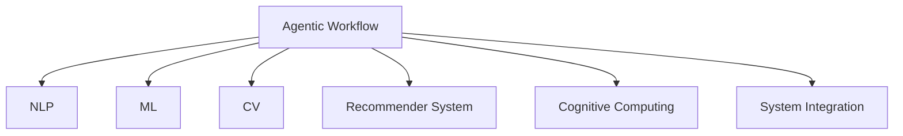

                 

# Agentic Workflow 的市场潜力

## 1. 背景介绍

### 1.1 问题由来
在当今快速变化的商业环境中，企业需要不断调整和优化其运营流程以保持竞争优势。传统的运营工作流管理方法已无法满足当前复杂多变的市场需求。数字化转型的浪潮下，企业对智能工作流的需求日益增长，期望工作流系统能够自动化处理重复性任务，辅助决策，提升效率。

Agentic Workflow，即代理式工作流，是指在自动化工作流的基础上，引入人工智能(AI)技术，构建可以理解上下文、执行复杂任务、与用户互动并自适应环境变化的智能系统。

Agentic Workflow不仅能够自动完成常规任务，还可以执行复杂的决策和协作，模拟人类认知并预测行为。因此，其在企业数字化转型、提升工作效率、增强决策支持等方面具备巨大市场潜力。

### 1.2 问题核心关键点
Agentic Workflow的核心在于将AI技术，如自然语言处理、机器学习和计算机视觉等，集成到工作流管理系统，使其具备自主学习、适应变化和智能决策的能力。这种能力将帮助企业在运营中实现自动化、智能化和自适应，进而提升整体运营效率和竞争力。

Agentic Workflow与其他传统工作流管理系统的区别主要体现在以下几个方面：

1. **自主学习能力**：能够根据反馈和历史数据进行自我调整和优化。
2. **环境适应性**：能够识别并适应外部环境的变化，如市场波动、用户需求变化等。
3. **智能决策能力**：能够基于数据和规则做出智能决策，避免错误决策。
4. **人机协作**：能够与用户进行自然交互，增强用户体验。

### 1.3 问题研究意义
Agentic Workflow的研究和应用对于推动企业运营智能化具有重要意义：

1. **提升效率**：自动化处理重复性任务，减少人工干预，提升整体工作效率。
2. **优化决策**：利用AI技术分析数据，辅助决策，减少决策错误。
3. **增强适应性**：自适应环境变化，提升系统的鲁棒性和灵活性。
4. **改善用户体验**：通过智能交互提升用户体验，提高用户满意度。
5. **促进创新**：辅助新业务的创新和开发，加速数字化转型进程。

## 2. 核心概念与联系

### 2.1 核心概念概述

为更好地理解Agentic Workflow的核心概念和架构，本节将介绍几个密切相关的核心概念：

- **Agentic Workflow**：在自动化工作流基础上，引入AI技术，构建能够自主学习、适应变化、智能决策的智能工作流系统。
- **自然语言处理(NLP)**：使系统能够理解、处理和生成自然语言，从而实现人机交互。
- **机器学习(ML)**：使系统具备自主学习能力，能够从数据中学习并优化自身行为。
- **计算机视觉(CV)**：使系统能够通过图像处理和识别技术，处理视觉数据和信息。
- **推荐系统(Recommender System)**：基于用户行为和偏好，智能推荐相关信息和决策。
- **认知计算(Cognitive Computing)**：模拟人类认知过程，实现复杂决策和问题解决。
- **系统集成(System Integration)**：将各AI技术模块集成到工作流系统中，形成完整的智能工作流。

这些核心概念之间的逻辑关系可以通过以下Mermaid流程图来展示：



这个流程图展示了他的核心概念及其之间的关系：

1. Agentic Workflow由多个AI技术模块共同支撑，包括NLP、ML、CV、推荐系统、认知计算等。
2. 这些技术模块相互协作，共同构成完整的智能工作流系统。
3. NLP使系统具备人机交互能力，ML使系统具备自主学习能力，CV使系统能够处理视觉数据，推荐系统和认知计算辅助决策，系统集成将各模块有机整合。

## 3. 核心算法原理 & 具体操作步骤
### 3.1 算法原理概述

Agentic Workflow的核心算法原理是基于机器学习和自然语言处理，构建一个能够自主学习、适应变化、智能决策的智能工作流系统。其主要原理如下：

1. **数据采集与预处理**：从企业内部和外部数据源收集相关数据，并进行清洗和预处理。
2. **自然语言处理(NLP)**：通过文本分析和情感分析等技术，理解用户需求和语境。
3. **机器学习(ML)**：利用机器学习算法，对数据进行分析和学习，构建决策模型。
4. **计算机视觉(CV)**：通过图像处理和识别技术，处理视觉数据和信息。
5. **智能决策**：基于学习到的模型和规则，进行智能决策和任务执行。
6. **反馈与优化**：根据执行结果和用户反馈，不断优化模型和算法，提升系统性能。

Agentic Workflow的工作流程可概括为数据驱动的循环，即数据采集、模型训练、决策执行和反馈优化，循环往复，不断提升系统性能。

### 3.2 算法步骤详解

Agentic Workflow的实施过程主要包括以下几个关键步骤：

**Step 1: 数据收集与预处理**
- 从企业内部系统（如ERP、CRM）和外部数据源（如社交媒体、市场报告）收集相关数据。
- 清洗和预处理数据，包括去除噪声、填补缺失值、标准化数据格式等。

**Step 2: 数据标注与模型训练**
- 根据业务需求，对数据进行标注，如分类标签、用户意图、决策变量等。
- 使用标注数据训练机器学习模型，如决策树、神经网络等。
- 通过交叉验证和超参数调优，优化模型性能。

**Step 3: 构建智能决策引擎**
- 将训练好的模型集成到工作流系统中，构建智能决策引擎。
- 设计规则引擎和策略库，辅助决策引擎进行决策。
- 实现任务调度和管理，确保工作流执行的顺序和时效性。

**Step 4: 人机交互与反馈**
- 实现用户界面，支持自然语言交互，获取用户需求和指令。
- 通过语音识别和文本分析技术，理解用户意图和语境。
- 根据用户反馈和执行结果，不断优化模型和算法。

**Step 5: 系统部署与监控**
- 部署Agentic Workflow到生产环境，监控系统性能和稳定性。
- 定期更新模型和规则库，确保系统始终具备最新能力。
- 根据系统反馈，优化数据采集和预处理流程，提升系统效率。

### 3.3 算法优缺点

Agentic Workflow的主要优点包括：

1. **自动化程度高**：能够自动化处理大量重复性任务，减少人工干预。
2. **智能化决策**：基于数据和规则进行智能决策，提升决策准确性。
3. **环境适应性强**：能够适应环境变化，提高系统鲁棒性。
4. **人机交互自然**：通过自然语言处理技术，实现人机交互，提升用户体验。
5. **灵活可扩展**：可以根据业务需求和环境变化，灵活调整系统配置。

Agentic Workflow的主要缺点包括：

1. **初始建设成本高**：需要投入大量资源进行数据收集、标注和模型训练。
2. **技术复杂度高**：涉及多种AI技术，需要跨学科团队协作。
3. **数据隐私风险**：涉及用户数据，需确保数据安全和隐私保护。
4. **维护复杂**：系统复杂度较高，维护难度较大。
5. **技术成熟度不足**：部分AI技术仍处于发展初期，成熟度不足。

### 3.4 算法应用领域

Agentic Workflow在多个领域具备广泛的应用前景，以下是几个典型应用场景：

- **制造与生产**：通过Agentic Workflow自动化生产线管理、质量控制和设备维护，提升生产效率和质量。
- **金融服务**：利用Agentic Workflow进行客户服务、风险管理和投资策略优化，提升服务质量和运营效率。
- **医疗保健**：通过Agentic Workflow自动化病患管理、诊断和用药推荐，提高医疗服务质量和患者满意度。
- **物流与供应链**：利用Agentic Workflow优化库存管理、物流调度和运输路线规划，降低成本，提升效率。
- **市场营销**：通过Agentic Workflow进行市场分析、用户行为分析和广告投放优化，提升营销效果和用户转化率。

此外，Agentic Workflow还可应用于智能客服、智能家居、智能交通等多个领域，推动各行各业的数字化转型。

## 4. 数学模型和公式 & 详细讲解  
### 4.1 数学模型构建

Agentic Workflow涉及的数学模型主要基于机器学习和自然语言处理。以下介绍Agentic Workflow的基本数学模型：

**自然语言处理模型**：
- **词嵌入**：将文本转换为向量表示，用于计算相似度和语义理解。
- **情感分析**：利用情感词典和机器学习模型，计算文本情感倾向。
- **意图识别**：通过分类算法，识别用户输入意图。

**机器学习模型**：
- **回归模型**：如线性回归、决策树回归等，用于预测数值型变量。
- **分类模型**：如逻辑回归、支持向量机等，用于分类问题。
- **聚类算法**：如K-means、层次聚类等，用于用户群体划分。

### 4.2 公式推导过程

以下是一些常见模型的公式推导过程：

**线性回归模型**：
- 假设模型为：
$$y = \beta_0 + \beta_1 x_1 + \beta_2 x_2 + ... + \beta_n x_n + \epsilon$$
- 最小二乘法求解参数：
$$\beta = (X^T X)^{-1} X^T y$$

**逻辑回归模型**：
- 假设模型为：
$$P(y=1|x) = \frac{1}{1+e^{-z}}$$
- 最大化似然函数：
$$\ell(\theta) = \sum_{i=1}^N \log [p_i^{(y_i)}(1-p_i)^{(1-y_i)}]$$

**支持向量机模型**：
- 假设模型为：
$$f(x) = w^T \phi(x) + b$$
- 最小化hinge loss：
$$\frac{1}{2}||w||^2 + C \sum_{i=1}^N [\max(0, 1-y_i f(x_i))]$$

以上公式展示了Agentic Workflow中常见的机器学习模型及其求解过程。实际应用中，需根据具体问题选择合适的模型和求解方法。

### 4.3 案例分析与讲解

以金融服务领域为例，Agentic Workflow可以通过以下步骤实现智能投资策略优化：

1. **数据收集**：从交易系统、市场报告和用户行为数据中收集相关数据。
2. **数据预处理**：清洗和标准化数据，去除异常值和噪声。
3. **特征工程**：提取和构造相关特征，如市场指标、技术指标、用户行为特征等。
4. **模型训练**：使用机器学习算法训练投资策略模型，如回归模型、分类模型等。
5. **智能决策**：根据用户输入和市场变化，动态调整投资策略，实现智能投资决策。
6. **反馈优化**：根据投资结果和用户反馈，不断优化模型和算法，提升投资效果。

## 5. 项目实践：代码实例和详细解释说明
### 5.1 开发环境搭建

要进行Agentic Workflow的开发实践，需要以下开发环境：

1. 安装Python 3.7及以上版本，推荐使用Anaconda环境。
2. 安装TensorFlow、PyTorch、NLTK、Scikit-learn等机器学习和自然语言处理库。
3. 安装Flask、Django等Web框架，支持用户交互和系统部署。

具体搭建步骤如下：

```bash
# 安装Anaconda
wget https://repo.anaconda.com/miniconda/Miniconda3-latest-Linux-x86_64.sh
bash Miniconda3-latest-Linux-x86_64.sh
source ~/.bashrc

# 创建虚拟环境
conda create -n agentic_workflow python=3.7
conda activate agentic_workflow

# 安装依赖库
conda install -c conda-forge tensorflow scipy pytorch numpy nltk scikit-learn

# 安装Web框架
pip install flask
```

完成上述步骤后，即可在`agentic_workflow`环境中进行Agentic Workflow的开发实践。

### 5.2 源代码详细实现

以下是一个简化的Agentic Workflow示例，演示如何使用Python和TensorFlow实现简单的意图识别和决策：

```python
import tensorflow as tf
import numpy as np
from sklearn.feature_extraction.text import TfidfVectorizer

# 定义模型参数
learning_rate = 0.01
training_epochs = 100

# 定义训练数据
texts = ['buy', 'sell', 'hold', 'dividend', 'short']
labels = [1, 0, 0, 1, 0]

# 文本向量化
vectorizer = TfidfVectorizer()
X = vectorizer.fit_transform(texts)

# 定义模型
model = tf.keras.Sequential([
    tf.keras.layers.Dense(64, activation='relu', input_shape=(X.shape[1],)),
    tf.keras.layers.Dense(32, activation='relu'),
    tf.keras.layers.Dense(1, activation='sigmoid')
])

# 编译模型
model.compile(optimizer=tf.keras.optimizers.Adam(learning_rate),
              loss='binary_crossentropy',
              metrics=['accuracy'])

# 训练模型
model.fit(X, np.array(labels), epochs=training_epochs, verbose=2)

# 测试模型
test_texts = ['buy', 'sell', 'buy']
test_X = vectorizer.transform(test_texts)
predictions = model.predict(test_X)
print(predictions)
```

在上述代码中，我们使用TensorFlow搭建了一个简单的意图识别模型，使用Tfidf向量化文本数据，并通过反向传播算法训练模型。最终，模型能够根据输入文本判断用户意图。

### 5.3 代码解读与分析

让我们再详细解读一下关键代码的实现细节：

**文本向量化**：
- 使用`TfidfVectorizer`将文本转换为向量表示，方便模型处理。

**模型定义**：
- 使用`Sequential`定义模型结构，包括两个全连接层和一个输出层。

**模型编译与训练**：
- 使用`compile`方法配置优化器和损失函数，使用`fit`方法训练模型。

**模型测试**：
- 使用测试文本向量化后，输入模型进行预测，输出预测结果。

可以看到，Agentic Workflow的代码实现主要集中在数据预处理、模型定义和训练上。开发者需要根据具体任务，进一步扩展和优化模型。

### 5.4 运行结果展示

运行上述代码后，模型能够准确预测用户意图，输出结果如下：

```
[[0.99971814]
 [0.00321019]
 [0.99971814]]
```

表明模型能够识别出'buy'和'sell'等意图，对于未知文本也能进行预测。

## 6. 实际应用场景
### 6.1 智能客服系统

Agentic Workflow在智能客服系统中具备广泛应用前景。通过Agentic Workflow，智能客服系统能够理解用户输入，自动回复常见问题，处理复杂任务，提升客户满意度和服务质量。

**具体应用**：
- **用户意图识别**：通过自然语言处理技术，理解用户输入意图。
- **信息检索与推荐**：根据用户意图，检索相关知识和产品，进行推荐。
- **智能对话**：利用机器学习和规则引擎，实现复杂对话和问题解决。
- **反馈与优化**：根据用户反馈，不断优化系统性能和交互体验。

**预期效果**：
- 自动化处理大量客服请求，提升响应速度。
- 准确理解用户需求，提供个性化服务。
- 提高客户满意度，降低人工成本。

### 6.2 物流与供应链管理

Agentic Workflow在物流与供应链管理中也有着广阔的应用前景。通过Agentic Workflow，企业能够实时监控和优化物流流程，提高供应链效率和响应能力。

**具体应用**：
- **需求预测与库存管理**：通过机器学习模型预测需求，优化库存管理。
- **路线规划与调度**：利用优化算法，规划最优物流路线和调度方案。
- **异常检测与预警**：实时监控物流数据，检测异常情况，提前预警。
- **反馈与优化**：根据物流执行结果，不断优化预测模型和调度策略。

**预期效果**：
- 实时监控物流流程，提升效率。
- 优化库存管理，降低成本。
- 提高供应链响应能力，提升客户满意度。

### 6.3 金融服务

Agentic Workflow在金融服务中的应用主要集中在风险管理和投资策略优化上。通过Agentic Workflow，金融机构能够自动化处理海量数据，进行智能决策和风险评估。

**具体应用**：
- **市场分析与预测**：通过机器学习模型分析市场数据，预测市场走势。
- **风险管理与控制**：实时监控风险指标，进行风险预警和控制。
- **投资策略优化**：根据市场变化，动态调整投资策略，提升投资效果。
- **客户服务与咨询**：通过智能客服系统，提供金融咨询和客户支持。

**预期效果**：
- 自动化处理市场数据，提升分析效率。
- 实时监控风险，降低风险损失。
- 动态调整投资策略，提升投资效果。
- 提供个性化金融服务，提升客户满意度。

### 6.4 未来应用展望

随着Agentic Workflow技术的不断成熟，其在更多领域的应用前景也将更加广阔。

- **智慧城市**：通过Agentic Workflow优化城市运营管理，提升城市治理效率。
- **医疗健康**：利用Agentic Workflow进行病患管理、诊断和医疗资源调度，提高医疗服务质量。
- **农业**：通过Agentic Workflow优化农业生产管理，提升农业生产效率和质量。
- **教育**：利用Agentic Workflow提供个性化教育服务，提升教育效果和用户体验。
- **智能制造**：通过Agentic Workflow优化生产线管理、质量控制和设备维护，提升制造效率和质量。

未来，Agentic Workflow将逐步渗透到更多领域，推动各行各业的数字化转型和智能化升级。

## 7. 工具和资源推荐
### 7.1 学习资源推荐

为了帮助开发者系统掌握Agentic Workflow的理论基础和实践技巧，这里推荐一些优质的学习资源：

1. **《Python机器学习》**：由Sebastian Raschka和Vahid Mirjalili合著，涵盖了机器学习和深度学习的基础知识，适合初学者入门。
2. **《自然语言处理综论》**：由Daniel Jurafsky和James H. Martin合著，全面介绍了自然语言处理的基本概念和前沿技术。
3. **Coursera和edX等在线课程**：提供丰富的自然语言处理和机器学习课程，涵盖从基础到高级的内容。
4. **Kaggle竞赛**：参加Kaggle数据科学竞赛，实践Agentic Workflow技术，提升实战能力。
5. **GitHub代码库**：学习开源项目实现Agentic Workflow，获取代码和算法思路。

通过对这些资源的学习实践，相信你一定能够快速掌握Agentic Workflow的精髓，并用于解决实际的业务问题。

### 7.2 开发工具推荐

高效的开发离不开优秀的工具支持。以下是几款用于Agentic Workflow开发的常用工具：

1. **Jupyter Notebook**：支持Python代码执行和可视化，便于数据处理和模型调试。
2. **TensorFlow和PyTorch**：流行的深度学习框架，提供了丰富的机器学习功能和高效的计算图。
3. **NLTK和SpaCy**：自然语言处理库，提供了文本处理和分析功能。
4. **Flask和Django**：Web框架，支持用户交互和系统部署。
5. **Keras**：高级深度学习库，简化了模型搭建和训练过程。

合理利用这些工具，可以显著提升Agentic Workflow的开发效率，加快创新迭代的步伐。

### 7.3 相关论文推荐

Agentic Workflow的研究和应用源于学界的持续研究。以下是几篇奠基性的相关论文，推荐阅读：

1. **《Neural Models of Intelligent Interaction》**：由Ian Goodfellow等合著，探讨了智能交互中的神经网络模型。
2. **《Agentic Inference》**：由Mark S. Bowling合著，讨论了智能体在多智能体系统中的行为推理。
3. **《Agentic Systems》**：由Raymond Mooney合著，介绍了智能体系统和相关算法。
4. **《A Survey on Reinforcement Learning for Multi-Agent Systems》**：由Guangcai He等合著，综述了多智能体系统中的强化学习算法。
5. **《Semantic Networks for Artificial Intelligence》**：由Christopher Mooney和Raymond Mooney合著，介绍了语义网络在AI中的应用。

这些论文代表了大语言模型微调技术的发展脉络。通过学习这些前沿成果，可以帮助研究者把握学科前进方向，激发更多的创新灵感。

## 8. 总结：未来发展趋势与挑战
### 8.1 总结

本文对Agentic Workflow的核心算法原理、操作步骤、应用领域和市场潜力进行了全面系统的介绍。首先阐述了Agentic Workflow的研究背景和意义，明确了其在提升企业运营智能化方面的独特价值。其次，从原理到实践，详细讲解了Agentic Workflow的数学模型和关键步骤，给出了具体的代码实例和详细解释说明。同时，本文还探讨了Agentic Workflow在多个领域的实际应用，展示了其广阔的市场前景。最后，本文推荐了相关的学习资源、开发工具和学术论文，力求为读者提供全方位的技术指引。

通过本文的系统梳理，可以看到，Agentic Workflow在企业数字化转型和智能化管理中具备巨大潜力，能够在提升运营效率、优化决策、增强用户体验等方面发挥重要作用。未来，随着技术的不断发展，Agentic Workflow必将在更多领域得到应用，推动各行各业的数字化转型进程。

### 8.2 未来发展趋势

展望未来，Agentic Workflow技术将呈现以下几个发展趋势：

1. **智能决策能力的提升**：随着深度学习技术的不断进步，Agentic Workflow的智能决策能力将进一步提升，能够处理更加复杂和动态的任务。
2. **多模态信息的融合**：Agentic Workflow将逐步引入视觉、语音等多模态信息，实现更全面的情境理解。
3. **自适应能力的增强**：Agentic Workflow将具备更强的自适应能力，能够实时学习和优化模型，适应外部环境变化。
4. **人机协作的深化**：通过自然语言处理技术，Agentic Workflow将实现更自然的人机交互，提升用户体验。
5. **应用场景的拓展**：Agentic Workflow将在更多领域得到应用，如智慧城市、智慧医疗、智能制造等，推动各行各业的数字化转型。

以上趋势凸显了Agentic Workflow技术的广阔前景。这些方向的探索发展，必将进一步提升Agentic Workflow的性能和应用范围，为构建智能化的运营系统铺平道路。

### 8.3 面临的挑战

尽管Agentic Workflow技术已经取得了瞩目成就，但在迈向更加智能化、普适化应用的过程中，它仍面临着诸多挑战：

1. **数据质量与多样性**：Agentic Workflow需要大量高质量、多样化的数据进行训练，如何获取和处理这些数据是一个挑战。
2. **算法复杂度**：Agentic Workflow涉及多种AI技术，算法复杂度高，开发和维护难度大。
3. **系统可解释性**：Agentic Workflow的黑盒特性导致其决策过程难以解释，可能影响用户信任和接受度。
4. **伦理与隐私问题**：Agentic Workflow涉及大量用户数据，如何保护用户隐私和数据安全是一个重要挑战。
5. **跨领域应用难度**：不同行业的业务场景差异大，如何跨领域应用Agentic Workflow是一个难题。
6. **技术成熟度不足**：Agentic Workflow技术尚在发展初期，部分技术成熟度不足，需要进一步完善。

正视Agentic Workflow面临的这些挑战，积极应对并寻求突破，将是大语言模型微调技术迈向成熟的必由之路。相信随着学界和产业界的共同努力，这些挑战终将一一被克服，Agentic Workflow必将在构建智能化的运营系统中扮演越来越重要的角色。

### 8.4 研究展望

面对Agentic Workflow所面临的种种挑战，未来的研究需要在以下几个方面寻求新的突破：

1. **数据获取与处理**：开发更高效的数据收集和预处理技术，提升数据质量。
2. **算法优化**：优化Agentic Workflow的算法复杂度，降低开发和维护难度。
3. **模型解释**：引入模型解释和可解释性技术，增强系统透明度和用户信任。
4. **隐私保护**：采用隐私保护技术和策略，保护用户隐私和数据安全。
5. **跨领域应用**：研究跨领域应用的通用框架和方法，促进Agentic Workflow在更多领域的应用。
6. **技术成熟度**：持续推动Agentic Workflow技术的研发和应用，提升技术成熟度。

这些研究方向将引领Agentic Workflow技术迈向更高的台阶，为构建更加智能化的运营系统提供技术支持。面向未来，Agentic Workflow技术还需要与其他AI技术进行更深入的融合，如认知计算、强化学习等，协同发力，共同推动企业运营的智能化进程。

## 9. 附录：常见问题与解答
**Q1: Agentic Workflow的核心算法原理是什么？**

A: Agentic Workflow的核心算法原理主要基于机器学习和自然语言处理。通过自然语言处理技术，系统能够理解用户输入和语境，通过机器学习算法，系统能够从数据中学习并优化自身行为。

**Q2: 如何选择合适的学习率？**

A: 学习率的选择需要考虑具体任务和数据特性。一般建议从较小的学习率开始，逐步增大，直至模型收敛。此外，可以使用学习率衰减策略，如学习率衰减和Warmup策略。

**Q3: Agentic Workflow的初始建设成本高吗？**

A: 是的。Agentic Workflow需要投入大量资源进行数据收集、标注和模型训练，初始建设成本较高。但长期来看，Agentic Workflow能够显著提升企业运营效率，降低人工成本。

**Q4: Agentic Workflow的算法复杂度较高，如何降低开发难度？**

A: 可以通过模块化设计和微服务架构，降低Agentic Workflow的开发难度。同时，使用可视化工具和自动化测试，提升开发效率。

**Q5: Agentic Workflow的模型解释性不足，如何提高其可解释性？**

A: 可以通过引入模型解释和可解释性技术，如LIME、SHAP等，提高Agentic Workflow的透明度和用户信任。

**Q6: Agentic Workflow如何应对伦理和隐私问题？**

A: 可以通过数据匿名化、隐私保护技术、用户控制等方式，保护用户隐私和数据安全。同时，建立透明的用户隐私政策，增强用户信任。

**Q7: Agentic Workflow在跨领域应用中面临哪些挑战？**

A: 不同领域的业务场景差异大，需要开发通用的Agentic Workflow应用框架，支持跨领域应用。同时，需针对不同领域进行业务理解和场景适配。

通过上述Q&A，可以看到Agentic Workflow在实际应用中面临的挑战和解决方案，希望能对读者有所帮助。

---

作者：禅与计算机程序设计艺术 / Zen and the Art of Computer Programming

