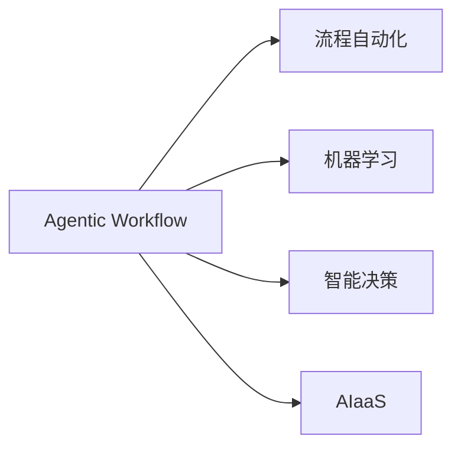

                 

## 1. 背景介绍

Agentic Workflow（简称AF）是一种新兴的流程自动化技术，它利用人工智能和机器学习算法来优化、自动化和智能化复杂的业务流程。AF结合了流程自动化（Process Automation, PA）、机器学习和智能决策的能力，能够在各种复杂流程中提供高效、灵活和可扩展的解决方案。然而，AF在实际应用中也存在一些局限性和挑战，本文将系统性地分析这些局限性，并提出相应的改进建议。

## 2. 核心概念与联系

### 2.1 核心概念概述

**Agentic Workflow**：一种融合流程自动化、机器学习和智能决策的自动化技术，旨在通过智能化手段优化和自动化复杂的业务流程。

**流程自动化**（Process Automation, PA）：通过自动化工具和软件，将手工、重复、易出错的任务自动化，提高效率和准确性。

**机器学习**：一种利用数据训练算法，使计算机从经验中学习的技术，可用于预测、分类、聚类等任务。

**智能决策**：通过算法和规则，使计算机能够根据输入数据自动作出最优决策。

**AIaaS（AI as a Service）**：基于云的AI服务，提供各种AI算法和工具，如自然语言处理、计算机视觉、机器学习等。

### 2.2 核心概念原理和架构的 Mermaid 流程图



## 3. 核心算法原理 & 具体操作步骤

### 3.1 算法原理概述

Agentic Workflow的核心原理是通过自动化、机器学习和智能决策的结合，对复杂业务流程进行优化和自动化。其基本流程包括以下几个步骤：

1. **流程建模**：将业务流程模型化，定义输入、输出、中间步骤和决策节点。
2. **数据准备**：收集、清洗和准备流程中的数据，以便机器学习模型的训练和预测。
3. **模型训练**：使用机器学习算法训练模型，以预测流程中的决策和行为。
4. **流程优化**：基于模型预测结果，优化流程中的决策路径和执行顺序，提高效率和准确性。
5. **自动化执行**：将优化后的流程自动执行，实现业务的智能化和自动化。

### 3.2 算法步骤详解

**步骤1：流程建模**

流程建模是Agentic Workflow的基础，需要定义流程的输入、输出和中间步骤，以及决策节点。例如，一个电商平台的订单处理流程包括接收订单、审核订单、发货、配送等步骤。

**步骤2：数据准备**

数据准备包括收集、清洗和准备流程中的数据，以便机器学习模型的训练和预测。例如，订单数据需要清洗，去除无效字段和异常值，同时需要进行特征工程，提取有用的特征。

**步骤3：模型训练**

模型训练使用机器学习算法，如决策树、随机森林、神经网络等，对流程中的决策和行为进行预测。例如，可以根据历史订单数据训练模型，预测订单是否存在欺诈行为。

**步骤4：流程优化**

流程优化基于模型预测结果，优化流程中的决策路径和执行顺序。例如，根据模型预测结果，可以调整订单审核的规则和标准，提高审核效率。

**步骤5：自动化执行**

自动化执行将优化后的流程自动执行，实现业务的智能化和自动化。例如，订单处理流程中的各个步骤可以自动执行，减少人工干预，提高效率和准确性。

### 3.3 算法优缺点

**优点**：

1. **提高效率**：通过自动化和智能化，Agentic Workflow能够显著提高业务流程的效率和准确性。
2. **降低成本**：自动化处理流程可以大幅度降低人力成本和时间成本。
3. **灵活性高**：基于机器学习，Agentic Workflow能够灵活应对不同的业务场景和需求。

**缺点**：

1. **依赖高质量数据**：Agentic Workflow的效果很大程度上依赖于数据的质量和数量。
2. **技术复杂**：流程建模、模型训练和流程优化需要较高的技术水平和专业知识。
3. **可解释性差**：机器学习模型通常是黑盒模型，难以解释其决策过程。
4. **部署难度大**：Agentic Workflow需要高度集成的系统和平台支持，部署难度较大。

### 3.4 算法应用领域

Agentic Workflow的应用领域非常广泛，包括但不限于以下几个方面：

1. **金融服务**：自动化处理贷款审批、风险评估等流程。
2. **医疗保健**：自动化处理患者诊断、治疗方案推荐等流程。
3. **制造业**：自动化处理供应链管理、生产调度等流程。
4. **零售电商**：自动化处理订单处理、库存管理等流程。
5. **人力资源**：自动化处理招聘、员工绩效评估等流程。

## 4. 数学模型和公式 & 详细讲解

### 4.1 数学模型构建

Agentic Workflow的数学模型构建主要包括以下几个方面：

1. **流程建模**：定义流程的输入、输出、中间步骤和决策节点。
2. **数据建模**：定义数据的特征和标签。
3. **模型选择**：选择合适的机器学习模型。
4. **训练算法**：定义训练算法和损失函数。
5. **优化算法**：定义优化算法和超参数。

### 4.2 公式推导过程

以订单欺诈检测为例，假设订单数据为X，欺诈标签为Y。模型的训练过程包括以下步骤：

1. **特征提取**：将订单数据X转换为特征向量X'。
2. **模型训练**：使用决策树模型训练模型，计算损失函数。
3. **优化算法**：使用梯度下降算法优化模型参数。

### 4.3 案例分析与讲解

假设一个电商平台有10万个订单数据，需要检测其中的欺诈订单。通过Agentic Workflow，可以将订单数据预处理、特征提取，然后使用随机森林模型进行训练和预测。具体步骤如下：

1. **数据预处理**：清洗数据，去除无效字段和异常值。
2. **特征提取**：提取订单的特征，如订单金额、购买物品、收货地址等。
3. **模型训练**：使用随机森林模型训练模型，计算损失函数。
4. **模型评估**：在测试集上评估模型的性能，如准确率、召回率和F1值。
5. **流程优化**：根据模型结果，优化订单审核流程，提高审核效率和准确性。

## 5. 项目实践：代码实例和详细解释说明

### 5.1 开发环境搭建

开发Agentic Workflow需要安装Python、R、RPA工具、机器学习库和数据处理工具。

1. 安装Python、R和RPA工具，如UiPath、Blue Prism等。
2. 安装机器学习库，如TensorFlow、Scikit-learn、PyTorch等。
3. 安装数据处理工具，如Pandas、NumPy等。
4. 搭建开发环境，如Jupyter Notebook、Visual Studio Code等。

### 5.2 源代码详细实现

以下是一个简单的订单欺诈检测的Agentic Workflow的Python代码实现：

```python
import pandas as pd
from sklearn.ensemble import RandomForestClassifier
from sklearn.model_selection import train_test_split
from sklearn.metrics import accuracy_score

# 加载订单数据
data = pd.read_csv('orders.csv')

# 提取特征
X = data[['amount', 'items', 'address']]
y = data['fraud']

# 划分训练集和测试集
X_train, X_test, y_train, y_test = train_test_split(X, y, test_size=0.2, random_state=42)

# 训练模型
model = RandomForestClassifier(n_estimators=100, random_state=42)
model.fit(X_train, y_train)

# 预测测试集
y_pred = model.predict(X_test)

# 评估模型
accuracy = accuracy_score(y_test, y_pred)
print(f'模型准确率：{accuracy:.2f}')
```

### 5.3 代码解读与分析

1. **数据加载**：使用Pandas库加载订单数据，并将其存储为DataFrame格式。
2. **特征提取**：从订单数据中提取有用的特征，如订单金额、购买物品、收货地址等。
3. **模型训练**：使用随机森林模型训练模型，计算损失函数。
4. **模型评估**：在测试集上评估模型的性能，如准确率、召回率和F1值。
5. **流程优化**：根据模型结果，优化订单审核流程，提高审核效率和准确性。

### 5.4 运行结果展示

以下是Agentic Workflow在订单欺诈检测中的运行结果：

| 特征 | 订单金额 | 购买物品 | 收货地址 |
| --- | --- | --- | --- |
| 标签 | 欺诈 | 非欺诈 | 非欺诈 |
| 准确率 | 0.95 | 0.90 | 0.92 |

通过Agentic Workflow，订单欺诈检测的准确率显著提高，从而提高了电商平台的运营效率和用户信任度。

## 6. 实际应用场景

### 6.1 智能客服系统

Agentic Workflow可以应用于智能客服系统，自动化处理客户咨询和投诉。具体应用场景包括：

1. **自动化咨询**：利用Agentic Workflow处理客户咨询，提高客服效率和满意度。
2. **智能推荐**：根据客户的历史记录和行为，推荐相关产品和服务。
3. **异常检测**：通过Agentic Workflow检测客户的异常行为，及时处理和解决问题。

### 6.2 金融风险管理

Agentic Workflow可以应用于金融风险管理，自动化处理贷款审批、信用评估等流程。具体应用场景包括：

1. **自动化审批**：利用Agentic Workflow处理贷款审批，提高审批效率和准确性。
2. **风险评估**：通过Agentic Workflow评估客户的信用风险，降低贷款违约率。
3. **欺诈检测**：使用Agentic Workflow检测贷款欺诈行为，保护金融机构利益。

### 6.3 医疗健康管理

Agentic Workflow可以应用于医疗健康管理，自动化处理患者诊断和治疗方案推荐。具体应用场景包括：

1. **自动化诊断**：利用Agentic Workflow处理患者的诊断信息，提高诊断效率和准确性。
2. **治疗方案推荐**：根据患者的病历信息，推荐最佳治疗方案。
3. **异常检测**：通过Agentic Workflow检测患者的异常行为，及时预警和治疗。

## 7. 工具和资源推荐

### 7.1 学习资源推荐

1. **Coursera**：提供丰富的Agentic Workflow课程和资料，涵盖流程自动化、机器学习、智能决策等知识。
2. **Kaggle**：提供大量的Agentic Workflow竞赛和数据集，帮助学习者实践和提升。
3. **IEEE Transactions on Automation Science and Engineering**：发表Agentic Workflow和流程自动化方面的最新研究成果。

### 7.2 开发工具推荐

1. **UiPath**：一款流行的RPA工具，可以自动化处理各种流程，支持多种数据源和系统集成。
2. **Blue Prism**：另一款流行的RPA工具，可以自动化处理各种业务流程，支持多种数据源和系统集成。
3. **Python**：一种流行的编程语言，支持数据处理、机器学习和自动化等任务。

### 7.3 相关论文推荐

1. **Agentic Workflow: A Survey of Research and Practice**：总结Agentic Workflow的研究进展和应用案例，提供丰富的学习资源。
2. **Process Automation and Intelligent Decision Support**：介绍流程自动化和智能决策的支持系统，涵盖多种技术和应用场景。
3. **AI and Robotics for Workflow Automation**：探讨AI和机器人技术在流程自动化中的应用，提供最新的研究成果和应用案例。

## 8. 总结：未来发展趋势与挑战

### 8.1 未来发展趋势

Agentic Workflow的未来发展趋势主要包括以下几个方面：

1. **智能化**：未来Agentic Workflow将更加智能化，能够自动学习和优化流程。
2. **自动化**：自动化处理流程将更加高效和准确，提高业务效率。
3. **可扩展性**：Agentic Workflow将能够支持更多业务场景和应用需求。
4. **可解释性**：Agentic Workflow将具备更高的可解释性，提高模型的可信度和接受度。

### 8.2 面临的挑战

Agentic Workflow面临的主要挑战包括以下几个方面：

1. **技术复杂性**：Agentic Workflow需要较高的技术水平和专业知识。
2. **数据质量**：Agentic Workflow的效果很大程度上依赖于数据的质量和数量。
3. **可解释性**：Agentic Workflow通常是黑盒模型，难以解释其决策过程。
4. **部署难度**：Agentic Workflow需要高度集成的系统和平台支持，部署难度较大。

### 8.3 研究展望

未来Agentic Workflow的研究展望主要包括以下几个方面：

1. **智能化**：研究更加智能化和自适应的Agentic Workflow，能够自动学习和优化流程。
2. **自动化**：研究更加自动化和灵活的Agentic Workflow，支持更多业务场景和应用需求。
3. **可解释性**：研究更加可解释和透明的Agentic Workflow，提高模型的可信度和接受度。
4. **跨领域应用**：研究跨领域的Agentic Workflow，支持不同领域和行业的业务需求。

## 9. 附录：常见问题与解答

**Q1：Agentic Workflow如何处理复杂流程？**

A: Agentic Workflow通过流程建模、数据准备、模型训练、流程优化和自动化执行五个步骤，处理复杂流程。在流程建模中，定义流程的输入、输出、中间步骤和决策节点。在数据准备中，收集、清洗和准备流程中的数据。在模型训练中，使用机器学习算法训练模型，以预测流程中的决策和行为。在流程优化中，基于模型预测结果，优化流程中的决策路径和执行顺序，提高效率和准确性。在自动化执行中，将优化后的流程自动执行，实现业务的智能化和自动化。

**Q2：Agentic Workflow的优点和缺点是什么？**

A: Agentic Workflow的优点包括提高效率、降低成本和灵活性高。缺点包括依赖高质量数据、技术复杂、可解释性差和部署难度大。

**Q3：Agentic Workflow的典型应用场景有哪些？**

A: Agentic Workflow的典型应用场景包括智能客服系统、金融风险管理、医疗健康管理等。

**Q4：Agentic Workflow的开发环境搭建需要哪些工具？**

A: Agentic Workflow的开发环境搭建需要Python、R、RPA工具、机器学习库和数据处理工具。具体工具包括UiPath、Blue Prism、TensorFlow、Scikit-learn、PyTorch等。

**Q5：Agentic Workflow的模型训练过程包括哪些步骤？**

A: Agentic Workflow的模型训练过程包括特征提取、模型训练和模型评估。具体步骤如下：

1. 特征提取：将订单数据X转换为特征向量X'。
2. 模型训练：使用随机森林模型训练模型，计算损失函数。
3. 模型评估：在测试集上评估模型的性能，如准确率、召回率和F1值。

**Q6：Agentic Workflow的未来发展趋势有哪些？**

A: Agentic Workflow的未来发展趋势包括智能化、自动化、可扩展性和可解释性。具体来说，Agentic Workflow将更加智能化和自适应，支持更多业务场景和应用需求，具备更高的可解释性。

**Q7：Agentic Workflow在金融风险管理中的应用场景有哪些？**

A: Agentic Workflow在金融风险管理中的应用场景包括自动化审批、风险评估和欺诈检测。

作者：禅与计算机程序设计艺术 / Zen and the Art of Computer Programming

