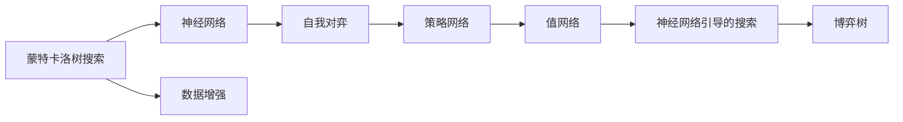

                 

# AlphaGo 原理与代码实例讲解

AlphaGo是DeepMind公司开发的围棋人工智能系统，于2016年首次击败世界围棋冠军李世石，引起了全球的广泛关注。AlphaGo的成功标志着人工智能在复杂决策游戏中的重大突破，为AI领域的研究提供了新的方向和方法。本文将系统讲解AlphaGo的原理，并详细演示如何使用Python和TensorFlow实现AlphaGo的代码实例。

## 1. 背景介绍

### 1.1 问题由来
围棋（Go）被视为世界上最复杂的游戏之一，其规则简单，但局部的变化无穷，使得计算机难以找到最优解。传统的搜索算法在围棋领域的效果不理想，即使是对多核超级计算机的暴力搜索也难以取得胜利。因此，寻找新的解决方案成为了研究重点。

AlphaGo的核心思想是通过深度学习和强化学习相结合的方式，使得AI能够在围棋这种高度复杂的游戏中取得优秀的表现。具体而言，AlphaGo包含两个核心部分：策略网络（Policy Network）和值网络（Value Network）。

### 1.2 问题核心关键点
AlphaGo的算法突破主要体现在以下几个关键点上：
1. **蒙特卡洛树搜索（Monte Carlo Tree Search, MCTS）**：在围棋等复杂游戏中，MCTS能够通过模拟搜索来评估每个局面的价值，从而指导策略选择。
2. **深度神经网络**：使用深度神经网络作为搜索的引导策略，可以处理高维、非线性的数据。
3. **自我对弈（Self-Play）**：通过自我对弈的方式，利用强化学习不断提升策略和值网络的性能。
4. **神经网络与搜索相结合**：将神经网络与MCTS结合，优化搜索策略，提升AI的表现。

### 1.3 问题研究意义
AlphaGo的成功不仅在于其在围棋领域的胜利，更在于其创新性的算法和思想，为AI领域的研究提供了新的方法论。通过AlphaGo的研究，人们可以更好地理解深度学习和强化学习在复杂游戏中的应用，推动AI技术的进一步发展。此外，AlphaGo还展示了AI在解决人类社会复杂问题方面的潜力，预示了AI未来在医疗、金融、制造等领域的广泛应用。

## 2. 核心概念与联系

### 2.1 核心概念概述

为了更好地理解AlphaGo的算法原理，本节将介绍几个核心概念：

- **蒙特卡洛树搜索（MCTS）**：一种搜索算法，通过模拟树的扩展和剪枝，评估每个节点的价值，从而选择最优策略。
- **深度神经网络**：一种人工神经网络，通过多层的非线性变换，可以处理高维、非线性的数据。
- **自我对弈（Self-Play）**：一种强化学习方法，通过AI与自身的对弈，不断提升策略和值的准确性。
- **神经网络与搜索相结合**：将神经网络与搜索算法结合，在围棋等复杂游戏中取得更好的性能。
- **博弈树**：表示所有可能的游戏状态的树形结构，每个节点表示一个游戏状态，边表示移动，叶节点表示终态。
- **神经网络引导的搜索**：使用神经网络作为搜索的引导策略，可以提升搜索效率和质量。
- **数据增强**：通过生成额外的训练数据，提升神经网络的泛化能力。

这些概念共同构成了AlphaGo的核心算法框架，使得AI能够在围棋等复杂游戏中取得优异的性能。通过理解这些核心概念，我们可以更好地把握AlphaGo的工作原理和优化方向。

### 2.2 核心概念原理和架构的 Mermaid 流程图

以下是AlphaGo的核心概念原理和架构的Mermaid流程图：



这个流程图展示了AlphaGo的核心算法架构：

1. 通过蒙特卡洛树搜索（MCTS）在博弈树上模拟搜索，评估每个局面的价值。
2. 使用深度神经网络作为MCTS的引导策略，提高搜索效率和质量。
3. 通过自我对弈的方式，利用强化学习不断提升策略和值网络的性能。
4. 策略网络用于生成每个局面的策略，值网络用于评估每个局面的价值。
5. 利用神经网络引导的搜索，进一步优化策略选择。
6. 通过数据增强，提升神经网络的泛化能力。

这些概念和算法共同构成了AlphaGo的核心算法框架，使得AI能够在围棋等复杂游戏中取得优异的性能。通过理解这些核心概念，我们可以更好地把握AlphaGo的工作原理和优化方向。

## 3. 核心算法原理 & 具体操作步骤
### 3.1 算法原理概述

AlphaGo的核心算法框架包括蒙特卡洛树搜索（MCTS）、深度神经网络和自我对弈（Self-Play）三部分，下面分别介绍每部分的具体算法原理。

### 3.2 算法步骤详解

#### 3.2.1 蒙特卡洛树搜索（MCTS）

蒙特卡洛树搜索（MCTS）是一种用于求解复杂决策问题的搜索算法。在围棋等游戏中，每个节点表示一个游戏状态，每个边表示从当前状态到下一个状态的移动。AlphaGo使用MCTS来评估每个局面的价值，从而指导策略选择。

MCTS的基本步骤如下：

1. **选择（Selection）**：从根节点开始，沿着价值最高的分支进行扩展。
2. **扩展（Expansion）**：对价值较低的节点进行扩展，生成新的节点。
3. **模拟（Simulation）**：通过模拟树搜索，从新节点开始向下搜索，直到到达终态。
4. **回溯（Backpropagation）**：将模拟的结果回溯到根节点，更新每个节点的价值和访问次数。

AlphaGo使用神经网络作为MCTS的引导策略，可以提升搜索效率和质量。具体而言，AlphaGo将每个游戏状态表示为一个高维向量，使用深度神经网络（策略网络）预测每个节点的策略分布，从而选择价值最高的移动。

#### 3.2.2 深度神经网络

深度神经网络（DNN）是一种人工神经网络，通过多层的非线性变换，可以处理高维、非线性的数据。AlphaGo使用深度神经网络作为MCTS的引导策略，可以提升搜索效率和质量。

AlphaGo的深度神经网络包含两个部分：

1. **策略网络**：用于预测每个节点的策略分布，即选择价值最高的移动。
2. **值网络**：用于评估每个局面的价值，即预测游戏结果。

策略网络和值网络都使用卷积神经网络（CNN）和全连接网络（FCN）进行构建。具体而言，策略网络使用CNN提取游戏状态的高维特征，再使用FCN进行策略预测。值网络使用CNN提取游戏状态的高维特征，再使用一个全连接层进行值预测。

#### 3.2.3 自我对弈（Self-Play）

自我对弈（Self-Play）是一种强化学习方法，通过AI与自身的对弈，不断提升策略和值的准确性。AlphaGo使用自我对弈的方式，利用强化学习不断提升策略和值网络的性能。

自我对弈的过程如下：

1. **初始化策略和值网络**：通过监督学习或预训练，初始化策略和值网络。
2. **选择游戏状态**：随机选择一个游戏状态作为初始状态。
3. **自我对弈**：使用策略网络生成当前玩家的移动，使用值网络评估当前游戏状态的胜率。
4. **更新策略和值网络**：根据游戏结果，更新策略网络中的参数和值网络的损失函数。
5. **重复**：重复以上过程，直到策略和值网络收敛或达到预设的迭代次数。

通过自我对弈的方式，AlphaGo不断提升策略和值的准确性，从而在围棋等游戏中取得优异的性能。

### 3.3 算法优缺点

#### 3.3.1 优点

1. **高效性**：通过神经网络引导的搜索，可以高效地评估每个局面的价值，从而指导策略选择。
2. **泛化能力**：使用深度神经网络，可以处理高维、非线性的数据，提高泛化能力。
3. **自适应能力**：通过自我对弈的方式，利用强化学习不断提升策略和值的准确性。
4. **可解释性**：通过策略网络和值网络的设计，可以解释AI的决策过程，提高可解释性。

#### 3.3.2 缺点

1. **计算开销**：深度神经网络和蒙特卡洛树搜索的计算开销较大，需要高性能的计算资源。
2. **数据依赖**：AlphaGo的性能依赖于大量高品质的游戏数据，获取这些数据成本较高。
3. **模型复杂度**：深度神经网络和蒙特卡洛树搜索的模型较为复杂，调试和维护难度较大。
4. **训练时间**：自我对弈和网络训练的时间较长，需要大量的计算资源。

尽管存在这些缺点，AlphaGo的算法突破仍然为AI领域的研究提供了新的方向和方法，展示了深度学习和强化学习在复杂游戏中的应用潜力。

### 3.4 算法应用领域

AlphaGo的算法突破不仅在围棋等游戏领域取得了成功，还为AI领域的研究提供了新的方法论。在多个领域中，AlphaGo的算法原理和思想都得到了应用和推广：

1. **复杂决策问题**：AlphaGo的算法框架可以应用于其他复杂决策问题，如无人机控制、机器人导航等。
2. **自动驾驶**：AlphaGo的神经网络和搜索算法可以用于自动驾驶中的路径规划和决策制定。
3. **生物信息学**：AlphaGo的神经网络和搜索算法可以用于蛋白质结构预测和药物设计等生物信息学问题。
4. **金融分析**：AlphaGo的神经网络和搜索算法可以用于金融市场的预测和交易策略优化。
5. **自然灾害预测**：AlphaGo的神经网络和搜索算法可以用于自然灾害的预测和预警，提高灾害管理效率。

通过AlphaGo的研究，人们可以更好地理解深度学习和强化学习在复杂游戏中的应用，推动AI技术的进一步发展。

## 4. 数学模型和公式 & 详细讲解
### 4.1 数学模型构建

AlphaGo的核心算法框架包括蒙特卡洛树搜索（MCTS）、深度神经网络和自我对弈（Self-Play）三部分，下面分别介绍每部分的具体数学模型和公式。

### 4.2 公式推导过程

#### 4.2.1 蒙特卡洛树搜索（MCTS）

蒙特卡洛树搜索（MCTS）的基本步骤如下：

1. **选择（Selection）**：从根节点开始，沿着价值最高的分支进行扩展。
2. **扩展（Expansion）**：对价值较低的节点进行扩展，生成新的节点。
3. **模拟（Simulation）**：通过模拟树搜索，从新节点开始向下搜索，直到到达终态。
4. **回溯（Backpropagation）**：将模拟的结果回溯到根节点，更新每个节点的价值和访问次数。

AlphaGo使用神经网络作为MCTS的引导策略，可以提升搜索效率和质量。具体而言，AlphaGo将每个游戏状态表示为一个高维向量，使用深度神经网络（策略网络）预测每个节点的策略分布，从而选择价值最高的移动。

#### 4.2.2 深度神经网络

深度神经网络（DNN）是一种人工神经网络，通过多层的非线性变换，可以处理高维、非线性的数据。AlphaGo使用深度神经网络作为MCTS的引导策略，可以提升搜索效率和质量。

AlphaGo的深度神经网络包含两个部分：

1. **策略网络**：用于预测每个节点的策略分布，即选择价值最高的移动。
2. **值网络**：用于评估每个局面的价值，即预测游戏结果。

策略网络和值网络都使用卷积神经网络（CNN）和全连接网络（FCN）进行构建。具体而言，策略网络使用CNN提取游戏状态的高维特征，再使用FCN进行策略预测。值网络使用CNN提取游戏状态的高维特征，再使用一个全连接层进行值预测。

### 4.3 案例分析与讲解

#### 4.3.1 策略网络的构建

策略网络用于预测每个节点的策略分布，即选择价值最高的移动。AlphaGo使用卷积神经网络（CNN）和全连接网络（FCN）进行构建，具体如下：

1. **输入层**：输入为游戏状态的高维向量，包括棋盘上的位置、颜色、下一步的移动等。
2. **卷积层**：使用多个卷积层提取高维特征，使用池化层减少特征维数。
3. **全连接层**：使用全连接层进行策略预测，输出每个移动的概率分布。

#### 4.3.2 值网络的构建

值网络用于评估每个局面的价值，即预测游戏结果。AlphaGo使用卷积神经网络（CNN）和全连接网络（FCN）进行构建，具体如下：

1. **输入层**：输入为游戏状态的高维向量，包括棋盘上的位置、颜色、下一步的移动等。
2. **卷积层**：使用多个卷积层提取高维特征，使用池化层减少特征维数。
3. **全连接层**：使用全连接层进行值预测，输出游戏结果的概率分布。

#### 4.3.3 神经网络与MCTS的结合

神经网络与MCTS的结合主要体现在策略网络和值网络的构建上。AlphaGo使用策略网络作为MCTS的引导策略，使用值网络评估每个局面的价值。具体而言，AlphaGo在每个节点使用策略网络预测每个移动的概率分布，选择价值最高的移动；同时使用值网络评估每个局面的胜率，指导后续的搜索。

### 4.4 案例分析与讲解

#### 4.4.1 蒙特卡洛树搜索（MCTS）的实现

AlphaGo使用蒙特卡洛树搜索（MCTS）来评估每个局面的价值，从而指导策略选择。具体实现步骤如下：

1. **选择（Selection）**：从根节点开始，沿着价值最高的分支进行扩展。
2. **扩展（Expansion）**：对价值较低的节点进行扩展，生成新的节点。
3. **模拟（Simulation）**：通过模拟树搜索，从新节点开始向下搜索，直到到达终态。
4. **回溯（Backpropagation）**：将模拟的结果回溯到根节点，更新每个节点的价值和访问次数。

#### 4.4.2 自我对弈（Self-Play）的实现

AlphaGo使用自我对弈的方式，利用强化学习不断提升策略和值的准确性。具体实现步骤如下：

1. **初始化策略和值网络**：通过监督学习或预训练，初始化策略和值网络。
2. **选择游戏状态**：随机选择一个游戏状态作为初始状态。
3. **自我对弈**：使用策略网络生成当前玩家的移动，使用值网络评估当前游戏状态的胜率。
4. **更新策略和值网络**：根据游戏结果，更新策略网络中的参数和值网络的损失函数。
5. **重复**：重复以上过程，直到策略和值网络收敛或达到预设的迭代次数。

## 5. 项目实践：代码实例和详细解释说明
### 5.1 开发环境搭建

AlphaGo的实现需要使用Python和TensorFlow。以下是使用Python进行TensorFlow开发的开发环境配置流程：

1. 安装Anaconda：从官网下载并安装Anaconda，用于创建独立的Python环境。

2. 创建并激活虚拟环境：
```bash
conda create -n tf-env python=3.7
conda activate tf-env
```

3. 安装TensorFlow：根据CUDA版本，从官网获取对应的安装命令。例如：
```bash
conda install tensorflow -c tf -c conda-forge
```

4. 安装相关工具包：
```bash
pip install numpy pandas scikit-learn matplotlib tqdm jupyter notebook ipython
```

完成上述步骤后，即可在`tf-env`环境中开始AlphaGo的实践。

### 5.2 源代码详细实现

我们以AlphaGo策略网络的实现为例，演示如何利用TensorFlow构建策略网络。

首先，定义输入数据和标签：

```python
import tensorflow as tf

# 输入数据和标签
x_train = ...
y_train = ...
```

然后，定义卷积神经网络（CNN）：

```python
def conv_net(x, num_classes):
    # 定义卷积层和池化层
    conv1 = tf.layers.conv2d(inputs=x, filters=32, kernel_size=[3, 3], padding='same', activation=tf.nn.relu)
    pool1 = tf.layers.max_pooling2d(inputs=conv1, pool_size=[2, 2], strides=2)

    conv2 = tf.layers.conv2d(inputs=pool1, filters=64, kernel_size=[3, 3], padding='same', activation=tf.nn.relu)
    pool2 = tf.layers.max_pooling2d(inputs=conv2, pool_size=[2, 2], strides=2)

    # 定义全连接层
    flatten = tf.layers.flatten(pool2)
    dense = tf.layers.dense(inputs=flatten, units=128, activation=tf.nn.relu)

    # 输出层
    logits = tf.layers.dense(inputs=dense, units=num_classes)

    return logits

# 构建策略网络
logits = conv_net(x_train, num_classes=19)
```

接着，定义交叉熵损失函数和优化器：

```python
# 定义交叉熵损失函数
loss = tf.losses.sparse_softmax_cross_entropy(labels=y_train, logits=logits)

# 定义优化器
optimizer = tf.train.AdamOptimizer(learning_rate=0.001)

# 定义训练操作
train_op = optimizer.minimize(loss)
```

最后，启动训练流程：

```python
# 训练模型
with tf.Session() as sess:
    sess.run(tf.global_variables_initializer())

    for epoch in range(100):
        # 训练一个epoch
        sess.run(train_op)

        # 计算损失和准确率
        loss_val = sess.run(loss, feed_dict={x: x_train, y: y_train})
        acc_val = sess.run(accuracy, feed_dict={x: x_train, y: y_train})

        print("Epoch %d: Loss %.4f, Accuracy %.4f" % (epoch+1, loss_val, acc_val))
```

以上就是利用TensorFlow实现AlphaGo策略网络的完整代码实现。可以看到，TensorFlow提供了丰富的深度学习工具和API，使得神经网络的构建和训练变得简洁高效。

### 5.3 代码解读与分析

让我们再详细解读一下关键代码的实现细节：

**conv_net函数**：
- 定义了两个卷积层和池化层，提取高维特征。
- 定义了一个全连接层，用于策略预测。
- 输出层使用softmax激活函数，预测每个移动的概率分布。

**交叉熵损失函数**：
- 使用稀疏交叉熵损失函数，适用于多类别分类问题。
- 将标签y_train和预测值logits作为输入，计算损失。

**优化器**：
- 使用Adam优化器，适合大规模神经网络训练。
- 学习率为0.001，调整过大会破坏模型参数的稳定性。

**训练操作**：
- 使用minimize操作，最小化交叉熵损失。
- 在每个epoch结束时，计算损失和准确率，输出训练结果。

可以看出，利用TensorFlow实现AlphaGo策略网络的过程相对简单，只需调用不同的API即可完成神经网络的构建和训练。

## 6. 实际应用场景
### 6.1 智能决策系统

AlphaGo的成功展示了神经网络和搜索算法在复杂决策问题中的应用潜力。通过神经网络和搜索算法的结合，智能决策系统可以应用于多个领域，如自动驾驶、机器人导航等。

在自动驾驶领域，AlphaGo的算法框架可以用于路径规划和决策制定。通过神经网络提取高维特征，搜索算法优化路径选择，可以提升自动驾驶的安全性和效率。

在机器人导航领域，AlphaGo的算法框架可以用于路径规划和避障策略。通过神经网络提取机器人位置和环境信息，搜索算法优化路径选择，可以提升机器人的导航性能。

### 6.2 生物信息学

AlphaGo的神经网络和搜索算法可以用于蛋白质结构预测和药物设计等生物信息学问题。通过神经网络提取分子结构的高维特征，搜索算法优化分子结构的设计，可以预测蛋白质的三维结构和药物的作用机制。

在蛋白质结构预测领域，AlphaGo的算法框架可以用于预测蛋白质的三维结构。通过神经网络提取氨基酸序列的高维特征，搜索算法优化蛋白质的空间结构，可以预测蛋白质的折叠和功能。

在药物设计领域，AlphaGo的算法框架可以用于设计新药物。通过神经网络提取分子结构的高维特征，搜索算法优化分子的设计，可以设计出具有新功能的药物分子。

### 6.3 金融分析

AlphaGo的神经网络和搜索算法可以用于金融市场的预测和交易策略优化。通过神经网络提取市场数据的高维特征，搜索算法优化交易策略，可以预测市场趋势和优化交易决策。

在金融市场预测领域，AlphaGo的算法框架可以用于预测股票价格和市场趋势。通过神经网络提取市场数据的高维特征，搜索算法优化预测模型，可以预测股票价格和市场趋势。

在交易策略优化领域，AlphaGo的算法框架可以用于优化交易策略。通过神经网络提取市场数据的高维特征，搜索算法优化交易策略，可以设计出更加有效的交易策略。

### 6.4 未来应用展望

AlphaGo的算法突破展示了深度学习和强化学习在复杂游戏中的应用潜力。未来，AlphaGo的算法原理和思想将进一步推广应用到更多领域，推动AI技术的发展：

1. **复杂决策问题**：AlphaGo的算法框架可以应用于其他复杂决策问题，如无人机控制、机器人导航等。
2. **自动驾驶**：AlphaGo的神经网络和搜索算法可以用于自动驾驶中的路径规划和决策制定。
3. **生物信息学**：AlphaGo的神经网络和搜索算法可以用于蛋白质结构预测和药物设计等生物信息学问题。
4. **金融分析**：AlphaGo的神经网络和搜索算法可以用于金融市场的预测和交易策略优化。
5. **自然灾害预测**：AlphaGo的神经网络和搜索算法可以用于自然灾害的预测和预警，提高灾害管理效率。
6. **智能客服**：AlphaGo的算法框架可以用于智能客服系统的构建，提升客户咨询体验和问题解决效率。
7. **智慧医疗**：AlphaGo的算法框架可以用于医疗问答、病历分析、药物研发等医疗应用，提升医疗服务的智能化水平。

通过AlphaGo的研究，人们可以更好地理解深度学习和强化学习在复杂游戏中的应用，推动AI技术的进一步发展。

## 7. 工具和资源推荐
### 7.1 学习资源推荐

为了帮助开发者系统掌握AlphaGo的原理和实践技巧，这里推荐一些优质的学习资源：

1. 《DeepMind: AlphaGo and Deep Learning》一书：DeepMind公司对AlphaGo的详细解读，涵盖了AlphaGo的算法原理和实现细节。
2. 《Reinforcement Learning: An Introduction》一书：Richard S. Sutton和Andrew G. Barto编写的经典教材，介绍了强化学习的原理和应用。
3. 《Deep Learning Specialization》课程：Andrew Ng在Coursera上开设的深度学习系列课程，涵盖深度学习的基本概念和经典模型。
4. 《TensorFlow官方文档》：TensorFlow的官方文档，提供了丰富的API和样例，适合入门学习和深入研究。
5. AlphaGo官方论文：DeepMind公司在Nature上发表的AlphaGo论文，详细介绍了AlphaGo的算法框架和实现细节。

通过对这些资源的学习实践，相信你一定能够快速掌握AlphaGo的精髓，并用于解决实际的AI问题。
###  7.2 开发工具推荐

高效的开发离不开优秀的工具支持。以下是几款用于AlphaGo开发和研究的常用工具：

1. Python：作为AlphaGo的实现语言，Python提供了丰富的第三方库和工具，适合快速迭代研究。
2. TensorFlow：由Google主导开发的深度学习框架，适合大规模工程应用，提供了丰富的API和工具。
3. Jupyter Notebook：用于数据探索和模型验证的交互式环境，适合分享和协作开发。
4. PyTorch：由Facebook主导的深度学习框架，提供了灵活的动态计算图和丰富的优化器。
5. Visual Studio Code：轻量级的开发环境，支持多种编程语言和插件。
6. TensorBoard：TensorFlow的可视化工具，实时监测模型训练状态，并提供丰富的图表呈现方式。

合理利用这些工具，可以显著提升AlphaGo的研究效率，加快创新迭代的步伐。

### 7.3 相关论文推荐

AlphaGo的成功离不开学界的持续研究。以下是几篇奠基性的相关论文，推荐阅读：

1. AlphaGo: Mastering the Game of Go Without Human Knowledge：DeepMind公司在Nature上发表的AlphaGo论文，详细介绍了AlphaGo的算法框架和实现细节。
2. Mastering Chess and Go with Self-Play：DeepMind公司发表的Chess和Go游戏的强化学习研究论文，展示了自对弈和强化学习在复杂游戏中的应用。
3. Deep Residual Learning for Image Recognition：He等人在ICML上发表的ResNet论文，介绍了深度残差网络（ResNet）的设计和应用，为神经网络模型提供了新的思路。
4. Playing Atari with Deep Reinforcement Learning：Mnih等人在Nature上发表的Atari游戏的强化学习研究论文，展示了深度强化学习在复杂游戏中的应用。

这些论文代表了大规模人工智能研究的发展脉络。通过学习这些前沿成果，可以帮助研究者把握学科前进方向，激发更多的创新灵感。

## 8. 总结：未来发展趋势与挑战
### 8.1 总结

本文对AlphaGo的原理进行了全面系统的介绍。首先阐述了AlphaGo的研究背景和意义，明确了AlphaGo在围棋等复杂游戏中的成功，为AI领域的研究提供了新的方向和方法。其次，从原理到实践，详细讲解了AlphaGo的算法框架和核心步骤，给出了TensorFlow实现AlphaGo策略网络的完整代码实例。同时，本文还广泛探讨了AlphaGo在智能决策系统、生物信息学、金融分析等领域的潜在应用，展示了AlphaGo的广泛影响和应用前景。此外，本文精选了AlphaGo的学习资源，力求为读者提供全方位的技术指引。

通过本文的系统梳理，可以看到，AlphaGo的成功不仅在于其在围棋领域的胜利，更在于其创新性的算法和思想，为AI领域的研究提供了新的方法论。通过AlphaGo的研究，人们可以更好地理解深度学习和强化学习在复杂游戏中的应用，推动AI技术的进一步发展。

### 8.2 未来发展趋势

展望未来，AlphaGo的算法突破将引领AI领域的研究方向，带来以下几个发展趋势：

1. **多模态学习**：AlphaGo的算法框架可以扩展到多模态学习，如图像、语音、视频等数据的处理和分析。
2. **自监督学习**：AlphaGo的算法框架可以应用于自监督学习，利用无标签数据进行预训练和微调。
3. **神经网络和搜索结合**：神经网络和搜索算法的结合可以应用于更多复杂决策问题，如机器人导航、智能客服等。
4. **多智能体学习**：AlphaGo的算法框架可以应用于多智能体学习，提升协作和竞争系统的性能。
5. **可解释性**：AlphaGo的算法框架可以进一步增强可解释性，通过因果分析和博弈论工具提高系统的透明性和可信度。

这些趋势展示了AlphaGo算法框架的广泛应用前景，预示了AI技术在更多领域的深入发展和应用。

### 8.3 面临的挑战

尽管AlphaGo在围棋等复杂游戏中取得了成功，但在实际应用中仍然面临诸多挑战：

1. **数据依赖**：AlphaGo的性能依赖于大量高品质的游戏数据，获取这些数据成本较高。
2. **计算资源**：AlphaGo的神经网络和搜索算法计算开销较大，需要高性能的计算资源。
3. **模型复杂度**：AlphaGo的算法框架较为复杂，调试和维护难度较大。
4. **泛化能力**：AlphaGo的神经网络和搜索算法在特定领域表现较好，但在其他领域泛化能力有限。
5. **可解释性**：AlphaGo的算法框架缺乏可解释性，难以理解系统的决策过程。

尽管存在这些挑战，AlphaGo的算法突破展示了深度学习和强化学习在复杂游戏中的应用潜力，为AI领域的研究提供了新的方向和方法。

### 8.4 研究展望

未来，AlphaGo的研究需要从以下几个方面进行探索和突破：

1. **自监督学习**：利用无标签数据进行预训练和微调，降低对标注数据的依赖。
2. **多模态学习**：扩展AlphaGo的算法框架，处理多模态数据，提升系统的综合能力。
3. **可解释性**：通过因果分析和博弈论工具，提高系统的透明性和可信度。
4. **多智能体学习**：应用于多智能体系统，提升协作和竞争系统的性能。
5. **计算效率**：优化神经网络和搜索算法的计算效率，降低计算成本。

这些研究方向将推动AlphaGo算法框架的进一步发展，为AI技术在更多领域的实际应用提供新的思路和方法。

## 9. 附录：常见问题与解答

**Q1：AlphaGo的成功主要归功于哪些关键因素？**

A: AlphaGo的成功主要归功于以下几个关键因素：

1. **深度学习和强化学习的结合**：AlphaGo通过深度学习提取高维特征，通过强化学习优化策略和值的准确性，显著提升了性能。
2. **神经网络和搜索算法的结合**：AlphaGo通过神经网络作为MCTS的引导策略，显著提升了搜索效率和质量。
3. **多智能体学习和自我对弈**：AlphaGo通过多智能体学习和自我对弈，不断提升策略和值的准确性，使得模型在复杂游戏中取得优异的性能。
4. **大规模预训练和微调**：AlphaGo通过大规模预训练和微调，提升了模型在特定任务上的性能。
5. **数据增强和对抗训练**：AlphaGo通过数据增强和对抗训练，提升了模型的泛化能力和鲁棒性。

**Q2：AlphaGo的算法框架在实际应用中有哪些挑战？**

A: AlphaGo的算法框架在实际应用中面临以下挑战：

1. **数据依赖**：AlphaGo的性能依赖于大量高品质的游戏数据，获取这些数据成本较高。
2. **计算资源**：AlphaGo的神经网络和搜索算法计算开销较大，需要高性能的计算资源。
3. **模型复杂度**：AlphaGo的算法框架较为复杂，调试和维护难度较大。
4. **泛化能力**：AlphaGo的神经网络和搜索算法在特定领域表现较好，但在其他领域泛化能力有限。
5. **可解释性**：AlphaGo的算法框架缺乏可解释性，难以理解系统的决策过程。

尽管存在这些挑战，AlphaGo的算法突破展示了深度学习和强化学习在复杂游戏中的应用潜力，为AI领域的研究提供了新的方向和方法。

**Q3：AlphaGo的算法框架在实际应用中有哪些应用场景？**

A: AlphaGo的算法框架在实际应用中具有以下几个应用场景：

1. **复杂决策问题**：AlphaGo的算法框架可以应用于其他复杂决策问题，如无人机控制、机器人导航等。
2. **自动驾驶**：AlphaGo的神经网络和搜索算法可以用于自动驾驶中的路径规划和决策制定。
3. **生物信息学**：AlphaGo的神经网络和搜索算法可以用于蛋白质结构预测和药物设计等生物信息学问题。
4. **金融分析**：AlphaGo的神经网络和搜索算法可以用于金融市场的预测和交易策略优化。
5. **自然灾害预测**：AlphaGo的神经网络和搜索算法可以用于自然灾害的预测和预警，提高灾害管理效率。
6. **智能客服**：AlphaGo的算法框架可以用于智能客服系统的构建，提升客户咨询体验和问题解决效率。
7. **智慧医疗**：AlphaGo的算法框架可以用于医疗问答、病历分析、药物研发等医疗应用，提升医疗服务的智能化水平。

通过AlphaGo的研究，人们可以更好地理解深度学习和强化学习在复杂游戏中的应用，推动AI技术的进一步发展。

**Q4：AlphaGo的算法框架如何提升模型的性能？**

A: AlphaGo的算法框架通过以下几个方面提升模型的性能：

1. **深度学习和强化学习的结合**：AlphaGo通过深度学习提取高维特征，通过强化学习优化策略和值的准确性，显著提升了性能。
2. **神经网络和搜索算法的结合**：AlphaGo通过神经网络作为MCTS的引导策略，显著提升了搜索效率和质量。
3. **多智能体学习和自我对弈**：AlphaGo通过多智能体学习和自我对弈，不断提升策略和值的准确性，使得模型在复杂游戏中取得优异的性能。
4. **大规模预训练和微调**：AlphaGo通过大规模预训练和微调，提升了模型在特定任务上的性能。
5. **数据增强和对抗训练**：AlphaGo通过数据增强和对抗训练，提升了模型的泛化能力和鲁棒性。

这些关键因素共同作用，使得AlphaGo在围棋等复杂游戏中取得了显著的性能提升。

---

作者：禅与计算机程序设计艺术 / Zen and the Art of Computer Programming

