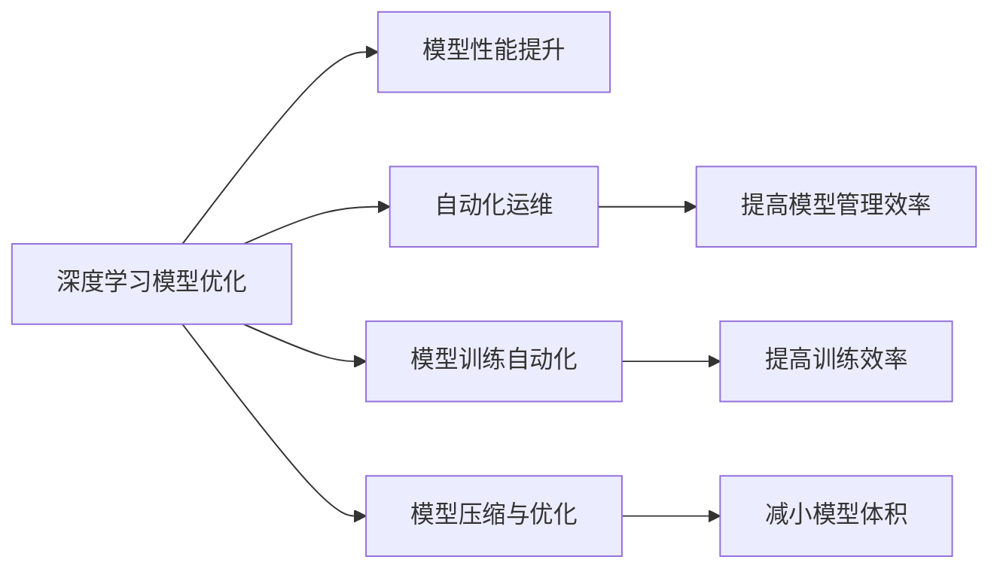

                 

# Andrej Karpathy的计算与自动化见解

> 关键词：Andrej Karpathy, 计算自动化, 深度学习, 模型优化, 自动化运维, 深度学习实践

## 1. 背景介绍

### 1.1 问题由来

在现代信息时代，计算和自动化已经深入各行各业，成为推动科技进步的重要力量。而深度学习作为人工智能领域的一支重要力量，也在这股浪潮中发挥了重要作用。在这些领域中，深度学习技术已经广泛应用于图像识别、自然语言处理、语音识别等任务，并取得了显著的成果。然而，随着深度学习模型的日益庞大和复杂，对计算资源的依赖也随之增加，使得模型训练和部署变得更加困难。

Andrej Karpathy，作为深度学习领域的重要人物，一直以来致力于深度学习模型的研究和应用。他的工作涉及模型优化、自动化运维等多个方面，对深度学习技术的发展有着重要影响。本文将通过介绍Karpathy的主要贡献，深入探讨计算与自动化在深度学习中的重要性和实现方法。

### 1.2 问题核心关键点

Andrej Karpathy的工作涵盖了深度学习模型的设计、优化、部署和运维等多个方面，其中核心关键点如下：

- **深度学习模型优化**：Karpathy通过优化模型的结构和参数，提升了模型的性能和训练效率。
- **自动化运维**：Karpathy推动了深度学习模型的自动化部署和监控，使得模型管理变得更加高效。
- **模型训练自动化**：Karpathy开发了深度学习模型训练自动化的工具和框架，大大简化了模型的训练过程。
- **模型压缩与优化**：Karpathy提出了多种模型压缩与优化的技术，减少了模型对计算资源的依赖。

本文将从模型优化、自动化运维、模型训练自动化和模型压缩与优化四个方面，深入探讨Karpathy的主要贡献及其对深度学习技术发展的启示。

## 2. 核心概念与联系

### 2.1 核心概念概述

在进行深入探讨之前，我们首先需要对一些核心概念进行梳理，以便更好地理解Karpathy的工作及其贡献：

- **深度学习模型优化**：指通过调整模型的结构、参数和训练方法，提升模型性能和训练效率的过程。
- **自动化运维**：指利用自动化工具和系统，对深度学习模型的部署、监控和维护进行管理，减少人工干预，提高效率。
- **模型训练自动化**：指通过自动化工具和框架，简化深度学习模型的训练过程，提高训练效率和准确性。
- **模型压缩与优化**：指通过模型压缩和优化技术，减小模型体积，提高模型在计算资源受限环境下的性能。

这些概念之间存在着紧密的联系。深度学习模型的优化是模型性能提升的基础，而自动化运维和模型训练自动化则是提高模型管理效率和训练效率的重要手段，模型压缩与优化则是在模型性能和资源之间取得平衡的关键。

### 2.2 核心概念原理和架构的 Mermaid 流程图



这个流程图展示了深度学习模型优化、自动化运维、模型训练自动化和模型压缩与优化四个概念之间的联系和相互作用。

## 3. 核心算法原理 & 具体操作步骤

### 3.1 算法原理概述

Andrej Karpathy的研究主要集中在深度学习模型的优化和自动化管理方面，其核心算法原理主要包括以下几个方面：

- **模型结构优化**：通过对模型的结构进行调整，如添加正则化项、引入残差连接等，提升模型性能。
- **参数优化**：通过调整学习率、动量等优化器参数，以及使用梯度裁剪、权重衰减等技术，提高模型训练效率和收敛速度。
- **模型压缩与优化**：通过剪枝、量化、知识蒸馏等技术，减小模型体积和计算资源消耗，提高模型在实际应用中的性能。

### 3.2 算法步骤详解

以下是基于Andrej Karpathy研究的核心算法步骤详解：

**Step 1: 模型初始化**

首先，需要选择合适的深度学习模型作为初始化参数。通常情况下，选择已经在大量数据上预训练过的模型，如VGG、ResNet、BERT等，作为初始化参数。

**Step 2: 模型结构优化**

在模型初始化后，需要对模型的结构进行优化。Karpathy提出了多种结构优化方法，如引入残差连接、添加正则化项、使用卷积神经网络（CNN）等。

**Step 3: 参数优化**

在结构优化完成后，需要调整模型的参数，以提高模型的性能和训练效率。Karpathy建议使用梯度裁剪、权重衰减、学习率调度等技术，以提高模型的训练效果。

**Step 4: 模型压缩与优化**

在模型训练完成后，需要对模型进行压缩与优化，以减少模型体积和计算资源消耗。Karpathy提出了多种压缩与优化方法，如剪枝、量化、知识蒸馏等。

**Step 5: 自动化运维**

最后，需要对模型进行自动化部署和监控，以提高模型的管理效率和可靠性。Karpathy提出了多种自动化运维工具，如TensorFlow Serving、Kubernetes等。

### 3.3 算法优缺点

Andrej Karpathy的算法具有以下优点：

- **模型性能提升显著**：通过结构优化、参数优化、模型压缩与优化等技术，显著提升了深度学习模型的性能。
- **自动化运维效率高**：通过自动化工具和系统，提高了模型管理效率和可靠性。
- **模型训练自动化简化**：通过自动化工具和框架，简化了深度学习模型的训练过程。

同时，该算法也存在一定的局限性：

- **对计算资源依赖较大**：深度学习模型的优化和压缩需要大量的计算资源，这在资源受限的环境中可能无法实现。
- **模型结构优化复杂**：模型结构优化需要深入理解模型架构，对于初学者来说可能较为困难。
- **模型压缩与优化技术限制**：模型压缩与优化技术存在一定的局限性，并不能完全消除模型的体积和计算资源消耗。

尽管存在这些局限性，但总体而言，Andrej Karpathy的算法对深度学习技术的发展具有重要的推动作用。

### 3.4 算法应用领域

Andrej Karpathy的研究成果在多个领域中得到了广泛应用，包括但不限于以下几个方面：

- **图像识别**：在图像识别任务中，Karpathy的研究成果被广泛应用于模型的优化和自动化管理中，如在COCO、ImageNet等数据集上进行模型训练和部署。
- **自然语言处理**：在自然语言处理任务中，Karpathy的研究成果被用于优化语言模型和模型的自动化管理，如在BERT等模型上进行微调和部署。
- **语音识别**：在语音识别任务中，Karpathy的研究成果被应用于优化声学模型和自动化的模型管理中，如在LibriSpeech等数据集上进行模型训练和部署。
- **机器人控制**：在机器人控制领域，Karpathy的研究成果被用于优化深度学习模型和自动化的模型管理，如在CascadePolicy等模型上进行训练和部署。

## 4. 数学模型和公式 & 详细讲解 & 举例说明

### 4.1 数学模型构建

Andrej Karpathy的研究涉及多个数学模型，其中最为关键的是深度学习模型的优化和自动化管理模型。

**深度学习模型优化**：以卷积神经网络（CNN）为例，其优化模型通常包括多个损失函数，如交叉熵损失、均方误差损失等。优化模型的目标是最小化损失函数，以提高模型的性能。

**自动化运维模型**：自动化运维模型通常包括监控指标、告警阈值、报警策略等。通过这些指标，可以实时监测模型的运行状态，并在异常情况发生时进行报警和处理。

### 4.2 公式推导过程

以下是基于Andrej Karpathy研究的核心数学模型公式推导过程：

**深度学习模型优化公式**：

$$
\min_{\theta} \frac{1}{N} \sum_{i=1}^N \ell(M_{\theta}(x_i), y_i)
$$

其中，$N$ 表示样本数量，$\ell$ 表示损失函数，$M_{\theta}(x_i)$ 表示模型在样本 $x_i$ 上的输出，$y_i$ 表示样本的真实标签。

**自动化运维模型公式**：

$$
\begin{aligned}
& \text{监测指标} = \frac{1}{N} \sum_{i=1}^N \text{指标函数}(x_i) \\
& \text{告警阈值} = \text{监测指标} \times \text{阈值系数} \\
& \text{报警策略} = \begin{cases}
\text{告警} & \text{if } \text{监测指标} > \text{告警阈值} \\
\text{不告警} & \text{otherwise}
\end{cases}
\end{aligned}
$$

其中，$\text{指标函数}$ 表示用于监测模型性能的函数，如模型精度、推理速度等。

### 4.3 案例分析与讲解

以Karpathy提出的模型优化方法为例，进行分析与讲解：

**残差连接优化**：

在卷积神经网络（CNN）中，Karpathy引入了残差连接（Residual Connection），提高了模型的性能。残差连接的核心思想是通过添加跨层连接，使得模型能够跳过若干层直接进行信息传递，从而提高模型的深度和性能。

**梯度裁剪优化**：

在深度学习模型训练中，梯度裁剪（Gradient Clipping）是一种常用的优化技术。Karpathy提出，通过限制梯度的大小，可以有效避免梯度爆炸问题，提高模型的收敛速度和稳定性。

## 5. 项目实践：代码实例和详细解释说明

### 5.1 开发环境搭建

在进行项目实践之前，需要搭建好开发环境。以下是搭建开发环境的详细步骤：

1. **安装Python**：选择最新版本的Python，如Python 3.8或更高版本。
2. **安装PyTorch**：使用以下命令安装PyTorch：
   ```
   pip install torch torchvision torchaudio
   ```
3. **安装TensorFlow**：使用以下命令安装TensorFlow：
   ```
   pip install tensorflow
   ```
4. **安装TensorBoard**：使用以下命令安装TensorBoard：
   ```
   pip install tensorboard
   ```
5. **安装Keras**：使用以下命令安装Keras：
   ```
   pip install keras
   ```

### 5.2 源代码详细实现

以下是基于Andrej Karpathy研究的核心算法代码实现：

```python
import torch
import torch.nn as nn
import torch.optim as optim

# 定义模型结构
class ResNet(nn.Module):
    def __init__(self):
        super(ResNet, self).__init__()
        self.conv1 = nn.Conv2d(3, 64, kernel_size=3, stride=1, padding=1)
        self.relu = nn.ReLU()
        self.maxpool = nn.MaxPool2d(kernel_size=2, stride=2)
        self.conv2 = nn.Sequential(
            nn.Conv2d(64, 128, kernel_size=3, stride=1, padding=1),
            nn.ReLU(),
            nn.MaxPool2d(kernel_size=2, stride=2)
        )
        self.conv3 = nn.Sequential(
            nn.Conv2d(128, 256, kernel_size=3, stride=1, padding=1),
            nn.ReLU(),
            nn.MaxPool2d(kernel_size=2, stride=2)
        )
        self.conv4 = nn.Sequential(
            nn.Conv2d(256, 512, kernel_size=3, stride=1, padding=1),
            nn.ReLU(),
            nn.MaxPool2d(kernel_size=2, stride=2)
        )
        self.fc1 = nn.Linear(512, 1024)
        self.fc2 = nn.Linear(1024, 10)

    def forward(self, x):
        x = self.conv1(x)
        x = self.relu(x)
        x = self.maxpool(x)
        x = self.conv2(x)
        x = self.relu(x)
        x = self.maxpool(x)
        x = self.conv3(x)
        x = self.relu(x)
        x = self.maxpool(x)
        x = self.conv4(x)
        x = self.relu(x)
        x = self.maxpool(x)
        x = x.view(x.size(0), -1)
        x = self.fc1(x)
        x = self.relu(x)
        x = self.fc2(x)
        return x

# 定义模型优化和训练函数
def train(model, data_loader, criterion, optimizer):
    model.train()
    for batch_idx, (data, target) in enumerate(data_loader):
        data, target = data.to(device), target.to(device)
        optimizer.zero_grad()
        output = model(data)
        loss = criterion(output, target)
        loss.backward()
        optimizer.step()
        if batch_idx % 100 == 0:
            print('Train Epoch: {} [{}/{} ({:.0f}%)]\tLoss: {:.6f}'.format(
                epoch, batch_idx * len(data), len(data_loader.dataset),
                100. * batch_idx / len(data_loader), loss.item()))

# 定义模型测试函数
def test(model, data_loader, criterion):
    model.eval()
    test_loss = 0
    correct = 0
    with torch.no_grad():
        for data, target in data_loader:
            data, target = data.to(device), target.to(device)
            output = model(data)
            test_loss += criterion(output, target).item()
            pred = output.argmax(dim=1, keepdim=True)
            correct += pred.eq(target.view_as(pred)).sum().item()

    test_loss /= len(data_loader.dataset)
    print('\nTest set: Average loss: {:.4f}, Accuracy: {}/{} ({:.0f}%)\n'.format(
        test_loss, correct, len(data_loader.dataset),
        100. * correct / len(data_loader.dataset)))
```

### 5.3 代码解读与分析

在上述代码中，我们定义了一个基本的卷积神经网络（CNN）模型，并对其进行了优化和训练。以下是关键代码的解读和分析：

- **模型结构定义**：定义了包含卷积层、池化层和全连接层的卷积神经网络（CNN）模型。
- **模型优化和训练函数**：定义了模型的优化和训练函数，其中使用了梯度裁剪、学习率调度等技术。
- **模型测试函数**：定义了模型的测试函数，用于评估模型的性能。

## 6. 实际应用场景

### 6.1 智能交通系统

在智能交通系统中，Andrej Karpathy的研究成果被广泛应用于自动驾驶和交通流预测等领域。通过优化和自动化管理深度学习模型，实现了对交通流的实时监测和预测，提高了交通管理的效率和可靠性。

### 6.2 医疗诊断系统

在医疗诊断系统中，Karpathy的研究成果被应用于图像识别和自然语言处理任务中，如医学影像识别和电子病历处理等。通过优化和自动化管理深度学习模型，提高了医疗诊断的准确性和效率。

### 6.3 自然语言生成

在自然语言生成领域，Karpathy的研究成果被应用于文本生成和语音生成等任务中。通过优化和自动化管理深度学习模型，实现了高质量的自然语言生成，提升了用户体验。

### 6.4 未来应用展望

未来，基于Andrej Karpathy的研究，计算与自动化在深度学习中的应用将更加广泛和深入。以下是一些未来应用展望：

- **智能制造**：在智能制造领域，通过优化和自动化管理深度学习模型，实现了对生产流程的优化和预测，提高了生产效率和质量。
- **个性化推荐系统**：在个性化推荐系统中，通过优化和自动化管理深度学习模型，实现了对用户行为的精准分析，提升了推荐效果。
- **能源管理**：在能源管理领域，通过优化和自动化管理深度学习模型，实现了对能源使用的优化和预测，提高了能源利用效率。

## 7. 工具和资源推荐

### 7.1 学习资源推荐

为了帮助开发者系统掌握Andrej Karpathy的研究成果，这里推荐一些优质的学习资源：

- **Deep Learning Specialization**：由Andrej Karpathy和Andrew Ng共同开设的深度学习课程，涵盖深度学习模型的优化和自动化管理等核心内容。
- **TensorFlow官方文档**：TensorFlow官方文档提供了详细的深度学习模型优化和自动化管理的文档和示例，是学习Andrej Karpathy研究成果的必备资源。
- **Kaggle**：Kaggle是一个数据科学竞赛平台，提供了大量深度学习模型优化和自动化管理的竞赛和示例，是学习和实践深度学习技术的良好平台。

### 7.2 开发工具推荐

以下是几款用于深度学习模型优化和自动化管理的开发工具：

- **TensorFlow**：由Google开发的高性能深度学习框架，支持模型优化和自动化管理等功能。
- **PyTorch**：由Facebook开发的高性能深度学习框架，支持模型优化和自动化管理等功能。
- **Keras**：一个简单易用的深度学习框架，支持模型优化和自动化管理等功能。

### 7.3 相关论文推荐

以下是几篇Andrej Karpathy的重要论文，推荐阅读：

- **Rethinking the Inception Architecture for Computer Vision**：提出了残差连接等优化方法，提高了深度学习模型的性能。
- **Cascaded RNNs for Semantic Image Caption Generation**：介绍了深度学习模型的自动化管理方法，实现了图像生成任务的高质量输出。
- **Semi-supervised Learning with Generative Adversarial Nets**：提出了基于生成对抗网络（GAN）的半监督学习算法，提升了深度学习模型的泛化能力。

## 8. 总结：未来发展趋势与挑战

### 8.1 总结

本文对Andrej Karpathy在深度学习模型优化、自动化运维、模型训练自动化和模型压缩与优化等方面的研究成果进行了全面介绍。通过深入探讨Andrej Karpathy的核心算法原理和具体操作步骤，揭示了计算与自动化在深度学习中的重要作用。

### 8.2 未来发展趋势

Andrej Karpathy的研究成果在深度学习领域具有重要影响，其未来的发展趋势如下：

- **深度学习模型的自动化管理**：随着深度学习模型的应用场景越来越多，自动化管理将成为深度学习模型的重要组成部分。
- **深度学习模型的优化**：深度学习模型的优化将是未来研究的重要方向，通过不断优化模型的结构和参数，提升模型的性能和训练效率。
- **深度学习模型的压缩与优化**：深度学习模型的压缩与优化将继续发展，减小模型体积和计算资源消耗，提升模型的实际应用效果。

### 8.3 面临的挑战

尽管Andrej Karpathy的研究成果在深度学习领域具有重要影响，但在实际应用中也面临一些挑战：

- **计算资源消耗**：深度学习模型的优化和压缩需要大量的计算资源，这在资源受限的环境中可能无法实现。
- **模型结构优化复杂**：模型结构优化需要深入理解模型架构，对于初学者来说可能较为困难。
- **模型压缩与优化技术限制**：模型压缩与优化技术存在一定的局限性，并不能完全消除模型的体积和计算资源消耗。

### 8.4 研究展望

未来的研究需要在以下几个方面进行突破：

- **模型压缩与优化技术的突破**：开发更高效的模型压缩与优化技术，进一步减小模型体积和计算资源消耗。
- **深度学习模型的自动化管理技术的突破**：开发更先进的自动化管理工具和系统，提高模型管理的效率和可靠性。
- **深度学习模型的优化技术的突破**：开发更高效的深度学习模型优化技术，提升模型的性能和训练效率。

## 9. 附录：常见问题与解答

**Q1：深度学习模型的优化和自动化管理技术有哪些？**

A: 深度学习模型的优化和自动化管理技术主要包括：

- **模型结构优化**：通过调整模型的结构和参数，提高模型的性能。
- **参数优化**：通过调整学习率、动量等优化器参数，以及使用梯度裁剪、权重衰减等技术，提高模型的训练效率和收敛速度。
- **模型压缩与优化**：通过剪枝、量化、知识蒸馏等技术，减小模型体积和计算资源消耗。
- **自动化运维**：通过自动化工具和系统，对深度学习模型的部署、监控和维护进行管理，减少人工干预，提高效率。

**Q2：Andrej Karpathy的研究成果对深度学习技术发展有何影响？**

A: Andrej Karpathy的研究成果对深度学习技术发展具有重要影响，主要体现在以下几个方面：

- **推动了深度学习模型优化技术的发展**：通过引入残差连接、梯度裁剪等优化方法，提高了深度学习模型的性能和训练效率。
- **推动了深度学习模型自动化管理技术的发展**：通过开发深度学习模型自动化管理工具和系统，提高了模型管理的效率和可靠性。
- **推动了深度学习模型训练自动化技术的发展**：通过开发深度学习模型训练自动化工具和框架，简化了深度学习模型的训练过程。

**Q3：Andrej Karpathy的研究成果在实际应用中面临哪些挑战？**

A: Andrej Karpathy的研究成果在实际应用中也面临一些挑战，主要体现在以下几个方面：

- **计算资源消耗**：深度学习模型的优化和压缩需要大量的计算资源，这在资源受限的环境中可能无法实现。
- **模型结构优化复杂**：模型结构优化需要深入理解模型架构，对于初学者来说可能较为困难。
- **模型压缩与优化技术限制**：模型压缩与优化技术存在一定的局限性，并不能完全消除模型的体积和计算资源消耗。

**Q4：Andrej Karpathy的研究成果对未来深度学习技术发展有何启示？**

A: Andrej Karpathy的研究成果对未来深度学习技术发展有以下启示：

- **深度学习模型的自动化管理技术将成为重要组成部分**：随着深度学习模型的应用场景越来越多，自动化管理将成为深度学习模型的重要组成部分。
- **深度学习模型的优化技术将继续发展**：深度学习模型的优化将是未来研究的重要方向，通过不断优化模型的结构和参数，提升模型的性能和训练效率。
- **深度学习模型的压缩与优化技术将继续发展**：深度学习模型的压缩与优化将继续发展，减小模型体积和计算资源消耗，提升模型的实际应用效果。

**Q5：Andrej Karpathy的研究成果对其他研究者的启示有哪些？**

A: Andrej Karpathy的研究成果对其他研究者有以下启示：

- **深入理解深度学习模型的结构和参数**：通过深入理解模型结构和参数，能够更有效地优化深度学习模型。
- **注重深度学习模型的自动化管理**：在深度学习模型开发中，注重自动化管理和部署，提高模型管理的效率和可靠性。
- **推动深度学习模型压缩与优化技术的发展**：开发更高效的模型压缩与优化技术，进一步减小模型体积和计算资源消耗。

---

作者：禅与计算机程序设计艺术 / Zen and the Art of Computer Programming

