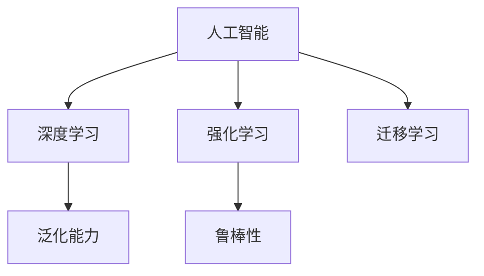

                 

## 1. 背景介绍

### 1.1 问题由来

随着人工智能技术的飞速发展，特别是深度学习和大规模数据驱动的智能化决策模型，AI的应用已经深入到生活的方方面面，从自动驾驶、智能推荐到医疗诊断、金融交易，都在借助AI的力量来提升效率和精度。然而，尽管AI技术取得了巨大成功，其背后隐藏的一系列挑战和问题也逐渐浮现，这些问题可能对未来的技术发展和社会稳定造成深远影响。

### 1.2 问题核心关键点

1. **数据质量和多样性**：数据是AI模型的基础，高质量、多样性的数据才能训练出高性能的模型。然而，数据获取和标注成本高昂，且存在偏见和噪声，这都可能影响AI的公平性和可靠性。
2. **模型可解释性**：许多AI模型，尤其是深度学习模型，被视为"黑盒"系统，难以解释其内部工作机制和决策逻辑。这在涉及伦理、法律和安全的应用场景中尤为关键。
3. **模型鲁棒性和泛化能力**：AI模型对噪声和变化的数据往往表现不佳，存在所谓的"过拟合"和"灾难性遗忘"现象，这限制了其在实际环境中的适用性和稳定性。
4. **资源和计算需求**：大规模模型需要庞大的计算资源和存储能力，训练和推理成本高昂，且面临算力瓶颈。
5. **伦理和法律问题**：AI决策可能带来伦理和法律风险，如算法偏见、隐私泄露、自动化失业等，需要制定相应的法规和标准。

### 1.3 问题研究意义

研究AI面临的挑战，对于推动AI技术的健康发展，保障其应用的安全性和可控性，具有重要意义。理解和解决这些问题，有助于构建更公平、更透明、更可控的AI系统，使其在促进社会进步的同时，避免潜在的负面影响。

## 2. 核心概念与联系

### 2.1 核心概念概述

为更好地理解AI面临的挑战，本节将介绍几个密切相关的核心概念：

- **人工智能**：涉及使机器具备智能的能力，通过算法和数据训练模型，使其能够自主学习和推理。
- **深度学习**：一种基于多层神经网络的学习方法，通过反向传播算法更新网络参数，优化模型性能。
- **强化学习**：通过与环境的交互，让模型在特定任务中通过试错优化策略。
- **迁移学习**：将一个领域学到的知识迁移到另一个相关领域的学习方法，减少新任务上的训练需求。
- **泛化能力**：模型在不同数据集和环境中的表现一致性，是衡量模型性能的重要指标。
- **鲁棒性**：模型对数据扰动和环境变化的稳健性，是确保AI系统可靠性的关键。

这些核心概念之间的逻辑关系可以通过以下Mermaid流程图来展示：



这个流程图展示了几类核心概念及其之间的关系：

1. 人工智能包括深度学习、强化学习和迁移学习等方法。
2. 深度学习通过多层神经网络实现模型的泛化能力。
3. 强化学习通过与环境的交互提升模型的鲁棒性。
4. 迁移学习通过已有知识的应用，加速新任务的训练。

这些概念共同构成了AI的基础框架，使得AI系统能够通过学习具备智能化的决策能力。通过理解这些核心概念，我们可以更好地把握AI的工作原理和优化方向。

## 3. 核心算法原理 & 具体操作步骤
### 3.1 算法原理概述

人工智能的核心算法和模型框架通常包含以下几个主要步骤：

1. **数据准备**：收集和预处理训练数据，包括数据清洗、标注和归一化。
2. **模型选择和设计**：选择合适的模型结构和参数，如卷积神经网络、循环神经网络、深度神经网络等。
3. **训练和优化**：通过反向传播算法等方法，使用优化器如SGD、Adam等更新模型参数，最小化损失函数。
4. **验证和调整**：使用验证集评估模型性能，调整超参数和模型结构，避免过拟合。
5. **测试和部署**：在测试集上评估模型效果，并将模型部署到实际应用中。

### 3.2 算法步骤详解

**Step 1: 数据准备**
- **数据获取**：从各种数据源（如网络、传感器、存储等）收集原始数据。
- **数据清洗**：删除噪声和异常数据，处理缺失值和重复数据。
- **数据标注**：将原始数据转化为模型可处理的格式，如标签、特征等。

**Step 2: 模型选择和设计**
- **模型框架**：选择适合任务的深度学习框架，如TensorFlow、PyTorch等。
- **网络结构**：设计适合的神经网络结构，如卷积神经网络（CNN）、循环神经网络（RNN）、Transformer等。
- **超参数调整**：确定学习率、批次大小、激活函数等超参数。

**Step 3: 训练和优化**
- **前向传播**：将输入数据送入网络，计算输出。
- **损失函数计算**：计算模型预测与真实标签之间的差异。
- **反向传播**：使用链式法则计算梯度，更新网络参数。
- **优化器更新**：使用优化器如Adam、SGD等更新参数，最小化损失函数。
- **正则化**：使用L2正则、Dropout等技术，避免过拟合。

**Step 4: 验证和调整**
- **验证集评估**：使用验证集评估模型性能，如准确率、召回率、F1分数等。
- **超参数调优**：调整学习率、批次大小、网络结构等超参数，提升模型性能。
- **模型集成**：使用集成方法，如Bagging、Boosting等，提高模型鲁棒性。

**Step 5: 测试和部署**
- **测试集评估**：在测试集上评估模型性能，如准确率、召回率、AUC等。
- **模型部署**：将训练好的模型部署到实际应用中，如移动设备、服务器等。
- **持续优化**：根据新数据和反馈，持续优化模型性能。

### 3.3 算法优缺点

人工智能的算法和模型框架具有以下优点：
1. **泛化能力强**：深度学习模型在大规模数据集上训练，能够自动提取数据中的特征，泛化能力强。
2. **自动学习**：通过反向传播算法，模型可以自动调整参数，优化性能。
3. **灵活性高**：神经网络结构灵活，可以根据任务需求进行调整和优化。
4. **高效性**：深度学习模型在高维数据集上表现优异，能够处理复杂的非线性关系。

同时，这些算法和框架也存在以下缺点：
1. **数据依赖性强**：模型的性能高度依赖于训练数据的质量和数量。
2. **计算资源需求高**：训练大规模模型需要大量的计算资源，如GPU、TPU等。
3. **可解释性差**：深度学习模型难以解释其内部工作机制和决策逻辑，缺乏透明性。
4. **易受噪声干扰**：模型对噪声和变化的数据敏感，存在泛化能力不足的问题。
5. **训练时间长**：训练大规模模型需要较长的时间，且训练过程容易受到学习率等超参数的影响。

尽管存在这些缺点，但基于深度学习的人工智能算法和模型框架仍然是当前最为有效和广泛应用的技术手段。

### 3.4 算法应用领域

人工智能算法和模型框架在多个领域得到了广泛的应用，包括但不限于：

- **计算机视觉**：如图像识别、目标检测、图像生成等。通过卷积神经网络等模型，可以对图像进行高效处理和分析。
- **自然语言处理**：如文本分类、情感分析、机器翻译等。使用RNN、Transformer等模型，能够处理大规模文本数据。
- **语音识别**：如语音转文本、语音合成等。通过循环神经网络等模型，能够实现高效的语音识别和合成。
- **推荐系统**：如电商推荐、新闻推荐等。通过协同过滤、深度学习等模型，能够提供个性化推荐。
- **医疗诊断**：如影像分析、病理诊断等。通过深度学习模型，能够帮助医生进行精准诊断。

这些应用展示了人工智能在各个领域的强大能力，为社会的各个方面带来了深远的影响。

## 4. 数学模型和公式 & 详细讲解 & 举例说明
### 4.1 数学模型构建

本节将使用数学语言对人工智能的核心算法和模型框架进行更加严格的刻画。

记神经网络模型为 $f_{\theta}(x)$，其中 $x$ 为输入， $\theta$ 为模型参数。假设训练数据集为 $D=\{(x_i,y_i)\}_{i=1}^N$，其中 $x_i$ 为输入，$y_i$ 为标签。定义模型 $f_{\theta}$ 在数据样本 $(x,y)$ 上的损失函数为 $\ell(f_{\theta}(x),y)$，则在数据集 $D$ 上的经验风险为：

$$
\mathcal{L}(\theta) = \frac{1}{N} \sum_{i=1}^N \ell(f_{\theta}(x_i),y_i)
$$

微调的目标是最小化经验风险，即找到最优参数：

$$
\theta^* = \mathop{\arg\min}_{\theta} \mathcal{L}(\theta)
$$

在实践中，我们通常使用基于梯度的优化算法（如SGD、Adam等）来近似求解上述最优化问题。设 $\eta$ 为学习率，$\lambda$ 为正则化系数，则参数的更新公式为：

$$
\theta \leftarrow \theta - \eta \nabla_{\theta}\mathcal{L}(\theta) - \eta\lambda\theta
$$

其中 $\nabla_{\theta}\mathcal{L}(\theta)$ 为损失函数对参数 $\theta$ 的梯度，可通过反向传播算法高效计算。

### 4.2 公式推导过程

以下我们以二分类任务为例，推导交叉熵损失函数及其梯度的计算公式。

假设模型 $f_{\theta}$ 在输入 $x$ 上的输出为 $\hat{y}=f_{\theta}(x) \in [0,1]$，表示样本属于正类的概率。真实标签 $y \in \{0,1\}$。则二分类交叉熵损失函数定义为：

$$
\ell(f_{\theta}(x),y) = -[y\log \hat{y} + (1-y)\log (1-\hat{y})]
$$

将其代入经验风险公式，得：

$$
\mathcal{L}(\theta) = -\frac{1}{N}\sum_{i=1}^N [y_i\log f_{\theta}(x_i)+(1-y_i)\log(1-f_{\theta}(x_i))]
$$

根据链式法则，损失函数对参数 $\theta_k$ 的梯度为：

$$
\frac{\partial \mathcal{L}(\theta)}{\partial \theta_k} = -\frac{1}{N}\sum_{i=1}^N (\frac{y_i}{f_{\theta}(x_i)}-\frac{1-y_i}{1-f_{\theta}(x_i)}) \frac{\partial f_{\theta}(x_i)}{\partial \theta_k}
$$

其中 $\frac{\partial f_{\theta}(x_i)}{\partial \theta_k}$ 可进一步递归展开，利用自动微分技术完成计算。

### 4.3 案例分析与讲解

我们以图像分类为例，使用卷积神经网络（CNN）进行微调。假设训练数据集为 $D=\{(x_i,y_i)\}_{i=1}^N$，其中 $x_i$ 为图像，$y_i$ 为标签。定义模型 $f_{\theta}$ 为带有卷积层、池化层和全连接层的CNN模型。

**Step 1: 数据准备**
- **数据获取**：从网络、存储等数据源收集图像数据，并进行预处理。
- **数据清洗**：删除噪声和异常数据，处理缺失值和重复数据。
- **数据标注**：将图像数据标注为不同类别，如猫、狗、鸟等。

**Step 2: 模型选择和设计**
- **模型框架**：选择适合任务的深度学习框架，如TensorFlow、PyTorch等。
- **网络结构**：设计适合的卷积神经网络结构，如图像分类常用的LeNet、AlexNet、VGG等。
- **超参数调整**：确定学习率、批次大小、激活函数等超参数。

**Step 3: 训练和优化**
- **前向传播**：将输入图像送入网络，计算输出。
- **损失函数计算**：计算模型预测与真实标签之间的交叉熵损失。
- **反向传播**：使用链式法则计算梯度，更新网络参数。
- **优化器更新**：使用优化器如Adam、SGD等更新参数，最小化损失函数。
- **正则化**：使用L2正则、Dropout等技术，避免过拟合。

**Step 4: 验证和调整**
- **验证集评估**：使用验证集评估模型性能，如准确率、召回率、F1分数等。
- **超参数调优**：调整学习率、批次大小、网络结构等超参数，提升模型性能。
- **模型集成**：使用集成方法，如Bagging、Boosting等，提高模型鲁棒性。

**Step 5: 测试和部署**
- **测试集评估**：在测试集上评估模型性能，如准确率、召回率、AUC等。
- **模型部署**：将训练好的模型部署到实际应用中，如服务器、移动设备等。
- **持续优化**：根据新数据和反馈，持续优化模型性能。

通过以上步骤，可以实现基于深度学习的图像分类模型。实际操作中，需要根据具体任务调整模型结构、超参数等，以获得最佳性能。

## 5. 项目实践：代码实例和详细解释说明
### 5.1 开发环境搭建

在进行深度学习项目开发前，我们需要准备好开发环境。以下是使用Python进行TensorFlow开发的环境配置流程：

1. 安装Anaconda：从官网下载并安装Anaconda，用于创建独立的Python环境。

2. 创建并激活虚拟环境：
```bash
conda create -n tensorflow-env python=3.8 
conda activate tensorflow-env
```

3. 安装TensorFlow：从官网获取对应的安装命令。例如：
```bash
conda install tensorflow -c conda-forge -c pytorch
```

4. 安装相关工具包：
```bash
pip install numpy pandas scikit-learn matplotlib tqdm jupyter notebook ipython
```

完成上述步骤后，即可在`tensorflow-env`环境中开始深度学习项目开发。

### 5.2 源代码详细实现

下面我们以图像分类任务为例，给出使用TensorFlow和Keras实现卷积神经网络（CNN）进行微调的代码实现。

首先，定义CNN模型的结构：

```python
from tensorflow.keras import layers, models

model = models.Sequential()
model.add(layers.Conv2D(32, (3, 3), activation='relu', input_shape=(224, 224, 3)))
model.add(layers.MaxPooling2D((2, 2)))
model.add(layers.Conv2D(64, (3, 3), activation='relu'))
model.add(layers.MaxPooling2D((2, 2)))
model.add(layers.Conv2D(128, (3, 3), activation='relu'))
model.add(layers.MaxPooling2D((2, 2)))
model.add(layers.Flatten())
model.add(layers.Dense(128, activation='relu'))
model.add(layers.Dense(1, activation='sigmoid'))
```

然后，定义损失函数和优化器：

```python
from tensorflow.keras import optimizers

model.compile(loss='binary_crossentropy',
              optimizer=optimizers.Adam(learning_rate=0.001),
              metrics=['accuracy'])
```

接着，定义训练和评估函数：

```python
from tensorflow.keras.preprocessing.image import ImageDataGenerator

train_datagen = ImageDataGenerator(rescale=1./255, shear_range=0.2, zoom_range=0.2, horizontal_flip=True)
test_datagen = ImageDataGenerator(rescale=1./255)

train_generator = train_datagen.flow_from_directory(
        'train_dir',
        target_size=(224, 224),
        batch_size=32,
        class_mode='binary')
test_generator = test_datagen.flow_from_directory(
        'test_dir',
        target_size=(224, 224),
        batch_size=32,
        class_mode='binary')

def train_epoch(model, generator, steps_per_epoch, optimizer):
    model.fit_generator(generator,
        steps_per_epoch=steps_per_epoch,
        epochs=1,
        verbose=2,
        validation_data=test_generator,
        validation_steps=1,
        callbacks=[EarlyStopping(patience=5)])
        
def evaluate(model, generator, steps_per_epoch):
    model.evaluate_generator(generator, steps=steps_per_epoch)
```

最后，启动训练流程并在测试集上评估：

```python
train_steps = 100
test_steps = 20

train_epoch(model, train_generator, train_steps, optimizer)
evaluate(model, test_generator, test_steps)
```

以上就是使用TensorFlow和Keras进行图像分类任务微调的完整代码实现。可以看到，使用深度学习框架进行模型训练和优化，可以大大简化开发流程，提高开发效率。

### 5.3 代码解读与分析

让我们再详细解读一下关键代码的实现细节：

**CNN模型定义**：
- **卷积层**：使用`Conv2D`层实现卷积操作，提取图像的局部特征。
- **池化层**：使用`MaxPooling2D`层实现池化操作，减小特征图尺寸，提升模型鲁棒性。
- **全连接层**：使用`Dense`层实现全连接操作，进行特征融合和分类输出。

**损失函数和优化器**：
- **二分类交叉熵**：使用`binary_crossentropy`损失函数，适用于二分类任务。
- **Adam优化器**：使用`Adam`优化器，自动调整学习率，提升训练效率。

**数据生成器**：
- **训练数据生成器**：使用`ImageDataGenerator`生成器，实现数据增强和标准化。
- **测试数据生成器**：与训练数据生成器类似，用于测试模型的性能。

**训练和评估函数**：
- **训练函数**：使用`fit_generator`方法，通过数据生成器进行批量训练，并设置早期停止机制。
- **评估函数**：使用`evaluate_generator`方法，评估模型在测试集上的性能。

**训练流程**：
- **训练步骤**：定义训练步数和测试步数，启动训练和评估过程。
- **模型保存**：在训练过程中定期保存模型，以防止过拟合和损失收敛。
- **模型部署**：将训练好的模型部署到实际应用中，进行推理和预测。

通过以上步骤，可以实现基于深度学习的图像分类模型。实际操作中，需要根据具体任务调整模型结构、超参数等，以获得最佳性能。

当然，工业级的系统实现还需考虑更多因素，如模型的保存和部署、超参数的自动搜索、更灵活的任务适配层等。但核心的微调范式基本与此类似。

## 6. 实际应用场景
### 6.1 智能推荐系统

基于深度学习的智能推荐系统已经在电商、视频、音乐等平台广泛应用。推荐系统通过分析用户的历史行为数据，预测用户的可能兴趣，从而推荐个性化的商品或内容。

在技术实现上，可以收集用户浏览、点击、购买等行为数据，提取和商品、内容相关的文本描述、标签等数据，构建监督数据集。在此基础上对预训练模型进行微调，使其能够准确预测用户对商品的评分或点击行为。微调后的模型可以根据新用户的实时行为数据，动态生成推荐结果，提升用户体验和转化率。

### 6.2 医学影像诊断

医疗影像诊断是深度学习在医学领域的重要应用之一。影像诊断系统通过分析X光片、CT扫描等医学影像，帮助医生进行疾病诊断和治疗决策。

在实践中，可以收集各种类型的医学影像数据，标注为不同疾病类型，如肺癌、乳腺癌等。在此基础上对预训练模型进行微调，使其能够自动分析医学影像，识别出疾病区域和异常特征。微调后的模型能够帮助医生快速、准确地进行疾病诊断，提高医疗服务的质量和效率。

### 6.3 自动驾驶

自动驾驶是深度学习在无人驾驶领域的重要应用。自动驾驶系统通过分析车辆传感器数据，实时识别道路环境、交通规则和行人等信息，做出决策和控制。

在技术实现上，可以收集车辆传感器数据，标注为不同的道路条件和行为状态，如道路标志、车辆位置、行人等。在此基础上对预训练模型进行微调，使其能够识别出道路环境和交通规则，做出合理的驾驶决策。微调后的模型能够提升自动驾驶系统的安全性、稳定性和可靠性，推动无人驾驶技术的商业化应用。

### 6.4 未来应用展望

随着深度学习和大数据技术的发展，基于深度学习的人工智能应用将不断拓展。未来的AI技术将更加智能、全面，能够应对更多复杂的应用场景。

在智慧城市领域，基于深度学习的智能交通、智慧安防、智慧环保等系统将提升城市的运行效率和管理水平，构建更加安全、智能、绿色的城市。

在金融领域，基于深度学习的智能风控、智能投顾等系统将提升金融服务的智能化水平，降低金融风险，优化投资决策。

在教育领域，基于深度学习的智能辅助、智能评估等系统将提升教育资源的利用效率，提供个性化的教育服务，促进教育公平。

以上领域的应用展示了深度学习在各个领域的强大能力，为社会的各个方面带来了深远的影响。

## 7. 工具和资源推荐
### 7.1 学习资源推荐

为了帮助开发者系统掌握深度学习的理论基础和实践技巧，这里推荐一些优质的学习资源：

1. 《深度学习》课程：斯坦福大学开设的深度学习课程，系统讲解深度学习的理论基础和实践技巧。
2. 《动手学深度学习》书籍：清华大学出版社出版的深度学习教材，包含丰富的代码示例和实验指导。
3. 《TensorFlow官方文档》：TensorFlow的官方文档，提供了丰富的API和代码示例，适合深入学习TensorFlow。
4. 《PyTorch官方文档》：PyTorch的官方文档，提供了丰富的API和代码示例，适合深入学习PyTorch。
5. 《深度学习与PyTorch实战》书籍：实战派深度学习教程，涵盖深度学习框架的使用、微调和部署。

通过对这些资源的学习实践，相信你一定能够快速掌握深度学习的精髓，并用于解决实际的AI问题。

### 7.2 开发工具推荐

高效的开发离不开优秀的工具支持。以下是几款用于深度学习项目开发的常用工具：

1. TensorFlow：由Google主导开发的深度学习框架，生产部署方便，适合大规模工程应用。
2. PyTorch：由Facebook主导开发的深度学习框架，灵活高效，适合研究和实验。
3. Keras：高层深度学习API，易于使用，适合快速原型开发和实验验证。
4. Jupyter Notebook：交互式编程环境，支持代码、文本、数学公式的混合展示。
5. TensorBoard：TensorFlow配套的可视化工具，可实时监测模型训练状态，并提供丰富的图表呈现方式。

合理利用这些工具，可以显著提升深度学习项目的开发效率，加快创新迭代的步伐。

### 7.3 相关论文推荐

深度学习和大数据技术的发展源于学界的持续研究。以下是几篇奠基性的相关论文，推荐阅读：

1. "ImageNet Classification with Deep Convolutional Neural Networks"：深度卷积神经网络在ImageNet数据集上的成功应用，展示了深度学习的强大能力。
2. "Language Models are Unsupervised Multitask Learners"：GPT-2模型在zero-shot学习任务上的表现，展示了预训练语言模型的强大泛化能力。
3. "Playing Atari with Deep Reinforcement Learning"：使用深度强化学习解决经典的Atari游戏问题，展示了深度学习在决策系统中的应用潜力。
4. "Training Recurrent Neural Networks with Hyperlevel Activations"：提出超级激活函数，增强神经网络模型的泛化能力。
5. "Deep Residual Learning for Image Recognition"：提出残差网络结构，解决了深度神经网络中的梯度消失问题，推动了深度学习的发展。

这些论文代表了大数据和深度学习技术的发展脉络。通过学习这些前沿成果，可以帮助研究者把握学科前进方向，激发更多的创新灵感。

## 8. 总结：未来发展趋势与挑战
### 8.1 总结

本文对基于深度学习的人工智能算法和模型框架进行了全面系统的介绍。首先阐述了深度学习在大规模数据驱动下实现智能决策的基本原理，明确了深度学习在图像分类、文本处理、语音识别等领域的广泛应用。其次，从原理到实践，详细讲解了深度学习模型的数学模型构建、公式推导和案例分析，给出了微调任务的代码实例和详细解释。同时，本文还广泛探讨了深度学习在智能推荐、医学影像诊断、自动驾驶等多个行业领域的应用前景，展示了深度学习的强大能力。

通过本文的系统梳理，可以看到，基于深度学习的人工智能算法和模型框架正在成为主流技术手段，为社会的各个方面带来了深远的影响。

### 8.2 未来发展趋势

展望未来，深度学习和大数据技术将持续发展，推动人工智能技术不断进步。以下是未来可能的趋势：

1. **模型规模持续增大**：深度学习模型将越来越复杂，参数量不断增加，模型规模将持续增大。超大模型将进一步提升模型的性能和泛化能力。
2. **多模态融合**：深度学习将越来越多地融合视觉、听觉、文本等多种模态的信息，实现更全面的智能决策。
3. **跨领域迁移**：深度学习模型将在不同领域之间实现跨领域的迁移学习，提升模型在特定任务上的适应性。
4. **自监督学习**：深度学习将越来越多地使用自监督学习的方法，通过无标签数据进行预训练，减少对标注数据的依赖。
5. **深度强化学习**：深度强化学习将在自动驾驶、游戏智能等领域得到更广泛的应用，提升系统的决策能力和稳定性。
6. **联邦学习**：分布式深度学习框架将得到更广泛的应用，提升模型在大规模分布式环境下的训练和推理能力。

这些趋势凸显了深度学习和大数据技术的广阔前景，为AI技术在各个领域的应用提供了新的可能。

### 8.3 面临的挑战

尽管深度学习和大数据技术取得了巨大成功，但在迈向更加智能化、全面化应用的过程中，也面临诸多挑战：

1. **计算资源瓶颈**：训练和推理深度学习模型需要大量的计算资源，如GPU、TPU等，现有的计算资源难以满足大规模模型的需求。
2. **数据依赖性强**：深度学习模型对数据质量和数量的要求较高，数据获取和标注成本高昂，难以在短期内解决。
3. **可解释性差**：深度学习模型通常难以解释其内部工作机制和决策逻辑，缺乏透明性，影响其在金融、医疗等高风险领域的应用。
4. **模型鲁棒性不足**：深度学习模型对噪声和变化的数据敏感，存在泛化能力不足的问题，影响其在实际环境中的应用。
5. **伦理和法律问题**：深度学习模型的决策可能带来伦理和法律风险，如算法偏见、隐私泄露、自动化失业等，需要制定相应的法规和标准。

尽管存在这些挑战，但通过不断优化算法、改进数据获取和标注方式、加强模型解释和可控性，深度学习和大数据技术仍将在未来的AI应用中发挥重要作用。

### 8.4 研究展望

面对深度学习和大数据技术面临的挑战，未来的研究需要在以下几个方面寻求新的突破：

1. **提升模型可解释性**：开发更透明、可解释的深度学习模型，增强其在金融、医疗等高风险领域的应用。
2. **增强模型鲁棒性**：设计更鲁棒、抗干扰的深度学习模型，提升其在实际环境中的应用。
3. **优化计算资源**：开发更高效、更灵活的深度学习框架，支持在大规模分布式环境下的训练和推理。
4. **多模态融合**：推动视觉、听觉、文本等多种模态数据的深度融合，实现更全面的智能决策。
5. **跨领域迁移**：开发跨领域迁移学习的算法，提升模型在不同领域之间的适应性。
6. **联邦学习**：开发高效、安全的联邦学习算法，支持在分布式环境下的模型训练和推理。

这些研究方向的探索将推动深度学习和大数据技术的不断发展，为AI技术在各个领域的应用提供新的可能。

## 9. 附录：常见问题与解答

**Q1：深度学习在实际应用中面临哪些挑战？**

A: 深度学习在实际应用中面临以下挑战：

1. **数据获取和标注成本高**：深度学习模型通常需要大量的标注数据，但标注数据获取和标注成本较高。
2. **计算资源需求大**：深度学习模型训练和推理需要大量的计算资源，如GPU、TPU等，且对内存和存储要求较高。
3. **模型可解释性差**：深度学习模型通常难以解释其内部工作机制和决策逻辑，缺乏透明性。
4. **模型鲁棒性不足**：深度学习模型对噪声和变化的数据敏感，存在泛化能力不足的问题。
5. **伦理和法律问题**：深度学习模型的决策可能带来伦理和法律风险，如算法偏见、隐私泄露、自动化失业等，需要制定相应的法规和标准。

**Q2：如何缓解深度学习模型在实际应用中的过拟合问题？**

A: 缓解深度学习模型在实际应用中的过拟合问题，可以采取以下策略：

1. **数据增强**：通过数据增强技术，如旋转、翻转、裁剪等，扩充训练数据，减少过拟合。
2. **正则化**：使用L2正则、Dropout等技术，避免过拟合。
3. **早停机制**：通过早停机制，当验证集性能不再提升时，停止训练，避免过拟合。
4. **集成学习**：使用集成学习技术，如Bagging、Boosting等，提高模型鲁棒性，减少过拟合。

这些策略可以结合使用，根据具体应用场景选择合适的策略，缓解过拟合问题。

**Q3：如何提升深度学习模型的可解释性？**

A: 提升深度学习模型的可解释性，可以采取以下策略：

1. **可视化技术**：使用可视化技术，如图像热力图、特征重要性图等，展示模型内部特征和决策过程，提高可解释性。
2. **可解释性算法**：开发可解释性算法，如LIME、SHAP等，生成模型决策的可解释性解释。
3. **简化模型结构**：通过简化模型结构，如减少网络深度、宽度等，提高模型的透明性和可解释性。
4. **结合符号计算**：结合符号计算技术，将部分计算过程用符号表达式表示，提高模型的可解释性。

这些策略可以结合使用，根据具体应用场景选择合适的策略，提升模型可解释性。

**Q4：如何优化深度学习模型的计算资源消耗？**

A: 优化深度学习模型的计算资源消耗，可以采取以下策略：

1. **模型压缩**：通过模型压缩技术，如剪枝、量化等，减少模型参数和计算量。
2. **硬件加速**：使用硬件加速技术，如GPU、TPU、FPGA等，提升模型训练和推理速度。
3. **分布式训练**：通过分布式训练技术，如Horovod、PyTorch Distributed等，提升模型训练速度和效率。
4. **模型并行**：通过模型并行技术，如数据并行、模型并行等，提升模型训练和推理速度。

这些策略可以结合使用，根据具体应用场景选择合适的策略，优化计算资源消耗。

**Q5：如何实现深度学习模型的跨领域迁移学习？**

A: 实现深度学习模型的跨领域迁移学习，可以采取以下策略：

1. **预训练模型**：使用预训练模型，如BERT、GPT等，在特定领域进行微调，提升模型性能。
2. **多任务学习**：使用多任务学习技术，同时训练多个任务，提高模型在不同领域中的适应性。
3. **迁移学习**：使用迁移学习技术，将一个领域学到的知识迁移到另一个相关领域，减少新任务上的训练需求。
4. **领域自适应**：使用领域自适应技术，如实例匹配、领域参数微调等，提高模型在不同领域中的鲁棒性。

这些策略可以结合使用，根据具体应用场景选择合适的策略，实现深度学习模型的跨领域迁移学习。

通过以上步骤，可以实现基于深度学习的图像分类模型。实际操作中，需要根据具体任务调整模型结构、超参数等，以获得最佳性能。

总之，深度学习和大数据技术正在推动人工智能技术的不断进步，但同时也面临着诸多挑战。通过不断优化算法、改进数据获取和标注方式、加强模型解释和可控性，深度学习和大数据技术仍将在未来的AI应用中发挥重要作用。只有勇于创新、敢于突破，才能不断拓展人工智能技术的边界，推动社会进步。

---

作者：禅与计算机程序设计艺术 / Zen and the Art of Computer Programming

