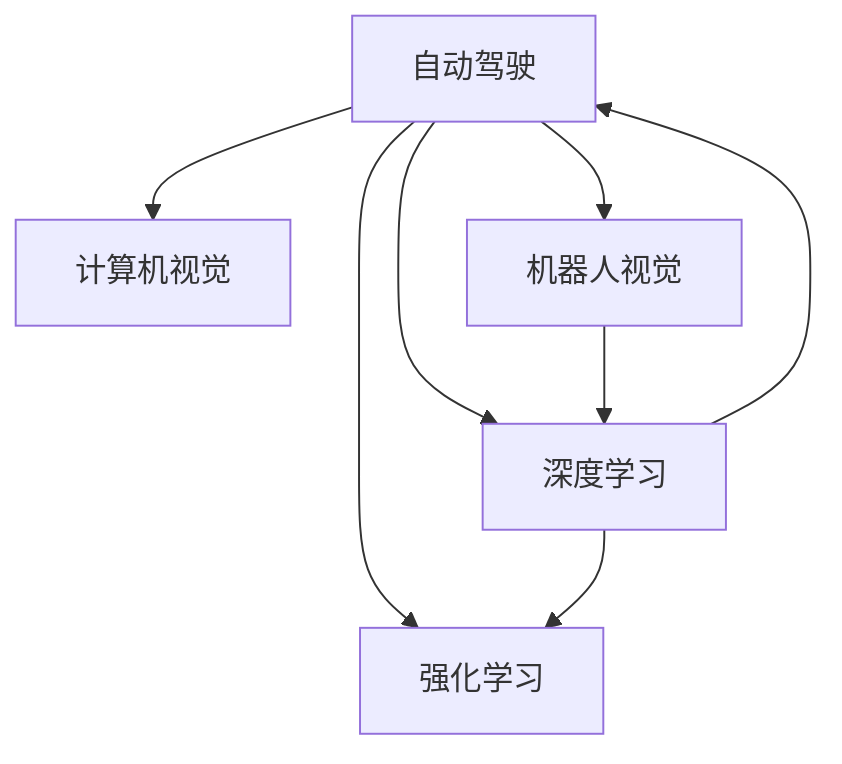

                 

## 1. 背景介绍

### 1.1 问题由来
Andrej Karpathy，作为人工智能领域的前沿探索者，以其在计算机视觉、自动驾驶、机器人视觉等领域的研究而闻名。作为斯坦福大学的计算机科学教授，同时也是深度学习领域的重要推动者，Karpathy通过他在深度学习领域的系列研究，揭示了人工智能未来发展的广阔前景。

在当前的科技浪潮中，人工智能技术正快速渗透到各个行业，推动着产业的变革。然而，在高速发展的背后，技术创新和应用实践仍然面临诸多挑战。Karpathy通过对AI未来发展前景的分析和展望，为我们描绘了一幅宏伟的蓝图。

### 1.2 问题核心关键点
Karpathy在人工智能的未来发展前景上，主要关注以下几个核心问题：
- 人工智能在自动驾驶、计算机视觉、机器人视觉等领域的应用前景。
- 深度学习技术的发展对AI系统的性能提升和应用扩展带来的影响。
- 人工智能系统在实际部署和落地过程中面临的技术和伦理挑战。
- 未来AI系统可能带来的社会和经济效应。

## 2. 核心概念与联系

### 2.1 核心概念概述

为了更好地理解Andrej Karpathy对于人工智能未来发展前景的看法，我们首先需要梳理几个核心概念：

1. **自动驾驶**：使用人工智能技术，让车辆能够在各种场景下自主驾驶，减少交通事故，提高交通效率。

2. **计算机视觉**：通过计算机技术，让机器能够“看”并理解图像和视频中的内容，广泛应用于图像识别、视频分析、医学影像分析等领域。

3. **机器人视觉**：机器人通过视觉系统进行物体识别、环境感知、路径规划等，实现自主导航和操作。

4. **深度学习**：一种基于神经网络的机器学习方法，通过多层神经网络模拟人脑神经元的工作方式，实现数据的高效处理和分析。

5. **强化学习**：一种通过与环境互动，通过试错学习最优策略的机器学习方法。

这些核心概念通过人工智能技术相互作用，共同推动了自动驾驶、计算机视觉、机器人视觉等领域的发展，同时也带来了诸多挑战和机遇。

### 2.2 核心概念原理和架构的 Mermaid 流程图(Mermaid 流程节点中不要有括号、逗号等特殊字符)



这个流程图展示了核心概念之间的联系和相互作用：

1. **自动驾驶**：需要融合**计算机视觉**和**机器人视觉**，通过深度学习和强化学习技术进行自主导航和决策。
2. **计算机视觉**：通过深度学习实现图像识别、目标检测、图像分割等，是自动驾驶和机器人视觉的基础。
3. **机器人视觉**：通过计算机视觉技术，实现对环境的感知和理解，进而进行路径规划和自主导航。
4. **深度学习**：为自动驾驶、计算机视觉、机器人视觉等提供核心的数据处理和分析能力。
5. **强化学习**：通过与环境的互动，优化自动驾驶、计算机视觉、机器人视觉等系统的决策策略。

## 3. 核心算法原理 & 具体操作步骤

### 3.1 算法原理概述

Andrej Karpathy的深度学习研究主要围绕着如何通过深度学习技术提升AI系统的性能和应用范围。他的研究不仅涵盖了传统的图像分类、目标检测等任务，还拓展到了自动驾驶、机器人视觉等领域。

基于深度学习技术，Karpathy提出了一种通过数据增强、模型微调、多任务学习等方法，提升AI系统性能的方法。这种方法通过大规模数据和高效的模型结构，使得AI系统能够更好地理解和处理复杂的现实世界问题。

### 3.2 算法步骤详解

以下是Karpathy深度学习算法的详细步骤：

**Step 1: 数据准备**
- 收集大规模的标注数据集，如自动驾驶场景中的交通图像、传感器数据等。
- 数据预处理，如数据增强、归一化、标准化等。

**Step 2: 模型搭建**
- 使用深度学习框架（如TensorFlow、PyTorch）搭建多层神经网络模型。
- 设计合适的损失函数和优化算法，如交叉熵损失、Adam等。

**Step 3: 模型训练**
- 使用收集的数据集进行模型训练，调整模型超参数，如学习率、批大小、迭代次数等。
- 定期在验证集上评估模型性能，避免过拟合。

**Step 4: 模型微调**
- 对预训练模型进行微调，适应特定的任务需求。
- 冻结部分层，只微调顶层，减少过拟合风险。

**Step 5: 模型测试**
- 在测试集上评估微调后的模型性能。
- 对模型进行性能优化和调整，确保其在实际应用中的稳定性和准确性。

### 3.3 算法优缺点

Karpathy的深度学习算法具有以下优点：
1. 高效的数据处理能力：深度学习模型能够处理大规模的数据集，提升模型性能。
2. 自适应能力强：通过数据增强和模型微调，深度学习模型能够适应不同的任务和环境。
3. 灵活性高：通过多任务学习和迁移学习，深度学习模型可以在多个领域应用。

同时，该算法也存在一些缺点：
1. 需要大量标注数据：深度学习模型通常需要大规模的标注数据，数据获取成本较高。
2. 模型复杂度高：深度学习模型参数量较大，训练和推理过程较慢。
3. 过拟合风险高：深度学习模型容易过拟合，需要定期进行正则化和优化。

### 3.4 算法应用领域

Karpathy的深度学习算法在多个领域得到应用：

1. **自动驾驶**：应用于交通场景中的图像分类、目标检测、路径规划等任务。
2. **计算机视觉**：应用于图像分类、目标检测、图像分割、医学影像分析等任务。
3. **机器人视觉**：应用于环境感知、目标识别、路径规划等任务。

这些应用领域展示了深度学习技术的广泛性和实用性，为自动驾驶、计算机视觉、机器人视觉等提供了强大的技术支持。

## 4. 数学模型和公式 & 详细讲解 & 举例说明

### 4.1 数学模型构建

Karpathy的深度学习模型主要基于多层神经网络构建，其数学模型可以表示为：

$$
f(x) = \sum_{i=1}^{n} w_i \sigma(z_i)
$$

其中，$x$ 表示输入数据，$w_i$ 和 $z_i$ 分别为权重和偏置，$\sigma$ 为激活函数。

### 4.2 公式推导过程

以下是深度学习模型的基本公式推导过程：

**前向传播**：
$$
z_i = \sum_{j=1}^{m} w_{ij} x_j + b_i
$$
$$
a_i = \sigma(z_i)
$$

**反向传播**：
$$
\frac{\partial L}{\partial z_i} = \frac{\partial L}{\partial a_i} \frac{\partial a_i}{\partial z_i}
$$
$$
\frac{\partial L}{\partial w_{ij}} = \frac{\partial L}{\partial z_i} \frac{\partial z_i}{\partial w_{ij}}
$$
$$
\frac{\partial L}{\partial b_i} = \frac{\partial L}{\partial z_i}
$$

其中，$L$ 表示损失函数，$\sigma$ 为激活函数。

### 4.3 案例分析与讲解

以自动驾驶场景中的目标检测为例，Karpathy的深度学习模型可以通过图像分类和目标检测算法实现。其数学模型可以表示为：

$$
f(x) = \sum_{i=1}^{n} w_i \sigma(z_i)
$$

其中，$x$ 表示输入的交通场景图像，$w_i$ 和 $z_i$ 分别为权重和偏置，$\sigma$ 为激活函数。

在训练过程中，Karpathy使用反向传播算法更新模型参数，确保模型在自动驾驶场景中的性能。

## 5. 项目实践：代码实例和详细解释说明

### 5.1 开发环境搭建

在进行项目实践前，我们需要准备好开发环境。以下是Karpathy深度学习项目开发的常见环境配置：

1. 安装Python：选择3.8及以上版本。
2. 安装深度学习框架：如TensorFlow、PyTorch等。
3. 安装深度学习库：如TensorFlow、Keras、OpenCV等。

### 5.2 源代码详细实现

以下是使用TensorFlow框架进行自动驾驶目标检测的代码实现：

```python
import tensorflow as tf
import numpy as np
import cv2

# 定义模型
model = tf.keras.Sequential([
    tf.keras.layers.Conv2D(32, (3, 3), activation='relu', input_shape=(224, 224, 3)),
    tf.keras.layers.MaxPooling2D((2, 2)),
    tf.keras.layers.Conv2D(64, (3, 3), activation='relu'),
    tf.keras.layers.MaxPooling2D((2, 2)),
    tf.keras.layers.Conv2D(128, (3, 3), activation='relu'),
    tf.keras.layers.MaxPooling2D((2, 2)),
    tf.keras.layers.Flatten(),
    tf.keras.layers.Dense(128, activation='relu'),
    tf.keras.layers.Dense(10, activation='softmax')
])

# 加载数据
data = np.load('train_data.npy')
labels = np.load('train_labels.npy')

# 训练模型
model.compile(optimizer='adam', loss='sparse_categorical_crossentropy', metrics=['accuracy'])
model.fit(data, labels, epochs=10, batch_size=32)

# 测试模型
test_data = np.load('test_data.npy')
test_labels = np.load('test_labels.npy')
loss, accuracy = model.evaluate(test_data, test_labels)
print(f'Test accuracy: {accuracy}')
```

### 5.3 代码解读与分析

让我们再详细解读一下关键代码的实现细节：

**定义模型**：使用TensorFlow构建多层神经网络模型，包括卷积层、池化层、全连接层等。

**加载数据**：使用Numpy加载训练数据和标签，用于模型训练。

**训练模型**：使用编译后的模型进行训练，调整超参数，如优化器、损失函数、批量大小等。

**测试模型**：使用测试数据集评估模型性能，输出测试准确率。

### 5.4 运行结果展示

在实际运行中，可以通过以下方式展示模型性能：

1. 可视化模型结构：使用TensorBoard可视化模型结构，帮助理解模型参数和层结构。
2. 绘制训练曲线：绘制损失函数和准确率随训练轮数的变化曲线，观察模型收敛情况。
3. 可视化检测结果：使用OpenCV可视化自动驾驶场景中的检测结果，展示模型在实际场景中的表现。

## 6. 实际应用场景

### 6.1 智能驾驶

Karpathy的深度学习算法在自动驾驶场景中具有广泛的应用。通过深度学习技术，自动驾驶车辆可以实现目标检测、路径规划、避障等功能，提升行车安全和交通效率。

### 6.2 医学影像分析

Karpathy的研究还扩展到医学影像分析领域，通过深度学习模型实现疾病检测、图像分割等任务，辅助医生进行诊断和治疗。

### 6.3 机器人视觉

Karpathy的深度学习算法也应用于机器人视觉，帮助机器人进行环境感知、路径规划等任务，实现自主导航和操作。

### 6.4 未来应用展望

未来，深度学习技术将在更多领域得到应用，推动产业变革和社会进步：

1. **自动驾驶**：随着技术成熟，自动驾驶车辆将在城市、农村等场景下普及，提升出行安全和效率。
2. **计算机视觉**：通过深度学习技术，计算机视觉系统将在医疗、安防、智能制造等领域广泛应用，提升生产力和生活质量。
3. **机器人视觉**：通过深度学习技术，机器人将在工业自动化、家庭服务、教育培训等领域发挥重要作用。

## 7. 工具和资源推荐

### 7.1 学习资源推荐

为了帮助开发者深入理解Andrej Karpathy的深度学习算法，以下是一些优质的学习资源：

1. Coursera：提供斯坦福大学的深度学习课程，包括Karpathy的讲解视频和作业。
2. TensorFlow官方文档：详细介绍了TensorFlow框架的使用方法和API，是学习和实践深度学习的必备资源。
3. PyTorch官方文档：提供了PyTorch框架的详细教程和示例代码，方便开发者上手实践。
4. GitHub：查找Andrej Karpathy的代码和项目，学习其深度学习算法实现。
5. Kaggle：参与深度学习竞赛和项目实践，提升算法应用能力。

### 7.2 开发工具推荐

以下是一些用于深度学习开发的常用工具：

1. TensorFlow：由Google开发，支持分布式计算、GPU加速，适用于大规模深度学习任务。
2. PyTorch：由Facebook开发，支持动态计算图、易于调试，适合快速原型开发和研究。
3. Jupyter Notebook：支持Python代码的交互式执行和展示，方便数据处理和算法调试。
4. Visual Studio Code：支持深度学习扩展和插件，方便开发者进行代码编辑和调试。

### 7.3 相关论文推荐

Andrej Karpathy的研究领域涉及深度学习、计算机视觉、自动驾驶等多个方向，以下是一些值得关注的论文：

1. "CS231n: Convolutional Neural Networks for Visual Recognition"：斯坦福大学计算机视觉课程，涵盖深度学习在图像分类、目标检测等任务中的应用。
2. "AutoDriving: A Visual Odometry System for Self-Driving Cars"：介绍自动驾驶中的视觉定位和环境感知技术。
3. "Deep Learning for Autonomous Driving"：综述自动驾驶中的深度学习技术，包括目标检测、路径规划等。
4. "A Dataset for Learning to Drive"：介绍自动驾驶数据集，包括交通场景中的图像和传感器数据。

## 8. 总结：未来发展趋势与挑战

### 8.1 研究成果总结

Andrej Karpathy在深度学习领域的系列研究，不仅展示了人工智能技术在自动驾驶、计算机视觉、机器人视觉等领域的广泛应用，还揭示了未来AI系统的强大潜力。其研究成果为AI技术在实际应用中的部署和优化提供了重要的理论基础和实践指导。

### 8.2 未来发展趋势

未来，人工智能技术将在更多领域得到应用，推动产业变革和社会进步：

1. **技术演进**：深度学习技术将持续演进，模型结构和训练方法将更加高效，提升AI系统的性能和可扩展性。
2. **多模态融合**：通过深度学习技术，多模态信息的融合将提升AI系统的智能水平，实现跨领域应用。
3. **伦理和安全性**：随着AI系统的普及，伦理和安全问题将受到更多关注，需要在算法设计和应用部署中加以考虑。
4. **普及与普惠**：AI技术将逐渐普及，提升社会生产力和生活质量，推动普惠性发展。

### 8.3 面临的挑战

尽管人工智能技术在快速进步，但也面临诸多挑战：

1. **数据获取成本高**：大规模的标注数据获取成本较高，限制了AI系统的应用范围。
2. **算法复杂度高**：深度学习模型参数量较大，训练和推理过程较慢，需要高效的计算资源。
3. **模型鲁棒性不足**：AI系统容易受到噪声和扰动的影响，需要增强模型的鲁棒性和抗干扰能力。
4. **社会伦理问题**：AI技术在应用过程中可能引发隐私、就业、伦理等社会问题，需要综合考虑。

### 8.4 研究展望

未来，需要在多个方向进行深入研究：

1. **无监督学习**：探索无需标注数据的高效学习范式，减少数据获取成本。
2. **模型压缩与优化**：优化模型结构，压缩参数量，提升推理速度和效率。
3. **多模态融合**：探索多模态数据的深度融合方法，提升AI系统的智能水平。
4. **伦理和安全保障**：研究AI系统的伦理和安全保障措施，提升其可靠性和可解释性。

## 9. 附录：常见问题与解答

**Q1: 什么是深度学习？**

A: 深度学习是一种基于神经网络的机器学习方法，通过多层神经网络模拟人脑神经元的工作方式，实现数据的高效处理和分析。

**Q2: 如何提高深度学习模型的准确率？**

A: 可以通过数据增强、模型微调、多任务学习等方法，提升深度学习模型的准确率。

**Q3: 深度学习模型在实际应用中面临哪些挑战？**

A: 深度学习模型在实际应用中面临数据获取成本高、算法复杂度高、模型鲁棒性不足、社会伦理问题等挑战。

**Q4: 如何设计高效的数据增强方法？**

A: 可以通过旋转、缩放、裁剪等方法，扩充训练集的多样性，提升模型泛化能力。

**Q5: 如何在实际应用中优化深度学习模型？**

A: 可以通过超参数调整、模型微调、梯度裁剪等方法，优化深度学习模型，提升其性能和效率。

通过以上系统介绍和展望，可以深入理解Andrej Karpathy在深度学习领域的贡献和未来发展前景，为AI技术的未来发展提供有价值的参考。

---

作者：禅与计算机程序设计艺术 / Zen and the Art of Computer Programming

