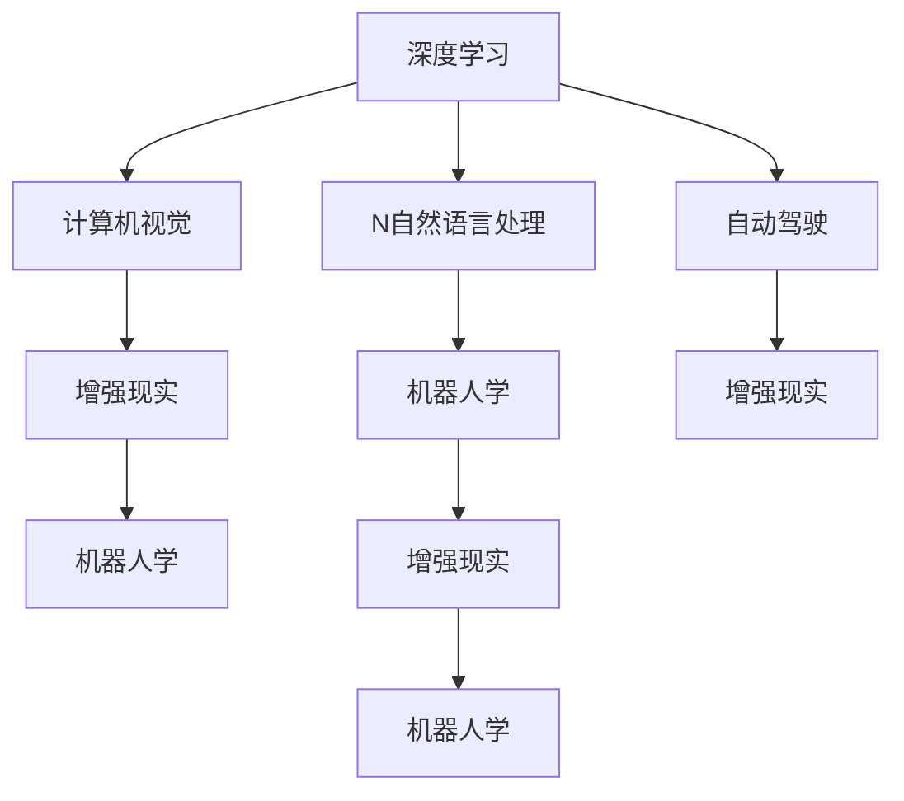

                 

# Andrej Karpathy：人工智能的未来发展前景

> 关键词：人工智能, 深度学习, 计算机视觉, 自然语言处理, 自动驾驶, 增强现实, 机器人学

## 1. 背景介绍

### 1.1 问题由来

在过去的几年里，人工智能(AI)技术取得了飞速发展，尤其是在深度学习、计算机视觉、自然语言处理等领域，不断地刷新着各类任务的记录。然而，尽管这些技术的进步显著，AI的实际应用仍然面临诸多挑战。在这些挑战中，Andrej Karpathy作为一名深度学习领域的研究者和开发者，为我们揭示了人工智能未来发展的潜在方向和前景。

### 1.2 问题核心关键点

Karpathy指出，未来人工智能的发展将围绕以下几个关键点展开：
1. **深度学习的进化**：深度学习的底层算法和技术将继续发展和完善，从而实现更高的效率和更广泛的应用。
2. **计算机视觉和视觉理解**：AI将在视觉领域取得重大突破，能够理解和处理更复杂的视觉信息。
3. **自然语言处理(NLP)**：NLP技术将进一步提升，使AI能够理解和生成更自然、流畅的语言。
4. **自动驾驶**：自动驾驶技术将实现大规模部署，带来更安全、高效的交通系统。
5. **增强现实(AR)和虚拟现实(VR)**：AR和VR技术将深入应用，带来全新的交互和体验方式。
6. **机器人学**：AI机器人将在工业、家庭等领域广泛应用，提升生产效率和生活质量。

这些关键点构成了AI未来发展的基本框架，将引领人工智能技术在各个领域的应用和突破。

## 2. 核心概念与联系

### 2.1 核心概念概述

为了更好地理解Andrej Karpathy对AI未来发展的见解，本节将介绍几个密切相关的核心概念：

- **深度学习(Deep Learning)**：一种基于多层神经网络的机器学习技术，能够自动学习并提取数据的高级特征。
- **计算机视觉(Computer Vision)**：AI处理和分析视觉信息的能力，包括图像识别、目标检测、语义分割等任务。
- **自然语言处理(Natural Language Processing, NLP)**：AI理解和生成自然语言的能力，包括文本分类、语言生成、机器翻译等任务。
- **自动驾驶(Autonomous Driving)**：AI在无人驾驶车辆中的应用，通过感知、决策和控制实现自动驾驶。
- **增强现实(AR)和虚拟现实(VR)**：通过计算机生成的视觉和听觉反馈，增强或创造新的现实体验。
- **机器人学(Robotics)**：AI在机器人系统中的应用，实现自主导航、操作、决策等。

这些核心概念之间的逻辑关系可以通过以下Mermaid流程图来展示：



这个流程图展示了大语言模型的核心概念及其之间的关系：

1. 深度学习作为AI的基础技术，是计算机视觉、自然语言处理、自动驾驶等应用的核心。
2. 计算机视觉和自然语言处理分别在视觉和语言领域取得突破，为AI提供更丰富的感知能力。
3. 自动驾驶和增强现实结合，推动智能交通和虚拟体验的融合。
4. 机器人学结合多模态感知，为家庭、工业等场景提供高效、灵活的AI系统。

## 3. 核心算法原理 & 具体操作步骤
### 3.1 算法原理概述

Andrej Karpathy强调，未来AI的发展将依赖于深度学习的进一步进步，特别是神经网络结构、训练方法以及数据处理技术的不断优化。以下是一些核心的算法原理：

- **卷积神经网络(CNN)**：通过卷积操作捕捉局部特征，广泛应用于图像分类、目标检测等任务。
- **循环神经网络(RNN)**：通过时间依赖的模型处理序列数据，适用于文本生成、语音识别等任务。
- **长短期记忆网络(LSTM)**：一种改进的RNN，解决了长序列问题，广泛应用于序列预测和生成。
- **生成对抗网络(GAN)**：通过对抗性训练生成高质量的合成数据，可用于数据增强、图像生成等。
- **Transformer**：基于自注意力机制的神经网络架构，在NLP任务中取得突破，提高了模型的处理效率和表现。

### 3.2 算法步骤详解

以下是AI应用开发的一般流程：

**Step 1: 数据准备和预处理**
- 收集并准备相关领域的标注数据。
- 进行数据清洗和预处理，如去噪、归一化、标准化等。
- 将数据划分为训练集、验证集和测试集。

**Step 2: 模型选择和初始化**
- 根据任务需求选择合适的深度学习模型架构。
- 初始化模型参数，通常使用预训练模型进行迁移学习。

**Step 3: 训练和优化**
- 使用训练集进行模型训练，通常采用梯度下降等优化算法。
- 应用正则化技术，如Dropout、L2正则等，防止过拟合。
- 在验证集上进行模型评估，根据性能指标调整超参数。

**Step 4: 测试和部署**
- 在测试集上评估模型性能，对比训练前后的效果。
- 将模型集成到实际应用系统中，进行部署和运行。
- 定期收集新数据，重新训练和微调模型，保持模型性能。

### 3.3 算法优缺点

深度学习作为一种强大的AI技术，具有以下优点：
1. **高效处理复杂数据**：能够处理高维数据，识别复杂模式和结构。
2. **自动学习特征**：不需要手动提取特征，减少了人工干预。
3. **泛化能力强**：经过充分训练后，能够在未见过的数据上取得良好表现。

然而，深度学习也存在一些缺点：
1. **计算资源需求高**：训练深度模型需要大量的计算资源和时间。
2. **可解释性差**：深度模型通常是"黑盒"，难以解释其决策过程。
3. **模型复杂度高**：深度模型参数众多，容易过拟合。
4. **数据依赖性强**：模型的表现高度依赖于数据质量和多样性。

尽管存在这些局限性，但深度学习仍然是未来AI发展的重要技术基础。通过不断优化算法和训练方法，深度学习有望解决更多实际问题。

### 3.4 算法应用领域

基于深度学习的AI技术在多个领域取得了显著进展，具体如下：

- **计算机视觉**：如图像分类、目标检测、语义分割等。
- **自然语言处理**：如机器翻译、文本生成、情感分析等。
- **自动驾驶**：如环境感知、路径规划、车辆控制等。
- **增强现实和虚拟现实**：如场景渲染、交互设计、实时反馈等。
- **机器人学**：如智能导航、操作控制、决策优化等。

## 4. 数学模型和公式 & 详细讲解 & 举例说明（备注：数学公式请使用latex格式，latex嵌入文中独立段落使用 $$，段落内使用 $)
### 4.1 数学模型构建

在AI应用中，数学模型的构建是关键。以下是一些常见的数学模型及其构建方法：

- **线性回归模型**：
  $$
  y = \beta_0 + \beta_1 x_1 + \beta_2 x_2 + ... + \beta_n x_n
  $$
  其中 $y$ 为目标变量，$x_i$ 为特征变量，$\beta_i$ 为回归系数。

- **逻辑回归模型**：
  $$
  p(y=1|x) = \sigma(\beta_0 + \beta_1 x_1 + \beta_2 x_2 + ... + \beta_n x_n)
  $$
  其中 $p(y=1|x)$ 为输出为1的概率，$\sigma$ 为sigmoid函数。

- **卷积神经网络**：
  $$
  x^{l+1} = \sigma(W_l x^l + b_l)
  $$
  其中 $x^l$ 为第$l$层的输入，$W_l$ 和 $b_l$ 为可学习的卷积核和偏置，$\sigma$ 为激活函数。

- **循环神经网络**：
  $$
  h_{t+1} = \tanh(W h_t + U x_t + b)
  $$
  其中 $h_t$ 为第$t$个时间步的隐藏状态，$x_t$ 为输入，$W$ 和 $U$ 为可学习的权重矩阵，$b$ 为偏置。

- **Transformer模型**：
  $$
  z = MHA(Q, K, V) + \text{Positional Encoding}
  $$
  其中 $z$ 为自注意力机制的输出，$Q$、$K$、$V$ 为查询、键、值向量，$MHA$ 为多头自注意力机制，$\text{Positional Encoding}$ 为位置编码。

### 4.2 公式推导过程

以下是几个常见的数学公式及其推导过程：

- **线性回归的梯度下降更新**：
  $$
  \theta \leftarrow \theta - \alpha \frac{\partial \mathcal{L}}{\partial \theta}
  $$
  其中 $\theta$ 为模型参数，$\alpha$ 为学习率，$\mathcal{L}$ 为损失函数。

- **逻辑回归的交叉熵损失**：
  $$
  \mathcal{L} = -\frac{1}{N} \sum_{i=1}^N y_i \log p(y=1|x_i) + (1-y_i) \log (1-p(y=1|x_i))
  $$
  其中 $y_i$ 为真实标签，$p(y=1|x_i)$ 为模型预测概率。

- **卷积神经网络的卷积层**：
  $$
  x^{l+1}_{ij} = W_{ij} * x^l_{ij} + b_{ij}
  $$
  其中 $W_{ij}$ 为卷积核，$x^l_{ij}$ 为第$l$层的输入，$b_{ij}$ 为偏置。

- **循环神经网络的LSTM单元**：
  $$
  f_t = \sigma(W_f x_t + U_f h_{t-1} + b_f)
  $$
  $$
  i_t = \sigma(W_i x_t + U_i h_{t-1} + b_i)
  $$
  $$
  o_t = \sigma(W_o x_t + U_o h_{t-1} + b_o)
  $$
  $$
  c_t = f_t \odot c_{t-1} + i_t \odot \tanh(W_c x_t + U_c h_{t-1} + b_c)
  $$
  $$
  h_t = o_t \odot \tanh(c_t)
  $$
  其中 $f_t$、$i_t$、$o_t$ 为遗忘门、输入门、输出门，$c_t$ 为细胞状态，$h_t$ 为隐藏状态。

- **Transformer的自注意力机制**：
  $$
  Q = xW_Q
  $$
  $$
  K = xW_K
  $$
  $$
  V = xW_V
  $$
  $$
  z = \text{softmax}(\frac{QK^T}{\sqrt{d_k}})V
  $$
  其中 $Q$、$K$、$V$ 为查询、键、值向量，$\text{softmax}$ 为softmax函数，$d_k$ 为注意力机制的维度。

### 4.3 案例分析与讲解

**案例1：图像分类**
- 使用卷积神经网络进行图像分类任务。
- 数据准备：收集并标注大量图像数据。
- 模型训练：使用随机梯度下降(SGD)优化算法，调整学习率、批量大小等超参数。
- 模型评估：在验证集上评估模型性能，调整超参数。
- 模型部署：将模型部署到实际应用中，进行推理预测。

**案例2：机器翻译**
- 使用Transformer进行机器翻译任务。
- 数据准备：收集并标注大量平行语料。
- 模型训练：使用自注意力机制进行模型训练，调整学习率、层数、多头数等超参数。
- 模型评估：在测试集上评估模型性能，调整超参数。
- 模型部署：将模型部署到实际应用中，进行实时翻译。

## 5. 项目实践：代码实例和详细解释说明
### 5.1 开发环境搭建

在进行AI应用开发前，我们需要准备好开发环境。以下是使用Python进行TensorFlow开发的环境配置流程：

1. 安装Anaconda：从官网下载并安装Anaconda，用于创建独立的Python环境。

2. 创建并激活虚拟环境：
```bash
conda create -n tf-env python=3.8 
conda activate tf-env
```

3. 安装TensorFlow：根据CUDA版本，从官网获取对应的安装命令。例如：
```bash
conda install tensorflow -c pytorch -c conda-forge
```

4. 安装各类工具包：
```bash
pip install numpy pandas scikit-learn matplotlib tqdm jupyter notebook ipython
```

完成上述步骤后，即可在`tf-env`环境中开始AI应用开发。

### 5.2 源代码详细实现

这里以图像分类任务为例，给出使用TensorFlow进行卷积神经网络(CNN)的PyTorch代码实现。

首先，定义CNN模型的层结构和参数：

```python
import tensorflow as tf
from tensorflow.keras import layers

class CNNModel(tf.keras.Model):
    def __init__(self):
        super(CNNModel, self).__init__()
        self.conv1 = layers.Conv2D(32, (3, 3), activation='relu')
        self.pool1 = layers.MaxPooling2D((2, 2))
        self.conv2 = layers.Conv2D(64, (3, 3), activation='relu')
        self.pool2 = layers.MaxPooling2D((2, 2))
        self.flatten = layers.Flatten()
        self.fc1 = layers.Dense(128, activation='relu')
        self.fc2 = layers.Dense(10, activation='softmax')
        
    def call(self, inputs):
        x = self.conv1(inputs)
        x = self.pool1(x)
        x = self.conv2(x)
        x = self.pool2(x)
        x = self.flatten(x)
        x = self.fc1(x)
        x = self.fc2(x)
        return x
```

然后，定义数据处理函数：

```python
import numpy as np
from tensorflow.keras.datasets import mnist

def load_mnist():
    (x_train, y_train), (x_test, y_test) = mnist.load_data()
    x_train = x_train.reshape(-1, 28, 28, 1) / 255.0
    x_test = x_test.reshape(-1, 28, 28, 1) / 255.0
    y_train = tf.keras.utils.to_categorical(y_train, 10)
    y_test = tf.keras.utils.to_categorical(y_test, 10)
    return x_train, y_train, x_test, y_test
```

接着，定义训练和评估函数：

```python
from tensorflow.keras.optimizers import Adam
from tensorflow.keras.metrics import Accuracy

def train_epoch(model, dataset, batch_size, optimizer):
    dataloader = tf.data.Dataset.from_tensor_slices(dataset).shuffle(buffer_size=10000).batch(batch_size)
    model.train()
    epoch_loss = 0
    for batch in dataloader:
        x, y = batch
        with tf.GradientTape() as tape:
            y_pred = model(x)
            loss = tf.keras.losses.categorical_crossentropy(y_pred, y)
        gradients = tape.gradient(loss, model.trainable_variables)
        optimizer.apply_gradients(zip(gradients, model.trainable_variables))
        epoch_loss += loss.numpy() / len(dataloader)
    return epoch_loss / len(dataloader)

def evaluate(model, dataset, batch_size):
    dataloader = tf.data.Dataset.from_tensor_slices(dataset).batch(batch_size)
    model.eval()
    preds, labels = [], []
    with tf.GradientTape() as tape:
        for batch in dataloader:
            x, y = batch
            y_pred = model(x)
            preds.append(tf.argmax(y_pred, axis=1))
            labels.append(y.numpy())
    print(f"Accuracy: {accuracy_score(labels, preds).round(2)}")
```

最后，启动训练流程并在测试集上评估：

```python
epochs = 10
batch_size = 128

model = CNNModel()
optimizer = Adam(learning_rate=0.001)

x_train, y_train, x_test, y_test = load_mnist()

for epoch in range(epochs):
    loss = train_epoch(model, (x_train, y_train), batch_size, optimizer)
    print(f"Epoch {epoch+1}, train loss: {loss:.3f}")
    
    print(f"Epoch {epoch+1}, test results:")
    evaluate(model, (x_test, y_test), batch_size)
    
print("Test results:")
evaluate(model, (x_test, y_test), batch_size)
```

以上就是使用TensorFlow进行卷积神经网络图像分类的完整代码实现。可以看到，TensorFlow提供了强大的工具和库，使得CNN的开发和训练变得简单高效。

### 5.3 代码解读与分析

让我们再详细解读一下关键代码的实现细节：

**CNNModel类**：
- `__init__`方法：初始化CNN模型的各层结构。
- `call`方法：实现模型的前向传播过程。

**load_mnist函数**：
- 使用TensorFlow自带的MNIST数据集进行加载和预处理，转化为模型所需的张量格式。

**train_epoch函数**：
- 定义模型在单个epoch内的训练流程，包括前向传播、反向传播、梯度更新等。

**evaluate函数**：
- 定义模型在测试集上的评估流程，计算准确率并输出结果。

**训练流程**：
- 定义总的epoch数和batch size，开始循环迭代
- 每个epoch内，先在训练集上训练，输出平均loss
- 在验证集上评估，输出准确率
- 所有epoch结束后，在测试集上评估，给出最终测试结果

可以看到，TensorFlow提供了丰富的工具和库，使得CNN的开发和训练变得简单高效。开发者可以将更多精力放在模型设计、数据处理等高层逻辑上，而不必过多关注底层的实现细节。

当然，工业级的系统实现还需考虑更多因素，如模型的保存和部署、超参数的自动搜索、更灵活的任务适配层等。但核心的CNN微调流程基本与此类似。

## 6. 实际应用场景
### 6.1 智能推荐系统

基于深度学习的智能推荐系统在电商、新闻、视频等多个领域取得了显著成效。通过分析用户行为和偏好，推荐系统能够提供个性化的内容，提升用户体验。

在技术实现上，可以收集用户浏览、点击、评分等行为数据，提取和用户交互的物品标题、描述、标签等文本内容。将文本内容作为模型输入，用户的后续行为（如是否点击、购买等）作为监督信号，在此基础上训练深度学习模型。训练好的模型能够预测用户对新物品的兴趣，生成推荐列表。

### 6.2 医疗影像分析

深度学习在医疗影像分析中的应用也取得了重要进展。通过训练深度神经网络，模型可以自动识别影像中的病灶，辅助医生进行诊断和治疗。

在实际应用中，可以收集大量带有标注的医学影像数据，如X光片、CT、MRI等。将影像数据作为模型输入，医生的诊断结果作为监督信号，训练深度学习模型。模型能够在新的影像数据上自动检测和标注病灶，提升诊断效率和准确率。

### 6.3 自动驾驶

自动驾驶技术是AI在交通领域的重要应用，通过深度学习和计算机视觉技术，实现自动驾驶车辆的安全、高效运行。

在自动驾驶系统中，深度学习模型被广泛应用于环境感知、路径规划、车辆控制等多个环节。例如，使用卷积神经网络进行环境感知，通过目标检测和语义分割等任务识别道路、车辆、行人等要素。使用循环神经网络进行路径规划，预测车辆行为和行驶路线。使用深度强化学习进行车辆控制，优化驾驶策略。

### 6.4 未来应用展望

深度学习和AI技术的应用前景广阔，未来将在更多领域实现突破。以下是一些具体的展望：

1. **健康医疗**：深度学习在医疗影像分析、疾病预测、药物研发等领域将发挥重要作用，提升医疗服务的智能化水平。
2. **教育**：AI在智能教学、作业批改、学情分析等方面将带来变革性影响，因材施教，提高教学质量。
3. **金融**：AI在金融风险控制、投资分析、智能客服等领域将提升金融机构的智能化水平，降低风险，提高效率。
4. **制造**：深度学习在智能制造、供应链管理、质量控制等方面将提升生产效率和产品质量。
5. **农业**：AI在农业生产、病虫害检测、精准灌溉等方面将提升农业生产的智能化水平，实现绿色可持续发展。
6. **能源**：AI在能源管理、智能电网、可再生能源预测等方面将提升能源利用效率和安全性。

## 7. 工具和资源推荐
### 7.1 学习资源推荐

为了帮助开发者系统掌握深度学习和AI技术，这里推荐一些优质的学习资源：

1. **深度学习课程**：如斯坦福大学的CS231n《卷积神经网络和视觉识别》、Coursera的《深度学习专项课程》等。
2. **深度学习书籍**：如《深度学习》(Goodfellow et al.)、《动手学深度学习》等。
3. **深度学习框架**：如TensorFlow、PyTorch、Keras等。
4. **深度学习社区**：如Kaggle、GitHub、Stack Overflow等。
5. **深度学习论坛**：如DeepLearning.ai、IJCAI等。

通过对这些资源的学习实践，相信你一定能够快速掌握深度学习和AI技术的精髓，并用于解决实际的AI问题。

### 7.2 开发工具推荐

高效的开发离不开优秀的工具支持。以下是几款用于深度学习开发的常用工具：

1. **Jupyter Notebook**：一个免费的开源平台，支持Python代码的交互式执行，适合开发和教学。
2. **PyCharm**：一款功能强大的IDE，支持深度学习开发，具有自动补全、调试、版本控制等功能。
3. **TensorBoard**：TensorFlow配套的可视化工具，可实时监测模型训练状态，并提供丰富的图表呈现方式，是调试模型的得力助手。
4. **Git**：一款版本控制系统，支持代码的协作和版本管理，是开发团队必备的合作工具。
5. **Docker**：一款容器化技术，支持将应用打包成镜像，方便部署和运维。

合理利用这些工具，可以显著提升深度学习应用的开发效率，加快创新迭代的步伐。

### 7.3 相关论文推荐

深度学习和AI技术的研究进展主要体现在各类学术论文中。以下是几篇具有代表性的论文，推荐阅读：

1. **ImageNet Large Scale Visual Recognition Challenge (ILSVRC)**：ImageNet大规模视觉识别挑战赛，推动了计算机视觉领域的深度学习研究。
2. **Google DeepMind AlphaGo**：DeepMind开发的AlphaGo程序，通过深度学习和强化学习技术，击败了世界围棋冠军李世石。
3. **BERT: Pre-training of Deep Bidirectional Transformers for Language Understanding**：Google开发的BERT模型，通过预训练和微调技术，刷新了多项NLP任务SOTA。
4. **Generative Adversarial Networks (GANs)**：Ian Goodfellow等人提出的GAN技术，通过对抗性训练生成高质量的合成数据。
5. **Transformer is All You Need**：Google开发的Transformer模型，通过自注意力机制在NLP任务中取得突破。

这些论文代表了大语言模型微调技术的发展脉络。通过学习这些前沿成果，可以帮助研究者把握学科前进方向，激发更多的创新灵感。

## 8. 总结：未来发展趋势与挑战

### 8.1 总结

本文对Andrej Karpathy对未来人工智能发展前景的见解进行了全面系统的介绍。首先阐述了深度学习技术在计算机视觉、自然语言处理、自动驾驶等领域的重大突破，明确了未来AI的发展方向。其次，从原理到实践，详细讲解了深度学习模型的构建和训练方法，给出了深度学习应用的代码实例。同时，本文还广泛探讨了深度学习技术在智能推荐、医疗影像分析、自动驾驶等多个行业领域的应用前景，展示了深度学习技术的多样性和广泛性。最后，本文精选了深度学习技术的各类学习资源，力求为开发者提供全方位的技术指引。

通过本文的系统梳理，可以看到，深度学习技术在AI领域的发展前景广阔，将引领AI技术在各个领域的应用和突破。未来，伴随着深度学习算法的不断优化，AI技术将带来更多智能化、高效化的解决方案，深刻影响人类的生产生活方式。

### 8.2 未来发展趋势

展望未来，深度学习技术将呈现以下几个发展趋势：

1. **深度学习的进一步优化**：深度学习模型的结构、训练方法和优化算法将不断改进，从而实现更高的效率和性能。
2. **多模态学习**：深度学习将结合视觉、听觉、语言等多种模态数据，提升模型的理解和生成能力。
3. **自监督学习**：深度学习将更多依赖无监督或半监督学习，减少对标注数据的依赖，提升模型的泛化能力。
4. **分布式训练**：深度学习将采用分布式训练技术，利用多台计算机的计算资源，加速模型训练和推理。
5. **联邦学习**：深度学习将采用联邦学习技术，在分布式环境中保护数据隐私，同时提高模型的鲁棒性。
6. **迁移学习**：深度学习将结合迁移学习技术，在不同任务之间共享模型知识，提升模型的泛化能力和适应性。

以上趋势凸显了深度学习技术的前景和潜力，将引领AI技术在各个领域的应用和突破。

### 8.3 面临的挑战

尽管深度学习技术取得了显著进展，但在其发展过程中也面临诸多挑战：

1. **计算资源需求高**：训练深度模型需要大量的计算资源和时间，难以在资源有限的场景中应用。
2. **可解释性差**：深度模型通常是"黑盒"，难以解释其决策过程，影响模型的可信度和透明性。
3. **数据依赖性强**：模型的表现高度依赖于数据质量和多样性，难以处理小样本、长尾数据。
4. **过拟合问题**：深度模型容易过拟合，需要设计复杂的正则化技术，防止模型泛化能力下降。
5. **伦理和安全问题**：深度学习模型可能学习到有害信息，甚至被恶意利用，威胁社会安全和伦理道德。

尽管存在这些挑战，但深度学习技术在各个领域的实际应用已经取得了显著成效。未来，通过不断优化算法和训练方法，这些挑战有望得到逐步解决。

### 8.4 研究展望

面对深度学习技术所面临的诸多挑战，未来的研究需要在以下几个方面寻求新的突破：

1. **模型压缩与加速**：研究模型压缩和加速技术，减小模型尺寸，提高推理速度。
2. **模型可解释性**：开发可解释性强的深度学习模型，解释模型的决策过程，增强模型的可信度。
3. **数据增强与生成**：研究数据增强和生成技术，提升模型的泛化能力和处理小样本、长尾数据的能力。
4. **联邦学习与隐私保护**：研究联邦学习技术，保护数据隐私，同时提高模型的鲁棒性和泛化能力。
5. **对抗样本与鲁棒性**：研究对抗样本生成和鲁棒性增强技术，提升模型的鲁棒性和安全性。

这些研究方向的探索，将引领深度学习技术迈向更高的台阶，为构建安全、可靠、可解释、可控的智能系统铺平道路。面向未来，深度学习技术还需要与其他人工智能技术进行更深入的融合，如知识表示、因果推理、强化学习等，多路径协同发力，共同推动人工智能技术的发展。

## 9. 附录：常见问题与解答

**Q1：深度学习与传统机器学习的区别是什么？**

A: 深度学习是一种基于多层神经网络的机器学习技术，能够自动学习并提取数据的高级特征。而传统机器学习主要依赖手工设计的特征提取和算法，需要较强的领域知识和经验。深度学习通过大数据训练，自动学习到更丰富的特征，具有更强的泛化能力。

**Q2：深度学习有哪些应用场景？**

A: 深度学习在计算机视觉、自然语言处理、语音识别、智能推荐、医疗影像分析、自动驾驶等多个领域取得了显著进展，广泛应用于工业、医疗、金融、交通等多个行业。

**Q3：如何提高深度学习的泛化能力？**

A: 泛化能力是深度学习模型的一个重要指标。以下是一些提高泛化能力的方法：
1. 数据增强：通过对训练数据进行扩充和变换，增加数据多样性。
2. 正则化：使用L2正则、Dropout等技术，防止模型过拟合。
3. 迁移学习：在不同任务之间共享模型知识，提升模型的泛化能力。
4. 自监督学习：利用无监督或半监督数据，学习更加鲁棒的特征表示。
5. 模型压缩：减小模型尺寸，提高模型的泛化能力和推理速度。

**Q4：如何提升深度学习的可解释性？**

A: 可解释性是深度学习模型的一个重要指标。以下是一些提升可解释性的方法：
1. 可视化技术：通过可视化技术，直观展示模型的内部结构和工作机制。
2. 可解释模型：研究可解释的深度学习模型，如LIME、SHAP等。
3. 可解释算法：使用可解释的算法，如决策树、线性回归等，结合深度学习模型进行解释。

**Q5：深度学习模型如何应用于自然语言处理？**

A: 深度学习在自然语言处理中应用广泛，如文本分类、语言生成、机器翻译、问答系统等。常见的模型包括卷积神经网络、循环神经网络、Transformer等。通过预训练和微调技术，深度学习模型在NLP任务中取得了显著效果。

---

作者：禅与计算机程序设计艺术 / Zen and the Art of Computer Programming

