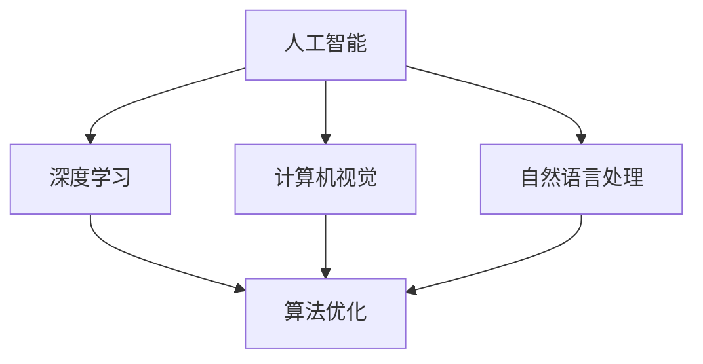
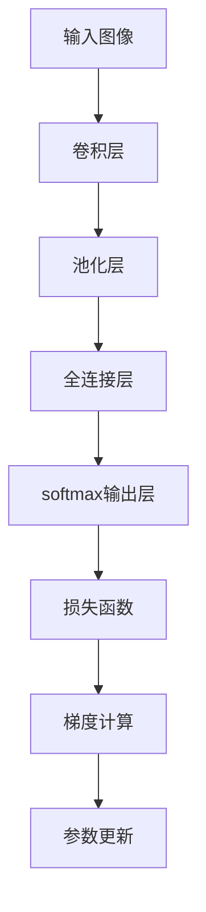

                 

# Andrej Karpathy：人工智能的未来发展挑战

> 关键词：人工智能, 未来发展, 技术挑战, 机器学习, 深度学习, 计算机视觉, 自然语言处理, 算法优化

## 1. 背景介绍

### 1.1 问题由来
Andrej Karpathy，作为人工智能领域的杰出专家，以其在计算机视觉和深度学习方面的深邃见解著称。在近期的公开演讲和文章中，Karpathy多次讨论了人工智能领域未来的发展方向及其面临的挑战。本文将深入探讨他关于人工智能未来发展的观点，并尝试梳理这些观点背后的技术基础和思想逻辑。

## 2. 核心概念与联系

### 2.1 核心概念概述

为更好地理解Andrej Karpathy的讨论，我们需要引入几个核心概念：

- **人工智能（Artificial Intelligence, AI）**：指通过计算机程序模拟人类智能，实现学习、推理、决策等认知能力的领域。
- **深度学习（Deep Learning, DL）**：利用多层神经网络进行复杂模式识别和特征学习，是当前人工智能领域的主流技术。
- **计算机视觉（Computer Vision, CV）**：研究如何让计算机理解和处理图像和视频数据的领域，包括对象识别、图像生成等。
- **自然语言处理（Natural Language Processing, NLP）**：研究如何让计算机理解和生成自然语言，包括文本分类、机器翻译等。
- **算法优化（Algorithm Optimization）**：通过改进算法性能、降低计算复杂度等方式提升AI系统的效率。

这些概念通过如下图示展示了彼此间的联系：



### 2.2 核心概念原理和架构的 Mermaid 流程图

在人工智能中，深度学习是实现复杂认知任务的核心技术。以计算机视觉为例，其架构可以如图展示：

```mermaid
graph TB
    A[图像输入] --> B[预处理]
    B --> C[卷积神经网络(CNN)]
    C --> D[池化层]
    D --> E[全连接层]
    E --> F[softmax输出层]
    F --> G[损失函数]
    G --> H[反向传播更新参数]
```

## 3. 核心算法原理 & 具体操作步骤

### 3.1 算法原理概述

Andrej Karpathy在讨论人工智能未来发展时，经常提及以下几个核心原理：

- **监督学习（Supervised Learning）**：使用标注数据训练模型，使其能够对新数据进行准确预测。
- **无监督学习（Unsupervised Learning）**：从无标注数据中发现潜在模式，广泛应用于数据预处理和特征提取。
- **强化学习（Reinforcement Learning）**：通过奖励机制引导模型做出最优决策，适用于复杂决策任务。

这些原理共同构成了现代AI技术的基石。Karpathy特别强调了深度学习在处理大规模数据和复杂任务中的优势，但同时也指出了其面临的计算资源消耗和模型可解释性等问题。

### 3.2 算法步骤详解

以监督学习为例，其操作步骤可以概括如下：

1. **数据准备**：收集和标注训练数据。
2. **模型选择**：选择合适的深度学习模型结构。
3. **模型训练**：使用标注数据训练模型，调整模型参数。
4. **模型评估**：在验证集上评估模型性能，调整超参数。
5. **模型部署**：将训练好的模型应用于实际问题中。

### 3.3 算法优缺点

深度学习的优点包括：
- 强大的表达能力，能够处理复杂的非线性关系。
- 通过大数据训练，模型性能显著提升。
- 自动化特征提取，减少人工干预。

缺点包括：
- 计算资源消耗巨大，需要高性能计算设备。
- 模型复杂，难以解释内部工作机制。
- 对标注数据依赖度高，缺乏普适性。

### 3.4 算法应用领域

深度学习已在计算机视觉、自然语言处理、语音识别等多个领域取得突破，推动了技术应用的发展。在实际应用中，深度学习算法广泛应用于自动驾驶、智能安防、智能客服等领域，展示了其强大的潜力。

## 4. 数学模型和公式 & 详细讲解 & 举例说明

### 4.1 数学模型构建

以神经网络为例，其数学模型可以表示为：

$$
y = \sigma(Wx + b)
$$

其中，$y$ 为输出结果，$x$ 为输入向量，$W$ 和 $b$ 为模型参数，$\sigma$ 为激活函数。

### 4.2 公式推导过程

以反向传播算法为例，其推导过程如下：

1. **前向传播**：计算模型输出 $y$。
2. **计算损失函数**：根据实际输出与期望输出，计算损失函数 $J$。
3. **反向传播**：计算梯度 $\nabla J$。
4. **参数更新**：根据梯度更新模型参数。

### 4.3 案例分析与讲解

以图像分类为例，可以如图展示反向传播过程：



## 5. 项目实践：代码实例和详细解释说明

### 5.1 开发环境搭建

搭建深度学习开发环境主要包括以下步骤：

1. **安装Python**：从官网下载并安装Python。
2. **安装深度学习框架**：选择TensorFlow、PyTorch等框架，并确保其版本兼容。
3. **安装相关库**：安装numpy、scipy、Pillow等常用库。
4. **安装GPU驱动和CUDA**：确保高性能计算设备支持。

### 5.2 源代码详细实现

以下是一个简单的图像分类模型实现，使用PyTorch框架：

```python
import torch
import torch.nn as nn
import torch.optim as optim

# 定义模型
class Net(nn.Module):
    def __init__(self):
        super(Net, self).__init__()
        self.conv1 = nn.Conv2d(3, 6, 5)
        self.pool = nn.MaxPool2d(2, 2)
        self.conv2 = nn.Conv2d(6, 16, 5)
        self.fc1 = nn.Linear(16 * 5 * 5, 120)
        self.fc2 = nn.Linear(120, 84)
        self.fc3 = nn.Linear(84, 10)

    def forward(self, x):
        x = self.pool(torch.relu(self.conv1(x)))
        x = self.pool(torch.relu(self.conv2(x)))
        x = x.view(-1, 16 * 5 * 5)
        x = torch.relu(self.fc1(x))
        x = torch.relu(self.fc2(x))
        x = self.fc3(x)
        return x

# 定义数据集
train_set = torchvision.datasets.CIFAR10(root='./data', train=True, download=True)
test_set = torchvision.datasets.CIFAR10(root='./data', train=False, download=True)

# 定义数据加载器
train_loader = torch.utils.data.DataLoader(train_set, batch_size=4, shuffle=True)
test_loader = torch.utils.data.DataLoader(test_set, batch_size=4, shuffle=False)

# 定义模型、损失函数和优化器
model = Net()
criterion = nn.CrossEntropyLoss()
optimizer = optim.SGD(model.parameters(), lr=0.001, momentum=0.9)

# 训练模型
for epoch in range(2):
    running_loss = 0.0
    for i, data in enumerate(train_loader, 0):
        inputs, labels = data
        optimizer.zero_grad()
        outputs = model(inputs)
        loss = criterion(outputs, labels)
        loss.backward()
        optimizer.step()

        running_loss += loss.item()
        if i % 2000 == 1999:  # 每2000个样本输出一次统计信息
            print('[%d, %5d] loss: %.3f' % (epoch + 1, i + 1, running_loss / 2000))
            running_loss = 0.0
print('Finished Training')
```

### 5.3 代码解读与分析

上述代码展示了使用PyTorch框架实现图像分类模型的基本流程：

- 定义模型结构，包含卷积层、池化层和全连接层。
- 定义数据集和数据加载器，支持批量处理数据。
- 定义损失函数和优化器，选择交叉熵损失和随机梯度下降。
- 训练模型，使用训练集进行前向传播和反向传播，优化模型参数。

## 6. 实际应用场景

### 6.1 自动驾驶

自动驾驶技术利用计算机视觉和深度学习算法，实现车辆的自主导航和决策。通过摄像头、激光雷达等传感器获取环境数据，模型能够识别道路标志、车辆、行人等对象，并做出驾驶决策。

### 6.2 智能安防

智能安防系统通过计算机视觉技术，对监控视频进行实时分析，检测异常行为和事件，如入侵、火灾等。利用深度学习算法，系统能够准确识别和报警。

### 6.3 智能客服

智能客服系统利用自然语言处理技术，通过对话机器人与用户进行交互，解答常见问题。深度学习模型能够理解自然语言，提供快速、准确的答复。

### 6.4 未来应用展望

未来，人工智能技术将在更多领域得到应用，如智能制造、智慧城市、医疗健康等。深度学习算法将在复杂决策和模式识别中发挥更大作用，推动技术进步和社会发展。

## 7. 工具和资源推荐

### 7.1 学习资源推荐

为了深入理解Andrej Karpathy的观点，以下是一些推荐的资源：

1. **《Deep Learning》**：Ian Goodfellow等人著，深入浅出地介绍了深度学习的基本概念和算法。
2. **《Reinforcement Learning: An Introduction》**：Richard S. Sutton等人著，介绍了强化学习的基本原理和算法。
3. **《CS231n: Convolutional Neural Networks for Visual Recognition》**：斯坦福大学课程，涵盖计算机视觉中的深度学习技术。
4. **《CS224n: Natural Language Processing with Deep Learning》**：斯坦福大学课程，涵盖自然语言处理中的深度学习技术。
5. **DeepLearning.ai**：由Andrew Ng教授领导的在线课程平台，提供深度学习和AI相关的课程。

### 7.2 开发工具推荐

为了提高开发效率，以下是一些推荐的工具：

1. **Jupyter Notebook**：交互式编程环境，支持代码、数据、文档的统一展示。
2. **TensorBoard**：可视化工具，可以实时监测模型训练和推理过程。
3. **PyTorch Lightning**：快速原型开发和实验追踪工具，适合快速迭代实验。
4. **TensorFlow Extended (TFX)**：端到端机器学习平台，支持数据处理、模型训练、部署等流程。

### 7.3 相关论文推荐

为了进一步学习Andrej Karpathy的观点，以下是一些推荐的论文：

1. **《Deep Residual Learning for Image Recognition》**：He等人，提出残差网络，解决了深度网络训练中的梯度消失问题。
2. **《Playing Atari with Deep Reinforcement Learning》**：Mnih等人，使用深度强化学习实现游戏AI，展示了其强大的决策能力。
3. **《Visual Geometry Albedo From Shadows》**：Ebenale等人，通过改进损失函数和数据增强，提升了深度学习模型在图像生成任务中的性能。
4. **《Attention Is All You Need》**：Vaswani等人，提出Transformer结构，解决了深度学习中序列建模的问题。

## 8. 总结：未来发展趋势与挑战

### 8.1 研究成果总结

Andrej Karpathy在讨论人工智能未来发展时，强调了以下几个方面：

1. **计算资源的演进**：计算能力的提升将使深度学习模型更加高效，降低对昂贵的计算资源依赖。
2. **算法的多样化**：未来的深度学习算法将更加多样化，以适应不同的任务和数据特点。
3. **模型的可解释性**：可解释性成为关键问题，研究如何通过简化模型和改进算法，提升模型的透明度。
4. **跨学科融合**：计算机视觉和自然语言处理等领域的交叉融合，将催生新的应用场景。
5. **伦理和社会责任**：AI技术的应用需考虑伦理和社会责任，避免技术滥用。

### 8.2 未来发展趋势

未来的AI技术将呈现以下几个趋势：

1. **计算性能提升**：硬件设备的演进，如GPU、TPU等，将显著提升深度学习模型的性能。
2. **算法优化**：深度学习算法的多样化和优化将使其更加灵活和高效。
3. **跨学科融合**：计算机视觉、自然语言处理等领域的交叉融合，将催生新的应用场景和算法。
4. **伦理和社会责任**：AI技术的伦理和社会责任问题将受到更多重视。
5. **数据驱动**：大数据驱动的AI模型将更加高效和准确。

### 8.3 面临的挑战

AI技术发展的同时，也面临以下挑战：

1. **计算资源消耗**：深度学习模型的计算资源消耗依然巨大，高性能计算设备价格高昂。
2. **模型可解释性**：复杂的深度学习模型难以解释其决策过程，影响模型的可信度和应用场景。
3. **数据隐私保护**：大规模数据采集和使用过程中，数据隐私保护问题日益突出。
4. **伦理和社会责任**：AI技术的应用需考虑伦理和社会责任，避免技术滥用。
5. **技术普及**：AI技术仍需进一步普及和推广，使其在更多领域得到应用。

### 8.4 研究展望

未来的AI研究将在以下几个方向取得突破：

1. **模型压缩和优化**：通过模型压缩和优化，提升深度学习模型的计算效率和可解释性。
2. **跨学科融合**：计算机视觉、自然语言处理等领域的交叉融合，将催生新的应用场景和算法。
3. **伦理和社会责任**：AI技术的伦理和社会责任问题需深入研究，确保技术应用的公平和透明。
4. **大数据驱动**：利用大数据驱动的AI模型，提升模型的准确性和泛化能力。

## 9. Andrej Karpathy对未来发展的展望与建议

Andrej Karpathy在讨论未来发展时，提出了以下几点建议：

1. **关注计算资源**：未来AI技术的发展离不开高性能计算设备的支持，需持续关注计算资源的发展。
2. **注重算法多样性**：未来的AI算法应更加多样化，以适应不同的任务和数据特点。
3. **提升模型可解释性**：通过简化模型和改进算法，提升模型的透明度和可解释性。
4. **推动跨学科融合**：计算机视觉、自然语言处理等领域的交叉融合，将催生新的应用场景和算法。
5. **关注伦理和社会责任**：AI技术的应用需考虑伦理和社会责任，确保技术应用的公平和透明。

作者：禅与计算机程序设计艺术 / Zen and the Art of Computer Programming

