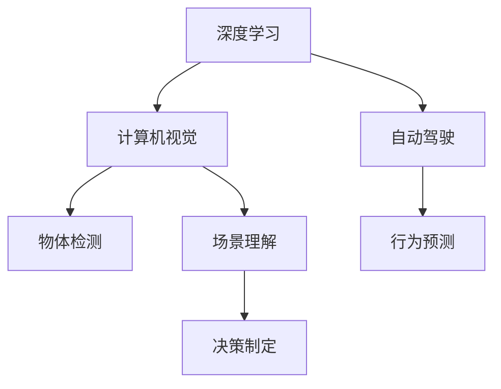

                 

# Andrej Karpathy：人工智能的未来发展挑战

## 1. 背景介绍

### 1.1 问题由来
安德烈·卡帕西（Andrej Karpathy）是计算机视觉领域的一代宗师，同时也是人工智能（AI）领域的先行者之一。他在深度学习、计算机视觉、自动驾驶等领域有丰富的研究和应用经验。卡帕西的博客、论文、讲座等资源深受业内人士的推崇。在这篇文章中，我们将回顾卡帕西的若干核心观点，探讨人工智能未来的发展挑战。

### 1.2 问题核心关键点
人工智能的未来发展面临着诸多挑战，包括但不限于数据隐私、伦理道德、计算资源、算法透明度等问题。这些挑战既涉及技术层面，也触及伦理和社会层面。卡帕西的看法深刻，从技术角度出发，同时也关注到人工智能对社会的影响。以下将从他的公开讨论中，摘取几个核心观点，进行详细分析。

## 2. 核心概念与联系

### 2.1 核心概念概述

卡帕西在多个场合强调了深度学习、计算机视觉和自动驾驶之间的关系。他认为，尽管这些领域的技术基础不尽相同，但它们都依赖于深度学习模型，因此有着密切的联系。具体来说：

- **深度学习（Deep Learning）**：一种利用多层神经网络进行复杂数据分析的机器学习方法。
- **计算机视觉（Computer Vision）**：通过让机器“看”和理解图像和视频，从而进行对象识别、场景理解等任务。
- **自动驾驶（Autonomous Driving）**：使车辆能够自主驾驶的技术，涉及环境感知、决策规划等多个维度。

这三个领域的交叉融合，使得卡帕西能够从计算机视觉的角度，探讨深度学习和自动驾驶的挑战。

### 2.2 核心概念原理和架构的 Mermaid 流程图



这个流程图展示了深度学习、计算机视觉和自动驾驶之间的核心联系。深度学习为计算机视觉和自动驾驶提供了基础算法；计算机视觉处理图像数据，为自动驾驶提供了视觉感知；自动驾驶则将计算机视觉和深度学习应用于驾驶决策，实现了无人驾驶的功能。

## 3. 核心算法原理 & 具体操作步骤

### 3.1 算法原理概述

卡帕西认为，深度学习的成功很大程度上依赖于大量的数据和强大的计算资源。在计算机视觉和自动驾驶等领域，这种依赖尤为明显。以下是一些关键观点：

- **数据的重要性**：高质量、大量标记的数据是深度学习模型性能的关键。例如，在自动驾驶中，需要大量标注的驾驶数据来训练模型，以便模型能够准确地理解和预测道路上的情况。
- **计算资源的需求**：深度学习模型通常需要高强度的计算资源来训练和推理。在自动驾驶中，这可能意味着需要专用的高性能GPU或TPU。

### 3.2 算法步骤详解

卡帕西在多个场合提到，深度学习的训练过程通常包括以下步骤：

1. **数据准备**：收集和标注数据，确保数据集的多样性和代表性。
2. **模型设计**：选择适当的神经网络结构和层数。
3. **模型训练**：使用深度学习框架（如TensorFlow、PyTorch）进行模型训练。
4. **模型评估**：在验证集上评估模型性能，调整超参数以优化模型。
5. **模型部署**：将模型部署到实际应用中，进行实时推理。

### 3.3 算法优缺点

深度学习的优点包括：

- **强大的泛化能力**：通过训练大量数据，模型可以学习到复杂的模式，并在新的数据上表现良好。
- **可扩展性**：深度学习模型可以通过增加更多的层和参数，进一步提升性能。

缺点则包括：

- **高计算需求**：训练深度学习模型需要大量的计算资源，对硬件要求较高。
- **数据依赖性强**：模型性能高度依赖于数据的质量和数量，获取高质量数据往往成本高昂。
- **黑盒特性**：深度学习模型通常被视为"黑盒"，难以解释其内部工作机制。

### 3.4 算法应用领域

深度学习在计算机视觉、自动驾驶、自然语言处理等领域有广泛的应用。以下是一个简单的示例：

**示例1：自动驾驶中的物体检测**

在自动驾驶中，物体检测是关键任务之一。深度学习模型，如卷积神经网络（CNN），可以通过大量的驾驶数据进行训练，学习到道路上的各种物体（如汽车、行人、自行车等）。训练好的模型可以实时检测到车辆周围的物体，为自动驾驶决策提供重要信息。

## 4. 数学模型和公式 & 详细讲解 & 举例说明

### 4.1 数学模型构建

卡帕西多次提到，深度学习模型通常包括一个或多个卷积层和全连接层。以下是一个典型的卷积神经网络（CNN）的结构：

```plaintext
输入层 -- Conv2D -- MaxPooling -- Flatten -- 全连接层 -- Softmax
```

其中，Conv2D表示卷积层，用于提取图像特征；MaxPooling表示池化层，用于降低特征维度；Flatten表示将多维特征展平，接入全连接层；Softmax用于分类预测。

### 4.2 公式推导过程

以物体检测为例，假设输入图像大小为$h\times w$，卷积核大小为$s\times s$，步幅为$k$，特征图大小为$C\times H\times W$。则卷积操作后的输出特征图大小为：

$$
H = \frac{h-s+2p}{s-k+1}, W = \frac{w-s+2p}{s-k+1}
$$

其中，$p$为填充值，$C$为卷积核数量。

### 4.3 案例分析与讲解

**示例2：自然语言处理中的语言模型**

语言模型是自然语言处理中的重要任务之一，用于预测文本的下一个单词或句子的概率。常见的语言模型包括基于LSTM和GRU的模型，以及基于Transformer的模型。以基于Transformer的语言模型为例，假设输入序列长度为$T$，模型输出单词的概率分布为$P_{pred}$，则目标函数可以表示为：

$$
\mathcal{L}(P_{pred}, y) = -\sum_{t=1}^{T} \log P_{pred}(y_t | y_{<t})
$$

其中，$y_t$表示序列中第$t$个单词，$P_{pred}$为模型预测的概率分布。

## 5. 项目实践：代码实例和详细解释说明

### 5.1 开发环境搭建

进行深度学习项目开发，首先需要搭建好开发环境。以下是常用的Python环境配置步骤：

1. 安装Python：从官网下载并安装Python 3.x版本。
2. 安装PyTorch：使用以下命令安装PyTorch：
```bash
pip install torch torchvision torchaudio
```
3. 安装TensorFlow：使用以下命令安装TensorFlow：
```bash
pip install tensorflow
```
4. 安装其他库：根据需要安装OpenCV、Pillow、NumPy等库。

### 5.2 源代码详细实现

以下是一个基于PyTorch的卷积神经网络（CNN）示例，用于物体检测任务：

```python
import torch
import torch.nn as nn
import torch.nn.functional as F
import torchvision.transforms as transforms
from torchvision import datasets, models

class Net(nn.Module):
    def __init__(self):
        super(Net, self).__init__()
        self.conv1 = nn.Conv2d(3, 6, 5)
        self.pool = nn.MaxPool2d(2, 2)
        self.conv2 = nn.Conv2d(6, 16, 5)
        self.fc1 = nn.Linear(16 * 5 * 5, 120)
        self.fc2 = nn.Linear(120, 84)
        self.fc3 = nn.Linear(84, 10)

    def forward(self, x):
        x = self.pool(F.relu(self.conv1(x)))
        x = self.pool(F.relu(self.conv2(x)))
        x = x.view(-1, 16 * 5 * 5)
        x = F.relu(self.fc1(x))
        x = F.relu(self.fc2(x))
        x = self.fc3(x)
        return x

net = Net()
```

### 5.3 代码解读与分析

以上代码定义了一个简单的CNN模型，包括两个卷积层和三个全连接层。模型的输入为三通道的图像数据，输出为10个类别的概率分布。在实际项目中，还需要进行数据预处理、模型训练和评估等操作。

## 6. 实际应用场景

### 6.1 智能城市中的计算机视觉应用

在智能城市中，计算机视觉技术被广泛应用于视频监控、交通管理等领域。例如，通过部署在交通路口的摄像头，计算机视觉系统可以实时分析交通情况，识别行人、车辆等目标，为交通管理提供数据支持。卡帕西认为，智能城市的建设需要大量高质量的计算机视觉数据，同时也需要强大的计算资源来处理这些数据。

### 6.2 医疗诊断中的深度学习应用

在医疗诊断中，深度学习模型被用于图像分析、病理诊断等多个方面。例如，通过训练深度学习模型，可以自动识别医学影像中的肿瘤、病变等。卡帕西指出，深度学习在医疗领域的应用，需要高精度的数据和强大的计算资源，同时也需要考虑伦理道德问题。

### 6.3 自动驾驶中的传感器融合

在自动驾驶中，传感器融合是一个关键问题。通过将多个传感器（如摄像头、雷达、激光雷达等）的数据进行融合，可以更全面地感知周围环境。深度学习模型可以用于处理传感器数据，提取特征，并用于决策规划。卡帕西认为，自动驾驶技术的发展需要解决传感器融合、高精度定位等多个问题。

## 7. 工具和资源推荐

### 7.1 学习资源推荐

为了帮助开发者系统掌握深度学习技术，以下是一些推荐的学习资源：

1. **《Deep Learning》书籍**：由Ian Goodfellow、Yoshua Bengio和Aaron Courville所著，全面介绍了深度学习的原理和应用。
2. **Coursera课程**：Coursera上有多门深度学习相关的课程，包括斯坦福大学的《Convolutional Neural Networks》课程。
3. **Fast.ai课程**：Fast.ai提供了免费的深度学习课程，涵盖计算机视觉、自然语言处理等多个方面。
4. **Google Deep Learning Tutorial**：Google提供的深度学习教程，包含多个实践项目，适合动手学习。

### 7.2 开发工具推荐

以下是一些常用的深度学习开发工具：

1. **PyTorch**：由Facebook开发的深度学习框架，支持动态计算图和静态计算图。
2. **TensorFlow**：由Google开发的深度学习框架，支持分布式计算和移动端部署。
3. **MXNet**：由Amazon开发的深度学习框架，支持多种语言和多种平台。
4. **Keras**：基于TensorFlow和Theano的高层API，简单易用，适合快速原型开发。

### 7.3 相关论文推荐

以下是几篇与深度学习相关的经典论文，推荐阅读：

1. **《ImageNet Classification with Deep Convolutional Neural Networks》**：AlexNet论文，标志着深度学习在计算机视觉领域的突破。
2. **《Playing Atari with Deep Reinforcement Learning》**：DeepMind的AlphaGo论文，展示了深度学习在强化学习中的应用。
3. **《Neural Machine Translation by Jointly Learning to Align and Translate》**：Google的神经机器翻译论文，展示了深度学习在自然语言处理中的应用。

## 8. 总结：未来发展趋势与挑战

### 8.1 研究成果总结

卡帕西在多个场合讨论了深度学习技术的发展趋势，以下是一些核心观点：

- **深度学习的广泛应用**：深度学习技术已经广泛应用于计算机视觉、自然语言处理、自动驾驶等多个领域。
- **计算资源的需求**：深度学习模型对计算资源的需求不断增长，未来需要更强大的硬件支持。
- **数据质量的重要性**：深度学习模型依赖于高质量的数据，获取高质量数据是提升模型性能的关键。

### 8.2 未来发展趋势

未来深度学习技术的发展趋势包括：

- **多模态学习**：深度学习模型将逐步支持多模态数据融合，处理文本、图像、语音等多种信息。
- **自监督学习**：通过利用数据本身的内在结构，自监督学习方法将有助于提升深度学习模型的泛化能力。
- **迁移学习**：通过迁移学习，深度学习模型可以更好地应用于不同的任务和场景。

### 8.3 面临的挑战

深度学习技术在发展过程中，面临着以下挑战：

- **计算资源瓶颈**：深度学习模型的计算需求不断增长，需要更强大的硬件支持。
- **数据获取困难**：高质量的数据获取成本高昂，数据质量直接影响模型性能。
- **算法透明性**：深度学习模型通常被视为"黑盒"，难以解释其内部工作机制。
- **伦理道德问题**：深度学习在应用过程中可能带来伦理和道德问题，如数据隐私、算法偏见等。

### 8.4 研究展望

未来的深度学习研究需要关注以下几个方向：

- **提升算法透明性**：通过可解释性技术，提高深度学习模型的透明性。
- **解决伦理道德问题**：通过引入伦理导向的评估指标，确保深度学习模型的公平性和安全性。
- **支持多模态学习**：开发能够处理多模态数据的深度学习模型，提升模型的表现力。

## 9. 附录：常见问题与解答

**Q1：如何优化深度学习模型的训练过程？**

A: 深度学习模型的训练过程可以通过以下方法进行优化：

1. **使用合适的优化器**：选择适合数据集和模型结构的优化器，如SGD、Adam等。
2. **学习率调度**：调整学习率以优化训练过程，可以使用warmup策略或自适应学习率调度方法。
3. **正则化**：通过L2正则化、Dropout等方法，避免过拟合。
4. **模型剪枝**：去除不必要的层和参数，减小模型尺寸。
5. **批量归一化**：通过批量归一化，加速训练过程并提高模型性能。

**Q2：深度学习模型如何进行迁移学习？**

A: 深度学习模型可以通过迁移学习进行迁移。以下是具体步骤：

1. **选择预训练模型**：选择适合的预训练模型，如ImageNet上的VGG、ResNet等。
2. **微调模型**：在预训练模型上微调，以适应特定任务。
3. **调整超参数**：根据任务特点调整超参数，如学习率、批次大小等。
4. **验证和测试**：在验证集和测试集上验证模型性能，并进行必要的调整。

**Q3：深度学习模型如何处理数据隐私问题？**

A: 深度学习模型可以通过以下方法处理数据隐私问题：

1. **数据匿名化**：通过对数据进行匿名化处理，保护用户隐私。
2. **联邦学习**：通过联邦学习技术，在多个设备上分散训练模型，保护数据隐私。
3. **差分隐私**：通过差分隐私技术，在保护隐私的前提下进行数据处理。

---

作者：禅与计算机程序设计艺术 / Zen and the Art of Computer Programming

