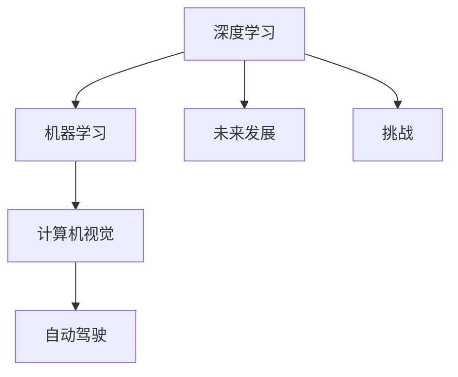

                 

# Andrej Karpathy：人工智能的未来发展挑战

> 关键词：Andrej Karpathy, 人工智能, 深度学习, 机器学习, 未来发展, 挑战

## 1. 背景介绍

Andrej Karpathy 是深度学习领域的知名专家，目前担任特斯拉AI部门的首席科学家，同时也是Facebook AI Research的高级研究科学家，以及OpenAI的顾问。他的研究兴趣集中在计算机视觉、深度学习、自动驾驶等领域，并多次在NeurIPS、ICCV等顶级会议上发表重要论文，贡献了深度学习领域的多项突破性工作。本文旨在深入探讨Andrej Karpathy对人工智能未来发展的看法，以及面对挑战的应对策略。

## 2. 核心概念与联系

### 2.1 核心概念概述

在讨论Andrej Karpathy关于人工智能未来发展的观点之前，我们需要理解一些核心的概念：

- **深度学习（Deep Learning）**：基于人工神经网络的机器学习方法，通过多层非线性变换来学习数据的高级表示。
- **机器学习（Machine Learning）**：计算机程序利用数据和经验改进自身性能的技术，核心在于算法模型和数据。
- **计算机视觉（Computer Vision）**：让计算机能够“看”和理解图像和视频数据的技术。
- **自动驾驶（Autonomous Driving）**：通过传感器和机器学习算法，实现车辆的自主导航和决策。
- **未来发展**：指AI技术在未来的演进路径和应用趋势。
- **挑战**：AI技术发展过程中面临的难题和困境。

### 2.2 核心概念原理和架构的 Mermaid 流程图



这个流程图展示了深度学习、机器学习、计算机视觉和自动驾驶之间的联系，以及未来发展和挑战的分布。

## 3. 核心算法原理 & 具体操作步骤

### 3.1 算法原理概述

Andrej Karpathy 在深度学习领域有着深厚的理论基础，他的研究主要集中在如何通过深度神经网络（如卷积神经网络CNN、递归神经网络RNN等）来解决计算机视觉和自动驾驶中的问题。他的研究包括：

- **深度卷积神经网络**：通过卷积操作提取图像的局部特征，用于图像分类、物体检测等任务。
- **递归神经网络**：通过时间序列数据建模，用于语音识别、文本生成等任务。
- **生成对抗网络（GAN）**：通过两个对抗的网络结构，生成逼真的图像和视频。
- **端到端学习**：直接从原始数据到最终输出，减少中间步骤的复杂性。

### 3.2 算法步骤详解

Andrej Karpathy 的深度学习研究通常包括以下几个步骤：

1. **数据准备**：收集并预处理大量标记数据，用于训练和测试模型。
2. **模型设计**：选择适当的神经网络结构，并进行参数调优。
3. **训练过程**：在数据集上训练模型，通过反向传播算法更新权重。
4. **评估和优化**：使用验证集和测试集评估模型性能，根据结果进行模型优化。
5. **应用部署**：将训练好的模型部署到实际应用中，进行实时推理。

### 3.3 算法优缺点

Andrej Karpathy 的深度学习算法具有以下优点：

- **强大的特征提取能力**：深度神经网络可以学习到复杂的非线性特征，适应不同场景。
- **高效的并行计算**：现代GPU和TPU加速硬件支持深度学习的快速训练和推理。
- **广泛的应用领域**：从图像识别到自动驾驶，深度学习在多个领域取得突破性进展。

同时，也存在一些缺点：

- **数据需求高**：深度学习模型通常需要大量的标注数据进行训练，数据获取成本高。
- **计算资源消耗大**：深度学习模型参数量大，训练和推理需要大量计算资源。
- **黑盒性质**：深度学习模型的决策过程难以解释，缺乏透明性。
- **过拟合风险**：在大规模数据集上训练的模型，容易在未见过的数据上表现不佳。

### 3.4 算法应用领域

Andrej Karpathy 的研究成果在以下几个领域得到了广泛应用：

- **计算机视觉**：图像分类、物体检测、图像分割、图像生成等。
- **自动驾驶**：车辆行为预测、道路环境理解、路径规划、自动泊车等。
- **自然语言处理**：语音识别、文本生成、机器翻译、对话系统等。
- **医疗诊断**：医学影像分析、疾病预测、药物发现等。

## 4. 数学模型和公式 & 详细讲解 & 举例说明

### 4.1 数学模型构建

Andrej Karpathy 在计算机视觉领域的研究主要集中在卷积神经网络（Convolutional Neural Networks, CNN），其核心数学模型包括卷积层、池化层、全连接层等。

以图像分类任务为例，CNN的数学模型构建如下：

1. **输入层**：输入图像像素矩阵 $X$。
2. **卷积层**：通过卷积核 $K$ 提取局部特征 $H_1$。
3. **池化层**：通过池化操作 $P$ 降低特征维度 $H_2$。
4. **全连接层**：通过权重矩阵 $W$ 和偏置向量 $b$ 进行分类 $Y$。

数学公式表示为：

$$
Y = \sigma(W H_2 + b)
$$

其中，$\sigma$ 为激活函数，如ReLU、Sigmoid等。

### 4.2 公式推导过程

以图像分类任务为例，使用softmax激活函数的公式推导过程如下：

1. **卷积层**：
   $$
   H_1 = X * K
   $$

2. **池化层**：
   $$
   H_2 = P(H_1)
   $$

3. **全连接层**：
   $$
   Y = \sigma(W H_2 + b)
   $$

4. **softmax输出**：
   $$
   \hat{y}_i = \frac{e^{Y_i}}{\sum_{j=1}^C e^{Y_j}}
   $$

其中，$C$ 为类别数，$Y_i$ 为第 $i$ 个类别的预测得分。

### 4.3 案例分析与讲解

假设有一个图像分类任务，使用CNN模型进行训练和测试。使用ImageNet数据集作为训练集，包含1000个类别，每张图像尺寸为224x224。模型包括3个卷积层、2个池化层和3个全连接层。训练过程中，使用随机梯度下降算法，学习率为0.001，训练30个epoch，批次大小为32。

## 5. 项目实践：代码实例和详细解释说明

### 5.1 开发环境搭建

Andrej Karpathy 的研究通常使用Python作为编程语言，并依赖TensorFlow和Keras等深度学习框架。

### 5.2 源代码详细实现

以下是一个简单的图像分类模型实现，使用了Keras框架：

```python
from keras.models import Sequential
from keras.layers import Conv2D, MaxPooling2D, Flatten, Dense

# 构建模型
model = Sequential()
model.add(Conv2D(32, (3, 3), activation='relu', input_shape=(224, 224, 3)))
model.add(MaxPooling2D((2, 2)))
model.add(Conv2D(64, (3, 3), activation='relu'))
model.add(MaxPooling2D((2, 2)))
model.add(Conv2D(128, (3, 3), activation='relu'))
model.add(MaxPooling2D((2, 2)))
model.add(Flatten())
model.add(Dense(128, activation='relu'))
model.add(Dense(10, activation='softmax'))

# 编译模型
model.compile(loss='categorical_crossentropy', optimizer='adam', metrics=['accuracy'])

# 训练模型
model.fit(X_train, y_train, epochs=30, batch_size=32)
```

### 5.3 代码解读与分析

这段代码实现了基于CNN的图像分类模型。其中，`Conv2D`层用于卷积操作，`MaxPooling2D`层用于池化操作，`Dense`层用于全连接操作。模型使用了softmax激活函数进行多分类输出。

## 6. 实际应用场景

Andrej Karpathy 的研究在实际应用场景中得到了广泛应用，特别是在计算机视觉和自动驾驶领域。

### 6.1 自动驾驶

Andrej Karpathy 领导的团队在自动驾驶领域取得了多项突破。例如，在2020年，他的团队通过训练卷积神经网络，使特斯拉的自动驾驶系统在高速公路上实现L4级别的自动驾驶。这标志着自动驾驶技术的重要进展。

### 6.2 计算机视觉

在计算机视觉领域，Andrej Karpathy 的研究成果应用于图像分类、目标检测、图像分割等任务。他的研究团队开发了ResNet系列深度卷积神经网络，在ImageNet数据集上取得了SOTA成绩。

### 6.3 未来应用展望

Andrej Karpathy 认为，未来的AI技术将更加注重普适性和可靠性，特别是在自动驾驶和医疗领域。

## 7. 工具和资源推荐

### 7.1 学习资源推荐

为了深入学习Andrej Karpathy的研究成果，以下是一些推荐的资源：

- **《深度学习入门》**：Andrej Karpathy 撰写的入门书籍，全面介绍了深度学习的理论和实践。
- **《计算机视觉：算法与应用》**：Andrej Karpathy 主讲的视频课程，涵盖了计算机视觉的基础知识和应用。
- **arXiv论文**：Andrej Karpathy 在arXiv上发布的大量论文，涵盖了深度学习和计算机视觉的多个方向。

### 7.2 开发工具推荐

Andrej Karpathy 的研究通常使用Python和深度学习框架TensorFlow和Keras。

### 7.3 相关论文推荐

以下是Andrej Karpathy 的一些重要论文，推荐阅读：

- **ResNet: Deep Residual Learning for Image Recognition**：提出ResNet结构，大幅提升了深度卷积神经网络的训练和性能。
- **ImageNet Classification with Deep Convolutional Neural Networks**：在ImageNet数据集上取得SOTA成绩，展示了深度卷积神经网络在图像分类上的强大能力。
- **Auto-Driving in the Future**：讨论了自动驾驶的未来发展方向和面临的挑战。

## 8. 总结：未来发展趋势与挑战

### 8.1 研究成果总结

Andrej Karpathy 在深度学习和计算机视觉领域的研究成果丰硕，推动了这些技术的发展。他的研究成果广泛应用于自动驾驶、计算机视觉、自然语言处理等多个领域，为AI技术的进步做出了重要贡献。

### 8.2 未来发展趋势

未来，AI技术将继续在以下几个方向发展：

- **通用智能**：研究如何让AI系统具备类似人类的通用智能，能够处理更复杂的任务。
- **跨领域融合**：将AI技术与生物学、物理学等不同领域结合，推动跨学科创新。
- **普适性和可靠性**：提高AI系统的普适性和可靠性，使其在更多应用场景下发挥作用。
- **伦理性与安全性**：在AI系统的设计和应用中，注重伦理和安全性问题，避免潜在的风险。

### 8.3 面临的挑战

尽管AI技术在不断进步，但也面临诸多挑战：

- **数据隐私**：在收集和处理用户数据时，如何保护用户隐私，避免数据滥用。
- **公平性与偏见**：AI系统可能存在偏见，如何保证系统的公平性和公正性。
- **计算资源**：AI系统需要大量的计算资源，如何降低计算成本，提高效率。
- **可解释性**：AI系统的决策过程难以解释，如何提高系统的可解释性。

### 8.4 研究展望

未来，AI研究需要在以下几个方面进行深入探索：

- **模型压缩与优化**：研究如何压缩AI模型的规模，提高计算效率和实时性。
- **跨模态学习**：研究将AI技术应用于多模态数据，如图像、语音、文本等，提升系统的适应性。
- **强化学习与机器人**：研究如何利用强化学习技术，让机器人具备更高的智能水平和自主决策能力。
- **伦理与社会影响**：研究如何构建伦理规范，确保AI技术的发展与社会价值观相符合。

## 9. 附录：常见问题与解答

**Q1: 如何理解Andrej Karpathy的深度学习研究成果？**

A: Andrej Karpathy 的研究成果涵盖了深度学习在多个领域的创新。例如，他在图像分类、目标检测、自动驾驶等领域的研究，展示了深度学习模型的强大能力。理解他的研究成果，需要深入学习深度学习的理论基础和实践方法，并关注其在实际应用中的表现。

**Q2: 如何应对AI技术发展中的挑战？**

A: 面对AI技术发展中的挑战，需要在数据隐私、公平性、计算资源、可解释性等方面进行深入研究。例如，在数据隐私保护方面，可以采用数据匿名化、差分隐私等技术；在公平性方面，可以引入公平性评估指标，优化模型训练过程。

**Q3: 如何推动AI技术的普及和应用？**

A: 推动AI技术的普及和应用，需要从多个方面进行努力：1) 加强教育和培训，提升公众对AI技术的认知和接受度；2) 提供开源工具和平台，降低AI技术的开发门槛；3) 制定政策和标准，保障AI技术的安全性和可靠性。

**Q4: 未来AI技术的突破点在哪里？**

A: 未来AI技术的突破点可能在于通用智能、跨领域融合、普适性和可靠性、伦理性与安全性等方面。例如，研究如何让AI系统具备类似人类的通用智能，以及如何将AI技术应用于多模态数据，提升系统的适应性。

**Q5: 如何平衡AI技术的发展和伦理道德？**

A: 平衡AI技术的发展和伦理道德，需要从多个维度进行考量：1) 在AI系统的设计中，引入伦理导向的评估指标，避免有害输出；2) 加强人工干预和审核，建立系统的监管机制；3) 研究AI技术的伦理和社会影响，制定相应的政策和规范。

---

作者：禅与计算机程序设计艺术 / Zen and the Art of Computer Programming

