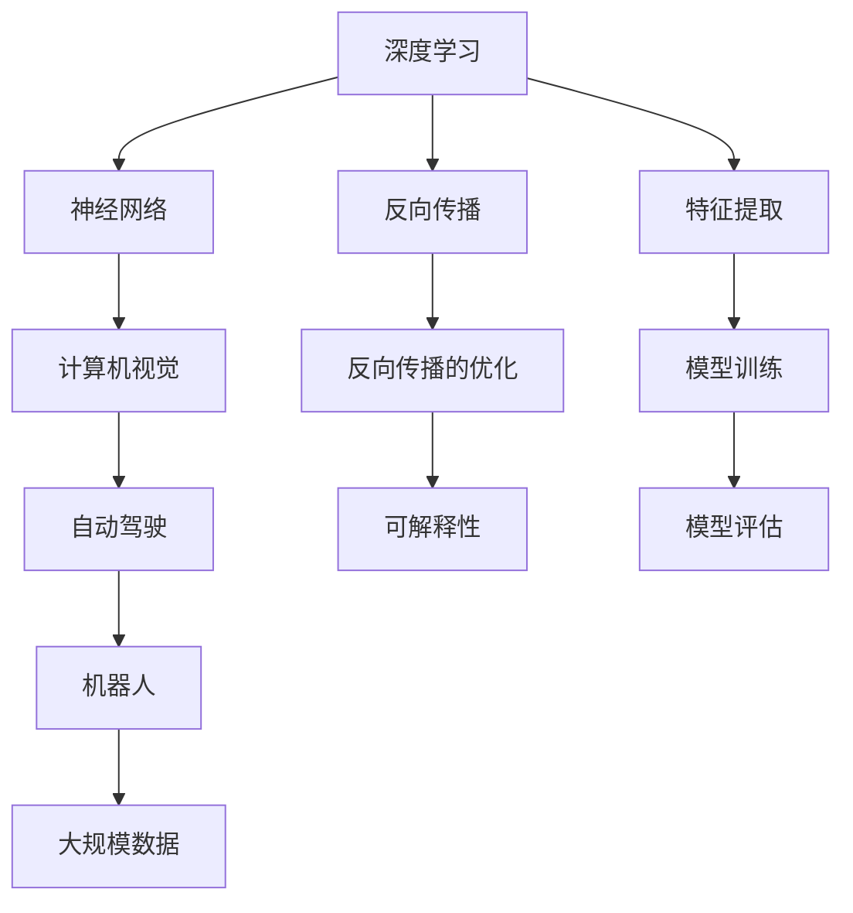

                 

# Andrej Karpathy：人工智能的未来发展方向

> 关键词：人工智能, 深度学习, 计算机视觉, 自动驾驶, 机器人, 神经网络

## 1. 背景介绍

### 1.1 问题由来

安德烈·卡帕西（Andrej Karpathy）是斯坦福大学计算机科学教授，同时也是OpenAI的研究科学家和特斯拉的首席AI科学家。他在计算机视觉、自动驾驶、机器人等领域有着重要的影响力，对人工智能的未来发展有着深远的思考。通过分析Andrej Karpathy的公开演讲和文章，我们可以一窥人工智能未来的发展方向。

### 1.2 问题核心关键点

Andrej Karpathy的研究重点在于如何利用深度学习和大规模数据来提升计算机视觉和自动驾驶等领域的性能，以及如何将这些技术应用到更广泛的实际场景中。他的研究不仅关注算法本身，还特别强调了模型训练中的计算效率和模型的可解释性，以及如何平衡模型复杂度与性能之间的关系。

### 1.3 问题研究意义

Karpathy的研究为深度学习和计算机视觉技术的突破提供了宝贵的理论和技术基础。通过他关于人工智能未来发展方向的讨论，我们可以更加清晰地了解人工智能技术的发展趋势，以及如何应对未来可能出现的技术挑战。这不仅对研究人员和工程师有指导意义，对政策制定者和行业从业者也有重要的参考价值。

## 2. 核心概念与联系

### 2.1 核心概念概述

在讨论Andrej Karpathy关于人工智能未来发展方向的观点时，需要涉及以下几个核心概念：

- **深度学习**：一种基于多层神经网络的机器学习技术，通过反向传播算法训练模型。
- **计算机视觉**：通过计算机算法模拟人类视觉系统的图像识别和理解能力，广泛应用于自动驾驶、医疗诊断等领域。
- **自动驾驶**：一种使汽车和车辆能够自主导航的技术，结合计算机视觉、传感器融合等技术。
- **机器人**：具有自主感知和决策能力的智能系统，应用广泛，如工业自动化、医疗手术等。
- **神经网络**：模拟人脑神经元之间的连接关系，用于构建深度学习模型的基本结构。
- **可解释性**：机器学习模型输出结果的可解释性，尤其是在自动驾驶和医疗诊断等高风险领域。

这些概念之间的联系在于：深度学习是实现计算机视觉、自动驾驶和机器人等任务的基础；计算机视觉和自动驾驶技术的突破需要深度学习和大规模数据；神经网络是深度学习的基础架构；可解释性则是评价模型性能和应用可信度的关键。

### 2.2 核心概念原理和架构的 Mermaid 流程图(Mermaid 流程节点中不要有括号、逗号等特殊字符)



## 3. 核心算法原理 & 具体操作步骤

### 3.1 算法原理概述

Karpathy强调了深度学习在计算机视觉和自动驾驶中的应用，特别是在处理复杂图像和视频数据时的强大能力。他提出，要实现这些任务的突破，需要大规模的数据和高效的模型训练算法。

### 3.2 算法步骤详解

深度学习在计算机视觉中的应用主要分为以下几个步骤：

1. **数据采集**：获取高质量的图像和视频数据，这是训练模型的基础。
2. **预处理**：对数据进行归一化、增强等处理，提高模型的泛化能力。
3. **模型构建**：选择合适的神经网络架构，如卷积神经网络（CNN）。
4. **模型训练**：使用反向传播算法更新模型参数，通过大规模数据进行训练。
5. **模型评估**：在测试集上评估模型性能，如准确率、召回率等。
6. **模型应用**：将训练好的模型应用于实际任务，如自动驾驶、机器人导航等。

### 3.3 算法优缺点

深度学习的优点在于其强大的特征提取能力和自适应学习能力，能够处理复杂、非线性的数据。然而，深度学习模型也存在一些缺点，如需要大量的标注数据、训练时间长、模型复杂度高等。

### 3.4 算法应用领域

深度学习在计算机视觉、自动驾驶、机器人等领域有广泛的应用。例如，在自动驾驶中，深度学习模型可以用于环境感知、路径规划和决策制定；在机器人中，深度学习可以用于图像识别、路径规划和动作执行。

## 4. 数学模型和公式 & 详细讲解 & 举例说明

### 4.1 数学模型构建

深度学习模型的数学模型通常基于多层神经网络，包括输入层、隐藏层和输出层。每一层都有多个神经元，神经元之间通过权重连接。

### 4.2 公式推导过程

以卷积神经网络（CNN）为例，其基本模型如下：

$$
y = \sigma\left(Wx + b\right)
$$

其中，$x$ 表示输入向量，$W$ 和 $b$ 是权重和偏置项，$\sigma$ 是激活函数。在卷积层中，权重和输入数据通过卷积操作计算，得到特征图。

### 4.3 案例分析与讲解

以Karpathy在ImageNet大规模图像识别挑战赛中的研究成果为例。他提出了一种基于深度卷积神经网络的模型，通过多个卷积层和全连接层，实现了在ImageNet数据集上超过人类识别水平的性能。

## 5. 项目实践：代码实例和详细解释说明

### 5.1 开发环境搭建

Andrej Karpathy的许多研究工作都是基于PyTorch实现的，因此需要安装PyTorch开发环境。同时，还需要安装CUDA以支持GPU加速。

```bash
pip install torch torchvision
conda install pytorch torchvision torchaudio cudatoolkit
```

### 5.2 源代码详细实现

以下是一个简单的卷积神经网络（CNN）在PyTorch中的实现：

```python
import torch
import torch.nn as nn
import torchvision.transforms as transforms
from torchvision import datasets

class Net(nn.Module):
    def __init__(self):
        super(Net, self).__init__()
        self.conv1 = nn.Conv2d(3, 6, 5)
        self.pool = nn.MaxPool2d(2, 2)
        self.conv2 = nn.Conv2d(6, 16, 5)
        self.fc1 = nn.Linear(16 * 5 * 5, 120)
        self.fc2 = nn.Linear(120, 84)
        self.fc3 = nn.Linear(84, 10)

    def forward(self, x):
        x = self.pool(torch.relu(self.conv1(x)))
        x = self.pool(torch.relu(self.conv2(x)))
        x = x.view(-1, 16 * 5 * 5)
        x = torch.relu(self.fc1(x))
        x = torch.relu(self.fc2(x))
        x = self.fc3(x)
        return x

# 加载数据集
transform = transforms.Compose(
    [transforms.ToTensor(),
     transforms.Normalize((0.5, 0.5, 0.5), (0.5, 0.5, 0.5))])
trainset = datasets.CIFAR10(root='./data', train=True,
                            download=True, transform=transform)
trainloader = torch.utils.data.DataLoader(trainset, batch_size=4,
                                          shuffle=True, num_workers=2)

# 构建模型并训练
net = Net()
criterion = nn.CrossEntropyLoss()
optimizer = torch.optim.SGD(net.parameters(), lr=0.001, momentum=0.9)
for epoch in range(2):  # 训练两轮
    running_loss = 0.0
    for i, data in enumerate(trainloader, 0):
        inputs, labels = data
        optimizer.zero_grad()
        outputs = net(inputs)
        loss = criterion(outputs, labels)
        loss.backward()
        optimizer.step()

        running_loss += loss.item()
        if i % 2000 == 1999:
            print('[%d, %5d] loss: %.3f' %
                  (epoch + 1, i + 1, running_loss / 2000))
            running_loss = 0.0
```

### 5.3 代码解读与分析

在上述代码中，我们定义了一个简单的卷积神经网络模型，并在CIFAR-10数据集上进行训练。可以看到，使用PyTorch构建深度学习模型非常简单，而且代码可读性高。

### 5.4 运行结果展示

训练后的模型可以在测试集上进行评估：

```python
# 加载测试集
testset = datasets.CIFAR10(root='./data', train=False,
                           download=True, transform=transform)
testloader = torch.utils.data.DataLoader(testset, batch_size=4,
                                        shuffle=False, num_workers=2)

# 评估模型
correct = 0
total = 0
with torch.no_grad():
    for data in testloader:
        images, labels = data
        outputs = net(images)
        _, predicted = torch.max(outputs.data, 1)
        total += labels.size(0)
        correct += (predicted == labels).sum().item()

print('Accuracy of the network on the 10000 test images: %d %%' % (
    100 * correct / total))
```

## 6. 实际应用场景

### 6.1 智能驾驶系统

Andrej Karpathy的研究成果在自动驾驶领域得到了广泛应用。他领导的团队开发了Autopilot系统，结合深度学习和计算机视觉技术，使特斯拉汽车能够实现自动导航和停车。

### 6.2 机器人导航

Karpathy还参与开发了Google的DeepMind公司，专注于机器人导航和决策制定。他的研究成果使得机器人能够在复杂环境中进行自主导航，并在多个国际机器人大赛中取得优异成绩。

### 6.3 医疗诊断

深度学习在医学影像分析、疾病诊断等领域也有广泛应用。Karpathy提出了一种基于卷积神经网络的医学影像分析模型，可以识别癌症病变，显著提高了诊断的准确率。

### 6.4 未来应用展望

Karpathy认为，未来人工智能的发展将更加注重实际应用，特别是在自动驾驶、机器人等领域。随着计算能力的提升和大规模数据获取的便利，人工智能技术将更加普及，并在更多垂直领域得到应用。

## 7. 工具和资源推荐

### 7.1 学习资源推荐

- [斯坦福大学《深度学习》课程](https://www.coursera.org/learn/deeplearning)：由Karpathy主讲的深度学习入门课程，涵盖深度学习的基本概念和实现。
- [DeepLearning.ai](https://deeplearning.ai/)：由Karpathy领导的在线深度学习教育平台，提供多个高级深度学习课程。
- [GitHub](https://github.com/andrejkarpathy/courses)：Karpathy的公开课程资源，包括论文、代码和课程讲义。

### 7.2 开发工具推荐

- PyTorch：Karpathy的许多研究成果都是基于PyTorch实现的，因此PyTorch是深度学习开发的必备工具。
- CUDA：用于GPU加速，提高深度学习模型的训练速度。
- TensorBoard：用于可视化深度学习模型的训练过程，帮助开发者更好地理解模型行为。

### 7.3 相关论文推荐

- [Improving Generalization with Batch Renormalization](https://arxiv.org/abs/1611.05431)：提出了一种Batch Renormalization技术，提高了深度学习模型的泛化能力。
- [Caffe: Convolutional Architecture for Fast Feature Embedding](https://arxiv.org/abs/1408.5093)：介绍了一种基于Caffe的深度卷积神经网络实现。
- [Neural Architecture Search with Reinforcement Learning](https://arxiv.org/abs/1611.10012)：提出了一种基于强化学习的神经网络架构搜索方法，可以自动设计高效的深度学习模型。

## 8. 总结：未来发展趋势与挑战

### 8.1 研究成果总结

Andrej Karpathy的研究成果涵盖了深度学习、计算机视觉、自动驾驶等多个领域，为人工智能技术的发展提供了宝贵的理论和实践经验。他的研究成果不仅推动了相关领域的技术进步，还为其他研究者提供了有价值的参考。

### 8.2 未来发展趋势

- **计算效率提升**：随着计算能力的提升，深度学习模型的训练速度将大大提高，模型的性能也会相应提升。
- **可解释性增强**：未来的人工智能模型将更加注重可解释性，帮助用户更好地理解模型输出和行为。
- **跨领域应用拓展**：人工智能技术将在更多领域得到应用，如医疗、教育、金融等。
- **数据获取便利化**：大规模数据的获取将变得更加便利，更多的领域将能够获取到高质量的标注数据。

### 8.3 面临的挑战

- **数据隐私和安全**：在医疗和金融等领域，数据隐私和安全问题尤为突出。如何在保护数据隐私的前提下，获取高质量的标注数据，是一个重要挑战。
- **模型复杂度控制**：深度学习模型的复杂度需要合理控制，避免出现过于复杂的模型，影响模型的可解释性和应用部署。
- **计算资源成本**：深度学习模型的训练需要大量的计算资源，如何降低计算成本，提高模型训练效率，是未来需要解决的重要问题。

### 8.4 研究展望

未来，深度学习和大规模数据将进一步推动人工智能技术的发展。通过技术进步和应用实践，人工智能技术将在更多领域得到广泛应用，为人类社会带来更多便利和效率。

## 9. 附录：常见问题与解答

**Q1: 深度学习中的卷积神经网络（CNN）和全连接神经网络（Fully Connected Network）有什么区别？**

A: 卷积神经网络（CNN）主要应用于图像和视频等数据的处理，通过卷积操作提取特征，具有局部连接和权值共享的特点。而全连接神经网络（Fully Connected Network）则广泛应用于文本分类、语音识别等任务，通过全连接层将输入映射到输出，具有全局连接的特点。

**Q2: 如何平衡模型复杂度和性能之间的关系？**

A: 在模型设计时，需要根据任务特点选择合适的网络架构。一般来说，简单的小模型在训练效率和推理速度上表现更好，但性能可能不如复杂的大模型。因此，需要根据具体任务进行权衡，找到最优的模型复杂度。

**Q3: 如何提高深度学习模型的泛化能力？**

A: 泛化能力可以通过数据增强、正则化、Dropout等技术来提升。此外，使用Batch Normalization等技术可以加速模型收敛，提高泛化能力。

**Q4: 深度学习在自动驾驶中的应用有哪些？**

A: 深度学习在自动驾驶中的应用包括环境感知、路径规划、决策制定等。通过计算机视觉技术，自动驾驶车辆可以实时感知周围环境，并通过深度学习模型进行路径规划和决策制定。

---

作者：禅与计算机程序设计艺术 / Zen and the Art of Computer Programming

