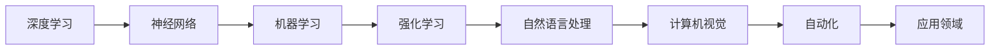

                 

# Andrej Karpathy：人工智能的未来发展方向

> 关键词：人工智能,深度学习,机器学习,未来发展方向,深度强化学习,神经网络,计算机视觉,自然语言处理,自动化

## 1. 背景介绍

### 1.1 问题由来

安德烈·卡帕西（Andrej Karpathy），斯坦福大学计算机科学系教授，人工智能与机器学习领域的领军人物，他在深度学习、自动驾驶、计算机视觉等领域的研究工作影响了整个AI界。近期，他在斯坦福大学的在线课程《人工智能的现状与未来》（"Status and Future Directions in AI"）中，分享了自己对人工智能未来发展方向的看法。本博客将详细解读卡帕西教授的演讲要点，为广大人工智能爱好者提供深度、有思考、有见解的专业IT领域技术探讨。

### 1.2 问题核心关键点

卡帕西教授的演讲涵盖了人工智能的多个重要领域，包括深度学习、机器学习、神经网络、计算机视觉、自然语言处理、自动化等，并且对未来发展的趋势和挑战进行了深度剖析。其核心关键点包括：

- 深度强化学习的突破
- 神经网络的多样化和规模化
- 计算机视觉的新进展
- 自然语言处理的发展
- 自动化的未来
- 人工智能的伦理和安全问题

这些核心点将帮助我们理解人工智能未来的发展方向，并洞察相关技术和应用的可能趋势。

### 1.3 问题研究意义

本博客旨在：
- 深入理解安德烈·卡帕西教授对人工智能未来发展的观点。
- 掌握深度学习、强化学习、计算机视觉、自然语言处理等前沿技术的最新动态。
- 探讨人工智能技术在实际应用中的前景和挑战。
- 为AI技术开发者和研究者提供参考和借鉴。

## 2. 核心概念与联系

### 2.1 核心概念概述

为更好地理解安德烈·卡帕西教授的演讲内容，本节将介绍其演讲中涉及的一些核心概念：

- **深度学习**：一种基于多层神经网络的机器学习技术，通过一系列非线性变换从原始数据中提取特征。
- **强化学习**：通过试错反馈机制优化模型参数的一种机器学习技术，常用于决策问题的求解。
- **神经网络**：一种由多个节点和连接组成的网络结构，用于模拟生物神经元的信息处理。
- **计算机视觉**：研究如何让计算机从图像或视频中提取、处理和理解视觉信息的领域。
- **自然语言处理**：使计算机能够理解和生成自然语言的领域。
- **自动化**：通过使用AI技术，使机器或系统能够自主完成任务。

这些核心概念之间通过互动和协同，共同推动了人工智能技术的发展。

### 2.2 核心概念原理和架构的 Mermaid 流程图



这个Mermaid流程图展示了这些核心概念之间的相互联系：深度学习通过神经网络结构进行特征提取，机器学习提供模型训练方法，强化学习用于优化模型参数，自然语言处理使计算机能够处理和生成自然语言，计算机视觉处理视觉信息，自动化则应用这些技术来解决实际问题。

## 3. 核心算法原理 & 具体操作步骤

### 3.1 算法原理概述

安德烈·卡帕西教授在演讲中详细讨论了深度强化学习的原理。深度强化学习结合了深度学习和强化学习的优势，利用神经网络进行状态表示，通过强化学习的机制进行学习决策。其核心思想是通过智能体（agent）在一个动态环境中与环境的交互，优化决策策略以最大化预期回报。

深度强化学习的基本流程如下：
1. 观察环境，获取状态表示。
2. 使用神经网络（如DQN、PPO等）选择动作。
3. 执行动作，观察新状态，获得奖励。
4. 根据奖励和状态信息更新神经网络参数。

### 3.2 算法步骤详解

下面以DQN算法为例，详细介绍深度强化学习的具体步骤：

**步骤1：数据采集与环境交互**

在DQN中，智能体与环境进行交互，收集状态和动作数据。例如，在一个简单的迷宫中，智能体可以不断尝试不同路径，收集每一个状态和对应的奖励。

**步骤2：状态编码**

状态通常需要编码成神经网络可以处理的数值形式。例如，在迷宫中，状态可以是当前位置和周围环境的表示。

**步骤3：动作选择**

使用神经网络模型选择下一个动作。在DQN中，使用一个卷积神经网络（CNN）对状态进行特征提取，并将提取的特征输入到一个全连接层进行动作选择。

**步骤4：动作执行与状态更新**

执行选择的动作，观察新状态，并获取环境反馈（奖励或惩罚）。

**步骤5：参数更新**

使用经验回放（Experience Replay）技术，从存储的过去经验中随机抽取数据，更新神经网络参数，优化预测和选择的准确性。

**步骤6：重复迭代**

重复以上步骤，直到智能体能够在环境中达到满意的性能。

### 3.3 算法优缺点

**优点**：
- **自适应性强**：深度强化学习能够处理高维度、非线性的决策问题。
- **学习能力强大**：通过不断试错和调整，能够逐步优化决策策略。
- **泛化能力强**：通过经验回放和目标网络等技术，能够较好地应对新环境和新任务。

**缺点**：
- **计算复杂度高**：深度强化学习需要大量的计算资源和时间进行模型训练和优化。
- **数据依赖性强**：需要足够多的经验数据进行训练，且对数据质量要求较高。
- **可解释性差**：模型决策过程难以解释，缺乏透明性。

### 3.4 算法应用领域

安德烈·卡帕西教授指出，深度强化学习在多个领域都有广泛应用，包括自动驾驶、机器人控制、游戏AI、金融交易等。特别是在自动驾驶领域，深度强化学习已经展示出令人瞩目的成果，能够自主驾驶汽车，实现复杂的交通场景导航。

## 4. 数学模型和公式 & 详细讲解 & 举例说明

### 4.1 数学模型构建

深度强化学习模型通常由以下几个部分组成：

- **环境模型**：描述环境的状态转移和奖励函数。
- **智能体模型**：使用神经网络表示状态和动作映射。
- **优化目标**：最大化长期累计奖励。

下面以Q-learning算法为例，展示数学模型的构建过程：

**状态转移概率**：
$$ P(s_{t+1}|s_t,a_t) $$

**奖励函数**：
$$ r_{t+1} $$

**价值函数**：
$$ V(s_t) $$

**动作选择策略**：
$$ \pi(a_t|s_t) $$

**最优价值函数**：
$$ Q^\star(s_t,a_t) = r_{t+1} + \gamma V^\star(s_{t+1}) $$

其中，$\gamma$ 是折扣因子，控制未来奖励的重要性。

### 4.2 公式推导过程

以Q-learning算法为例，其更新公式为：
$$ Q(s_t,a_t) \leftarrow Q(s_t,a_t) + \alpha(r_t + \gamma \max_{a'} Q(s_{t+1},a') - Q(s_t,a_t)) $$

其中，$\alpha$ 是学习率。

**推导过程**：
1. 将目标价值函数代入Q值计算公式，得到Q-learning的目标函数。
2. 将目标函数展开，并代入状态转移概率和奖励函数。
3. 利用动作选择策略，将最大化操作转移到Q值计算中。
4. 最后，使用经验回放和目标网络等技术进行模型更新。

### 4.3 案例分析与讲解

在自动驾驶领域，使用深度强化学习的智能体模型，可以不断从驾驶数据中学习，优化决策策略。例如，可以使用Q-learning算法训练模型，使其在特定驾驶场景中做出最优动作，如加速、减速、转向等。

## 5. 项目实践：代码实例和详细解释说明

### 5.1 开发环境搭建

要进行深度强化学习的项目实践，需要搭建Python开发环境，并安装必要的库：

1. 安装Anaconda：
```bash
conda install anaconda
```

2. 创建虚拟环境：
```bash
conda create -n deep_reinforcement_learning python=3.7
conda activate deep_reinforcement_learning
```

3. 安装深度学习库：
```bash
conda install tensorflow-gpu
conda install pytorch-gpu
```

4. 安装强化学习库：
```bash
conda install gym
conda install pybullet
```

5. 安装可视化库：
```bash
conda install tensorboard
```

### 5.2 源代码详细实现

下面以DQN算法为例，给出Python代码实现：

```python
import gym
import tensorflow as tf
import numpy as np

# 创建环境
env = gym.make('CartPole-v0')

# 定义神经网络模型
class DQNModel(tf.keras.Model):
    def __init__(self, state_dim, action_dim):
        super(DQNModel, self).__init__()
        self.fc1 = tf.keras.layers.Dense(256, activation='relu')
        self.fc2 = tf.keras.layers.Dense(256, activation='relu')
        self.fc3 = tf.keras.layers.Dense(action_dim)

    def call(self, inputs):
        x = self.fc1(inputs)
        x = self.fc2(x)
        return self.fc3(x)

# 定义智能体模型
class DQNAgent:
    def __init__(self, state_dim, action_dim, learning_rate=0.01, discount_factor=0.99):
        self.model = DQNModel(state_dim, action_dim)
        self.learning_rate = learning_rate
        self.discount_factor = discount_factor
        self.memory = []

    def act(self, state):
        state = np.expand_dims(state, axis=0)
        q_values = self.model.predict(state)
        action = np.argmax(q_values)
        return action, q_values

    def replay(self, batch_size):
        # 从记忆中随机抽取数据
        batch = np.random.choice(len(self.memory), batch_size)
        states = np.array([self.memory[i][0] for i in batch])
        actions = np.array([self.memory[i][1] for i in batch])
        rewards = np.array([self.memory[i][2] for i in batch])
        next_states = np.array([self.memory[i][3] for i in batch])
        q_values_next = self.model.predict(next_states)

        # 计算目标q值
        q_values = []
        for reward, next_q_value in zip(rewards, q_values_next):
            q_values.append(reward + self.discount_factor * np.max(next_q_value))

        # 更新模型参数
        with tf.GradientTape() as tape:
            q_values_predicted = self.model.predict(states)
            loss = tf.reduce_mean(tf.square(q_values_predicted - q_values))
        grads = tape.gradient(loss, self.model.trainable_variables)
        self.model.optimizer.apply_gradients(zip(grads, self.model.trainable_variables))

    def remember(self, state, action, reward, next_state, done):
        self.memory.append((state, action, reward, next_state, done))
        if len(self.memory) > 10000:
            self.memory = self.memory[-10000:]

# 初始化智能体和模型
state_dim = env.observation_space.shape[0]
action_dim = env.action_space.n
agent = DQNAgent(state_dim, action_dim)
model = agent.model

# 定义优化器
optimizer = tf.keras.optimizers.Adam(learning_rate=agent.learning_rate)

# 训练过程
def train_episode():
    state = env.reset()
    done = False
    while not done:
        action, q_values = agent.act(state)
        next_state, reward, done, _ = env.step(action)
        agent.replay(32)
        state = next_state
```

### 5.3 代码解读与分析

**DQNModel类**：
- 定义了一个简单的神经网络模型，包含三个全连接层，用于状态表示和动作选择的映射。
- 使用Keras框架实现，便于模型构建和训练。

**DQNAgent类**：
- 封装了智能体的主要功能，包括动作选择和经验回放。
- 使用TensorFlow作为计算图后端，进行模型训练和优化。

**train_episode函数**：
- 定义了一个训练函数，使用Q-learning算法进行模型训练。
- 不断与环境交互，更新智能体参数，直到训练完成。

## 6. 实际应用场景

### 6.1 自动驾驶

自动驾驶是深度强化学习的重要应用场景之一。通过深度强化学习，智能体可以在复杂的城市交通环境中自主驾驶汽车，实现无人驾驶。

**应用方式**：
1. 智能体使用摄像头和传感器获取环境信息，将信息编码成状态。
2. 智能体根据当前状态和历史经验，选择最优动作。
3. 智能体执行动作，观察新状态，获取奖励和惩罚。
4. 智能体根据奖励和状态信息，更新神经网络参数。

**实际应用**：
- Google的Waymo自动驾驶系统，使用深度强化学习进行路径规划和控制。
- Tesla的Autopilot系统，使用强化学习进行驾驶行为优化。

### 6.2 机器人控制

深度强化学习在机器人控制中也有广泛应用。机器人可以根据环境反馈，自主学习最佳操作策略，提高操作效率和安全性。

**应用方式**：
1. 机器人使用传感器获取环境信息，将信息编码成状态。
2. 机器人根据当前状态和历史经验，选择最优动作。
3. 机器人执行动作，观察新状态，获取奖励和惩罚。
4. 机器人根据奖励和状态信息，更新神经网络参数。

**实际应用**：
- Boston Dynamics的机器狗Spot，使用深度强化学习进行动态平衡和稳定控制。
- Kiva Systems的机器人仓库，使用强化学习进行路径规划和货物搬运。

### 6.3 游戏AI

深度强化学习在游戏AI中也取得了显著成果。游戏AI可以通过深度强化学习，自动学习最佳游戏策略，实现智能对手。

**应用方式**：
1. 游戏AI使用游戏引擎获取环境信息，将信息编码成状态。
2. 游戏AI根据当前状态和历史经验，选择最优动作。
3. 游戏AI执行动作，观察新状态，获取奖励和惩罚。
4. 游戏AI根据奖励和状态信息，更新神经网络参数。

**实际应用**：
- DeepMind的AlphaGo，使用深度强化学习进行围棋对决。
- OpenAI的Dota 2 AI，使用强化学习进行团队策略优化。

## 7. 工具和资源推荐

### 7.1 学习资源推荐

为了帮助开发者深入理解深度强化学习，以下是一些优质的学习资源：

1. 《深度强化学习》（Reinforcement Learning: An Introduction）：由Richard S. Sutton和Andrew G. Barto合著的经典教材，全面介绍了强化学习的基本概念和算法。
2. 《Deep Learning with Python》（深度学习实战）：由Francois Chollet合著的深度学习实战书籍，详细介绍了TensorFlow和Keras的使用方法。
3. 《Neural Networks and Deep Learning》（神经网络和深度学习）：由Michael Nielsen撰写的在线教材，讲解了神经网络的基础知识和深度学习的应用。
4. 斯坦福大学《CS231n: 深度学习视觉识别课程》：斯坦福大学计算机视觉课程，涵盖了深度学习在图像识别领域的应用。
5. OpenAI的《Distributional Reinforcement Learning》博客：OpenAI的研究团队分享了DQN和PPO等深度强化学习算法的实现细节和实验结果。

### 7.2 开发工具推荐

深度强化学习的开发需要依赖一些开源工具，以下是一些常用的开发工具：

1. TensorFlow：由Google开发的开源深度学习框架，支持GPU加速，灵活的计算图。
2. PyTorch：由Facebook开发的开源深度学习框架，易于使用，支持动态计算图。
3. Keras：基于TensorFlow和Theano的高级神经网络API，简化模型构建和训练过程。
4. OpenAI Gym：开源环境库，提供了多种环境供深度强化学习算法进行测试。
5. PyBullet：开源机器人仿真引擎，支持复杂的物理仿真和机器人控制。

### 7.3 相关论文推荐

深度强化学习的研究历史悠久，以下是几篇重要的相关论文：

1. Q-learning（Q-learning: A New Approach to Balancing Reinforcement Learning and Systematic Planning）：由Watkins和Powell提出，是强化学习的经典算法之一。
2. Deep Q-Networks（DQN: Deep Reinforcement Learning for Humanoid Robotics）：由Mnih等人提出，首次在深度强化学习领域取得突破性成果。
3. Asynchronous Methods for Deep Reinforcement Learning（Asynchronous Methods for Deep Reinforcement Learning）：由Mnih等人提出，优化了DQN的训练过程，提高了模型效率。
4. Proximal Policy Optimization（PPO: Proximal Policy Optimization for General Reinforcement Learning）：由Schmidhuber等人提出，改进的策略优化算法，提高了模型的稳定性。
5. Accelerating Training of Deep Neural Networks Using External Memory（DQN for Playing Atari 2600）：由Mnih等人提出，展示了深度强化学习在复杂环境中的潜力。

## 8. 总结：未来发展趋势与挑战

### 8.1 研究成果总结

安德烈·卡帕西教授的演讲展示了深度强化学习在多个领域的突破性应用，为我们提供了深入的洞察。深度强化学习通过优化决策策略，能够处理复杂决策问题，并在自动驾驶、机器人控制、游戏AI等领域取得了显著成果。

### 8.2 未来发展趋势

未来深度强化学习的发展趋势如下：

1. **多智能体学习**：研究多智能体间的交互和合作，实现复杂的集体决策。
2. **元学习**：研究智能体如何从有限经验中学习，适应新任务。
3. **迁移学习**：研究如何迁移已有知识，加速新任务的训练。
4. **强化学习与模型预测结合**：结合强化学习和模型预测，提高决策的准确性。
5. **安全性和可解释性**：研究如何保证强化学习的安全和可解释性，避免恶意行为。

### 8.3 面临的挑战

深度强化学习仍然面临诸多挑战：

1. **计算复杂度高**：需要大量计算资源和时间进行模型训练和优化。
2. **数据依赖性强**：需要大量标注数据进行训练，数据质量对模型效果有很大影响。
3. **可解释性差**：模型决策过程难以解释，缺乏透明性。
4. **安全性和伦理问题**：模型可能产生不安全或有害行为，需要加强监管和伦理约束。

### 8.4 研究展望

未来的深度强化学习研究需要解决上述挑战，并进一步探索新的研究方向，如多智能体学习、元学习、迁移学习等。同时，研究如何保证模型的安全性和可解释性，是未来发展的重要方向。

## 9. 附录：常见问题与解答

**Q1：什么是深度强化学习？**

A: 深度强化学习结合了深度学习和强化学习的优势，利用神经网络进行状态表示，通过强化学习的机制进行学习决策。

**Q2：深度强化学习的应用场景有哪些？**

A: 深度强化学习在自动驾驶、机器人控制、游戏AI等领域都有广泛应用。例如，自动驾驶、机器人搬运、智能对手等。

**Q3：深度强化学习的缺点是什么？**

A: 深度强化学习的缺点包括计算复杂度高、数据依赖性强、可解释性差等。

**Q4：如何优化深度强化学习的训练过程？**

A: 可以通过使用经验回放、目标网络、多智能体学习等技术，优化深度强化学习的训练过程。

**Q5：未来深度强化学习的研究方向有哪些？**

A: 未来深度强化学习的研究方向包括多智能体学习、元学习、迁移学习等。

---

作者：禅与计算机程序设计艺术 / Zen and the Art of Computer Programming

