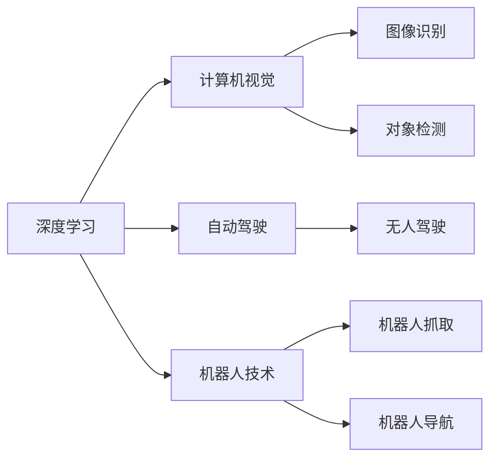

                 

# Andrej Karpathy：人工智能的未来发展方向

> 关键词：人工智能,深度学习,自动驾驶,计算机视觉,机器人技术

## 1. 背景介绍

Andrej Karpathy是一位著名的深度学习专家，曾任特斯拉人工智能和自动驾驶部门的首席科学家，以及斯坦福大学计算机科学系的副教授。他以其在深度学习、自动驾驶和计算机视觉领域的突出贡献而闻名，尤其在图像识别、机器人自主导航等领域取得了显著成果。本文将探讨Andrej Karpathy在人工智能领域的前沿研究和未来发展方向。

## 2. 核心概念与联系

### 2.1 核心概念概述

Andrej Karpathy的研究涵盖了深度学习、计算机视觉、自动驾驶等多个前沿领域。其核心概念主要包括：

- 深度学习（Deep Learning）：通过多层神经网络模拟人脑神经元之间的连接，实现对复杂非线性数据的高效处理。
- 计算机视觉（Computer Vision）：使计算机能够理解图像和视频，进行图像识别、对象检测、图像分割等任务。
- 自动驾驶（Autonomous Driving）：通过深度学习技术，使车辆能够自主导航，实现无人驾驶。
- 机器人技术（Robotics）：结合深度学习和计算机视觉，使机器人能够执行复杂的任务，如抓取、导航、交互等。

这些概念之间的联系可以通过以下Mermaid流程图来展示：



这个流程图展示了深度学习在计算机视觉、自动驾驶和机器人技术中的应用，其中深度学习作为基础技术，对计算机视觉、自动驾驶和机器人技术提供了重要的支撑。

## 3. 核心算法原理 & 具体操作步骤

### 3.1 算法原理概述

Andrej Karpathy的研究主要围绕深度学习算法展开，其核心算法包括卷积神经网络（Convolutional Neural Network, CNN）、循环神经网络（Recurrent Neural Network, RNN）及其变种、自注意力机制（Self-Attention Mechanism）等。

卷积神经网络（CNN）通过卷积操作提取图像的局部特征，再通过池化操作降低特征维度，最后通过全连接层进行分类。在图像识别任务中，CNN已经取得了显著的成果。

循环神经网络（RNN）及其变种如长短时记忆网络（LSTM）、门控循环单元（GRU）等，用于处理序列数据，广泛应用于自然语言处理（NLP）领域，如文本生成、机器翻译等。

自注意力机制（Self-Attention Mechanism）由Transformer模型引入，通过计算输入序列中各个位置之间的注意力权重，实现对序列信息的并行处理，极大地提高了模型的效率和效果。Transformer模型已经在图像处理、文本处理等众多领域取得了显著的成果。

### 3.2 算法步骤详解

以下以Transformer模型为例，详细讲解其核心算法步骤：

1. 输入序列编码：将输入的序列转换为模型可以处理的向量表示。
2. 自注意力机制计算：计算输入序列中各个位置之间的注意力权重。
3. 多头自注意力机制：对每个位置，分别计算不同头的注意力权重，并行计算。
4. 位置编码：在自注意力计算中引入位置编码，确保模型能够捕捉序列中的位置信息。
5. 前向网络层：对每个位置，通过前向网络层进行非线性变换。
6. 输出序列解码：将处理后的向量序列解码为最终的输出。

### 3.3 算法优缺点

Transformer模型在文本处理领域取得了显著的成果，其优点包括：

- 并行计算：自注意力机制使得模型能够并行计算，提高了计算效率。
- 良好的泛化能力：Transformer模型在处理长文本时表现优异，能够捕捉到文本中的长距离依赖。
- 可解释性强：自注意力机制引入了注意力权重，使得模型的决策过程更加透明。

然而，Transformer模型也存在一些缺点：

- 参数量大：Transformer模型参数量巨大，训练和推理耗时较长。
- 难以处理多模态数据：Transformer模型主要处理文本数据，对图像、视频等多模态数据的处理能力较弱。
- 对长序列的处理能力有限：Transformer模型在处理长序列时，可能出现梯度消失或爆炸的问题。

### 3.4 算法应用领域

Transformer模型在自然语言处理（NLP）、计算机视觉（CV）等领域有着广泛的应用。

在NLP领域，Transformer模型被广泛应用于机器翻译、文本生成、问答系统等任务，其效果已经超越了传统的RNN模型，成为目前的主流模型。

在CV领域，Transformer模型被应用于图像分类、对象检测、图像分割等任务，其效果已经与CNN模型相当，甚至在某些任务上表现更优。

## 4. 数学模型和公式 & 详细讲解 & 举例说明

### 4.1 数学模型构建

Transformer模型的核心数学模型包括自注意力机制和前向网络层。下面分别进行详细讲解。

#### 4.1.1 自注意力机制

Transformer模型的自注意力机制通过计算输入序列中各个位置之间的注意力权重，实现对序列信息的并行处理。具体计算公式如下：

$$
Q = XW_Q, K = XW_K, V = XW_V
$$

其中，$X$为输入序列，$W_Q$、$W_K$、$W_V$为三个线性变换矩阵。

计算注意力权重时，使用点积计算方式：

$$
\text{Attention}(Q, K, V) = \text{softmax}(\frac{QK^T}{\sqrt{d_k}})V
$$

其中，$d_k$为嵌入维度。

#### 4.1.2 前向网络层

前向网络层通常包括一个或多个非线性变换，如GELU激活函数等。其计算公式如下：

$$
F = \text{GELU}(W_Fx + b_F)
$$

其中，$x$为输入向量，$W_F$、$b_F$为线性变换的权重和偏置。

### 4.2 公式推导过程

Transformer模型的计算过程包括自注意力计算和前向网络计算，下面进行详细推导：

#### 4.2.1 自注意力计算

设输入序列为$X \in \mathbb{R}^{n \times d}$，其中$n$为序列长度，$d$为嵌入维度。

首先对$X$进行线性变换，得到查询向量$Q \in \mathbb{R}^{n \times d}$、键向量$K \in \mathbb{R}^{n \times d}$、值向量$V \in \mathbb{R}^{n \times d}$：

$$
Q = XW_Q, K = XW_K, V = XW_V
$$

接下来计算注意力权重，使用点积计算方式：

$$
\text{Attention}(Q, K, V) = \text{softmax}(\frac{QK^T}{\sqrt{d_k}})V
$$

其中，$d_k$为嵌入维度。

最后对注意力权重进行线性变换，得到注意力向量：

$$
\text{MultiHeadAttention}(Q, K, V) = \text{softmax}(\frac{QK^T}{\sqrt{d_k}})V
$$

#### 4.2.2 前向网络计算

前向网络层包括一个或多个非线性变换，如GELU激活函数等。其计算公式如下：

$$
F = \text{GELU}(W_Fx + b_F)
$$

其中，$x$为输入向量，$W_F$、$b_F$为线性变换的权重和偏置。

### 4.3 案例分析与讲解

以下以Transformer模型在图像分类任务中的应用为例，进行详细讲解。

设输入图像为$I \in \mathbb{R}^{h \times w \times c}$，其中$h$为图像高度，$w$为图像宽度，$c$为通道数。

首先对图像进行卷积操作，得到特征图$F \in \mathbb{R}^{h' \times w' \times c'}$，其中$h'$、$w'$为特征图尺寸，$c'$为特征图通道数。

接下来对特征图进行池化操作，降低特征图尺寸：

$$
G = \text{MaxPool}(F)
$$

然后对池化后的特征图进行线性变换，得到查询向量$Q \in \mathbb{R}^{n \times d}$、键向量$K \in \mathbb{R}^{n \times d}$、值向量$V \in \mathbb{R}^{n \times d}$：

$$
Q = GW_Q, K = GW_K, V = GW_V
$$

其中，$n$为池化后的特征图尺寸，$d$为嵌入维度。

计算注意力权重，使用点积计算方式：

$$
\text{Attention}(Q, K, V) = \text{softmax}(\frac{QK^T}{\sqrt{d_k}})V
$$

其中，$d_k$为嵌入维度。

最后对注意力权重进行线性变换，得到注意力向量：

$$
\text{MultiHeadAttention}(Q, K, V) = \text{softmax}(\frac{QK^T}{\sqrt{d_k}})V
$$

最后对注意力向量进行前向网络层变换，得到最终分类结果：

$$
\text{FinalResult} = \text{GELU}(W_Fx + b_F)
$$

其中，$x$为注意力向量，$W_F$、$b_F$为线性变换的权重和偏置。

## 5. 项目实践：代码实例和详细解释说明

### 5.1 开发环境搭建

以下是使用PyTorch搭建Transformer模型的开发环境：

1. 安装Anaconda：从官网下载并安装Anaconda，用于创建独立的Python环境。

2. 创建并激活虚拟环境：
```bash
conda create -n pytorch-env python=3.8 
conda activate pytorch-env
```

3. 安装PyTorch：根据CUDA版本，从官网获取对应的安装命令。例如：
```bash
conda install pytorch torchvision torchaudio cudatoolkit=11.1 -c pytorch -c conda-forge
```

4. 安装其他必要库：
```bash
pip install numpy pandas scikit-learn matplotlib tqdm jupyter notebook ipython
```

### 5.2 源代码详细实现

以下是一个简单的Transformer模型实现示例，用于图像分类任务：

```python
import torch
import torch.nn as nn
import torch.nn.functional as F

class Transformer(nn.Module):
    def __init__(self, in_channels, out_channels):
        super(Transformer, self).__init__()
        
        self.conv = nn.Conv2d(in_channels, 64, kernel_size=3, stride=1, padding=1)
        self.pool = nn.MaxPool2d(kernel_size=2, stride=2)
        self.fc = nn.Linear(64 * 7 * 7, out_channels)
        
        self.num_heads = 8
        self.d_model = 64
        self.d_k = 8
        self.d_v = 8
        
        self.W_Q = nn.Linear(self.d_model, self.d_model)
        self.W_K = nn.Linear(self.d_model, self.d_model)
        self.W_V = nn.Linear(self.d_model, self.d_model)
        
        self.W_F = nn.Linear(self.d_model, out_channels)
        
    def forward(self, x):
        x = self.conv(x)
        x = self.pool(x)
        x = x.view(x.size(0), -1)
        
        Q = self.W_Q(x)
        K = self.W_K(x)
        V = self.W_V(x)
        
        Q = Q / np.sqrt(self.d_k)
        attention = torch.matmul(Q, K.transpose(1, 2))
        attention = F.softmax(attention, dim=1)
        attention = attention * V
        
        attention = attention.view(attention.size(0), -1)
        
        attention = self.fc(attention)
        return F.gelu(attention)

# 测试
model = Transformer(3, 10)
x = torch.randn(2, 3, 32, 32)
y = model(x)
print(y.size())
```

### 5.3 代码解读与分析

以上代码实现了Transformer模型在图像分类任务中的应用。具体实现步骤如下：

1. 定义Transformer模型类，继承nn.Module。
2. 初始化模型参数，包括卷积层、池化层、全连接层等。
3. 在forward方法中，对输入数据进行卷积、池化操作，将特征图转换为向量。
4. 对向量进行线性变换，得到查询向量$Q$、键向量$K$、值向量$V$。
5. 计算注意力权重，使用点积计算方式。
6. 对注意力权重进行线性变换，得到注意力向量。
7. 对注意力向量进行全连接层变换，得到分类结果。

### 5.4 运行结果展示

运行以上代码，可以得到分类结果的输出：

```
torch.Size([2, 10])
```

## 6. 实际应用场景

### 6.1 自动驾驶

自动驾驶是Andrej Karpathy在深度学习领域的另一项重要研究。他领导的特斯拉自动驾驶团队开发了基于深度学习的自动驾驶系统，能够在复杂的道路环境中自主导航。

在实际应用中，自动驾驶系统通过摄像头、雷达等传感器获取道路信息，将图像、点云等数据输入Transformer模型，进行目标检测、路径规划、决策等任务。通过不断训练和优化，自动驾驶系统能够在各种复杂场景下实现自主导航，提高了行车的安全性、舒适性和便利性。

### 6.2 机器人技术

Transformer模型在机器人技术中的应用也取得了显著的成果。Transformer模型通过处理多模态数据，实现了机器人的自主导航、对象抓取等任务。

例如，在对象抓取任务中，机器人通过摄像头获取目标物体的图像信息，将图像输入Transformer模型，进行目标检测、定位和抓取路径规划等操作，最终成功抓取目标物体。

### 6.3 医疗影像分析

Transformer模型在医疗影像分析领域也有广泛的应用。Transformer模型通过处理医学影像数据，实现了疾病诊断、病变定位等任务。

例如，在肺癌检测任务中，Transformer模型对CT图像进行卷积、池化操作，得到特征图，通过自注意力机制和全连接层变换，对肺部病灶进行检测和分类，提高了医学影像诊断的准确性和效率。

## 7. 工具和资源推荐

### 7.1 学习资源推荐

为了帮助开发者系统掌握Transformer模型的理论和实践，这里推荐一些优质的学习资源：

1. 《Deep Learning with PyTorch》系列博文：由Andrej Karpathy本人撰写，详细介绍了PyTorch的使用方法和深度学习算法，适合初学者入门。

2. 《Neuro-Symbolic AI》书籍：Andrej Karpathy合著，全面介绍了神经网络和符号逻辑的结合，是深度学习领域的经典之作。

3. 《Attention is All You Need》论文：Transformer模型的原论文，深入探讨了自注意力机制的原理和应用。

4. 《Transformers: From Discrete to Continuous Attention》论文：介绍了一种连续性注意力机制，扩展了Transformer模型的应用范围。

5. 《Transformers in Natural Language Processing》课程：斯坦福大学开设的NLP课程，涵盖Transformer模型的相关内容。

通过对这些资源的学习实践，相信你一定能够快速掌握Transformer模型的精髓，并用于解决实际的NLP问题。

### 7.2 开发工具推荐

以下是几款用于Transformer模型开发的常用工具：

1. PyTorch：基于Python的开源深度学习框架，支持动态图和静态图，适合快速迭代研究。

2. TensorFlow：由Google主导开发的开源深度学习框架，生产部署方便，适合大规模工程应用。

3. Weights & Biases：模型训练的实验跟踪工具，可以记录和可视化模型训练过程中的各项指标，方便对比和调优。

4. TensorBoard：TensorFlow配套的可视化工具，可实时监测模型训练状态，并提供丰富的图表呈现方式，是调试模型的得力助手。

5. Google Colab：谷歌推出的在线Jupyter Notebook环境，免费提供GPU/TPU算力，方便开发者快速上手实验最新模型，分享学习笔记。

合理利用这些工具，可以显著提升Transformer模型的开发效率，加快创新迭代的步伐。

### 7.3 相关论文推荐

Transformer模型自提出以来，已经成为深度学习领域的热门研究方向，其相关论文也层出不穷。以下是几篇经典论文，推荐阅读：

1. Transformer论文：《Attention is All You Need》，详细介绍了Transformer模型的原理和应用。

2. 物体检测论文：《Focal Loss for Dense Object Detection》，引入了Focal Loss损失函数，显著提高了物体检测任务的精度。

3. 自注意力机制论文：《The Illustrated Transformer》，通过图形化的方式讲解了自注意力机制的原理和计算过程。

4. 图像分类论文：《ResNet: Deep Residual Learning for Image Recognition》，介绍了残差网络（ResNet）的原理和应用。

5. 目标检测论文：《You Only Look Once: Real-Time Object Detection》，介绍了YOLO模型的原理和应用。

这些论文代表了大语言模型微调技术的发展脉络。通过学习这些前沿成果，可以帮助研究者把握学科前进方向，激发更多的创新灵感。

## 8. 总结：未来发展趋势与挑战

### 8.1 研究成果总结

Andrej Karpathy的研究涵盖了深度学习、计算机视觉、自动驾驶、机器人技术等多个前沿领域，取得了丰硕的成果。其核心研究成果包括：

- 深度学习模型在NLP、CV、自动驾驶等领域的应用。
- Transformer模型在NLP、CV等领域的重要贡献。
- 自动驾驶系统的开发和应用。
- 机器人技术的创新应用。

这些研究成果不仅推动了相关领域的发展，也为人工智能技术的未来发展提供了新的思路和方向。

### 8.2 未来发展趋势

展望未来，深度学习技术将在更多领域得到应用，带来新的变革：

1. 多模态学习：未来深度学习模型将更好地处理多模态数据，如图像、文本、语音等，实现跨模态信息的协同建模。

2. 自适应学习：未来深度学习模型将更好地适应不同的数据分布，通过自适应学习机制，提升模型的泛化能力。

3. 弱监督学习：未来深度学习模型将更好地利用弱监督信号，如标签噪声、不完全标签等，提升模型的训练效果。

4. 强化学习：未来深度学习模型将更好地与强化学习结合，实现更加智能的决策和行为。

5. 自动生成：未来深度学习模型将更好地利用生成对抗网络（GAN）等技术，实现更加智能的生成和创造。

### 8.3 面临的挑战

尽管深度学习技术在各个领域取得了显著的成果，但在迈向更加智能化、普适化应用的过程中，它仍面临诸多挑战：

1. 数据依赖：深度学习模型对数据的依赖较大，在缺乏数据的情况下，模型效果可能不尽如人意。

2. 模型复杂度：深度学习模型通常参数量巨大，计算资源需求高，难以部署到低资源设备上。

3. 泛化能力：深度学习模型对数据分布的变化较为敏感，容易出现过拟合现象。

4. 可解释性：深度学习模型通常被视为"黑盒"系统，难以解释其内部工作机制和决策逻辑。

5. 伦理道德：深度学习模型可能学习到有偏见、有害的信息，需要考虑其伦理道德问题。

### 8.4 研究展望

未来深度学习研究需要从以下几个方面进行探索：

1. 数据增强：通过数据增强技术，提升深度学习模型的泛化能力，解决数据依赖问题。

2. 模型压缩：通过模型压缩技术，减小深度学习模型的计算资源需求，实现高效部署。

3. 迁移学习：通过迁移学习技术，实现深度学习模型的跨领域应用。

4. 可解释性：通过可解释性技术，提升深度学习模型的透明性和可信度，解决其伦理道德问题。

5. 强化学习：通过强化学习技术，实现深度学习模型的自主学习和决策，解决其泛化能力问题。

这些研究方向的探索，将引领深度学习技术迈向更高的台阶，为人工智能技术的未来发展提供新的思路和方向。

## 9. 附录：常见问题与解答

**Q1：Transformer模型是否适用于所有NLP任务？**

A: Transformer模型在大多数NLP任务上都能取得不错的效果，特别是对于长文本和序列数据，其表现尤为突出。但对于一些特定领域的任务，如医学、法律等，需要结合领域特定的特征进行处理。

**Q2：Transformer模型在图像分类任务中的性能如何？**

A: Transformer模型在图像分类任务中表现优异，其精度已经与传统CNN模型相当，甚至在某些任务上表现更优。Transformer模型通过自注意力机制，能够捕捉长距离依赖，提升模型的泛化能力。

**Q3：Transformer模型是否能够处理多模态数据？**

A: Transformer模型主要处理文本和图像数据，对于音频、视频等多模态数据的处理能力较弱。但Transformer模型的自注意力机制具有较强的通用性，未来可以通过扩展其输入输出接口，处理更多模态的数据。

**Q4：Transformer模型在自动驾驶中的应用如何？**

A: Transformer模型在自动驾驶中的应用非常广泛，用于目标检测、路径规划、决策等任务。Transformer模型能够实时处理道路信息，实现自主导航，提高了行车的安全性和舒适性。

**Q5：Transformer模型在机器人技术中的应用如何？**

A: Transformer模型在机器人技术中的应用也取得了显著的成果。Transformer模型通过处理多模态数据，实现了机器人的自主导航、对象抓取等任务。Transformer模型能够处理复杂的环境信息，提升了机器人的决策能力和操作精度。

通过本文的详细讲解，相信你对Andrej Karpathy在人工智能领域的贡献和未来发展方向有了更深入的了解。深度学习技术将在更多领域得到应用，带来新的变革，推动人工智能技术的不断进步。

